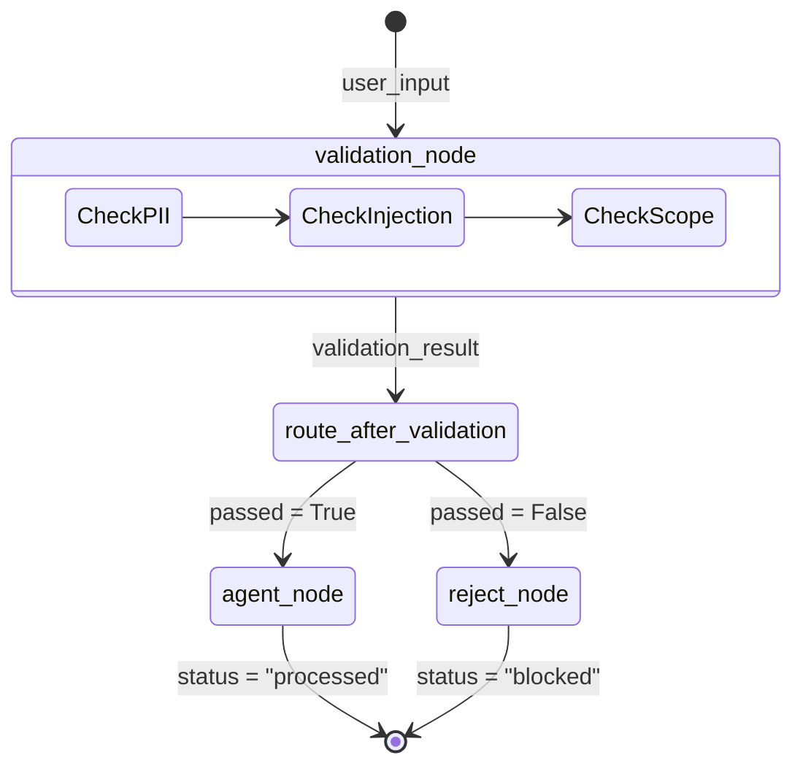

# Pattern A: Input Validation

## Overview
Input validation is the first line of defense in an Agentic AI system. It operates on the principle of halting unsafe, irrelevant, or maliciously crafted inputs *before* they ever reach the computationally expensive and potentially vulnerable Large Language Model (LLM). By enforcing deterministic guardrails at the entry point of the pipeline, the system conserves tokens, enhances security against prompt injections, and guarantees that the agent strictly operates within its designated domain. 

This pattern is typically implemented as a binary pass/fail gate. It separates the execution flow early: valid inputs proceed to the clinical agent for processing, while invalid inputs are routed to a dedicated rejection handler that generates safe, standardized fallback responses.

## Architecture & Design

The design isolates domain logic (the actual validation checks) from control flow (the routing mechanism). A dedicated graph node executes a suite of checks against the user's string, returning a result dictionary. A conditional edge router then inspects this result to decide the subsequent execution path.

### Low-Level Design (LLD)

**1. State Definition (`InputValidationState`)**
The graph state is a dictionary comprising:
- `user_input` (str): The raw text submitted by the user.
- `validation_result` (dict): The output of the deterministic checks (contains a boolean `passed`, a `reason`, and the specific `guardrail` tripped).
- `agent_response` (str): The final message to be delivered to the user.
- `status` (str): The execution outcome (`"processed"` or `"blocked"`).

**2. Node Definitions**
- `validation_node`: Executes lightweight, deterministic checks (e.g., regex for PII like SSNs or emails, keyword matching for prompt injections, out-of-scope intent detection). Updates the `validation_result` state.
- `agent_node`: The core LLM invocation. Only executed if validation passes. Updates the `agent_response` state.
- `reject_node`: The fallback handler. Only executed if validation fails. Constructs a safe error message detailing which guardrail was tripped.

**3. Conditional Routing (`route_after_validation`)**
A branching function evaluated continuously after the `validation_node`. It evaluates `state["validation_result"]["passed"]`. Returns `"agent"` if true, or `"reject"` if false.

## Execution Flow

## Implementation Insights

This pattern utilizes deterministic guardrails, which excel in scenarios requiring absolute predictability and negligible latency. Because the check involves static rules (like exact keyword matches or regex formulas), it has no instances of "hallucinations" and costs practically zero computational resources. 

However, its rigid nature means it acts as a blunt instrument. It shines when enforcing hard boundaries (e.g., "Never accept queries with this specific regex pattern"), but struggles with semantic nuance. This pattern is foundational and is almost always the very first node executed in any enterprise LangGraph system. By offloading the rejection handling to an independent `reject_node`, the architecture remains extensible; one could easily bolt on audit-logging, real-time alerting to a security team, or rate-limiting without altering the validation logic itself.
