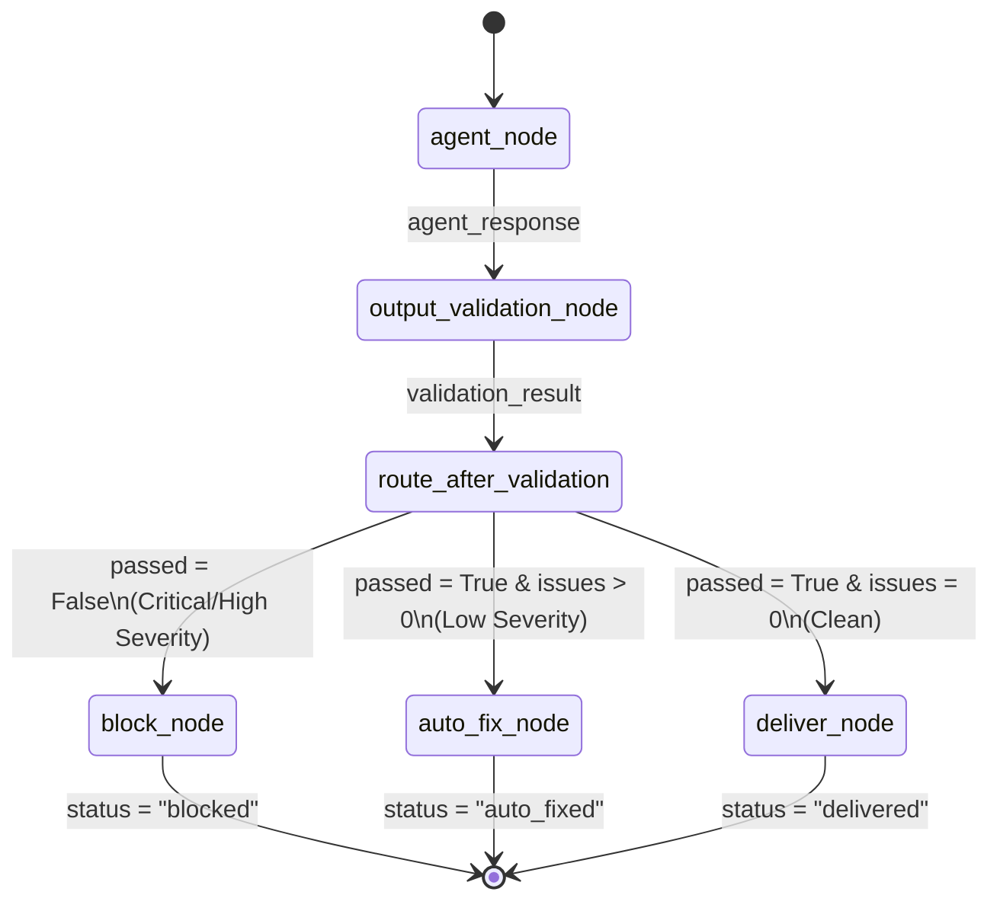

# Pattern B: Output Validation

## Overview
Output validation acts as the safety net of an Agentic AI pipeline. Operating on the principle of reviewing the LLM's raw response *before* delivering it to the user, it ensures that hallucinations, omitted disclaimers, or potentially harmful advice are intercepted. Unlike input validation, which is a rigid, binary "pass/fail" gate, analyzing an LLM's output introduces a spectrum of severity. 

This pattern implements a three-way triage system. Instead of forcing a false choice between delivering slightly flawed content or discarding a largely valuable response entirely, it introduces an "Auto-Fix" path. Minor infractions (like forgetting a mandatory medical disclaimer) are patched programmatically, saving the response. Critical violations (like dangerously low-confidence statements or prohibited recommendations) are strictly blocked.

## Architecture & Design

The validation function analyzes the generated text against deterministic rules, categorizing infractions by severity. The graph intelligently routes the flow based on the existence and severity of these issues.

### Low-Level Design (LLD)

**1. State Definition (`OutputValidationState`)**
The graph state carries the generative payload:
- `agent_response` (str): The raw response generated by the LLM.
- `confidence` (float): A self-assessed certainty metric from the LLM.
- `validation_result` (dict): Contains a boolean `passed`, a list of `issues` (with severity levels), an `issue_count`, and an optional `modified_output`.
- `final_output` (str): The ultimate message delivered to the user.
- `status` (str): `"delivered"`, `"auto_fixed"`, or `"blocked"`.

**2. Node Definitions**
- `agent_node`: The generative step producing the initial `agent_response`.
- `output_validation_node`: Executes heuristic checks against the text (e.g., searching for prohibited phrases like "stop all medications"). If minor issues are found (e.g., missing disclaimer), it preemptively creates a `modified_output` in the state.
- `deliver_node`: A pass-through that promotes `agent_response` to `final_output` untouched.
- `auto_fix_node`: Promotes the pre-computed `modified_output` to `final_output`.
- `block_node`: Replaces the response entirely with a standardized, safe fallback string indicating the policy violation.

**3. Conditional Routing (`route_after_validation`)**
A three-way decision switch acting on the validation result:
- `passed=False` (Critical/High severity): Routes to `"block"`.
- `passed=True` AND `issue_count > 0` (Low severity): Routes to `"auto_fix"`.
- `passed=True` AND `issue_count == 0` (Clean): Routes to `"deliver"`.

## Execution Flow

## Implementation Insights

Output validation handles structural and content guarantees reliably and deterministically. By leveraging the "auto-fix" pathway, operational efficiency drastically increases. It prevents user friction by repairing minor mistakes on the fly rather than halting the workflow with an error. 

The three tiers represent the triage philosophy common in robust AI systems. Highly sensitive domains (such as healthcare and finance) benefit immensely from this because the definition of a "violation" can be deeply stratified. "Guaranteed cure" translates to an instant block, while a missing "Consult your doctor" postfix triggers a seamless, silent append operation. This establishes a highly configurable perimeter that protects both the user from bad advice and the system from unnecessarily dropping valid transactions.
