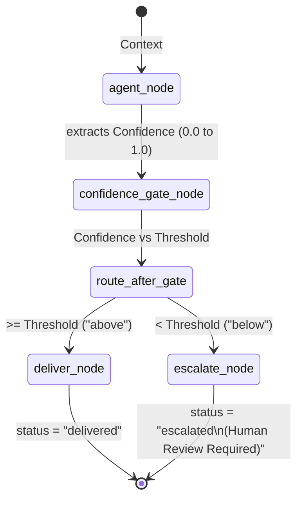

# Pattern C: Confidence Gating

## Overview
Confidence gating operates on the principle of self-awareness within an LLM. While output validation checks the *content* of a response for policy violations, confidence gating acts upon the agent's *self-assessed certainty* evaluating the *quality* of its own reasoning. 

When operating in high-stakes domains, LLMs often encounter ambiguous data or edge cases they lack the context to solve reliably. By prompting the model to explicitly quantify its certainty (e.g., from 0.00 to 1.00), the system acquires an invaluable heuristic. This pattern parses that metric and uses it to perform dynamic routing against a pre-configured threshold. Responses that meet the threshold are trusted and delivered; responses falling below it indicate the model is effectively "guessing", prompting the system to escalate the issue for human review.

## Architecture & Design

The confidence gating architecture intercepts the output payload immediately after generation but relies heavily on the specific system prompt provided to the LLM upstream, forcing it to append a parsable numerical confidence score.

### Low-Level Design (LLD)

**1. State Definition (`ConfidenceGateState`)**
The graph state requires specific metrics:
- `patient_case` (dict): Context provided to the agent.
- `agent_response` (str): The generated response text.
- `confidence` (float): The numerical certainty extracted from the LLM's output.
- `threshold` (float): The minimum acceptable confidence score. Crucially, this is set at *invocation time*, allowing dynamic thresholds per use case.
- `gate_result` (str): The relational outcome (`"above"` or `"below"`).
- `status` (str): `"delivered"` or `"escalated"`.

**2. Node Definitions**
- `agent_node`: The generative step. Its system prompt strictly mandates appending "Confidence: X.XX" to the output. A regex utility extracts this value and writes both the pure text and the float to the state.
- `confidence_gate_node`: A comparative node. It reads `state["confidence"]` and `state["threshold"]`, evaluating the math to write `"above"` or `"below"` to the state. It makes no routing decisions itself.
- `deliver_node`: Returns the response normally to the user.
- `escalate_node`: Flags the response for human intervention. In an enterprise system, this node would typically dispatch a payload to a queue, open a review ticket, or trigger an interrupt (`Human-in-the-loop`).

**3. Conditional Routing (`route_after_gate`)**
Reads `gate_result` mapping `"above"` directly to `"deliver"`, and `"below"` directly to `"escalate"`.

## Execution Flow

## Implementation Insights

Confidence gating elegantly handles the "known unknowns" problem. LLMs inherently generate statistically probable text; without a mechanism to flag uncertainty, they act confidently even when hallucinating. By actively probing for certainty, the system avoids delivering plausible-sounding but technically dubious advice.

The true strength of this pattern lies in the configurable `threshold` state parameter. The same underlying graph can be deployed across completely different risk environments. For example, a "Clinical Research Helper" internal tool might operate on a relaxed threshold of `0.30` (tolerating high uncertainty to foster brainstorming), while a patient-facing "Emergency Triage" system running the exact same code sets the threshold aggressively at `0.90` (escalating instantly at the slightest hint of ambiguity). 

It is important to note that confidence gating and output validation are entirely complementary. Validation checks external rules (compliance, formatting), whereas gating checks internal stability (likelihood of correctness).
