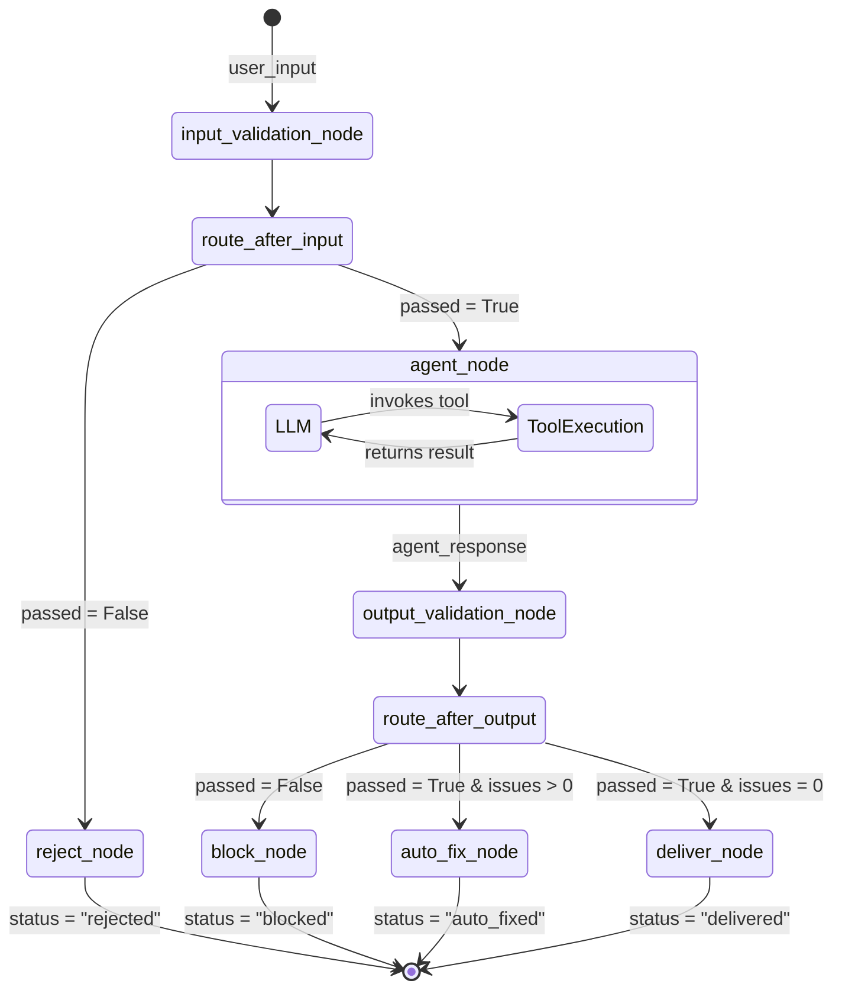

# Pattern D: Layered Validation (Defense in Depth)

## Overview
Layered Validation implements the "Defense in Depth" paradigm within an Agentic AI system. Instead of relying on a single chokepoint, it aggregates multiple, complimentary guardrail patterns (typically Input Validation and Output Validation) into one cohesive, end-to-end processing graph. 

The rationale behind layering is statistical coverage: no single validation technique catches every error. Input guardrails block obvious injection attempts and PII leaks early (saving expensive LLM tokens), but they cannot predict the model's generative hallucinations. Output guardrails scrub hallucinations and enforce formatting rules, but they rely on clean input contexts. By placing a real LLM agent—complete with function calling capabilities—sandwiched *between* these two deterministic layers, the system achieves maximum robustness. If one layer fails, the subsequent layer acts as a safety catch.

## Architecture & Design

The topology expands into a multi-stage pipeline where any layer can independently prematurely end execution if it encounters a critical violation.

### Low-Level Design (LLD)

**1. State Definition (`LayeredState`)**
A composite state capturing both input and output phases:
- `user_input` (str): Raw starting text.
- `patient_case` (dict): Context parameters.
- `input_result` (dict): Dictates whether the graph proceeds to the agent.
- `messages` (list): The interaction history for the agent.
- `agent_response` (str): The raw generation payload.
- `output_result` (dict): Dictates the final routing choice.
- `final_output` (str) & `status` (str): Terminal state values.

**2. Node Definitions**
The nodes are imported and aggregated from prior patterns:
- `input_validation_node`: Executes Layer 1 (pre-generation).
- `agent_node`: Layer 2. A true ReAct loop equipped with external tools (e.g., `analyze_symptoms`, `assess_patient_risk`). 
- `output_validation_node`: Executes Layer 3 (post-generation).
- **Terminal Nodes**: `deliver_node`, `auto_fix_node`, `block_node` (from Output Validation), and `reject_node` (from Input Validation).

**3. Conditional Routing (`route_after_input` & `route_after_output`)**
- `route_after_input`: Checks `input_result`. Proceeds to `"agent"` or diverts to `"reject"`.
- `route_after_output`: A 3-way triage of `output_result` (Deliver/Auto-Fix/Block).

## Execution Flow

## Implementation Insights

This pattern explicitly demonstrates the cost-saving power of early rejection. Queries riddled with PII or injection phrases fail at Layer 1; the computationally expensive Agent (Layer 2) is never invoked, reserving tokens for valid queries. Conversely, the LLM may introduce its own biases, hallucinations, or drop mandatory legal disclaimers—Layer 3 catches these anomalies. 

Because each layer maps structurally to a literal LangGraph node and edge, the entire security posture of the application becomes visible and traceable in LangSmith (or any tracing dashboard). This modular architecture is infinitely extensible: one could trivially insert an additional layer (like a database query filter node) without destabilizing the rest of the flow.
