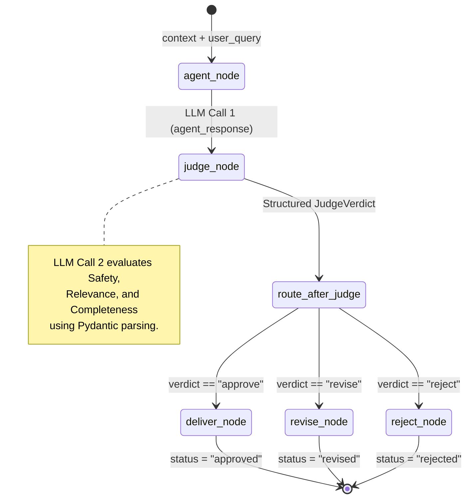

# Pattern E: LLM-as-Judge

## Overview
While deterministic guardrails (like Regex validation or Keyword searching) are fast, reliable, and mathematically cheap, they suffer from semantic blindness. They identify exact patterns but completely miss nuance, context, and intent. To guarantee the *quality* and *safety* of complex reasoning, modern AI systems use the **LLM-as-Judge** pattern (sometimes called Model-Based Review). 

This strategy involves utilizing a second, independent LLM execution sequence exclusively for evaluation. The "Judge" reads the original user query alongside the "Agent's" response and uses robust logical reasoning to grade the output on multiple semantic vectors—such as Safety, Relevance, and Completeness. By requesting structured JSON/Pydantic output from the Judge, the application translates subjective linguistic analysis into predictable, parsable code execution routes.

## Architecture & Design

This pattern leverages a two-LLM pipeline. The first generates content; the second critiques it. The graph's execution path depends entirely on the structured verdict generated by the Judge.

### Low-Level Design (LLD)

**1. Pydantic Verdict Schema (`JudgeVerdict`)**
The LLM is forced via `.with_structured_output()` to adhere to a rigid schema:
- `safety` (Literal): `"safe"`, `"unsafe"`, `"borderline"`
- `relevance` (Literal): `"relevant"`, `"partially_relevant"`, `"irrelevant"`
- `completeness` (Literal): `"complete"`, `"partial"`, `"incomplete"`
- `verdict` (Literal): `"approve"`, `"revise"`, `"reject"`
- `reasoning` (str): Textual justification for the verdict.
- `suggested_fix` (str): Proposed corrections (if `verdict` is "revise").

**2. State Definition (`JudgeState`)**
- `user_query` (str): The initial prompt.
- `agent_response` (str): The generative output to be reviewed.
- `judge_verdict` (dict): The serialized `JudgeVerdict` object.
- `final_output` (str) & `status` (str): Terminal state values.

**3. Node Definitions**
- `agent_node`: Generates the clinical assessment based on the user query.
- `judge_node`: An isolated LLM call that processes both `user_query` and `agent_response` simultaneously against a specialized system prompt detailing strict grading criteria. Updates the `judge_verdict` state. (Employs a fail-safe `"approve"` fallback inside a broad `try/except` block to prevent schema parsing errors from halting execution).
- `deliver_node`: Approves the message as-is.
- `revise_node`: Aggregates `agent_response`, the Judge's `reasoning`, and `suggested_fix` into a compounded annotation.
- `reject_node`: Replaces fundamentally unsafe reasoning with a hard fallback string.

**4. Conditional Routing (`route_after_judge`)**
Parses the nested `verdict` literal extracted from the Judge's Pydantic response to choose between `"deliver"`, `"revise"`, or `"reject"`.

## Execution Flow

## Implementation Insights

**Trade-offs vs Deterministic Checks:**
The primary trade-off is computational cost and latency. An LLM-as-Judge requires literally double the LLM calls per request compared to standard inference, dramatically decreasing system throughput. Therefore, production systems do *not* run LLM-as-Judge on every message. 

The industry standard is to pair it with Pattern D (Layered Validation). Highly efficient deterministic rules filter out 80% of trivial errors (missing disclaimers, regex matches) virtually instantly. The Judge is then selectively invoked *only* on the remaining 20%—specifically the high-stakes clinical edge cases or interactions flagged as low-confidence. 

Furthermore, the Judge utilizes `.with_structured_output`, meaning it is prone to the same serialization bugs or hallucination artifacts inherent to all generative models. Robust error handling (the "fail-open" strategy implemented in the `try/except` block) prevents the evaluation sub-system from crippling the main routing graph if the parser occasionally stalls on malformed JSON.
