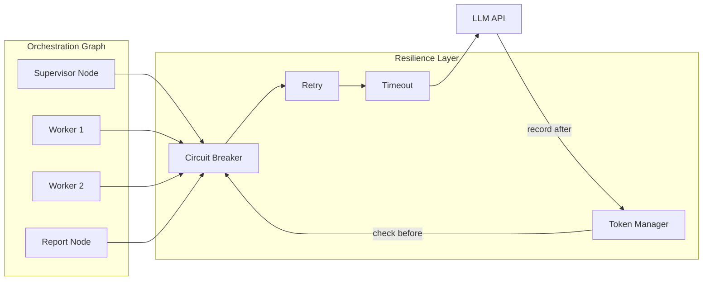

# Resilience-to-MAS Mapping

This document describes where each resilience pattern is applied in the LangGraph multi-agent system and why. It is the single source of truth for rationale and configuration.

**Scope**: This doc covers the MAS patterns under `scripts/` (handoff, orchestration, MAS_architectures, etc.). It explicitly **excludes** `script_XX` scripts and any `_bckp` files.

---

## Overview

The resilience module provides patterns that protect LLM-backed multi-agent systems from cascading failures, quota exhaustion, and runaway costs. Patterns are applied **only where necessary** — no overengineering. Each pattern has a clear rationale and is configurable.

---

## Pattern-to-MAS Mapping Table

| Pattern | Where Applied | Rationale | Skip When |
|---------|---------------|------------|-----------|
| **Circuit breaker** | Shared LLM API used by multiple agents | One breaker per API (e.g. `CircuitBreakerRegistry.get_or_create("orchestration_llm_api", ...)`) so all specialist/synthesis calls fail fast when the API is down; avoids redundant failing calls. | Single-call or dev-only scripts. |
| **Retry** | Every LLM invoke in orchestration | Transient failures (429, timeouts, connection errors) are common; retry with backoff/jitter is standard. | Health checks or non-idempotent actions (not the case for read-only specialist/synthesis). |
| **Timeout** | Every LLM invoke | Prevents one hung call from blocking the graph and exhausting resources. | Only if caller already enforces a deadline. |
| **Token budget** | Workflows with multiple LLM calls (orchestration) | Cost guardrail; check before call, record after; fail fast before runaway in multi-specialist runs. **NOW ENABLED in supervisor_orchestration** as reference implementation. | Single-step or low-cost demos; can be disabled by not passing token_manager. |
| **Rate limiter** | Optional at orchestration layer | When supervisor + N workers hit the same provider, a shared sliding-window limiter smooths bursts and avoids 429s. | Single-tenant or high-quota environments; default off or high limit. |
| **Bulkhead** | Optional for parallel-heavy patterns | In dynamic_router or fan-out flows, a per-agent or per-role pool prevents one branch from starving others. | Linear (supervisor → one worker) flows; default off. |
| **Fallback chain** | Not in base implementation | Provider failover (e.g. GPT → Claude) is optional and provider-specific; keep in integration example and doc only. | — |

---

## Where Resilience Is Implemented

### Orchestration Base (Primary Integration)

**File**: `scripts/orchestration/_base/orchestrator.py`

Resilience is wired into `BaseOrchestrator.invoke_specialist()` and `invoke_synthesizer()`. All five orchestration patterns inherit from this base and therefore use resilience:

- `supervisor_orchestration`
- `peer_to_peer_orchestration`
- `dynamic_router_orchestration`
- `graph_of_subgraphs_orchestration`
- `hybrid_orchestration`

**Patterns applied** (always on):

- Circuit breaker (shared via `CircuitBreakerRegistry`)
- Retry (transient errors only)
- Timeout (per-call deadline)
- Rate limiter (ENABLED — `skip_rate_limiter=False`)

**Patterns applied per-pattern** (opt-in):

- Token budget (ENABLED in `supervisor_orchestration`; pass `token_manager` via state for other patterns)

**Patterns skipped per-call** (default):

- Bulkhead (`skip_bulkhead=True`)

### Token Budget Status

**NOW ENABLED IN**: `supervisor_orchestration` (reference implementation)

**DESTINATION nodes** (where checks occur):
- `scripts/orchestration/supervisor_orchestration/agents.py`:
  - `pulmonology_worker_node` (line 157)
  - `cardiology_worker_node` (line 177)
  - `nephrology_worker_node` (line 197)
  - `report_synthesis_node` (line 217)

**See**: `scripts/orchestration/supervisor_orchestration/TOKEN_BUDGET_GUIDE.md` for complete integration pattern, enterprise rationale, cost examples, and detailed WHERE/HOW/WHY explanation.

**SHOULD ALSO BE USED** (but currently is not):
- Other orchestration patterns: `peer_to_peer`, `dynamic_router`, `hybrid` — 4–5 LLM calls per workflow
- MAS_architectures: `reflection_self_critique` (generator → critic loop), `parallel_voting` (3+ specialists), `adversarial_debate` (5 LLM calls)

**WHY ENABLED IN SUPERVISOR**: Token budget requires per-workflow state management. Each workflow run needs a fresh `TokenManager` instance passed via graph state. The supervisor pattern now demonstrates this enterprise pattern: create `TokenManager` in `runner.py`, inject into state, pass to invoke methods, display usage summary.

**HOW TO ENABLE IN OTHER PATTERNS**:
1. Add `token_manager: object | None` and `token_usage_summary: dict | None` to the state TypedDict
2. Update worker/synthesis nodes to pass `token_manager=state.get("token_manager")` to invoke methods
3. Create `TokenManager` in `runner.py` and inject into `initial_state`
4. Display usage summary after `graph.invoke()`

**No changes needed to `orchestrator.py`** — the optional `token_manager` param is already implemented.

### Other Script Folders (Optional Adoption)

The following are **not wired** to resilience in this phase. They may adopt the same pattern or a future shared helper:

- `scripts/handoff/` — linear_pipeline, conditional_routing, command_handoff, supervisor, parallel_fanout, multihop_depth_guard
- `scripts/MAS_architectures/` — supervisor, sequential_pipeline, parallel_voting, adversarial_debate, etc.
- `scripts/guardrails/`, `scripts/HITL/`, `scripts/memory_management/`, `scripts/observability_and_traceability/`, `scripts/tools/`

To add resilience to these, either:

1. Copy the pattern from `orchestrator.py` (shared breaker + ResilientCaller).
2. Use the reference in `resilience/langgraph_integration_example.py`.
3. Adopt a future shared helper (e.g. `invoke_llm_resilient()`) when available.

---

## Architecture Diagram

All nodes share the same circuit breaker. Token manager is enabled in supervisor_orchestration (opt-in for other patterns via state injection). Rate limiter is enabled by default; bulkhead is skipped for orchestration flows.

---

## Configuration

Configuration is defined in `resilience/config.py`. The orchestration base uses:

| Config | Default | Purpose |
|--------|---------|---------|
| `CircuitBreakerConfig` | `fail_max=5`, `reset_timeout=60` | Consecutive failures before open; seconds until half-open test |
| `RetryConfig` | `max_retries=3`, `initial_wait=1.0`, `max_wait=30.0` | Retry attempts and backoff bounds |
| `TimeoutConfig` | `default_timeout=30.0` | Per-call deadline in seconds |
| `RateLimiterConfig` | `max_calls=60`, `period=60.0`, `block=True` | ENABLED; max calls per period (60 RPM) |
| `TokenBudgetConfig` | `max_tokens_per_workflow=8_000`, `max_tokens_per_agent=3_000` | ENABLED in supervisor_orchestration; pass TokenManager via state for other patterns |
| `BulkheadConfig` | Skipped per-call | Set `skip_bulkhead=False` to enable |

To disable rate limiter: set `skip_rate_limiter=True` in `_ORCHESTRATION_CALLER.call()`.
To enable token budget in other patterns: add `token_manager` field to state, create `TokenManager` in runner, pass to invoke methods. See `supervisor_orchestration/TOKEN_BUDGET_GUIDE.md` for the complete pattern.

---

## Error Handling

Resilience exceptions are mapped to workflow state so downstream nodes can continue:

| Exception | Mapping | Downstream Behavior |
|-----------|----------|---------------------|
| `CircuitBreakerOpen` | `OrchestrationResult(was_successful=False, error_message=...)` | Synthesis skips failed specialist; report uses only successful results |
| `TimeoutExceeded` | Same | Same |
| `TokenBudgetExceeded` | Same | Same |
| `RateLimitExhausted` | Same | Same |
| `BulkheadFull` | Same | Same |
| Other `ResilienceError` | Same | Same |
| Generic `Exception` | Same | Same |

For `invoke_synthesizer`, resilience exceptions are re-raised as `RuntimeError` so the caller (e.g. report node) can handle synthesis failure (e.g. return a partial or error report).

---

## References

- **Full node-level example**: `resilience/langgraph_integration_example.py` — shows triage → specialist → summariser with shared breaker, token manager, and per-node error handling.
- **Production integration point**: `scripts/orchestration/_base/orchestrator.py` — the single place where resilience is wired for orchestration patterns.
