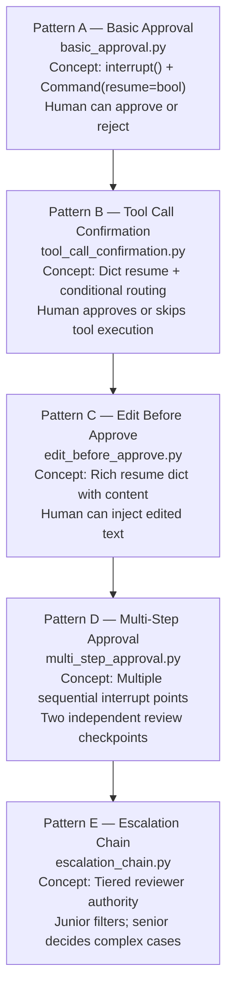
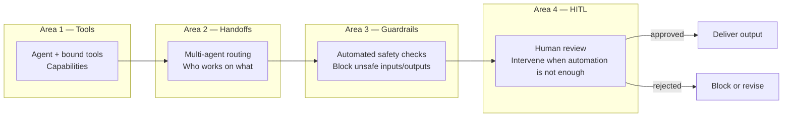

# Chapter 0 — Human-in-the-Loop (HITL) Patterns: An Overview

> **Reading time:** ~20 minutes. Read this chapter before opening any of the five pattern chapters.

---

## 1. What Is Human-in-the-Loop (HITL) in an Agentic AI System?

Imagine an air traffic controller overseeing a dozen aircraft managed by an autopilot system. The autopilot handles routine navigation flawlessly. But when a storm appears, a runway is closed, or two aircraft are on a collision course, the autopilot does not make the final call — the controller does. The controller does not fly every plane manually; they intervene at the moments when the stakes are too high for automation alone. When the controller acts, the plane holds its position, waiting for instructions. Nothing happens until the controller makes a decision and transmits it.

**HITL in LangGraph works exactly like that controller.** An AI agent runs its pipeline automatically — calling tools, reading state, generating outputs. At a designated checkpoint, the pipeline physically stops. A structured payload describing "what the AI has produced and what decision is needed" is surfaced to a human reviewer. Nothing in the pipeline continues until the human provides their decision. When the human acts, the pipeline resumes from where it stopped, carrying the human's input forward.

This is fundamentally different from adding a `if needs_review: print("⚠ REVIEW NEEDED")` text banner in your output. That banner is cosmetic — the pipeline has already finished running. In a true HITL implementation:

1. **`interrupt(payload)`** — Physically pauses graph execution. State is saved to a checkpointer. The pipeline freezes.
2. **`Command(resume=value)`** — Resumes the frozen graph, passing the human's decision directly to the node that originally called `interrupt()`.

The human's decision becomes part of the graph's state and influences every node that runs after the interrupt point.

---

## 2. Why LangGraph for HITL (vs Ad-Hoc Flags and Booleans)?

Consider the naive approach:

```python
# Naive approach — DO NOT do this
result = agent.run(patient_case)
if result.needs_review:            # Flag set by agent
    human_decision = input("Approve? (y/n): ")  # Blocking console call
    if human_decision == "y":
        deliver(result)            # Pipeline just resumes with an if/else
    else:
        reject(result)
```

This appears to work in a demo. In a real system it fails because:

1. **It is invisible in traces.** There is no record of when the pause happened, who reviewed it, what they decided, or how long they took.
2. **It is not recoverable.** If the process crashes between the LLM call and the human input, the state is lost. The agent must start over.
3. **It does not compose.** Adding a second review checkpoint requires a deeply nested `if/else` chain, not an additional graph node.
4. **The interrupt and resume happen in different processes in production.** A web API receives the initial request. A different API endpoint receives the human's decision hours later. Ad-hoc `input()` calls cannot span network boundaries.

**LangGraph's HITL primitives solve all four problems:**

- **`MemorySaver` (or any checkpointer)** — State is saved to persistent storage at the interrupt point. The graph can be resumed hours or days later, in a completely different process.
- **`thread_id`** — Each workflow run has a unique ID. The `thread_id` is the key that links "first call" to "resume call". Multiple concurrent workflows never interfere with each other.
- **Structured payloads** — `interrupt(payload)` passes a structured dict (the `InterruptPayload`) to the caller. Review UIs can render any interrupt type without special-casing, because all payloads follow the same shape.
- **State as audit trail** — Every node's output is persisted in state. After the pipeline completes, `state["junior_decision"]`, `state["final_output"]`, and `state["status"]` are all readable records of what happened.

---

## 3. The Five HITL Patterns — Learning Progression

The five patterns form a deliberate learning sequence. Each introduces one new concept:



Each arrow means: "You need to understand this pattern before the next one makes sense."

---

## 4. Pattern Comparison Table

| Pattern | Script | HITL Type | What the Human Can Do | When to Use |
|---------|--------|-----------|----------------------|-------------|
| **A — Basic Approval** | `basic_approval.py` | Single boolean gate | Approve or reject | Any high-stakes output that needs a simple yes/no gate before delivery |
| **B — Tool Confirmation** | `tool_call_confirmation.py` | Pre-execution gate for tool calls | Execute or skip a tool call | Tools with side effects (database writes, API calls, irreversible actions) |
| **C — Edit Before Approve** | `edit_before_approve.py` | Approval with human-injected content | Approve as-is, edit text, or reject with reason | Outputs that are usually good but often need minor human corrections |
| **D — Multi-Step Approval** | `multi_step_approval.py` | Sequential dual gate | Approve/reject at step 1; if approved, approve/reject at step 2 | Workflows with multiple distinct deliverables, each needing independent approval |
| **E — Escalation Chain** | `escalation_chain.py` | Tiered authority | Junior: approve/escalate/reject; Senior: approve/reject | High-volume workflows where a junior reviewer can handle most cases and only escalates to a senior for uncertain ones |

---

## 5. How HITL Patterns Compose with the Rest of the System

HITL does not replace tools, handoffs, or guardrails. It adds a human layer that sits between them. Think of the overall architecture as four concentric rings:



**When to use each layer:**

- **Tools (Area 1)** — When the agent needs to query external data or execute an action (clinical tools, search APIs, databases).
- **Handoffs (Area 2)** — When work needs to move between specialised agents (triage → pharmacology → report).
- **Guardrails (Area 3)** — When you can express safety rules as deterministic Python checks or as an LLM-as-judge evaluation (reject PII, validate output format, flag low-confidence responses).
- **HITL (Area 4)** — When automation alone is not sufficient: the stakes are too high, the rules are too complex to encode as guardrails, or the human needs to inject domain knowledge the AI does not have.

> **TIP:** Guardrails are cheaper than HITL. Before adding an HITL gate, ask whether the same safety check can be expressed as a guardrail. Reserve HITL for cases where genuine human judgment is required — not just for cases where you are not confident in the AI.

---

## 6. Key Vocabulary Introduced in This Module

| Term | Plain-English Meaning | First appears in |
|------|-----------------------|-----------------|
| `interrupt(payload)` | Pauses graph execution; saves state to checkpointer; surfaces payload to caller | Chapter 1 |
| `Command(resume=value)` | Resumes a paused graph; passes `value` back to the node that called `interrupt()` | Chapter 1 |
| `MemorySaver` | LangGraph's in-memory checkpointer; required for `interrupt()` to save state | Chapter 1 |
| `thread_id` | The unique ID that identifies one workflow run; links the initial call to all resume calls | Chapter 1 |
| Node restart | When a node resumes, it restarts from line 1; idempotent code goes before `interrupt()` | Chapter 1 |
| `__interrupt__` | The key in the `graph.invoke()` return dict that contains the interrupt payload | Chapter 1 |
| `build_approval_payload()` | `hitl.primitives` helper that creates a standardised interrupt payload for yes/no approval | Chapters 1, 4 |
| `build_tool_payload()` | `hitl.primitives` helper for tool-call confirmation payloads | Chapter 2 |
| `build_edit_payload()` | `hitl.primitives` helper for approve/edit/reject payloads | Chapter 3 |
| `build_escalation_payload()` | `hitl.primitives` helper for tiered escalation payloads with `reviewer_role` | Chapter 5 |
| `parse_resume_action()` | `hitl.primitives` helper that normalises any resume value (bool, str, dict) to a standard dict | Chapters 2–5 |
| `run_hitl_cycle()` | `hitl.run_cycle` helper that handles the two-call invoke/pause/resume for a single interrupt | Chapters 1–3 |
| `run_multi_interrupt_cycle()` | `hitl.run_cycle` helper that handles N sequential interrupts using a `resume_sequence` list | Chapters 4–5 |

---

## 7. Reading Order Guide

Read the chapters in order. Each is self-contained, but the concepts build progressively.

| Chapter | File | One-line description |
|---------|------|----------------------|
| **This file** | [`00_overview.md`](./00_overview.md) | What HITL is, why LangGraph, all five patterns at a glance. |
| **Chapter 1** | [`01_basic_approval.md`](./01_basic_approval.md) | The foundational interrupt/resume cycle; boolean approval; `MemorySaver` and `thread_id` explained from scratch. |
| **Chapter 2** | [`02_tool_call_confirmation.md`](./02_tool_call_confirmation.md) | Intercept tool calls before execution; dict resume values; conditional routing after an HITL gate. |
| **Chapter 3** | [`03_edit_before_approve.md`](./03_edit_before_approve.md) | Rich resume payloads; the human injects edited content into the pipeline; three outcomes from one interrupt. |
| **Chapter 4** | [`04_multi_step_approval.md`](./04_multi_step_approval.md) | Two sequential interrupt points in one graph; `run_multi_interrupt_cycle`; early rejection prevents downstream LLM calls. |
| **Chapter 5** | [`05_escalation_chain.md`](./05_escalation_chain.md) | Junior reviewer filters easy cases; complex cases escalate to the attending physician; tiered authority modelled as conditional interrupt paths. |

---

*Continue to [Chapter 1 — Basic Approval](./01_basic_approval.md).*
