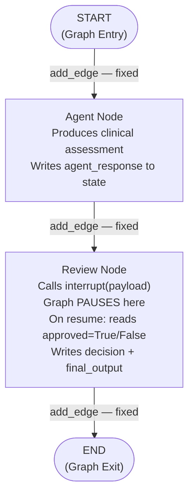

# Chapter 1 — Pattern A: Basic Approval

> **Prerequisite:** Read [Chapter 0 — Overview](./00_overview.md) first to understand where this pattern fits in the HITL learning sequence.

---

## 1. What Is This Pattern?

Imagine a junior doctor in a teaching hospital who has just completed their clinical assessment. Hospital protocol requires that before any recommendation reaches the patient, a supervising physician must review and sign off on it. The junior doctor writes up their notes and places them in the supervising physician's inbox. Nothing happens until the supervisor reads the notes and either approves them (adds their signature) or rejects them (returns them with comments). Only after that approval does the recommendation reach the patient.

**Basic Approval in LangGraph is that signature process.** An agent produces an output, and then the graph physically pauses. A structured payload describing the output and the question is surfaced to the caller. The pipeline stays frozen — no node runs, no code executes — until a human provides their decision via `Command(resume=True)` (approve) or `Command(resume=False)` (reject). The resume value flows back into the paused node, and the graph continues to `END`.

This is the **foundational HITL pattern**. Every subsequent pattern (B through E) builds on what you learn here: the two-call invoke/pause/resume cycle, the role of `MemorySaver`, the meaning of `thread_id`, and the critical node restart behaviour.

---

## 2. When Should You Use It?

**Use this pattern when:**

- Your agent produces an output where a simple yes/no approval from a human is sufficient before delivery.
- The stakes are high enough that automated guardrails alone are not trustworthy — a clinician, legal reviewer, or compliance officer must have the final say.
- You need a complete audit trail: state preserves `decision` (`"approved"` or `"rejected"`) and `final_output` for every run.
- You are learning LangGraph's HITL mechanics and want the simplest possible example before moving to richer patterns.

**Do NOT use this pattern when:**

- The human needs to modify the AI's output, not just approve or reject it — use [Pattern C (Edit Before Approve)](./03_edit_before_approve.md) instead.
- There are multiple review checkpoints in the same workflow — use [Pattern D (Multi-Step Approval)](./04_multi_step_approval.md).
- The approval decision should trigger conditional routing to different downstream nodes — use [Pattern B (Tool Call Confirmation)](./02_tool_call_confirmation.md) as a model for adding routing.

---

## 3. How It Works — Architecture Walkthrough

### ASCII Graph (from the script's docstring)

```
[START]
   |
   v
[agent]            <-- simulated agent (focus on HITL mechanics)
   |
   v
[review]           <-- interrupt(payload) PAUSES HERE
   |
   |   <- graph is frozen, state saved to MemorySaver ->
   |
   |   <- Command(resume=True/False) resumes ->
   |
   +-- approved=True  -> status="approved", deliver
   +-- approved=False -> status="rejected", safe fallback
   |
   v
[END]
```

### Step-by-Step Explanation

**Edge: START → agent**
`START` is LangGraph's built-in sentinel entry point. The fixed `add_edge(START, "agent")` means the graph always begins at `agent_node`. Nothing runs before it.

**Node: `agent`**
The agent node produces the output that needs review. In this script, it uses a fixed simulated response (to keep the focus on HITL mechanics, not LLM behaviour). In production, this would be a real LLM call. The agent writes `agent_response` to state.

**Edge: agent → review (fixed)**
`add_edge("agent", "review")` is unconditional. After the agent produces its output, review always follows.

**Node: `review`**
This is where HITL happens. The node calls `interrupt(payload)` which:
1. Saves the entire current state to `MemorySaver` (keyed by `thread_id`).
2. Returns the payload to the `graph.invoke()` caller in `result["__interrupt__"]`.
3. Freezes execution. Nothing after `interrupt()` runs until `Command(resume=...)` is called.

When the human calls `graph.invoke(Command(resume=True/False), config)`, the node **restarts from line 1**. It runs idempotent setup code (reading `state["agent_response"]`) and then reaches `interrupt()` again. This time, `interrupt()` finds a waiting `Command(resume=value)` and returns that value **immediately**. The decision code (`if approved:`) runs, and the node writes `decision` and `final_output` to state.

**Edge: review → END (fixed)**
After `review_node` completes (post-resume), the graph transitions to `END` unconditionally. `graph.invoke()` returns the final state to the caller.

### Mermaid Flowchart



---

## 4. State Schema Deep Dive

```python
class ApprovalState(TypedDict):
    query: str           # Set at invocation time — the question being answered
    agent_response: str  # Written by: agent_node; Read by: review_node
    decision: str        # Written by: review_node ("approved" | "rejected")
    final_output: str    # Written by: review_node — the text delivered to the user
```

**Field: `query: str`**
- **Who writes it:** Set at invocation time in the initial state dict (`"67M with BNP 650, progressive dyspnea..."`).
- **Who reads it:** Available to `agent_node` if it wants to build a prompt from the query. In this demo script, the agent ignores it (fixed response), but in production the agent would read `state["query"]` to generate its response.
- **Why it exists as a separate field:** Separating the input query from the agent's response makes both readable independently. Monitoring tools can log `query` and `agent_response` without parsing the `messages` accumulator.

**Field: `agent_response: str`**
- **Who writes it:** `agent_node` — writes the full text of the clinical assessment.
- **Who reads it:** `review_node` — reads it to build the interrupt payload and to include in `final_output` if approved.
- **Why it exists as a separate field:** Rather than filtering `messages` for the final AI text, `review_node` reads a clean named field. This is simpler than the message-filtering pattern used in the handoff module.

**Field: `decision: str`**
- **Who writes it:** `review_node` — writes `"approved"` or `"rejected"` based on the resume value.
- **Who reads it:** The caller of `graph.invoke()` reads it after completion to check the outcome.
- **Why it exists as a separate field:** A machine-readable decision field separate from the human-readable `final_output`. Monitoring dashboards, audit systems, and downstream logic can read `state["decision"]` without text parsing.

**Field: `final_output: str`**
- **Who writes it:** `review_node` — writes `agent_response` (if approved) or a safe fallback message (if rejected).
- **Who reads it:** The caller of `graph.invoke()` reads it as the final deliverable.
- **Why it exists as a separate field:** Separates the AI's raw output from the final authorised output. If approved, they are the same. If rejected, `final_output` is a safe fallback. The caller always reads `final_output` — never `agent_response` — for the delivered text.

> **NOTE:** This state schema intentionally has no `messages: Annotated[list, add_messages]` field. Pattern A is a simulated agent, so there are no LangChain message objects to accumulate. Patterns B–E add `messages` because they use real LLM calls with `HumanMessage`/`SystemMessage`/`AIMessage` objects that need to be tracked.

---

## 5. Node-by-Node Code Walkthrough

### `agent_node`

```python
def agent_node(state: ApprovalState) -> dict:
    """
    Simulated clinical agent.

    Uses a fixed response to keep focus on interrupt() mechanics.
    In production, this would call llm.invoke().
    """
    response = (                                      # Fixed response — no LLM call
        "Based on elevated BNP (650 pg/mL) and progressive dyspnea, "
        "this patient likely has early-stage heart failure (NYHA Class II). "
        "Recommend initiating ACEi + beta-blocker + SGLT2i per 2024 guidelines. "
        "Echocardiogram needed to confirm ejection fraction."
    )
    print(f"    | [Agent] Produced assessment ({len(response)} chars)")  # Log progress
    return {"agent_response": response}   # Partial state update — only writes agent_response
```

**Line-by-line explanation:**
- `response = (...)` — The agent's output as a plain string. In a real system this would be `response = llm.invoke([system, prompt]).content`.
- `return {"agent_response": response}` — A partial state update. Only the keys listed here are changed. LangGraph merges this dict into the existing state; `query`, `decision`, and `final_output` are unchanged.

**What breaks if you remove this node:** The graph has no `agent` node for `add_edge(START, "agent")` to connect to. LangGraph raises a compile-time `ValueError`. More critically, `agent_response` is never written to state, so `review_node` would read an empty string.

> **TIP:** In production, replace the fixed `response` with a real LLM call: `response = get_llm().invoke([SystemMessage(...), HumanMessage(...)]).content`. No other part of the node needs to change. The HITL mechanics in `review_node` are completely decoupled from how the response was generated.

---

### `review_node`

```python
def review_node(state: ApprovalState) -> dict:
    """
    Pause execution for human review using interrupt().

    EXECUTION TRACE:
      1st call (graph.invoke):
        - Code runs until interrupt()
        - interrupt() saves state, surfaces payload
        - GRAPH STOPS HERE

      2nd call (graph.invoke with Command(resume=...)):
        - Node RESTARTS from line 1
        - interrupt() returns the resume value immediately
        - Decision code runs, graph continues to END
    """
    # Idempotent setup — runs BOTH on first call AND on resume
    response = state["agent_response"]                     # Read the agent's output from state
    print(f"    | [Review] Response preview: {response[:80]}...")  # Log progress (idempotent)

    # ── interrupt() PAUSES HERE on first call ────────────────────────────────
    # build_approval_payload() is from hitl.primitives. It creates a standardised
    # InterruptPayload dict with: type="approval", response=..., question=..., note=...
    # This dict appears in result["__interrupt__"][0].value for the caller to read.
    approved = interrupt(build_approval_payload(
        response=response,              # The AI output being reviewed
        question="Do you approve this clinical recommendation?",  # The question for the human
        note="Respond with Command(resume=True) to approve or Command(resume=False) to reject.",
    ))
    # On the first call: execution stops here. Nothing below runs.
    # On resume: approved = whatever was passed to Command(resume=...).
    # If Command(resume=True): approved = True
    # If Command(resume=False): approved = False

    # ── This code runs ONLY after Command(resume=...) ────────────────────────
    if approved:                          # True = human approved
        print("    | [Review] Human APPROVED")
        return {
            "decision": "approved",       # Machine-readable decision
            "final_output": response,     # Deliver the AI's original response unchanged
        }
    else:                                 # False = human rejected
        print("    | [Review] Human REJECTED")
        return {
            "decision": "rejected",       # Machine-readable decision
            "final_output": (             # Safe fallback — never deliver the AI output
                "This recommendation was REJECTED by the reviewer.\n"
                "The patient should be seen for direct clinical evaluation."
            ),
        }
```

**The node restart rule — the most important concept in HITL:**
When `graph.invoke(Command(resume=True), config)` is called, LangGraph does not continue from the line after `interrupt()`. It **restarts the entire node from line 1**. This means:
- `response = state["agent_response"]` runs again. This is fine because it reads an unchanged state field — it is idempotent.
- `print(f"| [Review] Response preview...")` runs again. This is fine — a print statement has no side effects.
- `approved = interrupt(...)` is reached again. This time, LangGraph detects the waiting `Command(resume=True)` and returns `True` immediately without pausing.

**The critical rule:** Put idempotent code (reading state, logging) **before** `interrupt()`. Put decision-dependent code (if/else, writing state) **after** `interrupt()`. Never put code with side effects before `interrupt()` unless you are prepared for it to run twice.

**What breaks if you remove this node:** The graph compiles but the agent's output is delivered immediately without any human review. The `decision` and `final_output` fields are never written. The caller receives `state["agent_response"]` but no `state["decision"]`.

> **WARNING:** If you call `interrupt()` in a node that was compiled **without** a checkpointer (`MemorySaver` or equivalent), LangGraph raises a `ValueError: No checkpointer found`. This error appears at runtime, not at compile time. Always compile with `workflow.compile(checkpointer=MemorySaver())` when your graph contains `interrupt()` calls.

> **TIP:** In production, replace `MemorySaver` with `PostgresSaver` or `RedisSaver` from `langgraph-checkpoint-postgres` or `langgraph-checkpoint-redis`. This makes the paused state durable across process restarts. `MemorySaver` is in-process only — if the Python process dies, all paused workflows are lost.

---

### Root Module: `build_approval_payload` and `run_hitl_cycle`

**`build_approval_payload()` — from `hitl.primitives`**

```python
from hitl.primitives import build_approval_payload, parse_resume_action
```

**Contract:** Takes `response`, `question`, and `note` keyword arguments. Returns a standardised `InterruptPayload` dict:
```python
{
    "type": "approval",         # Identifies the interrupt type for review UIs
    "response": "...",          # The AI output being reviewed
    "question": "...",          # The question being asked of the reviewer
    "note": "...",              # Optional instruction for the reviewer
    "options": ["approve", "reject"],  # Possible resume values
}
```

The standardised shape ensures that any review UI can render any interrupt payload without knowing which specific pattern triggered it. All payloads from all patterns (A–E) follow the same top-level structure.

**`run_hitl_cycle()` — from `hitl.run_cycle`**

```python
from hitl.run_cycle import run_hitl_cycle, display_interrupt_payload
```

**Contract:** Takes `graph`, `thread_id`, `initial_state`, `resume_value`, and `verbose` arguments. Internally:
1. Calls `graph.invoke(initial_state, {"configurable": {"thread_id": thread_id}})` — first call.
2. Checks `result["__interrupt__"]` for the interrupt payload.
3. Calls `display_interrupt_payload(payload)` if `verbose=True`.
4. Calls `graph.invoke(Command(resume=resume_value), {"configurable": {"thread_id": thread_id}})` — resume call.
5. Returns the final state dict.

This helper eliminates the boilerplate of the two-call pattern, so the `main()` function stays focused on the test logic.

---

## 6. Interrupt and Resume Explained

### The Two-Call Cycle

```
Call 1:   graph.invoke(initial_state, config)
              ↓
          [agent_node] runs → writes agent_response
              ↓
          [review_node] runs → reaches interrupt(payload)
              ↓
          ──────────────────── GRAPH FREEZES ────────────────────
          State saved to MemorySaver keyed by thread_id
          result["__interrupt__"][0].value = payload dict
          graph.invoke() returns to caller
          ──────────────────────────────────────────────────────

          ... Human reads the payload ...
          ... Human decides: approve or reject ...

Call 2:   graph.invoke(Command(resume=True), config)   # same thread_id!
              ↓
          [review_node] RESTARTS from line 1
          Idempotent setup code runs again
          interrupt() returns True immediately (Command waiting)
              ↓
          if True: write decision="approved", final_output=response
              ↓
          [END]
          graph.invoke() returns final state
```

### Decision Table

| Human's action | `Command(resume=...)` | `interrupt()` returns | `review_node` writes | `final_output` |
|---------------|----------------------|----------------------|----------------------|----------------|
| Approve | `Command(resume=True)` | `True` | `decision="approved"` | Original `agent_response` |
| Reject | `Command(resume=False)` | `False` | `decision="rejected"` | Safe fallback text |

---

## 7. Worked Example — Trace an Approval Cycle End-to-End

**Patient from `main()`:**
```python
initial_state = {
    "query": "67M with BNP 650, progressive dyspnea, ankle edema",
    "agent_response": "",   # will be written by agent_node
    "decision": "pending",
    "final_output": "",
}
config = {"configurable": {"thread_id": "approval-001"}}
```

---

**Step 1 — Call 1: `graph.invoke(initial_state, config)`**

State BEFORE `agent_node`:
```python
{
    "query": "67M with BNP 650, progressive dyspnea, ankle edema",
    "agent_response": "",
    "decision": "pending",
    "final_output": "",
}
```

`agent_node` runs. Writes `agent_response`.

State AFTER `agent_node`:
```python
{
    "query": "67M with BNP 650, progressive dyspnea, ankle edema",
    "agent_response": "Based on elevated BNP (650 pg/mL)... Recommend ACEi + beta-blocker + SGLT2i.",
    "decision": "pending",
    "final_output": "",
}
```

---

**Step 2 — `review_node` starts running. Reaches `interrupt()`.**

`interrupt(build_approval_payload(...))` is called. LangGraph:
1. Saves the current state above to `MemorySaver["approval-001"]`.
2. Returns to the caller with:
   ```python
   result["__interrupt__"] = [Interrupt(value={
       "type": "approval",
       "response": "Based on elevated BNP...",
       "question": "Do you approve this clinical recommendation?",
       "note": "Respond with Command(resume=True) to approve...",
   })]
   ```
3. `graph.invoke()` returns. **`review_node` did not finish. The graph is frozen.**

---

**Step 3 — Human reviews the payload. Decides to approve.**

---

**Step 4 — Call 2: `graph.invoke(Command(resume=True), config)`**

LangGraph restores state from `MemorySaver["approval-001"]`. `review_node` **restarts from line 1**.

- `response = state["agent_response"]` → reads the saved response (idempotent).
- `approved = interrupt(...)` → detects `Command(resume=True)` waiting → returns `True` immediately.
- `if approved:` → True → writes `decision="approved"`, `final_output=response`.

State AFTER `review_node` (post-resume):
```python
{
    "query": "67M with BNP 650, progressive dyspnea, ankle edema",
    "agent_response": "Based on elevated BNP (650 pg/mL)...",
    "decision": "approved",
    "final_output": "Based on elevated BNP (650 pg/mL)...",
}
```

---

**Step 5 — Fixed edge: `review → END`. `graph.invoke()` returns final state.**

Caller reads:
```python
result["decision"]     # → "approved"
result["final_output"] # → "Based on elevated BNP (650 pg/mL)..."
```

---

## 8. Key Concepts Introduced

- **`interrupt(payload)`** — LangGraph function from `langgraph.types` that physically pauses graph execution, saves state to the checkpointer, and surfaces the payload to the caller via `result["__interrupt__"]`. First appears in `review_node` at `approved = interrupt(build_approval_payload(...))`.

- **`Command(resume=value)`** — LangGraph type from `langgraph.types` used to resume a paused graph. Passed as the input to the second `graph.invoke()` call. `value` is returned by `interrupt()` inside the restarted node. First appears in `run_hitl_cycle()` and in the `main()` docstring comments.

- **`MemorySaver`** — LangGraph's in-memory checkpointer from `langgraph.checkpoint.memory`. Required for `interrupt()` to save state. Without it, `interrupt()` raises a `ValueError`. First appears in `build_approval_graph()` at `checkpointer = MemorySaver()`.

- **`thread_id`** — The unique string key that identifies one workflow run. Must be the same in the first `graph.invoke()` call and all resume calls. Different `thread_id`s are completely independent runs. First appears in `config = {"configurable": {"thread_id": "approval-001"}}`.

- **Node restart on resume** — When a node is resumed, it restarts from line 1, not from the line after `interrupt()`. Code before `interrupt()` must be idempotent (safe to run twice). Code after `interrupt()` runs only after resume. First demonstrated in `review_node`'s execution trace docstring.

- **`__interrupt__`** — The key in the `graph.invoke()` return dict that contains the interrupt payload(s). The value is a list of `Interrupt` objects; the payload is in `result["__interrupt__"][0].value`. First appears in the `main()` docstring comments.

- **`build_approval_payload()`** — Root module helper from `hitl.primitives` that creates a standardised interrupt payload dict for yes/no approval. First appears in `review_node` at `interrupt(build_approval_payload(...))`.

- **`run_hitl_cycle()`** — Root module helper from `hitl.run_cycle` that encapsulates the two-call invoke/pause/resume cycle for a single interrupt point. First appears in `run_approval_cycle()`.

- **Partial state updates** — Nodes return dicts containing only the keys they modify. LangGraph merges the partial update into the full state. All other keys remain unchanged. First demonstrated in `agent_node`'s `return {"agent_response": response}`.

---

## 9. Common Mistakes and How to Avoid Them

### Mistake 1: Compiling the graph without a checkpointer

**What goes wrong:** You write `graph = workflow.compile()` without `checkpointer=MemorySaver()`. When the graph runs and `review_node` calls `interrupt()`, LangGraph raises `ValueError: No checkpointer found. Cannot interrupt a graph without a checkpointer.`

**Why it goes wrong:** `interrupt()` must save the current state somewhere so it can be restored on resume. Without a checkpointer, there is nowhere to save the state.

**Fix:** Always compile with a checkpointer when your graph contains `interrupt()`: `graph = workflow.compile(checkpointer=MemorySaver())`.

---

### Mistake 2: Reusing the same `thread_id` for a new run

**What goes wrong:** You call `run_approval_cycle(graph, thread_id="approval-001", ...)` for two different patients, both using `thread_id="approval-001"`. The second patient's run restores the first patient's saved state from `MemorySaver`, corrupting the state.

**Why it goes wrong:** `thread_id` is the unique key that identifies a workflow run. `MemorySaver` stores state keyed by `thread_id`. Reusing an ID loads a previous run's state instead of starting fresh.

**Fix:** Generate a unique `thread_id` for every new workflow run: `thread_id = f"approval-{uuid4()}"` or a deterministic ID based on a case/request ID.

---

### Mistake 3: LangGraph state immutability — putting side-effectful code before `interrupt()`

**What goes wrong:** Inside `review_node`, before calling `interrupt()`, you call an external API to log the audit event: `log_to_audit_system(response)`. On resume, the node restarts from line 1 and calls `log_to_audit_system(response)` again. You get a duplicate audit log entry for every approval.

**Why it goes wrong:** On resume, the entire node restarts from line 1. Any code before `interrupt()` runs twice: once on the initial call and once on resume.

**Fix:** Move side-effectful code (API calls, database writes, logging) to **after** `interrupt()`. Side effects that must happen before the review (e.g., "log that this case was queued for review") should be in a separate node that runs before `review_node`, connected with `add_edge("notify_queued", "review")`.

---

### Mistake 4: Calling `graph.invoke(Command(resume=True))` without a `config` containing the `thread_id`

**What goes wrong:** You call `graph.invoke(Command(resume=True))` — no `config` argument at all. LangGraph raises a `ValueError` because it cannot find the paused workflow without a `thread_id`.

**Why it goes wrong:** The `config` dict carries the `thread_id` that LangGraph uses to look up the checkpointed state. Without it, the resume call has no identity.

**Fix:** Always pass the same `config` to the resume call as to the initial call: `graph.invoke(Command(resume=True), {"configurable": {"thread_id": "approval-001"}})`.

---

### Mistake 5: Treating `interrupt()` as non-blocking (the cosmetic banner mistake)

**What goes wrong:** You expect `interrupt()` to be like a non-blocking log statement — you think the code after it runs immediately. You write decision logic in a callback registered before `interrupt()` and wonder why it never fires.

**Why it goes wrong:** `interrupt()` is a **true execution barrier**. Everything after it in the node is frozen until `Command(resume=...)` arrives. This is by design: the entire value of HITL is that the pipeline waits for the human.

**Fix:** Accept the two-call model as fundamental. First call starts the pipeline and pauses at `interrupt()`. Second call (resume) continues the pipeline. The time between calls can be milliseconds (demo) or hours (production review queue).

---

## 10. How This Pattern Connects to the Others

### Position in the Learning Sequence

Pattern A is the entry point for the entire HITL module. It establishes every piece of vocabulary — `interrupt()`, `Command(resume=)`, `MemorySaver`, `thread_id`, node restart — that every subsequent pattern reuses or extends.

### What the Prerequisites Do NOT Handle

The prerequisite is the [Overview chapter](./00_overview.md), which explains why HITL is needed but does not demonstrate the mechanics. Pattern A provides the first working implementation: an agent produces output, the graph pauses, a human decides, and the graph completes. No prior pattern shows `interrupt()` and `Command(resume=)` in action.

### What the Next Pattern Adds

[Pattern B (Tool Call Confirmation)](./02_tool_call_confirmation.md) introduces two new ideas on top of Pattern A:
1. **Dict resume values** instead of a plain boolean. The human responds with `{"action": "execute"}` or `{"action": "skip"}`, not just `True` or `False`. This richer payload carries more information to the resumed node.
2. **Conditional routing after the interrupt**. Pattern A has a single linear path from `review` to `END`. Pattern B adds a router function that sends execution to `execute_tool`, `skip_tool`, or `respond` based on the human's decision. The HITL gate now influences downstream graph topology, not just state fields.

---

## 11. Quick-Reference Summary

| Aspect | Detail |
|--------|--------|
| **Pattern name** | Basic Approval |
| **Script file** | `scripts/HITL/basic_approval.py` |
| **Graph nodes** | `agent`, `review` |
| **Interrupt count** | 1 (in `review_node`) |
| **Resume value type** | `bool` — `True` (approve) or `False` (reject) |
| **Routing type** | Fixed edges only — `START → agent → review → END` |
| **State fields** | `query`, `agent_response`, `decision`, `final_output` |
| **Root modules** | `hitl.primitives` → `build_approval_payload`, `parse_resume_action`; `hitl.run_cycle` → `run_hitl_cycle`, `display_interrupt_payload` |
| **New LangGraph concepts** | `interrupt()`, `Command(resume=)`, `MemorySaver`, `thread_id`, node restart, `__interrupt__` key |
| **Prerequisite** | [Chapter 0 — Overview](./00_overview.md) |
| **Next pattern** | [Chapter 2 — Tool Call Confirmation](./02_tool_call_confirmation.md) |

---

*Continue to [Chapter 2 — Tool Call Confirmation](./02_tool_call_confirmation.md).*
