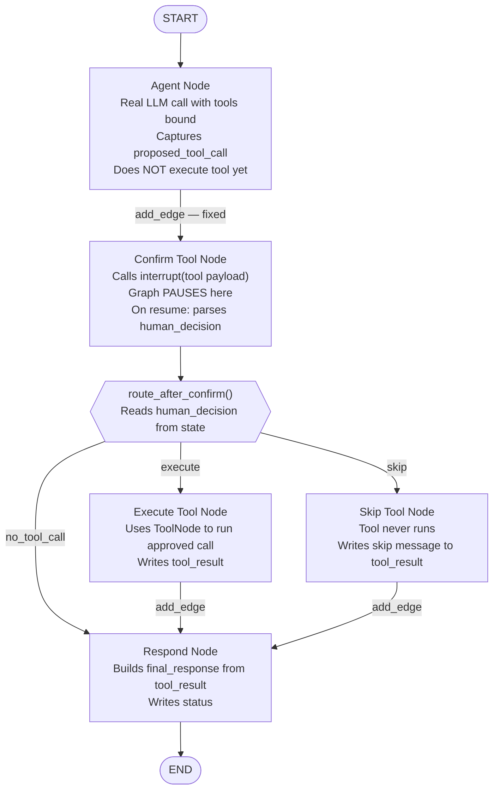

# Chapter 2 — Pattern B: Tool Call Confirmation

> **Prerequisite:** Read [Chapter 1 — Basic Approval](./01_basic_approval.md) first. This chapter introduces dict resume values and conditional routing after an HITL gate — two new concepts that build directly on the boolean-resume foundation of Pattern A.

---

## 1. What Is This Pattern?

Think of a hospital pharmacist who receives an electronic prescription order. Before dispensing a medication, the pharmacist reviews the order on their screen: the drug name, the dose, the frequency, and the patient's allergy list. They do not dispense it automatically the moment it appears in the system. They have a two-stage process: (1) the order arrives and is held pending review, and (2) the pharmacist either approves it (medication is dispensed) or rejects it (order is flagged and returned). A rejected order never reaches the patient — and no pills are wasted.

**Tool Call Confirmation in LangGraph is that pharmacist review.** When an LLM agent decides to call a tool — say, `analyze_symptoms` or `write_prescription` — the pipeline pauses before the tool actually executes. The interrupt payload shows the human exactly what the agent wants to do: the tool name and all its arguments. The human can approve the call (the tool executes and its result feeds back into the pipeline) or skip it (the tool does not execute, and the pipeline continues with an acknowledgement of the skip). No side effects occur until the human approves.

This pattern is critical for any tool with **irreversible side effects**: database writes, external API calls, financial transactions, lab orders, prescriptions, or any action where "undo" is expensive or impossible.

---

## 2. When Should You Use It?

**Use this pattern when:**

- Your agent uses tools that have side effects (writes, notifications, transactions) and you cannot afford for those side effects to happen without human review.
- You want to show the human exactly what the AI is proposing to do — including the full tool arguments — before it happens.
- You need conditional routing after the human's decision: approve → execute the tool; skip → bypass execution and acknowledge the skip.

**Do NOT use this pattern when:**

- The tools are read-only queries with no side effects (e.g., a database lookup that never modifies data). Read-only tools are safe to execute without confirmation.
- Every tool call should always execute — use the basic LLM + `ToolNode` pattern from the handoff module instead.
- You need the human to modify the tool arguments before execution. That would be a further extension of this pattern (a "modify" option in the routing) not covered here.

---

## 3. How It Works — Architecture Walkthrough

### ASCII Graph (from the script's docstring)

```
[START]
   |
   v
[agent]              <-- real LLM call, proposes tool call
   |
   v
[confirm_tool]       <-- interrupt() with tool call details
   |
route_after_confirm()
   |
+--+---------+-----------+
|             |           |
| "execute"   | "skip"    | (future: "modify")
v             v           v
[execute]    [skip]      [modify]
|             |           |
v             v           v
[respond]    [respond]   [respond]
   |
   v
[END]
```

### Step-by-Step Explanation

**Edge: START → agent**
Fixed unconditional entry. The agent node always runs first to produce the tool call proposal.

**Node: `agent`**
The agent node makes a real LLM call with tools bound (`analyze_symptoms`, `assess_patient_risk`). The LLM produces a response that contains a `tool_calls` list — the agent's proposal for which tool to call and with what arguments. Critically, the node captures the proposed tool call as a plain dict and writes it to `proposed_tool_call` in state. It does **not** execute the tool yet.

**Edge: agent → confirm_tool (fixed)**
After the agent proposes a tool call, confirmation is always requested.

**Node: `confirm_tool`**
This node calls `interrupt(build_tool_payload(...))`. The payload shows the tool name, arguments, and ID. The graph pauses. On resume, the human's decision (`"execute"` or `"skip"`) is returned by `interrupt()`. `parse_resume_action()` normalises the resume value (which is a dict `{"action": "execute"}`) and the normalised action is written to `human_decision`.

**Conditional edge: `route_after_confirm()`**
After `confirm_tool` completes, this router reads `state["human_decision"]` and returns one of three string keys:
- `"execute"` → routes to `execute_tool`
- `"skip"` → routes to `skip_tool`
- `"no_tool_call"` (if agent never proposed a tool) → routes to `respond`

**Node: `execute_tool`**
Finds the original LLM message with `tool_calls` from `state["messages"]`, passes it to `ToolNode` (`ToolNode` is a LangGraph prebuilt node that executes tool calls from a message), and captures the tool's result as `tool_result`.

**Node: `skip_tool`**
Records a skip message in `tool_result`. The tool never executes.

**Node: `respond`**
Builds the `final_response` string and `status` field based on `human_decision` and `tool_result`.

**Edge: respond → END (fixed)**

### Mermaid Flowchart



---

## 4. State Schema Deep Dive

```python
class ToolConfirmState(TypedDict):
    messages: Annotated[list, add_messages]  # Accumulates LLM messages
    patient_case: dict                        # Set at invocation time
    proposed_tool_call: dict                  # Written by: agent_node; Read by: confirm_tool_node, execute_tool_node
    human_decision: str                       # Written by: confirm_tool_node; Read by: route_after_confirm, respond_node
    tool_result: str                          # Written by: execute_tool_node or skip_tool_node; Read by: respond_node
    final_response: str                       # Written by: respond_node or agent_node (direct response)
    status: str                               # Written by: respond_node ("executed" | "skipped" | "direct_response")
```

**Field: `messages: Annotated[list, add_messages]`**
- **Who writes it:** `agent_node` writes `[response]` (the LLM's AIMessage containing the tool call). `execute_tool_node` appends `tool_messages` (the ToolMessage results). Both use partial `{"messages": [...]}` returns.
- **Who reads it:** `execute_tool_node` reads it to find the last message with `tool_calls` — it needs the original AIMessage to pass to `ToolNode`.
- **`Annotated[list, add_messages]` explained:** This tells LangGraph to call `add_messages(existing_list, new_messages)` when a node returns `{"messages": [new_msg]}`. The `add_messages` reducer appends the new message to the existing list rather than replacing it. This is essential here because two different nodes (agent and execute_tool) both need to append to the same message history.

**Field: `proposed_tool_call: dict`**
- **Who writes it:** `agent_node` — extracts the first tool call from the LLM response into `{"name": ..., "args": ..., "id": ...}`.
- **Who reads it:** `confirm_tool_node` — reads `name`, `args`, and `id` to build the interrupt payload. `execute_tool_node` reads `name` for logging.
- **Why it exists as a separate field:** Rather than having `confirm_tool_node` parse the `messages` list to find the LLM's tool call, `agent_node` does that parsing once and writes the result to a clean named field. This makes `confirm_tool_node` simpler and its intent clearer.

**Field: `human_decision: str`**
- **Who writes it:** `confirm_tool_node` — writes the action string from the parsed resume value (`"execute"`, `"skip"`, or `"no_tool_call"`).
- **Who reads it:** `route_after_confirm` (router function) and `respond_node`.
- **Why it exists as a separate field:** The routing decision and the final response generation both need the human's decision. Storing it as a named field means neither node needs to re-parse the resume value.

**Field: `tool_result: str`**
- **Who writes it:** `execute_tool_node` (the actual tool output) or `skip_tool_node` (a skip acknowledgement message).
- **Who reads it:** `respond_node` — incorporates `tool_result` into `final_response`.
- **Why it exists as a separate field:** Separates the raw tool output from the final formatted response. `respond_node` can choose how to present the tool result without knowing whether it came from an executed tool or a skip.

---

## 5. Node-by-Node Code Walkthrough

### `agent_node`

```python
def agent_node(state: ToolConfirmState) -> dict:
    """Clinical agent — real LLM call that proposes a tool call."""
    llm = get_llm()                           # Get the configured LLM client
    tools = [analyze_symptoms, assess_patient_risk]  # Tools available to this agent
    agent_llm = llm.bind_tools(tools)         # Tell the LLM it can call these tools

    patient = state["patient_case"]           # Read patient data from state

    system = SystemMessage(content=(
        "You are a clinical triage specialist. "
        "Use your tools to analyze the patient. "
        "Call analyze_symptoms or assess_patient_risk with the patient data."
    ))
    prompt = HumanMessage(content=f"""Evaluate this patient:
Age: {patient.get('age')}y {patient.get('sex')}
Complaint: {patient.get('chief_complaint')}
...""")

    config = build_callback_config(trace_name="tool_confirm_agent")  # Observability
    response = agent_llm.invoke([system, prompt], config=config)     # Real LLM call

    if hasattr(response, "tool_calls") and response.tool_calls:
        tc = response.tool_calls[0]           # Take the first tool call the LLM proposed
        proposed = {
            "name": tc["name"],               # Tool function name e.g. "analyze_symptoms"
            "args": tc["args"],               # Dict of tool arguments
            "id": tc.get("id", "unknown"),    # Tool call ID for ToolNode execution
        }
        return {
            "messages": [response],           # Accumulated via add_messages
            "proposed_tool_call": proposed,   # Written for confirm_tool_node to read
        }

    # If LLM responded without tool calls (direct answer)
    return {
        "messages": [response],
        "proposed_tool_call": {},             # Empty dict signals: no tool to confirm
        "final_response": response.content,   # Direct response goes straight to final_response
        "status": "direct_response",          # Router will route to "respond" to finalise
    }
```

**Critical design:** The node calls the LLM to get a *proposal*, captures the tool call metadata, and writes it to state. It does **not** call `ToolNode` here. The actual tool execution is deferred to `execute_tool_node`, which only runs if the human approves.

**What breaks if you remove this node:** There is no proposed tool call in state. `confirm_tool_node` reads an empty `proposed_tool_call`, returns `human_decision="no_tool_call"`, and routes directly to `respond` — nothing is reviewed and no tool executes.

> **TIP:** In production, if your agent proposes multiple tool calls in one response, consider intercepting each one separately. Instead of `response.tool_calls[0]`, loop over `response.tool_calls` and write each one to a list in state. Then use a separate loop or parallel fan-out (Pattern 6 from the handoff module) to confirm each tool call independently.

---

### `confirm_tool_node`

```python
def confirm_tool_node(state: ToolConfirmState) -> dict:
    """Pause for human to review the proposed tool call."""
    proposed = state.get("proposed_tool_call", {})  # Read the proposed tool call

    if not proposed:                            # No tool call in state — skip the interrupt
        return {"human_decision": "no_tool_call"}  # Route directly to respond

    # ── interrupt() PAUSES HERE ──────────────────────────────────────────────
    # build_tool_payload() creates the interrupt payload with:
    #   type="tool_confirmation", tool_name=..., tool_args=..., tool_id=...
    # The human sees exactly what the agent wants to do before it happens.
    decision = interrupt(build_tool_payload(
        tool_name=proposed.get("name", "unknown"),   # Tool name for display
        tool_args=proposed.get("args", {}),           # Tool arguments for display
        tool_id=proposed.get("id", "unknown"),        # Tool call ID
    ))
    # On first call: graph freezes here.
    # On resume: decision = whatever Command(resume=...) passed.

    # parse_resume_action() normalises the resume value.
    # If the human sent Command(resume={"action": "execute"}):
    #   decision = {"action": "execute"}
    #   parsed["action"] = "execute"
    # If the human sent Command(resume=True):
    #   parsed["action"] = "approve" (boolean True is normalised to "approve")
    parsed = parse_resume_action(decision, default_action="skip")  # Default to skip if ambiguous
    action = parsed["action"]                          # "execute" or "skip"
    return {"human_decision": action}                  # Written for router and respond_node
```

**Why `parse_resume_action()` exists:** The human (or a test script) might send `True`, `"execute"`, or `{"action": "execute"}`. All three mean the same thing. `parse_resume_action()` normalises all three forms to `{"action": "execute"}`, so the code that reads `parsed["action"]` always gets a consistent string.

**What breaks if you remove this node:** The agent proposes a tool call, but the interrupt never happens. `execute_tool_node` runs immediately without human approval, executing the tool without review.

> **WARNING:** If `confirm_tool_node` receives a resume value of `True` (a boolean), `parse_resume_action` maps it to `"approve"`, not `"execute"`. The router `route_after_confirm` only recognises `"execute"` as the approval key. Always send `Command(resume={"action": "execute"})`, not `Command(resume=True)`, for Pattern B to route correctly.

---

### `route_after_confirm` (router function)

```python
def route_after_confirm(state: ToolConfirmState) -> Literal["execute_tool", "skip_tool", "respond"]:
    """Route based on the human's decision about the tool call."""
    decision = state.get("human_decision", "skip")   # Read the decision written by confirm_tool_node
    if decision == "execute":
        return "execute_tool"     # Human approved: route to execute
    if decision == "no_tool_call":
        return "respond"          # Agent never proposed a tool: skip directly to respond
    return "skip_tool"            # Human rejected or default: route to skip
```

This router is a pure Python function — no LLM call, zero token cost. It reads a single field from state and returns a string key. The mapping dict in `add_conditional_edges` translates those keys to node names.

---

### `execute_tool_node`

```python
def execute_tool_node(state: ToolConfirmState) -> dict:
    """Execute the approved tool call and store the result."""
    proposed = state["proposed_tool_call"]       # Read the tool metadata
    tools = [analyze_symptoms, assess_patient_risk]
    tool_node = ToolNode(tools)                  # ToolNode executes tool calls from AIMessage objects

    # Find the last AIMessage in messages that contains tool_calls
    # (ToolNode needs the original AIMessage with tool_calls, not just the tool dict)
    last_ai_msg = None
    for msg in reversed(state.get("messages", [])):   # Scan backwards from newest
        if hasattr(msg, "tool_calls") and msg.tool_calls:  # Find first message with tool calls
            last_ai_msg = msg
            break

    if last_ai_msg:
        result = tool_node.invoke({"messages": [last_ai_msg]})   # Execute the tool call
        tool_messages = result.get("messages", [])                # ToolMessage results
        tool_content = tool_messages[0].content if tool_messages else "Tool returned no result"
        return {
            "messages": tool_messages,    # Append tool result messages via add_messages
            "tool_result": str(tool_content),  # Plain text result for respond_node
        }

    return {"tool_result": "Could not execute tool (message not found)"}
```

**Why the backwards scan for `last_ai_msg`?** `ToolNode` requires an `AIMessage` object with a populated `tool_calls` list to know which function to call. The raw dict `proposed_tool_call` in state is a metadata copy, not the original LangChain message object. The original object with `tool_calls` was appended to `state["messages"]` by `agent_node`. The backwards scan finds it reliably even if other messages were added after it.

> **TIP:** In production, after a tool executes successfully, make a second LLM call to generate a response that incorporates the tool result. The `respond_node` in this script uses a simple string template. A production system would call `llm.invoke([...messages, tool_result_message])` to get a contextual response from the LLM.

---

### `skip_tool_node` and `respond_node`

```python
def skip_tool_node(state: ToolConfirmState) -> dict:
    """Human rejected the tool call — skip execution."""
    proposed = state["proposed_tool_call"]
    return {
        "tool_result": f"Tool call '{proposed.get('name')}' was skipped by human reviewer.",
    }   # A plain text acknowledgement; the tool never ran

def respond_node(state: ToolConfirmState) -> dict:
    """Generate final response after tool execution or skip."""
    if state.get("status") == "direct_response":
        return {}             # Agent responded directly without a tool call; nothing to do
    decision = state.get("human_decision", "")
    tool_result = state.get("tool_result", "")
    if decision == "execute":
        output = f"Tool executed successfully.\nResult: {tool_result[:300]}"
        status = "executed"
    else:
        output = f"Tool call was skipped by reviewer.\nNote: {tool_result}"
        status = "skipped"
    return {"final_response": output, "status": status}
```

---

## 6. Interrupt and Resume Explained

### The Two-Call Cycle with Dict Resume

```
Call 1:   graph.invoke(initial_state, config)
              ↓ agent_node: LLM proposes tool call, writes proposed_tool_call
              ↓ confirm_tool_node: reaches interrupt(tool_payload)
          ──── GRAPH FREEZES ────
          result["__interrupt__"][0].value = {
              "type": "tool_confirmation",
              "tool_name": "analyze_symptoms",
              "tool_args": {"patient_id": "PT-TC-001", ...},
              ...
          }

Call 2:   graph.invoke(Command(resume={"action": "execute"}), config)
              ↓ confirm_tool_node RESTARTS from line 1
                interrupt() returns {"action": "execute"} immediately
                parse_resume_action() → action = "execute"
                writes human_decision = "execute"
              ↓ route_after_confirm() → "execute_tool"
              ↓ execute_tool_node: runs the tool, writes tool_result
              ↓ respond_node: writes final_response, status="executed"
              ↓ END
```

### Decision Table

| `human_decision` in state | `route_after_confirm()` returns | Next node | `status` |
|---------------------------|--------------------------------|-----------|----------|
| `"execute"` | `"execute_tool"` | `execute_tool` → `respond` | `"executed"` |
| `"skip"` | `"skip_tool"` | `skip_tool` → `respond` | `"skipped"` |
| `"no_tool_call"` | `"respond"` | `respond` directly | `"direct_response"` |

---

## 7. Worked Example — Trace: Execute Path

**Patient from `TEST_PATIENT`:**
```python
patient = PatientCase(
    patient_id="PT-TC-001", age=58, sex="M",
    chief_complaint="Persistent cough and dyspnea for 3 weeks",
    lab_results={"FEV1": "58% predicted"}, vitals={"SpO2": "93%"},
)
```

**Initial state:**
```python
{
    "messages": [],
    "patient_case": {...},
    "proposed_tool_call": {},
    "human_decision": "",
    "tool_result": "",
    "final_response": "",
    "status": "pending",
}
```

---

**Step 1 — `agent_node` runs:**

LLM proposes `analyze_symptoms(symptoms=["cough","dyspnea","wheezing"], ...)`.

State AFTER `agent_node`:
```python
{
    "messages": [AIMessage(content="", tool_calls=[{"name": "analyze_symptoms", "args": {...}}])],
    "proposed_tool_call": {"name": "analyze_symptoms", "args": {...}, "id": "call-abc123"},
    ...
}
```

---

**Step 2 — `confirm_tool_node` reaches `interrupt()`:**

Payload surfaced to caller:
```python
{
    "type": "tool_confirmation",
    "tool_name": "analyze_symptoms",
    "tool_args": {"symptoms": ["cough", "dyspnea", "wheezing"], "patient_id": "PT-TC-001"},
    "tool_id": "call-abc123",
}
```

Graph pauses.

---

**Step 3 — Human approves: `Command(resume={"action": "execute"})`**

`confirm_tool_node` restarts. `interrupt()` returns `{"action": "execute"}`. `parse_resume_action()` → `action = "execute"`. Writes `human_decision = "execute"`.

`route_after_confirm()` returns `"execute_tool"`.

---

**Step 4 — `execute_tool_node` runs:**

Finds `last_ai_msg` with `tool_calls`. Calls `ToolNode`. Tool executes and returns analysis result. Writes `tool_result = "Patient shows signs of COPD exacerbation..."`.

---

**Step 5 — `respond_node` runs:**

Builds `final_response = "Tool executed successfully. Result: Patient shows signs..."`. Writes `status = "executed"`.

Final state:
```python
{
    "messages": [AIMessage(...), ToolMessage(...)],
    "proposed_tool_call": {"name": "analyze_symptoms", ...},
    "human_decision": "execute",
    "tool_result": "Patient shows signs of COPD exacerbation...",
    "final_response": "Tool executed successfully. Result: ...",
    "status": "executed",
}
```

---

## 8. Key Concepts Introduced

- **Dict resume values** — `Command(resume={"action": "execute"})` passes a dict to `interrupt()`, not just a boolean. The dict carries structured information about the human's decision. First appears in `run_tool_confirm_cycle`'s `resume_value={"action": human_decision}`.

- **`build_tool_payload()`** — Root module helper from `hitl.primitives` that creates a standardised interrupt payload for tool call confirmation, including `tool_name`, `tool_args`, and `tool_id`. First appears in `confirm_tool_node`.

- **`parse_resume_action(value, default_action=)`** — Root module helper that normalises any resume value type (bool, str, dict) into a standard `{"action": ..., "content": ..., "reason": ..., "note": ...}` dict. First appears in `confirm_tool_node`'s `parsed = parse_resume_action(decision, default_action="skip")`.

- **Conditional routing after HITL** — `add_conditional_edges("confirm_tool", route_after_confirm, {...})` adds branching after the HITL gate. The human's decision does not just change a state field — it determines which nodes run next. First appears in `build_confirmation_graph()`.

- **`ToolNode`** — LangGraph prebuilt node from `langgraph.prebuilt` that executes tool calls from an AIMessage's `tool_calls` list. Used in `execute_tool_node` to actually run the approved tool. First appears in `execute_tool_node`'s `tool_node = ToolNode(tools)`.

- **Separating tool proposal from execution** — The `agent_node` calls the LLM and captures the tool call metadata without executing the tool. Execution only happens in `execute_tool_node` after human approval. This is the core design principle of Pattern B. First demonstrated in `agent_node`'s `proposed_tool_call` extraction.

---

## 9. Common Mistakes and How to Avoid Them

### Mistake 1: Sending `Command(resume=True)` instead of `Command(resume={"action": "execute"})`

**What goes wrong:** You send `Command(resume=True)` to approve the tool call. `parse_resume_action(True)` normalises this to `{"action": "approve"}`. `route_after_confirm` checks `if decision == "execute"` — fails — and falls through to `skip_tool`. The tool is not executed despite your intent to approve.

**Why it goes wrong:** Pattern B uses dict resume values. Boolean `True` is normalised to `"approve"` by `parse_resume_action`, not to `"execute"`. The routing keys (`"execute"`, `"skip"`) must exactly match what `parse_resume_action` returns.

**Fix:** Always send `Command(resume={"action": "execute"})` to approve and `Command(resume={"action": "skip"})` to reject in Pattern B. Reserve boolean resumes for Pattern A only.

---

### Mistake 2: LangGraph state immutability — calling `state["messages"].append(response)` in `agent_node`

**What goes wrong:** Instead of returning `{"messages": [response]}`, you append directly: `state["messages"].append(response)`. In a simple in-memory run, this appears to work. With checkpointing enabled, the pre-node state snapshot is restored when the graph resumes, and the mutation is silently lost.

**Why it goes wrong:** LangGraph treats state as immutable between nodes. The correct way to update `messages` is to return `{"messages": [response]}` from the node and let the `add_messages` reducer handle accumulation.

**Fix:** Never mutate state objects in-place. Always return a new dict from the node with the updated values. For list fields with reducers (`Annotated[list, add_messages]`), return the new items wrapped in a list and let the reducer append them.

---

### Mistake 3: Using `proposed_tool_call` dict directly with `ToolNode` instead of the original AIMessage

**What goes wrong:** In `execute_tool_node`, you try to execute the tool using only the `proposed_tool_call` dict: `ToolNode([...]).invoke({"tool_name": proposed["name"], "tool_args": proposed["args"]})`. `ToolNode` does not accept this format — it raises a `TypeError`.

**Why it goes wrong:** `ToolNode` expects an `AIMessage` object with a `tool_calls` attribute (a LangChain-formatted list). The `proposed_tool_call` dict is a plain Python dict extracted for readability; it is not a LangChain message object.

**Fix:** Find the original `AIMessage` in `state["messages"]` (the one with `tool_calls` set) and pass that to `ToolNode`. The backwards scan `for msg in reversed(state["messages"]):` finds it reliably.

---

### Mistake 4: Not handling the "no tool call" case in `confirm_tool_node`

**What goes wrong:** The LLM sometimes responds with a text answer instead of proposing a tool call. `proposed_tool_call` is an empty dict. Your `confirm_tool_node` calls `interrupt(build_tool_payload(...))` with empty tool data, suspending the graph for a meaningless review.

**Why it goes wrong:** LLMs do not always propose a tool call even when told to. The `if not proposed: return {"human_decision": "no_tool_call"}` early return handles this case, routing directly to `respond` without interrupting.

**Fix:** Always add a guard at the start of `confirm_tool_node`: `if not proposed: return {"human_decision": "no_tool_call"}`.

---

## 10. How This Pattern Connects to the Others

### Position in the Learning Sequence

Pattern B is the second step. It introduces dict resume values (structured human decisions) and conditional routing after an HITL gate. These two concepts are prerequisites for Patterns C, D, and E.

### What Pattern A Does NOT Handle

Pattern A accepts only `True`/`False`. What it cannot do:
- Intercept a proposed action (tool call) before it happens.
- Route to different downstream nodes based on the human's decision.
- Show the human the specific parameters of what is about to happen.

Pattern B solves all three.

### What the Next Pattern Adds

[Pattern C (Edit Before Approve)](./03_edit_before_approve.md) keeps the same simple `START → agent → review → END` topology as Pattern A but makes the resume payload even richer: instead of `{"action": "execute"|"skip"}`, the human can send `{"action": "edit", "content": "..."}` to inject modified text into the pipeline. The key new concept is that the human can **inject content** into the graph state via the resume value — not just approve or reject.

---

## 11. Quick-Reference Summary

| Aspect | Detail |
|--------|--------|
| **Pattern name** | Tool Call Confirmation |
| **Script file** | `scripts/HITL/tool_call_confirmation.py` |
| **Graph nodes** | `agent`, `confirm_tool`, `execute_tool`, `skip_tool`, `respond` |
| **Interrupt count** | 1 (in `confirm_tool_node`, skipped if no tool proposed) |
| **Resume value type** | Dict — `{"action": "execute"}` or `{"action": "skip"}` |
| **Routing type** | `add_conditional_edges()` from `confirm_tool` with 3 paths |
| **State fields** | `messages`, `patient_case`, `proposed_tool_call`, `human_decision`, `tool_result`, `final_response`, `status` |
| **Root modules** | `hitl.primitives` → `build_tool_payload`, `parse_resume_action`; `hitl.run_cycle` → `run_hitl_cycle` |
| **New concepts** | Dict resume values, `build_tool_payload`, `parse_resume_action`, `ToolNode`, conditional routing after HITL |
| **Prerequisite** | [Chapter 1 — Basic Approval](./01_basic_approval.md) |
| **Next pattern** | [Chapter 3 — Edit Before Approve](./03_edit_before_approve.md) |

---

*Continue to [Chapter 3 — Edit Before Approve](./03_edit_before_approve.md).*
