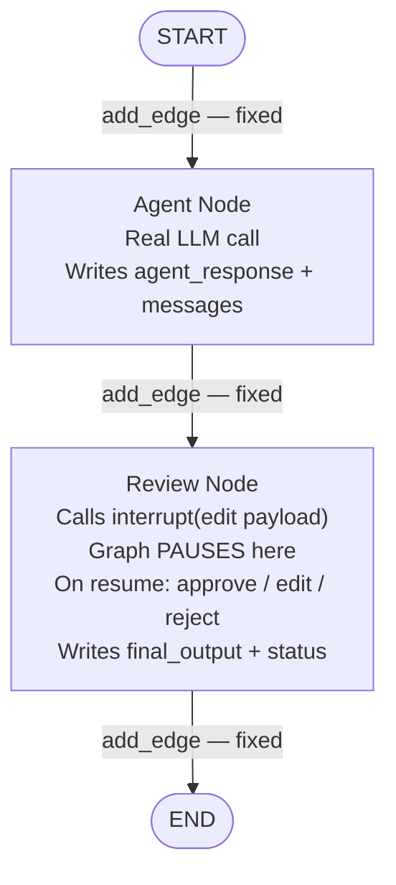

# Chapter 3 — Pattern C: Edit Before Approve

> **Prerequisite:** Read [Chapter 2 — Tool Call Confirmation](./02_tool_call_confirmation.md) first. This chapter introduces the idea that the human can **inject content** into the pipeline via the resume value — not just approve or skip.

---

## 1. What Is This Pattern?

Think of a copy editor reviewing an article written by a junior journalist. When the article arrives, the editor has three options. First, they can stamp "APPROVED" and send it to print unchanged. Second, they can make corrections — fixing the dosage in a medical claim, sharpening the headline, removing a factually incorrect sentence — and then send the edited version to print. Third, they can reject the whole piece with a note saying why it fails. In all three cases, the journalist's original draft remains in the record. But only the authorised final text — whether the original, the edited version, or a rejection message — goes to the reader.

**Edit Before Approve in LangGraph is that editorial workflow.** An AI agent produces an output. The pipeline pauses with `interrupt()`. The human reviewer sees the output and has three choices via the resume value:
- `{"action": "approve"}` — deliver the AI's output unchanged.
- `{"action": "edit", "content": "corrected text"}` — deliver the human's corrected version instead.
- `{"action": "reject", "reason": "why it fails"}` — replace the output with a rejection message that includes the reason.

The key insight of this pattern is that **`interrupt()` returns exactly what `Command(resume=value)` passes**. If the human sends a dict with `"content"`, that dict — including the edited text — arrives in `review_node` as the return value of `interrupt()`. The human has injected content directly into the pipeline's state.

---

## 2. When Should You Use It?

**Use this pattern when:**

- The AI's output is usually correct but often needs minor human corrections before delivery — tweaking a drug dosage, adjusting a financial figure, softening a tone.
- A simple approve/reject gate (Pattern A) is too rigid: the human needs to fix things rather than always starting from scratch.
- You want all three outcomes (approve, edit, reject) to be possible from a single HITL checkpoint without additional graph nodes for each.

**Do NOT use this pattern when:**

- The human always approves without changes — use [Pattern A (Basic Approval)](./01_basic_approval.md) for simplicity.
- The human needs to review multiple separate outputs (e.g., a diagnosis AND a treatment plan) independently — use [Pattern D (Multi-Step Approval)](./04_multi_step_approval.md).
- The editing step is itself complex enough to warrant multiple review rounds — consider chaining Pattern C graphs or adding a re-review loop node.

---

## 3. How It Works — Architecture Walkthrough

### ASCII Graph (from the script's docstring)

```
[START]
   |
   v
[agent]              <-- real LLM call
   |
   v
[review]             <-- interrupt(payload)
   |
   | <- PAUSED, human reviews response ->
   |
   | Command(resume={"action": "approve"})
   |    -> deliver response unchanged
   |
   | Command(resume={"action": "edit", "content": "..."})
   |    -> deliver the edited version
   |
   | Command(resume={"action": "reject", "reason": "..."})
   |    -> replace with rejection message
   |
   v
[END]
```

The graph topology is identical to Pattern A: `START → agent → review → END`. The difference is entirely in what the human can send as the resume value and how `review_node` processes it.

### Step-by-Step Explanation

**Node: `agent`**
A real LLM call (no simulated response). Reads `patient_case` from state, builds a system and user prompt, calls `get_llm().invoke(...)`, and writes `agent_response` (the text) and `messages` (the AIMessage object) to state.

**Node: `review`**
Calls `interrupt(build_edit_payload(...))`. The payload signals to the reviewer that three actions are available. On resume, `parse_resume_action()` normalises the resume value. The node then branches on `action`:
- `"approve"` → writes `final_output = agent_response`, `status = "approved"`.
- `"edit"` → writes `final_output = parsed["content"]`, `status = "edited"`.
- `"reject"` → writes `final_output` = rejection message with `parsed["reason"]`, `status = "rejected"`.

All three branches converge at `END` via the same fixed `add_edge("review", END)`.

### Mermaid Flowchart



---

## 4. State Schema Deep Dive

```python
class EditState(TypedDict):
    messages: Annotated[list, add_messages]  # Accumulated LLM messages
    patient_case: dict                        # Set at invocation time
    agent_response: str      # Written by: agent_node; Read by: review_node (to build payload and as fallback)
    human_action: str        # Written by: review_node ("approve" | "edit" | "reject")
    human_edit: str          # Written by: review_node — the human-provided edited content (if action="edit")
    reject_reason: str       # Written by: review_node — the rejection reason (if action="reject")
    final_output: str        # Written by: review_node — the authorised deliverable
    status: str              # Written by: review_node ("approved" | "edited" | "rejected" | "pending")
```

**Field: `agent_response: str`**
- **Who writes it:** `agent_node` — `response.content` from the LLM call.
- **Who reads it:** `review_node` — used both to build the interrupt payload (`response=agent_response`) and as the `final_output` value if the human approves without changes.
- **Why separate from `final_output`:** `agent_response` is always the AI's original, unmodified text. `final_output` is the text that actually gets delivered — which may differ from `agent_response` if the human edited it. Keeping both in state creates a permanent record of what the AI said vs what was actually delivered, enabling diff-based audit trails.

**Field: `human_edit: str`**
- **Who writes it:** `review_node` when `action == "edit"`, from `parsed["content"]`.
- **Who reads it:** Only read by the caller after completion (for audit/diff purposes).
- **Why it exists as a separate field:** `final_output` already contains the edited text. `human_edit` preserves it separately so the caller can compute `diff(agent_response, human_edit)` without parsing `final_output`.

**Field: `reject_reason: str`**
- **Who writes it:** `review_node` when `action == "reject"`, from `parsed["reason"]`.
- **Who reads it:** The caller reads it to understand why the output was rejected, without parsing the `final_output` rejection message.

**Field: `status: str`**
- **Who writes it:** `review_node` — one of `"approved"`, `"edited"`, `"rejected"`.
- **Who reads it:** The caller — to quickly determine the outcome. Monitoring systems track the distribution of `status` values without reading `final_output`.

> **NOTE:** There is no router function and no `add_conditional_edges` in Pattern C. All three branches (approve/edit/reject) are handled by `if/elif/elif` logic inside `review_node`. The graph topology stays simple: `START → agent → review → END`. Pattern B's routing was needed because different nodes had to execute (execute_tool vs skip_tool). Here, the same `review_node` handles all three outcomes and writes the result to state, so no routing is needed.

---

## 5. Node-by-Node Code Walkthrough

### `agent_node`

```python
def agent_node(state: EditState) -> dict:
    """Clinical agent — real LLM call."""
    llm = get_llm()                    # Get the configured LLM client (no tools bound)
    patient = state["patient_case"]    # Read patient data from state

    system = SystemMessage(content=(
        "You are a clinical triage specialist. Provide a concise "
        "clinical assessment and treatment recommendation. "
        "Include specific medication names and dosages."
    ))
    prompt = HumanMessage(content=f"""Patient: {patient.get('age')}y {patient.get('sex')}
Complaint: {patient.get('chief_complaint')}
...""")

    config = build_callback_config(trace_name="edit_before_approve_agent")  # Observability
    response = llm.invoke([system, prompt], config=config)  # Real LLM call — no tools

    return {
        "messages": [response],            # Accumulated via add_messages reducer
        "agent_response": response.content, # Clean text for review_node to show the human
    }
```

**Key difference from Pattern B:** No `bind_tools()`. This agent produces a text assessment directly, not a tool call proposal. The agent's purpose is to generate something for the human to review, not to propose an action.

**What breaks if you remove this node:** `agent_response` is never written to state. `review_node` would call `interrupt(build_edit_payload(response="", ...))` — an empty string. The human would see nothing to review.

> **TIP:** In production, the agent node can call multiple LLMs in a chain before writing to `agent_response` — for example, a first LLM generates the draft, a second LLM checks it for safety, and only the safety-checked draft is written to `agent_response`. The HITL layer then sees the pre-checked output, not the raw first draft.

---

### `review_node`

```python
def review_node(state: EditState) -> dict:
    """
    Pause for human review with three options:
        {"action": "approve"}                    -> deliver as-is
        {"action": "edit", "content": "..."}     -> deliver edited version
        {"action": "reject", "reason": "..."}    -> reject with reason
    """
    response = state["agent_response"]         # Read the AI's output (idempotent, before interrupt)
    print(f"    | [Review] Response preview: {response[:100]}...")  # Log (idempotent)

    # ── interrupt() PAUSES HERE ────────────────────────────────────────────────
    # build_edit_payload() creates a payload with three option descriptions:
    #   option 1: {"action": "approve"}
    #   option 2: {"action": "edit", "content": "your edited text here"}
    #   option 3: {"action": "reject", "reason": "why it fails"}
    # The human sees these descriptions and sends the appropriate Command(resume=...).
    human_input = interrupt(build_edit_payload(
        response=response,              # The AI output being reviewed
        question="Review this clinical recommendation. You can approve, edit, or reject.",
    ))
    # On first call: graph freezes here.
    # On resume: human_input = whatever dict was passed to Command(resume=...).

    # ── Process the human's decision ───────────────────────────────────────────
    # parse_resume_action() normalises the resume value to a standard dict.
    # It handles: bool → "approve"/"reject", str → {"action": str}, dict → as-is.
    # The dict form used here is: {"action": "approve"/"edit"/"reject", "content": ..., "reason": ...}
    parsed = parse_resume_action(human_input, default_action="approve")  # Default: approve
    action = parsed["action"]      # "approve", "edit", or "reject"

    if action == "approve":
        print("    | [Review] Human APPROVED (no edits)")
        return {
            "human_action": "approve",
            "final_output": response,      # Deliver the original AI output unchanged
            "status": "approved",
        }

    elif action == "edit":
        edited = parsed["content"] or response  # Use human's content; fallback to original
        print(f"    | [Review] Human EDITED ({len(edited)} chars)")
        return {
            "human_action": "edit",
            "human_edit": edited,           # Preserve the edit separately for audit
            "final_output": edited,         # Deliver the human's edited version
            "status": "edited",
        }

    elif action == "reject":
        reason = parsed["reason"] or "No reason provided"  # Use rejection reason
        print(f"    | [Review] Human REJECTED: {reason}")
        return {
            "human_action": "reject",
            "reject_reason": reason,        # Preserve the reason separately for audit
            "final_output": (               # Safe rejection message — never deliver the AI output
                f"This recommendation was REJECTED by the reviewer.\n"
                f"Reason: {reason}\n"
                "The patient should be seen for direct clinical evaluation."
            ),
            "status": "rejected",
        }

    # Fallback: any unrecognised action — treat as approve
    return {"human_action": action, "final_output": response, "status": "approved"}
```

**The key concept: `interrupt()` returns whatever `Command(resume=value)` passes.**
- `Command(resume={"action": "approve"})` → `interrupt()` returns `{"action": "approve"}` → `parsed["action"] = "approve"`.
- `Command(resume={"action": "edit", "content": "corrected text"})` → `interrupt()` returns `{"action": "edit", "content": "corrected text"}` → `parsed["content"] = "corrected text"` → `final_output = "corrected text"`.
- `Command(resume={"action": "reject", "reason": "missing drug interaction warning"})` → `parsed["reason"] = "missing..."` → `final_output` is a rejection message with that reason.

The human is not just making a routing decision — they are contributing content to the pipeline's state.

**What breaks if you remove this node:** The AI's output is delivered immediately without review. `final_output` is never written (or equals the empty initial value). `status` stays `"pending"` — a misleading state for the caller.

> **WARNING:** `parsed["content"] or response` uses Python's `or` operator. If the human sends `{"action": "edit", "content": ""}` (an empty edit), `"" or response` evaluates to `response` (the original). If an empty edit is a valid signal (meaning "delete the output"), use `if parsed["content"] is not None` instead.

> **TIP:** In production, record the diff between `agent_response` and `human_edit` in an audit log: `audit.log(diff=difflib.unified_diff(agent_response, human_edit), reviewer=reviewer_id, timestamp=now())`. This builds a training dataset of human corrections that can be used to fine-tune the agent.

---

### Root Module: `build_edit_payload`

**`build_edit_payload()` — from `hitl.primitives`**

**Contract:** Takes `response` and `question` keyword arguments. Returns an `InterruptPayload` dict:
```python
{
    "type": "edit",
    "response": "...",              # The AI output being reviewed
    "question": "...",              # The review question
    "options": [
        {"action": "approve", "description": "Approve as-is"},
        {"action": "edit", "description": "Edit the content", "resume_format": {"action": "edit", "content": "..."}},
        {"action": "reject", "description": "Reject", "resume_format": {"action": "reject", "reason": "..."}},
    ],
}
```

The `options` list shows the reviewer exactly what `Command(resume=...)` format to use for each action. This makes the interrupt payload self-documenting — a review UI can render the options without hardcoding Pattern C knowledge.

---

## 6. Interrupt and Resume Explained

### How Edit Content Flows Through the Pipeline

```
Human sends:   Command(resume={"action": "edit", "content": "Reduce Lisinopril to 10mg..."})
                    ↓
interrupt() returns: {"action": "edit", "content": "Reduce Lisinopril to 10mg..."}
                    ↓
parse_resume_action() extracts: action="edit", content="Reduce Lisinopril to 10mg..."
                    ↓
review_node writes: final_output = "Reduce Lisinopril to 10mg..."
                    ↓
graph.invoke() returns: state["final_output"] = "Reduce Lisinopril to 10mg..."
```

The human's edited text travels through `Command` → `interrupt()` → `parse_resume_action()` → state field → final return value. At no point does the agent re-run or the original AI output get modified.

### Decision Table

| Human's `Command(resume=...)` | `interrupt()` returns | `action` from `parse_resume_action` | `final_output` | `status` |
|------------------------------|----------------------|-------------------------------------|----------------|----------|
| `{"action": "approve"}` | `{"action": "approve"}` | `"approve"` | `agent_response` (unchanged) | `"approved"` |
| `{"action": "edit", "content": "..."}` | `{"action": "edit", "content": "..."}` | `"edit"` | Human's edited text | `"edited"` |
| `{"action": "reject", "reason": "..."}` | `{"action": "reject", "reason": "..."}` | `"reject"` | Safe rejection message | `"rejected"` |
| `True` (boolean, mapped by parse_resume_action) | `True` | `"approve"` | `agent_response` | `"approved"` |

---

## 7. Worked Example — Trace: Edit Scenario (Test 2)

**Test 2 from `main()`:** Human edits the response.

**Patient:**
```python
TEST_PATIENT = PatientCase(
    patient_id="PT-EBA-001", age=71, sex="F",
    chief_complaint="Dizziness with elevated potassium",
    lab_results={"K+": "5.4 mEq/L", "eGFR": "42 mL/min"},
    current_medications=["Lisinopril 20mg", "Spironolactone 25mg", "Furosemide 40mg"],
)
```

**Initial state:**
```python
{
    "messages": [],
    "patient_case": {...},
    "agent_response": "",
    "human_action": "",
    "human_edit": "",
    "reject_reason": "",
    "final_output": "",
    "status": "pending",
}
```

---

**Step 1 — `agent_node` runs:**

LLM produces a clinical assessment. For this patient, the LLM might recommend: "Maintain Lisinopril 20mg. Monitor K+ levels."

State AFTER `agent_node`:
```python
{
    "messages": [AIMessage(content="Maintain Lisinopril 20mg. Monitor K+ levels.")],
    "agent_response": "Maintain Lisinopril 20mg. Monitor K+ levels.",
    ...
}
```

---

**Step 2 — `review_node` reaches `interrupt()`:**

Payload surfaced to caller:
```python
{
    "type": "edit",
    "response": "Maintain Lisinopril 20mg. Monitor K+ levels.",
    "question": "Review this clinical recommendation...",
    "options": [{"action": "approve"}, {"action": "edit", "resume_format": ...}, {"action": "reject", ...}],
}
```

Graph pauses. The human reviewer notices the AI missed that Lisinopril + Spironolactone cause hyperkalemia and decides to edit.

---

**Step 3 — Human sends: `Command(resume={"action": "edit", "content": "REDUCE Lisinopril to 10mg due to declining renal function. HOLD Spironolactone until K+ < 5.0 mEq/L. Recheck electrolytes in 48 hours."})`**

`review_node` restarts. `interrupt()` returns the dict immediately.
`parse_resume_action()` → `action = "edit"`, `content = "REDUCE Lisinopril to 10mg..."`.

Review node writes:
```python
{
    "human_action": "edit",
    "human_edit": "REDUCE Lisinopril to 10mg...",
    "final_output": "REDUCE Lisinopril to 10mg...",  # Human's text, not AI's
    "status": "edited",
}
```

---

**Final state returned to caller:**
```python
{
    "agent_response": "Maintain Lisinopril 20mg. Monitor K+ levels.",  # AI's original — preserved
    "human_edit": "REDUCE Lisinopril to 10mg...",                       # Human's edit — preserved
    "final_output": "REDUCE Lisinopril to 10mg...",                     # What gets delivered
    "status": "edited",
    "human_action": "edit",
    ...
}
```

The caller reads `state["final_output"]` for the delivered text — the human's corrected version. `state["agent_response"]` preserves the AI's original for audit.

---

## 8. Key Concepts Introduced

- **Human-injected content via resume value** — `Command(resume={"action": "edit", "content": "corrected text"})` passes the human's text through `interrupt()` directly into `review_node`. The human is not just making a routing decision — they are contributing content to the pipeline state. First demonstrated in Test 2 of `main()`.

- **`build_edit_payload()`** — Root module helper from `hitl.primitives` that creates an interrupt payload documenting three resume value formats (approve, edit, reject). First appears in `review_node`'s `interrupt(build_edit_payload(...))`.

- **Three-way action from a single `interrupt()`** — One `interrupt()` call, three possible outcomes, all handled by `if/elif/elif` in the same node. No conditional routing, no extra nodes — the branching is entirely within `review_node`. First demonstrated in `review_node`.

- **`parsed["content"]` and `parsed["reason"]`** — Fields in the `parse_resume_action()` return dict that carry human-provided content from the resume value. `parsed["content"]` carries edited text; `parsed["reason"]` carries rejection reasoning. First appears in `review_node`'s `edited = parsed["content"] or response`.

- **Audit fields `human_edit` and `reject_reason`** — Separate state fields that preserve the human's specific contribution (edit text or rejection reason) independently of `final_output`. These are for audit, diff, and monitoring — not for the delivery path. First appears in `EditState`.

---

## 9. Common Mistakes and How to Avoid Them

### Mistake 1: LangGraph state immutability — modifying `agent_response` instead of writing `final_output`

**What goes wrong:** In `review_node`, after the human edits, you write `state["agent_response"] = edited_content` instead of returning `{"final_output": edited_content}`. In a simple in-memory run this appears to work. With checkpointing, the pre-node state snapshot is used for the next graph invocation, and the mutation is lost.

**Why it goes wrong:** State fields must be updated by returning a dict from the node, not by mutating the state object. The state object passed to a node is a snapshot, not a live reference.

**Fix:** Always return a new dict with the updated fields. Never assign to `state["field"]` inside a node.

---

### Mistake 2: Using `parsed["content"] or response` when empty string is a valid edit

**What goes wrong:** The human sends `{"action": "edit", "content": ""}` intending to replace the response with an empty string (e.g., to clear a section). `"" or response` evaluates to `response` — the original. The edit is silently ignored.

**Why it goes wrong:** Python's `or` operator evaluates empty string as falsy.

**Fix:** Use `if parsed.get("content") is not None` to distinguish "no content provided" from "empty string provided".

---

### Mistake 3: Not preserving `agent_response` separately from `final_output`

**What goes wrong:** After the human edits, you write `agent_response = edited_content` and `final_output = edited_content` instead of keeping `agent_response` as the original. Now you cannot tell what the AI said vs what the human changed.

**Why it goes wrong:** Overwriting `agent_response` destroys the audit record of the AI's original output.

**Fix:** Never overwrite `agent_response` in `review_node`. Write `final_output` with the approved/edited/rejected text and leave `agent_response` unchanged.

---

### Mistake 4: Sending `Command(resume="approve")` (a string) instead of a dict

**What goes wrong:** You send `Command(resume="approve")`. `parse_resume_action("approve")` normalises a string to `{"action": "approve"}`. This happens to work for the approve case. But `Command(resume="edit: new text")` is unparseable — `parse_resume_action` cannot extract the edited content from a single fused string.

**Why it goes wrong:** Pattern C relies on structured dict resume values to carry optional content and reason fields alongside the action.

**Fix:** Always use dict resume values for Pattern C: `{"action": "approve"}`, `{"action": "edit", "content": "..."}`, `{"action": "reject", "reason": "..."}`.

---

## 10. How This Pattern Connects to the Others

### Position in the Learning Sequence

Pattern C is the third step. It completes the "single interrupt point" trilogy (Patterns A, B, C) before Patterns D and E introduce multiple interrupt points.

### What the Previous Patterns Do NOT Handle

- Pattern A: binary approve/reject only. Cannot modify the output.
- Pattern B: approve/skip a tool call. Cannot modify text content; the "modification" is routing to different nodes, not injecting human text.

Pattern C introduces the ability to inject human-authored content into the pipeline state via the resume value.

### What the Next Pattern Adds

[Pattern D (Multi-Step Approval)](./04_multi_step_approval.md) introduces two separate interrupt points in the same graph. Instead of one node pausing for review, two separate nodes pause — each with its own payload, its own resume call, and its own routing decision. The key new concept is the **same `thread_id` spanning multiple `graph.invoke()` calls**, each targeting the next interrupt in the sequence. This requires `run_multi_interrupt_cycle()` instead of `run_hitl_cycle()`.

---

## 11. Quick-Reference Summary

| Aspect | Detail |
|--------|--------|
| **Pattern name** | Edit Before Approve |
| **Script file** | `scripts/HITL/edit_before_approve.py` |
| **Graph nodes** | `agent`, `review` |
| **Interrupt count** | 1 (in `review_node`) |
| **Resume value type** | Dict — `{"action": "approve"}`, `{"action": "edit", "content": "..."}`, `{"action": "reject", "reason": "..."}` |
| **Routing type** | Fixed edges only — `START → agent → review → END`; branching is inside `review_node` |
| **State fields** | `messages`, `patient_case`, `agent_response`, `human_action`, `human_edit`, `reject_reason`, `final_output`, `status` |
| **Root modules** | `hitl.primitives` → `build_edit_payload`, `parse_resume_action`; `hitl.run_cycle` → `run_hitl_cycle` |
| **New concepts** | Human-injected content via resume value, `build_edit_payload`, three-way action from one `interrupt()`, `parsed["content"]` / `parsed["reason"]`, audit fields |
| **Prerequisite** | [Chapter 2 — Tool Call Confirmation](./02_tool_call_confirmation.md) |
| **Next pattern** | [Chapter 4 — Multi-Step Approval](./04_multi_step_approval.md) |

---

*Continue to [Chapter 4 — Multi-Step Approval](./04_multi_step_approval.md).*
