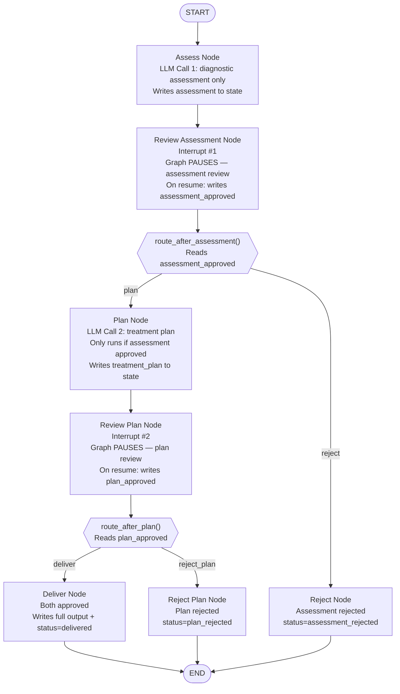

# Chapter 4 — Pattern D: Multi-Step Approval

> **Prerequisite:** Read [Chapter 3 — Edit Before Approve](./03_edit_before_approve.md) first. This chapter introduces multiple interrupt points in a single graph — a qualitative jump from the single-interrupt patterns of Chapters 1–3.

---

## 1. What Is This Pattern?

Think of a peer-reviewed research paper. Before publication, the paper goes through two distinct review stages. First, the methodology committee reviews the research design and approves (or rejects) it. If they reject it, the paper stops — no results section, no conclusions, no peer review of findings, because the flawed methodology invalidates everything that follows. If they approve the methodology, the paper moves to the results committee, who reviews the findings and treatment conclusions independently. Two separate committees, two separate approval stamps, one sequential pipeline.

**Multi-Step Approval in LangGraph is that two-stage review pipeline.** One graph contains two `interrupt()` calls in two different nodes. The pipeline runs, pauses at the first interrupt, waits for approval, continues if approved (or terminates if rejected), pauses at the second interrupt, waits for a second approval, and completes. The key mechanic is that the **same `thread_id` spans all three `graph.invoke()` calls** — the initial call and both resume calls. LangGraph's checkpointer uses the `thread_id` to restore the correct state snapshot before each resume.

---

## 2. When Should You Use It?

**Use this pattern when:**

- Your pipeline produces **multiple distinct deliverables**, each of which needs independent human approval before the next one is generated.
- You want **early termination to save compute**: if the first deliverable is rejected, downstream LLM calls are never made — saving tokens and reviewer time.
- The two outputs have a dependency (the second is generated using the first), so reviewing them together in one interrupt does not make sense.

**Do NOT use this pattern when:**

- The two review steps can be combined into a single review of one output — use [Pattern A (Basic Approval)](./01_basic_approval.md) or [Pattern C (Edit Before Approve)](./03_edit_before_approve.md).
- The reviewers at both stages have different authority levels and uncertain cases from the first reviewer should escalate to the second — use [Pattern E (Escalation Chain)](./05_escalation_chain.md) instead.
- You need more than two interrupt points — this pattern scales (add more `review_X` nodes), but consider whether a loop-based approval system would be more maintainable.

---

## 3. How It Works — Architecture Walkthrough

### ASCII Graph (from the script's docstring)

```
[START]
   |
   v
[assess]             <-- produces diagnostic assessment (LLM call 1)
   |
   v
[review_assessment]  <-- interrupt #1: approve/reject assessment
   |
route_after_assessment()
   |
+--+-------------------+
|                      |
| "plan"               | "reject"
v                      v
[plan]                [reject] -> [END]
   |
   v
[review_plan]        <-- interrupt #2: approve/reject treatment plan
   |
route_after_plan()
   |
+--+-------------------+
|                      |
| "deliver"            | "reject"
v                      v
[deliver]             [reject_plan] -> [END]
   |
   v
[END]
```

### Step-by-Step Explanation

**Node: `assess`**
First LLM call. Produces a diagnostic assessment (differential diagnosis, severity, key findings). Does **not** include treatment recommendations — those come from a separate LLM call only if this assessment is approved.

**Node: `review_assessment`**
**Interrupt #1.** Calls `interrupt(build_approval_payload(response=assessment, ...))`. The graph pauses. On resume, `approved` = `True` (approved) or `False` (rejected). Writes `assessment_approved: bool` to state.

**Router: `route_after_assessment()`**
Reads `state["assessment_approved"]`. Returns `"plan"` (approved) or `"reject"` (rejected). This is where the "early termination" decision happens. If rejected here, the `plan_node` and its LLM call never run.

**Node: `plan`**
Second LLM call. Only reachable if `assessment_approved == True`. Reads the approved assessment from state and generates a treatment plan based on it. Two-stage LLM pipeline: assessment informs the plan.

**Node: `review_plan`**
**Interrupt #2.** Same `interrupt()` mechanics as interrupt #1, but for the treatment plan. Writes `plan_approved: bool`.

**Router: `route_after_plan()`**
Returns `"deliver"` or `"reject_plan"`.

**Terminal nodes: `deliver`, `reject`, `reject_plan`**
Each writes `final_output` and `status` and connects to `END` via fixed edges.

### Mermaid Flowchart



---

## 4. State Schema Deep Dive

```python
class MultiStepState(TypedDict):
    messages: Annotated[list, add_messages]  # Accumulates both LLM responses
    patient_case: dict                        # Set at invocation time
    assessment: str            # Written by: assess_node; Read by: review_assessment_node, plan_node
    assessment_approved: bool  # Written by: review_assessment_node; Read by: route_after_assessment
    treatment_plan: str        # Written by: plan_node; Read by: review_plan_node, deliver_node
    plan_approved: bool        # Written by: review_plan_node; Read by: route_after_plan
    final_output: str          # Written by: deliver/reject/reject_plan nodes
    status: str                # "delivered" | "assessment_rejected" | "plan_rejected"
```

**Field: `assessment: str` and `treatment_plan: str`**
- Two separate named fields, one per LLM deliverable. This separation is intentional — they represent two distinct outputs that are reviewed independently.
- `plan_node` reads `state["assessment"]` to generate the treatment plan based on the already-approved diagnosis. This models the real-world dependency: a treatment plan that contradicts the diagnosis would be incoherent.

**Field: `assessment_approved: bool` and `plan_approved: bool`**
- Written by their respective review nodes after their interrupt is resumed.
- Read by their respective router functions.
- Boolean rather than string because both review nodes use simple `True`/`False` resumes (no rich edit/reason payloads needed).

**Field: `status: str`**
Three possible terminal values — `"delivered"`, `"assessment_rejected"`, `"plan_rejected"` — clearly identify which stage the pipeline terminated at. A monitoring dashboard can aggregate these to track how often each stage fails.

> **NOTE:** The `messages` list accumulates LLM responses from **both** `assess_node` and `plan_node` via the `add_messages` reducer. After a fully-approved run, `state["messages"]` contains both AIMessage objects: the assessment response and the treatment plan response. This preserves the full generation history for audit, even though the `assessment` and `treatment_plan` string fields provide direct access to the content.

---

## 5. Node-by-Node Code Walkthrough

### `assess_node`

```python
def assess_node(state: MultiStepState) -> dict:
    """Step 1: Produce a diagnostic assessment using the LLM."""
    llm = get_llm()
    patient = state["patient_case"]

    system = SystemMessage(content=(
        "You are a clinical specialist. Provide ONLY a diagnostic "
        "assessment (2-3 paragraphs). Do NOT include treatment "  # Deliberately excluded
        "recommendations yet. Focus on: differential diagnosis, "
        "severity assessment, and key findings."
    ))
    prompt = HumanMessage(content=f"Patient: {patient.get('age')}y ...")

    config = build_callback_config(trace_name="multi_step_assessment")
    response = llm.invoke([system, prompt], config=config)  # LLM call 1

    return {
        "messages": [response],         # Accumulated via add_messages
        "assessment": response.content, # Named field for review and plan nodes to read
    }
```

**Why "no treatment recommendations" in the system prompt?** The system prompt explicitly forbids treatment recommendations. The assessment and treatment stages are intentionally split into separate LLM calls with separate human review checkpoints. If the assessment LLM included treatment recommendations, the human would be reviewing a combined output, not two independent deliverables.

---

### `review_assessment_node` (Interrupt #1)

```python
def review_assessment_node(state: MultiStepState) -> dict:
    """Interrupt #1: Human reviews the diagnostic assessment."""
    assessment = state["assessment"]
    print(f"    | [Review Assessment] Preview: {assessment[:80]}...")

    # ── INTERRUPT #1 ─────────────────────────────────────────────────────────
    # This is the first of two interrupt() calls in this graph.
    # Same MemorySaver, same thread_id as interrupt #2 (later).
    approved = interrupt(build_approval_payload(
        response=assessment,
        question="Do you approve this diagnostic assessment?",
        note="If rejected, no treatment plan will be generated.",  # Informs human of consequence
        options=["approve", "reject"],
    ))
    # On Call 2 (resume): approved = True or False.

    if approved:
        print("    | [Review Assessment] APPROVED")
    else:
        print("    | [Review Assessment] REJECTED")

    return {"assessment_approved": approved}  # Router reads this to decide next node
```

**The "no treatment plan" note:** The `note` field explicitly tells the reviewer: "If you reject this, the pipeline terminates — no treatment plan LLM call will happen." This informs the reviewer of the downstream consequences of their decision. In production, this note should be clearly rendered in the review UI.

**Key mechanic:** This node returns only `{"assessment_approved": approved}`. It does not write `assessment` (unchanged from `assess_node`), it does not write `treatment_plan` (not yet generated), and it does not write `final_output`. State fields written by earlier nodes persist unchanged through subsequent nodes.

---

### `route_after_assessment` (Router #1)

```python
def route_after_assessment(state: MultiStepState) -> Literal["plan", "reject"]:
    """Route: approved -> generate treatment plan, rejected -> stop."""
    if state["assessment_approved"]:
        return "plan"      # Continues to LLM call 2
    return "reject"        # Skips everything downstream, goes to reject -> END
```

This is the "early termination" decision point. If the assessment is rejected, `plan_node`, `review_plan_node`, `deliver_node`, and `reject_plan_node` are all unreachable. The graph terminates at `reject → END` without making the second LLM call.

**Token savings:** When `assessment_approved = False`, only 1 LLM call has been made (the assessment). The treatment plan LLM call (which might cost as many tokens as the assessment) is never made. At scale, early rejections significantly reduce LLM API costs.

---

### `plan_node`

```python
def plan_node(state: MultiStepState) -> dict:
    """Step 2: Generate treatment plan based on approved assessment."""
    llm = get_llm()
    patient = state["patient_case"]

    system = SystemMessage(content=(
        "You are a clinical specialist. Based on the approved "
        "diagnostic assessment below, provide a specific treatment "
        "plan with: medications (name, dose, frequency), monitoring "
        "schedule, and follow-up timeline."
    ))
    prompt = HumanMessage(content=f"""APPROVED ASSESSMENT:
{state['assessment']}    ← reads the approved assessment from state

PATIENT:
Age: {patient.get('age')}y {patient.get('sex')}
Medications: {', '.join(patient.get('current_medications', []))}
...

Generate a specific treatment plan.""")

    config = build_callback_config(trace_name="multi_step_plan")
    response = llm.invoke([system, prompt], config=config)  # LLM call 2

    return {
        "messages": [response],               # Accumulated alongside the assessment message
        "treatment_plan": response.content,   # Second named deliverable
    }
```

**The dependency on `assessment`:** `plan_node` explicitly reads `state['assessment']` and includes it in the prompt. This is the LangGraph pattern for chaining dependent LLM calls: the output of the first LLM call is included in the prompt for the second. The two calls are separated in time (by the human review at interrupt #1), which is only possible because the state is checkpointed.

---

### `review_plan_node` (Interrupt #2), `route_after_plan`, terminal nodes

```python
def review_plan_node(state: MultiStepState) -> dict:
    """Interrupt #2: Human reviews the treatment plan."""
    plan = state["treatment_plan"]
    approved = interrupt(build_approval_payload(
        response=plan,
        question="Do you approve this treatment plan?",
        note="The diagnostic assessment was already approved.",  # Context for the reviewer
        options=["approve", "reject"],
    ))
    return {"plan_approved": approved}

def route_after_plan(state: MultiStepState) -> Literal["deliver", "reject_plan"]:
    if state["plan_approved"]:
        return "deliver"
    return "reject_plan"

def deliver_node(state: MultiStepState) -> dict:
    """Both assessment and plan approved — deliver complete recommendation."""
    full_output = (
        f"DIAGNOSTIC ASSESSMENT (approved):\n{state['assessment']}\n\n"
        f"TREATMENT PLAN (approved):\n{state['treatment_plan']}"
    )
    return {"final_output": full_output, "status": "delivered"}

def reject_node(state: MultiStepState) -> dict:
    """Assessment rejected — treatment plan never generated."""
    return {
        "final_output": "Diagnostic assessment was REJECTED...\nNo treatment plan was generated.",
        "status": "assessment_rejected",
    }

def reject_plan_node(state: MultiStepState) -> dict:
    """Assessment approved but treatment plan rejected."""
    return {
        "final_output": "Diagnostic assessment was APPROVED.\nTreatment plan was REJECTED...",
        "status": "plan_rejected",
    }
```

---

## 6. Interrupt and Resume Explained

### The Three-Call Cycle (Full Approval)

```
Call 1:   graph.invoke(initial_state, {"configurable": {"thread_id": "multi-001"}})
              ↓ assess_node: LLM call 1, writes assessment
              ↓ review_assessment_node: reaches interrupt #1
          ──── GRAPH FREEZES (interrupt #1) ────
          result["__interrupt__"][0].value = approval payload for assessment

          ... Human reviews assessment ...

Call 2:   graph.invoke(Command(resume=True), {"configurable": {"thread_id": "multi-001"}})
          ← SAME thread_id — LangGraph restores state from checkpoint
              ↓ review_assessment_node RESTARTS: interrupt #1 returns True
              ↓ route_after_assessment: "plan"
              ↓ plan_node: LLM call 2, writes treatment_plan
              ↓ review_plan_node: reaches interrupt #2
          ──── GRAPH FREEZES (interrupt #2) ────
          result["__interrupt__"][0].value = approval payload for treatment plan

          ... Human reviews treatment plan ...

Call 3:   graph.invoke(Command(resume=True), {"configurable": {"thread_id": "multi-001"}})
          ← SAME thread_id — LangGraph restores state from checkpoint
              ↓ review_plan_node RESTARTS: interrupt #2 returns True
              ↓ route_after_plan: "deliver"
              ↓ deliver_node: writes final_output, status="delivered"
              ↓ END
```

**Why is the same `thread_id` used for all three calls?** The `thread_id` is the identifier for a single logical workflow run. All three calls are part of one workflow: "review case PT-MS-001." LangGraph uses the `thread_id` to find the right checkpoint in `MemorySaver` and resume from the correct frozen state.

If you used different `thread_id` values for each call, each call would start a new independent workflow rather than resuming the paused one.

### `run_multi_interrupt_cycle()` Helper

Instead of manually calling `graph.invoke()` three times, the script uses `run_multi_interrupt_cycle()` from `hitl.run_cycle`:

```python
r1 = run_multi_interrupt_cycle(
    graph=graph,
    thread_id="multi-both-001",
    initial_state=make_state(),
    resume_sequence=[True, True],  # Approve assessment, approve plan
    verbose=True,
)
```

**How `run_multi_interrupt_cycle()` works:**
1. Calls `graph.invoke(initial_state, config)` — Call 1.
2. Checks if `result["__interrupt__"]` is non-empty. If yes, pops the first item from `resume_sequence` and calls `graph.invoke(Command(resume=item), config)` — Call 2.
3. Checks again. If `__interrupt__` is non-empty and `resume_sequence` still has items, resumes again — Call 3.
4. Continues until either the graph completes (`__interrupt__` is empty) or `resume_sequence` is exhausted.

**Early termination with a shorter `resume_sequence`:**
```python
r3 = run_multi_interrupt_cycle(
    graph=graph,
    thread_id="multi-assess-reject-001",
    initial_state=make_state(),
    resume_sequence=[False],  # Reject assessment — only 1 resume needed
    verbose=True,
)
```
When `resume_sequence=[False]`, the first resume rejects the assessment. `route_after_assessment` returns `"reject"`, the graph terminates at `reject → END`, and `run_multi_interrupt_cycle()` finds no more interrupts. It exits cleanly. The remaining items in `resume_sequence` (none in this case) are irrelevant.

### Decision Tables

**Router #1: `route_after_assessment`**

| `assessment_approved` | Returns | Next node | LLM calls made |
|----------------------|---------|-----------|----------------|
| `True` | `"plan"` | `plan_node` | 2 (one more to go) |
| `False` | `"reject"` | `reject_node → END` | 1 (stops here) |

**Router #2: `route_after_plan`**

| `plan_approved` | Returns | Next node | Final `status` |
|----------------|---------|-----------|----------------|
| `True` | `"deliver"` | `deliver_node → END` | `"delivered"` |
| `False` | `"reject_plan"` | `reject_plan_node → END` | `"plan_rejected"` |

---

## 7. Worked Examples — Three Test Scenarios

### Test 1: Both Approved (`resume_sequence=[True, True]`)

| Call | Node | Action | State change |
|------|------|--------|-------------|
| 1 | `assess_node` | LLM call 1 | `assessment = "Heart failure likely..."` |
| 1 | `review_assessment` | interrupt #1 | Paused |
| 2 | `review_assessment` (resume) | Resume True | `assessment_approved = True` |
| 2 | `route_after_assessment` | Returns `"plan"` | — |
| 2 | `plan_node` | LLM call 2 | `treatment_plan = "Initiate ACEi..."` |
| 2 | `review_plan` | interrupt #2 | Paused |
| 3 | `review_plan` (resume) | Resume True | `plan_approved = True` |
| 3 | `route_after_plan` | Returns `"deliver"` | — |
| 3 | `deliver_node` | Combine outputs | `status = "delivered"` |

Final state: `status="delivered"`, `final_output` = assessment + treatment plan.

---

### Test 2: Assessment Approved, Plan Rejected (`resume_sequence=[True, False]`)

| Call | Node | Action | State change |
|------|------|--------|-------------|
| 1–2 | Same as Test 1 up to interrupt #1 + resume | ... | `assessment_approved = True` |
| 2 | `plan_node` | LLM call 2 | `treatment_plan = "..."` |
| 2 | `review_plan` | interrupt #2 | Paused |
| 3 | `review_plan` (resume) | Resume **False** | `plan_approved = False` |
| 3 | `route_after_plan` | Returns `"reject_plan"` | — |
| 3 | `reject_plan_node` | Write rejection | `status = "plan_rejected"` |

**Note:** 2 LLM calls were made (assessment + plan). The plan was generated but rejected.

---

### Test 3: Assessment Rejected (`resume_sequence=[False]`)

| Call | Node | Action | State change |
|------|------|--------|-------------|
| 1 | `assess_node` | LLM call 1 | `assessment = "..."` |
| 1 | `review_assessment` | interrupt #1 | Paused |
| 2 | `review_assessment` (resume) | Resume **False** | `assessment_approved = False` |
| 2 | `route_after_assessment` | Returns `"reject"` | — |
| 2 | `reject_node` | Write rejection | `status = "assessment_rejected"` |

**Note:** Only 1 LLM call made. `plan_node` never runs. Token savings: ~50%.

---

## 8. Key Concepts Introduced

- **Multiple interrupt points in one graph** — Two separate `interrupt()` calls in two separate nodes (`review_assessment_node` and `review_plan_node`). Each adds one pause-resume cycle. First demonstrated in the graph topology and in `review_assessment_node` and `review_plan_node`.

- **Same `thread_id` across all resume calls** — All three `graph.invoke()` calls use the same `thread_id`. LangGraph uses this to restore the correct frozen state before each resume. First demonstrated in the three-call cycle explanation and `run_multi_interrupt_cycle`'s `thread_id` parameter.

- **`run_multi_interrupt_cycle(graph, thread_id, initial_state, resume_sequence, verbose)`** — Root module helper from `hitl.run_cycle` that automates N sequential interrupt/resume cycles using a list of resume values. First appears in `main()` at `run_multi_interrupt_cycle(graph=graph, ..., resume_sequence=[True, True], ...)`.

- **Early termination on rejection** — `route_after_assessment` returning `"reject"` means the entire downstream subgraph (`plan_node`, `review_plan_node`, `deliver_node`) never executes. Only one LLM call is made. First demonstrated in `route_after_assessment` and Test 3.

- **Sequential interrupt targeting** — When `run_multi_interrupt_cycle` calls `graph.invoke(Command(resume=True), config)`, LangGraph targets the *next unresolved interrupt* in the graph's execution order — interrupt #2, not interrupt #1 again. The checkpointer records which interrupt was already resolved. First demonstrated in the three-call cycle walkthrough.

---

## 9. Common Mistakes and How to Avoid Them

### Mistake 1: Using a different `thread_id` for each resume call

**What goes wrong:** Call 1 uses `thread_id="multi-001"`, Call 2 uses `thread_id="multi-002"`. Call 2 starts a completely new workflow from the initial state instead of resuming the paused one. `assess_node` runs again, making a second LLM call. The graph pauses at interrupt #1 again (same as Call 1). You never make progress past the first interrupt.

**Why it goes wrong:** `thread_id` is the lookup key in `MemorySaver`. A different key means a different (or non-existent) checkpoint.

**Fix:** Use the same `thread_id` for the initial call and all resume calls that belong to the same logical workflow.

---

### Mistake 2: Providing too many items in `resume_sequence` and not handling early termination

**What goes wrong:** You call `run_multi_interrupt_cycle(..., resume_sequence=[True, True])` for a case where the assessment is rejected (`True` → assert approved). But you wrote `resume_sequence=[True, True]` expecting two interrupt points. When the assessment is rejected, the graph terminates after interrupt #1. The second `True` in `resume_sequence` is never consumed. Your code treats the leftover as an error.

**Why it goes wrong:** If the graph terminates early (e.g., assessment rejected), there is no interrupt #2 to resume. `run_multi_interrupt_cycle` exits cleanly when no more interrupts are pending, regardless of remaining `resume_sequence` items.

**Fix:** `run_multi_interrupt_cycle` handles this gracefully. Trust that it will exit when the graph completes. Do not treat an early exit as an error — check `final_state["status"]` to understand why.

---

### Mistake 3: LangGraph state immutability — reading stale state after interrupt #1

**What goes wrong:** In `plan_node`, you try to read `state["treatment_plan"]` (which hasn't been written yet) before writing it. Python returns the empty string initial value. Your prompt includes an empty treatment plan.

**Why it goes wrong:** `treatment_plan` is only written by `plan_node` itself. Before that node runs, the field is whatever was in the initial state (`""`).

**Fix:** In `plan_node`, only read fields that were written before `plan_node` runs (`patient_case`, `assessment`). Write `treatment_plan` as the output of this node. Never read a field in the same node that writes it.

---

### Mistake 4: Forgetting that `assess_node` and `plan_node` make separate LLM calls

**What goes wrong:** You assume the LLM "remembers" the assessment from Call 1 when generating the treatment plan in Call 2. You omit `state['assessment']` from the plan prompt, expecting the LLM to infer it. The LLM has no context from the earlier call.

**Why it goes wrong:** Each `llm.invoke()` call is stateless. The LLM does not have access to previous calls' context unless you explicitly include it in the new prompt. The checkpointer saves LangGraph state, but it does not maintain LLM session context.

**Fix:** Always include the relevant prior output in the prompt for downstream LLM calls: `APPROVED ASSESSMENT:\n{state['assessment']}\n\nGenerate treatment plan.`

---

## 10. How This Pattern Connects to the Others

### Position in the Learning Sequence

Pattern D is the fourth step. It is the first pattern with multiple interrupt points — a structural leap from the single-interrupt patterns of A, B, and C.

### What the Previous Patterns Do NOT Handle

Patterns A–C each have one `interrupt()` call. They cannot model workflows where two separate outputs each need independent review. Pattern D introduces:
- Two `interrupt()` calls in two nodes.
- Two resume calls targeting them in sequence.
- Early termination when the first output is rejected.
- `run_multi_interrupt_cycle()` to manage the N-call sequence.

### What the Next Pattern Adds

[Pattern E (Escalation Chain)](./05_escalation_chain.md) is also a two-interrupt pattern, but with a crucial difference: the second interrupt is **conditional** — it only runs if the first reviewer escalates. Pattern D always reaches interrupt #2 if interrupt #1 is approved. Pattern E reaches interrupt #2 only if the first reviewer's decision is `"escalate"` (not `"approve"` or `"reject"`). This models tiered authority, where a junior reviewer handles clear cases and only uncertain cases reach the senior reviewer.

---

## 11. Quick-Reference Summary

| Aspect | Detail |
|--------|--------|
| **Pattern name** | Multi-Step Approval |
| **Script file** | `scripts/HITL/multi_step_approval.py` |
| **Graph nodes** | `assess`, `review_assessment`, `plan`, `review_plan`, `deliver`, `reject`, `reject_plan` |
| **Interrupt count** | 2 (interrupt #1 in `review_assessment_node`, interrupt #2 in `review_plan_node`) |
| **Resume value type** | `bool` for both interrupts — `True` (approve) or `False` (reject) |
| **Routing type** | `add_conditional_edges` from both review nodes |
| **State fields** | `messages`, `patient_case`, `assessment`, `assessment_approved`, `treatment_plan`, `plan_approved`, `final_output`, `status` |
| **Root modules** | `hitl.primitives` → `build_approval_payload`; `hitl.run_cycle` → `run_multi_interrupt_cycle` |
| **New concepts** | Multiple interrupt points, same `thread_id` across resumes, `run_multi_interrupt_cycle`, early termination on rejection, token savings from conditional LLM calls |
| **Prerequisite** | [Chapter 3 — Edit Before Approve](./03_edit_before_approve.md) |
| **Next pattern** | [Chapter 5 — Escalation Chain](./05_escalation_chain.md) |

---

*Continue to [Chapter 5 — Escalation Chain](./05_escalation_chain.md).*
