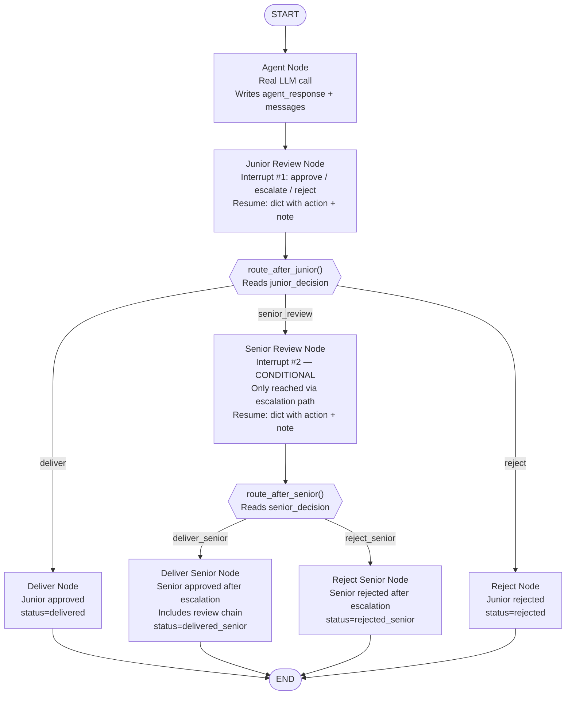

# Chapter 5 — Pattern E: Escalation Chain

> **Prerequisite:** Read [Chapter 4 — Multi-Step Approval](./04_multi_step_approval.md) first. This chapter introduces tiered authority and conditional interrupt paths — the second interrupt only fires on escalation, not on every run.

---

## 1. What Is This Pattern?

Think of a customer support centre at a hospital. When a patient calls with a billing or appointment question, a tier-1 support agent answers. Most calls are routine — the agent handles them and closes the ticket. But some calls involve complex medical coverage disputes or errors in clinical records. The tier-1 agent is not authorised to resolve those. They flag the ticket as "escalate" and transfer it to a tier-2 specialist. The specialist reviews the case with full context — including the tier-1 agent's escalation note explaining why they could not handle it — and makes a final decision. The specialist either resolves the case (approve) or formally rejects it. There is no further escalation — the specialist is the terminal authority.

**Escalation Chain in LangGraph models that two-tier review process.** A junior reviewer sees the AI's output first. They can:
- **Approve** — the output is delivered immediately, no senior review needed.
- **Reject** — the output is blocked immediately, no senior review needed.
- **Escalate** — the case is uncertain, and the junior reviewer defers to the senior.

Only when the junior escalates does the senior reviewer enter the picture. The senior sees the AI's original output plus the junior's escalation note. The senior can approve or reject — they cannot escalate further (they are the terminal authority). The number of interrupts consumed per run is **variable**: either 1 (junior approves or rejects) or 2 (junior escalates + senior decides).

This is fundamentally different from Pattern D (Multi-Step Approval), where both interrupts always fire on approved cases. Here, interrupt #2 is **conditional** — it only fires on the escalation path.

---

## 2. When Should You Use It?

**Use this pattern when:**

- You have a high volume of cases and want a junior reviewer to handle the routine ones, reserving senior reviewer time for genuinely uncertain or complex cases.
- Different reviewers have different authority levels: a junior reviewer can handle clear approvals and clear rejections, but defers on ambiguous cases.
- You want to model a realistic organisational review hierarchy in your pipeline.
- You want an audit trail that records both the junior's escalation reason and the senior's decision reason.

**Do NOT use this pattern when:**

- All cases need the same level of review authority — use [Pattern A (Basic Approval)](./01_basic_approval.md) or [Pattern C (Edit Before Approve)](./03_edit_before_approve.md).
- You need two sequential reviews at the *same* authority level (e.g., two independent physicians must both approve) — use [Pattern D (Multi-Step Approval)](./04_multi_step_approval.md).
- You need more than two tiers. The pattern scales (add `senior_review_node` → `expert_review` for a three-tier chain), but each tier adds graph complexity.

---

## 3. How It Works — Architecture Walkthrough

### ASCII Graph (from the script's docstring)

```
[START]
   |
   v
[agent]              <-- real LLM call
   |
   v
[junior_review]      <-- interrupt #1: approve / escalate / reject
   |
route_after_junior()
   |
+--+----------+----------+
|              |          |
| "deliver"    | "senior" | "reject"
v              v          v
[deliver]   [senior_review] [reject]
|              |          |
|         interrupt #2    |
|              |          |
|    +----+----+----+     |
|    |              |     |
|  "deliver"     "reject" |
|    |              |     |
v    v              v     v
[END][END]        [END] [END]
```

### Step-by-Step Explanation

**Node: `agent`**
Real LLM call. Produces a clinical assessment. Writes `agent_response` and `messages` to state.

**Node: `junior_review`**
**Interrupt #1.** The junior reviewer (resident/nurse) sees the assessment. The payload includes three options: `approve`, `escalate`, `reject`. The resume value is a dict: `{"action": "approve"|"escalate"|"reject", "note": "..."}`. The `note` field carries the reviewer's reasoning — their escalation rationale or rejection reason.

**Router: `route_after_junior()`**
Three paths:
- `"approve"` → `deliver_node` → END. Junior handled it. No senior needed.
- `"escalate"` → `senior_review_node`. Senior review triggered.
- `"reject"` → `reject_node` → END. Junior blocked it. No senior needed.

**Node: `senior_review`**
**Interrupt #2 (conditional).** Only reached on the escalation path. The senior reviewer (attending physician) sees:
- The original AI response.
- The junior's escalation note.
Two options: `approve`, `reject`. No further escalation (terminal authority).

**Router: `route_after_senior()`**
Two paths: `"deliver_senior"` or `"reject_senior"`.

**Terminal nodes: `deliver`, `deliver_senior`, `reject`, `reject_senior`**
- `deliver` — approved at junior level.
- `deliver_senior` — approved at senior level after escalation; includes review chain in `final_output`.
- `reject` — blocked at junior level.
- `reject_senior` — blocked at senior level after escalation; includes both junior and senior notes.

### Mermaid Flowchart



---

## 4. State Schema Deep Dive

```python
class EscalationState(TypedDict):
    messages: Annotated[list, add_messages]   # Accumulated LLM messages
    patient_case: dict                         # Set at invocation time
    agent_response: str       # Written by: agent_node; Read by: junior_review, senior_review, terminal nodes
    junior_decision: str      # Written by: junior_review ("approve" | "escalate" | "reject")
    junior_note: str          # Written by: junior_review — the junior's reasoning
    senior_decision: str      # Written by: senior_review ("approve" | "reject") — empty if no escalation
    senior_note: str          # Written by: senior_review — the senior's reasoning — empty if no escalation
    final_output: str         # Written by: terminal nodes
    status: str               # "delivered" | "delivered_senior" | "rejected" | "rejected_senior"
```

**Field: `junior_decision: str`**
- **Who writes it:** `junior_review_node` — the action from `parse_resume_action()`. One of `"approve"`, `"escalate"`, or `"reject"`.
- **Who reads it:** `route_after_junior` — determines the routing path. `reject_node` can also include it in the output message.
- **Why string instead of bool:** Three possible values — cannot be represented as a boolean. The escalation option is the key differentiator from Pattern D.

**Field: `junior_note: str`**
- **Who writes it:** `junior_review_node` — `parsed["note"]` from the resume dict.
- **Who reads it:** `senior_review_node` — includes it in the interrupt payload for the senior to see. `deliver_senior_node` and `reject_senior_node` — include it in `final_output` as part of the review chain.
- **Why it exists:** The escalation note is context that passes from the junior reviewer to the senior reviewer **through state**. The senior does not see the junior reviewer directly — they see the note preserved in state. This models the real-world "escalation ticket" mechanism.

**Fields: `senior_decision: str` and `senior_note: str`**
- Written only if the escalation path is taken. On junior-approve and junior-reject paths, these fields remain as their initial empty values.
- The four possible `status` values (`"delivered"`, `"delivered_senior"`, `"rejected"`, `"rejected_senior"`) encode which path was taken and whether the senior was involved, so callers do not need to inspect `senior_decision` to know the outcome.

> **NOTE:** The `status` field has four possible values, one for each terminal node. This is intentional — the calling system needs to know not just the outcome but which reviewer tier made the final decision. `"delivered"` means junior approved without escalation. `"delivered_senior"` means junior escalated and senior approved. The distinction matters for audit, compliance, and LLM cost attribution.

---

## 5. Node-by-Node Code Walkthrough

### `agent_node`

```python
def agent_node(state: EscalationState) -> dict:
    """Clinical agent — real LLM call."""
    llm = get_llm()
    patient = state["patient_case"]

    system = SystemMessage(content=(
        "You are a clinical triage specialist. Provide a clinical "
        "assessment with treatment recommendations. Include specific "
        "medication names and dosages. End with a disclaimer."
    ))
    prompt = HumanMessage(content=f"Patient: {patient.get('age')}y ...")

    config = build_callback_config(trace_name="escalation_agent")
    response = llm.invoke([system, prompt], config=config)

    return {
        "messages": [response],
        "agent_response": response.content,    # Used by both review nodes
    }
```

Same structure as Patterns B, C, D — a real LLM call producing a named `agent_response`. The key difference is downstream: the response is reviewed by two different roles on the escalation path.

---

### `junior_review_node` (Interrupt #1)

```python
def junior_review_node(state: EscalationState) -> dict:
    """
    Interrupt #1: Junior reviewer (nurse/resident).

    Three options:
        approve  — clear case, deliver directly
        escalate — uncertain, defer to senior
        reject   — clearly wrong, block
    """
    response = state["agent_response"]     # Read the AI output (idempotent)
    print(f"    | [Junior] Reviewing response ({len(response)} chars)...")

    # ── INTERRUPT #1: Junior review ─────────────────────────────────────────
    # build_escalation_payload() creates a payload with:
    #   reviewer_role="junior (resident/nurse)"  — shown in the review UI
    #   options=["approve", "escalate", "reject"]  — three choices
    #   note= — context for the reviewer
    # The resume value format is: {"action": "approve"|"escalate"|"reject", "note": "..."}
    decision = interrupt(build_escalation_payload(
        response=response,
        reviewer_role="junior (resident/nurse)",
        options=["approve", "escalate", "reject"],   # Three-option set for junior tier
        note="Escalate if you are uncertain about the diagnosis or dosage.",
    ))
    # On first call: graph freezes here.
    # On resume: decision = {"action": "...", "note": "..."}

    # parse_resume_action() normalises: bool→"approve"/"reject", str→{"action":str}, dict→as-is
    parsed = parse_resume_action(decision, default_action="escalate")  # Default: escalate (conservative)
    action = parsed["action"]   # "approve", "escalate", or "reject"
    note = parsed["note"]       # Junior's reasoning (empty string if not provided)

    print(f"    | [Junior] Decision: {action.upper()}")

    return {
        "junior_decision": action,   # Read by route_after_junior
        "junior_note": note,         # Passed to senior_review, terminal nodes
    }
```

**The `default_action="escalate"` choice:** When the junior reviewer's resume value is ambiguous or a plain `True`, the default is `"escalate"` (not `"approve"`). This is a conservative default: when uncertain, defer to the senior rather than approving or blocking automatically.

**The `note` field in the resume value:** `{"action": "escalate", "note": "Drug interaction between Lisinopril and Spironolactone needs attending review."}` — the junior explains why they are escalating. This note travels through state to `senior_review_node`.

**What breaks if you remove this node:** The graph has no junior review. All AI outputs go directly to a terminal node. No escalation path exists.

---

### `route_after_junior` (Router #1)

```python
def route_after_junior(state: EscalationState) -> Literal["deliver", "senior_review", "reject"]:
    """
    Route based on junior reviewer's decision.

    approve  -> deliver directly (no senior needed)
    escalate -> senior_review (needs attending approval)
    reject   -> reject (blocked at junior level)
    """
    decision = state["junior_decision"]
    if decision == "approve":
        return "deliver"          # 1 interrupt total, senior never involved
    if decision == "escalate":
        return "senior_review"    # 2 interrupts total, senior decides
    return "reject"               # 1 interrupt total, senior never involved
```

This is the "filter" decision point. On `"approve"` and `"reject"`, the senior review node is bypassed entirely. The senior reviewer only sees escalated cases, keeping their workload focused on genuinely uncertain situations.

---

### `senior_review_node` (Interrupt #2, conditional)

```python
def senior_review_node(state: EscalationState) -> dict:
    """
    Interrupt #2: Senior reviewer (attending physician).

    Only reached when junior escalated.
    The senior sees:
        - The agent's original response
        - The junior's escalation note
        - Two options: approve or reject (no further escalation)
    """
    response = state["agent_response"]
    junior_note = state.get("junior_note", "No note provided")  # Read the escalation reason

    print(f"    | [Senior] Escalated from junior reviewer")
    print(f"    | [Senior] Junior's note: {junior_note}")  # Show context to debug/audit

    # ── INTERRUPT #2: Senior review ─────────────────────────────────────────
    # Same build_escalation_payload() but with senior tier options (no "escalate").
    # The payload includes the junior's note context for the senior to see.
    decision = interrupt(build_escalation_payload(
        response=response,
        reviewer_role="senior (attending physician)",
        options=["approve", "reject"],   # Terminal authority — no further escalation
        note="You are the terminal authority. No further escalation possible.",
    ))

    parsed = parse_resume_action(decision, default_action="reject")  # Default: reject (conservative)
    action = parsed["action"]    # "approve" or "reject"
    note = parsed["note"]        # Senior's reasoning

    print(f"    | [Senior] Decision: {action.upper()}")

    return {
        "senior_decision": action,   # Read by route_after_senior
        "senior_note": note,         # Included in terminal node output for audit
    }
```

**Key design decisions:**
- The senior's options are `["approve", "reject"]` — no `"escalate"`. The senior is the terminal authority in this two-tier chain.
- `default_action="reject"` — if the senior's decision is ambiguous, the conservative default is to reject rather than approve. Rejecting an uncertain case is less risky than approving it.
- The node does not rebuild the interrupt payload with junior context — the context is shown to the operator via `print(f"... Junior's note: {junior_note}")`. In a production review UI, `build_escalation_payload` would include `junior_note` in the payload dict so the UI can render it.

---

### `route_after_senior` and Terminal Nodes

```python
def route_after_senior(state: EscalationState) -> Literal["deliver_senior", "reject_senior"]:
    if state["senior_decision"] == "approve":
        return "deliver_senior"
    return "reject_senior"

def deliver_node(state: EscalationState) -> dict:
    """Deliver — approved by junior reviewer (no escalation needed)."""
    return {"final_output": state["agent_response"], "status": "delivered"}

def deliver_senior_node(state: EscalationState) -> dict:
    """Deliver — approved by senior reviewer after escalation."""
    junior_note = state.get("junior_note", "")
    senior_note = state.get("senior_note", "")
    output = f"{state['agent_response']}\n\n--- Review Chain ---\n"
    output += f"Junior reviewer: ESCALATED"
    if junior_note:
        output += f" ({junior_note})"
    output += f"\nSenior reviewer: APPROVED"
    if senior_note:
        output += f" ({senior_note})"
    return {"final_output": output, "status": "delivered_senior"}

def reject_node(state: EscalationState) -> dict:
    """Reject — blocked by junior reviewer."""
    note = state.get("junior_note", "No reason provided")
    return {
        "final_output": f"REJECTED by junior reviewer.\nReason: {note}",
        "status": "rejected",
    }

def reject_senior_node(state: EscalationState) -> dict:
    """Reject — blocked by senior reviewer after escalation."""
    return {
        "final_output": (
            f"REJECTED by senior reviewer.\n"
            f"Junior escalation reason: {state.get('junior_note', '')}\n"
            f"Senior rejection reason: {state.get('senior_note', 'No reason provided')}"
        ),
        "status": "rejected_senior",
    }
```

**`deliver_senior_node` includes the full review chain** in `final_output`. This is the audit trail: the delivered text includes metadata about who reviewed it, in what order, and what they noted. In a real system, this might be stored in a separate audit record rather than appended to the patient-facing output.

---

## 6. Interrupt and Resume Explained

### Variable Interrupt Count

This pattern has **1 or 2 interrupts** per run — unlike Pattern D which always has 2 on the successful path.

```
Path 1 (junior approves):
  Call 1: invoke initial → interrupt #1 (junior)
  Call 2: resume={"action": "approve"} → junior approves → deliver → END
  Total: 2 graph.invoke() calls, 1 interrupt

Path 2 (junior escalates, senior approves):
  Call 1: invoke initial → interrupt #1 (junior)
  Call 2: resume={"action": "escalate"} → junior escalates → interrupt #2 (senior)
  Call 3: resume={"action": "approve"} → senior approves → deliver_senior → END
  Total: 3 graph.invoke() calls, 2 interrupts

Path 3 (junior rejects):
  Call 1: invoke initial → interrupt #1 (junior)
  Call 2: resume={"action": "reject"} → junior rejects → reject → END
  Total: 2 graph.invoke() calls, 1 interrupt
```

### `run_multi_interrupt_cycle()` with Escalation

`run_multi_interrupt_cycle` works for Pattern E because its loop "consume the next item in `resume_sequence` if there is a pending interrupt" naturally handles the variable interrupt count:

```python
# Test 1: Junior approves (1 interrupt)
r1 = run_multi_interrupt_cycle(
    graph=graph, thread_id="esc-001", initial_state=make_state(),
    resume_sequence=[{"action": "approve", "note": "Assessment looks thorough."}],  # 1 item
)
# After Call 2, no more __interrupt__. Loop exits. r1["status"] = "delivered".

# Test 2: Junior escalates, senior approves (2 interrupts)
r2 = run_multi_interrupt_cycle(
    graph=graph, thread_id="esc-002", initial_state=make_state(),
    resume_sequence=[
        {"action": "escalate", "note": "Drug interaction concern."},  # item 1 → for junior
        {"action": "approve", "note": "Agree. Monitor K+ closely."},  # item 2 → for senior
    ],
)
# After Call 2, __interrupt__ is pending (senior). Call 3 resumes senior.
# r2["status"] = "delivered_senior".
```

### Decision Tables

**Router #1: `route_after_junior`**

| `junior_decision` | Returns | Next node | `status` outcome | Senior involved? |
|-------------------|---------|-----------|-----------------|-----------------|
| `"approve"` | `"deliver"` | `deliver_node` | `"delivered"` | No (1 interrupt) |
| `"escalate"` | `"senior_review"` | `senior_review_node` | depends on senior | Yes (2 interrupts) |
| `"reject"` | `"reject"` | `reject_node` | `"rejected"` | No (1 interrupt) |

**Router #2: `route_after_senior`** (only reached on escalation path)

| `senior_decision` | Returns | Next node | `status` outcome |
|-------------------|---------|-----------|-----------------|
| `"approve"` | `"deliver_senior"` | `deliver_senior_node` | `"delivered_senior"` |
| `"reject"` | `"reject_senior"` | `reject_senior_node` | `"rejected_senior"` |

---

## 7. Worked Examples — Three Test Scenarios

### Test 1: Junior Approves (1 interrupt)

**Resume:** `[{"action": "approve", "note": "Assessment looks thorough."}]`

| Call | Active node | Event | State change |
|------|-------------|-------|-------------|
| 1 | `agent_node` | LLM call | `agent_response = "..."` |
| 1 | `junior_review_node` | interrupt #1 | Paused |
| 2 | `junior_review_node` (resume) | Resume: `"approve"` | `junior_decision="approve"`, `junior_note="Assessment looks thorough."` |
| 2 | `route_after_junior` | Returns `"deliver"` | — |
| 2 | `deliver_node` | Write output | `status="delivered"` |

`senior_decision = ""` (never written — field remains empty). `senior_review_node` never ran.

---

### Test 2: Junior Escalates → Senior Approves (2 interrupts)

**Resume:** `[{"action": "escalate", "note": "Drug interaction concern."}, {"action": "approve", "note": "Agree. Monitor K+."}]`

| Call | Active node | Event | State change |
|------|-------------|-------|-------------|
| 1 | `agent_node` | LLM call | `agent_response = "..."` |
| 1 | `junior_review_node` | interrupt #1 | Paused |
| 2 | `junior_review_node` (resume) | Resume: `"escalate"` | `junior_decision="escalate"`, `junior_note="Drug interaction concern."` |
| 2 | `route_after_junior` | Returns `"senior_review"` | — |
| 2 | `senior_review_node` | interrupt #2 | Paused (with junior_note visible in logs) |
| 3 | `senior_review_node` (resume) | Resume: `"approve"` | `senior_decision="approve"`, `senior_note="Agree. Monitor K+."` |
| 3 | `route_after_senior` | Returns `"deliver_senior"` | — |
| 3 | `deliver_senior_node` | Write output | `status="delivered_senior"` |

Final `final_output` includes: AI response + "Junior: ESCALATED (Drug interaction concern)" + "Senior: APPROVED (Agree. Monitor K+.)".

---

### Test 3: Junior Rejects (1 interrupt)

**Resume:** `[{"action": "reject", "note": "Missing critical drug interaction warning."}]`

| Call | Active node | Event | State change |
|------|-------------|-------|-------------|
| 1 | `agent_node` | LLM call | `agent_response = "..."` |
| 1 | `junior_review_node` | interrupt #1 | Paused |
| 2 | `junior_review_node` (resume) | Resume: `"reject"` | `junior_decision="reject"`, `junior_note="Missing critical drug interaction warning."` |
| 2 | `route_after_junior` | Returns `"reject"` | — |
| 2 | `reject_node` | Write output | `status="rejected"` |

`senior_review_node` never ran. 1 interrupt, 2 calls, same as Test 1.

---

## 8. Key Concepts Introduced

- **Tiered reviewer authority** — Two distinct reviewer roles with different permissions: junior (approve/escalate/reject) and senior (approve/reject, terminal). The escalation option in the junior set is the structural differentiator from Pattern D. First demonstrated in `junior_review_node` and `senior_review_node`.

- **`build_escalation_payload(response, reviewer_role, options, note)`** — Root module helper from `hitl.primitives` that creates an interrupt payload with a `reviewer_role` field and a tier-specific `options` list. First appears in `junior_review_node`'s `interrupt(build_escalation_payload(..., options=["approve", "escalate", "reject"]))`.

- **Conditional interrupt — not every path hits every interrupt** — Interrupt #2 only fires on the `"escalate"` path. On `"approve"` and `"reject"` paths, `senior_review_node` is never reached and interrupt #2 never fires. This is the core structural difference from Pattern D (where interrupt #2 always fires on the approved path). First demonstrated in `route_after_junior`.

- **`note` field in resume dict** — The junior reviewer's escalation note (`{"action": "escalate", "note": "drug interaction concern"}`) is preserved in state and read by the senior reviewer node. The review chain passes human context through state from one tier to the next. First demonstrated in `junior_review_node`'s `note = parsed["note"]`.

- **Variable `graph.invoke()` call count per run** — Junior-approve and junior-reject paths require 2 calls (initial + 1 resume). Junior-escalate paths require 3 calls (initial + 2 resumes). `run_multi_interrupt_cycle` handles this transparently with `resume_sequence` of variable length. First demonstrated in the decision tables and worked examples.

- **Four distinct terminal statuses** — `"delivered"`, `"delivered_senior"`, `"rejected"`, `"rejected_senior"` encode both the outcome and which tier made the final decision. First demonstrated in the terminal nodes.

---

## 9. Common Mistakes and How to Avoid Them

### Mistake 1: Sending `{"action": "escalate"}` for the senior reviewer's resume

**What goes wrong:** For test 2, you accidentally send the same resume format for both the junior and the senior: `resume_sequence=[{"action": "escalate"}, {"action": "approve"}]`. The junior escalates (correct). The senior's resume is `{"action": "approve"}` — correct. But if you sent `{"action": "escalate"}` for the senior, `parse_resume_action` would return `action="escalate"`. `route_after_senior` checks `if state["senior_decision"] == "approve"` — fails — and falls through to `reject_senior`. The senior effectively rejected despite your intent.

**Why it goes wrong:** The senior's router only recognises `"approve"` and `"reject"`. It has no `"escalate"` path.

**Fix:** Always send `{"action": "approve"}` or `{"action": "reject"}` for the senior's resume. The `options=["approve", "reject"]` in `build_escalation_payload` is the signal — no `"escalate"` option at the senior tier.

---

### Mistake 2: Treating senior `note` and junior `note` as the same field

**What goes wrong:** In `reject_senior_node`, you try to read the junior's escalation note from `state["senior_note"]` — but that field contains the senior's rejection reason. You display the wrong note to the caller.

**Why it goes wrong:** The state has two separate note fields: `junior_note` (written by `junior_review_node`) and `senior_note` (written by `senior_review_node`). They are independent.

**Fix:** Read the correct field: `state["junior_note"]` for the junior's reasoning and `state["senior_note"]` for the senior's reasoning.

---

### Mistake 3: Providing only 1 item in `resume_sequence` for an escalation test

**What goes wrong:** You call `run_multi_interrupt_cycle(..., resume_sequence=[{"action": "escalate", "note": "..."}])` for a junior-escalate test. The junior escalates. The graph pauses at interrupt #2 for the senior. `run_multi_interrupt_cycle` finds `resume_sequence` is now exhausted but `__interrupt__` is still pending. The loop exits without resuming the senior.

**Why it goes wrong:** Each interrupt point consumes one item from `resume_sequence`. A two-interrupt path needs two items.

**Fix:** For escalation paths, provide 2 items: `resume_sequence=[{"action": "escalate", "note": "..."}, {"action": "approve", "note": "..."}]`.

---

### Mistake 4: LangGraph state immutability — reading `state["senior_decision"]` before `senior_review_node` runs

**What goes wrong:** In `deliver_node` (reached when junior approves), you check `state["senior_decision"]` to verify no escalation happened. The field is `""` (empty string), which is the initial value. In a non-escalation path, this is always `""` — but if you check `if state["senior_decision"] == "rejected"` expecting a meaningful value, you will always get `False`.

**Why it goes wrong:** `senior_decision` is only written by `senior_review_node`, which only runs on the escalation path. On the junior-approve path, `senior_decision` remains as the initial empty string.

**Fix:** Use `state["status"]` to determine the final outcome. `"delivered"` means junior approved (no escalation). `"delivered_senior"` means senior approved after escalation. Do not inspect `senior_decision` on non-escalation paths.

---

## 10. How This Pattern Connects to the Others

### Position in the Learning Sequence

Pattern E is the final HITL pattern and the culmination of the five-pattern learning sequence. It combines every concept introduced in Patterns A–D:
- Boolean resumes? No — dict resumes with `"note"` field (extends Pattern B's dict resumes).
- Single interrupt? No — conditional second interrupt (extends Pattern D's multiple interrupts).
- Fixed routing? No — three-way routing at the junior level (extends Pattern B's conditional routing).

### What Pattern D Does NOT Handle

Pattern D has two interrupt points that always fire on the approved path. What it cannot model:
- Three-way routing (approve/escalate/reject) — Pattern D's routers are binary (approve/reject).
- Conditional second interrupt — in Pattern D, if the first is approved, the second always fires. In Pattern E, the second only fires on escalation.
- Reviewer roles — in Pattern D, both review nodes are functionally identical (same authority level).

### Completing the HITL Module

Pattern E completes the HITL module. Together, the five patterns form a complete toolkit:

| Pattern | Core mechanic you learned |
|---------|--------------------------|
| A — Basic Approval | `interrupt()` + `Command(resume=bool)` + `MemorySaver` + `thread_id` + node restart |
| B — Tool Call Confirmation | Dict resume + `parse_resume_action()` + conditional routing after HITL |
| C — Edit Before Approve | Human-injected content via resume dict + three-way action from one interrupt |
| D — Multi-Step Approval | Multiple sequential interrupts + same `thread_id` + early termination + `run_multi_interrupt_cycle` |
| E — Escalation Chain | Tiered authority + conditional interrupt + `build_escalation_payload` + variable call count |

With these patterns, you can model any human-in-the-loop workflow that a real agentic AI system requires.

---

## 11. Quick-Reference Summary

| Aspect | Detail |
|--------|--------|
| **Pattern name** | Escalation Chain |
| **Script file** | `scripts/HITL/escalation_chain.py` |
| **Graph nodes** | `agent`, `junior_review`, `senior_review`, `deliver`, `deliver_senior`, `reject`, `reject_senior` |
| **Interrupt count** | 1 (junior approve/reject path) or 2 (junior escalate path) — variable |
| **Resume value type** | Dict — `{"action": "approve"|"escalate"|"reject", "note": "..."}` for junior; `{"action": "approve"|"reject", "note": "..."}` for senior |
| **Routing type** | `add_conditional_edges` from both `junior_review` (3-way) and `senior_review` (2-way) |
| **State fields** | `messages`, `patient_case`, `agent_response`, `junior_decision`, `junior_note`, `senior_decision`, `senior_note`, `final_output`, `status` |
| **Root modules** | `hitl.primitives` → `build_escalation_payload`, `parse_resume_action`; `hitl.run_cycle` → `run_multi_interrupt_cycle` |
| **New concepts** | Tiered reviewer authority, `build_escalation_payload`, conditional interrupt, `note` field propagation through state, four terminal statuses, variable interrupt count |
| **Prerequisite** | [Chapter 4 — Multi-Step Approval](./04_multi_step_approval.md) |
| **Next** | You have completed the HITL module. See [`../README.md`](../README.md) for the overall learning path. |

---

*You have completed all five HITL pattern chapters. Return to [`../README.md`](../README.md) for next steps, or see the [course-level HITL docs](../../../docs/hitl/) for deeper background on the architectural decisions and production considerations.*
