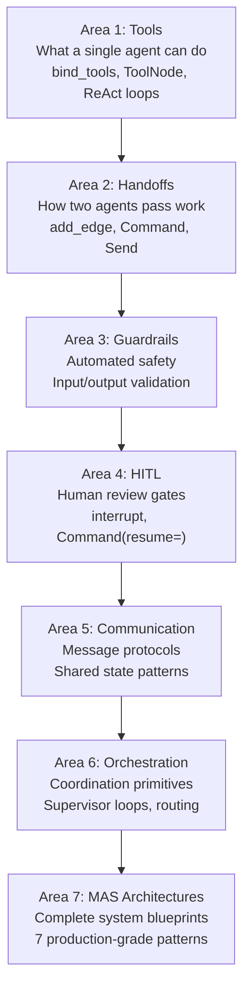
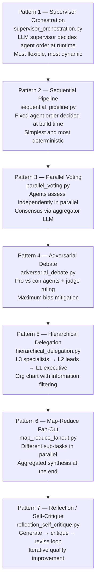
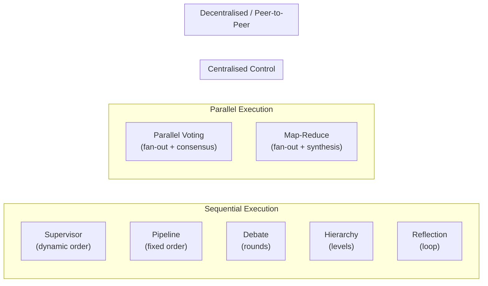
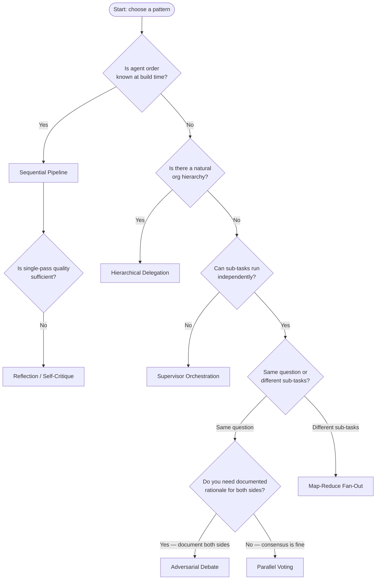
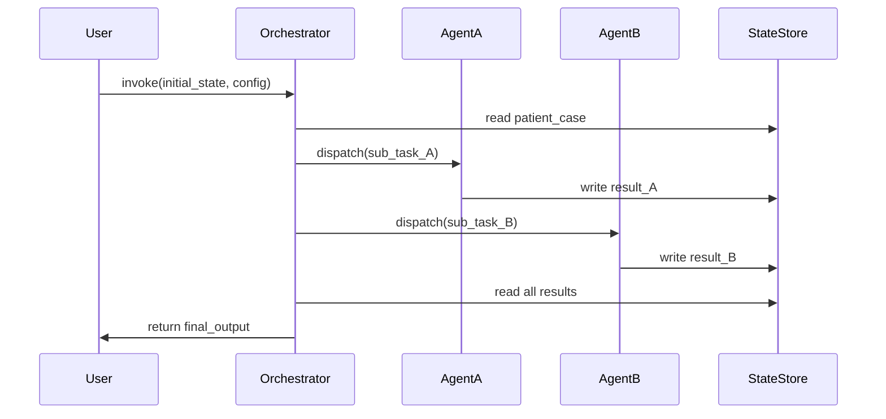

# Chapter 0 — Multi-Agent System Architecture Patterns: An Overview

> **Reading time:** ~25 minutes. Read this chapter before opening any of the seven pattern chapters.

---

## 1. What Is a Multi-Agent System Architecture?

Picture a large teaching hospital. A patient arrives with chest pain and elevated troponin. The hospital does not assign one doctor to handle everything. Instead, a structured system activates: a triage nurse classifies urgency, a cardiologist analyses the ECG and lab results, a pharmacist reviews drug interactions, and a chief medical officer coordinates the overall response. Each specialist has a focused domain of expertise. An organisational structure — the hospital's chain of command and communication protocols — determines how their work connects, in what order it happens, and how disagreements are resolved.

**A Multi-Agent System (MAS) architecture is that organisational structure, expressed in code.** Individual agents (the `TriageAgent`, `DiagnosticAgent`, `PharmacistAgent` in this project) are the specialists. The MAS architecture is the blueprint that answers:

- **Who decides what runs next?** (The supervisor? A fixed schedule? The agents themselves?)
- **In what order?** (Strict sequence? In parallel? Iteratively?)
- **How are results combined?** (Accumulated context? Majority vote? Judge ruling? Hierarchical summary?)
- **What happens when agents disagree?** (Flag for review? Debate? Escalate?)

Every script in this module is a different answer to those four questions, applied to the same patient case, so you can directly compare them.

---

## 2. MAS Architectures vs Earlier Areas

You have already studied tools (Area 1), handoffs between two agents (Area 2), safety guardrails (Area 3), human-in-the-loop gates (Area 4), communication protocols (Area 5), and orchestration primitives (Area 6). Here is where MAS architectures fit in the full stack:

The MAS architectures in this module build on all prior areas. They use `add_conditional_edges` (from handoff), the `Send` API (from handoff fan-out), supervisor loops (from orchestration), and the `BaseAgent` objects (built from tools). They are **system-level compositions**, not new primitives.

---

## 3. The Seven Patterns — Learning Progression

---

## 4. The MAS Architecture Landscape — 2D Map

The seven patterns can be positioned on two axes: **who controls routing** (centralised vs decentralised/self-organising) and **execution model** (sequential vs parallel):

| Pattern | Routing control | Execution model | Agent visibility |
|---------|----------------|----------------|-----------------|
| Supervisor | Central LLM decides at runtime | Sequential loop | Each agent sees all prior outputs |
| Pipeline | Developer decides at build time | Sequential fixed | Each agent sees all prior outputs |
| Parallel Voting | No central router; all agents run | Parallel | Agents are isolated from each other |
| Adversarial Debate | No central router; turns are fixed | Sequential rounds | Each agent sees the opponent's argument |
| Hierarchical Delegation | Chain of command (L3→L2→L1) | Sequential by level | Each level sees only the level below's summary |
| Map-Reduce Fan-Out | No central router; sub-tasks are fixed | Parallel map, sequential reduce | Workers are isolated from each other |
| Reflection | Conditional loop (critic decides) | Sequential iterative | Critic sees the generator; generator sees the critique |

---

## 5. Pattern Comparison Table

| Pattern | LangGraph Mechanism | State Fields | Primary Trade-off | Best for |
|---------|--------------------|--------------|--------------------|----------|
| **Supervisor** | `add_conditional_edges` from supervisor node; all workers return to supervisor | `next_agent`, `completed_agents`, `agent_outputs`, `iteration` | Flexible vs single-point-of-failure; supervisor is the bottleneck | Dynamic, unpredictable workflows where order matters |
| **Pipeline** | `add_edge` only; no routing | `accumulated_context`, `stage_number`, `triage_output`, `diagnostic_output`, `pharmacist_output` | Simple/debuggable vs brittle for non-linear cases | Predictable, stable workflows with a natural processing order |
| **Parallel Voting** | `Send` API fan-out; `operator.add` reducer | `specialist_results` (list, merged), `agreement_score`, `consensus_report` | Independent views vs 3× cost; herding risk | High-stakes decisions where single-agent bias is unacceptable |
| **Debate** | Fixed edges; adversarial prompt design | `pro_opening`, `con_opening`, `pro_rebuttal`, `con_rebuttal`, `judge_verdict` | Maximum bias mitigation vs highest latency + cost | Complex dilemmas with legitimate opposing views |
| **Hierarchy** | Fixed edges; 3 nodes, one per level | `specialist_outputs`, `team_lead_outputs`, `executive_decision` | Accountability/scalability vs added complexity and alignment risk | Large teams; strategic decisions based on filtered summaries |
| **Map-Reduce** | `Send` API fan-out; `operator.add` reducer; separate reduce+produce nodes | `worker_results` (list, merged), `aggregated_findings`, `final_report` | Parallel throughput vs assumes sub-task independence | Large tasks with independently addressable sub-problems |
| **Reflection** | `add_conditional_edges` from critic (loop-back or end) | `current_recommendation`, `critique`, `critique_severity`, `revision_history`, `iteration` | Automated quality improvement vs added latency per loop | Safety-critical outputs; single-pass quality insufficient |

---

## 6. How to Choose a Pattern

### Choosing by routing question

**"Do I know the agent order in advance?"**
- Yes → **Pipeline** (Pattern 2). Hard-code the edges at build time.
- No → **Supervisor** (Pattern 1). Let the LLM decide order at runtime.

**"Can the sub-tasks run independently?"**
- Same question, different perspectives → **Parallel Voting** (Pattern 3).
- Different questions, independent sub-tasks → **Map-Reduce** (Pattern 6).
- Dependent tasks (each needs prior output) → **Pipeline** (Pattern 2).

**"Do I need to mitigate bias or document both sides of a decision?"**
- Moderate risk → **Parallel Voting** (multiple independent opinions).
- High risk, documented rationale required → **Adversarial Debate** (Pattern 4).

**"Does the organisation have layers of authority?"**
- Yes → **Hierarchical Delegation** (Pattern 5).

**"Is output quality too low from a single pass?"**
- No human review required → **Reflection / Self-Critique** (Pattern 7).
- Human review required → Combine with **HITL** (Area 4).

### Pattern selection flowchart

---

## 7. Generic MAS Interaction — Sequence Overview

No matter the pattern, a MAS interaction follows a common structure:

In every pattern, `StateStore` is LangGraph's `TypedDict`-based state object (managed by the `StateGraph`). The `Orchestrator` role is played by different actors depending on the pattern: a supervisor LLM (Pattern 1), fixed edges (Patterns 2, 4, 5), the `Send` API (Patterns 3, 6), or a conditional routing function (Pattern 7).

---

## 8. Key Vocabulary Used Across All Patterns

| Term | Meaning | First introduced in |
|------|---------|---------------------|
| `StateGraph` | LangGraph's graph builder that maintains typed state across nodes | All patterns |
| `add_edge` | Fixed unconditional connection between two nodes | Pipeline (Pattern 2) |
| `add_conditional_edges` | Dynamic connection where a router function decides the next node | Supervisor (Pattern 1), Reflection (Pattern 7) |
| `Send(node, state)` | LangGraph API for initiating parallel node execution with a custom state payload | Voting (Pattern 3), Map-Reduce (Pattern 6) |
| `operator.add` | Python reducer used to merge parallel node outputs into a list | Voting (Pattern 3), Map-Reduce (Pattern 6) |
| `TriageAgent` / `DiagnosticAgent` / `PharmacistAgent` | Pre-built `BaseAgent` subclasses from `agents/`; used as specialists in Patterns 1–3, 5–6 | All patterns except 4, 7 |
| `AGENT_REGISTRY` | Dict mapping name → agent instance; used in supervisor pattern for dynamic dispatch | Supervisor (Pattern 1) |
| `accumulated_context` | State field that grows as each pipeline stage appends its output | Pipeline (Pattern 2) |
| `agreement_score` | Float 0.0–1.0 measuring inter-agent consensus, produced by the aggregator LLM | Voting (Pattern 3) |
| `judge_verdict` | The judge LLM's final ruling text after reviewing both sides' arguments | Debate (Pattern 4) |
| `executive_decision` | The Level 1 CMO's strategic decision text, informed by L2 team-lead summaries | Hierarchy (Pattern 5) |
| `worker_results` | `operator.add`-reduced list of all map-phase worker outputs | Map-Reduce (Pattern 6) |
| `critique_severity` | `"major"` or `"minor"` — the critic's assessment of whether the generator must revise | Reflection (Pattern 7) |
| `revision_history` | List of all generator outputs, appended each iteration; provides full audit trail | Reflection (Pattern 7) |

---

## 9. Reading Order

| Chapter | File | One-line description |
|---------|------|----------------------|
| **This file** | [`00_overview.md`](./00_overview.md) | MAS architecture landscape, pattern comparison, selection guide. |
| **Chapter 1** | [`01_supervisor_orchestration.md`](./01_supervisor_orchestration.md) | LLM supervisor routes between agents dynamically; centralized control loop. |
| **Chapter 2** | [`02_sequential_pipeline.md`](./02_sequential_pipeline.md) | Fixed-order pipeline; context accumulation; simplest and most debuggable. |
| **Chapter 3** | [`03_parallel_voting.md`](./03_parallel_voting.md) | `Send` API fan-out; independent parallel assessment; `operator.add` consensus. |
| **Chapter 4** | [`04_adversarial_debate.md`](./04_adversarial_debate.md) | Pro/con opening + rebuttal rounds + judge ruling; structured bias mitigation. |
| **Chapter 5** | [`05_hierarchical_delegation.md`](./05_hierarchical_delegation.md) | 3-level org chart; bottom-up information filtering; L3→L2→L1. |
| **Chapter 6** | [`06_map_reduce_fanout.md`](./06_map_reduce_fanout.md) | Different sub-tasks in parallel; reducer aggregates; producer synthesises. |
| **Chapter 7** | [`07_reflection_self_critique.md`](./07_reflection_self_critique.md) | Generate→critique→revise loop; conditional back-edge; quality iteration. |

---

*Continue to [Chapter 1 — Supervisor Orchestration](./01_supervisor_orchestration.md).*
