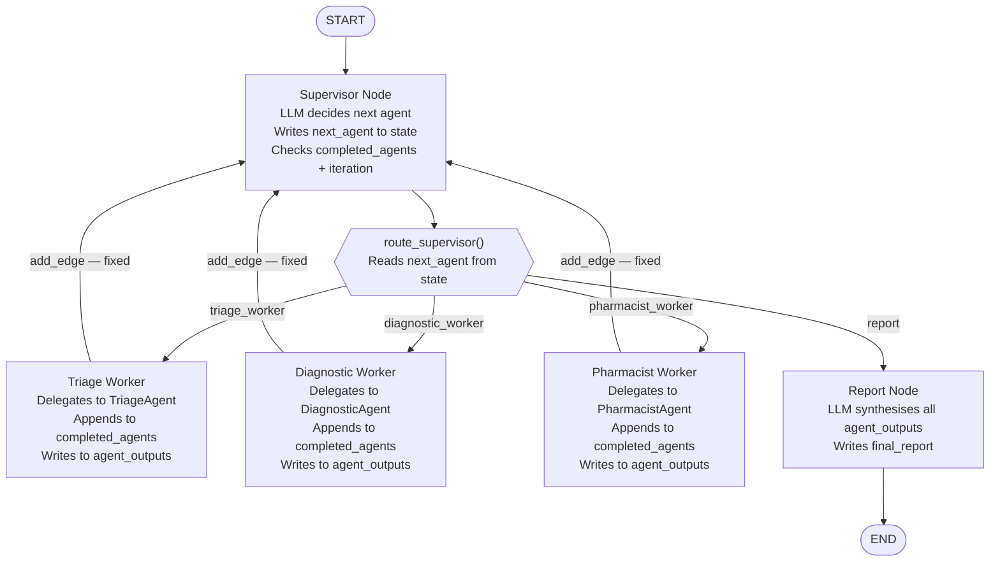

# Chapter 1 — Pattern 1: Supervisor Orchestration

> **Prerequisite:** Read [Chapter 0 — Overview](./00_overview.md) first.

---

## 1. What Is This Pattern?

Imagine the chief medical officer (CMO) of a hospital receiving a complex case. The CMO does not execute any clinical work personally. Instead, they look at the current situation, decide which specialist should act next ("send this to cardiology"), review the specialist's findings, and then decide the next step — "now get pharmacy involved" — until the case is fully handled. The CMO's routing decisions adapt in real time to what has been discovered so far. If cardiology finds something unexpected, the CMO might change the intended order, skipping one specialist or calling in an additional one.

**Supervisor Orchestration in LangGraph is that CMO.** A supervisor node — backed by an LLM — runs in a loop. At each iteration, it inspects the current state (which agents have already run, what they found) and decides which agent should run next, or whether the work is done. Specialist agents execute their tasks and return control to the supervisor, which continues the loop. This is the most common production MAS architecture because it is adaptive, centralised, and auditable.

---

## 2. When Should You Use It?

**Use this pattern when:**
- The order in which agents should work is not known in advance — it depends on what each agent finds.
- You need a single accountable decision-maker (the supervisor LLM) whose routing choices are logged.
- Some agents may be skipped, repeated, or called in a different order depending on the patient or case type.
- You are building a general-purpose assistant that needs to flexibly compose specialised sub-agents.

**Do NOT use this pattern when:**
- The agent order is always the same — use [Pattern 2 (Sequential Pipeline)](./02_sequential_pipeline.md). The supervisor adds LLM call cost per routing decision.
- You need maximum parallelism — use [Pattern 3 (Parallel Voting)](./03_parallel_voting.md) or [Pattern 6 (Map-Reduce)](./06_map_reduce_fanout.md). The supervisor loop is inherently sequential.
- The supervisor LLM itself is a reliability risk — if the supervisor hallucinates or makes a poor routing choice, the entire system is affected. Consider Pattern 5 (Hierarchy) for a more structured chain of command.

---

## 3. How It Works — Architecture Walkthrough

### ASCII Graph (from `supervisor_orchestration.py`)

```
[START]
   |
   v
[supervisor]  <------+------+------+
   |                 |      |      |
   |-- "triage" ---->|      |      |
   |-- "diagnostic" ------->|      |
   |-- "pharmacist" -------------->|
   |-- "FINISH" ---> [report] --> [END]

All specialist agents return to supervisor after execution.
Supervisor re-evaluates and routes to the next or finishes.
```

### Step-by-Step Explanation

**`START → supervisor`**: The entry edge is fixed. The supervisor always runs first — it receives the initial patient case and decides the first specialist.

**`supervisor → {triage_worker | diagnostic_worker | pharmacist_worker | report}`**: This is a `add_conditional_edges` with a router function (`route_supervisor`). The supervisor node writes `next_agent` to state. The router reads `next_agent` and returns the corresponding node name.

**`{triage_worker | diagnostic_worker | pharmacist_worker} → supervisor`**: All three worker nodes connect back to the supervisor with fixed `add_edge`. This creates the control loop.

**`supervisor → report → END`**: When the supervisor decides `"FINISH"`, the router returns `"report"`. The report node synthesises all findings and the graph ends.

**The loop invariant:** Every iteration, the supervisor checks `completed_agents` and `available_agents`. An agent can only run once per case. When all agents have completed (or max iterations reached), the supervisor forces `"FINISH"`.

### Mermaid Flowchart



---

## 4. State Schema Deep Dive

```python
class SupervisorState(TypedDict):
    messages: Annotated[list, add_messages]  # LLM message accumulation
    patient_case: dict                        # Set at invocation time — read by all nodes
    next_agent: str          # Written by: supervisor_node ("triage"|"diagnostic"|"pharmacist"|"FINISH")
    completed_agents: list[str]  # Written by: each worker node (appended); Read by: supervisor
    agent_outputs: dict          # Written by: each worker node; Read by: supervisor + report
    iteration: int               # Written by: supervisor_node (incremented each call)
    max_iterations: int          # Set at invocation time — the circuit breaker
    final_report: str            # Written by: report_node
```

**Field: `next_agent: str`**
The communication channel between the supervisor node and the router function. The supervisor LLM produces a text response (e.g., `"triage"`) which is parsed and written to `next_agent`. The router function reads it to return the target node name. This field is overwritten on each supervisor iteration.

**Field: `completed_agents: list[str]`**
The memory of what has already run. Each worker node appends its own name to this list. The supervisor reads it at the start of each iteration to compute `available_agents = [name for name in AGENT_REGISTRY if name not in completed]`. When `available_agents` is empty, the supervisor finishes. This is the termination condition based on work completion.

**Field: `agent_outputs: dict`**
A `{agent_name: output_string}` map. Each worker writes its result here. The supervisor reads truncated versions (`output[:200]`) to include in its routing prompt — it can see what each prior agent found and make an informed routing decision. The report node reads the full outputs to synthesise the final report.

**Field: `iteration: int` and `max_iterations: int`**
The circuit breaker. `iteration` is incremented by the supervisor on every call. If `iteration >= max_iterations`, the supervisor forces `"FINISH"` regardless of how many agents remain. This prevents infinite loops if the LLM makes repeated erroneous routing decisions or the termination condition is never reached.

> **NOTE:** `completed_agents` is a plain `list[str]` without a reducer annotation. Each worker reads `state.get("completed_agents", [])`, creates a new list with its name appended, and returns it as a partial state update. This is safe because only one worker runs at a time (the supervisor is sequential), so there are no concurrent writes to this field.

> **WARNING:** Do not annotate `completed_agents` with `operator.add` if you plan to run workers sequentially (as in this pattern). The `operator.add` reducer would append the entire list on each update rather than replacing it. Use `operator.add` only for parallel fan-out (as in Patterns 3 and 6).

---

## 5. Node-by-Node Code Walkthrough

### `supervisor_node`

```python
def supervisor_node(state: SupervisorState) -> dict:
    llm = get_llm()
    completed = state.get("completed_agents", [])       # What has already run
    outputs = state.get("agent_outputs", {})            # What they found
    iteration = state.get("iteration", 0)
    max_iterations = state.get("max_iterations", 5)

    # Circuit breaker: force finish if max iterations reached
    if iteration >= max_iterations:
        return {"next_agent": "FINISH", "iteration": iteration + 1}

    # Compute remaining agents
    available_agents = [name for name in AGENT_REGISTRY if name not in completed]

    if not available_agents:                             # All agents done
        return {"next_agent": "FINISH", "iteration": iteration + 1}

    # Build supervisor prompt with context from completed agents
    completed_summary = "\n".join(
        f"- {agent}: {output[:200]}" for agent, output in outputs.items()  # Truncated
    )

    supervisor_prompt = f"""... {completed_summary} ...
Which agent should run NEXT? Respond with ONLY the agent name."""

    response = llm.invoke(supervisor_prompt, config=build_callback_config(...))
    decision = response.content.strip().lower()

    # Parse the decision to a valid agent name
    next_agent = None
    for agent_name in available_agents:
        if agent_name in decision:
            next_agent = agent_name
            break
    if next_agent is None:
        next_agent = available_agents[0]  # Fallback to first available

    return {"next_agent": next_agent, "iteration": iteration + 1}
```

**Key design:** The supervisor's prompt shows `completed_summary` (truncated to 200 chars per agent), not the full outputs. This keeps the prompt manageable as more agents complete. The LLM needs to know what was found, not read a verbatim medical report.

**The fallback:** `if next_agent is None: next_agent = available_agents[0]`. If the LLM's response does not contain any valid agent name, the supervisor defaults to the first remaining agent. This prevents infinite loops caused by LLM hallucinations in routing decisions.

**What breaks if you remove the `max_iterations` guard:** If the LLM never produces `"FINISH"` (a possible hallucination), the graph runs forever. The `max_iterations` guard is the hard stop that makes the pattern production-safe.

---

### `triage_worker_node` (and analogous workers)

```python
def triage_worker_node(state: SupervisorState) -> dict:
    patient = state["patient_case"]                      # Read patient data
    context = "\n".join(                                 # Build context from prior outputs
        f"{k}: {v[:150]}" for k, v in state.get("agent_outputs", {}).items()
    )
    result = triage_agent.process_with_context(patient, context)  # Delegate to BaseAgent

    completed = list(state.get("completed_agents", []))  # Read existing list
    completed.append("triage")                           # Add self
    outputs = dict(state.get("agent_outputs", {}))       # Read existing dict
    outputs["triage"] = result                           # Add own output

    return {
        "completed_agents": completed,   # Updated list
        "agent_outputs": outputs,        # Updated dict
    }
```

**Context injection:** Each worker passes the current `agent_outputs` as context to its `BaseAgent`. This means later agents (e.g., pharmacist) see triage and diagnostic findings, even though the supervisor pattern does not force a specific order. The agent adapts its output to available context.

**Defensive copies:** `list(state.get(..., []))` and `dict(state.get(..., {}))` create new objects rather than mutating the state. This respects LangGraph's immutability model.

> **TIP:** In production, if the supervisor needs to track more than just agent names (e.g., confidence scores, timestamps), extend `agent_outputs` to a `dict[str, AgentResult]` where `AgentResult` is a Pydantic model with `output`, `confidence`, `timestamp` fields.

---

### `report_node`

```python
def report_node(state: SupervisorState) -> dict:
    outputs = state.get("agent_outputs", {})
    all_findings = "\n\n".join(
        f"[{agent.upper()}]:\n{output}" for agent, output in outputs.items()
    )
    prompt = f"Compile these specialist findings into a structured clinical summary:\n\n{all_findings}\n\nFormat: 1) Triage  2) Diagnosis  3) Medication Review  4) Recommendations"
    response = llm.invoke(prompt, config=build_callback_config(...))
    return {"final_report": response.content}
```

The report node is purely aggregative — it collects all agent outputs and asks an LLM to synthesise them into a structured report. It does not route anywhere; after it runs, the graph ends at `END`.

---

## 6. Routing / Coordination Logic Explained

### `route_supervisor` (router function)

```python
def route_supervisor(state: SupervisorState) -> str:
    next_agent = state.get("next_agent", "FINISH")
    routing_map = {
        "triage": "triage_worker",
        "diagnostic": "diagnostic_worker",
        "pharmacist": "pharmacist_worker",
        "FINISH": "report",
    }
    return routing_map.get(next_agent, "report")  # Default to report for unknown values
```

This is a simple lookup-table router. It reads `next_agent` from state (written by the supervisor LLM) and returns the corresponding LangGraph node name. The mapping between the LLM's output vocabulary (`"triage"`, `"FINISH"`) and the node name vocabulary (`"triage_worker"`, `"report"`) is explicit and auditable here.

**The `AGENT_REGISTRY`:**

```python
AGENT_REGISTRY = {
    "triage": triage_agent,
    "pharmacist": pharmacist_agent,
    "diagnostic": diagnostic_agent,
}
```

`AGENT_REGISTRY` is a dict that maps the agent vocabulary used in the supervisor's prompt and output to the actual agent objects. Both `supervisor_node` (reads keys to compute `available_agents`) and the worker nodes (implicitly, since each worker knows its own key) use it. Adding a new specialist to the system requires: (1) adding the agent to `AGENT_REGISTRY`, (2) adding a new worker node, (3) adding its return edge to `supervisor`, and (4) extending `routing_map`. The supervisor's prompt automatically picks up the new agent because `available_agents` is computed from `AGENT_REGISTRY.keys()`.

---

## 7. Worked Example — Trace End-to-End

**Patient:** PT-ARCH-001, 68M, chest pain, troponin 0.15, BNP 380, BP 158/95, HR 102, SpO2 94%.

**Initial state:**
```python
{"patient_case": {...}, "next_agent": "", "completed_agents": [], "agent_outputs": {}, "iteration": 0, "max_iterations": 5}
```

| Iteration | Supervisor prompt sees | Supervisor output | Next node | Worker writes |
|-----------|----------------------|-------------------|-----------|--------------|
| 1 | `completed: None`, `available: [triage, diagnostic, pharmacist]` | `"triage"` | `triage_worker` | `completed_agents=["triage"]`, `agent_outputs={"triage": "..."}` |
| 2 | `completed: [triage]`, `available: [diagnostic, pharmacist]`, triage summary | `"diagnostic"` | `diagnostic_worker` | `completed_agents=["triage","diagnostic"]`, `agent_outputs={"triage":..., "diagnostic":...}` |
| 3 | `completed: [triage, diagnostic]`, `available: [pharmacist]` | `"pharmacist"` | `pharmacist_worker` | `completed_agents=["triage","diagnostic","pharmacist"]`, `agent_outputs={all three}` |
| 4 | `completed: [triage, diagnostic, pharmacist]`, `available: []` | forced `"FINISH"` | `report` | `final_report = "1) Triage: ..."` |

**Final state:**
```python
{
    "completed_agents": ["triage", "diagnostic", "pharmacist"],
    "agent_outputs": {"triage": "...", "diagnostic": "...", "pharmacist": "..."},
    "iteration": 4,
    "final_report": "1) Triage: Critical — Troponin 0.15 ng/mL elevated, NSTEMI likely..."
}
```

---

## 8. Key Concepts Introduced

- **Centralised supervisor pattern** — A single LLM node acts as the orchestrator, making all routing decisions. All specialist nodes report back to it. This is the most common production MAS pattern in LangGraph applications. First demonstrated in `supervisor_node`.

- **`AGENT_REGISTRY`** — A `dict[str, BaseAgent]` that maps agent names to shared agent instances. The supervisor reads its keys to compute available agents; the router maps its keys to node names. Adding a new agent is a matter of extending this registry. First used in `supervisor_orchestration.py` at module level.

- **Control loop with termination** — `add_edge(worker, supervisor)` creates the loop. Termination conditions (all agents complete OR max iterations reached) prevent infinite loops. First demonstrated in the graph construction and `supervisor_node`.

- **Dynamic routing from LLM output** — The supervisor LLM produces a routing decision as text. The router parses that text into a node name. This is the core mechanism that makes the supervisor "adaptive" — it can route differently for different patients. First demonstrated in `route_supervisor`.

- **Supervisor as bottleneck** — Every agent execution requires a supervisor LLM call (for input inspection and output review). At 3 agents: 4 LLM calls (3 supervisor decisions + 1 report), plus the 3 agent LLM calls = 7 total. This cost is the trade-off for flexibility.

- **MAS theory: central coordinator pattern** — In MAS literature, this corresponds to the "manager-worker" or "broker" pattern. The supervisor has global visibility and global control. Benefits: accountability, monitoring, adaptability. Risks: single point of failure, bottleneck under load, supervisor prompt quality determines routing quality.

---

## 9. Common Mistakes and How to Avoid Them

### Mistake 1: The supervisor LLM hallucinates an agent name not in `AGENT_REGISTRY`

**What goes wrong:** The supervisor returns `"cardiology"` or `"consult dermatology"`. `route_supervisor` looks it up and falls through to `"report"` (the default). The graph terminates prematurely after the first iteration.

**Fix:** The fallback `next_agent = available_agents[0]` in `supervisor_node` handles unrecognised names before they reach `route_supervisor`. Always keep this fallback.

---

### Mistake 2: Removing the `max_iterations` guard

**What goes wrong:** The supervisor LLM never produces `"FINISH"` (possible if the model is confused or looping). The graph runs indefinitely, consuming API credits and never returning.

**Fix:** Always set `max_iterations` and always check `if iteration >= max_iterations: return {"next_agent": "FINISH"}` at the top of `supervisor_node`.

---

### Mistake 3: Mutating `completed_agents` in-place

**What goes wrong:** `state["completed_agents"].append("triage")` — mutating the list in state directly. With checkpointing enabled, the mutation is not properly recorded. On resume or re-run, the node's output appears to not include the new agent.

**Fix:** Always create a new list: `completed = list(state.get("completed_agents", [])); completed.append("triage"); return {"completed_agents": completed}`.

---

### Mistake 4: Using `add_conditional_edges` for worker-to-supervisor connections

**What goes wrong:** You use `add_conditional_edges("triage_worker", router, {"supervisor": "supervisor"})` instead of `add_edge("triage_worker", "supervisor")`. This works but adds unnecessary complexity and a no-op router function.

**Fix:** Worker→supervisor edges are unconditional. Use `add_edge("triage_worker", "supervisor")` for all worker nodes.

---

## 10. How This Pattern Connects to the Others

### What the Supervisor Pattern Does NOT Handle

- **Parallelism** — The supervisor loop is sequential. One agent runs, returns to supervisor, next agent runs. If you need agents to run simultaneously, use Patterns 3 or 6.
- **Adversarial testing** — The supervisor pattern collaborates; it does not force agents to argue opposing views. Use Pattern 4 for that.
- **Information filtering by authority level** — The supervisor sees all outputs in full. If you need information to be filtered through management layers, use Pattern 5.

### Comparison with Pattern 2 (Pipeline)

| Aspect | Supervisor | Pipeline |
|--------|-----------|---------|
| Agent order | LLM decides at runtime | Fixed at build time |
| Routing logic | LLM call per routing step | No routing (only `add_edge`) |
| Adaptability | High — can vary per case | None |
| Debuggability | Medium — LLM decisions are variable | High — execution is deterministic |
| Cost per run | N supervisor LLM calls + N agent calls | N agent calls (no routing overhead) |

---

## 11. Quick-Reference Summary

| Aspect | Detail |
|--------|--------|
| **Pattern name** | Supervisor Orchestration |
| **Script file** | `scripts/MAS_architectures/supervisor_orchestration.py` |
| **Graph nodes** | `supervisor`, `triage_worker`, `diagnostic_worker`, `pharmacist_worker`, `report` |
| **Routing type** | `add_conditional_edges` from supervisor; `add_edge` from all workers back to supervisor |
| **State fields** | `messages`, `patient_case`, `next_agent`, `completed_agents`, `agent_outputs`, `iteration`, `max_iterations`, `final_report` |
| **Root modules** | `agents/` → `TriageAgent`, `DiagnosticAgent`, `PharmacistAgent`; `core/config` → `get_llm()`; `observability/callbacks` → `build_callback_config()` |
| **LLM calls per run** | N (supervisor decisions) + N (agent calls) + 1 (report) = 2N+1 minimum for N agents |
| **Parallelism** | None — sequential supervisor loop |
| **New MAS concepts** | Central coordinator, control loop, dynamic routing from LLM output, `AGENT_REGISTRY`, max-iteration circuit breaker |
| **Next pattern** | [Chapter 2 — Sequential Pipeline](./02_sequential_pipeline.md) |

---

*Continue to [Chapter 2 — Sequential Pipeline](./02_sequential_pipeline.md).*
