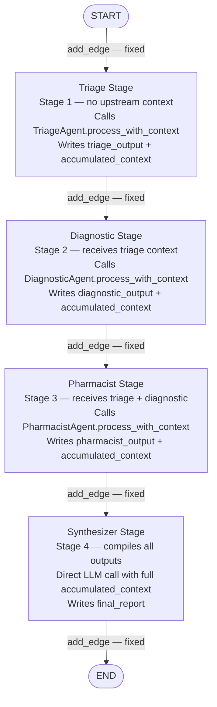
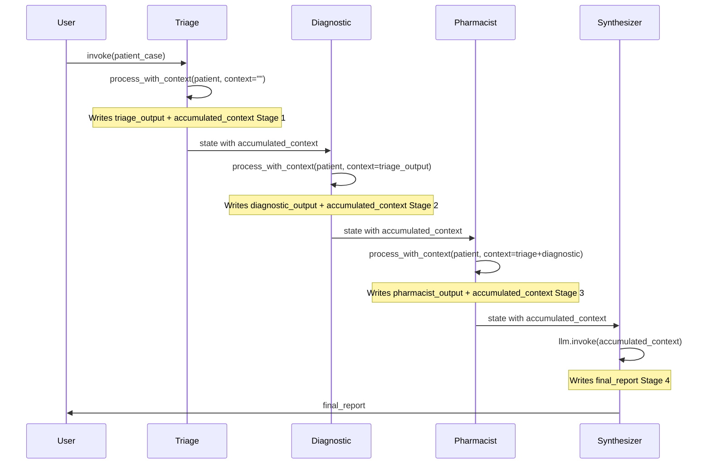

# Chapter 2 — Pattern 2: Sequential Pipeline

> **Prerequisite:** Read [Chapter 1 — Supervisor Orchestration](./01_supervisor_orchestration.md) first. This chapter introduces the simplest MAS topology and contrasts it directly with the supervisor's dynamic routing.

---

## 1. What Is This Pattern?

Think of an automobile assembly line. At Station 1, the chassis is welded. At Station 2, the engine is installed. At Station 3, the interior is fitted. At Station 4, quality control inspects the finished car. Every car goes through every station in exactly the same order. No car is rerouted based on what the welder found. The order was decided by the factory engineers long before any car rolled in.

**Sequential Pipeline in LangGraph is that assembly line.** Three clinical agents execute in a fixed, predetermined order — triage, then diagnostic, then pharmacist — each receiving the accumulated output of all previous stages as context. A final synthesiser node compiles all findings into a structured report. There is no supervisor LLM, no routing logic, no conditional edges. The graph is a straight line: `START → triage → diagnostic → pharmacist → synthesizer → END`.

This is the simplest multi-agent system topology and the most transparent. Every run follows the exact same path, making it trivial to reproduce, debug, and test.

---

## 2. When Should You Use It?

**Use this pattern when:**
- Every case follows the same natural processing order (triage urgency must be assessed before a differential diagnosis is useful; drug review requires the diagnosis).
- Maximum reproducibility and debuggability are required — the execution trace is always the same.
- The workflow is mature and stable — the agent order was validated through domain expertise and does not need runtime adaptation.
- Latency is not a concern (sequential by design).
- You want the lowest LLM cost per run (no routing decisions, no supervisor overhead).

**Do NOT use this pattern when:**
- The agent order should vary by case — use [Pattern 1 (Supervisor)](./01_supervisor_orchestration.md).
- Agents can work independently without needing prior results — use [Pattern 3 (Parallel Voting)](./03_parallel_voting.md) or [Pattern 6 (Map-Reduce)](./06_map_reduce_fanout.md) for better latency.
- Some agents are optional (not always needed for every case) — the pipeline runs all stages regardless.

---

## 3. How It Works — Architecture Walkthrough

### ASCII Graph (from `sequential_pipeline.py`)

```
[START]
   |
   v
[triage]          <-- stage 1: urgency classification
   |
   v
[diagnostic]      <-- stage 2: receives triage context
   |
   v
[pharmacist]      <-- stage 3: receives triage + diagnostic context
   |
   v
[synthesizer]     <-- stage 4: compiles all into final report
   |
   v
[END]

Context accumulates at each stage ------>
```

### Step-by-Step Explanation

**`START → triage`**: Entry point. The triage stage receives only the raw `patient_case` — there is no upstream context yet.

**`triage → diagnostic`**: Fixed unconditional edge. After triage completes, diagnostic always runs. It receives the `accumulated_context` which at this point contains only the triage output: `"[TRIAGE]:\n{result}"`.

**`diagnostic → pharmacist`**: Fixed unconditional edge. Pharmacist receives accumulated context containing both triage and diagnostic findings: `"[TRIAGE]:\n...\n\n[DIAGNOSTIC]:\n..."`.

**`pharmacist → synthesizer`**: Fixed unconditional edge. Synthesiser receives all three stages' context.

**`synthesizer → END`**: The final LLM call produces the structured `final_report`. Graph ends.

**Key insight: context is additive.** Each stage reads the full `accumulated_context` from state and appends its own output to create a richer `accumulated_context` for the next stage. This is the mechanism by which earlier stages inform later ones.

### Mermaid Flowchart



### Sequence Diagram



---

## 4. State Schema Deep Dive

```python
class PipelineState(TypedDict):
    messages: Annotated[list, add_messages]  # LLM message accumulation (unused in most nodes)
    patient_case: dict                        # Set at invocation — read by all stages
    stage_number: int        # Written by each stage (1, 2, 3, 4) — debugging aid
    triage_output: str       # Written by: triage_stage; Read by: (indirectly via accumulated_context)
    diagnostic_output: str   # Written by: diagnostic_stage; Read by: (indirectly)
    pharmacist_output: str   # Written by: pharmacist_stage; Read by: (indirectly)
    accumulated_context: str # Written by: every stage (grows); Read by: every downstream stage
    final_report: str        # Written by: synthesizer_stage
```

**The key field: `accumulated_context: str`**

This is the pipeline's "conveyor belt". It grows at each stage:

| After stage | `accumulated_context` content |
|------------|-------------------------------|
| Initial | `""` (empty) |
| After triage | `"[TRIAGE]:\n{triage_result}"` |
| After diagnostic | `"[TRIAGE]:\n...\n\n[DIAGNOSTIC]:\n{diag_result}"` |
| After pharmacist | `"[TRIAGE]:\n...\n\n[DIAGNOSTIC]:\n...\n\n[PHARMACIST]:\n{pharma_result}"` |

Each stage overwrites `accumulated_context` with its extended version. The previous stage's value is read from state at the start of the current stage, the current stage's output is appended, and the new combined string is returned as a state update.

**Why individual output fields (`triage_output`, `diagnostic_output`, `pharmacist_output`) in addition to `accumulated_context`?**

Two reasons:
1. **Direct access for monitoring/testing**: the caller can inspect `state["triage_output"]` without parsing the accumulated string.
2. **Debugging**: if the accumulated context is malformed, individual fields let you pinpoint which stage produced unexpected output.

**Field: `stage_number: int`**
Written by each stage (1, 2, 3, 4). In production, useful for monitoring dashboards to confirm all stages ran and their execution order.

> **NOTE:** The pipeline has no `completed_agents` or `iteration` fields — those are artifacts of the supervisor pattern. The pipeline's state is simpler because there is no routing state to track.

---

## 5. Node-by-Node Code Walkthrough

### `triage_stage` (Stage 1)

```python
def triage_stage(state: PipelineState) -> dict:
    """Stage 1: Triage -- no upstream context, works from raw patient data."""
    patient = state["patient_case"]              # Read the raw patient data
    result = triage_agent.process_with_context(patient)  # No context arg — first in pipeline

    accumulated = f"[TRIAGE]:\n{result}"         # Start accumulating context
    print(f"    | Stage 1 [Triage]: {result[:120]}...")

    return {
        "triage_output": result,                 # Direct field for monitoring
        "accumulated_context": accumulated,      # Start of the conveyor belt
        "stage_number": 1,
    }
```

**Key design:** `process_with_context(patient)` is called without a context argument. The triage agent has no upstream information — it is the "raw assessment" stage. This is the only stage that does not read `accumulated_context`.

**What breaks if you remove this node:** The `accumulated_context` is never initialised. `diagnostic_stage` reads `state.get("accumulated_context", "")` which returns `""`. The diagnostic agent runs without triage context — still valid, but less informed.

---

### `diagnostic_stage` (Stage 2)

```python
def diagnostic_stage(state: PipelineState) -> dict:
    """Stage 2: Diagnostic -- receives triage output as upstream context."""
    patient = state["patient_case"]
    upstream_context = state.get("accumulated_context", "")  # Read triage output

    result = diagnostic_agent.process_with_context(patient, context=upstream_context)  # Informed by triage

    accumulated = f"{upstream_context}\n\n[DIAGNOSTIC]:\n{result}"  # Extend the context
    print(f"    | Stage 2 [Diagnostic]: {result[:120]}...")

    return {
        "diagnostic_output": result,
        "accumulated_context": accumulated,      # Overwrites with extended version
        "stage_number": 2,
    }
```

**Context chain:** `upstream_context` already contains `"[TRIAGE]:\n..."`. The diagnostic agent sees the triage finding in its context window and can build on it — e.g., "given the high-urgency triage finding, the differential should prioritise NSTEMI over GERD".

> **TIP:** In production, `process_with_context` can include a structured prefix like `"Previous triage assessment found: urgent (NSTEMI likely). Build your differential diagnosis on this."` This makes the context injection more targeted than a raw text dump.

---

### `pharmacist_stage` (Stage 3)

```python
def pharmacist_stage(state: PipelineState) -> dict:
    """Stage 3: Pharmacist -- receives triage + diagnostic as upstream context."""
    patient = state["patient_case"]
    upstream_context = state.get("accumulated_context", "")  # Contains triage + diagnostic

    result = pharmacist_agent.process_with_context(patient, context=upstream_context)

    accumulated = f"{upstream_context}\n\n[PHARMACIST]:\n{result}"
    return {
        "pharmacist_output": result,
        "accumulated_context": accumulated,
        "stage_number": 3,
    }
```

The pharmacist benefits most from full upstream context — knowing the urgency level (triage) and the likely diagnosis (diagnostic) allows a more targeted medication review. For example: "Given probable NSTEMI, check Metformin dose relative to contrast dye for potential catheterisation."

---

### `synthesizer_stage` (Stage 4)

```python
def synthesizer_stage(state: PipelineState) -> dict:
    """Stage 4: Synthesizer -- compiles all upstream findings into a report."""
    llm = get_llm()
    accumulated = state.get("accumulated_context", "")

    prompt = f"""Compile these staged clinical findings into a structured report:

{accumulated}

Format as: 1) Triage Summary  2) Differential Diagnosis  3) Medication Review  4) Final Recommendations
Keep under 200 words."""

    config = build_callback_config(trace_name="pipeline_synthesizer")
    response = llm.invoke(prompt, config=config)

    return {"final_report": response.content, "stage_number": 4}
```

**Key difference from agent nodes:** The synthesiser is not a `BaseAgent` subclass. It is a pipeline-specific aggregation step — its only job is to reformat and structure what the three specialist agents have already produced. It does not have a fixed role-persona; it is a structural synthesis LLM call.

---

## 6. Routing / Coordination Logic Explained

There is **no routing logic** in the sequential pipeline. All edges are fixed `add_edge` calls:

```python
workflow.add_edge(START, "triage")
workflow.add_edge("triage", "diagnostic")
workflow.add_edge("diagnostic", "pharmacist")
workflow.add_edge("pharmacist", "synthesizer")
workflow.add_edge("synthesizer", END)
```

This is the key architectural contrast with the supervisor pattern:

| Supervisor | Pipeline |
|-----------|---------|
| `add_conditional_edges(supervisor, route_fn, {...})` | `add_edge(node_a, node_b)` for every connection |
| Route is computed at runtime from LLM output | Route is hard-wired at build time |
| 4 routing decisions per 3-agent run | 0 routing decisions per run |
| LLM can change order based on results | Order is always the same |

**The pipeline's graph is fully topologically sorted at compile time.** LangGraph can statically determine the execution order without any runtime computation.

---

## 7. Worked Example — Context Growth Trace

**Patient:** PT-ARCH-002, 68M, chest pain, troponin 0.15, BNP 380, BP 158/95, HR 102, SpO2 94%.

**State evolution across stages:**

**After `triage_stage`:**
```python
{
    "triage_output": "URGENT — Troponin 0.15 ng/mL elevated. Likely NSTEMI. Immediate cardiology consult needed. BP 158/95, HR 102, SpO2 94%.",
    "accumulated_context": "[TRIAGE]:\nURGENT — Troponin 0.15 ng/mL elevated...",
    "stage_number": 1,
}
```

**After `diagnostic_stage`:**
```python
{
    "diagnostic_output": "Differential: (1) NSTEMI — most likely given troponin rise + symptoms. (2) Unstable angina. (3) Aortic dissection — less likely. Recommend ECG, echo, urgent cath lab.",
    "accumulated_context": "[TRIAGE]:\nURGENT — Troponin 0.15...\n\n[DIAGNOSTIC]:\nDifferential: (1) NSTEMI...",
    "stage_number": 2,
}
```
Length of `accumulated_context` at this point: ~400 chars.

**After `pharmacist_stage`:**
```python
{
    "pharmacist_output": "Given likely NSTEMI and BNP 380: HOLD Metformin pre-cath. ADD aspirin 325mg (already on 81mg — confirm dose). Check Penicillin allergy scope for cath lab prep. Current Lisinopril OK.",
    "accumulated_context": "[TRIAGE]:\n...\n\n[DIAGNOSTIC]:\n...\n\n[PHARMACIST]:\nGiven likely NSTEMI...",
    "stage_number": 3,
}
```
Length: ~700 chars across 3 stages.

**After `synthesizer_stage`:**
```python
{
    "final_report": "1) TRIAGE SUMMARY: Urgent — NSTEMI likely...\n2) DIFFERENTIAL DIAGNOSIS: NSTEMI most probable...\n3) MEDICATION REVIEW: Hold Metformin...\n4) RECOMMENDATIONS: Immediate cath lab activation...",
    "stage_number": 4,
}
```

---

## 8. Key Concepts Introduced

- **Fixed-topology graph** — All edges are `add_edge` only. The execution order is determined at build time, not runtime. No routing functions, no conditional edges. First demonstrated in `build_pipeline_graph()`.

- **Context accumulation pattern** — Each stage reads `state["accumulated_context"]`, appends its output, and writes the extended string back to state. The context grows linearly with each stage. First demonstrated in `triage_stage`, `diagnostic_stage`, and `pharmacist_stage`.

- **Stage-specific output fields** — In addition to `accumulated_context`, each stage writes its own named field (`triage_output`, `diagnostic_output`, `pharmacist_output`). This provides direct access for monitoring and testing without parsing the accumulated string. First demonstrated in the `PipelineState` schema.

- **Pipeline synthesiser** — A non-agent LLM node whose sole purpose is structural aggregation. It does not have a domain expertise role; it reformats and structures what the specialist agents produced. First demonstrated in `synthesizer_stage`.

- **MAS theory: data-flow pipeline** — In MAS literature, the sequential pipeline corresponds to the "pipeline" or "chain" architecture pattern. It maximises transparency and reproducibility at the cost of adaptability. It is the right choice when the workflow is stable and well-understood.

- **Assembly line analogy** — Each station (node) adds value and passes the enriched product forward. Unlike a supervisor system where work can be re-routed, the pipeline is unidirectional and deterministic.

---

## 9. Common Mistakes and How to Avoid Them

### Mistake 1: LangGraph state immutability — using string concatenation in-place

**What goes wrong:** Inside `diagnostic_stage`, you try `state["accumulated_context"] += f"\n\n[DIAGNOSTIC]:\n{result}"`. In a simple run this appears to work. With checkpointing, the mutation is lost on resume.

**Fix:** Always construct a new string and return it: `accumulated = f"{upstream_context}\n\n[DIAGNOSTIC]:\n{result}"` and `return {"accumulated_context": accumulated}`.

---

### Mistake 2: Missing the `state.get("accumulated_context", "")` default

**What goes wrong:** In `diagnostic_stage`, you write `upstream_context = state["accumulated_context"]`. On the very first invocation where `accumulated_context` is not yet set (initial state has `"accumulated_context": ""`), this returns `""` (fine). But if a developer forgets to include `accumulated_context` in the initial state dict, a `KeyError` is raised.

**Fix:** Always use `state.get("accumulated_context", "")` to safely handle missing or empty initial values.

---

### Mistake 3: Putting synthesis logic inside a specialist agent node

**What goes wrong:** You combine the pharmacist and synthesiser roles into one node: `pharmacist_stage` both reviews medications AND generates the final report. Now you cannot easily reuse the pharmacist agent in another pipeline that does not need a synthesiser.

**Fix:** Keep specialist nodes (triage, diagnostic, pharmacist) focused on their domain. Use a separate synthesiser node for structural aggregation. This follows the single-responsibility principle and keeps nodes reusable across architectures.

---

### Mistake 4: Assuming the pipeline can skip stages

**What goes wrong:** You want some patients to skip the pharmacist stage (no current medications). You add a flag to state and check it in `pharmacist_stage`, returning an empty result. This works functionally but the node always executes (the LLM is still called, just with a no-op prompt).

**Fix:** If conditional stage execution is needed, switch to the supervisor pattern (which can choose not to route to the pharmacist) or add a guardrail node before the pharmacist that short-circuits based on a state flag.

---

## 10. How This Pattern Connects to the Others

### What the Pipeline Does NOT Handle

- **Dynamic order** — The pipeline always runs triage → diagnostic → pharmacist, regardless of the patient. If a patient's case suggests pharmacist should go first, the pipeline cannot adapt. Use the Supervisor.
- **Parallelism** — All three stages run sequentially. Total latency = sum of all agent latencies. Use Voting or Map-Reduce for parallel execution.
- **Quality iteration** — The pipeline runs each stage exactly once. If the synthesiser's output is poor, there is no retry mechanism. Use Reflection (Pattern 7).

### Comparison with Pattern 1 (Supervisor)

The pipeline and supervisor use the same three agents (`TriageAgent`, `DiagnosticAgent`, `PharmacistAgent`). The difference is purely in coordination:

- **Pipeline**: 4 LLM calls (3 agents + 1 synthesiser). Fixed. No routing overhead.
- **Supervisor**: 7+ LLM calls (4 supervisor decisions + 3 agents + 1 report). Adaptive. Routing overhead.

For a stable clinical workflow where the order is always the same, the pipeline is 40%+ cheaper per run.

---

## 11. Quick-Reference Summary

| Aspect | Detail |
|--------|--------|
| **Pattern name** | Sequential Pipeline |
| **Script file** | `scripts/MAS_architectures/sequential_pipeline.py` |
| **Graph nodes** | `triage`, `diagnostic`, `pharmacist`, `synthesizer` |
| **Routing type** | `add_edge` only — no conditional edges |
| **State fields** | `messages`, `patient_case`, `stage_number`, `triage_output`, `diagnostic_output`, `pharmacist_output`, `accumulated_context`, `final_report` |
| **Key state mechanic** | `accumulated_context` grows at each stage; each node reads full upstream context |
| **Root modules** | `agents/` → `TriageAgent`, `DiagnosticAgent`, `PharmacistAgent`; `core/config` → `get_llm()`; `observability/` |
| **LLM calls per run** | 3 agent LLM calls + 1 synthesiser = 4 total (vs 7+ for supervisor) |
| **Parallelism** | None |
| **New MAS concepts** | Fixed-topology pipeline, context accumulation, assembly-line pattern, synthesiser node |
| **Next pattern** | [Chapter 3 — Parallel Voting](./03_parallel_voting.md) |

---

*Continue to [Chapter 3 — Parallel Voting](./03_parallel_voting.md).*
