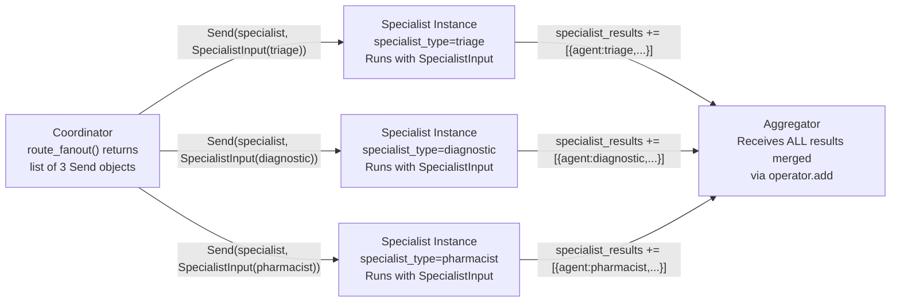
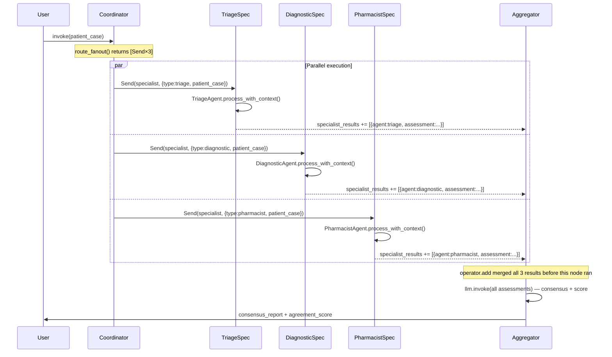

# Chapter 3 — Pattern 3: Parallel Voting

> **Prerequisite:** Read [Chapter 2 — Sequential Pipeline](./02_sequential_pipeline.md) first. This chapter introduces the `Send` API for parallel fan-out and the `operator.add` reducer — both new to this pattern.

---

## 1. What Is This Pattern?

Imagine a hospital's tumour board. A radiologist, an oncologist, and a surgeon independently review the same patient's scans and clinical data. They do so separately, without seeing each other's notes — this is intentional. If the radiologist shared their interpretation first, the surgeon might unconsciously anchor to that view (anchoring bias). Instead, each specialist forms an independent opinion, then the board convenes. A chairperson reviews all three independent assessments, identifies where the specialists agree (consensus) and where they differ (uncertainty), and produces a final recommendation. If all three agree, the recommendation is high-confidence. If they disagree significantly, the case is flagged for extended review.

**Parallel Voting in LangGraph is that tumour board.** Three specialist agents (`TriageAgent`, `DiagnosticAgent`, `PharmacistAgent`) receive the same patient data simultaneously, without seeing each other's work. They run in true parallel (LangGraph executes them concurrently via the `Send` API). An aggregator LLM then receives all three independent assessments and computes a consensus, an agreement score, and a final recommendation. Disagreements are explicitly flagged.

---

## 2. When Should You Use It?

**Use this pattern when:**
- Decision quality matters more than speed or cost — the 3× agent cost is justified by higher confidence and bias mitigation.
- You want to detect uncertainty: when agents disagree, that disagreement is itself a signal (flag for human review, request additional tests).
- Independent perspectives can reduce individual agent bias — diverse roles (clinical triage vs pharmacist vs diagnostician) catch different aspects of the same problem.
- You want robustness: if one agent produces a poor response, the other two can carry the consensus.

**Do NOT use this pattern when:**
- Agents genuinely need each other's output to do their job (e.g., pharmacist needs the diagnosis before reviewing medications) — use [Pattern 2 (Pipeline)](./02_sequential_pipeline.md).
- Speed is paramount and you can accept a single-agent response — voting triples LLM call cost and adds aggregator overhead.
- All agents would give the same answer (e.g., they have identical prompts and knowledge) — diversity requires genuinely different agent roles or models.

---

## 3. How It Works — Architecture Walkthrough

### ASCII Graph (from `parallel_voting.py`)

```
[START]
   |
   v
[coordinator]    <-- fans out to 3 specialists via Send API
   |
   +---> [specialist] (triage instance)      --+
   +---> [specialist] (diagnostic instance)  --+--> [aggregator]
   +---> [specialist] (pharmacist instance)  --+        |
                                                        v
                                                      [END]
```

### Step-by-Step Explanation

**`START → coordinator`**: The coordinator node runs first, but it performs no computation. It logs the fan-out plan and returns an empty dict. Its purpose is to serve as the anchor for the `add_conditional_edges` call that returns the `Send` list.

**`coordinator → [specialist×3]` via `route_fanout`**: `route_fanout` is a conditional edge router that returns a `list[Send]` — three `Send` objects, one per specialist type. LangGraph interprets a `list[Send]` return as a request to run the target node (here `"specialist"`) in parallel with different payloads.

**`specialist×3 → aggregator`**: After all three parallel `specialist` instances complete, their results are merged into `state["specialist_results"]` by the `operator.add` reducer. Then `aggregator_node` runs exactly once with the merged results.

**`aggregator → END`**: The aggregator produces the consensus report and the graph ends.

### The `Send` API — How Parallel Execution Works



### Sequence Diagram



---

## 4. State Schema Deep Dive

```python
class SpecialistInput(TypedDict):
    """Input passed to each parallel specialist instance via Send."""
    specialist_type: str  # "triage" | "diagnostic" | "pharmacist"
    patient_case: dict    # Same patient data for all instances


class VotingState(TypedDict):
    """Main state for the voting graph."""
    patient_case: dict
    specialist_results: Annotated[list[dict], operator.add]  # Merged from parallel workers
    consensus_report: str
    agreement_score: float
```

**Two state classes — why?**

`SpecialistInput` is the **sub-state** passed to each parallel `specialist_node` instance via `Send`. It contains only the data each specialist needs: which agent type it is and the patient data. It does not contain the full `VotingState` because each parallel instance does not need (or should see) the others' results.

`VotingState` is the **main graph state** — the shared state that the coordinator, aggregator, and the outer `graph.invoke()` use.

**Field: `specialist_results: Annotated[list[dict], operator.add]`**

This is the parallel merge field. The annotation `Annotated[list[dict], operator.add]` tells LangGraph: "when multiple nodes write to this field, use `operator.add` (list concatenation) to merge their contributions."

When three `specialist_node` instances each return `{"specialist_results": [{"agent": "triage", "assessment": "..."}]}`, LangGraph applies `operator.add` three times:
```
[] + [{triage}] + [{diagnostic}] + [{pharmacist}] = [{triage}, {diagnostic}, {pharmacist}]
```

By the time `aggregator_node` runs, `state["specialist_results"]` contains all three assessments in a single list.

> **WARNING:** Without the `operator.add` annotation, LangGraph would use the default "last write wins" semantics. The final `specialist_results` would contain only the last specialist to write (whichever parallel instance completed last). The other two results would be silently overwritten. Always annotate parallel-write fields with a reducer.

---

## 5. Node-by-Node Code Walkthrough

### `coordinator_node`

```python
def coordinator_node(state: VotingState) -> dict:
    """Coordinator prepares for fan-out. Returns empty dict — routing happens in route_fanout."""
    print(f"    | [Coordinator] Fan-out: {len(AGENT_MAP)} specialists dispatched in parallel")
    return {}  # No state changes — the Send list is returned by route_fanout
```

**Why does the coordinator return `{}`?** The actual fan-out is returned by `route_fanout`, which is the conditional edge function from `coordinator` — not the node itself. LangGraph uses the return value of `add_conditional_edges` routing functions for routing, not the node's return dict. The coordinator node just logs the intent.

---

### `route_fanout` (conditional edge router)

```python
def route_fanout(state: VotingState) -> list[Send]:
    """Return a list of Send objects — one per specialist."""
    patient = state["patient_case"]
    sends = []
    for specialist_type in AGENT_MAP.keys():      # ["triage", "diagnostic", "pharmacist"]
        sends.append(
            Send(
                "specialist",                      # Target node name
                SpecialistInput(                   # Sub-state payload for this instance
                    specialist_type=specialist_type,
                    patient_case=patient,          # Same patient data for all
                ),
            )
        )
    return sends  # LangGraph creates 3 parallel instances of "specialist" node
```

**`Send(node_name, sub_state)` explained:** `Send` is imported from `langgraph.types`. It is the mechanism for spawning parallel node instances. Each `Send` creates one independent execution of `specialist_node` with the given `SpecialistInput`. The three executions run concurrently. Their results are merged back into `VotingState` by the `operator.add` reducer before `aggregator_node` runs.

**Critical:** `add_conditional_edges("coordinator", route_fanout, ["specialist"])` — the third argument `["specialist"]` tells LangGraph which node names to expect in the `Send` list. This is required for `Send`-based routing.

---

### `specialist_node`

```python
def specialist_node(state: SpecialistInput) -> dict:
    """A specialist agent running in one parallel instance. State type is SpecialistInput."""
    specialist_type = state["specialist_type"]    # Which agent to use
    patient = state["patient_case"]

    agent = AGENT_MAP[specialist_type]            # Look up the pre-built agent instance
    result = agent.process_with_context(patient)  # Independent assessment — no context sharing

    return {
        "specialist_results": [               # Wrapped in a list for operator.add
            {
                "agent": specialist_type,
                "assessment": result,
            }
        ],
    }
```

**Agent isolation:** Each specialist calls `process_with_context(patient)` without passing `context`. This is deliberate — the agents must be isolated from each other's views. If triage passed its output to diagnostic as context, diagnostic's assessment would be anchored to triage's interpretation. The whole point of voting is to get truly independent perspectives.

**Return value wrapped in a list:** `"specialist_results": [{"agent": "triage", ...}]` — the result is wrapped in a single-element list. `operator.add` will concatenate these lists. If you returned a plain dict instead of a list, `operator.add` would fail with a type error.

---

### `aggregator_node`

```python
def aggregator_node(state: VotingState) -> dict:
    """Aggregates all specialist results and determines consensus."""
    llm = get_llm()
    results = state.get("specialist_results", [])  # All 3 results, merged by operator.add

    assessments = "\n\n".join(
        f"[{r['agent'].upper()} ASSESSMENT]:\n{r['assessment']}"
        for r in results
    )

    prompt = f"""You are a clinical consensus judge. Three independent specialists have assessed the same patient case WITHOUT seeing each other's work.

{assessments}

Determine:
1. CONSENSUS: What do all specialists agree on?
2. DISAGREEMENTS: Where do they differ? (flag for human review)
3. AGREEMENT SCORE: Rate agreement from 0.0 to 1.0
4. FINAL RECOMMENDATION: Based on the consensus"""

    response = llm.invoke(prompt, ...)

    # Parse agreement score from LLM output
    agreement_score = 0.7  # default
    for line in response.content.split("\n"):
        if line.strip().lower().startswith("agreement"):
            try:
                score_text = line.split(":")[-1].strip().rstrip(".")
                agreement_score = float(score_text)
            except (ValueError, IndexError):
                pass

    return {"consensus_report": response.content, "agreement_score": agreement_score}
```

**The judge approach:** Rather than a mechanical majority vote (which would require structured, comparable outputs from each agent), the aggregator uses an LLM as a judge. The judge reads all three assessments in natural language and produces a consensus summary. This is more flexible than structured voting but less deterministic.

**Agreement score parsing:** The aggregator instructs the LLM to include `"Agreement: 0.X"` on its own line. The node then parses this from the response text. This is a pragmatic but fragile approach — the LLM must follow the format instruction. A production system would use structured output (Pydantic + `with_structured_output`) to guarantee the score is always present and parseable.

> **TIP:** For production voting systems, replace the free-form judge LLM with a structured aggregator: `class VoteResult(BaseModel): consensus: str; disagreements: list[str]; agreement_score: float; recommendation: str`. Then call `llm.with_structured_output(VoteResult).invoke(prompt)`. This eliminates the fragile text-parsing logic.

---

## 6. Routing / Coordination Logic Explained

### The `Send` API — Deep Dive

LangGraph's `Send` enables **true intra-graph parallelism**. Contrast with the pipeline's sequential execution:

| Pipeline | Parallel Voting |
|---------|-----------------|
| `add_edge("triage", "diagnostic")` — wait for triage before starting diagnostic | `Send("specialist", payload)` × 3 — all three start simultaneously |
| Total latency = sum(agent_latencies) | Total latency = max(agent_latencies) |
| Agents share state (downstream sees upstream output) | Agents are isolated (each gets only their SpecialistInput) |
| 3 sequential LLM calls | 3 concurrent LLM calls |

For the typical case where all three agents take similar time, voting cuts map-phase latency by ~3×.

### `AGENT_MAP` — The Fan-Out Registry

```python
AGENT_MAP = {
    "triage": TriageAgent(),
    "diagnostic": DiagnosticAgent(),
    "pharmacist": PharmacistAgent(),
}
```

`AGENT_MAP` serves a different purpose than `AGENT_REGISTRY` in the supervisor pattern. Here it maps `specialist_type` string to the agent instance used inside `specialist_node`. Each parallel instance receives a `specialist_type` string in its `SpecialistInput` and looks up the corresponding agent. Adding a new voter: add to `AGENT_MAP`, `route_fanout` automatically includes it.

---

## 7. Worked Example — Tracing Parallel Execution

**Patient:** PT-ARCH-003, same 68M chest pain case.

**After `coordinator_node`:**
```python
{
    "patient_case": {...},
    "specialist_results": [],  # Empty — parallel workers haven't run yet
    "consensus_report": "",
    "agreement_score": 0.0,
}
```

**`route_fanout` returns:**
```python
[
    Send("specialist", {"specialist_type": "triage", "patient_case": {...}}),
    Send("specialist", {"specialist_type": "diagnostic", "patient_case": {...}}),
    Send("specialist", {"specialist_type": "pharmacist", "patient_case": {...}}),
]
```

**During parallel execution (all three run concurrently):**

| Triage writes | Diagnostic writes | Pharmacist writes |
|--------------|-------------------|-------------------|
| `{"specialist_results": [{"agent": "triage", "assessment": "URGENT..."}]}` | `{"specialist_results": [{"agent": "diagnostic", "assessment": "NSTEMI likely..."}]}` | `{"specialist_results": [{"agent": "pharmacist", "assessment": "Hold Metformin..."}]}` |

**After `operator.add` merges all three:**
```python
{
    "specialist_results": [
        {"agent": "triage", "assessment": "URGENT — Troponin elevated, likely NSTEMI..."},
        {"agent": "diagnostic", "assessment": "Differential: NSTEMI most likely..."},
        {"agent": "pharmacist", "assessment": "Hold Metformin pre-cath, add Aspirin 325mg..."},
    ],
    ...
}
```

**After `aggregator_node`:**
```python
{
    "consensus_report": "CONSENSUS: All specialists agree on high-probability NSTEMI...\nDISAGREEMENTS: None significant...\nFINAL RECOMMENDATION: Immediate cath lab activation...",
    "agreement_score": 0.9,
}
```

**Agreement score 0.9** — all three specialists independently arrived at a consistent conclusion. In a case with genuine uncertainty (e.g., troponin borderline, symptoms atypical), the score might be 0.5 and the disagreements section would flag the case for human review.

---

## 8. Key Concepts Introduced

- **`Send(node_name, sub_state)` API** — LangGraph mechanism for spawning parallel node instances with independent payloads. Returns a `list[Send]` from a conditional edge function to trigger fan-out. First demonstrated in `route_fanout`.

- **`operator.add` reducer** — `Annotated[list[dict], operator.add]` tells LangGraph to concatenate parallel writes to `specialist_results` rather than overwriting. Essential for parallel fan-out patterns. First demonstrated in `VotingState`.

- **Sub-state isolation** — Each parallel worker receives a `SpecialistInput` containing only its relevant data, not the full `VotingState`. This prevents agents from seeing each other's work (anchoring bias prevention). First demonstrated in `SpecialistInput` and `specialist_node`.

- **Two-class state pattern** — `SpecialistInput` (sub-state for parallel workers) + `VotingState` (main graph state). The sub-state is the payload passed via `Send`; the main state is used by coordinator and aggregator. First demonstrated in the state definition section.

- **Agreement score as uncertainty signal** — A float `0.0–1.0` that quantifies inter-agent consistency. Low scores flag uncertain cases for human review. First demonstrated in `aggregator_node`.

- **MAS theory: ensemble/voting pattern** — In MAS and ML literature, combining multiple independent classifiers reduces variance (individual agent errors) at the cost of increased bias (all agents might share the same systematic flaw). The key requirement for effective voting is **agent diversity** — different roles, different training data, or different model families. Homogeneous voters add cost without benefit.

---

## 9. Common Mistakes and How to Avoid Them

### Mistake 1: Missing `operator.add` on `specialist_results`

**What goes wrong:** `specialist_results: list[dict]` without the `Annotated` wrapper. Three parallel specialists each write `{"specialist_results": [...]}`. LangGraph uses "last write wins" — the final result contains only one specialist's output. The aggregator receives a list with one element instead of three.

**Fix:** Always annotate parallel-write list fields: `specialist_results: Annotated[list[dict], operator.add]`.

---

### Mistake 2: Forgetting to wrap the return value in a list

**What goes wrong:** In `specialist_node`, you return `{"specialist_results": {"agent": "triage", "assessment": "..."}}` (a dict, not a list of dicts). `operator.add` tries to concatenate dicts, which raises a `TypeError`.

**Fix:** Always return a list: `{"specialist_results": [{"agent": specialist_type, "assessment": result}]}`.

---

### Mistake 3: Passing full VotingState to `specialist_node` instead of `SpecialistInput`

**What goes wrong:** You change `specialist_node` to accept `VotingState` instead of `SpecialistInput`. The three parallel instances all share the same full state. When one instance writes `specialist_results`, it may overwrite another's result (race condition, depending on LangGraph's internal execution order).

**Fix:** Use a dedicated sub-state (`SpecialistInput`) for parallel workers. The sub-state is isolated per instance. Results are merged back into the main state only via the `operator.add` reducer.

---

### Mistake 4: Agents share context (anchoring bias)

**What goes wrong:** You add `context=state.get("specialist_results", [])` to `specialist_node`'s `process_with_context` call. Now each agent sees all previously completed agents' assessments. The last agent to start will anchor to the earlier ones' conclusions, defeating the purpose of independent voting.

**Fix:** Call `agent.process_with_context(patient)` without any context argument. Isolation is the core mechanism that makes the voting pattern valid.

---

## 10. How This Pattern Connects to the Others

### Voting vs Pipeline

In the pipeline, agents form a chain: triage informs diagnostic, which informs pharmacist. In voting, agents are a panel: each independently answers the same question. Same agents, completely different coordination logic.

### Voting vs Map-Reduce (Pattern 6)

Both use `Send` + `operator.add`. The difference:
- **Voting**: all agents answer the **same question** with the same patient data.
- **Map-Reduce**: each worker answers a **different sub-question** (sub-task) from the same patient data.

In voting, the aggregator looks for consensus. In map-reduce, the reducer combines complementary findings.

### Voting vs Debate (Pattern 4)

- **Voting**: agents are unaware of each other. Independence is strictly maintained. Result: consensus or uncertainty flag.
- **Debate**: agents are explicitly aware of each other's arguments and must rebut them. Result: tested, documented decision with a winning argument.

Use voting for routine high-stakes decisions. Use debate for exceptional cases where you need the decision rationale documented.

---

## 11. Quick-Reference Summary

| Aspect | Detail |
|--------|--------|
| **Pattern name** | Parallel Voting |
| **Script file** | `scripts/MAS_architectures/parallel_voting.py` |
| **Graph nodes** | `coordinator`, `specialist` (×N parallel instances), `aggregator` |
| **Routing type** | `add_conditional_edges("coordinator", route_fanout, ["specialist"])` returning `list[Send]` |
| **State schema** | `VotingState` (main) + `SpecialistInput` (sub-state per parallel worker) |
| **Key state fields** | `patient_case`, `specialist_results` (with `operator.add`), `consensus_report`, `agreement_score` |
| **Root modules** | `agents/` → `TriageAgent`, `DiagnosticAgent`, `PharmacistAgent`; `core/config` → `get_llm()` |
| **LLM calls per run** | 3 parallel specialist calls + 1 aggregator = 4 total (same as pipeline but parallel) |
| **Parallelism** | True parallel — all 3 specialists run concurrently |
| **New MAS concepts** | `Send` API, `operator.add` reducer, sub-state isolation, agreement score, ensemble voting |
| **Next pattern** | [Chapter 4 — Adversarial Debate](./04_adversarial_debate.md) |

---

*Continue to [Chapter 4 — Adversarial Debate](./04_adversarial_debate.md).*
