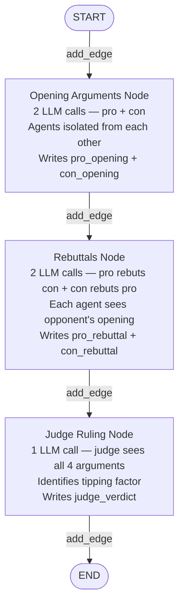
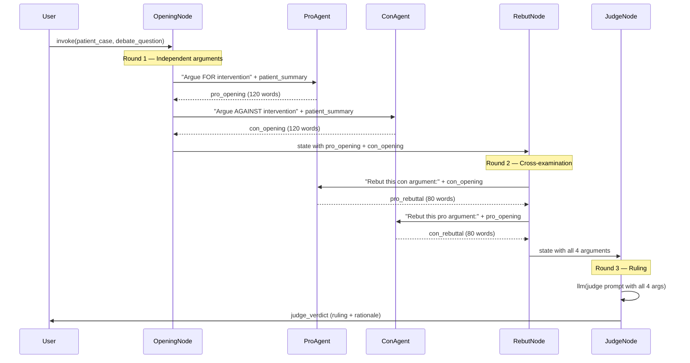

# Chapter 4 — Pattern 4: Adversarial Debate

> **Prerequisite:** Read [Chapter 3 — Parallel Voting](./03_parallel_voting.md) first. This chapter takes the concept of multi-perspective analysis further — instead of independent consensus, agents actively argue opposing sides.

---

## 1. What Is This Pattern?

In complex medical decisions — surgery versus conservative management, aggressive treatment versus watchful waiting — there is rarely a single "correct" answer. The risk is that the first doctor to speak sets the frame, and everyone else anchors to that initial view (anchoring bias). High-stakes medicine has developed a structured counterforce: the **grand rounds** or **tumour board** format. A clinical champion argues strongly for one treatment plan. An assigned devil's advocate argues just as strongly against it. A senior clinician listens to both complete arguments, identifies the tipping factors, and makes a final ruling. The process is more expensive and slower than asking one doctor — but for a case involving surgery on a 76-year-old with kidney disease, the additional rigour is worth the cost.

**Adversarial Debate in LangGraph is that grand rounds.** Two LLM agents — a "pro" specialist (for aggressive intervention) and a "con" specialist (for conservative management) — each present opening arguments, then directly rebut the other's points. A third "judge" LLM reads all four arguments (two openings + two rebuttals) and issues a structured ruling: strongest pro argument, strongest con argument, tipping factor, and final decision. The graph topology is a simple fixed pipeline: `opening_arguments → rebuttals → judge_ruling`. The adversarial nature comes from **prompt design**, not graph complexity.

---

## 2. When Should You Use It?

**Use this pattern when:**
- A treatment decision has legitimate opposing views that should both be documented (e.g., surgery vs. medical management, high-risk procedure in a frail patient).
- Anchoring bias is a documented risk in your domain and you need a structured mechanism to surface the counter-argument before a decision is made.
- You need an audit trail that shows both sides were considered — for regulatory compliance, clinical governance, or liability protection.
- The decision stakes justify the increased cost (more LLM calls) and latency (three sequential rounds).

**Do NOT use this pattern when:**
- The decision is clear-cut (obvious treatment, no legitimate alternative) — the debate adds overhead without benefit.
- You need consensus, not a tested decision — use [Pattern 3 (Voting)](./03_parallel_voting.md) for consensus.
- Time is critical (emergency triage) — the three-round structure adds latency. Use Pipeline (Pattern 2) for time-sensitive workflows.
- The agent responses are not diverse enough — if both "pro" and "con" agents always agree, the debate is a charade. Ensure the system prompts create genuinely different perspectives.

---

## 3. How It Works — Architecture Walkthrough

### ASCII Graph (from `adversarial_debate.py`)

```
[START]
   |
   v
[opening_arguments]    <-- pro + con agents argue independently
   |
   v
[rebuttals]            <-- each agent rebuts the other
   |
   v
[judge_ruling]         <-- judge weighs all arguments
   |
   v
[END]
```

### Step-by-Step Explanation

**`START → opening_arguments`**: Both the pro and con agents run **inside a single node** (`opening_arguments_node`). The node makes two LLM calls — one with the pro system prompt, one with the con system prompt. Neither agent sees the other's argument (same as voting isolation). The results are stored in `pro_opening` and `con_opening` in state.

**`opening_arguments → rebuttals`**: Fixed edge. `rebuttals_node` makes two more LLM calls. Now each agent **can** see the opposing argument: the pro prompt includes `state['con_opening']`, the con prompt includes `state['pro_opening']`. The agents must directly address the other's strongest points.

**`rebuttals → judge_ruling`**: Fixed edge. `judge_ruling_node` makes one LLM call with all four arguments: both openings and both rebuttals. The judge must identify the strongest point on each side, the tipping factor, and issue a clear ruling.

**`judge_ruling → END`**: The graph ends with `state["judge_verdict"]` containing the final decision and rationale.

### The Two-Round Debate Structure

```
Round 1 — Opening Arguments:
  Pro agent (for intervention):  ── argues ──>  pro_opening
  Con agent (against intervention): ── argues ──> con_opening
  [Neither sees the other's opening]

Round 2 — Rebuttals:
  Pro agent sees con_opening:  ── rebuts ──>  pro_rebuttal
  Con agent sees pro_opening:  ── rebuts ──>  con_rebuttal
  [Each must directly address the other's points]

Round 3 — Judge Ruling:
  Judge sees [pro_opening + pro_rebuttal + con_opening + con_rebuttal]
  Issues structured verdict: strongest pro/con, tipping factor, ruling
```

### Mermaid Flowchart



### Sequence Diagram



---

## 4. State Schema Deep Dive

```python
class DebateState(TypedDict):
    messages: Annotated[list, add_messages]   # LLM message accumulation
    patient_case: dict                         # Set at invocation — read by all nodes
    debate_question: str      # The specific clinical decision being debated
    pro_opening: str          # Written by: opening_arguments_node; Read by: rebuttals_node (con agent)
    con_opening: str          # Written by: opening_arguments_node; Read by: rebuttals_node (pro agent)
    pro_rebuttal: str         # Written by: rebuttals_node; Read by: judge_ruling_node
    con_rebuttal: str         # Written by: rebuttals_node; Read by: judge_ruling_node
    judge_verdict: str        # Written by: judge_ruling_node; final output
```

**Field: `debate_question: str`**
The specific clinical question being debated. This is set by the caller (in `main()`) before invocation. It frames both the pro and con agents' arguments and the judge's ruling. A well-formed debate question is specific: "Should this 76-year-old with moderate-severe aortic stenosis, CKD 3b, and a syncopal episode undergo TAVR or be managed conservatively?"

A poorly formed question ("What should we do for this patient?") would result in vague, unfocused arguments.

**Cross-state field flow:**

```
debate_question ──────────────────────────────────>  opening_args → rebuttals → judge
pro_opening      <───── opening_args                             rebuttals → judge
con_opening      <───── opening_args                             rebuttals → judge
pro_rebuttal                            <───── rebuttals                    judge
con_rebuttal                            <───── rebuttals                    judge
judge_verdict                                                 <───── judge
```

Each node reads all fields written by prior nodes. By the time the judge runs, it has access to all six prior fields.

---

## 5. Node-by-Node Code Walkthrough

### `opening_arguments_node`

```python
def opening_arguments_node(state: DebateState) -> dict:
    """Round 1: Both sides present opening arguments independently."""
    llm = get_llm()
    patient = state["patient_case"]
    question = state["debate_question"]

    patient_summary = (
        f"{patient.get('age')}y {patient.get('sex')}, "
        f"{patient.get('chief_complaint')}, "
        f"History: {', '.join(patient.get('medical_history', []))}, "
        f"Labs: {json.dumps(patient.get('lab_results', {}))}"
    )

    # Pro argument (for intervention)
    pro_prompt = f"""You are an interventional specialist ARGUING FOR aggressive treatment.
Debate Question: {question}
Patient: {patient_summary}
Make your strongest case for intervention. 120 words max."""

    pro_response = llm.invoke(pro_prompt, config=build_callback_config(trace_name="debate_pro_opening"))

    # Con argument (against intervention)
    con_prompt = f"""You are a conservative medicine specialist ARGUING AGAINST aggressive treatment.
Debate Question: {question}
Patient: {patient_summary}
Make your strongest case for conservative management. 120 words max."""

    con_response = llm.invoke(con_prompt, config=build_callback_config(trace_name="debate_con_opening"))

    return {
        "pro_opening": pro_response.content,
        "con_opening": con_response.content,
    }
```

**Two LLM calls in one node:** Unlike the parallel voting pattern where each specialist is a separate node instance, the debate runs both pro and con in a single node, sequentially. This is simpler (no `Send` API needed) but means the two calls happen sequentially — the con agent starts after the pro agent finishes. For 120-word arguments, this adds ~1–2 seconds. If you wanted true parallel opening arguments, you could use `Send`, but the sequential design is simpler and the latency overhead is small.

**Isolation at prompt level:** Neither agent is shown the other's argument. The pro prompt contains only the patient summary and question; the con prompt is identical. This mirrors the voting pattern's agent isolation — the diversity must come from the role definition in the system prompt, not from seeing different inputs.

---

### `rebuttals_node`

```python
def rebuttals_node(state: DebateState) -> dict:
    """Round 2: Each side rebuts the other's opening argument."""
    llm = get_llm()

    # Pro rebuts Con — explicitly passes con's argument
    pro_rebuttal_prompt = f"""Your opponent argued AGAINST intervention:
"{state['con_opening']}"
Provide a focused rebuttal addressing their specific points.
Where are they wrong or overlooking evidence? 80 words max."""

    pro_rebuttal = llm.invoke(pro_rebuttal_prompt, ...)

    # Con rebuts Pro — explicitly passes pro's argument
    con_rebuttal_prompt = f"""Your opponent argued FOR intervention:
"{state['pro_opening']}"
Provide a focused rebuttal addressing their specific points.
Where are they overstating benefits? 80 words max."""

    con_rebuttal = llm.invoke(con_rebuttal_prompt, ...)

    return {
        "pro_rebuttal": pro_rebuttal.content,
        "con_rebuttal": con_rebuttal.content,
    }
```

**Cross-examination mechanics:** The pro agent sees `state['con_opening']` embedded directly in its prompt. The con agent sees `state['pro_opening']`. Each agent is now responding to the opponent's actual argument, not a generic counter-position. This is what makes the rebuttal round valuable — it prevents both agents from just repeating their opening in different words.

**Why rebuttals matter:** In the opening, both agents make the strongest case for their position. In the rebuttal, they must engage with the other's evidence. The judge then has both positions AND both counter-positions, making the ruling much better informed than if only openings were provided.

---

### `judge_ruling_node`

```python
def judge_ruling_node(state: DebateState) -> dict:
    """Judge -- weighs all arguments and issues a ruling."""
    llm = get_llm()

    judge_prompt = f"""You are an impartial clinical judge reviewing this medical debate.

DEBATE QUESTION: {state['debate_question']}
PATIENT: {patient.get('age')}y ...

PRO OPENING (for intervention):
{state['pro_opening']}

PRO REBUTTAL:
{state['pro_rebuttal']}

CON OPENING (against intervention):
{state['con_opening']}

CON REBUTTAL:
{state['con_rebuttal']}

Issue your ruling:
1. STRONGEST PRO ARGUMENT: (one sentence)
2. STRONGEST CON ARGUMENT: (one sentence)
3. TIPPING FACTOR: What single factor tips the decision?
4. RULING: [FOR INTERVENTION] or [FOR CONSERVATIVE MANAGEMENT]
5. RATIONALE: (2-3 sentences)
Keep under 150 words."""

    response = llm.invoke(judge_prompt, ...)
    return {"judge_verdict": response.content}
```

**Judge access to full context:** The judge sees all four arguments — both openings and both rebuttals — plus the original patient data. This allows the judge to:
- Identify claims that were refuted (the rebuttal effectively countered the opening)
- Identify claims that survived (the rebuttal failed to counter a specific point)
- Determine the "tipping factor" — the single piece of evidence or argument that tilts the decision

**Structured output format:** The judge is instructed to format the ruling with numbered sections, including a clear binary verdict (`[FOR INTERVENTION]` or `[FOR CONSERVATIVE MANAGEMENT]`). This makes the output programmatically parseable if needed downstream.

---

## 6. Routing / Coordination Logic Explained

The adversarial debate has **no routing logic** — all edges are fixed `add_edge`. The "adversarial" quality comes entirely from the **prompt design**:

```python
workflow.add_edge(START, "opening_arguments")
workflow.add_edge("opening_arguments", "rebuttals")
workflow.add_edge("rebuttals", "judge_ruling")
workflow.add_edge("judge_ruling", END)
```

**Graph topology is linear, just like the pipeline.** The difference is:
- **Pipeline**: Each stage processes and passes forward. No agent argues against another.
- **Debate**: Agents are assigned opposing roles and explicitly told to argue them. Their outputs are structured to enable cross-examination.

This is an important architectural insight: **complex MAS behaviours can emerge from prompt design, not just graph topology.** A simple linear graph can produce sophisticated multi-agent interactions if the prompts create structured inter-agent dynamics.

---

## 7. Worked Example — Debate Trace

**Patient:** PT-ARCH-004, 76M, moderate aortic stenosis, CKD 3b, syncopal episode.

**Debate question:** "Should this 76-year-old with moderate-severe aortic stenosis, CKD 3b, and a syncopal episode undergo TAVR or be managed conservatively?"

**After `opening_arguments_node`:**

```
pro_opening: "TAVR is strongly indicated. AHA/ACC guidelines recommend intervention for
  symptomatic severe AS (valve area <1.0 cm², gradient >40mmHg). Syncope represents
  hemodynamic compromise — median survival without intervention is <2 years. At 76
  with good functional status, TAVR procedural mortality is <3% at high-volume centres.
  CKD 3b does not contraindicate TAVR; contrast can be minimised. The risk of inaction
  exceeds the risk of procedure."

con_opening: "Conservative management is preferred. CKD 3b (eGFR 35) dramatically raises
  procedural risk: contrast nephropathy may precipitate dialysis, and iodine contrast
  allergy requires pre-treatment protocol. BNP 450 suggests concurrent heart failure
  complicating recovery. Life expectancy at 76 with multiple comorbidities must be
  weighed against a 3–6 month post-TAVR recovery. Medical optimisation (diuretics,
  afterload reduction) may stabilise symptoms sufficiently."
```

**After `rebuttals_node`:**

```
pro_rebuttal: "The con argument overstates CKD risk. Published TAVR-in-CKD data show
  acceptable outcomes at eGFR >25. Contrast can be CO2 angiography. More importantly,
  the con argument ignores the natural history: syncope in AS carries 30% 1-year
  mortality without intervention. 'Medical optimisation' for structural valve disease
  has no evidence base for definitive treatment."

con_rebuttal: "The pro argument underestimates multi-comorbidity risk. No published trial
  specifically addresses TAVR in CKD 3b + contrast allergy + BNP 450. Heart Team
  assessment is required before proceeding. A trial of medical management + repeat
  echo in 3 months is a legitimate, lower-risk first step. Rushing to procedure is
  not evidence-based for this specific complex patient."
```

**After `judge_ruling_node`:**

```
judge_verdict:
1. STRONGEST PRO ARGUMENT: Syncope in AS carries 30% 1-year mortality without
   intervention; medical management has no evidence as definitive treatment.
2. STRONGEST CON ARGUMENT: Multi-comorbidity combination (CKD 3b + contrast allergy
   + BNP 450) creates an atypical risk profile not covered by standard trials.
3. TIPPING FACTOR: The documented syncopal episode represents hemodynamic compromise
   — the natural history risk without valve intervention is now the dominant factor.
4. RULING: [FOR INTERVENTION — TAVR with CO2 angiography and Heart Team review]
5. RATIONALE: Natural history risk of untreated symptomatic AS exceeds procedural risk
   when CO2 angiography mitigates contrast concerns. Heart Team multi-disciplinary
   review should confirm and plan allergy protocol.
```

---

## 8. Key Concepts Introduced

- **Adversarial prompt architecture** — Role assignment in LLM system prompts creates opposing viewpoints. "You are arguing FOR" vs "You are arguing AGAINST" are the fundamental mechanism. No special LangGraph primitives are needed. First demonstrated in `opening_arguments_node`.

- **Cross-examination via state injection** — Each rebuttal agent receives the opponent's full opening argument embedded in its prompt (`state['con_opening']` in the pro rebuttal, `state['pro_opening']` in the con rebuttal). The state acts as the cross-examination channel. First demonstrated in `rebuttals_node`.

- **Judge-based arbitration** — A third LLM agent reads all arguments and issues a structured ruling. The judge is impartial (no role bias) and has full visibility into the debate. First demonstrated in `judge_ruling_node`.

- **Tipping factor identification** — The judge is explicitly asked to identify the single factor that tips the decision. This produces actionable, documented rationale rather than a vague summary. First demonstrated in the `judge_prompt`.

- **MAS theory: deliberation pattern** — Adversarial debate corresponds to the "deliberation" or "argumentation" pattern in MAS literature. Agents holding different views present and defend them in a structured forum. The process produces a tested decision (both sides were articulated and challenged) rather than an anchored one (first-mover advantage). Key references: Walton's argumentation theory, Bench-Capon's value-based argumentation frameworks.

- **Bias mitigation through adversarial design** — In addition to individual agent bias reduction (as in voting), the debate pattern specifically targets anchoring bias (round 1 independent arguments), framing bias (the debate question forces both sides to be considered), and groupthink (the con agent is structurally required to disagree).

---

## 9. Common Mistakes and How to Avoid Them

### Mistake 1: Both agents reach the same conclusion

**What goes wrong:** The pro and con agents both recommend the same treatment because the underlying LLM has a strong prior for one side. The debate becomes meaningless — the judge has nothing to resolve.

**Fix:** Strengthen the role assignment with concrete instructions: "You are a conservative specialist who ALWAYS argues for non-interventional management first. You consider interventional risks to be the primary concern." Use specific clinical role framing. Consider using different model temperatures (higher temperature for more varied arguments) or different models entirely for pro and con.

---

### Mistake 2: Rebuttal agents anchor to their own opening (not actually addressing the opponent)

**What goes wrong:** The pro rebuttal mostly repeats the pro opening in different words rather than directly addressing the con argument's specific points.

**Fix:** Make the rebuttal prompt more directive: "Your opponent said: [quote]. Address EACH of their specific claims. Do NOT repeat your opening argument." Quoting the opponent's specific claims forces engagement.

---

### Mistake 3: Using the debate pattern for routine decisions

**What goes wrong:** Every clinical case (even a straightforward urinary tract infection in an otherwise healthy patient) is routed through the debate pattern. The system is slow, expensive, and produces debates where both agents agree anyway.

**Fix:** Use the debate pattern only for cases flagged as genuinely complex or high-risk. A guardrail node before the debate can assess whether a case is "debate-worthy" based on case complexity score, HITL flags, or predefined criteria.

---

### Mistake 4: Judge sees only openings, not rebuttals

**What goes wrong:** You build a simplified version without the rebuttal round: `opening_arguments → judge_ruling → END`. The judge has only two arguments per side (one opening each). Claims that would have been effectively refuted in a rebuttal survive to the judge unchallenged.

**Fix:** Always include the rebuttal round. The judge's prompt should explicitly include all four arguments. The rebuttal round is what elevates the debate above simple "two opinions" — it creates genuine inter-agent engagement.

---

## 10. How This Pattern Connects to the Others

### Debate vs Voting (Pattern 3)

Both patterns produce a final decision based on multiple perspectives. The key differences:

| Aspect | Voting | Debate |
|--------|--------|--------|
| Agent visibility | Completely isolated | Cross-examination (rebuttals see openings) |
| Purpose | Detect consensus/uncertainty | Test both sides of a decision |
| Output | Consensus + agreement score | Structured ruling + rationale |
| Latency | Lower (parallel round 1) | Higher (3 sequential rounds) |
| Best for | Routine high-stakes decisions | Exceptional complex dilemmas |

### Debate vs Supervisor (Pattern 1)

The supervisor pattern routes based on case findings. It could theoretically route complex cases to the debate pattern as a sub-graph:

```
supervisor_node: "this case is highly complex → route to debate sub-graph"
```

This is a composition pattern — the supervisor acts as a triage layer that decides when to invoke the debate process.

---

## 11. Quick-Reference Summary

| Aspect | Detail |
|--------|--------|
| **Pattern name** | Adversarial Debate |
| **Script file** | `scripts/MAS_architectures/adversarial_debate.py` |
| **Graph nodes** | `opening_arguments`, `rebuttals`, `judge_ruling` |
| **Routing type** | `add_edge` only — fixed linear topology |
| **State schema** | `DebateState` with `debate_question`, `pro_opening`, `con_opening`, `pro_rebuttal`, `con_rebuttal`, `judge_verdict` |
| **LLM calls per run** | 2 (openings) + 2 (rebuttals) + 1 (judge) = 5 total |
| **Parallelism** | None (all calls are sequential within each node) |
| **Root modules** | `core/config` → `get_llm()`; `observability/` — no `agents/` (direct LLM calls only) |
| **Unique mechanism** | Cross-examination via state injection; adversarial prompting; judge arbitration |
| **New MAS concepts** | Deliberation pattern, adversarial prompting, tipping factor, anchoring bias mitigation |
| **Next pattern** | [Chapter 5 — Hierarchical Delegation](./05_hierarchical_delegation.md) |

---

*Continue to [Chapter 5 — Hierarchical Delegation](./05_hierarchical_delegation.md).*
