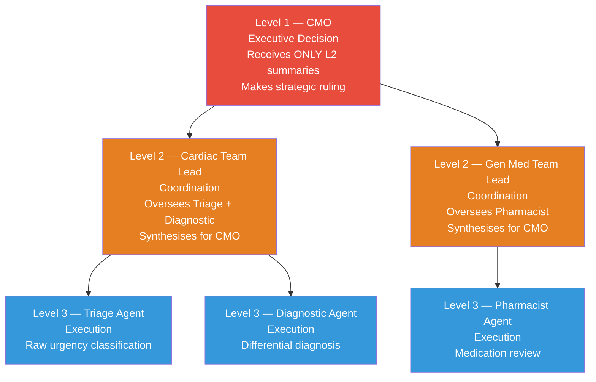
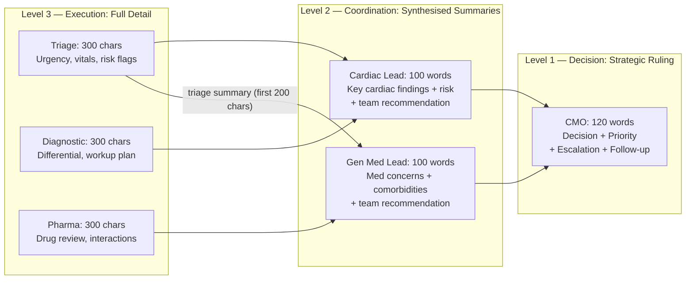
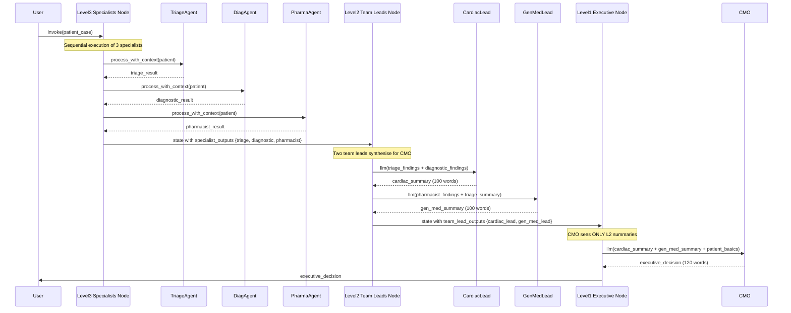

# Chapter 5 — Pattern 5: Hierarchical Delegation

> **Prerequisite:** Read [Chapter 4 — Adversarial Debate](./04_adversarial_debate.md) first. This chapter introduces a new structural concept: multi-level delegation where information is filtered at each layer.

---

## 1. What Is This Pattern?

Consider how a large hospital system handles a complex case. Three clinical specialists — a triage nurse, a diagnostician, and a clinical pharmacist — each perform their detailed assessments. They do not report directly to the hospital's Chief Medical Officer. Instead, they report to their respective team leads: a Cardiac Team Lead synthesises the triage and diagnostic findings into a concise cardiac summary; a General Medicine Team Lead synthesises the pharmacist's findings and comorbidity concerns. The CMO receives only the two team-lead summaries, not the raw specialist outputs. The CMO's decision is informed by expert synthesis at each layer, not by raw clinical data that would overwhelm strategic decision-making.

**Hierarchical Delegation in LangGraph is that hospital org chart.** Three levels run in sequence:

- **Level 3 (Execution):** Three specialist agents (`TriageAgent`, `DiagnosticAgent`, `PharmacistAgent`) produce detailed domain-specific findings.
- **Level 2 (Coordination):** Two team leads (Cardiac Lead, General Medicine Lead) each synthesise a subset of L3 findings into a management summary.
- **Level 1 (Decision):** The Chief Medical Officer receives only L2 summaries and makes the executive-level strategic decision.

The key architectural principle is **information filtering**: each level up the hierarchy receives a less granular, more synthesised view. The CMO never sees raw triage data. The team leads never see each other's synthesised reports. Each level handles the complexity appropriate to its role.

---

## 2. When Should You Use It?

**Use this pattern when:**
- The problem naturally decomposes into management layers — execution (specialists), coordination (team leads), and decision (executive).
- Different levels of the system need different levels of detail: specialists need raw data; decision-makers need synthesised summaries.
- Clear accountability is important — each level is responsible for the quality of its synthesis.
- The system is large enough that a flat structure (supervisor or pipeline) would produce decision-makers drowning in detail.

**Do NOT use this pattern when:**
- The team is small and flat — two or three agents can be coordinated directly (use Supervisor or Pipeline).
- Specialists need peer-to-peer communication (e.g., pharmacist needs to directly ask the diagnostician a follow-up question) — the hierarchy prohibits lateral communication; use Debate or Supervisor for that.
- Speed is critical — three sequential levels add latency; use Parallel Voting or Map-Reduce for faster parallel execution.

---

## 3. How It Works — Architecture Walkthrough

### ASCII Graph (from `hierarchical_delegation.py`)

```
[START]
   |
   v
[level_3_specialists]  <-- triage, diagnostic, pharmacist (L3 execution layer)
   |
   v
[level_2_team_leads]   <-- cardiac lead, general medicine lead (L2 coordination layer)
   |
   v
[level_1_executive]    <-- CMO makes final strategic decision (L1 decision layer)
   |
   v
[END]
```

### The Three-Level Org Chart



### Information Flow: Bottom-Up Filtering



**Key insight:** The CMO's 120-word decision is based on ~200 words of team-lead summaries, which themselves summarise ~900 words of specialist outputs. The hierarchy compresses information by ~5× at each level.

### Sequence Diagram



---

## 4. State Schema Deep Dive

```python
class HierarchyState(TypedDict):
    messages: Annotated[list, add_messages]
    patient_case: dict

    # Level 3 outputs (specialist raw findings — detailed)
    specialist_outputs: dict   # {"triage": "...", "diagnostic": "...", "pharmacist": "..."}

    # Level 2 outputs (team lead summaries — synthesised)
    team_lead_outputs: dict    # {"cardiac_lead": "...", "general_medicine_lead": "..."}

    # Level 1 output (executive decision — strategic)
    executive_decision: str
```

**Three output dicts at three levels of granularity:**

| Field | Written by | Read by | Content |
|-------|-----------|---------|---------|
| `specialist_outputs` | `level_3_specialists_node` | `level_2_team_leads_node` | Raw, detailed findings (full text) |
| `team_lead_outputs` | `level_2_team_leads_node` | `level_1_executive_node` | Synthesised management summaries |
| `executive_decision` | `level_1_executive_node` | Caller | Strategic ruling (no raw data) |

**The deliberate information barrier:** `level_1_executive_node` reads `state.get("team_lead_outputs", {})` — not `specialist_outputs`. The CMO is architecturally prevented from seeing raw specialist data. This is not an accident. In real organisations, executives operating on raw specialist-level data produce worse decisions (information overload, anchoring to specific data points, missing strategic implications). The hierarchy enforces the correct abstraction level at each role.

**Key design:** `specialist_outputs` and `team_lead_outputs` are plain `dict` fields (not lists with `operator.add`). This is because L3 and L2 are sequential — only one node writes to each field (not parallel instances). Compare with `specialist_results: Annotated[list, operator.add]` in the voting pattern, which is parallel.

---

## 5. Node-by-Node Code Walkthrough

### `level_3_specialists_node`

```python
def level_3_specialists_node(state: HierarchyState) -> dict:
    """Level 3: Specialist execution — all three agents run sequentially."""
    patient = state["patient_case"]
    outputs = {}

    triage_result = triage_agent.process_with_context(patient)
    outputs["triage"] = triage_result

    diagnostic_result = diagnostic_agent.process_with_context(patient)
    outputs["diagnostic"] = diagnostic_result

    pharmacist_result = pharmacist_agent.process_with_context(patient)
    outputs["pharmacist"] = pharmacist_result

    return {"specialist_outputs": outputs}
```

**Sequential execution of specialists within one node:** Unlike Pattern 3 (Parallel Voting) which uses `Send` to run agents in parallel, L3 runs all three sequentially within a single LangGraph node. The comment in the script notes: "In production, these could run in parallel." For educational clarity, they are kept sequential here. In a production system, L3 would be split into three parallel nodes using `Send` to reduce latency.

**No context sharing between L3 agents:** Each specialist calls `process_with_context(patient)` without context. The L3 agents are specialists — they do their work independently. Context sharing happens at L2 (team leads synthesise across specialists).

---

### `level_2_team_leads_node`

```python
def level_2_team_leads_node(state: HierarchyState) -> dict:
    """Level 2: Team Lead coordination — two LLM calls synthesise L3 findings."""
    llm = get_llm()
    specialist_outputs = state.get("specialist_outputs", {})
    team_lead_outputs = {}

    # -- Cardiac Lead (oversees triage + diagnostic) --
    cardiac_input = (
        f"Triage Findings:\n{specialist_outputs.get('triage', '')}\n\n"
        f"Diagnostic Findings:\n{specialist_outputs.get('diagnostic', '')}"
    )
    cardiac_prompt = f"""You are the Cardiac Team Lead. Your specialists have reported:
{cardiac_input}
Provide a TEAM-LEVEL SUMMARY for the Chief Medical Officer:
1. Key cardiac findings  2. Risk assessment  3. Your team's recommendation
Keep under 100 words."""

    cardiac_response = llm.invoke(cardiac_prompt, ...)
    team_lead_outputs["cardiac_lead"] = cardiac_response.content

    # -- General Medicine Lead (oversees pharmacist + triage summary) --
    gen_med_input = (
        f"Pharmacist Findings:\n{specialist_outputs.get('pharmacist', '')}\n\n"
        f"Triage Summary:\n{specialist_outputs.get('triage', '')[:200]}"   # Truncated
    )
    gen_med_prompt = f"""You are the General Medicine Team Lead. Your specialists have reported:
{gen_med_input}
Provide a TEAM-LEVEL SUMMARY for the Chief Medical Officer:
1. Medication concerns  2. Comorbidity management  3. Your team's recommendation
Keep under 100 words."""

    gen_med_response = llm.invoke(gen_med_prompt, ...)
    team_lead_outputs["general_medicine_lead"] = gen_med_response.content

    return {"team_lead_outputs": team_lead_outputs}
```

**Information routing across team leads:** The Cardiac Lead sees both triage and diagnostic outputs — these are the cardiac-domain findings. The General Medicine Lead sees the pharmacist output and a truncated triage summary — these are the medication and comorbidity domain findings. Neither team lead sees the other's raw inputs. This mirrors real hospital team-lead structure: the Cardiac Team Lead does not typically need the pharmacist's medication interaction data; the Gen Med Lead does not need the full cardiac workup data.

**Truncation of triage for Gen Med:** `specialist_outputs.get('triage', '')[:200]` — the triage output is truncated to 200 characters when passed to the General Medicine Lead. The Cardiac Lead already gets the full triage output. This prevents the Gen Med Lead from duplicating the cardiac assessment — it should focus on medications and comorbidities, not cardiac urgency (that's the Cardiac Lead's domain).

---

### `level_1_executive_node`

```python
def level_1_executive_node(state: HierarchyState) -> dict:
    """Level 1: Executive decision — CMO receives ONLY team-lead summaries."""
    llm = get_llm()
    patient = state["patient_case"]
    team_lead_outputs = state.get("team_lead_outputs", {})

    team_reports = "\n\n".join(
        f"[{lead.upper()}]:\n{summary}"
        for lead, summary in team_lead_outputs.items()
    )

    executive_prompt = f"""You are the Chief Medical Officer. Your team leads report:
{team_reports}

Patient: {patient.get('age')}y {patient.get('sex')}, {patient.get('chief_complaint')}

Make the EXECUTIVE DECISION:
1. DECISION: What is the clinical plan?
2. PRIORITY: What must happen first?
3. ESCALATION: Does this case need external consultation?
4. FOLLOW-UP: Timeline for reassessment
This is a strategic decision, not a detailed plan. Keep under 120 words."""

    response = llm.invoke(executive_prompt, ...)
    return {"executive_decision": response.content}
```

**The CMO prompt is deliberately abstract:** It asks for a `DECISION`, `PRIORITY`, `ESCALATION`, and `FOLLOW-UP` — strategic framing questions. It does not ask for detailed clinical analysis. This encourages the CMO LLM to synthesise at the appropriate decision-making level rather than re-doing the specialists' work.

**Only patient basics for context:** The CMO gets only `patient.get('age')`, `patient.get('sex')`, and `patient.get('chief_complaint')` — not the full labs, vitals, medications. The team leads already synthesised the clinical details. The CMO uses patient basics just to anchor the executive decision to the correct patient.

---

## 6. Routing / Coordination Logic Explained

Like the sequential pipeline and adversarial debate, hierarchical delegation uses only fixed `add_edge` for routing:

```python
workflow.add_edge(START, "level_3_specialists")
workflow.add_edge("level_3_specialists", "level_2_team_leads")
workflow.add_edge("level_2_team_leads", "level_1_executive")
workflow.add_edge("level_1_executive", END)
```

The hierarchy's complexity is in the **information structure** (what each level sees), not the graph topology. Contrast the four patterns with fixed topology (Pipeline, Debate, Hierarchy) with the three patterns with dynamic routing (Supervisor, Voting, Map-Reduce):

| Pattern | Topology | Where complexity lives |
|---------|----------|----------------------|
| Pipeline | Fixed edges | Context accumulation (sequential enrichment) |
| Debate | Fixed edges | Prompt design (adversarial roles + cross-examination) |
| Hierarchy | Fixed edges | Information filtering (what each level sees) |
| Supervisor | Conditional edges | LLM routing decision |
| Voting | Send fan-out | operator.add merger + LLM aggregator |
| Map-Reduce | Send fan-out | Sub-task definitions + synthesis |
| Reflection | Conditional back-edge | Severity assessment + loop control |

---

## 7. Worked Example — Information Filtering Trace

**Patient:** PT-ARCH-005, 68M, chest pain, troponin 0.15.

**After `level_3_specialists_node`:**
```python
{
    "specialist_outputs": {
        "triage": "URGENT — Troponin 0.15 ng/mL elevated (>0.04 threshold). Vitals: BP 158/95, HR 102 (tachycardia), SpO2 94% (concerning). History: Hypertension, Diabetes, Hyperlipidaemia. Assessment: HIGH RISK acute cardiac event. ACTIVATE CODE STEMI protocol immediately.",
        "diagnostic": "Primary differential: (1) NSTEMI — most likely given troponin rise, diaphoresis, and cardiac risk factors. (2) Unstable angina — possible. (3) Aortic dissection — lower probability (no tearing quality described). Recommended workup: Urgent ECG serial, Troponin trend at 3h, Echocardiogram STAT, Cardiology consult within 30 minutes.",
        "pharmacist": "Current regimen review: Lisinopril 20mg — continue, holds BP management. Metformin 1000mg BID — HOLD immediately prior to any contrast study (nephropathy risk). Atorvastatin 40mg — continue (statin benefit in ACS). ALLERGY NOTE: Penicillin allergy on record — not relevant to current presentation but note for cath lab antibiotics. Aspirin 81mg not on current list — RECOMMEND adding 325mg stat if NSTEMI confirmed.",
    }
}
```

**After `level_2_team_leads_node`:**
```python
{
    "team_lead_outputs": {
        "cardiac_lead": "KEY FINDINGS: High-probability NSTEMI (Troponin 0.15, BP 158/95, HR 102, SpO2 94%). Hemodynamically compromised — tachycardia and hypoxia are critical. RISK: High. RECOMMENDATION: Immediate catheterisation lab activation. Serial ECGs and troponin trending in parallel.",
        "general_medicine_lead": "MED CONCERNS: Hold Metformin for pre-cath. Add Aspirin 325mg stat. Penicillin allergy — use non-penicillin antibiotics for any invasive procedure. COMORBIDITIES: Diabetes and Hypertension well-controlled per Lisinopril/Metformin. RECOMMENDATION: Diabetic protocol for procedural period; monitor renal function post-contrast.",
    }
}
```

**After `level_1_executive_node`:**
```python
{
    "executive_decision": "DECISION: Activate cath lab for urgent coronary angiography — NSTEMI confirmed clinically. PRIORITY: (1) Immediate catheterisation, (2) Hold Metformin now, (3) Aspirin 325mg stat. ESCALATION: Cardiology consult required within 15 minutes; notify interventional team. FOLLOW-UP: Reassess vitals and troponin at 3h; post-cath metabolic panel at 24h."
}
```

**Information compression per level:**
- L3 `specialist_outputs`: ~300 chars × 3 = ~900 chars total
- L2 `team_lead_outputs`: ~120 chars × 2 = ~240 chars total (73% reduction)
- L1 `executive_decision`: ~200 chars total (78% reduction from L2)

The CMO's decision is a 200-character strategic ruling derived from 900 characters of detailed clinical data — filtered through two levels of expert synthesis.

---

## 8. Key Concepts Introduced

- **Information filtering by level** — Each level of the hierarchy deliberately receives a less granular, more synthesised view than the level below. This is an architectural pattern, not an accident. The CMO node reads `team_lead_outputs`, not `specialist_outputs`. First demonstrated in `level_1_executive_node`.

- **Separation of abstraction levels** — L3 handles tactical details (what are the facts?), L2 handles coordination (what does this mean for our domain?), L1 handles strategy (what do we do?). This mirrors the real-world principle of "appropriate information at each management level". First demonstrated in the three-node graph.

- **Domain-partitioned team leads** — L2 is not a single synthesiser but two domain leads: Cardiac (triage + diagnostic) and General Medicine (pharmacist + comorbidities). This domain partitioning at L2 is what makes the hierarchy meaningful — different leads synthesise different subsets of L3 data. First demonstrated in `level_2_team_leads_node`.

- **MAS theory: hierarchical control** — In MAS literature, hierarchical control is contrasted with flat (peer-to-peer) and centralised (single orchestrator) control. Hierarchical systems scale better for large agent counts (each level only manages its direct reports) but add communication latency and risk of information distortion at each synthesis layer. First demonstrated in this script's three-level structure.

- **The accountability chain** — Because each level produces a documented output (`specialist_outputs`, `team_lead_outputs`, `executive_decision`), the decision audit trail is naturally structured by authority level. If the executive decision is wrong, you can trace which team lead summary it was based on and which specialist findings informed that summary.

---

## 9. Common Mistakes and How to Avoid Them

### Mistake 1: CMO sees raw specialist outputs (defeating the purpose)

**What goes wrong:** You add `specialist_outputs` to the executive prompt: `f"Specialist details: {state['specialist_outputs']}\n\nTeam summaries: {team_reports}"`. The CMO now processes 900+ chars of raw data, making the hierarchy pointless. The CMO produces overly detailed outputs that duplicate the specialists' work.

**Fix:** Strictly limit L1 to L2 summaries only. The `level_1_executive_node` should never read `state["specialist_outputs"]`. The information filtering is the hierarchy's core value.

---

### Mistake 2: Single team lead for all specialists (losing domain partitioning)

**What goes wrong:** You implement L2 as a single team lead that synthesises all three specialists' outputs: `all_l3 = f"{triage}\n\n{diagnostic}\n\n{pharmacist}"`. The single team lead produces a 300-word synthesis that the CMO then reduces to 120 words. You have lost the domain expertise partitioning — the cardiac findings and medication findings are conflated in one summary.

**Fix:** Use domain-specific team leads. The Cardiac Lead synthesises cardiac-domain findings (triage urgency + diagnostic differential). The Gen Med Lead synthesises medication and comorbidity findings. Their domain boundaries should mirror how real management structures work.

---

### Mistake 3: L3 specialists sharing state context (pipeline behaviour in hierarchy)

**What goes wrong:** In `level_3_specialists_node`, you pass earlier specialists' outputs as context to later specialists: `diagnostic_result = diagnostic_agent.process_with_context(patient, context=triage_result)`. Now the L3 layer behaves like a mini-pipeline. The diagnostic agent anchors to triage's interpretation.

**Fix:** In pure hierarchical delegation, L3 specialists are independent (no lateral communication at their level). Context sharing is a characteristic of the pipeline pattern. Keep L3 clean and independent; let L2 team leads synthesise across L3 findings.

---

## 10. How This Pattern Connects to the Others

### Hierarchy vs Supervisor

Both have a centralised coordinator that makes decisions based on specialist inputs. The difference:

| Supervisor | Hierarchy |
|-----------|----------|
| Supervisor LLM routes dynamically at runtime | Fixed layers at build time |
| Supervisor sees ALL specialist outputs directly | CMO sees ONLY L2 summaries |
| One level of coordination | Three levels of abstraction |
| Flexible (adapts per case) | Rigid (same structure every run) |
| Best for: adaptive, unknown workflows | Best for: large, structured organisations |

### Hierarchy vs Pipeline

Both use sequential fixed edges. The difference is in state design — in the pipeline, `accumulated_context` grows by appending; in the hierarchy, each level rewrites the state dict (`specialist_outputs` → `team_lead_outputs` → `executive_decision`). The hierarchy compresses information at each step; the pipeline accumulates it.

---

## 11. Quick-Reference Summary

| Aspect | Detail |
|--------|--------|
| **Pattern name** | Hierarchical Delegation |
| **Script file** | `scripts/MAS_architectures/hierarchical_delegation.py` |
| **Graph nodes** | `level_3_specialists`, `level_2_team_leads`, `level_1_executive` |
| **Routing type** | `add_edge` only — fixed 3-step topology |
| **State schema** | `HierarchyState` with `specialist_outputs`, `team_lead_outputs`, `executive_decision` |
| **Information flow** | Bottom-up: detailed → synthesised → strategic |
| **Root modules** | `agents/` (L3 specialists), `core/config` → `get_llm()` (L2+L1 direct LLM calls) |
| **LLM calls per run** | 3 (L3 agents) + 2 (L2 team leads) + 1 (L1 CMO) = 6 total |
| **Parallelism** | None (L3 could be parallelised in production) |
| **New MAS concepts** | Information filtering, abstraction levels, domain-partitioned team leads, hierarchical control |
| **Next pattern** | [Chapter 6 — Map-Reduce Fan-Out](./06_map_reduce_fanout.md) |

---

*Continue to [Chapter 6 — Map-Reduce Fan-Out](./06_map_reduce_fanout.md).*
