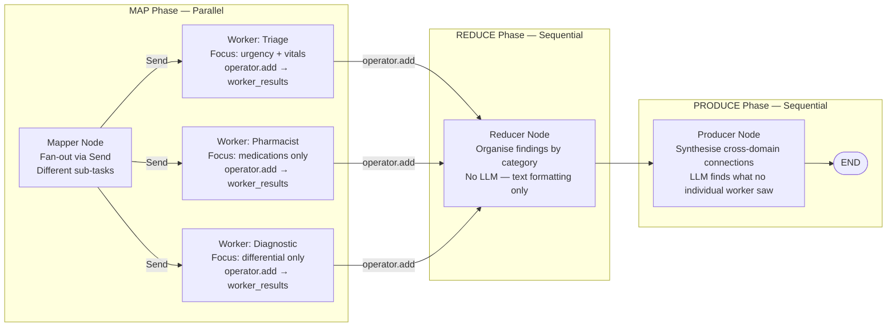
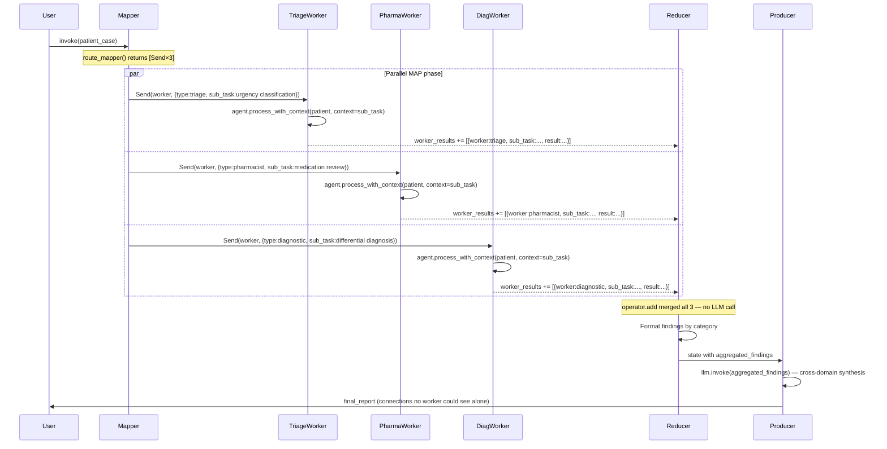

# Chapter 6 — Pattern 6: Map-Reduce Fan-Out

> **Prerequisite:** Read [Chapter 5 — Hierarchical Delegation](./05_hierarchical_delegation.md) first. This chapter revisits the `Send` API from Chapter 3 but applies it to a very different coordination challenge: different sub-tasks in parallel rather than the same question by multiple voters.

---

## 1. What Is This Pattern?

Imagine processing a 500-page clinical dossier. One doctor cannot efficiently process it all in sequence — it would take hours and they might miss connections between sections that are far apart. Instead, a team divides the work: one specialist reads the cardiac history, another reads the medication records, and a third reads the diagnostic reports. They work simultaneously, each focused exclusively on their domain. When all three finish, a synthesiser reads all three domain summaries together and identifies the critical connections that cross domain boundaries — for example, a cardiac medication (from the medication specialist's notes) that affects a lab value flagged by the diagnostician, which the triage specialist identified as a risk factor.

**Map-Reduce Fan-Out in LangGraph is that parallel team reading session.** A mapper node splits a clinical case into three independent sub-tasks. Three worker nodes receive different sub-task descriptions and process the same patient data with different focus areas simultaneously (the "map" phase). A reducer node collects all worker results and organises them by category (the "reduce" phase). A producer node makes a final LLM call to synthesise cross-domain connections — findings that no individual worker could see, because each was focused on their sub-task (the "produce" phase).

---

## 2. When Should You Use It?

**Use this pattern when:**
- The problem has naturally independent sub-tasks that can be parallelised (cardiac assessment, medication review, and differential diagnosis are independent — the pharmacist does not need to know the diagnosis to review medications, and vice versa).
- You want to minimise total latency: map-reduce runs all workers in parallel, so total latency ≈ max(worker_latencies) instead of sum(worker_latencies).
- Cross-domain synthesis is the goal: the producer's job is to find connections between independently produced findings that no single agent could see.
- Sub-tasks can be defined upfront with clear, non-overlapping scopes.

**Do NOT use this pattern when:**
- Sub-tasks depend on each other (the pharmacist needs to know the diagnosis before reviewing medications) — use [Pattern 2 (Pipeline)](./02_sequential_pipeline.md) where each stage builds on the previous.
- You want multiple agents to assess the **same question** for consensus — use [Pattern 3 (Parallel Voting)](./03_parallel_voting.md).
- Sub-task boundaries are unknown and need to be determined dynamically at runtime — use [Pattern 1 (Supervisor)](./01_supervisor_orchestration.md).

### Key Distinction: Voting vs Map-Reduce

This distinction is important enough to state clearly:

| Parallel Voting (Pattern 3) | Map-Reduce (Pattern 6) |
|-----------------------------|------------------------|
| All agents answer the **same** question | Each agent answers a **different** sub-question |
| Same patient data, same prompt focus | Same patient data, **different `sub_task_description`** |
| Goal: consensus + agreement score | Goal: complementary sub-task outputs + cross-domain synthesis |
| Aggregator looks for agreement | Producer looks for connections |

---

## 3. How It Works — Architecture Walkthrough

### ASCII Graph (from `map_reduce_fanout.py`)

```
[START]
   |
   v
[mapper]              <-- defines sub-tasks and fans out via Send
   |
   +-- Send --> [worker] (triage sub-task)      --+
   +-- Send --> [worker] (pharmacist sub-task)  --+--> [reducer]
   +-- Send --> [worker] (diagnostic sub-task)  --+       |
                                                          v
                                                     [producer]
                                                          |
                                                          v
                                                       [END]
```

### The Three Phases



### Sequence Diagram



---

## 4. State Schema Deep Dive

```python
class WorkerInput(TypedDict):
    """Sub-state for each parallel worker — passed via Send."""
    worker_type: str               # "triage" | "pharmacist" | "diagnostic"
    sub_task_description: str      # The unique focus for this worker
    patient_case: dict             # Same patient data for all workers


class MapReduceState(TypedDict):
    """Main graph state."""
    patient_case: dict
    worker_results: Annotated[list[dict], operator.add]  # Merged from parallel workers
    aggregated_findings: str        # Written by reducer — formatted text
    final_report: str               # Written by producer — synthesised cross-domain report
```

**`WorkerInput` vs `VotingState.SpecialistInput` (from Pattern 3):**

The parallel voting pattern's `SpecialistInput` and map-reduce's `WorkerInput` are structurally similar — both carry `patient_case` and a type identifier for the parallel instance. The critical difference is `sub_task_description`: each worker in map-reduce has a different, explicitly defined focus area:

```python
SUB_TASKS = {
    "triage":    "Classify urgency and identify critical vital signs. Focus ONLY on triage assessment.",
    "pharmacist": "Review medication regimen for interactions and dose adjustments. Focus ONLY on medications.",
    "diagnostic": "Generate differential diagnosis and recommend further workup. Focus ONLY on diagnosis.",
}
```

These are **exclusive and non-overlapping** sub-task scopes. Each worker is instructed to focus "ONLY on" its domain, preventing workers from producing redundant outputs that overlap with other sub-tasks.

**`worker_results: Annotated[list[dict], operator.add]`:**

Same mechanism as `specialist_results` in Pattern 3. The `operator.add` reducer concatenates parallel worker outputs into a single list. Each worker writes `{"worker": worker_type, "sub_task": sub_task_description, "result": result_text}` — three fields to preserve context about what each worker did, not just what they found.

**`aggregated_findings: str` vs `consensus_report: str` in Pattern 3:**

- Pattern 3's `consensus_report` is produced by an LLM aggregator — it involves LLM reasoning to identify agreement.
- Pattern 6's `aggregated_findings` is produced by a **non-LLM reducer** — pure Python string formatting. The reducer just organises the worker outputs by category without adding interpretation. The LLM reasoning happens in the `producer_node`, not the `reducer_node`.

---

## 5. Node-by-Node Code Walkthrough

### `mapper_node`

```python
def mapper_node(state: MapReduceState) -> dict:
    """MAP phase: prepare for fan-out. Returns empty dict — routing is in route_mapper."""
    print(f"    | [Mapper] MAP phase: {len(SUB_TASKS)} sub-tasks dispatched")
    for worker_type, sub_task in SUB_TASKS.items():
        print(f"    |   {worker_type}: {sub_task[:60]}...")
    return {}  # Actual Send list returned by route_mapper (conditional edge function)
```

Identical in role to `coordinator_node` in Pattern 3 — a thin node that exists to anchor the `add_conditional_edges` call. The real work is in `route_mapper`.

---

### `route_mapper` (conditional edge router)

```python
def route_mapper(state: MapReduceState) -> list[Send]:
    """Return a list of Send objects — one per worker, each with a unique sub-task."""
    patient = state["patient_case"]
    sends = []
    for worker_type, sub_task_description in SUB_TASKS.items():
        sends.append(
            Send(
                "worker",
                WorkerInput(
                    worker_type=worker_type,
                    sub_task_description=sub_task_description,   # Different per worker!
                    patient_case=patient,
                ),
            )
        )
    return sends
```

**The difference from `route_fanout` in Pattern 3:** Each `Send` payload includes a unique `sub_task_description`. In Pattern 3, all `SpecialistInput` payloads were identical except for `specialist_type`. Here, the `sub_task_description` varies — this is what makes each worker genuinely focus on a different aspect of the problem.

---

### `worker_node`

```python
def worker_node(state: WorkerInput) -> dict:
    """Worker: executes one sub-task with its unique focus area."""
    worker_type = state["worker_type"]
    patient = state["patient_case"]
    sub_task = state["sub_task_description"]

    agent = WORKER_AGENTS[worker_type]
    # Key difference from voting: context = sub_task description
    result = agent.process_with_context(patient, context=f"Sub-task focus: {sub_task}")

    return {
        "worker_results": [
            {
                "worker": worker_type,
                "sub_task": sub_task,      # Preserve sub-task for reducer context
                "result": result,
            }
        ],
    }
```

**The key difference from `specialist_node` in Pattern 3:** The agent is called with `context=f"Sub-task focus: {sub_task}"`. This injects the sub-task description into the agent's processing context. The pharmacist agent sees `"Sub-task focus: Review medication regimen for interactions and dose adjustments. Focus ONLY on medications."` This focus instruction prevents the pharmacist from producing a full clinical assessment — it stays in its lane.

In Pattern 3, agents were called without context to preserve independence. Here, context (the sub-task description) is intentionally injected to **constrain** the agent's focus.

---

### `reducer_node` — The Non-LLM Reducer

```python
def reducer_node(state: MapReduceState) -> dict:
    """REDUCE phase: aggregate all worker results. No LLM — pure Python formatting."""
    results = state.get("worker_results", [])  # All 3 results, merged by operator.add

    aggregated_sections = []
    for worker_result in results:
        worker_name = worker_result["worker"]
        finding = worker_result["result"]
        aggregated_sections.append(f"[{worker_name.upper()} FINDINGS]:\n{finding}")

    aggregated = "\n\n".join(aggregated_sections)
    print(f"    | [Reducer] REDUCE phase: {len(results)} results aggregated ({len(aggregated)} chars)")

    return {"aggregated_findings": aggregated}
```

**No LLM call in the reducer.** This is a deliberate design choice. The reducer's job is **structural organisation** — it formats the worker results into a clean, labelled string for the producer to consume. It does not interpret, synthesise, or add any new reasoning. This keeps the reduce phase fast (no LLM latency) and deterministic (same results produce the same formatted output every time).

Compare with the aggregator in Pattern 3, which made an LLM call to compute agreement and consensus. In map-reduce, the LLM reasoning is deferred to the producer.

---

### `producer_node` — Cross-Domain Synthesis

```python
def producer_node(state: MapReduceState) -> dict:
    """PRODUCE phase: synthesise cross-domain connections across sub-task findings."""
    llm = get_llm()
    aggregated = state.get("aggregated_findings", "")

    prompt = f"""You are a clinical synthesiser. Individual specialists have independently
assessed different aspects of the same patient case. Their findings:

{aggregated}

IMPORTANT: Look for connections between findings that individual specialists
could not see (e.g., medication interactions that affect lab values).

Produce a UNIFIED clinical report:
1) Critical Findings (across all sub-tasks)
2) Cross-Domain Connections (findings that interact)
3) Integrated Recommendation
Keep under 200 words."""

    response = llm.invoke(prompt, ...)
    return {"final_report": response.content}
```

**The producer's unique value: cross-domain connections.** The prompt explicitly instructs the LLM to look for connections that individual workers could not see. The example in the script: "the triage finding (K+ 5.4) + pharmacist finding (Lisinopril + Spironolactone) = potassium risk that neither sub-task would catch alone." This is the emergent value of the map-reduce pattern: by separating sub-tasks and then synthesising, you get both deep domain-specific analysis AND cross-domain insight.

---

## 6. Routing / Coordination Logic Explained

### Graph Construction

```python
workflow.add_node("mapper", mapper_node)
workflow.add_node("worker", worker_node)
workflow.add_node("reducer", reducer_node)
workflow.add_node("producer", producer_node)

workflow.add_edge(START, "mapper")
workflow.add_conditional_edges("mapper", route_mapper, ["worker"])  # Fan-out via Send
workflow.add_edge("worker", "reducer")   # All worker instances converge here
workflow.add_edge("reducer", "producer")
workflow.add_edge("producer", END)
```

**`add_conditional_edges("mapper", route_mapper, ["worker"])`:** The third argument `["worker"]` is required — it lists all possible target nodes that `route_mapper` may return. Since all `Send` objects target `"worker"`, the list has one element. LangGraph uses this to build the static graph topology.

**Automatic fan-in at reducer:** When three `Send` instances target `"worker"`, LangGraph runs them in parallel. After all three complete, their outputs are merged by `operator.add` into `worker_results`. The `reducer` node is connected to `"worker"` by a static `add_edge` — this edge is traversed once, after all parallel worker instances have finished and their results merged.

---

## 7. Worked Example — Three-Phase Trace

**Patient:** PT-ARCH-006, 68M, chest pain, troponin 0.15, BP 158/95, HR 102.

**MAP phase — parallel workers:**

| Worker | Sub-task | Focused output |
|--------|----------|----------------|
| Triage | "Classify urgency and identify critical vital signs. Focus ONLY on triage assessment." | "URGENT — Troponin 0.15 ng/mL (NSTEMI threshold exceeded). Vitals: BP 158/95 (hypertensive), HR 102 (tachycardic), SpO2 94% (hypoxic). CRITICAL: Immediate cardiac intervention needed." |
| Pharmacist | "Review medication regimen for interactions and dose adjustments. Focus ONLY on medications." | "Lisinopril 20mg — continue. Metformin 1000mg BID — HOLD for any contrast study. Atorvastatin 40mg — continue. No current aspirin in regimen — add 325mg stat for NSTEMI. Penicillin allergy documented." |
| Diagnostic | "Generate differential diagnosis and recommend further workup. Focus ONLY on diagnosis." | "Primary: NSTEMI (troponin elevation + symptoms). Secondary: Unstable angina. Workup: Serial ECG, repeat troponin at 3h, urgent echocardiogram, cardiology consult." |

**After `operator.add` merge (in `worker_results`):**
```python
[
    {"worker": "triage", "sub_task": "Classify urgency...", "result": "URGENT..."},
    {"worker": "pharmacist", "sub_task": "Review medication...", "result": "Lisinopril..."},
    {"worker": "diagnostic", "sub_task": "Generate differential...", "result": "Primary: NSTEMI..."},
]
```

**REDUCE phase — `reducer_node` (no LLM):**
```
[TRIAGE FINDINGS]:
URGENT — Troponin 0.15 ng/mL (NSTEMI threshold exceeded)...

[PHARMACIST FINDINGS]:
Lisinopril 20mg — continue. Metformin 1000mg BID — HOLD...

[DIAGNOSTIC FINDINGS]:
Primary: NSTEMI (troponin elevation + symptoms)...
```
No reasoning added — just structured formatting.

**PRODUCE phase — `producer_node`:**
```
1) CRITICAL FINDINGS:
   - NSTEMI confirmed across triage (troponin) and diagnostic (differential)
   - Hemodynamic instability: HR 102, SpO2 94%

2) CROSS-DOMAIN CONNECTIONS:
   - Diagnostic NSTEMI → Pharmacist: HOLD Metformin immediately (pre-cath protocol)
   - Diagnostic (cath procedure) + Pharmacist (Penicillin allergy) → use non-penicillin
     antibiotics for procedure prophylaxis
   - Triage urgency (critical) + Pharmacist (no aspirin) → Add 325mg Aspirin STAT

3) INTEGRATED RECOMMENDATION:
   Activate cath lab. Hold Metformin. Add Aspirin 325mg immediately.
   Cardiology consult within 15 minutes. Penicillin-free antibiotic protocol.
```

**The cross-domain connections section captures insights no individual worker could have generated:** the pharmacist worker focused only on medication review and did not consider the cath procedure. The triage worker focused only on urgency and did not consider medication interactions. The producer synthesises both.

---

## 8. Key Concepts Introduced

- **Map phase (parallel fan-out with different sub-tasks)** — `route_mapper` returns `list[Send]`, each `Send` targeting `"worker"` with a different `WorkerInput.sub_task_description`. This is the fundamental difference from voting's fan-out — here, sub-tasks are heterogeneous. First demonstrated in `route_mapper` and `SUB_TASKS`.

- **Reduce phase (non-LLM aggregation)** — `reducer_node` performs pure Python string formatting on the merged `worker_results`. No LLM call is needed for structural aggregation. This separates the structural "reduce" step from the reasoning "produce" step. First demonstrated in `reducer_node`.

- **Produce phase (cross-domain synthesis)** — `producer_node` makes the sole post-reduce LLM call and specifically looks for connections between independently produced findings. This is the emergent value of map-reduce. First demonstrated in `producer_node`.

- **`WorkerInput` with `sub_task_description`** — The sub-state includes a unique description per worker, injected as context into `process_with_context`. This constrains each worker to its sub-task scope. First demonstrated in `worker_node`.

- **MAS theory: divide-and-conquer** — Map-Reduce in MAS literature corresponds to the "divide-and-conquer" or "task decomposition" pattern. A complex problem is decomposed into independent sub-problems (map), each solved by a specialist (workers), and the partial solutions are combined (reduce). This is a fundamental algorithmic strategy adapted for multi-agent systems. Large-scale examples include Google's original MapReduce for distributed data processing and multi-agent research systems that decompose literature reviews by topic.

- **Emergent synthesis** — The producer generates insights that emerge from combining sub-task results — insights that no individual worker could produce. This is a defining characteristic of map-reduce in agent systems: the whole is more than the sum of its parts.

---

## 9. Common Mistakes and How to Avoid Them

### Mistake 1: Overlapping sub-task scopes

**What goes wrong:** `SUB_TASKS["triage"] = "Assess urgency and review medications."` Now the triage worker and pharmacist worker both review medications. The producer receives duplicated medication findings, potentially with contradictions between the two workers' medication analyses.

**Fix:** Sub-task descriptions must be mutually exclusive and collectively exhaustive (MECE). Each sub-task should have a clear, non-overlapping scope. Use "Focus ONLY on X" language to prevent scope creep.

---

### Mistake 2: Putting synthesis reasoning in the reducer (conflating reduce and produce)

**What goes wrong:** You add an LLM call to `reducer_node` that synthesises and interprets the worker results. Now the reducer does both structural formatting AND reasoning. When you later need to add a new worker type, the reducer's synthesis logic must be updated to understand the new worker's output format.

**Fix:** Keep the reducer as a pure Python text formatter. All LLM reasoning belongs in the producer. This separation makes both nodes easier to test and maintain.

---

### Mistake 3: Workers sharing context (defeats independence)

**What goes wrong:** You pass `state.get("worker_results", [])` as additional context to each worker: `result = agent.process_with_context(patient, context=f"{sub_task} | Prior results: {state.get('worker_results', [])}")`. Now later workers see earlier workers' results (due to execution order within parallel batch), creating dependencies between "parallel" workers.

**Fix:** Workers should only receive their own `WorkerInput` payload. Never pass `worker_results` or any accumulation of other workers' outputs to a worker. Independence is the map phase's core requirement.

---

### Mistake 4: Not preserving `sub_task` in the worker result

**What goes wrong:** Worker returns `{"worker_results": [{"worker": "triage", "result": "..."}]}` without `"sub_task"`. The reducer and producer cannot see which sub-task scope each result was produced under, making it harder to attribute cross-domain connections to the correct workers.

**Fix:** Always include the `sub_task_description` in the worker result: `{"worker": worker_type, "sub_task": sub_task, "result": result}`. The producer prompt can then reference "the medication specialist found X, which, combined with the diagnostic specialist's finding Y, implies Z."

---

## 10. How This Pattern Connects to the Others

### Map-Reduce vs Parallel Voting (Pattern 3)

| Parallel Voting | Map-Reduce |
|----------------|-----------|
| Same question, multiple perspectives | Different questions, specialised workers |
| Aggregator: consensus + agreement score (LLM) | Reducer: format only (pure Python); Producer: cross-domain synthesis (LLM) |
| Goal: detect agreement/uncertainty | Goal: complementary sub-task coverage + emergent connections |
| Worker context: none (isolation) | Worker context: sub_task_description (focus constraint) |

### Combining Map-Reduce with HITL

A natural production pattern: run Map-Reduce for initial parallel assessment, then route to HITL for human review of the producer's cross-domain findings before taking clinical action. The `final_report` from Map-Reduce becomes the payload for an `interrupt()` in the HITL pattern.

---

## 11. Quick-Reference Summary

| Aspect | Detail |
|--------|--------|
| **Pattern name** | Map-Reduce Fan-Out |
| **Script file** | `scripts/MAS_architectures/map_reduce_fanout.py` |
| **Graph nodes** | `mapper`, `worker` (×N parallel instances), `reducer`, `producer` |
| **Routing type** | `add_conditional_edges("mapper", route_mapper, ["worker"])` returning `list[Send]` |
| **State schema** | `MapReduceState` (main) + `WorkerInput` (sub-state per worker) |
| **Key state fields** | `worker_results` (with `operator.add`), `aggregated_findings`, `final_report` |
| **Three phases** | MAP (parallel workers with different sub-tasks) → REDUCE (non-LLM formatting) → PRODUCE (LLM cross-domain synthesis) |
| **Root modules** | `agents/` (workers), `core/config` → `get_llm()` (producer), `observability/` |
| **LLM calls per run** | 3 parallel worker calls + 1 producer = 4 total (reducer has no LLM call) |
| **Parallelism** | True parallel in MAP phase; sequential REDUCE and PRODUCE |
| **New MAS concepts** | Sub-task decomposition, non-LLM reducer, emergent cross-domain synthesis, `sub_task_description` focus injection |
| **Next pattern** | [Chapter 7 — Reflection / Self-Critique](./07_reflection_self_critique.md) |

---

*Continue to [Chapter 7 — Reflection / Self-Critique](./07_reflection_self_critique.md).*
