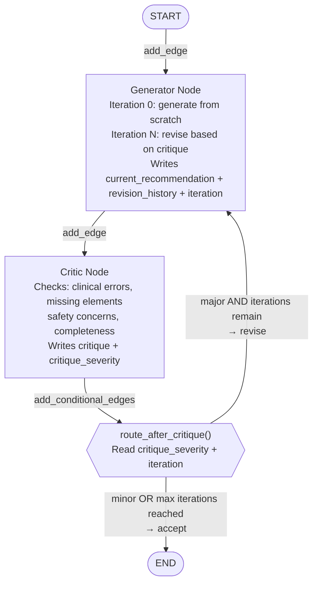
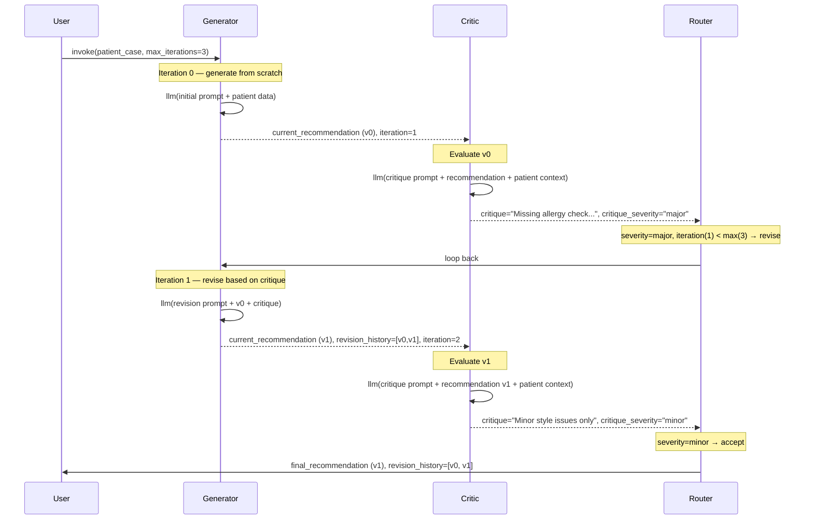

# Chapter 7 — Pattern 7: Reflection / Self-Critique

> **Prerequisite:** Read [Chapter 6 — Map-Reduce Fan-Out](./06_map_reduce_fanout.md) first. This final pattern introduces the concept of iterative self-improvement — a graph that loops until quality is acceptable.

---

## 1. What Is This Pattern?

Imagine a medical resident drafting a patient management plan after their first assessment. They hand it to their attending physician, who reviews it and returns it with specific critique notes: "You missed the contrast allergy in context of the planned CT scan. The Metformin dose should be held pre-procedure." The resident revises their plan, incorporating all the feedback. The attending reviews again — this time only minor style issues, nothing clinically significant. The plan is accepted. This is not a failing — it is how high-quality clinical work is produced in real medicine. The iteration process is the quality mechanism.

**Reflection / Self-Critique in LangGraph is that resident-attending review cycle.** A `generator_node` produces an initial treatment recommendation. A `critic_node` evaluates it for clinical errors, missing elements, safety concerns, and completeness. A conditional router (`route_after_critique`) decides: if the critique identifies major issues AND there are iterations remaining, loop back to the generator. The generator reads the critique and revises its recommendation. The cycle continues until the critique finds only minor issues (acceptable quality) or the maximum iteration limit is reached (safety stop).

This is the only pattern in this module that uses a **conditional back-edge** (a cycle in the graph). All other patterns are DAGs (directed acyclic graphs). The Reflection pattern is the first time LangGraph's cyclic graph capability is used architecturally.

---

## 2. When Should You Use It?

**Use this pattern when:**
- Output quality from a single pass is insufficient for the use case — the first LLM response often contains omissions, hallucinations, or safety oversights that a separate critic pass can identify.
- Safety-critical outputs need automated review before being delivered or acted upon — the critic acts as an automated safety check layer.
- You need an audit trail of quality improvement — `revision_history` stores all versions, showing the progression from draft to accepted output.
- Human review is not required for every iteration (cost/speed consideration) — for routine quality improvement, the automated critic is sufficient. Reserve HITL (Area 4) for cases requiring human judgement.

**Do NOT use this pattern when:**
- Single-pass output quality is already sufficient — every critique loop adds latency (one additional LLM call per iteration) and cost.
- Human review is mandatory regardless — if the output must be approved by a human before any action, use HITL (Area 4). The automated critic complements HITL; it does not replace it.
- The critic and generator are not meaningfully different — if both use the same LLM with the same temperature and only slightly different prompts, the critic may not catch the generator's systematic errors. Use a different model, temperature, or role for the critic.
- Latency is critical (emergency workflows) — each loop = one additional LLM call. Use Pattern 2 (Pipeline) for speed.

---

## 3. How It Works — Architecture Walkthrough

### ASCII Graph (from `reflection_self_critique.py`)

```
[START]
   |
   v
[generator]  <---------+
   |                   |
   v                   |
[critic]               |
   |                   |
route_after_critique() |
   |                   |
+--+---+               |
|      |               |
| "revise" --> [generator]   (loop back)
|      |
| "accept" --> [END]
```

### Step-by-Step Explanation

**`START → generator`**: The entry edge is fixed. The generator always runs first. On `iteration == 0`, it generates from scratch using the patient data. On subsequent iterations, it revises its previous recommendation based on the critic's feedback.

**`generator → critic`**: Fixed edge. After every generator call, the critic always runs.

**`critic → route_after_critique`**: The conditional edge. `route_after_critique` reads `critique_severity` and `iteration` from state. It returns `"revise"` (loop back to generator) or `"accept"` (proceed to END).

**`route_after_critique → generator` (revise branch)**: Back-edge — creates the loop. This is the key structural difference from all other patterns in this module.

**`route_after_critique → END` (accept branch)**: Terminates the graph.

### Mermaid Flowchart



### Sequence Diagram — Two-Iteration Example



---

## 4. State Schema Deep Dive

```python
class ReflectionState(TypedDict):
    messages: Annotated[list, add_messages]
    patient_case: dict

    current_recommendation: str     # Latest generator output — overwritten each iteration
    critique: str                   # Latest critic output — overwritten each iteration
    critique_severity: str          # "minor" | "major" — the routing signal
    revision_history: list[str]     # Appended each generator call — full audit trail
    iteration: int                  # Incremented by generator — tracks loop count
    max_iterations: int             # Set at invocation — the circuit breaker
    is_accepted: bool               # Set at invocation — available for downstream use
```

**Field: `current_recommendation: str`**
Overwritten by every generator call. It always holds the **latest** version of the recommendation. The previous version is preserved in `revision_history`. The critic always evaluates `current_recommendation` — the most recently generated version.

**Field: `critique: str`**
Overwritten by every critic call. The generator reads `state.get("critique", "")` on revision passes (iteration > 0) and incorporates the critique into its revision prompt. The critique is the inter-agent communication channel in this pattern.

**Field: `critique_severity: str`**
The routing signal. The critic embeds `"SEVERITY: MAJOR"` or `"SEVERITY: MINOR"` in its output text. The critic node parses this from the response. The router function reads this field to decide the next edge. This is a text-parsing approach — a production system would use structured output.

**Field: `revision_history: list[str]`**
The audit trail. Every generator call appends its output to this list. After 2 iterations, `revision_history = [v0, v1]`. This is the only field that grows monotonically (all others are overwritten). It enables retrospective quality analysis: "How many iterations were needed? How much did the recommendation change between v0 and v1?"

**Field: `iteration: int`**
Incremented by the generator on every call. It serves two purposes: (1) it tells the generator whether this is the first pass (`iteration == 0`) or a revision pass (`iteration > 0`); (2) it tells the router whether there are remaining iterations (`iteration < max_iterations`).

**Field: `max_iterations: int`**
Set at invocation: `initial_state["max_iterations"] = 3`. This is the hard upper bound on loop iterations. The circuit breaker. Without it, if the critic always returns `"major"`, the graph loops forever.

> **WARNING:** Always set `max_iterations` before invoking the reflection graph. If you forget and start with `max_iterations=0`, the graph will call `route_after_critique` on the first critic output with `iteration=1 < max_iterations=0` being false (1 is not < 0), so it will accept immediately. Test that your initial state includes a sensible `max_iterations` (typically 2–5 for production).

---

## 5. Node-by-Node Code Walkthrough

### `generator_node`

```python
def generator_node(state: ReflectionState) -> dict:
    """Generator agent — produces or revises the clinical recommendation."""
    llm = get_llm()
    patient = state["patient_case"]
    iteration = state.get("iteration", 0)
    prior_critique = state.get("critique", "")
    prior_recommendation = state.get("current_recommendation", "")
    revision_history = list(state.get("revision_history", []))

    if iteration == 0:
        # First pass: generate from scratch
        prompt = f"""Provide a treatment plan for this patient:
Patient: {patient.get('age')}y {patient.get('sex')}
...
Include: 1) Immediate actions 2) Medication changes 3) Monitoring plan 4) Follow-up
Keep under 150 words."""
        label = "initial"
    else:
        # Revision: address ALL critique points
        prompt = f"""Your previous recommendation was criticized:

PREVIOUS RECOMMENDATION:
{prior_recommendation}

CRITIQUE:
{prior_critique}

Revise the recommendation to address ALL critique points.
Maintain what was already correct. Fix what was wrong or missing.
Keep under 150 words."""
        label = f"revision_{iteration}"

    response = llm.invoke(prompt, config=build_callback_config(trace_name=f"reflection_generator_{label}"))

    revision_history.append(response.content)   # Preserve every version

    return {
        "current_recommendation": response.content,
        "revision_history": revision_history,
        "iteration": iteration + 1,
    }
```

**The dual-mode generator:** The generator behaves differently on the first call (`iteration == 0`) versus revision calls (`iteration > 0`). On the first call, it generates from scratch with a full clinical prompt. On revision calls, it receives both the previous recommendation and the critique, and is instructed to address ALL critique points while maintaining what was already correct. This "selective revision" approach prevents the generator from discarding correct content in an attempt to fix critiqued issues.

**`revision_history.append(response.content)`:** Each call to the generator appends its output to the history. The initial call adds v0; the first revision adds v1. The history grows: `[v0] → [v0, v1] → [v0, v1, v2]`. The `list(state.get("revision_history", []))` creates a defensive copy before appending, respecting LangGraph's state immutability requirements.

---

### `critic_node`

```python
def critic_node(state: ReflectionState) -> dict:
    """Critic agent — evaluates the generator's recommendation."""
    llm = get_llm()
    patient = state["patient_case"]
    recommendation = state.get("current_recommendation", "")
    iteration = state.get("iteration", 0)

    prompt = f"""Critically evaluate this clinical recommendation:

RECOMMENDATION:
{recommendation}

PATIENT CONTEXT:
Age: {patient.get('age')}y {patient.get('sex')}
Allergies: {', '.join(patient.get('allergies', []))}
Current Medications: {', '.join(patient.get('current_medications', []))}
Labs: {json.dumps(patient.get('lab_results', {}))}

Check for:
1. CLINICAL ERRORS: Are any facts wrong?
2. MISSING ELEMENTS: Does it address allergies, interactions, monitoring?
3. SAFETY CONCERNS: Are doses appropriate? Any contraindications missed?
4. COMPLETENESS: Are all required sections present?

End your critique with a severity assessment:
- "SEVERITY: MAJOR" if there are clinical errors or safety concerns
- "SEVERITY: MINOR" if only style or minor completeness issues remain
Keep under 120 words."""

    response = llm.invoke(prompt, ...)

    # Parse severity from text
    critique_text = response.content
    severity = "minor"  # default to accepting if parsing fails
    if "SEVERITY: MAJOR" in critique_text.upper() or "MAJOR" in ...:
        severity = "major"

    return {"critique": critique_text, "critique_severity": severity}
```

**The critic's four evaluation dimensions:**
1. **Clinical errors** — Factual inaccuracies (wrong drug name, wrong dose, wrong diagnosis).
2. **Missing elements** — Omissions (no allergy check, missing monitoring plan).
3. **Safety concerns** — Active patient safety risks (dose too high, contraindication missed).
4. **Completeness** — Structural requirements (all four sections present).

**Why the critic receives `patient_case` directly (not just the recommendation):** The critic needs to verify the recommendation against ground truth — it needs to know the patient's allergies (from `patient_case`) to check if the recommendation correctly handles them. The recommendation text alone is insufficient for a meaningful safety critique.

**Severity parsing from text:** The critic is instructed to include `"SEVERITY: MAJOR"` or `"SEVERITY: MINOR"` in its response. The node then parses for this string. This is fragile. A production implementation would use structured output:

```python
class CritiqueResult(BaseModel):
    clinical_errors: list[str]
    missing_elements: list[str]
    safety_concerns: list[str]
    severity: Literal["major", "minor"]
    critique_text: str

critic_llm = llm.with_structured_output(CritiqueResult)
result = critic_llm.invoke(prompt)
```

---

### `route_after_critique` (conditional edge function)

```python
def route_after_critique(state: ReflectionState) -> str:
    """Routing logic: revise or accept."""
    severity = state.get("critique_severity", "minor")
    iteration = state.get("iteration", 0)
    max_iterations = state.get("max_iterations", 3)

    if severity == "major" and iteration < max_iterations:
        print(f"    | [Router] Major critique at iteration {iteration}, looping back")
        return "revise"
    else:
        reason = ("minor critique (acceptable)" if severity == "minor"
                  else f"max iterations ({max_iterations}) reached")
        print(f"    | [Router] Accepting: {reason}")
        return "accept"
```

**Decision table:**

| `critique_severity` | `iteration < max_iterations` | Router returns |
|--------------------|------------------------------|----------------|
| `"major"` | True | `"revise"` (loop back) |
| `"major"` | False | `"accept"` (circuit breaker) |
| `"minor"` | True | `"accept"` (quality acceptable) |
| `"minor"` | False | `"accept"` (N/A — would have accepted earlier) |

**The circuit breaker case:** When `severity == "major"` but `iteration >= max_iterations`, the router still accepts. The accepted recommendation may not be perfect, but the system prioritises termination over quality. In production, this case should trigger a flag: `return {"is_accepted": False, "final_report": current_recommendation}` — note that the graph accepted but quality was insufficient.

### Graph Construction — The Conditional Back-Edge

```python
workflow.add_edge(START, "generator")
workflow.add_edge("generator", "critic")

workflow.add_conditional_edges(
    "critic",
    route_after_critique,
    {
        "revise": "generator",    # Loop back to generator
        "accept": END,            # Terminate
    },
)
```

`"revise": "generator"` creates the back-edge. This makes the graph cyclic — `generator → critic → generator → critic → ...` until the accept condition is met. LangGraph's `StateGraph` fully supports cyclic graphs. The cycle terminates because `iteration` monotonically increases and `max_iterations` provides the hard stop.

---

## 6. Routing / Coordination Logic Explained

### Why This Is the Most Complex Routing in the Module

All previous patterns used either fixed `add_edge` (Pipeline, Debate, Hierarchy) or forward `Send` fan-out (Voting, Map-Reduce). The Reflection pattern is the only one with a **back-edge** — a conditional edge that points to an earlier node, creating a true cycle.

```
Forward-only (DAG):        START → A → B → C → END
With back-edge (cyclic):   START → A → B → A → B → A → ... → END
                                       (when condition met)
```

LangGraph supports cyclic graphs natively. The key constraints for safe cycles:
1. **A monotonically increasing counter** (`iteration`) that prevents infinite loops.
2. **A hard upper bound** (`max_iterations`) that guarantees termination.
3. **A quality threshold** (`critique_severity == "minor"`) that terminates early when quality is achieved.

### The Iteration / Quality Trade-off Curve

```
Iteration 0 (initial): quality = baseline (single-pass LLM quality)
Iteration 1 (revision): quality = baseline + critic-guided improvements
Iteration 2 (revision): quality = iteration_1 + second round improvements
Iteration N (revision): diminishing returns — each additional revision adds less improvement
```

In practice, most quality improvement happens in the first 1–2 iterations. Beyond 3 iterations, the generator often reaches a local maximum and additional iterations produce only stylistic changes. Setting `max_iterations = 3` is a good default for most use cases.

---

## 7. Worked Example — Iteration Trace

**Patient:** PT-ARCH-007, 76M, aortic stenosis, CKD 3b, contrast dye allergy, BNP 450.

**Iteration 0 — Generator (initial):**
```
current_recommendation (v0):
"1) Immediate actions: Admit to cardiac unit, IV access, O2 therapy, cardiac monitor.
 2) Medication changes: Continue current medications.
 3) Monitoring plan: Serial ECG, troponin monitoring, daily vitals.
 4) Follow-up: Cardiology review in 48 hours."
revision_history: [v0]
iteration: 1
```

**Critic evaluates v0:**
```
critique: "1. CLINICAL ERRORS: No significant errors.
2. MISSING ELEMENTS: Contrast dye allergy not addressed — if CT or cath is planned,
   allergy pre-treatment protocol (steroids + antihistamine) must be documented.
   Metformin should be held pre-procedure. BNP 450 suggests HF — diuretic status not addressed.
3. SAFETY CONCERNS: Contrast allergy is a documented safety concern for any
   invasive or contrast-based procedure. Not addressing this is a critical omission.
4. COMPLETENESS: Medication review section too sparse.
SEVERITY: MAJOR"
critique_severity: "major"
```

**Router:** `severity=major, iteration(1) < max(3)` → `"revise"` → loop back to generator.

**Iteration 1 — Generator (revision):**
```
Revision prompt includes:
  PREVIOUS RECOMMENDATION: [v0 text]
  CRITIQUE: "Contrast allergy not addressed... BNP 450 diuretics..."

current_recommendation (v1):
"1) Immediate actions: Admit cardiac unit, IV access, continuous cardiac monitoring,
   O2 titration. Pre-procedure allergy protocol (methylprednisolone 32mg + diphenhydramine 50mg)
   if any contrast study planned.
 2) Medication changes: HOLD Metformin immediately. Consider cautious diuretic
   (furosemide 20mg) for BNP 450 / HF component — renal function monitoring essential
   given CKD 3b (eGFR 35).
 3) Monitoring: Serial ECG, troponin trend, BNP at 48h, renal function daily.
 4) Follow-up: Cardiology + nephrology co-review within 24h given CKD + cardiac risk."
revision_history: [v0, v1]
iteration: 2
```

**Critic evaluates v1:**
```
critique: "The revised recommendation appropriately addresses the contrast allergy protocol
and Metformin hold. Diuretic addition is clinically sound with appropriate monitoring.
Minor: 'cautious' diuretic could be more specific. No critical errors or safety concerns.
SEVERITY: MINOR"
critique_severity: "minor"
```

**Router:** `severity=minor` → `"accept"` → `END`.

**Final state:**
```python
{
    "current_recommendation": v1_text,  # The accepted version
    "revision_history": [v0, v1],       # Audit trail: 2 versions
    "iteration": 2,
    "critique_severity": "minor",
    "critique": "Appropriate... Minor: 'cautious'... SEVERITY: MINOR"
}
```

**Quality improvement summary:** v0 was clinically incomplete — it missed the contrast allergy (a patient safety issue) and the BNP elevation. v1 addressed both. The critic correctly identified the MAJOR safety concern and the generator correctly incorporated the fix. 2 iterations, 1 revision.

---

## 8. Key Concepts Introduced

- **Conditional back-edge (cyclic graph)** — `add_conditional_edges("critic", route_after_critique, {"revise": "generator", "accept": END})` creates a cycle. LangGraph natively supports cyclic graphs. The cycle is safe because of the iteration counter and `max_iterations` bound. First demonstrated in `build_reflection_graph()`.

- **Dual-mode generator** — The generator behaves differently on `iteration == 0` (generate from scratch) vs `iteration > 0` (revise based on critique). The branching is on `iteration`, not on a routing flag. First demonstrated in `generator_node`.

- **Critic as quality gate** — The critic node is not a domain specialist — it is a quality evaluation agent. It checks for errors, omissions, safety issues, and completeness. Its output is not added to a clinical report; it is used only for routing. First demonstrated in `critic_node`.

- **Severity-based routing** — `route_after_critique` reads `critique_severity` to determine the next edge. This is a text-parsing-based routing signal (as opposed to the supervisor's free-text routing or the voting pattern's structured aggregation). First demonstrated in `route_after_critique`.

- **`revision_history` audit trail** — Every generator output is preserved in the `revision_history` list. The final state contains all versions, allowing retrospective quality analysis. First demonstrated in `generator_node`.

- **Max-iterations circuit breaker in cyclic graphs** — For any cyclic LangGraph pattern, a monotonically increasing counter and a hard upper bound are required for guaranteed termination. The pattern: `if iteration >= max_iterations: return early_termination`. First demonstrated here; also used in Supervisor (Pattern 1).

- **MAS theory: reflection and self-play** — Reflection / Self-Critique corresponds to the "self-play" or "critic-actor" pattern in ML literature (e.g., AlphaGo's self-play, Constitutional AI's self-critique process). An agent uses one model (or model configuration) as a generator and another as a critic. This is also related to the "generate-and-test" paradigm in AI planning, where a proposal is generated and then tested against constraints before acceptance.

- **Iterative refinement vs parallel redundancy** — Reflection produces one high-quality output through iteration. Voting (Pattern 3) produces multiple outputs in parallel and synthesises them. Both improve output quality, but through different mechanisms: reflection through sequential depth; voting through parallel diversity.

---

## 9. Common Mistakes and How to Avoid Them

### Mistake 1: Generator and critic are too similar (same model, same temperature)

**What goes wrong:** The generator and critic use the same LLM, same temperature, same prompt style. The critic cannot reliably identify errors in the generator's output because they share the same systematic biases. Every critique returns "MINOR".

**Fix:** Use a higher-temperature critic (more likely to find issues), a larger/different model for the critic, or significantly different prompts (the critic prompt should be specifically adversarial — "your job is to find what is wrong"). Some production systems use a different model family entirely for the critic.

---

### Mistake 2: Generator discards correct content during revision

**What goes wrong:** On the revision pass, the generator rewrites the recommendation from scratch, losing the correct parts of v0 in the process. The new v1 fixes the critique but loses other correct elements.

**Fix:** The revision prompt must explicitly say: "Maintain what was already correct. Fix ONLY what the critique identified." Include the previous recommendation verbatim in the revision prompt so the generator can preserve correct sections while modifying only the critiqued parts.

---

### Mistake 3: No `max_iterations` guard in the initial state

**What goes wrong:** You invoke the graph with `initial_state = {"patient_case": ..., "iteration": 0}` — forgetting to set `max_iterations`. The default `state.get("max_iterations", 3)` in `route_after_critique` saves you here, but if you later change the default or remove it, an infinite loop becomes possible.

**Fix:** Always explicitly set `max_iterations` in the initial state: `initial_state["max_iterations"] = 3`. Make this a required field in `ReflectionState` (remove the default from `route_after_critique` to force the caller to set it).

---

### Mistake 4: `is_accepted` field is never set to `True` in the graph

**What goes wrong:** `is_accepted` is defined in `ReflectionState` and set to `False` in the initial state, but no node ever writes `True` to it. When the router accepts (either via minor severity or circuit breaker), `is_accepted` remains `False`. Downstream logic that checks `if state["is_accepted"]: ...` would always see `False`.

**Fix:** In the router function, when returning `"accept"`, also write to state. But since router functions cannot return state updates directly (they only return the next node name), add a separate `acceptance_node` before END that sets `is_accepted = True`. Or handle the accepted/not-accepted distinction by checking `critique_severity` directly instead of `is_accepted`.

---

## 10. How This Pattern Connects to the Others

### Reflection + HITL

The most powerful production composition for safety-critical outputs:

```
generator_node → critic_node → route_after_critique
                                  ↓ (accept)
                              HITL interrupt(review_payload)
                                  ↓ (human approves)
                                END
```

Reflection handles automated quality improvement (mechanical errors, missing elements). HITL handles clinical judgement (is this the right treatment for this specific patient?). Neither replaces the other.

### Reflection vs Supervisor (both use conditional back-edges)

| Supervisor (Pattern 1) | Reflection (Pattern 7) |
|----------------------|----------------------|
| Loop: supervisor decides next agent | Loop: generator revises based on critique |
| Loop terminates: `available_agents` empty OR max_iterations | Loop terminates: critique is minor OR max_iterations |
| Each iteration adds a new agent's work | Each iteration refines the same output |
| Final output: aggregated report of all agents | Final output: single refined recommendation |

Both patterns use cycles with a circuit breaker. The structural pattern is the same (`while termination_condition: route_to_worker`); the semantic purpose is different.

---

## 11. Quick-Reference Summary

| Aspect | Detail |
|--------|--------|
| **Pattern name** | Reflection / Self-Critique |
| **Script file** | `scripts/MAS_architectures/reflection_self_critique.py` |
| **Graph nodes** | `generator`, `critic` |
| **Routing type** | `add_edge(generator, critic)` + `add_conditional_edges(critic, route_after_critique, {revise: generator, accept: END})` |
| **State schema** | `ReflectionState` with `current_recommendation`, `critique`, `critique_severity`, `revision_history`, `iteration`, `max_iterations`, `is_accepted` |
| **Key loop mechanism** | Back-edge from `critic → generator`; terminates on minor severity OR max_iterations |
| **Root modules** | `core/config` → `get_llm()`; `observability/callbacks` — no `agents/` module |
| **LLM calls per run** | (1 generator + 1 critic) × N iterations = 2N calls, where N ≤ max_iterations |
| **Parallelism** | None — inherently sequential by design |
| **New MAS concepts** | Conditional back-edge, cyclic graph, dual-mode generator, severity-based routing, revision history audit trail, critic-actor pattern |
| **This completes** | All 7 MAS architecture patterns |

---

## Summary: The 7 MAS Architecture Patterns — Final Reference

| # | Pattern | Key Mechanism | Execution | Agents | Best For |
|---|---------|--------------|-----------|--------|----------|
| 1 | Supervisor Orchestration | `add_conditional_edges` + LLM routing | Sequential loop | 3 specialists + supervisor LLM | Dynamic, adaptive workflows |
| 2 | Sequential Pipeline | `add_edge` only | Sequential fixed | 3 specialists + synthesiser LLM | Predictable, debuggable workflows |
| 3 | Parallel Voting | `Send` + `operator.add` | Parallel map + sequential aggregate | 3 specialists + aggregator LLM | High-stakes independent assessment |
| 4 | Adversarial Debate | Adversarial prompts + fixed edges | Sequential rounds | Pro LLM + Con LLM + Judge LLM | Complex dilemmas, documented rationale |
| 5 | Hierarchical Delegation | Fixed edges + information filtering | Sequential levels | 3 specialists + 2 leads LLM + CMO LLM | Large organisations, layered authority |
| 6 | Map-Reduce Fan-Out | `Send` + `operator.add` + non-LLM reduce | Parallel map + sequential reduce/produce | 3 workers + producer LLM | Independent sub-tasks, cross-domain synthesis |
| 7 | Reflection / Self-Critique | Conditional back-edge + severity routing | Sequential iterative | Generator LLM + Critic LLM | Safety-critical quality improvement |

---

*This is the final chapter. Return to the [overview](./00_overview.md) to review the pattern landscape, or explore the [README](../README.md) for run instructions.*
