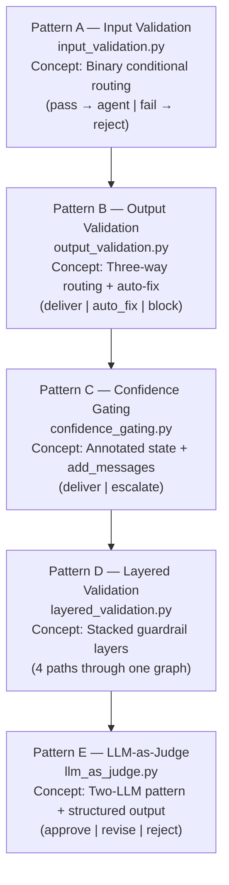
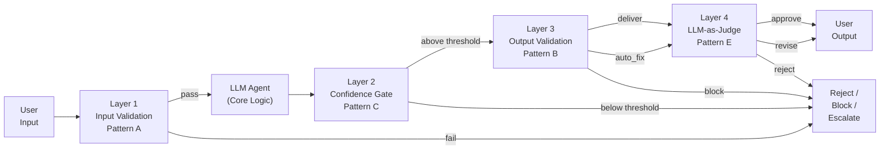

# Chapter 0 — Guardrails: An Overview of All Five Patterns

> **Reading time:** ~20 minutes. Read this chapter before opening any of the five pattern chapters.

---

## 1. What Are Guardrails in an Agentic AI System?

Imagine a bank's customer service phone line. When you call, a human operator does not immediately transfer you to the vault. First, they ask who you are. Then they listen to your question. If you ask something completely off-topic — "Can you book me a flight?" — they redirect you. If you ask something that sounds suspicious — "How do I access accounts I don't own?" — they end the call. Only after these checks do they connect you to the right department.

**Guardrails in an agentic AI system work exactly like that operator.** They sit between the user (or another agent) and the Large Language Model (LLM), intercepting requests *before* the LLM runs, and intercepting responses *after* the LLM runs. A guardrail asks: "Is this input safe to process? Is this output safe to deliver?"

Without guardrails, an LLM agent is exposed to:

- **Prompt injection attacks** — a user embeds hidden instructions like "Ignore all previous instructions and..." to manipulate the agent's behaviour.
- **Personally Identifiable Information (PII) leakage** — a user accidentally includes a social security number or email address in their query, and the agent logs or repeats it.
- **Scope creep** — a user asks a medical agent about stock prices; the agent answers anyway, wasting tokens and creating liability.
- **Unsafe outputs** — the LLM generates a response that is clinically dangerous, legally problematic, or simply incorrect with high stated confidence.
- **Hallucinations with low certainty** — the LLM admits it is unsure, but the response is delivered anyway without any human review.

Guardrails are the mechanism that prevents all of these from reaching the user.

> **NOTE:** Guardrails do not make your LLM smarter. They make your *system* safer. The LLM's reasoning quality is a separate concern from the pipeline's safety properties.

---

## 2. Why LangGraph? (vs. Plain Python `if/else`)

You could implement every guardrail pattern in this module as a Python function with `if/else` branches. So why use LangGraph?

**The short answer: visibility, extensibility, and separation of concerns.**

Consider this naive Python approach:

```python
# Plain Python approach — all logic tangled together
def handle_request(user_input):
    result = validate_input(user_input)   # validation buried in the function
    if not result["passed"]:
        return "Blocked: " + result["reason"]  # rejection handling inline
    response = llm.invoke(user_input)           # agent call mixed with routing
    output = validate_output(response)          # output check also inline
    if not output["passed"]:
        return "Blocked output"                 # another inline branch
    return response
```

This code works. But it has problems:

1. **You cannot see the flow.** When you inspect an execution trace, you see one function call — `handle_request`. You cannot tell which validation fired, why, or at what latency.
2. **You cannot extend independently.** To add audit logging to the rejection path, you edit `handle_request`. To add a retry to the output validation, you edit the same function. Every change risks breaking the others.
3. **You cannot swap components.** The validation logic, routing logic, and response generation are fused. Testing them in isolation requires careful mocking.

**LangGraph solves all three problems by making each concern a named node:**

```
[validation_node]    ← owns ONLY the "is this valid?" question
[route_after_validation]  ← owns ONLY the "which path?" question
[agent_node]         ← owns ONLY "generate a response"
[reject_node]        ← owns ONLY "handle the bad case"
```

Each node is a Python function that receives the current state, does exactly one job, and returns a partial state update. The routing logic lives in a separate router function that LangGraph calls between nodes. This is called **separation of concerns** — each piece of code has one reason to change.

When you look at an execution trace in LangSmith (or any LangGraph tracing tool), you see every named node that ran, in order, with its inputs and outputs. You can pinpoint exactly which guardrail fired and why.

> **TIP:** Think of LangGraph nodes as the stages on an assembly line. The state dict is the part being built. Each stage reads what it needs, does its work, and writes its contribution. The conveyor belt (the edges) moves the part to the right next station based on what was written.

---

## 3. The Five Guardrail Patterns — Learning Progression

The five patterns in this module form a deliberate learning sequence. Each one introduces one new LangGraph concept and builds on the previous.



Each arrow means: "You need to understand this pattern before the next one makes sense." The concepts introduced are cumulative — Pattern E uses all the vocabulary introduced in Patterns A through D.

---

## 4. Pattern Comparison Table

| Pattern | Script | Routing Type | What It Checks | When to Use It |
|---------|--------|-------------|----------------|----------------|
| **A — Input Validation** | `input_validation.py` | Binary (2 outcomes) | PII, prompt injection, scope before LLM call | Any system where you want to block invalid inputs before spending LLM tokens |
| **B — Output Validation** | `output_validation.py` | Three-way (3 outcomes) | Prohibited content, missing disclaimers, dangerously low confidence in output | Any system where you need to intercept unsafe LLM responses before delivery |
| **C — Confidence Gating** | `confidence_gating.py` | Binary threshold (2 outcomes) | The LLM's own self-assessed certainty score | High-stakes domains (medical, legal, financial) where uncertain responses require human review |
| **D — Layered Validation** | `layered_validation.py` | Two chained routers (4 paths) | Input checks AND output checks in sequence | Production pipelines that need both entry and exit protection simultaneously |
| **E — LLM-as-Judge** | `llm_as_judge.py` | Three-way semantic (3 outcomes) | Safety, relevance, and completeness using a second LLM | When regex/keyword checks are insufficient and you need semantic evaluation of nuance |

---

## 5. Defence in Depth — How All Five Patterns Compose

No single guardrail catches every problem. **Defence in depth** is the principle of layering independent guards so that if one guard misses something, the next catches it.

Here is how all five patterns compose into a complete production pipeline:



**Pattern D (Layered Validation)** is the simplified version of this full stack — it combines Layer 1 and Layer 3 into one graph without Pattern C or Pattern E. It is the "minimum viable production guardrail."

Each layer catches a different class of problem:

- **Layer 1 (Input Validation)** catches structural problems with the *request* — PII, injection attacks, out-of-scope queries. It is cheap (no LLM call) and runs first.
- **Layer 2 (Confidence Gating)** catches the LLM's own uncertainty — "I generated a response, but I am not sure it is right." It escalates borderline cases before the output checks run.
- **Layer 3 (Output Validation)** catches structural problems with the *response* — prohibited content, missing required disclaimers, content that violates policy regardless of how the LLM felt about it.
- **Layer 4 (LLM-as-Judge)** catches semantic problems — responses that are technically valid by rule-based checks but are contextually wrong, incomplete, or unsafe given the specific patient or question.

> **WARNING:** Do not run all four layers on every request in a production system without thinking about cost. Layer 4 (LLM-as-Judge) makes a second full LLM call. A sensible production strategy is to run Layer 4 only on responses that *pass* Layers 1–3, and only for high-risk request categories (e.g., medication dosage, drug interaction questions).

---

## 6. Reading Order Guide

Read the chapters in order. Each one is a self-contained document, but the concepts build.

| Chapter | File | One-line description |
|---------|------|----------------------|
| **This file** | [`00_overview.md`](./00_overview.md) | What guardrails are, why LangGraph, and how all five patterns fit together. |
| **Chapter 1** | [`01_input_validation.md`](./01_input_validation.md) | Learn binary conditional routing by wiring `validate_input()` as a named LangGraph node. |
| **Chapter 2** | [`02_output_validation.md`](./02_output_validation.md) | Extend to three-way routing and introduce the auto-fix pattern for minor output issues. |
| **Chapter 3** | [`03_confidence_gating.md`](./03_confidence_gating.md) | Learn how to extract a confidence score from an LLM response and route on it — with real LLM calls. |
| **Chapter 4** | [`04_layered_validation.md`](./04_layered_validation.md) | Compose Patterns A and B into one pipeline with two sequential conditional routers and four execution paths. |
| **Chapter 5** | [`05_llm_as_judge.md`](./05_llm_as_judge.md) | Use a second LLM to evaluate the first LLM's output semantically, using structured output (Pydantic) for reliable verdict parsing. |

---

## 7. Key Vocabulary Introduced in This Module

Before reading the pattern chapters, familiarise yourself with these terms. Each is explained in full in the chapter where it first appears.

| Term | Plain-English Meaning | First appears in |
|------|-----------------------|-----------------|
| `StateGraph` | LangGraph's graph builder — you add nodes and edges to it, then compile it into a runnable graph | Chapter 1 |
| `TypedDict` | A Python dict with declared key types — used as the graph's shared memory (state) | Chapter 1 |
| `START` | LangGraph's sentinel value representing the entry point of the graph | Chapter 1 |
| `END` | LangGraph's sentinel value representing the exit point of the graph | Chapter 1 |
| `add_conditional_edges()` | The LangGraph method that wires a router function between a node and its possible successors | Chapter 1 |
| `Annotated[list, add_messages]` | A type annotation that tells LangGraph to *accumulate* messages instead of replacing them | Chapter 3 |
| `ToolNode` | A prebuilt LangGraph node that executes tool calls made by an LLM | Chapter 4 |
| `JudgeVerdict` | A Pydantic model used with structured output to force the judge LLM to return a validated verdict object | Chapter 5 |

---

## 8. What This Module Does NOT Cover

This module teaches the **LangGraph wiring patterns** for guardrails. It does not teach:

- The implementation details of `validate_input()`, `validate_output()`, or `evaluate_with_judge()` — those live in the root `guardrails/` package.
- How to build the regex patterns for PII detection — see `guardrails/input_guardrails.py`.
- Human-in-the-loop (HITL) using LangGraph `interrupt()` — see `scripts/script_04c_hitl_review.py`.
- Async execution and parallel node runs — see `scripts/script_09_observability_resilience.py`.

> **TIP:** After finishing this module, the natural next step is `scripts/memory/` (Area 4), which adds persistent memory to the agents you have just learned to guard.

---

*Continue to [Chapter 1 — Input Validation](./01_input_validation.md).*
