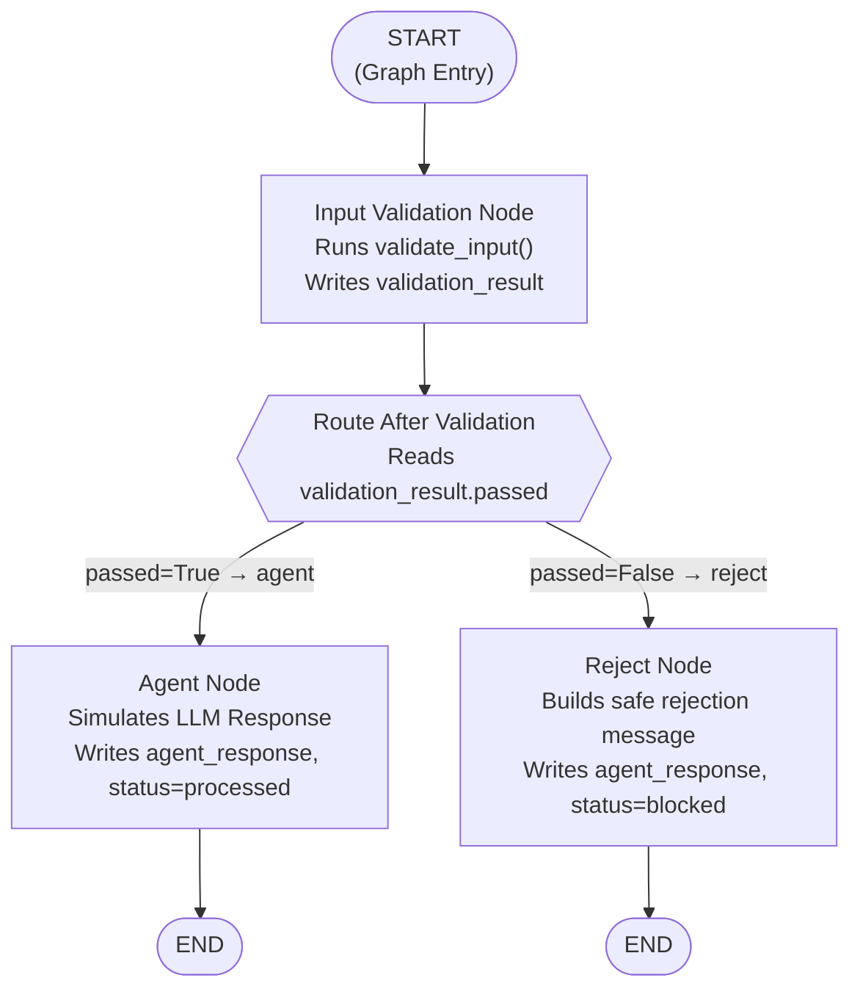
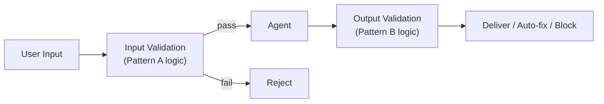

# Chapter 1 — Pattern A: Input Validation

> **Prerequisite:** Read [Chapter 0 — Overview](./00_overview.md) first to understand where this pattern fits in the learning sequence.

---

## 1. What Is This Pattern?

Think of a hospital receptionist whose job is to check intake forms before a patient sees the doctor. The receptionist does not diagnose anything — that is the doctor's job. The receptionist simply asks: "Does this form have a name? Is there a date? Is the patient here about something we treat?" If the answer to any of those questions is no, the form goes back to the patient, and the doctor is never interrupted.

**Input validation in a LangGraph graph does exactly the same job.** Before your LLM agent does any work — before it reads the user's message, before it generates tokens, before it costs you a cent — a validation node intercepts the user's input and runs a set of checks. If the input fails, the graph routes it to a rejection handler. If it passes, the graph routes it to the agent.

The problem this pattern solves is: **how do you prevent unsafe, malformed, or off-scope inputs from reaching your LLM in a way that is visible, traceable, and independently extensible?** A plain Python `if/else` before the LLM call works, but it is invisible in traces and hard to extend. A named graph node is visible, testable, and replaceable.

---

## 2. When Should You Use It?

**Use this pattern when:**

- Your system handles user-generated text that could include Personally Identifiable Information (PII) such as social security numbers, email addresses, or phone numbers that must not be processed by the LLM.
- Your agent is a domain specialist (e.g., a clinical triage assistant) and you need to block queries that are out of scope (e.g., "What is the weather today?").
- You want to detect and block prompt injection attempts — messages where a user tries to hijack the agent's instructions by writing things like "Ignore all previous instructions."
- You need to keep a clear audit trail showing which inputs were blocked, by which guardrail, and why.
- You want the rejection path to be independently extensible — adding rate-limiting, alerting, or logging to rejections without touching the validation logic.

**Do NOT use this pattern when:**

- The problem you are solving is about the *quality* of the LLM's output, not the safety of the input — for that, use [Pattern B (Output Validation)](./02_output_validation.md).
- All inputs are pre-validated by the calling system and you trust them completely (e.g., an internal tool where inputs are machine-generated from a known schema).

---

## 3. How It Works — Architecture Walkthrough

### ASCII Graph (from the script's docstring)

```
[START]
   |
   v
[validation]         <-- calls validate_input(), stores result
   |
route_after_validation()   <-- conditional edge router
   |
+--+---------+
|             |
| "agent"     | "reject"
v             v
[agent]      [reject]
|             |
v             v
[END]        [END]
```

### Step-by-Step Explanation

**Edge: START → validation**
LangGraph always begins execution at the `START` sentinel node (a built-in marker that represents "the graph entry point"). The first `add_edge(START, "validation")` call tells LangGraph: "The first real node to execute is `validation`." No logic runs at `START` itself — it is just a named entry point.

**Node: `validation`**
This node calls `validate_input()` (defined in `guardrails/input_guardrails.py` — see the root module note in section 5) and writes the full result dict to `state["validation_result"]`. That is its only job. It does not decide what happens next. The decision about where to go next is not the validation node's responsibility — that belongs to the router.

**Conditional edge router: `route_after_validation()`**
This is *not* a node. It is a plain Python function that LangGraph calls after `validation` completes. It reads `state["validation_result"]["passed"]` and returns the string `"agent"` or `"reject"`. LangGraph maps those strings to the corresponding node names via the dict you pass to `add_conditional_edges()`. The router makes the routing decision; the nodes do the work.

**Node: `agent`**
This node runs only when `route_after_validation()` returns `"agent"` — meaning the input passed all checks. In this demo script, it simulates an LLM response. In a real pipeline, this is where you would call `llm.invoke()`. It writes `agent_response` and `status: "processed"` to state.

**Node: `reject`**
This node runs only when `route_after_validation()` returns `"reject"` — meaning the input failed at least one check. It reads `state["validation_result"]` to extract the specific reason and the name of the guardrail that fired, then writes a user-safe rejection message to `agent_response` and sets `status: "blocked"`.

**Edges: `agent` → END, `reject` → END**
Both terminal nodes connect to `END` (LangGraph's built-in "graph is finished" marker). Reaching `END` causes LangGraph to stop execution and return the final state to the caller.

### Mermaid Flowchart



---

## 4. State Schema Deep Dive

```python
class InputValidationState(TypedDict):        # TypedDict: a Python dict with declared key types
    user_input: str               # Set at invocation time
    validation_result: dict       # Written by: validation_node
    agent_response: str           # Written by: agent_node or reject_node
    status: str                   # Written by: agent_node or reject_node
```

**`TypedDict` explained:**
`TypedDict` is a standard Python class from the `typing` module that describes a dictionary with fixed, typed keys. LangGraph uses it as the **state schema** — the blueprint for the shared memory object that every node reads from and writes to. When you call `workflow.invoke({"user_input": "...", ...})`, LangGraph validates that the dict matches this schema (at runtime, not statically).

**Field: `user_input: str`**
- **Who writes it:** Set by the caller at invocation time (the initial state dict passed to `graph.invoke()`).
- **Who reads it:** `validation_node` (to run checks) and `agent_node` (to simulate a response).
- **Why it exists as a separate field:** It is the raw user text. Keeping it in state means every downstream node can inspect the original input without it being overwritten.

**Field: `validation_result: dict`**
- **Who writes it:** `validation_node` — it writes the full result returned by `validate_input()`.
- **Who reads it:** `route_after_validation()` (reads `["passed"]`) and `reject_node` (reads `["reason"]` and `["guardrail"]`).
- **Why it exists as a separate field:** Separating the *result* of validation from the *action taken on that result* is the core of the separation-of-concerns principle. The router reads `validation_result["passed"]` — a true/false flag. The reject node reads `validation_result["reason"]` — a human-readable explanation. If you inlined both into the same logic, adding a new guardrail type would require editing three places instead of one.
- **Structure returned by `validate_input()`:** `{"passed": bool, "reason": str, "guardrail": str}`. Defined in `guardrails/input_guardrails.py`.

**Field: `agent_response: str`**
- **Who writes it:** `agent_node` (with a processed response) or `reject_node` (with a safe rejection message).
- **Who reads it:** The caller of `graph.invoke()` reads it from the final returned state.
- **Why it exists as a separate field:** Using a single named field for the final text output — regardless of which path produced it — makes the caller's code simple: always read `result["agent_response"]`.

**Field: `status: str`**
- **Who writes it:** `agent_node` writes `"processed"`, `reject_node` writes `"blocked"`.
- **Who reads it:** The caller uses it to distinguish success from rejection without parsing `agent_response`.
- **Why it exists as a separate field:** Providing a machine-readable status code (instead of inspecting the text of `agent_response`) allows the caller to react to the outcome programmatically.

> **NOTE:** LangGraph state is **immutable inside a node** — you cannot modify `state` in-place. Each node must return a new dict containing only the keys it wants to update. LangGraph merges that partial update into the full state before the next node runs. This is why every node returns `{"validation_result": result}` instead of setting `state["validation_result"] = result`.

---

## 5. Node-by-Node Code Walkthrough

### `validation_node`

```python
def validation_node(state: InputValidationState) -> dict:
    # Call validate_input() from the root guardrails module (guardrails/input_guardrails.py)
    # It runs PII detection, prompt injection detection, and scope checks on the raw text
    result = validate_input(state["user_input"])
    # Return only the keys this node writes — LangGraph merges this into the full state
    return {"validation_result": result}
```

**Line-by-line explanation:**
- `state: InputValidationState` — LangGraph injects the current state dict when it calls this function. The type hint is documentation; it tells you what keys are available.
- `result = validate_input(state["user_input"])` — This calls the root module function `validate_input()` defined in `guardrails/input_guardrails.py`. That function runs three checks: `detect_pii()` (looks for SSN patterns like `\d{3}-\d{2}-\d{4}` and email addresses), `detect_prompt_injection()` (looks for phrases like "ignore all previous instructions"), and `check_medical_scope()` (checks that the query contains medically relevant vocabulary). It returns a dict with at least `{"passed": bool, "reason": str, "guardrail": str}`.
- `return {"validation_result": result}` — Returns a *partial state update*. Only `validation_result` changes. `user_input`, `agent_response`, and `status` remain as they were. LangGraph handles the merge.

**What breaks if you remove this node:** Every input reaches the agent unconditionally. PII is processed by the LLM, prompt injections succeed, and off-scope queries burn tokens and produce irrelevant responses.

> **TIP:** In a production system, extend `validation_node` to write additional fields: `validation_timestamp`, `validation_latency_ms`, and `session_id`. These feed an audit log. The node is already isolated, so you add the fields here without touching routing or agent logic.

---

### `route_after_validation`

```python
def route_after_validation(state: InputValidationState) -> Literal["agent", "reject"]:
    # Read the result written by validation_node
    if state["validation_result"]["passed"]:
        return "agent"   # Validation passed — send to agent
    return "reject"      # Validation failed — send to rejection handler
```

**Line-by-line explanation:**
- This is a **router function**, not a node. LangGraph calls it *between* nodes as part of `add_conditional_edges()`.
- `Literal["agent", "reject"]` — The return type annotation documents the possible routing outcomes. LangGraph uses these strings to look up the target node in the mapping dict you provide.
- `state["validation_result"]["passed"]` — Reads the boolean written by `validation_node`. This is the single decision point for the entire binary routing.

**What breaks if you remove this function:** You cannot use `add_conditional_edges()` without a router function. Without conditional routing, you would have to add two separate nodes or use plain Python branching, which defeats the whole pattern.

> **WARNING:** If `validation_node` fails before writing `validation_result` (e.g., `validate_input()` raises an exception), `route_after_validation` will raise a `KeyError` on `state["validation_result"]["passed"]`. In production, wrap `validate_input()` in a `try/except` inside `validation_node` and set `validation_result = {"passed": False, "reason": "Validation error", "guardrail": "exception_handler"}` on failure.

---

### `agent_node`

```python
def agent_node(state: InputValidationState) -> dict:
    # Simulated response — truncate input to 80 chars to keep the output readable
    # In production: replace this with llm.invoke(state["user_input"])
    return {
        "agent_response": f"[Agent] Processed: {state['user_input'][:80]}...",
        "status": "processed",  # Machine-readable success indicator
    }
```

**Line-by-line explanation:**
- `state['user_input'][:80]` — In the demo, the agent just echoes the first 80 characters of the input. In a real system, you would call your LLM here.
- `"status": "processed"` — Sets the terminal status to signal successful processing.

**What breaks if you remove this node:** The graph has no success path. Every input that passes validation leads to a dead end — LangGraph raises an error because the conditional edge's `"agent"` key maps to a non-existent node.

> **TIP:** In production, replace the simulated response with: `response = llm.invoke(state["user_input"])` and return `{"agent_response": response.content, "status": "processed"}`. If you use a chat model, pass `[HumanMessage(content=state["user_input"])]` instead of raw text.

---

### `reject_node`

```python
def reject_node(state: InputValidationState) -> dict:
    # Extract the reason and guardrail name from the validation result
    reason = state["validation_result"].get("reason", "Unknown violation")
    guardrail = state["validation_result"].get("guardrail", "unknown")
    return {
        # Build a user-safe message that names the guardrail and the reason
        "agent_response": f"Input blocked by [{guardrail}]: {reason}",
        "status": "blocked",  # Machine-readable rejection indicator
    }
```

**Line-by-line explanation:**
- `.get("reason", "Unknown violation")` — Uses `.get()` with a default so the node never crashes even if the validation result dict is missing a key (defensive coding).
- `f"Input blocked by [{guardrail}]: {reason}"` — Constructs a message that identifies *which* guardrail fired (e.g., `[pii_detector]`) and *why* (e.g., `"SSN pattern detected"`). This is user-safe — it reveals the category of issue but not internal system details.
- `"status": "blocked"` — Sets the terminal status to signal rejection.

**What breaks if you remove this node:** Every rejected input (failed validation) leads to a dead end — LangGraph raises an error because the conditional edge's `"reject"` key maps to a non-existent node.

> **TIP:** In production, extend `reject_node` to:
> 1. Write to an audit log: `audit_logger.log(guardrail=guardrail, reason=reason, user_id=state.get("user_id"))`.
> 2. Increment a rate-limit counter for the user/IP.
> 3. Send a security alert if the guardrail is `"prompt_injection_detector"` and the same user has triggered it more than N times.
> None of these changes require touching `validation_node` or the router.

---

### `validate_input()` — Root Module Note

`validate_input()` is defined in `guardrails/input_guardrails.py` (the root module), not in this script. This script imports it as:

```python
from guardrails.input_guardrails import validate_input
```

**Contract (expected inputs, outputs, side effects):**
- **Input:** `text: str` — the raw user input string.
- **Output:** `dict` with keys: `passed: bool`, `reason: str` (human-readable explanation of failure, or empty string on pass), `guardrail: str` (name of the guardrail that fired, e.g. `"pii_detector"`, `"injection_detector"`, `"scope_checker"`).
- **Side effects:** None documented — it is a pure function in the pattern script's context. In production, it may log to an audit system.
- **Checks it runs:** `detect_pii()` (SSN regex `\d{3}-\d{2}-\d{4}`, email regex `[\w.+-]+@[\w-]+\.[\w.-]+`), `detect_prompt_injection()` (keyword matching against known injection phrases), `check_medical_scope()` (vocabulary overlap with a medical term list).

---

## 6. Conditional Routing Explained

### `add_conditional_edges()` from First Principles

```python
workflow.add_conditional_edges(
    "validation",          # The source node — routing happens AFTER this node runs
    route_after_validation, # The router function — called with the current state, returns a string key
    {"agent": "agent", "reject": "reject"},  # Mapping: router return value → target node name
)
```

`add_conditional_edges()` takes three arguments:

1. **Source node name** (`"validation"`) — After this node completes, LangGraph will call the router function instead of following a fixed edge.
2. **Router function** (`route_after_validation`) — A plain Python function that receives the current state and returns a string. LangGraph uses that string as a lookup key in the next argument.
3. **Mapping dict** (`{"agent": "agent", "reject": "reject"}`) — Maps each possible return value of the router to a node name. The keys are what the router returns; the values are the node names to go to.

In this case, both keys and values happen to be identical (`"agent"` → `"agent"`), but they do not have to be. You could write `{"pass": "agent", "fail": "reject"}` if your router returned `"pass"` and `"fail"` — the mapping translates the router's vocabulary to the graph's node names.

### Decision Table

| `validation_result["passed"]` | Router Returns | Next Node | Final `status` |
|-------------------------------|----------------|-----------|----------------|
| `True` | `"agent"` | `agent` node | `"processed"` |
| `False` | `"reject"` | `reject` node | `"blocked"` |

---

## 7. Worked Example — Trace: "BLOCKED: Contains SSN (PII)"

**Test input from `TEST_INPUTS`:**
```python
{
    "label": "BLOCKED: Contains SSN (PII)",
    "text": "Patient John Smith, SSN 123-45-6789, has chest pain and shortness of breath.",
}
```

**Initial state passed to `graph.invoke()`:**
```python
{
    "user_input": "Patient John Smith, SSN 123-45-6789, has chest pain and shortness of breath.",
    "validation_result": {},   # empty — not yet populated
    "agent_response": "",      # empty — not yet populated
    "status": "pending",       # default before any node runs
}
```

---

**Step 1 — `validation_node` executes:**

`validate_input()` scans the text and finds the pattern `123-45-6789` matching the SSN regex `\d{3}-\d{2}-\d{4}`.

State AFTER `validation_node`:
```python
{
    "user_input": "Patient John Smith, SSN 123-45-6789, ...",  # unchanged
    "validation_result": {
        "passed": False,                        # SSN detected → fail
        "reason": "SSN pattern detected",       # human-readable explanation
        "guardrail": "pii_detector",            # which check fired
    },
    "agent_response": "",   # still empty — this node didn't write it
    "status": "pending",    # still pending — this node didn't write it
}
```

---

**Step 2 — `route_after_validation()` is called:**

```python
state["validation_result"]["passed"]  # → False
# Returns "reject"
```

LangGraph consults the mapping dict: `"reject"` → node named `"reject"`. Execution jumps to `reject_node`.

---

**Step 3 — `reject_node` executes:**

```python
reason = state["validation_result"].get("reason", "Unknown violation")
# → "SSN pattern detected"

guardrail = state["validation_result"].get("guardrail", "unknown")
# → "pii_detector"
```

State AFTER `reject_node`:
```python
{
    "user_input": "Patient John Smith, SSN 123-45-6789, ...",  # unchanged
    "validation_result": {                                      # unchanged
        "passed": False,
        "reason": "SSN pattern detected",
        "guardrail": "pii_detector",
    },
    "agent_response": "Input blocked by [pii_detector]: SSN pattern detected",  # written by reject_node
    "status": "blocked",  # written by reject_node
}
```

---

**Step 4 — Graph reaches `END`:**

`graph.invoke()` returns the final state. The caller reads:
```python
result["status"]          # → "blocked"
result["agent_response"]  # → "Input blocked by [pii_detector]: SSN pattern detected"
```

The agent node **never ran**. No LLM tokens were consumed. The PII never reached the model.

---

## 8. Key Concepts Introduced

- **`StateGraph`** (LangGraph) — The graph builder class. You call `StateGraph(YourTypedDict)` to create an empty graph that uses your TypedDict as its state schema. Appears in `build_input_validation_graph()` at `workflow = StateGraph(InputValidationState)`.

- **`TypedDict` as graph state** — A Python standard library class that describes a dict with named, typed keys. LangGraph uses it as the shared memory object. Every node reads from and writes to a dict that matches this schema. Appears at `class InputValidationState(TypedDict)`.

- **`START` and `END`** — LangGraph built-in sentinels. `START` is the graph's entry point; `END` is its exit. Both are imported from `langgraph.graph`. You connect them with `add_edge()` just like any other node. Appears in `workflow.add_edge(START, "validation")` and `workflow.add_edge("agent", END)`.

- **Conditional edges** — Edges whose destination depends on runtime state, not a fixed wiring. Implemented with `add_conditional_edges(source_node, router_fn, mapping_dict)`. The router function is called after the source node and its return value is looked up in the mapping dict to find the next node. Appears in `workflow.add_conditional_edges("validation", route_after_validation, {...})`.

- **Separation of concerns** — The design principle that each piece of code should do exactly one thing. In this pattern: `validation_node` validates, the router routes, `agent_node` processes, `reject_node` handles rejection. None of these four components knows about or depends on the others' internal logic. Discussed in `validation_node`'s docstring.

- **Partial state updates** — Nodes return dicts containing only the keys they change. LangGraph merges the partial update into the full state before the next node runs. Appears in every node's `return` statement.

---

## 9. Common Mistakes and How to Avoid Them

### Mistake 1: Returning the full state dict from a node

**What goes wrong:** You write `return state` (or `return dict(state)`) from a node, intending to "save all state changes." But you also accidentally overwrite fields you did not intend to change.

**Why it goes wrong:** LangGraph *merges* the returned dict into the existing state. If you return the full state, you are writing every field — including ones you may have set with stale values.

**Fix:** Return only the keys your node writes. If `validation_node` writes only `validation_result`, return only `{"validation_result": result}`.

---

### Mistake 2: Putting routing logic inside a node instead of the router

**What goes wrong:** You add an `if/else` inside `validation_node` that decides which node to call next, or you return different keys based on the outcome.

**Why it goes wrong:** LangGraph nodes cannot dynamically change which node runs next based on what they return. Routing decisions belong in the router function passed to `add_conditional_edges()`. If you bury routing in a node, you lose the graph's visual routing structure and it no longer appears correctly in traces.

**Fix:** Keep nodes focused on writing state. Let the router function (a separate function) make the routing decision by reading the state that the node wrote.

---

### Mistake 3: Forgetting to initialise all state fields in the initial `invoke()` call

**What goes wrong:** You call `graph.invoke({"user_input": "..."})` without providing `validation_result`, `agent_response`, and `status`. Some nodes then crash trying to read these keys, which haven't been set yet.

**Why it goes wrong:** TypedDict is a type hint, not runtime enforcement. LangGraph does not auto-initialise missing keys. If `reject_node` tries `state["validation_result"].get("reason")` and `validation_result` was never set, Python raises a `KeyError`.

**Fix:** Always provide a fully initialised state dict to `graph.invoke()`:
```python
graph.invoke({
    "user_input": text,
    "validation_result": {},   # initialise to empty dict
    "agent_response": "",      # initialise to empty string
    "status": "pending",       # initialise to a sensible default
})
```

---

### Mistake 4: State immutability — mutating state inside a node

**What goes wrong:** Inside a node, you write `state["validation_result"]["passed"] = False` trying to modify state in-place.

**Why it goes wrong:** LangGraph's state management relies on nodes returning their updates as new dicts. Mutating the state object in-place can produce inconsistent behaviour depending on LangGraph's internal state-snapshot mechanism. In some execution modes (e.g., checkpointing), in-place mutation is lost because LangGraph re-reads the state from its snapshot store.

**Fix:** Always treat `state` as read-only inside a node. Compute your result into a new variable, then return it as `{"key": new_value}`.

---

### Mistake 5: Not handling `validate_input()` exceptions

**What goes wrong:** `validate_input()` raises an unhandled exception (e.g., a network call inside the guardrail times out), causing the entire graph to fail with an unhandled `RuntimeError`.

**Why it goes wrong:** An unhandled exception in a node stops the graph immediately. The `reject_node` never runs, so the user gets no response at all instead of a graceful rejection message.

**Fix:** Wrap the external call in a try/except inside `validation_node`:
```python
try:
    result = validate_input(state["user_input"])
except Exception as e:
    result = {"passed": False, "reason": f"Validation error: {str(e)}", "guardrail": "exception_handler"}
return {"validation_result": result}
```

---

## 10. How This Pattern Connects to the Others

### Position in the Learning Sequence

Pattern A is the **entry point** to the guardrails module. It is the simplest possible guardrail: one check, two paths, one decision. Every later pattern builds on the vocabulary introduced here (nodes, state, conditional edges, router functions).

### What the Previous Pattern Does NOT Handle

The prerequisite to this module is conditional routing from `scripts/handoff/conditional_routing.py`. That script teaches you how to wire `add_conditional_edges()` in general. What it does *not* show is how to apply that pattern to a real-world safety problem: validating user inputs before an LLM runs. Pattern A is the first application of conditional routing to a guardrail use case.

### What the Next Pattern Adds

[Pattern B (Output Validation)](./02_output_validation.md) extends this idea to the *other* end of the pipeline — validating what the LLM produces, not what the user sends in. It also introduces a three-way routing decision (instead of the binary pass/fail here), and the **auto-fix** path — a middle ground where instead of blocking the response, the system automatically corrects a minor problem and delivers the fixed version.

### Combined Topology

Pattern A and Pattern B can be stacked into a single graph. [Pattern D (Layered Validation)](./04_layered_validation.md) does exactly this:



---

## 11. Quick-Reference Summary

| Aspect | Detail |
|--------|--------|
| **Pattern name** | Input Validation |
| **Script file** | `scripts/guardrails/input_validation.py` |
| **Graph nodes** | `validation`, `agent`, `reject` |
| **Router function** | `route_after_validation()` |
| **Routing type** | Binary conditional (2 outcomes: `agent` / `reject`) |
| **State fields** | `user_input`, `validation_result`, `agent_response`, `status` |
| **Root module** | `guardrails/input_guardrails.py` → `validate_input()` |
| **New LangGraph concepts** | `StateGraph`, `START`, `END`, `add_conditional_edges()`, partial state updates |
| **Prerequisite** | [`00_overview.md`](./00_overview.md) |
| **Next pattern** | [Chapter 2 — Output Validation](./02_output_validation.md) |

---

*Continue to [Chapter 2 — Output Validation](./02_output_validation.md).*
