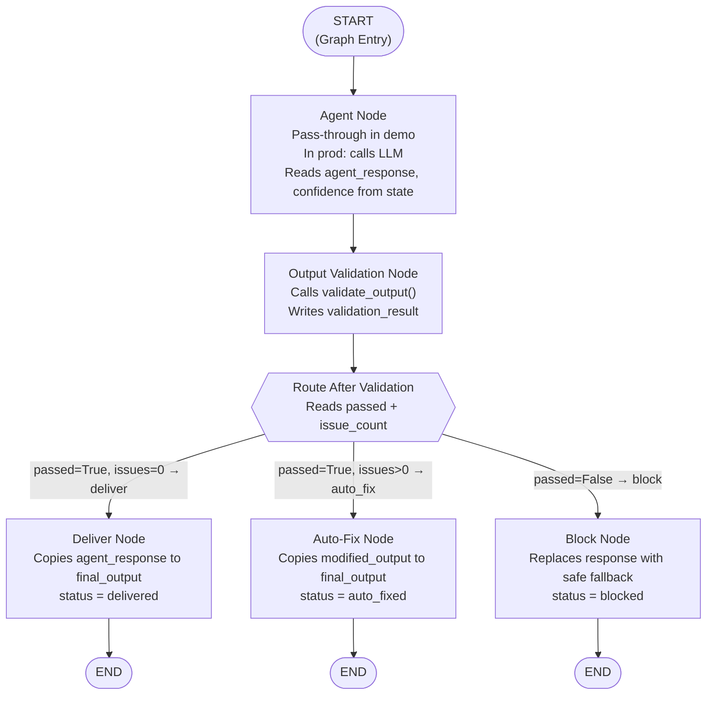
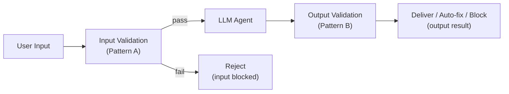

# Chapter 2 — Pattern B: Output Validation

> **Prerequisite:** Read [Chapter 1 — Input Validation](./01_input_validation.md) first. This chapter builds directly on the binary conditional routing pattern introduced there.

---

## 1. What Is This Pattern?

Think of an airport's baggage X-ray machine on the *departures* side. You have already been through check-in (input validation). Now, before your bag is loaded onto the plane, a security officer scans it one more time. Most bags go straight through. Occasionally, the officer finds something minor — a small amount of liquid that is borderline — and asks you to move it to a different compartment (auto-fix). Rarely, the officer finds something that absolutely cannot board (block). The passenger does not know the officer's internal criteria; they just see: "your bag is fine," "please adjust this," or "this bag cannot board."

**Output validation in a LangGraph graph is that departures security scan.** After the LLM agent generates a response, a validation node intercepts it before it reaches the user. The validator makes a three-way decision:

- **Deliver** — The response is clean. Send it as-is.
- **Auto-fix** — The response is correct in substance but has a minor issue (e.g., it is missing a required medical disclaimer). Apply a programmatic fix and deliver the corrected version.
- **Block** — The response contains prohibited content or is dangerously uncertain. Replace it with a safe fallback message.

The problem this pattern solves is the **false binary**: if you only have "pass" and "fail" outcomes, you are forced to either deliver an unsafe response or throw away a response that was mostly correct but needed a small fix. The auto-fix path eliminates that false choice.

---

## 2. When Should You Use It?

**Use this pattern when:**

- Your LLM agent might produce responses containing prohibited content (instructions to stop medication, absolute treatment guarantees, content that violates medical/legal policy).
- Your domain requires mandatory disclaimers in every response (e.g., "Consult a qualified healthcare provider"), and you want the system to automatically append them when missing rather than blocking the entire response.
- Your LLM reports a confidence score, and dangerously low confidence (e.g., below 0.30) should be treated as a blocking condition even if the content looks fine on the surface.
- You need to distinguish between "wrong" (block) and "almost right but needs a small fix" (auto-fix) to avoid discarding valuable clinical information unnecessarily.

**Do NOT use this pattern when:**

- The problem you want to solve is checking the *input* before the LLM runs — for that, use [Pattern A (Input Validation)](./01_input_validation.md).
- You need *semantic* evaluation of the response (e.g., "Is this recommendation clinically appropriate for this specific patient's history?") — keyword/regex checks cannot do that. Use [Pattern E (LLM-as-Judge)](./05_llm_as_judge.md) for semantic evaluation.

---

## 3. How It Works — Architecture Walkthrough

### ASCII Graph (from the script's docstring)

```
[START]
   |
   v
[agent]                 <-- response is pre-set in state (demo)
   |
   v
[output_validation]     <-- calls validate_output()
   |
route_after_validation()
   |
+--+------------------+------------------+
|                     |                  |
| "deliver"           | "auto_fix"       | "block"
v                     v                  v
[deliver]           [auto_fix]         [block]
|                     |                  |
v                     v                  v
[END]               [END]              [END]

DECISION TABLE:
    passed=False            -> "block"  (CRITICAL or HIGH severity)
    passed=True, issues > 0 -> "auto_fix" (LOW severity only)
    passed=True, issues = 0 -> "deliver" (all clean)
```

### Step-by-Step Explanation

**Edge: START → agent**
The graph starts at the `agent` node, which in this demo acts as a pass-through — the response is already in state. In a real pipeline, the LLM call happens here.

**Node: `agent`**
In this script, `agent_node` returns an empty dict (`{}`), because `agent_response` and `confidence` are pre-populated in the initial state. This design choice is deliberate: the script focuses on the output validation *pattern*, not on how to call an LLM. In production, this node would call `llm.invoke()` and write both the response text and the confidence score to state.

**Edge: agent → output_validation**
This is a fixed (unconditional) edge. The agent always flows to output validation — there is no shortcut to delivery without checking.

**Node: `output_validation`**
Calls `validate_output()` (from `guardrails/output_guardrails.py`) with the response text and confidence score. Writes the full result dict to `state["validation_result"]`. This result includes a `passed` boolean, an `issues` list (each issue has a `type`, `severity`, and `detail`), an `issue_count`, and a `modified_output` string (the auto-fixed version, if applicable).

**Conditional edge router: `route_after_validation()`**
Implements the three-way decision table. Reads `state["validation_result"]["passed"]` and `state["validation_result"]["issue_count"]`. Returns one of three strings: `"deliver"`, `"auto_fix"`, or `"block"`.

**Node: `deliver`**
The clean path. Copies `state["agent_response"]` to `state["final_output"]` unchanged. Sets `status: "delivered"`.

**Node: `auto_fix`**
The repair path. Reads `state["validation_result"]["modified_output"]` (the pre-computed fixed version) and writes it to `state["final_output"]`. Sets `status: "auto_fixed"`. The fix was computed inside `validate_output()` — this node simply promotes the pre-computed fix into the final output field.

**Node: `block`**
The rejection path. Reads the first issue's `detail` field to build a user-safe explanation, then replaces the original response entirely with a safe fallback message. Sets `status: "blocked"`.

**Edges: deliver / auto_fix / block → END**
All three terminal nodes connect to `END`. The graph always terminates cleanly regardless of which path was taken.

### Mermaid Flowchart



---

## 4. State Schema Deep Dive

```python
class OutputValidationState(TypedDict):
    agent_response: str           # Pre-set in initial state (demo)
    confidence: float             # Agent's self-assessed confidence
    validation_result: dict       # Written by: output_validation_node
    final_output: str             # Written by: deliver/auto_fix/block
    status: str                   # Written by: deliver/auto_fix/block
```

**Field: `agent_response: str`**
- **Who writes it:** Set at invocation time (in the demo). In production, written by `agent_node` from `llm.invoke()`.
- **Who reads it:** `output_validation_node` (passes it to `validate_output()`), `deliver_node` (copies it to `final_output`), `auto_fix_node` (uses it as fallback if `modified_output` is absent).
- **Why it exists as a separate field:** Keeping the raw LLM output separate from the final delivered output (`final_output`) makes it possible to track what the model actually said vs. what the user received. This is essential for audit trails.

**Field: `confidence: float`**
- **Who writes it:** Set at invocation time (in the demo). In production, extracted from the LLM response (see Pattern C).
- **Who reads it:** `output_validation_node` passes it to `validate_output()`. `validate_output()` treats confidence below a threshold as a HIGH-severity issue that sets `passed=False`.
- **Why it exists as a separate field:** Confidence is orthogonal to content. A response can be clean content-wise but dangerously uncertain. Keeping confidence separate allows the output validator to reason about it independently.

**Field: `validation_result: dict`**
- **Who writes it:** `output_validation_node`.
- **Who reads it:** `route_after_validation()` (reads `passed` and `issue_count`) and `auto_fix_node` (reads `modified_output`) and `block_node` (reads `issues[0]["detail"]`).
- **Structure returned by `validate_output()`:**
  ```python
  {
      "passed": bool,                # False if ANY issue is CRITICAL or HIGH severity
      "issues": [                    # List of all issues found
          {"type": str, "severity": "LOW"|"HIGH"|"CRITICAL", "detail": str}
      ],
      "issue_count": int,            # Number of issues (may be > 0 even when passed=True for LOW-only)
      "modified_output": str,        # Auto-fixed version (populated when issues are LOW only)
  }
  ```

**Field: `final_output: str`**
- **Who writes it:** One of `deliver_node`, `auto_fix_node`, or `block_node` — whichever is the terminal node for this execution.
- **Who reads it:** The caller of `graph.invoke()`.
- **Why it exists as a separate field:** Using a separate `final_output` field (instead of overwriting `agent_response`) preserves the original LLM response in state for audit purposes, while giving the caller a clean "what to show the user" field to read.

**Field: `status: str`**
- **Who writes it:** `deliver_node` → `"delivered"`, `auto_fix_node` → `"auto_fixed"`, `block_node` → `"blocked"`.
- **Who reads it:** The caller of `graph.invoke()` uses it to programmatically identify the outcome.
- **Why it exists as a separate field:** The caller should not have to parse the text of `final_output` to decide how to handle the result. A structured status code enables clean branching in the calling code.

---

## 5. Node-by-Node Code Walkthrough

### `agent_node`

```python
def agent_node(state: OutputValidationState) -> dict:
    # Returns empty dict — agent_response and confidence are already in state
    # In a real pipeline: call llm.invoke() here, parse confidence from response
    return {}  # agent_response and confidence already in state
```

**Line-by-line explanation:**
- `return {}` — Returns an empty partial update, meaning this node changes nothing. In the demo, the initial state already has `agent_response` and `confidence` set. This node exists in the graph to show where the LLM call *would* be in a real pipeline.
- **What breaks if you remove it:** The graph has no `agent` node for the `START → agent` edge to connect to. LangGraph raises a `ValueError` at compile time.

> **TIP:** In production, replace the body with:
> ```python
> response = llm.invoke([SystemMessage(...), HumanMessage(content=state["user_input"])])
> confidence = extract_confidence(response.content)  # See Pattern C
> return {"agent_response": response.content, "confidence": confidence}
> ```

---

### `output_validation_node`

```python
def output_validation_node(state: OutputValidationState) -> dict:
    # Call validate_output() from guardrails/output_guardrails.py
    # It receives both the text and the confidence score
    result = validate_output(
        state["agent_response"],          # The LLM's response text to validate
        confidence=state.get("confidence"),  # Optional confidence score; None if not provided
    )
    # Store the full result — router and terminal nodes will read from it
    return {"validation_result": result}
```

**Line-by-line explanation:**
- `state["agent_response"]` — The raw LLM response text. `validate_output()` checks this for prohibited content phrases (e.g., "stop all medications immediately", "guaranteed to cure") and missing disclaimers (e.g., absence of "consult your healthcare provider" or similar phrases).
- `state.get("confidence")` — Uses `.get()` so that `None` is passed if `confidence` is absent from state. `validate_output()` treats `None` confidence as neutral (no confidence-based blocking).
- `return {"validation_result": result}` — Partial state update. Only `validation_result` changes.

**What breaks if you remove this node:** There is nothing to validate. Every response reaches the terminal nodes without any checks. The graph effectively becomes a straight-through pipeline with no safety properties.

> **TIP:** Extend this node in production to also write `validation_latency_ms` to state (use `time.perf_counter()` around the `validate_output()` call). This feeds a monitoring dashboard that tracks how long the guardrail layer takes per request.

---

### `route_after_validation`

```python
def route_after_validation(
    state: OutputValidationState,
) -> Literal["deliver", "auto_fix", "block"]:
    result = state["validation_result"]   # Read the validation result written by output_validation_node

    if not result["passed"]:
        return "block"    # CRITICAL or HIGH severity — response must not reach the user

    if result.get("issue_count", 0) > 0:
        return "auto_fix" # Only LOW severity issues — correct automatically

    return "deliver"      # All checks clean — deliver unchanged
```

**Line-by-line explanation:**
- `if not result["passed"]` — The `passed` flag is `False` when *any* issue has `severity` of `"CRITICAL"` or `"HIGH"`. This covers: prohibited content phrases, dangerously low confidence (below the minimum threshold set inside `validate_output()`).
- `result.get("issue_count", 0) > 0` — If `passed` is `True` but `issue_count > 0`, there are issues of `"LOW"` severity only. These are safe to auto-correct (e.g., a missing disclaimer can be appended).
- Final `return "deliver"` — Reached only when `passed=True` AND `issue_count=0`. The response is clean in every dimension.

**What breaks if you remove this function:** You cannot wire three-way conditional routing. Without a router, LangGraph cannot decide which of the three terminal nodes to visit.

> **WARNING:** The order of the `if` checks matters. Checking `not result["passed"]` first ensures that a response with CRITICAL issues is blocked even if `issue_count` is somehow 0 (which should not happen but could occur due to an inconsistent `validate_output()` implementation). Always check the blocking condition first.

---

### `deliver_node`

```python
def deliver_node(state: OutputValidationState) -> dict:
    return {
        "final_output": state["agent_response"],  # Deliver the original response unchanged
        "status": "delivered",                     # Record the outcome
    }
```

**Line-by-line explanation:**
- `state["agent_response"]` → `final_output` — Direct copy. The original response passes through unmodified.
- `"status": "delivered"` — The caller can read this to confirm a clean delivery.

---

### `auto_fix_node`

```python
def auto_fix_node(state: OutputValidationState) -> dict:
    # validate_output() already computed the fixed version — retrieve it
    modified = state["validation_result"].get(
        "modified_output",       # The auto-fixed response (e.g., disclaimer appended)
        state["agent_response"]  # Fallback: use original if no fix was computed
    )
    return {
        "final_output": modified,    # Deliver the corrected version
        "status": "auto_fixed",      # Record the outcome
    }
```

**Line-by-line explanation:**
- `state["validation_result"].get("modified_output", state["agent_response"])` — Reads the pre-computed fix from the validation result. `validate_output()` populates `modified_output` when it detects a LOW-severity fixable issue (e.g., it appends `"\n\nPlease consult a qualified healthcare provider for personalised advice."` to the response text). The fallback to `state["agent_response"]` is defensive coding.
- `"status": "auto_fixed"` — The caller can read this to know that the delivered content differs from the original LLM output and inspect the difference for auditing.

> **NOTE:** The auto-fix is computed *inside `validate_output()`*, not inside this node. `auto_fix_node`'s only job is to promote `modified_output` into the `final_output` field. This keeps the fix logic in the root module (`guardrails/output_guardrails.py`) and the graph wiring in this script.

---

### `block_node`

```python
def block_node(state: OutputValidationState) -> dict:
    issues = state["validation_result"].get("issues", [])         # Get the list of issues found
    detail = issues[0]["detail"] if issues else "Content policy violation detected."  # First issue detail
    safe_message = (
        "This response was blocked by output validation.\n"    # Tell the user something was blocked
        f"Reason: {detail}\n"                                  # Give the specific reason
        "Please consult a qualified healthcare provider directly."  # Required medical redirect
    )
    return {
        "final_output": safe_message,  # Replace the unsafe response entirely
        "status": "blocked",           # Record the outcome
    }
```

**Line-by-line explanation:**
- `issues = state["validation_result"].get("issues", [])` — Retrieves the list of issues. `.get()` with a default `[]` prevents a `KeyError` if the issues key is absent.
- `detail = issues[0]["detail"] if issues else "..."` — Uses the first issue's `detail` string as the user-facing reason. "First issue" is reasonable because `validate_output()` orders issues by severity (CRITICAL first).
- `safe_message` — A three-part message: acknowledges the block, states the specific reason, and redirects to a qualified human. The original LLM response is **not** included — it is entirely replaced.
- `"status": "blocked"` — Signals to the caller that the response was not delivered.

**What breaks if you remove this node:** Responses with CRITICAL/HIGH severity issues have no terminal node. LangGraph raises an error at runtime when the router returns `"block"` but the node does not exist.

> **TIP:** In production, `block_node` should also: (a) write the original `agent_response` to an audit log (not to the user, but for internal review), (b) send a security alert if the issue type is `"prohibited_medical_advice"`, and (c) tag the event for analyst review. These additions do not require changing the router or any other node.

---

### `validate_output()` — Root Module Note

`validate_output()` is defined in `guardrails/output_guardrails.py`. This script imports it as:

```python
from guardrails.output_guardrails import validate_output
```

**Contract:**
- **Input:** `text: str` (the LLM response), `confidence: float | None` (optional confidence score).
- **Output:** `dict` with keys: `passed: bool`, `issues: list[dict]`, `issue_count: int`, `modified_output: str`.
- **Checks it runs:** `check_prohibited_content()` (matches phrases like "stop all medications", "guaranteed to cure", "do not need medical attention" — these fire as CRITICAL), `check_safety_disclaimers()` (checks whether a medical disclaimer phrase is present — absence fires as LOW), and confidence threshold check (confidence below the minimum threshold fires as HIGH, setting `passed=False`).
- **How `modified_output` is computed:** When only LOW-severity issues are found, `validate_output()` calls `add_safety_disclaimer()` (defined in the same root module), which appends the required disclaimer text to the response and returns the result as `modified_output`.

---

## 6. Conditional Routing Explained

### `add_conditional_edges()` Call

```python
workflow.add_conditional_edges(
    "output_validation",      # Source node — route after this node completes
    route_after_validation,   # Router function — called with current state
    {"deliver": "deliver", "auto_fix": "auto_fix", "block": "block"},  # Key → node mapping
)
```

This call tells LangGraph: after `output_validation_node` runs, call `route_after_validation(state)`. Use the returned string as a key in the mapping dict to find the next node name.

### Decision Table

| `passed` | `issue_count` | Severity of Issues | Router Returns | Next Node | Final `status` |
|----------|--------------|-------------------|----------------|-----------|----------------|
| `False` | Any | CRITICAL or HIGH | `"block"` | `block` node | `"blocked"` |
| `True` | `> 0` | LOW only | `"auto_fix"` | `auto_fix` node | `"auto_fixed"` |
| `True` | `0` | None | `"deliver"` | `deliver` node | `"delivered"` |

---

## 7. Worked Example — Trace: "AUTO_FIX: Correct but missing disclaimer"

**Test input from `TEST_OUTPUTS`:**
```python
{
    "label": "AUTO_FIX: Correct but missing disclaimer",
    "text": (
        "The patient should start on Tiotropium 18mcg inhaler for COPD "
        "maintenance therapy. Monitor FEV1 quarterly."
    ),
    "confidence": 0.75,
}
```

**Initial state passed to `graph.invoke()`:**
```python
{
    "agent_response": "The patient should start on Tiotropium 18mcg inhaler for COPD maintenance therapy. Monitor FEV1 quarterly.",
    "confidence": 0.75,
    "validation_result": {},  # empty — not yet populated
    "final_output": "",       # empty — not yet populated
    "status": "pending",
}
```

---

**Step 1 — `agent_node` executes:**

Returns `{}`. State is unchanged.

---

**Step 2 — `output_validation_node` executes:**

`validate_output()` scans the response:
- No prohibited phrases found (no "stop all medications", no "guaranteed to cure").
- Confidence `0.75` is above the minimum threshold (e.g., `0.30`) → no confidence block.
- Disclaimer check: the text does NOT contain "consult your healthcare provider" or similar → LOW severity issue.

State AFTER `output_validation_node`:
```python
{
    "agent_response": "The patient should start on Tiotropium...",   # unchanged
    "confidence": 0.75,                                              # unchanged
    "validation_result": {
        "passed": True,         # No CRITICAL/HIGH issues → passed
        "issues": [
            {
                "type": "missing_disclaimer",
                "severity": "LOW",
                "detail": "Response is missing a required safety disclaimer.",
            }
        ],
        "issue_count": 1,       # One issue found
        "modified_output": (    # Pre-computed fix: disclaimer appended
            "The patient should start on Tiotropium 18mcg inhaler for COPD "
            "maintenance therapy. Monitor FEV1 quarterly.\n\n"
            "Please consult a qualified healthcare provider for personalised advice."
        ),
    },
    "final_output": "",    # still empty
    "status": "pending",   # still pending
}
```

---

**Step 3 — `route_after_validation()` is called:**

```python
result["passed"]             # → True
result.get("issue_count", 0) # → 1 (> 0)
# Returns "auto_fix"
```

Execution jumps to `auto_fix_node`.

---

**Step 4 — `auto_fix_node` executes:**

```python
modified = state["validation_result"].get("modified_output", state["agent_response"])
# → "The patient should start on Tiotropium 18mcg inhaler for COPD maintenance therapy. Monitor FEV1 quarterly.\n\nPlease consult a qualified healthcare provider for personalised advice."
```

State AFTER `auto_fix_node`:
```python
{
    "agent_response": "The patient should start on Tiotropium...",   # unchanged — original preserved
    "confidence": 0.75,                                              # unchanged
    "validation_result": { ... },                                    # unchanged
    "final_output": "The patient should start on Tiotropium 18mcg inhaler for COPD maintenance therapy. Monitor FEV1 quarterly.\n\nPlease consult a qualified healthcare provider for personalised advice.",
    "status": "auto_fixed",  # written by auto_fix_node
}
```

---

**Step 5 — Graph reaches `END`:**

`graph.invoke()` returns the final state. The caller reads:
```python
result["status"]       # → "auto_fixed"
result["final_output"] # → "...Tiotropium... Monitor FEV1 quarterly.\n\nPlease consult..."
```

The original LLM response is in `result["agent_response"]` for auditing. The user sees the version with the appended disclaimer.

---

## 8. Key Concepts Introduced

- **Three-way conditional routing** — Extending binary (pass/fail) to three outcomes (`deliver` / `auto_fix` / `block`) using the same `add_conditional_edges()` mechanism but a more complex router function. Appears in `route_after_validation()` and `add_conditional_edges("output_validation", ...)`.

- **Auto-fix pattern** — Instead of discarding a response with minor issues, the system applies a programmatic correction (appending a disclaimer) and delivers the corrected version. The fix is computed inside `validate_output()` and promoted to `final_output` by `auto_fix_node`. Appears in `auto_fix_node` and the `modified_output` field of `validation_result`.

- **Severity-based routing** — Not all issues are equal. `passed=False` means CRITICAL/HIGH severity; `passed=True` with `issue_count > 0` means LOW severity. The router implements a priority ordering (block > auto_fix > deliver) based on severity. Appears in `route_after_validation()`.

- **`final_output` vs `agent_response` separation** — Keeping the raw LLM output (`agent_response`) separate from what the user actually receives (`final_output`) enables audit trails where you can see both what the model said and what was delivered. Appears in `OutputValidationState`.

---

## 9. Common Mistakes and How to Avoid Them

### Mistake 1: Treating `passed=True` as "no issues"

**What goes wrong:** You check only `result["passed"]` and route directly to `deliver` if it is `True`. Responses with LOW-severity issues (missing disclaimers) bypass auto-fix.

**Why it goes wrong:** `passed=True` means no CRITICAL or HIGH severity issues. It does not mean zero issues. LOW-severity issues are still present and need correction.

**Fix:** Check both `passed` and `issue_count` as shown in `route_after_validation()`.

---

### Mistake 2: Overwriting `agent_response` with the auto-fixed version

**What goes wrong:** In `auto_fix_node`, you write the fixed version to `agent_response` instead of `final_output`. The original LLM response is lost.

**Why it goes wrong:** If you overwrite `agent_response`, your audit log loses the original. You cannot tell the difference between "what the model said" and "what we delivered after correction."

**Fix:** Always write the user-facing output to `final_output`. Leave `agent_response` untouched.

---

### Mistake 3: Not providing a fallback in `auto_fix_node`

**What goes wrong:** You write `state["validation_result"]["modified_output"]` without a default. If `validate_output()` did not compute a fix (e.g., a future code path), this raises a `KeyError`.

**Why it goes wrong:** `modified_output` is only populated when there is a fixable LOW-severity issue. Future changes to `validate_output()` might not always populate it.

**Fix:** Always use `.get()` with a fallback: `state["validation_result"].get("modified_output", state["agent_response"])`.

---

### Mistake 4: LangGraph state immutability — modifying `validation_result` inside a node

**What goes wrong:** Inside `auto_fix_node`, you write `state["validation_result"]["used"] = True` to mark the result as consumed.

**Why it goes wrong:** `state` is a snapshot provided by LangGraph. Mutating it in-place has undefined behaviour in LangGraph's checkpointing mode. The mutation may not persist to the next node's state view.

**Fix:** Return a new key instead: `return {"final_output": modified, "status": "auto_fixed", "fix_applied": True}`. Add `fix_applied: bool` to the TypedDict if you need it.

---

### Mistake 5: Forgetting to connect all three terminal nodes to `END`

**What goes wrong:** You wire `deliver → END` and `block → END` but forget `auto_fix → END`.

**Why it goes wrong:** LangGraph compiles the graph silently but at runtime, when `route_after_validation()` returns `"auto_fix"`, the graph enters `auto_fix_node` and then has no outgoing edge. LangGraph raises a `GraphInterrupt` or similar error.

**Fix:** Every non-routing terminal node must have an edge to `END`. Check all three: `workflow.add_edge("deliver", END)`, `workflow.add_edge("auto_fix", END)`, `workflow.add_edge("block", END)`.

---

## 10. How This Pattern Connects to the Others

### Position in the Learning Sequence

Pattern B is the second step. It extends binary routing (Pattern A) to three-way routing and introduces the auto-fix concept. After this chapter, you understand: (a) how to guard outputs, (b) how severity levels drive routing decisions, and (c) why you separate `agent_response` from `final_output`.

### What the Previous Pattern Does NOT Handle

Pattern A (Input Validation) guards the *input* — it never sees the LLM's output at all. It provides zero protection against:
- An LLM that generates dangerous content despite receiving a valid input.
- An LLM that forgets to include a required disclaimer.
- An LLM that outputs something correct but uncertain.

Pattern B fills exactly this gap.

### What the Next Pattern Adds

[Pattern C (Confidence Gating)](./03_confidence_gating.md) focuses on one specific dimension of output quality: the LLM's *self-assessed certainty*. While Pattern B can check a confidence value if it is already in state, Pattern C shows how to: (a) make a real LLM call that includes a confidence score in the response, (b) parse that score using `extract_confidence()`, and (c) use the score as the *primary* routing signal — not a secondary check inside `validate_output()`. It also introduces the LangGraph `add_messages` reducer, needed for accumulating multi-turn conversation history.

### Combined Topology

Patterns A and B can be stacked into the layered pipeline of [Pattern D (Layered Validation)](./04_layered_validation.md):



---

## 11. Quick-Reference Summary

| Aspect | Detail |
|--------|--------|
| **Pattern name** | Output Validation |
| **Script file** | `scripts/guardrails/output_validation.py` |
| **Graph nodes** | `agent`, `output_validation`, `deliver`, `auto_fix`, `block` |
| **Router function** | `route_after_validation()` |
| **Routing type** | Three-way conditional (3 outcomes: `deliver` / `auto_fix` / `block`) |
| **State fields** | `agent_response`, `confidence`, `validation_result`, `final_output`, `status` |
| **Root module** | `guardrails/output_guardrails.py` → `validate_output()` |
| **New LangGraph concepts** | Three-way conditional routing, severity-based decision table, auto-fix pattern |
| **Prerequisite** | [Chapter 1 — Input Validation](./01_input_validation.md) |
| **Next pattern** | [Chapter 3 — Confidence Gating](./03_confidence_gating.md) |

---

*Continue to [Chapter 3 — Confidence Gating](./03_confidence_gating.md).*
