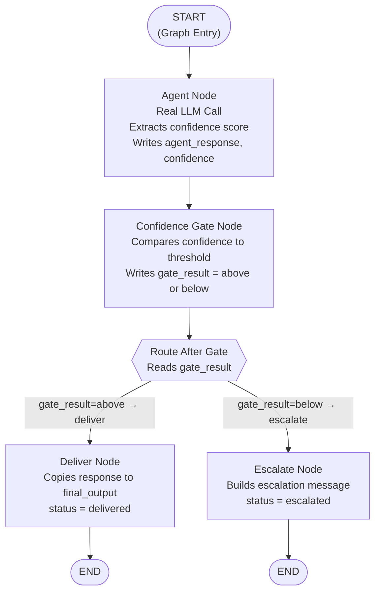
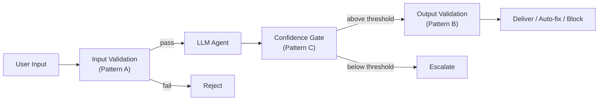

# Chapter 3 — Pattern C: Confidence Gating

> **Prerequisite:** Read [Chapter 2 — Output Validation](./02_output_validation.md) first. This chapter introduces real LLM calls, the `add_messages` reducer, and threshold-based routing — all of which build on the conditional routing patterns from Chapters 1 and 2.

---

## 1. What Is This Pattern?

Think of a junior doctor working a night shift. They examine a patient and form a diagnosis. If they are confident — the presentation is textbook, the tests confirm their suspicion — they write the prescription and move on. But if they are not sure — the symptoms are ambiguous, the patient's history is complex, the test results are borderline — they do not guess. They pick up the phone and call the senior consultant on call. The senior does not take every call; only the cases where the junior doctor is genuinely uncertain.

**Confidence gating in a LangGraph graph is exactly that protocol.** After the LLM agent generates a response, it also outputs a self-assessed confidence score (e.g., `Confidence: 0.72`). The confidence gate node compares that score to a configurable threshold. If the confidence is at or above the threshold, the response is delivered. If it falls below, the response is escalated for human review instead of being delivered directly.

The problem this pattern solves is distinct from output validation (Pattern B). Pattern B checks *what the model said* (content quality). Pattern C checks *how sure the model was* (epistemic certainty). A response can be perfectly written, contain no prohibited phrases, and include all required disclaimers — and still be dangerously uncertain because the LLM was extrapolating from thin data. Both dimensions matter independently.

---

## 2. When Should You Use It?

**Use this pattern when:**

- You operate in a high-stakes domain (medical, legal, financial) where an uncertain answer that looks confident is more dangerous than an explicit escalation to a human expert.
- Different request categories have different certainty requirements: emergency triage needs very high confidence before delivering, while research exploration can tolerate lower certainty.
- You want to build an escalation queue where humans review borderline cases, rather than automatically blocking or delivering them.
- Your LLM is capable of including a self-assessment of its own uncertainty — which is true for most modern instruction-tuned models when explicitly prompted to do so.

**Do NOT use this pattern when:**

- Your LLM consistently ignores the instruction to include a confidence score, or always reports the same value regardless of actual uncertainty. In that case, the score is noise, not signal.
- You need to check the *content* of the response (prohibited phrases, missing disclaimers) — that is Pattern B's job. Confidence gating does not inspect what the model said; it only inspects how certain it was.
- The domain allows uncertainty (e.g., creative writing, brainstorming) — escalating every uncertain response would produce an unusable system.

---

## 3. How It Works — Architecture Walkthrough

### ASCII Graph (from the script's docstring)

```
[START]
   |
   v
[agent]                <-- real LLM call, extracts confidence
   |
   v
[confidence_gate]      <-- compares confidence to threshold
   |
route_after_gate()
   |
+--+---------+
|             |
| "deliver"   | "escalate"
v             v
[deliver]   [escalate]
|             |
v             v
[END]        [END]
```

### Step-by-Step Explanation

**Edge: START → agent**
The graph enters the `agent` node first. Unlike the demo in Pattern B, this makes a real LLM call.

**Node: `agent`**
This node calls the LLM with a system prompt that explicitly instructs it to append `Confidence: X.XX` at the end of its response. After receiving the LLM's response, the node calls `extract_confidence()` (from `guardrails/confidence_guardrails.py`) to parse the numeric value from the text. It writes both the full response text and the parsed confidence float to state.

**Edge: agent → confidence_gate**
Fixed edge. After the LLM responds, the confidence gate always runs.

**Node: `confidence_gate`**
This node does a single comparison: `confidence >= threshold`. It writes the result as the string `"above"` or `"below"` to `state["gate_result"]`. Note that this node does NOT route — it writes a result. The router reads that result.

**Conditional edge router: `route_after_gate()`**
Reads `state["gate_result"]`. Returns `"deliver"` or `"escalate"`.

**Node: `deliver`**
Copies `state["agent_response"]` to `state["final_output"]`. Sets `status: "delivered"`.

**Node: `escalate`**
Builds an escalation message that includes the confidence score, the threshold, and the original LLM response (for the human reviewer to inspect). Sets `status: "escalated"`. In production, this node would create a review ticket or call a notification service.

**Edges: deliver / escalate → END**
Both terminal nodes connect to `END`.

### Mermaid Flowchart



---

## 4. State Schema Deep Dive

```python
class ConfidenceGateState(TypedDict):
    messages: Annotated[list, add_messages]  # Accumulates LLM messages across nodes
    patient_case: dict    # Set at invocation time
    agent_response: str   # Written by: agent_node
    confidence: float     # Written by: agent_node (extracted from LLM response)
    threshold: float      # Set at invocation time (configurable per deployment context)
    gate_result: str      # Written by: confidence_gate_node ("above" | "below")
    final_output: str     # Written by: deliver_node or escalate_node
    status: str           # Written by: deliver_node or escalate_node
```

### The `Annotated[list, add_messages]` Field — Explained from Scratch

This is the most conceptually new part of this chapter. Let's unpack it completely.

**What problem does it solve?**

When you have a multi-turn conversation — or when multiple nodes each call the LLM — you need to accumulate a list of messages. If you used a plain `list` field, each node that writes to it would *replace* the entire list with whatever it returns. This is how LangGraph state updates work by default: a partial update dict like `{"messages": [new_message]}` would overwrite the entire `messages` list.

You want *accumulation* (append to the list), not *replacement* (overwrite the list).

**What `Annotated[list, add_messages]` means:**

```python
from typing import Annotated
from langgraph.graph.message import add_messages

messages: Annotated[list, add_messages]
#                   ^^^^  ^^^^^^^^^^^^
#                   |     |
#                   |     The "reducer" — a function LangGraph calls
#                   |     to merge a new value into the existing value
#                   The base type (plain Python list)
```

`Annotated` is a Python standard library construct (`from typing import Annotated`) that lets you attach metadata to a type hint. Here, the metadata is `add_messages` — a LangGraph-provided reducer function.

A **reducer** is a function with the signature `(existing_value, new_value) -> merged_value`. When a node returns `{"messages": [new_message]}`, LangGraph does not replace the entire `messages` list. Instead, it calls `add_messages(existing_messages, [new_message])` and uses the result as the new value. `add_messages` appends the new messages to the existing list (with deduplication logic for message IDs).

**In plain terms:** `Annotated[list, add_messages]` tells LangGraph "this is a list of messages that should be accumulated, not replaced."

**Where it appears in this script:**

```python
# In agent_node:
return {
    "messages": [response],   # LangGraph calls add_messages(existing_messages, [response])
    # ...                     # Result: existing_messages + [response]
}
```

The `messages` field accumulates every LLM response object. This is useful for conversation history and for observability — you can inspect the full dialogue by reading `state["messages"]`.

> **NOTE:** If you use a plain `list` type annotation (without `Annotated[list, add_messages]`), then `return {"messages": [response]}` will *replace* any existing messages with just `[response]`. This is almost never what you want in a multi-turn or multi-node LLM pipeline. Use `Annotated[list, add_messages]` for any field that accumulates LLM messages.

**Field: `patient_case: dict`**
- **Who writes it:** Set at invocation time.
- **Who reads it:** `agent_node` (to build the prompt for the LLM).
- **Why it exists as a separate field:** The patient case data is a structured input that feeds into the LLM prompt. Keeping it in state means it is available for any future node that might need to log, validate, or display the case.

**Field: `threshold: float`**
- **Who writes it:** Set at invocation time.
- **Who reads it:** `confidence_gate_node`.
- **Why it exists as a separate field:** The threshold is configurable per deployment context. By putting it in state (rather than hardcoding it in the node), the same graph can serve multiple use cases: a research interface might use threshold=0.30, while emergency triage uses threshold=0.80. The caller sets it at `graph.invoke()` time.

**Field: `gate_result: str`**
- **Who writes it:** `confidence_gate_node` (writes `"above"` or `"below"`).
- **Who reads it:** `route_after_gate()` (the router function).
- **Why it exists as a separate field:** Separating the *comparison result* from the *routing decision* maintains the separation-of-concerns principle. `confidence_gate_node` does the math; `route_after_gate()` does the routing. If you later want to log `gate_result` or display it in a UI, it is already in state.

---

## 5. Node-by-Node Code Walkthrough

### `agent_node`

```python
def agent_node(state: ConfidenceGateState) -> dict:
    llm = get_llm()                   # Get the configured LLM from core.config
    patient = state["patient_case"]   # Read the structured patient data from state

    # System prompt instructs the LLM to self-report confidence
    system = SystemMessage(content=(
        "You are a clinical triage specialist. Assess the patient below. "
        "At the end of your response, include a line:\n"
        "Confidence: X.XX\n"       # The LLM is told exactly how to format the score
        "where X.XX is your confidence in this assessment (0.00 to 1.00).\n"
        "Use lower confidence when information is ambiguous or incomplete."
    ))

    # Build the clinical prompt from the patient case dict
    prompt = f"""Patient: {patient.get('age')}y {patient.get('sex')}
Complaint: {patient.get('chief_complaint')}
Symptoms: {', '.join(patient.get('symptoms', []))}
Medications: {', '.join(patient.get('current_medications', []))}
Labs: {json.dumps(patient.get('lab_results', {}))}
Vitals: {json.dumps(patient.get('vitals', {}))}"""

    config = build_callback_config(trace_name="confidence_gate_agent")  # Observability config
    response = llm.invoke([system, HumanMessage(content=prompt)], config=config)  # Real LLM call

    content = response.content        # Extract the text content from the LLM response object
    confidence = extract_confidence(content)  # Parse "Confidence: 0.72" from the text

    print(f"    | [Agent] Response length: {len(content)} chars")
    print(f"    | [Agent] Extracted confidence: {confidence:.2f}")

    return {
        "messages": [response],       # Accumulated via add_messages reducer
        "agent_response": content,    # The full text of the LLM's response
        "confidence": confidence,     # The parsed float (e.g., 0.72)
    }
```

**Line-by-line explanation:**
- `get_llm()` — A project utility (`from core.config import get_llm`) that returns a configured `langchain_google_genai.ChatGoogleGenerativeAI` or similar LLM client.
- `SystemMessage(content=...)` — A LangChain message type representing the system prompt. The key instruction is the `"Confidence: X.XX"` format directive — without it, the LLM may report confidence in varied formats that are harder to parse.
- `llm.invoke([system, HumanMessage(content=prompt)], config=config)` — Sends the full message list to the LLM and returns an `AIMessage` response object.
- `extract_confidence(content)` — Defined in `guardrails/confidence_guardrails.py`. Uses regex to find `"Confidence: 0.72"` or `"Confidence: 72%"` in the response text and returns the float. If no match is found, returns `0.5` (neutral default).
- `"messages": [response]` — The `add_messages` reducer appends `response` to the existing messages list rather than replacing it.

**What breaks if you remove this node:** The graph has no LLM call. `confidence` and `agent_response` remain at their initial empty/zero values. `confidence_gate_node` compares `0.0` to the threshold and always escalates.

> **TIP:** In production, also write `"response_length_chars": len(content)` and `"response_generated_at": datetime.utcnow().isoformat()` to state for monitoring. Add both to `ConfidenceGateState` as `str` fields.

---

### `confidence_gate_node`

```python
def confidence_gate_node(state: ConfidenceGateState) -> dict:
    confidence = state["confidence"]     # The float extracted by agent_node
    threshold = state["threshold"]       # The threshold set at invocation time
    result = "above" if confidence >= threshold else "below"  # Single comparison

    print(f"    | [Gate] Confidence: {confidence:.2f}, Threshold: {threshold:.2f} -> {result}")

    return {"gate_result": result}       # Write the comparison result — do NOT route here
```

**Line-by-line explanation:**
- `confidence >= threshold` — Single numeric comparison. `>=` means that a confidence exactly equal to the threshold is treated as "above" (delivered), not escalated. This is the correct behaviour: the threshold is a minimum, not a floor below it.
- `result = "above" | "below"` — A string, not a boolean, because LangGraph state is a dict and the router will do a string comparison on this value.
- `return {"gate_result": result}` — The node's only job is to write this comparison result. The routing decision is made by the router function, not here.

**What breaks if you remove this node:** The router `route_after_gate()` reads `state["gate_result"]`. If `confidence_gate_node` never runs, `gate_result` is an empty string from the initial state. The router returns `"escalate"` for any input (the `if state["gate_result"] == "above"` check fails on an empty string). Every response is escalated regardless of confidence.

> **WARNING:** Never put an `if/else return` inside `confidence_gate_node` itself to "skip the router." The node cannot control routing — only router functions passed to `add_conditional_edges()` can do that. Putting routing logic in a node produces code that appears to work but silently produces the wrong graph topology.

---

### `route_after_gate`

```python
def route_after_gate(state: ConfidenceGateState) -> Literal["deliver", "escalate"]:
    if state["gate_result"] == "above":   # Confidence met or exceeded the threshold
        return "deliver"
    return "escalate"                     # Confidence fell below the threshold
```

**Line-by-line explanation:**
- Reading `gate_result` rather than re-computing `confidence >= threshold` here is intentional. The comparison was already done and stored. The router just reads the stored result. If you ever want to change the comparison logic (e.g., switch from `>=` to `>`), you change it in `confidence_gate_node` — one place only.

---

### `deliver_node`

```python
def deliver_node(state: ConfidenceGateState) -> dict:
    return {
        "final_output": state["agent_response"],  # Deliver the original response unchanged
        "status": "delivered",                     # Record success
    }
```

---

### `escalate_node`

```python
def escalate_node(state: ConfidenceGateState) -> dict:
    confidence = state["confidence"]       # Confidence that triggered escalation
    threshold = state["threshold"]         # Threshold that was not met
    escalation_msg = (
        f"ESCALATED FOR REVIEW\n"
        f"Confidence: {confidence:.0%} (threshold: {threshold:.0%})\n"  # Human-readable percentages
        f"{'=' * 40}\n"
        f"{state['agent_response']}"       # Include original response for human reviewer
    )
    return {
        "final_output": escalation_msg,    # Message for the human reviewer queue
        "status": "escalated",             # Record that this was escalated, not delivered
    }
```

**Line-by-line explanation:**
- `{confidence:.0%}` — Python format spec that converts `0.72` to `"72%"`. More readable for human reviewers than the raw float.
- `{'=' * 40}` — A separator line in the escalation message — a minor UX detail for the human reviewer reading a queue of escalated cases.
- `state['agent_response']` — The full LLM response is included in the escalation message so the human reviewer can read it directly. They see: "this response was escalated because confidence was 40%, here is what the agent said."

> **TIP:** In a production system, replace the return statement with:
> ```python
> ticket_id = create_review_ticket(
>     response=state["agent_response"],
>     confidence=state["confidence"],
>     patient_case=state["patient_case"],
> )
> return {"final_output": f"Escalated for review. Ticket ID: {ticket_id}", "status": "escalated"}
> ```
> For true human-in-the-loop (where the graph *waits* for a human to respond before continuing), see `scripts/script_04c_hitl_review.py` which uses LangGraph's `interrupt()` function.

---

### `extract_confidence()` — Root Module Note

`extract_confidence()` is defined in `guardrails/confidence_guardrails.py`. This script imports it as:

```python
from guardrails.confidence_guardrails import extract_confidence
```

**Contract:**
- **Input:** `text: str` — the full LLM response text including the `"Confidence: X.XX"` marker.
- **Output:** `float` between 0.0 and 1.0.
- **Logic:** Uses a regex that handles both decimal format (`Confidence: 0.85`) and percentage format (`Confidence: 85%`). Clamps the result to `[0.0, 1.0]`. If no match is found, returns `0.5` (the neutral default — the threshold then decides whether to deliver or escalate).
- **Side effects:** None. Pure function.

---

## 6. Conditional Routing Explained

### `add_conditional_edges()` Call

```python
workflow.add_conditional_edges(
    "confidence_gate",     # Source node — route after this node
    route_after_gate,      # Router function — reads gate_result from state
    {"deliver": "deliver", "escalate": "escalate"},  # Key → node mapping
)
```

This is identical in structure to the calls in Patterns A and B. The only difference is that the router reads `gate_result` (a string that was written by `confidence_gate_node`) rather than reading a nested dict field like `validation_result["passed"]`.

### Decision Table

| `confidence` vs `threshold` | `gate_result` Written | Router Returns | Next Node | Final `status` |
|----------------------------|-----------------------|----------------|-----------|----------------|
| `confidence >= threshold` | `"above"` | `"deliver"` | `deliver` node | `"delivered"` |
| `confidence < threshold` | `"below"` | `"escalate"` | `escalate` node | `"escalated"` |

### The Threshold Is a Deployment Parameter

The same graph, the same code, the same patient case — but a different threshold produces a different outcome. This is by design:

| Deployment Context | Typical Threshold | Rationale |
|-------------------|-------------------|-----------|
| Research / exploration | `0.30` | Uncertain answers are still useful starting points |
| General clinical triage | `0.60` | Uncertain answers need a second opinion |
| Emergency triage | `0.80` | Near-certain answers required before acting |
| Drug interaction checking | `0.90` | Almost always needs expert review |

---

## 7. Worked Example — Trace: Test 2, Ambiguous Patient, High Threshold

**Test case from `main()`:**

```python
# Patient: 45-year-old woman with intermittent dizziness, cause unclear
ambiguous_patient = PatientCase(
    patient_id="PT-CG-002",
    age=45, sex="F",
    chief_complaint="Intermittent dizziness, cause unclear",
    symptoms=["dizziness", "occasional nausea"],
    medical_history=[],      # No history — ambiguous
    current_medications=[],  # No medications — minimal data
    allergies=[],
    lab_results={},          # No lab results — ambiguous
    vitals={"BP": "120/80", "HR": "72"},
)
# Threshold set high — requires 90% confidence before delivering
graph.invoke(make_state(ambiguous_patient, threshold=0.90))
```

**Initial state passed to `graph.invoke()`:**
```python
{
    "messages": [],                  # empty accumulator
    "patient_case": {                # serialised PatientCase
        "patient_id": "PT-CG-002",
        "age": 45, "sex": "F",
        "chief_complaint": "Intermittent dizziness, cause unclear",
        "symptoms": ["dizziness", "occasional nausea"],
        "medical_history": [],
        "current_medications": [],
        "allergies": [],
        "lab_results": {},
        "vitals": {"BP": "120/80", "HR": "72"},
    },
    "agent_response": "",    # empty — not yet written
    "confidence": 0.0,       # default — not yet written
    "threshold": 0.90,       # HIGH threshold — set by caller
    "gate_result": "",       # empty — not yet written
    "final_output": "",      # empty — not yet written
    "status": "pending",
}
```

---

**Step 1 — `agent_node` executes:**

The LLM receives the patient case and the confidence instruction. Given the sparse data (no history, no labs, only two non-specific symptoms), the LLM's response includes something like:
`"The dizziness could have multiple causes including vestibular neuritis, orthostatic hypotension, or anxiety. Without further workup, it is difficult to narrow the differential. Confidence: 0.45"`

`extract_confidence("...Confidence: 0.45")` → `0.45`

State AFTER `agent_node`:
```python
{
    "messages": [AIMessage(content="The dizziness could have...")],  # accumulated
    "patient_case": { ... },       # unchanged
    "agent_response": "The dizziness could have multiple causes including vestibular neuritis, orthostatic hypotension, or anxiety. Without further workup, it is difficult to narrow the differential. Confidence: 0.45",
    "confidence": 0.45,            # written by agent_node
    "threshold": 0.90,             # unchanged
    "gate_result": "",             # not yet written
    "final_output": "",            # not yet written
    "status": "pending",
}
```

---

**Step 2 — `confidence_gate_node` executes:**

```python
confidence = 0.45
threshold = 0.90
result = "above" if 0.45 >= 0.90 else "below"   # → "below"
```

State AFTER `confidence_gate_node`:
```python
{
    "messages": [...],                # unchanged
    "patient_case": { ... },          # unchanged
    "agent_response": "The dizziness...",  # unchanged
    "confidence": 0.45,               # unchanged
    "threshold": 0.90,                # unchanged
    "gate_result": "below",           # written by confidence_gate_node
    "final_output": "",               # not yet written
    "status": "pending",
}
```

---

**Step 3 — `route_after_gate()` is called:**

```python
state["gate_result"]  # → "below"
# Returns "escalate"
```

Execution jumps to `escalate_node`.

---

**Step 4 — `escalate_node` executes:**

State AFTER `escalate_node`:
```python
{
    "messages": [...],
    "patient_case": { ... },
    "agent_response": "The dizziness...",   # preserved — the human reviewer will read this
    "confidence": 0.45,
    "threshold": 0.90,
    "gate_result": "below",
    "final_output": (
        "ESCALATED FOR REVIEW\n"
        "Confidence: 45% (threshold: 90%)\n"
        "========================================\n"
        "The dizziness could have multiple causes..."
    ),
    "status": "escalated",    # written by escalate_node
}
```

The response was escalated. No output reached the end user. A human reviewer would pick up this escalation message.

**Counter-example: same patient, threshold=0.30:**

At step 2, `confidence_gate_node` computes `"above"` (`0.45 >= 0.30`). `route_after_gate()` returns `"deliver"`. `deliver_node` runs. The same LLM response, with confidence 0.45, is delivered to the user because the threshold was set low enough. The threshold is the only difference.

---

## 8. Key Concepts Introduced

- **`Annotated[list, add_messages]`** — A LangGraph type annotation that attaches the `add_messages` reducer to the `messages` field. This tells LangGraph to *accumulate* messages across node runs rather than replacing the list. First appears at `messages: Annotated[list, add_messages]` in `ConfidenceGateState`.

- **State reducers** — LangGraph's mechanism for merging partial state updates. When a field has no reducer annotation, updates replace the field. When a field has `Annotated[T, reducer_fn]`, LangGraph calls `reducer_fn(existing_value, new_value)` to merge updates. First introduced by `add_messages` in this pattern.

- **Real LLM call in a graph node** — Using `llm.invoke()` inside `agent_node` instead of a simulated response. Introduces `SystemMessage`, `HumanMessage`, and `AIMessage` from LangChain, as well as the `config` parameter for observability. First appears in `agent_node`.

- **Configurable threshold in state** — Putting the routing threshold in state (not hardcoded in the node) makes the same compiled graph reusable across multiple deployment contexts. First appears in `ConfidenceGateState.threshold`.

- **Two-stage decision pattern** — `confidence_gate_node` writes a decision result (`"above"` / `"below"`) to state; the router reads that result. This separates the *calculation* (node) from the *routing* (router) — the same separation-of-concerns principle from Chapter 1, applied to a numeric comparison. First appears in `confidence_gate_node` + `route_after_gate`.

---

## 9. Common Mistakes and How to Avoid Them

### Mistake 1: Not using `Annotated[list, add_messages]` for the messages field

**What goes wrong:** You declare `messages: list` without the annotation. Every node that returns `{"messages": [new_msg]}` overwrites the entire list with just the new message. After `agent_node` runs, the messages list contains only the latest LLM response, losing any prior context.

**Why it goes wrong:** Without the `add_messages` reducer, LangGraph treats the update as a full replacement, not an append.

**Fix:** Always annotate message accumulator fields: `messages: Annotated[list, add_messages]`.

---

### Mistake 2: Putting the threshold comparison inside the router function (not in a node)

**What goes wrong:** You delete `confidence_gate_node` and move the `confidence >= threshold` comparison directly into `route_after_gate()`. The graph works but `gate_result` is never written to state.

**Why it goes wrong:** The comparison result is invisible in traces and unavailable for logging, monitoring, or future nodes that might need to know the gate result.

**Fix:** Keep the comparison in `confidence_gate_node` and write it to `state["gate_result"]`. Let the router just read that result.

---

### Mistake 3: Assuming `extract_confidence()` always returns a meaningful value

**What goes wrong:** You trust the confidence score without checking that it was actually extracted. The LLM ignores the confidence instruction and `extract_confidence()` returns the default `0.5`.

**Why it goes wrong:** A `0.5` default confidence will always route based on the threshold — it may always deliver (if `threshold <= 0.5`) or always escalate (if `threshold > 0.5`). Either way, you are not actually gating on confidence.

**Fix:** Add a log warning in `agent_node` when `confidence` is the default `0.5`:
```python
if confidence == 0.5:
    print("WARNING: Confidence marker not found in response — using default 0.5")
```
In production, track the rate of default-confidence responses as a monitoring metric.

---

### Mistake 4: LangGraph state immutability — modifying the messages list in-place

**What goes wrong:** Inside `agent_node`, you write `state["messages"].append(response)` instead of returning `{"messages": [response]}`.

**Why it goes wrong:** Mutating the `state["messages"]` list in-place bypasses the `add_messages` reducer entirely. In LangGraph's checkpointing mode, the state is read from a snapshot store, and in-place mutations are not persisted. The next node receives the un-mutated snapshot.

**Fix:** Always return new values, never mutate `state` in-place. Return `{"messages": [response]}` and let the reducer handle accumulation.

---

### Mistake 5: Setting `threshold=0.0` in production

**What goes wrong:** You set `threshold=0.0` thinking "no escalation needed yet." Every response passes the confidence gate regardless of the LLM's stated uncertainty, because any confidence `>= 0.0` is `True`.

**Why it goes wrong:** A threshold of `0.0` effectively disables the confidence gate. In a medical context, this means an LLM response with `Confidence: 0.05` ("I have almost no idea what is wrong") is delivered to the user without escalation.

**Fix:** Set a minimum sensible threshold based on domain risk. For medical triage, `0.60` is a reasonable starting point. Measure escalation rates and tune from there.

---

## 10. How This Pattern Connects to the Others

### Position in the Learning Sequence

Pattern C is the third step and the first to involve real LLM calls. It introduces `add_messages`, the configurable threshold concept, and the idea that routing can be based on a signal the LLM itself provides (its confidence) rather than a rule applied to the output.

### What the Previous Pattern Does NOT Handle

Pattern B (Output Validation) uses `confidence` only as *one input* to `validate_output()` — it can set `passed=False` if confidence is below a minimum. But it treats confidence as a secondary check within a broader content validation. What Pattern B cannot do is:
- Route different thresholds for different deployment contexts (same code, different behaviour).
- Accumulate multi-turn conversation history (`add_messages`).
- Give the human reviewer the full LLM response in the escalation message.

Pattern C addresses all three.

### What the Next Pattern Adds

[Pattern D (Layered Validation)](./04_layered_validation.md) stacks Pattern A (input validation) and Pattern B (output validation) into a single graph with two sequential conditional routers. It introduces four observable execution paths and shows how LLM token waste is prevented by blocking at the input layer before the agent runs. It also uses a real LLM agent with tool calling (the ReAct loop pattern).

### Combined Topology

Confidence gating can be inserted between the agent and output validation in a full layered pipeline:



---

## 11. Quick-Reference Summary

| Aspect | Detail |
|--------|--------|
| **Pattern name** | Confidence Gating |
| **Script file** | `scripts/guardrails/confidence_gating.py` |
| **Graph nodes** | `agent`, `confidence_gate`, `deliver`, `escalate` |
| **Router function** | `route_after_gate()` |
| **Routing type** | Binary threshold (2 outcomes: `deliver` / `escalate`) |
| **State fields** | `messages`, `patient_case`, `agent_response`, `confidence`, `threshold`, `gate_result`, `final_output`, `status` |
| **Root module** | `guardrails/confidence_guardrails.py` → `extract_confidence()` |
| **New LangGraph concepts** | `Annotated[list, add_messages]`, state reducers, real LLM calls in nodes, configurable threshold in state |
| **Prerequisite** | [Chapter 2 — Output Validation](./02_output_validation.md) |
| **Next pattern** | [Chapter 4 — Layered Validation](./04_layered_validation.md) |

---

*Continue to [Chapter 4 — Layered Validation](./04_layered_validation.md).*
