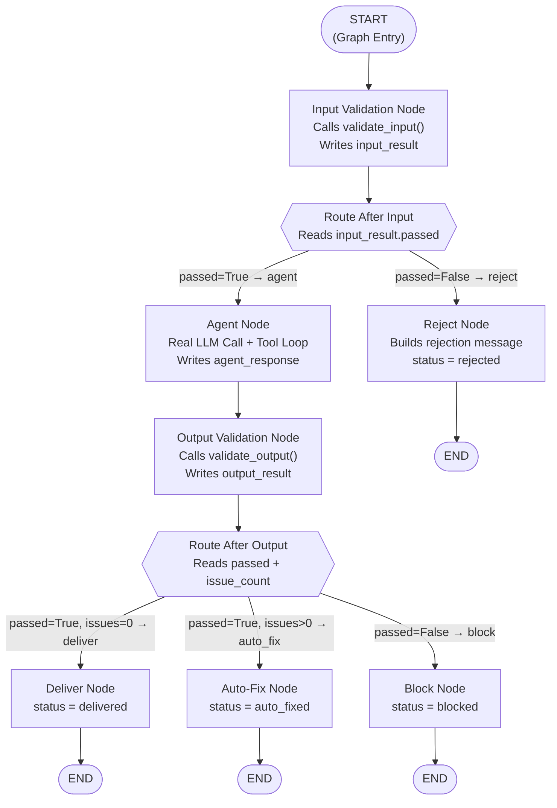
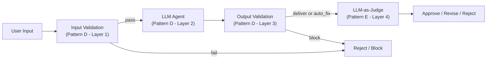

# Chapter 4 — Pattern D: Layered Validation

> **Prerequisite:** Read [Chapter 3 — Confidence Gating](./03_confidence_gating.md) first. This chapter combines everything from Patterns A, B, and C into one production-grade pipeline — it is the most complex graph in this module.

---

## 1. What Is This Pattern?

Think of how airport security works for international departures. You do not just walk from check-in to the gate — you pass through at least two independent checkpoints. The passport control officer checks your identity and travel documents *before* you enter the security zone. Then, the X-ray machine and body scanner check your bag and person *before* you board. If you are stopped at passport control, you never reach the scanner. If you pass passport control but the scanner detects something, you are stopped there. Each checkpoint is independent. Each catches a different class of problem.

**Layered validation in LangGraph is that two-checkpoint airport security model.** A single graph contains:

1. **Layer 1 — Input Validation**: Runs before the LLM call. Checks for PII, prompt injection, and scope. If the input fails, the LLM is never invoked — no tokens are spent.
2. **Layer 2 — The LLM Agent**: Runs only if Layer 1 passes. This is where the actual clinical reasoning happens, with tool calls.
3. **Layer 3 — Output Validation**: Runs after the LLM produces a response. Checks for prohibited content, missing disclaimers. Routes to deliver, auto-fix, or block.

This is the **defence-in-depth** principle: if Layer 1 misses something, Layer 3 catches it. If Layer 3 would miss something (rare, hard to formulate as a rule), Pattern E (LLM-as-Judge) can be added downstream.

The additional benefit is **token economy**: bad inputs are rejected *before* the LLM runs. In the test suite, three out of four test cases are rejected at Layer 1. Only one actually reaches the LLM. This can save significant API cost at scale.

---

## 2. When Should You Use It?

**Use this pattern when:**

- You need both input safety (PII, injections) and output safety (prohibited content, disclaimers) in the same pipeline — which is the case for virtually any production medical or legal AI agent.
- You want to minimise LLM API cost by rejecting invalid inputs before they incur token charges.
- You need a single graph that makes the full request-to-response safety pipeline visible in execution traces, so that every stage is observable and independently testable.
- You are building a production-facing system where users cannot be trusted to follow input guidelines, and the LLM cannot be trusted to always produce compliant output.

**Do NOT use this pattern when:**

- You only need one type of guardrail — if you only care about input safety, use Pattern A. Adding output validation to a pipeline where the LLM output is always safe is unnecessary complexity.
- You need semantic evaluation of the output (not just content matching) — add Pattern E (LLM-as-Judge) after the output validation layer, as described in Section 10.

---

## 3. How It Works — Architecture Walkthrough

### ASCII Graph (from the script's docstring)

```
[START]
   |
   v
[input_validation]       <-- validate_input()
   |
route_after_input()
   |
+--+---------+
|             |
| "agent"     | "reject"
v             v
[agent]      [reject] -----> [END]
   |
   v
[output_validation]      <-- validate_output()
   |
route_after_output()
   |
+--+----------+----------+
|              |          |
| "deliver"    | "fix"    | "block"
v              v          v
[deliver]   [auto_fix]  [block]
|              |          |
v              v          v
[END]        [END]      [END]
```

### Four Possible Execution Paths

| Path | Input Result | Agent Runs? | Output Result | Final `status` |
|------|-------------|-------------|---------------|----------------|
| 1 | Pass | Yes | Clean | `"delivered"` |
| 2 | Pass | Yes | Fixable (LOW) | `"auto_fixed"` |
| 3 | Pass | Yes | Unsafe (HIGH/CRITICAL) | `"blocked"` |
| 4 | Fail | No | (not reached) | `"rejected"` |

### Step-by-Step Explanation

**Edge: START → input_validation**
The first node is the input guardrail. Nothing reaches the agent without passing this checkpoint.

**Node: `input_validation`**
Calls `validate_input(state["user_input"])`. Writes the result to `state["input_result"]`. Notice the field is named `input_result` (not `validation_result`) to distinguish it from the output validation result that comes later in the same state object.

**First conditional router: `route_after_input()`**
Reads `state["input_result"]["passed"]`. Returns `"agent"` or `"reject"`.

**Node: `reject`** (Path 4 — early termination)
Runs when the input fails. Sets `status: "rejected"` and builds a rejection message. The `agent_node` never runs. The graph reaches `END` immediately, with zero LLM tokens consumed.

**Node: `agent`** (Paths 1, 2, 3)
The real LLM call with tool support. Uses a ReAct loop: the LLM can request tool calls, which are executed by LangChain's `ToolNode`, with results fed back to the LLM until it produces a final text response. More on this in Section 5.

**Edge: agent → output_validation**
Fixed edge. Every response from the agent passes through output validation — there is no shortcut to delivery without checking.

**Node: `output_validation`**
Calls `validate_output(state["agent_response"])`. Writes the result to `state["output_result"]`. No confidence parameter is passed in this version (unlike standalone Pattern B) — the output is validated on content and disclaimers only.

**Second conditional router: `route_after_output()`**
Reads `state["output_result"]["passed"]` and `state["output_result"]["issue_count"]`. Returns one of `"deliver"`, `"auto_fix"`, or `"block"`. This is the same three-way logic as Pattern B.

**Terminal nodes: `deliver`, `auto_fix`, `block`**
Identical in logic to their Pattern B counterparts. Each writes to `state["final_output"]` and sets `state["status"]`.

### Mermaid Flowchart



---

## 4. State Schema Deep Dive

```python
class LayeredState(TypedDict):
    user_input: str                # Set at invocation — raw user text
    patient_case: dict             # Set at invocation — structured patient data
    input_result: dict             # Written by: input_validation_node
    messages: Annotated[list, add_messages]  # Accumulates LLM messages
    agent_response: str            # Written by: agent_node
    output_result: dict            # Written by: output_validation_node
    final_output: str              # Written by: deliver/auto_fix/block/reject
    status: str                    # Written by: terminal nodes
```

**Field: `input_result: dict`**
- **Who writes it:** `input_validation_node`.
- **Who reads it:** `route_after_input()` (reads `["passed"]`) and `reject_node` (reads `["reason"]` and `["guardrail"]`).
- **Why named `input_result` not `validation_result`:** The state holds *two* validation results — one for input (`input_result`) and one for output (`output_result`). Using distinct names prevents one from overwriting the other and makes it clear which guardrail layer produced which result.

**Field: `output_result: dict`**
- **Who writes it:** `output_validation_node`.
- **Who reads it:** `route_after_output()` (reads `["passed"]` and `["issue_count"]`) and `auto_fix_node` (reads `["modified_output"]`) and `block_node` (reads `["issues"][0]["detail"]`).
- **Why it coexists with `input_result`:** Both are in state simultaneously after the agent runs. A future debugging node or audit node could read both to produce a complete picture of every check that ran.

**Field: `messages: Annotated[list, add_messages]`**
- Introduced in Pattern C. Works identically here: accumulates LLM messages across the agent's ReAct tool loop. Each iteration of the tool loop appends messages via the `add_messages` reducer.

**Field: `status: str`**
- Written by whichever terminal node runs last. Possible values: `"delivered"`, `"auto_fixed"`, `"blocked"`, `"rejected"`.
- The fourth value, `"rejected"`, is new to this pattern (Pattern B used `"blocked"` for all failures).

> **NOTE:** The `status` field uses `"rejected"` for input failures and `"blocked"` for output failures — even though both paths reach `END` and neither delivers the original response. This distinction lets the caller know *where* in the pipeline the failure occurred: rejected = before the LLM, blocked = after the LLM.

---

## 5. Node-by-Node Code Walkthrough

### `input_validation_node`

```python
def input_validation_node(state: LayeredState) -> dict:
    result = validate_input(state["user_input"])   # Call input guardrail from root module
    print(f"    | [Input] Passed: {result['passed']}", end="")
    if not result["passed"]:
        print(f" — {result.get('guardrail', 'unknown')}: {result.get('reason', '')}")
    else:
        print()
    return {"input_result": result}   # Write to input_result (not validation_result)
```

**Line-by-line explanation:**
- `validate_input(state["user_input"])` — Same call as in Pattern A. Runs PII, injection, and scope checks.
- The `print` statements are operational logging for the demo. In production, replace with a structured logger that writes to your audit system.
- `return {"input_result": result}` — Writes to `input_result`. Crucially, this does *not* overwrite `output_result` — they are separate keys in the same state dict.

---

### `route_after_input`

```python
def route_after_input(state: LayeredState) -> Literal["agent", "reject"]:
    if state["input_result"]["passed"]:   # Read the input guardrail result
        return "agent"    # Input clean — proceed to LLM
    return "reject"       # Input failed — early termination
```

This is binary routing identical to Pattern A. The key difference is that a "reject" here leads to `END` immediately, while in Pattern A the graph also reached `END` from reject — the difference is that here, **no LLM tokens are spent** on the reject path.

---

### `agent_node` — The ReAct Tool Loop

```python
def agent_node(state: LayeredState) -> dict:
    llm = get_llm()                         # Get the configured LLM
    tools = [analyze_symptoms, assess_patient_risk]  # Two domain-specific tools
    agent_llm = llm.bind_tools(tools)       # Bind tools so LLM can call them

    patient = state["patient_case"]
    system = SystemMessage(content=(
        "You are a clinical triage specialist. Assess the patient. "
        "Use your tools first, then provide your assessment. "
        "End with: Consult your healthcare provider for personalised advice."  # Required disclaimer
    ))
    prompt = HumanMessage(content=f"""Patient: {patient.get('age')}y {patient.get('sex')}
Complaint: {patient.get('chief_complaint')}
Symptoms: {', '.join(patient.get('symptoms', []))}
Medications: {', '.join(patient.get('current_medications', []))}
Labs: {json.dumps(patient.get('lab_results', {}))}""")

    config = build_callback_config(trace_name="layered_agent")
    messages = [system, prompt]             # Build initial message list
    response = agent_llm.invoke(messages, config=config)  # First LLM call

    # ReAct loop: keep invoking while the LLM requests tool calls
    while hasattr(response, "tool_calls") and response.tool_calls:
        print(f"    | [Agent] Tool calls: {[tc['name'] for tc in response.tool_calls]}")
        tool_node = ToolNode(tools)                          # LangChain prebuilt ToolNode
        tool_results = tool_node.invoke({"messages": [response]})  # Execute the tools
        messages.extend([response] + tool_results["messages"])     # Append results to context
        response = agent_llm.invoke(messages, config=config)       # Call LLM again with tool results

    print(f"    | [Agent] Response: {len(response.content)} chars")

    return {
        "messages": [response],            # Accumulated via add_messages
        "agent_response": response.content, # Final text response
    }
```

**The ReAct loop explained:**

ReAct stands for "Reason + Act." The LLM reasons about what tools it needs, calls them (Act), reads the results, reasons again, and eventually produces a final text answer.

The loop works as follows:
1. The LLM receives the patient case and responds. If it wants to call a tool, it returns an `AIMessage` with a `tool_calls` list populated (instead of plain text).
2. `ToolNode(tools).invoke({"messages": [response]})` executes the requested tool calls and returns the results as `ToolMessage` objects.
3. Both the LLM's tool-call message and the tool result messages are appended to `messages`.
4. The LLM is invoked again with the expanded message history. This gives it the tool results to reason with.
5. This repeats until the LLM produces a response without `tool_calls` — meaning it has finished reasoning and is giving a final answer.

**`ToolNode` explained:**
`ToolNode` is a prebuilt LangGraph utility (imported from `langgraph.prebuilt`) that takes a list of tool functions, receives `{"messages": [ai_message_with_tool_calls]}`, executes each requested tool, and returns `{"messages": [tool_result_messages]}`. It handles the low-level mechanics of dispatching tool calls.

**What breaks if you remove the while loop:** The LLM can still call tools, but the graph ignores the tool calls and delivers the partial response (which may say "I need to call analyze_symptoms to continue"). The final response is incomplete and the system prompt instruction "use your tools first" is violated.

> **TIP:** In production, add a maximum iteration count to the ReAct loop to prevent infinite loops if a poorly written tool or a confused LLM keeps requesting tool calls:
> ```python
> max_iterations = 5
> iteration = 0
> while hasattr(response, "tool_calls") and response.tool_calls and iteration < max_iterations:
>     iteration += 1
>     # ... rest of loop
> ```

---

### `output_validation_node`

```python
def output_validation_node(state: LayeredState) -> dict:
    result = validate_output(state["agent_response"])   # Validate the LLM's response text
    issue_count = result.get("issue_count", 0)
    print(f"    | [Output] Passed: {result['passed']}, Issues: {issue_count}")
    return {"output_result": result}    # Write to output_result (separate from input_result)
```

**Line-by-line explanation:**
- `validate_output(state["agent_response"])` — No `confidence` parameter here (unlike standalone Pattern B). The output is checked for content only. Note: the system prompt in `agent_node` already instructs the LLM to include the disclaimer, so many responses may pass cleanly.
- `return {"output_result": result}` — Notice the key is `output_result`, not `input_result`. Both coexist in state simultaneously.

---

### `route_after_output`

```python
def route_after_output(state: LayeredState) -> Literal["deliver", "auto_fix", "block"]:
    result = state["output_result"]   # Read the output validation result

    if not result["passed"]:
        return "block"    # CRITICAL/HIGH severity

    if result.get("issue_count", 0) > 0:
        return "auto_fix" # LOW severity only

    return "deliver"      # All clean
```

Identical logic to Pattern B's `route_after_validation()`. The only difference is the field name read (`output_result` vs `validation_result`).

---

### Terminal Nodes: `deliver`, `auto_fix`, `block`, `reject`

```python
def deliver_node(state: LayeredState) -> dict:
    # All layers passed — deliver the original LLM response
    return {"final_output": state["agent_response"], "status": "delivered"}

def auto_fix_node(state: LayeredState) -> dict:
    # Low-severity output issue — deliver the auto-fixed version
    modified = state["output_result"].get("modified_output", state["agent_response"])
    return {"final_output": modified, "status": "auto_fixed"}

def block_node(state: LayeredState) -> dict:
    # High/critical output issue — replace with safe fallback
    issues = state["output_result"].get("issues", [])
    detail = issues[0]["detail"] if issues else "Content policy violation."
    return {
        "final_output": (
            f"Response blocked by output validation.\n"
            f"Reason: {detail}\n"
            "Please consult a qualified healthcare provider."
        ),
        "status": "blocked",   # Different from "rejected" — blocked at output, not input
    }

def reject_node(state: LayeredState) -> dict:
    # Input failed — LLM was never called
    reason = state["input_result"].get("reason", "Unknown violation")
    guardrail = state["input_result"].get("guardrail", "unknown")
    return {
        "final_output": f"Input rejected by [{guardrail}]: {reason}",
        "status": "rejected",  # Different from "blocked" — rejected at input, before LLM
    }
```

**Key distinction — `"rejected"` vs `"blocked"`:**
- `"rejected"` (from `reject_node`) means the input failed Layer 1. The LLM was never invoked. Zero tokens consumed.
- `"blocked"` (from `block_node`) means the output failed Layer 3. The LLM *was* invoked, tokens *were* consumed, but the result cannot be delivered.

This distinction is important for cost monitoring — `"rejected"` events cost nothing; `"blocked"` events cost LLM tokens but protect the user.

---

## 6. Conditional Routing Explained

This graph has **two** independent conditional routing calls — one for the input layer and one for the output layer:

```python
# First conditional router — after input_validation
workflow.add_conditional_edges(
    "input_validation",   # Source node
    route_after_input,    # Router: reads input_result["passed"]
    {"agent": "agent", "reject": "reject"},  # 2 outcomes
)

# Second conditional router — after output_validation
workflow.add_conditional_edges(
    "output_validation",   # Source node
    route_after_output,    # Router: reads output_result["passed"] + output_result["issue_count"]
    {"deliver": "deliver", "auto_fix": "auto_fix", "block": "block"},  # 3 outcomes
)
```

The two routers are independent. The first fires after `input_validation`; the second fires after `output_validation`. They read from different state fields (`input_result` vs `output_result`) and produce different routing outcomes.

### Complete Decision Table

| Input Passed | Router 1 Returns | Agent Runs? | Output Passed | Issues | Router 2 Returns | Final `status` |
|-------------|-----------------|-------------|--------------|--------|-----------------|----------------|
| `False` | `"reject"` | No | (N/A) | (N/A) | (N/A) | `"rejected"` |
| `True` | `"agent"` | Yes | `False` | Any | `"block"` | `"blocked"` |
| `True` | `"agent"` | Yes | `True` | `> 0` | `"auto_fix"` | `"auto_fixed"` |
| `True` | `"agent"` | Yes | `True` | `0` | `"deliver"` | `"delivered"` |

---

## 7. Worked Example — Trace: Test 2, PII Detected at Input Layer

**Test case from `main()`:**
```python
graph.invoke(make_state(
    "Patient John Smith, SSN 123-45-6789, has chest pain."
))
```

**Initial state passed to `graph.invoke()`:**
```python
{
    "user_input": "Patient John Smith, SSN 123-45-6789, has chest pain.",
    "patient_case": { ... },    # COPD patient data (pre-set)
    "input_result": {},         # empty
    "messages": [],             # empty accumulator
    "agent_response": "",       # empty
    "output_result": {},        # empty
    "final_output": "",         # empty
    "status": "pending",
}
```

---

**Step 1 — `input_validation_node` executes:**

`validate_input("Patient John Smith, SSN 123-45-6789...")` detects the pattern `123-45-6789` matching the SSN regex.

State AFTER `input_validation_node`:
```python
{
    "user_input": "Patient John Smith, SSN 123-45-6789...",  # unchanged
    "patient_case": { ... },             # unchanged
    "input_result": {
        "passed": False,                 # SSN detected
        "reason": "SSN pattern detected",
        "guardrail": "pii_detector",
    },
    "messages": [],        # unchanged — no LLM call yet
    "agent_response": "",  # unchanged — no LLM call yet
    "output_result": {},   # unchanged — output validation not reached
    "final_output": "",    # unchanged
    "status": "pending",
}
```

---

**Step 2 — `route_after_input()` is called:**

```python
state["input_result"]["passed"]  # → False
# Returns "reject"
```

Execution jumps to `reject_node`. The `agent_node`, `output_validation_node`, and output terminal nodes **never run**.

---

**Step 3 — `reject_node` executes:**

State AFTER `reject_node`:
```python
{
    "user_input": "Patient John Smith, SSN 123-45-6789...",  # unchanged
    "patient_case": { ... },             # unchanged
    "input_result": {                    # unchanged
        "passed": False,
        "reason": "SSN pattern detected",
        "guardrail": "pii_detector",
    },
    "messages": [],        # still empty — no LLM call happened
    "agent_response": "",  # still empty — no LLM call happened
    "output_result": {},   # still empty — output validation never ran
    "final_output": "Input rejected by [pii_detector]: SSN pattern detected",
    "status": "rejected",  # written by reject_node
}
```

---

**Step 4 — Graph reaches `END`:**

The caller reads:
```python
result["status"]       # → "rejected"
result["final_output"] # → "Input rejected by [pii_detector]: SSN pattern detected"
```

**What did not happen:** No LLM call was made. The SSN `123-45-6789` never appeared in any LLM prompt. Zero tokens were consumed for the LLM inference step.

**What `messages` shows:** `[]` — an empty list confirms that no LLM calls occurred during this execution.

---

## 8. Key Concepts Introduced

- **Two chained conditional routers** — A single graph can contain multiple independent `add_conditional_edges()` calls. Each fires at a different node. The first router decides whether the LLM runs; the second decides how the LLM's output is handled. Appears in `workflow.add_conditional_edges("input_validation", ...)` and `workflow.add_conditional_edges("output_validation", ...)`.

- **Token economy through early rejection** — Routing to `reject_node` before `agent_node` means the LLM is never called for invalid inputs. The `messages` field remains `[]` on the reject path — visible proof that zero LLM calls occurred. Appears in the structure of the graph and the `reject_node` implementation.

- **`ToolNode` and the ReAct loop** — `ToolNode` (from `langgraph.prebuilt`) is a prebuilt component that executes LLM tool call requests and returns results. The ReAct loop in `agent_node` uses it to enable multi-step reasoning with tools. Appears in `agent_node`'s `while hasattr(response, "tool_calls")` loop.

- **Distinct state field names for multi-layer results** — Using `input_result` and `output_result` (rather than both named `validation_result`) prevents collisions when both guardrail results coexist in the same state dict. Appears in `LayeredState`.

- **`"rejected"` vs `"blocked"` status distinction** — `"rejected"` signals input failure (pre-LLM); `"blocked"` signals output failure (post-LLM). Both are terminal failure states but carry different information for monitoring and cost attribution. Appears in `reject_node` and `block_node`.

---

## 9. Common Mistakes and How to Avoid Them

### Mistake 1: Naming both validation result fields `validation_result`

**What goes wrong:** You use `validation_result` for both input and output validation results. `output_validation_node` overwrites the dict written by `input_validation_node`.

**Why it goes wrong:** State is a dict. If both nodes write to the same key, the second write wins, and the input validation result is gone. `reject_node` then reads stale or empty data.

**Fix:** Use distinct names: `input_result` for the input guardrail, `output_result` for the output guardrail. Verify your `TypedDict` has both keys as separate entries.

---

### Mistake 2: Connecting `reject` to `output_validation` instead of `END`

**What goes wrong:** You add an edge `reject → output_validation` thinking the rejected input should still have its output validated.

**Why it goes wrong:** `reject_node` runs when the *input* failed — there is no agent response to validate. `output_validation_node` would read an empty `agent_response` string and either crash or always report "clean" on an empty string.

**Fix:** Connect `reject` directly to `END`: `workflow.add_edge("reject", END)`.

---

### Mistake 3: Forgetting to pass `user_input` to `validate_input()` (reading from wrong state field)

**What goes wrong:** Inside `input_validation_node`, you accidentally write `validate_input(state["agent_response"])` instead of `validate_input(state["user_input"])`.

**Why it goes wrong:** At the time `input_validation_node` runs, `agent_response` is still an empty string (the LLM has not run yet). You are validating an empty string, which always passes every check.

**Fix:** Always read `state["user_input"]` in `input_validation_node`. This is a subtle bug that is hard to spot in code review but produces a graph that never blocks any input.

---

### Mistake 4: LangGraph state immutability — not using the `add_messages` reducer for tool call messages

**What goes wrong:** In the ReAct loop inside `agent_node`, you write `state["messages"].append(response)` (in-place mutation) instead of returning `{"messages": [response]}`.

**Why it goes wrong:** As established in Chapter 3, in-place mutation of `state` bypasses LangGraph's reducer system. In checkpointing mode, the mutated list is not persisted. If the graph is resumed from a checkpoint, the messages list is empty again.

**Fix:** Return `{"messages": [response]}` from `agent_node`. The `add_messages` reducer handles accumulation. Do not mutate `state["messages"]` in-place.

---

### Mistake 5: Omitting the ReAct loop's tool handling

**What goes wrong:** You remove the `while hasattr(response, "tool_calls")` loop. The LLM binds tools with `agent_llm = llm.bind_tools(tools)` but when it requests a tool call, nothing happens. The `response` object contains a tool call request (not a text answer), and you write that object's `.content` to `agent_response` — which may be empty or contain a JSON structure, not a human-readable clinical assessment.

**Why it goes wrong:** When an LLM with bound tools decides to call a tool, its response object contains `tool_calls` and minimal or no `.content`. The actual text answer comes only after the tool results are fed back.

**Fix:** Always include the `while hasattr(response, "tool_calls") and response.tool_calls` loop when using `bind_tools()`. Add a max-iteration guard as described in Section 5.

---

## 10. How This Pattern Connects to the Others

### Position in the Learning Sequence

Pattern D is the fourth step and the most complete guardrail pattern without LLM-based evaluation. It represents the minimum viable production guardrail for a clinical AI agent: input protection + LLM + output protection in one graph with four observable paths.

### What the Previous Patterns Do NOT Handle Together

Patterns A, B, and C are each standalone. Pattern A alone has no output protection. Pattern B alone has no input protection. Pattern C alone checks neither input content nor output content — only certainty. Pattern D is the first pattern that combines *both* input and output guardrails in a single graph, creating a genuinely complete safety pipeline.

### What the Next Pattern Adds

[Pattern E (LLM-as-Judge)](./05_llm_as_judge.md) adds semantic evaluation — a second LLM that evaluates the first LLM's output for safety, relevance, and clinical completeness. This is the capability that Pattern D cannot provide: rule-based checks (regex, keyword matching) cannot assess whether a recommendation is clinically appropriate for a specific patient's combination of medications and lab values. Pattern E adds that semantic layer.

In a full production system, Pattern D is the deterministic layer and Pattern E is the semantic layer. Pattern E runs *after* Pattern D passes the output — it is an additional downstream check on responses that already cleared the rule-based guardrails.

### Combined Topology: Pattern D + Pattern E



---

## 11. Quick-Reference Summary

| Aspect | Detail |
|--------|--------|
| **Pattern name** | Layered Validation |
| **Script file** | `scripts/guardrails/layered_validation.py` |
| **Graph nodes** | `input_validation`, `agent`, `output_validation`, `deliver`, `auto_fix`, `block`, `reject` |
| **Router functions** | `route_after_input()`, `route_after_output()` |
| **Routing type** | Two chained conditional routers (4 total paths) |
| **State fields** | `user_input`, `patient_case`, `input_result`, `messages`, `agent_response`, `output_result`, `final_output`, `status` |
| **Root modules** | `guardrails/input_guardrails.py` → `validate_input()` + `guardrails/output_guardrails.py` → `validate_output()` |
| **New LangGraph concepts** | Two chained routers, `ToolNode`, ReAct loop, token economy via early rejection, `"rejected"` vs `"blocked"` status |
| **Prerequisite** | [Chapter 3 — Confidence Gating](./03_confidence_gating.md) |
| **Next pattern** | [Chapter 5 — LLM-as-Judge](./05_llm_as_judge.md) |

---

*Continue to [Chapter 5 — LLM-as-Judge](./05_llm_as_judge.md).*
