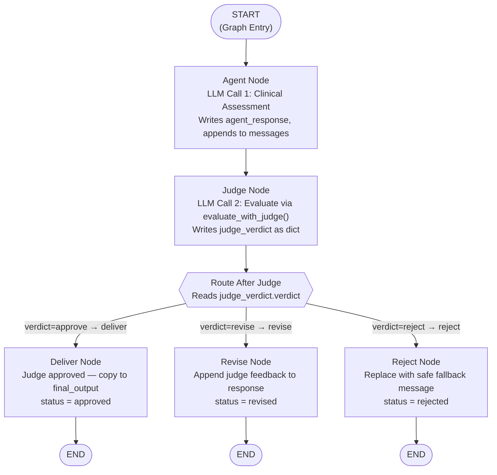
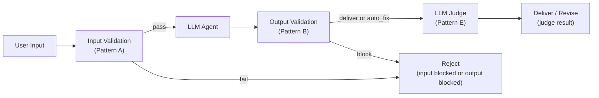

# Chapter 5 — Pattern E: LLM-as-Judge

> **Prerequisite:** Read [Chapter 4 — Layered Validation](./04_layered_validation.md) first. This chapter introduces the two-LLM pattern and structured output — the most architecturally sophisticated guardrail strategy in this module.

---

## 1. What Is This Pattern?

Imagine two surgeons preparing an operation plan. The first surgeon is the expert who designed the plan — she knows the patient's history, has reviewed the scans, and has written detailed steps. The second surgeon is a peer reviewer — she reads the plan cold, asks "Is this safe? Is this complete? Does it actually address what this patient needs?" Her job is not to redo the first surgeon's work. Her job is to find the things the first surgeon might have been too close to the problem to notice: missing considerations, incomplete reasoning, assumptions that do not hold for this specific patient.

**The LLM-as-judge pattern in LangGraph is that peer-review protocol.** Two LLM calls run sequentially in the same graph. The first LLM (the agent) generates a clinical assessment. The second LLM (the judge) evaluates that assessment against three criteria: Is it *safe*? Is it *relevant* to this specific patient's case? Is it *complete* — does it address all the key clinical considerations? The judge returns a structured verdict: approve, revise, or reject. The graph routes the response based on that verdict.

The problem this pattern solves is the fundamental weakness of the deterministic guardrails in Patterns A through D: **regex and keyword matching cannot assess nuance.** A rule-based check can catch "stop all medications immediately" (an exact prohibited phrase). It cannot catch "the recommended Lisinopril dose does not account for this patient's eGFR of 42 mL/min" — that requires understanding the *context* of the patient case. Only another LLM can evaluate that.

---

## 2. When Should You Use It?

**Use this pattern when:**

- Your domain involves high-complexity, context-dependent reasoning where a response that looks technically clean by rule-based checks could still be wrong for the specific case (e.g., drug interactions, dosage adjustments for renal impairment, differential diagnosis with sparse data).
- You need semantic evaluation of *relevance* — does the response actually answer the specific question asked, not just a plausible-sounding generic answer?
- You need semantic evaluation of *completeness* — does the response cover all the clinically important considerations for this patient, not just the most obvious ones?
- You have already run Patterns A and B (deterministic guardrails) and want to add a semantic layer on top for the responses that pass the rules-based checks.

**Do NOT use this pattern when:**

- Every response must be checked — the pattern makes two LLM calls per request. At scale, this doubles your token cost and latency. Reserve it for high-risk request categories or responses that reach a specific complexity threshold.
- The deterministic guardrails (Patterns A and B) already catch everything you care about. Adding a judge LLM where rule-based checks are sufficient is pure waste.
- The judge LLM itself is unreliable or hallucination-prone in your domain. A bad judge is worse than no judge — it can approve dangerous responses or reject safe ones.
- Your latency budget is tight (e.g., real-time systems requiring sub-500ms responses). Two sequential LLM calls typically take 2–6 seconds total.

---

## 3. How It Works — Architecture Walkthrough

### ASCII Graph (from the script's docstring)

```
[START]
   |
   v
[agent]            <-- LLM call 1: generate clinical assessment
   |
   v
[judge]            <-- LLM call 2: evaluate the response
   |
route_after_judge()
   |
+--+---------+----------+
|             |          |
| "approve"   | "revise" | "reject"
v             v          v
[deliver]   [revise]   [reject]
|             |          |
v             v          v
[END]        [END]     [END]

DECISION TABLE:
    verdict="approve"  -> deliver as-is
    verdict="revise"   -> append judge's suggested fix
    verdict="reject"   -> replace with safe fallback
```

### Step-by-Step Explanation

**Edge: START → agent**
The graph starts at `agent`. There is no input validation guard before the agent in this script — the pattern focuses on the judge evaluation topology. In a full production pipeline, you would prepend an `input_validation` node (as in Pattern D).

**Node: `agent`**
This is LLM Call 1. The node builds a clinical prompt from the patient case and query, calls the LLM, and writes the response text to `state["agent_response"]`. It also appends the response message to the accumulated `state["messages"]` list via the `add_messages` reducer.

**Edge: agent → judge**
Fixed edge. Every agent response is evaluated by the judge — there is no shortcut to delivery without the judge review. This is by design: the point of this pattern is that the judge always runs.

**Node: `judge`**
This is LLM Call 2. The node calls `evaluate_with_judge()` (from `guardrails/llm_judge_guardrails.py`) with three pieces of context: the patient case, the user query, and the agent's response. The judge LLM returns a structured `JudgeVerdict` object via Pydantic-enforced structured output. The node serialises the verdict to a dict and writes it to `state["judge_verdict"]`. If the judge LLM errors, the node falls back to `default_approve_verdict()` — a fail-open strategy.

**Conditional edge router: `route_after_judge()`**
Reads `state["judge_verdict"]["verdict"]` and returns one of three strings: `"approve"` (or `"deliver"` — both map to the same node), `"revise"`, or `"reject"`.

**Node: `deliver`**
The clean path. The judge approved the response. Copies `state["agent_response"]` to `state["final_output"]` unchanged. Sets `status: "approved"`.

**Node: `revise`**
The correction path. The judge found issues but did not reject the response entirely. The node appends the judge's `reasoning` and `suggested_fix` to the original response as a "Revision Note." Sets `status: "revised"`. In a more advanced implementation, this node could call the LLM again with the judge's feedback to generate a genuinely revised response.

**Node: `reject`**
The replacement path. The judge found the response fundamentally unsafe. The original response is entirely discarded and replaced with a safe fallback message. Sets `status: "rejected"`.

**Edges: deliver / revise / reject → END**
All three terminal nodes connect to `END`.

### Mermaid Flowchart



---

## 4. State Schema Deep Dive

```python
class JudgeState(TypedDict):
    messages: Annotated[list, add_messages]  # Accumulates LLM messages (add_messages reducer)
    patient_case: dict      # Set at invocation time — full patient data dict
    user_query: str         # Set at invocation time — the original user question
    agent_response: str     # Written by: agent_node
    judge_verdict: dict     # Written by: judge_node (serialised JudgeVerdict)
    final_output: str       # Written by: deliver_node / revise_node / reject_node
    status: str             # Written by: terminal nodes
```

**Field: `messages: Annotated[list, add_messages]`**
- **Who writes it:** `agent_node` (appends the LLM response). The `add_messages` reducer accumulates messages rather than replacing the list. (See [Chapter 3](./03_confidence_gating.md) for a full explanation of `Annotated[list, add_messages]`.)
- **Who reads it:** Not read by any node in this script — it exists for observability (you can inspect the full conversation from the final state) and for future nodes that might need conversation history (e.g., a second revision pass).
- **Why it exists as a separate field:** Keeping all LLM message objects in `messages` means the full dialogue is recoverable from the final state for audit, debugging, and LangSmith tracing.

**Field: `user_query: str`**
- **Who writes it:** Set at invocation time.
- **Who reads it:** `agent_node` (included in the prompt) and `judge_node` (passed to `evaluate_with_judge()` so the judge can assess relevance).
- **Why it exists as a separate field:** The judge needs the original query to evaluate *relevance* — does the response actually answer what was asked? Without `user_query` in state, the judge would have to infer the question from context.

**Field: `agent_response: str`**
- **Who writes it:** `agent_node`.
- **Who reads it:** `judge_node` (passed to `evaluate_with_judge()`), `deliver_node` (copied to `final_output`), `revise_node` (appended to), `reject_node` (discarded — the rejection message is written instead).
- **Why it exists as a separate field:** Keeping the raw LLM output as a separate field from `final_output` preserves the original response for audit even when the judge decides to revise or reject it.

**Field: `judge_verdict: dict`**
- **Who writes it:** `judge_node` — serialised from a `JudgeVerdict` Pydantic object using `.model_dump()`.
- **Who reads it:** `route_after_judge()` (reads `["verdict"]`), `revise_node` (reads `["reasoning"]` and `["suggested_fix"]`), `reject_node` (reads `["reasoning"]`).
- **Structure (from `JudgeVerdict` in `guardrails/llm_judge_guardrails.py`):**
  ```python
  {
      "safety":       "safe" | "unsafe" | "borderline",
      "relevance":    "relevant" | "partially_relevant" | "irrelevant",
      "completeness": "complete" | "partial" | "incomplete",
      "verdict":      "approve" | "revise" | "reject",
      "reasoning":    str,      # One-paragraph explanation of the verdict
      "suggested_fix": str,     # Empty unless verdict="revise"
  }
  ```
- **Why it is serialised to dict:** LangGraph state fields must be serialisable (for checkpointing). Pydantic models are not directly serialisable as state values. `.model_dump()` converts the object to a plain dict.

**Field: `final_output: str`**
- **Who writes it:** One of `deliver_node` (copies `agent_response`), `revise_node` (appends judge feedback), or `reject_node` (writes safe fallback).
- **Who reads it:** The caller of `graph.invoke()`.
- **Why it exists as a separate field:** Separating `final_output` from `agent_response` preserves the original LLM response while giving the caller a clean "what to show the user" field.

---

## 5. Node-by-Node Code Walkthrough

### `agent_node`

```python
def agent_node(state: JudgeState) -> dict:
    llm = get_llm()           # Get the configured LLM client from core.config
    patient = state["patient_case"]   # Read patient data from state

    # System prompt: clinical triage specialist role, concise assessment
    system = SystemMessage(content=(
        "You are a clinical triage specialist. "
        "Provide a concise clinical assessment for the patient below."
    ))
    # Build the full prompt — include patient case data and the user query
    prompt = HumanMessage(content=f"""Patient: {patient.get('age')}y {patient.get('sex')}
Complaint: {patient.get('chief_complaint')}
Symptoms: {', '.join(patient.get('symptoms', []))}
History: {', '.join(patient.get('medical_history', []))}
Medications: {', '.join(patient.get('current_medications', []))}
Labs: {json.dumps(patient.get('lab_results', {}))}
Vitals: {json.dumps(patient.get('vitals', {}))}

Query: {state['user_query']}""")

    config = build_callback_config(trace_name="llm_judge_agent")  # Observability tracing config
    response = llm.invoke([system, prompt], config=config)        # LLM Call 1

    print(f"    | [Agent] Response: {len(response.content)} chars")

    return {
        "messages": [response],         # Accumulated via add_messages reducer
        "agent_response": response.content,  # Raw text of the LLM's response
    }
```

**Line-by-line explanation:**
- `get_llm()` — Project utility that returns a configured LLM client (Google Generative AI or OpenAI depending on environment variables).
- `SystemMessage` and `HumanMessage` — LangChain message types. `SystemMessage` provides the role context; `HumanMessage` provides the actual clinical data and query.
- `state['user_query']` — The original user question is embedded at the end of the prompt so the LLM knows exactly what to answer (not just to describe the patient generically).
- `llm.invoke([system, prompt], config=config)` — Sends the message list to the LLM. Returns an `AIMessage` object with a `.content` attribute containing the response text.
- `"messages": [response]` — The `add_messages` reducer appends this new message to the existing messages list.
- `"agent_response": response.content` — Stores just the text content separately for the judge to read and for terminal nodes to use.

**What breaks if you remove this node:** There is no LLM response to judge. `agent_response` remains empty. The judge receives an empty string, likely produces a misleading verdict, and the graph routes to an incorrect terminal node.

> **TIP:** In production, also capture token usage in this node:
> ```python
> usage = response.usage_metadata  # dict with input_tokens, output_tokens
> return {
>     "messages": [response],
>     "agent_response": response.content,
>     "agent_token_cost": usage.get("total_tokens", 0),
> }
> ```
> Add `agent_token_cost: int` to `JudgeState`. This enables per-request cost tracking.

---

### `judge_node`

```python
def judge_node(state: JudgeState) -> dict:
    llm = get_llm()    # Get the LLM client — same model as agent, but different call
    config = build_callback_config(trace_name="llm_judge_verdict")   # Separate trace name

    try:
        # CONNECTION: evaluate_with_judge() is in guardrails/llm_judge_guardrails.py
        # It wraps the second LLM call with structured output (JudgeVerdict Pydantic model)
        verdict = evaluate_with_judge(
            llm=llm,                                   # The LLM to use as judge
            patient_case=state["patient_case"],        # Patient data for relevance evaluation
            user_query=state["user_query"],            # Original query for relevance evaluation
            agent_response=state["agent_response"],    # The response being evaluated
        )

        # Log each dimension of the verdict for monitoring
        print(f"    | [Judge] Safety: {verdict.safety}")
        print(f"    | [Judge] Relevance: {verdict.relevance}")
        print(f"    | [Judge] Completeness: {verdict.completeness}")
        print(f"    | [Judge] Verdict: {verdict.verdict}")
        print(f"    | [Judge] Reasoning: {verdict.reasoning[:100]}...")

        # Serialise the Pydantic model to a plain dict (required for LangGraph state)
        return {"judge_verdict": verdict.model_dump()}

    except RuntimeError as e:
        # Fail-open: if the judge LLM errors, approve by default
        # This is safe because deterministic guardrails (Patterns A+B) already ran upstream
        print(f"    | [Judge] Error: {e}. Using fail-open default (approve).")
        fallback = default_approve_verdict(reason=str(e))    # Returns a JudgeVerdict with verdict="approve"
        return {"judge_verdict": fallback.model_dump()}
```

**Line-by-line explanation:**
- `evaluate_with_judge(llm, patient_case, user_query, agent_response)` — Defined in `guardrails/llm_judge_guardrails.py` (root module). It builds a judge prompt, calls `llm.with_structured_output(JudgeVerdict).invoke(...)`, and returns a validated `JudgeVerdict` Pydantic object. See the root module section below for the full contract.
- `verdict.safety`, `verdict.relevance`, `verdict.completeness`, `verdict.verdict` — The four core fields of `JudgeVerdict`. Logging all four enables monitoring dashboards that track judge verdicts over time.
- `verdict.model_dump()` — Converts the Pydantic model to a plain Python dict. This is necessary because LangGraph's state mechanism requires plain, serialisable types.
- `except RuntimeError` — Catches errors from `evaluate_with_judge()` (e.g., LLM API timeout, structured output parsing failure). The fail-open strategy (`default_approve_verdict()`) is deliberate: the first line of defence is the deterministic guardrails. If the judge LLM errors, we do not want to block all traffic — we accept the risk of one missed semantic check.

**What breaks if you remove this node:** The `judge_verdict` field is never populated. `route_after_judge()` reads `state["judge_verdict"].get("verdict", "approve")` — the default fallback means every response is delivered without any judge evaluation. The judge pattern effectively becomes a no-op.

> **WARNING:** The fail-open strategy means that if the judge LLM is consistently failing (e.g., due to an API outage), all responses will be approved automatically. Monitor the rate of `judge_error` events in your logging. If errors exceed a threshold, alert the on-call team — the semantic layer is offline.

> **TIP:** In production, replace `except RuntimeError` with `except Exception` to catch all failure types (network errors, JSON parsing failures, API rate limit errors). Log the error type separately so you can distinguish "judge timed out" from "judge returned unparseable output."

---

### `route_after_judge`

```python
def route_after_judge(state: JudgeState) -> Literal["deliver", "revise", "reject"]:
    # Read the verdict string from the serialised JudgeVerdict dict
    verdict = state["judge_verdict"].get("verdict", "approve")   # Default to approve if key missing
    # Return the verdict as the routing key (with safety guard for unexpected values)
    return verdict if verdict in ("approve", "revise", "reject") else "deliver"
```

**Line-by-line explanation:**
- `state["judge_verdict"].get("verdict", "approve")` — Defensive read. If `judge_verdict` is empty or the `verdict` key is missing, defaults to `"approve"` (fail-open).
- `verdict if verdict in ("approve", "revise", "reject") else "deliver"` — Guards against unexpected values (e.g., if the judge LLM hallucinates `"uncertain"` as its verdict). Any unrecognised verdict routes to `"deliver"`. Note: this is the fail-open default again.
- The `add_conditional_edges()` mapping includes `{"approve": "deliver", "deliver": "deliver", ...}` — both `"approve"` and `"deliver"` map to the `deliver` node. This handles the case where the router returns `"approve"` (the natural judge output) and also `"deliver"` (the fallback guard's output).

**What breaks if you remove this function:** Without a router, you cannot use `add_conditional_edges()`. There is no way to wire three-way routing out of `judge_node`.

> **NOTE:** The router maps both `"approve"` and `"deliver"` to the same `deliver` node. This double mapping exists because the router function's default fallback (`else "deliver"`) needs to match a key in the mapping dict — and `"deliver"` is the natural node name. The `"approve"` key maps to the same node because that is the judge's vocabulary. Both mean the same thing: "send this response to the user."

---

### `deliver_node`

```python
def deliver_node(state: JudgeState) -> dict:
    return {
        "final_output": state["agent_response"],   # Deliver original response — judge approved
        "status": "approved",                       # Different from "delivered" to signal judge ran
    }
```

**Line-by-line explanation:**
- `status: "approved"` — Note: this is `"approved"`, not `"delivered"`. The distinction is intentional: `"approved"` signals that the judge evaluated and approved this response, while `"delivered"` (in Pattern B) signals that no judge was involved. This makes the audit trail richer.

---

### `revise_node`

```python
def revise_node(state: JudgeState) -> dict:
    fix = state["judge_verdict"].get("suggested_fix", "")     # The judge's suggested correction
    reasoning = state["judge_verdict"].get("reasoning", "")   # The judge's explanation

    # Append the judge's notes to the original response as a "Revision Note"
    revised = (
        f"{state['agent_response']}\n\n"   # Original response first
        f"--- Revision Note ---\n"          # Clear separator
        f"Reviewer comment: {reasoning}\n"  # Judge's reasoning for the revision
    )
    if fix:                                 # Only append the fix if the judge provided one
        revised += f"Suggested correction: {fix}\n"

    return {
        "final_output": revised,    # Deliver the augmented response
        "status": "revised",        # Signal that the judge requested a revision
    }
```

**Line-by-line explanation:**
- `state["judge_verdict"].get("suggested_fix", "")` — The `JudgeVerdict` schema populates `suggested_fix` only when `verdict="revise"`. Using `.get()` with empty string default prevents a `KeyError`.
- The `revised` string combines the original response with the judge's notes. The user sees both: the clinical assessment and the reviewer's comment. This is appropriate in a medical context where the reviewer's note may be directly useful to the clinician.
- `if fix:` — Only appends the suggested correction if one was provided. The judge may provide reasoning without a specific fix if the issue is general (e.g., "Response lacks consideration of renal function in dosage recommendation").

> **TIP:** In production, replace this simple string-append approach with a second LLM call that uses the judge's feedback to regenerate a genuinely revised response:
> ```python
> revision_prompt = (
>     f"Original response:\n{state['agent_response']}\n\n"
>     f"Reviewer feedback: {reasoning}\n"
>     f"Suggested fix: {fix}\n\n"
>     "Please provide a revised response that addresses the reviewer's feedback."
> )
> revised_response = llm.invoke([HumanMessage(content=revision_prompt)])
> return {"final_output": revised_response.content, "status": "revised"}
> ```
> This is the "revision loop" pattern — a more expensive but higher-quality approach.

---

### `reject_node`

```python
def reject_node(state: JudgeState) -> dict:
    reasoning = state["judge_verdict"].get("reasoning", "")   # Why the judge rejected
    return {
        "final_output": (
            "This response was rejected by clinical review.\n"   # User-facing rejection message
            f"Reason: {reasoning}\n"                             # Judge's stated reason
            "Please consult a qualified healthcare provider directly."  # Required redirect
        ),
        "status": "rejected",   # Machine-readable rejection indicator
    }
```

**Line-by-line explanation:**
- The original `agent_response` is not included in the rejection message — the judge found it fundamentally unsafe, so the entire content is withheld. Only the reason and the redirect are shown to the user.
- `reasoning` — The judge's reasoning is included in the rejection message so the user gets a meaningful explanation rather than "access denied."

---

### Root Module: `evaluate_with_judge()` and `JudgeVerdict`

Both are defined in `guardrails/llm_judge_guardrails.py`. This script imports them as:

```python
from guardrails.llm_judge_guardrails import (
    JudgeVerdict,
    evaluate_with_judge,
    default_approve_verdict,
)
```

**`JudgeVerdict` — contract:**
- A Pydantic model (`class JudgeVerdict(BaseModel)`) used with `llm.with_structured_output(JudgeVerdict)`.
- `with_structured_output()` forces the LLM to return a JSON object that matches the Pydantic schema. Pydantic validates the structure automatically — no manual JSON parsing needed.
- Fields: `safety: Literal["safe", "unsafe", "borderline"]`, `relevance: Literal["relevant", "partially_relevant", "irrelevant"]`, `completeness: Literal["complete", "partial", "incomplete"]`, `verdict: Literal["approve", "revise", "reject"]`, `reasoning: str`, `suggested_fix: str`.
- The `verdict` field is the only one the router reads. The other fields exist for audit logging and monitoring dashboards.

**`evaluate_with_judge()` — contract:**
- **Input:** `llm` (the LLM client), `patient_case: dict`, `user_query: str`, `agent_response: str`.
- **Output:** A `JudgeVerdict` Pydantic object.
- **Logic:** Builds a judge system prompt (defined as `JUDGE_SYSTEM_PROMPT` in the root module — a rubric instructing the LLM to evaluate safety, relevance, and completeness independently before producing an overall verdict). Calls `llm.with_structured_output(JudgeVerdict).invoke(...)`. Returns the validated object.
- **Raises:** `RuntimeError` if the structured output call fails or returns an invalid verdict.
- **Side effects:** Makes one LLM API call. Charges tokens.

**`default_approve_verdict()` — contract:**
- **Input:** `reason: str` (the error message from the failed judge call).
- **Output:** A `JudgeVerdict` with `verdict="approve"`, `safety="safe"`, `relevance="relevant"`, `completeness="complete"`, and `reasoning=f"Judge unavailable: {reason}"`.
- **Purpose:** Provides a type-safe fail-open fallback that satisfies the same interface as a real verdict.

---

## 6. Conditional Routing Explained

### `add_conditional_edges()` Call

```python
workflow.add_conditional_edges(
    "judge",             # Source node — route after the judge node completes
    route_after_judge,   # Router function — reads judge_verdict["verdict"]
    {
        "approve": "deliver",   # Judge approved → deliver node
        "deliver": "deliver",   # Fallback guard returns "deliver" → same node
        "revise":  "revise",    # Judge wants revision → revise node
        "reject":  "reject",    # Judge rejected → reject node
    },
)
```

The mapping has four keys but only three target nodes. Both `"approve"` and `"deliver"` route to the `deliver` node. This handles two scenarios simultaneously:
- When the judge returns `verdict="approve"` → router returns `"approve"` → maps to `deliver`.
- When the router's safety guard fires (`else "deliver"`) → router returns `"deliver"` → also maps to `deliver`.

### Decision Table

| `judge_verdict["verdict"]` | Router Returns | Next Node | Final `status` |
|---------------------------|----------------|-----------|----------------|
| `"approve"` | `"approve"` | `deliver` node | `"approved"` |
| `"revise"` | `"revise"` | `revise` node | `"revised"` |
| `"reject"` | `"reject"` | `reject` node | `"rejected"` |
| Any other value (fallback) | `"deliver"` | `deliver` node | `"approved"` |
| Missing / empty (error) | `"deliver"` | `deliver` node | `"approved"` |

---

## 7. Worked Example — Trace: Test 2, Polypharmacy Patient

**Test case from `main()`:**

```python
poly_patient = PatientCase(
    patient_id="PT-JG-002",
    age=71, sex="F",
    chief_complaint="Dizziness with elevated potassium",
    symptoms=["dizziness", "fatigue", "ankle edema"],
    medical_history=["CKD Stage 3a", "Hypertension", "CHF"],
    current_medications=[
        "Lisinopril 20mg", "Spironolactone 25mg",
        "Furosemide 40mg", "Metoprolol 50mg",
    ],
    allergies=["Sulfa drugs"],
    lab_results={"K+": "5.4 mEq/L", "eGFR": "42 mL/min", "BNP": "450 pg/mL"},
    vitals={"BP": "105/65", "HR": "58"},
)
query = (
    "Assess this patient. The combination of Lisinopril and Spironolactone "
    "with declining renal function is concerning. What are the risks?"
)
```

**Initial state passed to `graph.invoke()`:**
```python
{
    "messages": [],                  # empty accumulator
    "patient_case": { ... },         # serialised PatientCase
    "user_query": "Assess this patient. The combination of Lisinopril...",
    "agent_response": "",            # empty — not yet written
    "judge_verdict": {},             # empty — not yet written
    "final_output": "",              # empty — not yet written
    "status": "pending",
}
```

---

**Step 1 — `agent_node` executes (LLM Call 1):**

The LLM receives the full patient case and the query about Lisinopril + Spironolactone risk. With an eGFR of 42 and K+ of 5.4 (elevated), the LLM generates a response discussing hyperkalaemia risk from concurrent ACE inhibitor + potassium-sparing diuretic use, and the need to monitor renal function.

State AFTER `agent_node`:
```python
{
    "messages": [AIMessage(content="This patient presents a significant polypharmacy risk...")],
    "patient_case": { ... },        # unchanged
    "user_query": "Assess this patient...",   # unchanged
    "agent_response": (
        "This patient presents a significant polypharmacy risk. "
        "The combination of Lisinopril (ACE inhibitor) and Spironolactone "
        "(potassium-sparing diuretic) is associated with hyperkalaemia risk, "
        "particularly with declining renal function (eGFR 42 mL/min). "
        "Current K+ of 5.4 mEq/L is already mildly elevated. "
        "Recommend: consider dose reduction of Spironolactone, renal function "
        "review in 48–72 hours, cardiology consultation given BNP elevation."
    ),
    "judge_verdict": {},   # not yet written
    "final_output": "",    # not yet written
    "status": "pending",
}
```

---

**Step 2 — `judge_node` executes (LLM Call 2):**

`evaluate_with_judge()` sends the patient case, user query, and agent response to the judge LLM. The judge evaluates:
- **Safety:** The response correctly identifies hyperkalaemia risk and recommends monitoring — `"safe"`.
- **Relevance:** The response directly addresses the Lisinopril + Spironolactone interaction question — `"relevant"`.
- **Completeness:** The response mentions dose reduction and renal review but could note the sulfa drug allergy means Furosemide (a sulfonamide derivative) may need to be reviewed — `"partial"`.
- **Verdict:** `"revise"` — the response is clinically sound but incomplete for this specific patient's allergy profile.

State AFTER `judge_node`:
```python
{
    "messages": [AIMessage(content="This patient presents a significant polypharmacy risk...")],
    "patient_case": { ... },
    "user_query": "Assess this patient...",
    "agent_response": "This patient presents a significant polypharmacy risk...",
    "judge_verdict": {
        "safety":       "safe",
        "relevance":    "relevant",
        "completeness": "partial",
        "verdict":      "revise",
        "reasoning": (
            "The response correctly identifies hyperkalaemia risk from ACE inhibitor "
            "and potassium-sparing diuretic combination. However, it does not address "
            "the patient's documented allergy to sulfa drugs in the context of Furosemide "
            "(a sulfonamide-derived loop diuretic), which may require medication review."
        ),
        "suggested_fix": (
            "Add a note that the patient's sulfa allergy should be reviewed in the context "
            "of Furosemide use, and consult pharmacology if concerned about cross-reactivity."
        ),
    },
    "final_output": "",   # not yet written
    "status": "pending",
}
```

---

**Step 3 — `route_after_judge()` is called:**

```python
verdict = state["judge_verdict"].get("verdict", "approve")   # → "revise"
# "revise" is in ("approve", "revise", "reject") → return "revise"
```

Execution jumps to `revise_node`.

---

**Step 4 — `revise_node` executes:**

```python
fix = state["judge_verdict"].get("suggested_fix", "")
# → "Add a note that the patient's sulfa allergy should be reviewed..."

reasoning = state["judge_verdict"].get("reasoning", "")
# → "The response correctly identifies hyperkalaemia risk..."
```

State AFTER `revise_node`:
```python
{
    "messages": [...],
    "patient_case": { ... },
    "user_query": "...",
    "agent_response": "This patient presents a significant polypharmacy risk...",  # preserved
    "judge_verdict": { ... },                      # preserved
    "final_output": (
        "This patient presents a significant polypharmacy risk. "
        "The combination of Lisinopril (ACE inhibitor) and Spironolactone "
        "(potassium-sparing diuretic) is associated with hyperkalaemia risk, "
        "particularly with declining renal function (eGFR 42 mL/min). "
        "Current K+ of 5.4 mEq/L is already mildly elevated. "
        "Recommend: consider dose reduction of Spironolactone, renal function "
        "review in 48–72 hours, cardiology consultation given BNP elevation."
        "\n\n--- Revision Note ---\n"
        "Reviewer comment: The response correctly identifies hyperkalaemia risk "
        "from ACE inhibitor and potassium-sparing diuretic combination. However, "
        "it does not address the patient's documented allergy to sulfa drugs in "
        "the context of Furosemide (a sulfonamide-derived loop diuretic)...\n"
        "Suggested correction: Add a note that the patient's sulfa allergy should "
        "be reviewed in the context of Furosemide use, and consult pharmacology "
        "if concerned about cross-reactivity.\n"
    ),
    "status": "revised",   # written by revise_node
}
```

---

**Step 5 — Graph reaches `END`:**

`graph.invoke()` returns the final state. The caller reads:
```python
result["status"]       # → "revised"
result["final_output"] # → original response + revision note
result["judge_verdict"]["completeness"]  # → "partial" — for monitoring
```

The deterministic guardrails (Patterns A and B) would not have caught the sulfa allergy/Furosemide omission — that required the judge LLM to read the full patient record and reasoning. This is exactly the class of semantic issue the LLM-as-judge pattern is designed to catch.

---

## 8. Key Concepts Introduced

- **Two-LLM pattern** — Running two LLM calls sequentially in one graph: the first generates content, the second evaluates it. The key design choice is that the judge LLM never generates clinical content — it only evaluates. Appears in `agent_node` (LLM Call 1) and `judge_node` (LLM Call 2 via `evaluate_with_judge()`).

- **Structured output (Pydantic model)** — Using `llm.with_structured_output(JudgeVerdict)` to force the judge LLM to return a validated Python object instead of free text. Eliminates brittle text parsing. Defined in `guardrails/llm_judge_guardrails.py`, used inside `evaluate_with_judge()`.

- **Fail-open vs fail-closed** — When the judge LLM errors, the system defaults to approving (fail-open). This is a deliberate design choice explained by "defence in depth": deterministic guardrails (Patterns A and B) already ran. A fail-closed approach (blocking on judge error) would be more conservative but would stop all traffic when the judge LLM has an outage. Appears in the `except RuntimeError` block in `judge_node`.

- **Semantic evaluation vs deterministic checks** — The judge evaluates nuance (relevance, completeness, contextual safety) that regex/keyword matching cannot assess. Deterministic checks are fast, cheap, and exact-pattern-only. The judge is slower, more expensive, and semantically aware. Discussed in the script's docstring and in section 1 of this chapter.

- **`verdict.model_dump()`** — The Pydantic method that converts a model instance to a plain Python dict. Required because LangGraph state values must be serialisable types, not Pydantic objects. Appears in `judge_node` at `return {"judge_verdict": verdict.model_dump()}`.

- **Double-key mapping in `add_conditional_edges()`** — The `{"approve": "deliver", "deliver": "deliver", ...}` pattern that handles both the natural judge vocabulary and the router's fallback guard output, routing both to the same node. Appears in `build_judge_graph()`.

---

## 9. Common Mistakes and How to Avoid Them

### Mistake 1: Using the judge without deterministic guardrails upstream

**What goes wrong:** You deploy Pattern E alone (no input validation, no output validation) and rely entirely on the judge to catch everything. The judge LLM hallucinates an "approve" verdict for a response containing a prohibited phrase. The dangerous response is delivered.

**Why it goes wrong:** The judge is a semantic evaluator, not a pattern matcher. It can miss exact-string issues that deterministic checks would catch reliably. It can also hallucinate safe-looking evaluations for unsafe content.

**Fix:** Always run Pattern A (input validation) before the agent, and Pattern B (output validation) after the agent, before the judge. The judge is Layer 4, not Layer 1.

---

### Mistake 2: Storing the `JudgeVerdict` object directly in state (not `.model_dump()`)

**What goes wrong:** You write `return {"judge_verdict": verdict}` (the Pydantic object itself). Everything appears to work in simple runs. But when you enable LangGraph checkpointing (for persistence), the checkpoint serialiser cannot serialise a Pydantic object.

**Why it goes wrong:** LangGraph's checkpoint mechanism uses Python's `json` or `pickle` serialisation. Pydantic models are not natively serialisable by `json.dumps()` without a custom encoder.

**Fix:** Always call `.model_dump()` before storing: `return {"judge_verdict": verdict.model_dump()}`.

---

### Mistake 3: LangGraph state immutability — appending to `messages` in-place

**What goes wrong:** In `agent_node`, you write `state["messages"].append(response)` thinking you are adding to the accumulated list.

**Why it goes wrong:** Mutating `state["messages"]` in-place bypasses the `add_messages` reducer. In LangGraph's checkpointing mode, the state is re-read from a snapshot — your in-place mutation is silently lost. The next node sees `messages` without your addition.

**Fix:** Return `{"messages": [response]}` and let the `add_messages` reducer handle the accumulation.

---

### Mistake 4: Trusting the judge's verdict unconditionally

**What goes wrong:** You deploy the judge in a high-risk environment and accept every `"reject"` verdict as gospel, blocking responses that were clinically correct.

**Why it goes wrong:** The judge LLM can hallucinate incorrect evaluations — it may cite a drug interaction that does not exist, or claim a disclaimer is missing when it is present. Without monitoring, you would never know.

**Fix:** Log every verdict with the full reasoning for human review. Track the rate of `"reject"` verdicts over time. If the rejection rate is unexpectedly high (or drops to zero), investigate the judge LLM's behaviour. Periodically sample approved and revised responses for human spot-check.

---

### Mistake 5: Running the judge on every request in a high-volume system

**What goes wrong:** You add Pattern E to every request in a system handling 1,000 requests per minute. Response latency doubles (two LLM calls). Costs double. Under peak load, the judge API rate limit is hit, causing widespread failures.

**Why it goes wrong:** The judge is inherently expensive — it makes a second full LLM call. Running it on every request at scale is economically and operationally unsustainable.

**Fix:** Gate the judge on risk signals:
```python
# Only run the judge if the response is high-risk
if patient.has_complex_polypharmacy or query.involves_dosing:
    # include judge in the graph
else:
    # skip judge — Pattern A + B guardrails are sufficient
```
Alternatively, run the judge only on responses that Pattern B flagged as `auto_fixed` (already slightly problematic) or where the confidence gate (Pattern C) was below a threshold.

---

## 10. How This Pattern Connects to the Others

### Position in the Learning Sequence

Pattern E is the fifth and final step in the guardrails learning sequence. It introduces the two-LLM pattern and structured output — the most sophisticated concepts in this module. Every earlier pattern's vocabulary (nodes, state, conditional edges, add_messages, chained routers) is assumed knowledge.

### What the Previous Pattern Does NOT Handle

Pattern D (Layered Validation) stacks input and output guardrails with deterministic checks. What it cannot do:
- Evaluate whether the response is *relevant to this specific patient's case* (not just whether it contains prohibited phrases).
- Detect a *missing consideration* (e.g., the Furosemide/sulfa allergy omission in the worked example above) — a missing consideration has no keyword signature.
- Reason about the *clinical appropriateness* of a recommendation given a patient's comorbidities and lab values.

All three of these require a second LLM with context of both the patient case and the response. Pattern E provides exactly that.

### What the Next Pattern Adds

Pattern E is the last pattern in this module. After completing it, the natural progression is:
- **Human-in-the-loop (HITL)** using LangGraph `interrupt()` — see `scripts/script_04c_hitl_review.py`. This replaces the `escalate_node` / `revise_node` patterns with true graph interruption that waits for a human response before continuing.
- **Multi-agent architectures** — see `scripts/script_07_architectures_part1.py` and `script_08_architectures_part2.py`. These patterns build on guardrails by adding specialist sub-agents that are themselves guarded.

### How to Compose Pattern E with Pattern D

The canonical production pipeline uses Pattern D (input + output guards) followed by Pattern E (judge), where the judge runs only on responses that passed Pattern D:



The judge is the last checkpoint — it only runs on responses that have already passed the cheap, fast, deterministic layers. This minimises the number of expensive second LLM calls.

---

## 11. Quick-Reference Summary

| Aspect | Detail |
|--------|--------|
| **Pattern name** | LLM-as-Judge |
| **Script file** | `scripts/guardrails/llm_as_judge.py` |
| **Graph nodes** | `agent`, `judge`, `deliver`, `revise`, `reject` |
| **Router function** | `route_after_judge()` |
| **Routing type** | Three-way semantic conditional (3 outcomes: `deliver` / `revise` / `reject`) |
| **State fields** | `messages`, `patient_case`, `user_query`, `agent_response`, `judge_verdict`, `final_output`, `status` |
| **Root modules** | `guardrails/llm_judge_guardrails.py` → `JudgeVerdict`, `evaluate_with_judge()`, `default_approve_verdict()` |
| **New LangGraph concepts** | Two-LLM pattern, structured output (Pydantic), fail-open strategy, `verdict.model_dump()`, double-key routing mapping |
| **Prerequisite** | [Chapter 4 — Layered Validation](./04_layered_validation.md) |
| **Next pattern** | HITL with `interrupt()` — see `scripts/script_04c_hitl_review.py` |

---

*You have completed all five guardrail pattern chapters. Return to [Chapter 0 — Overview](./00_overview.md) for a full module summary and defence-in-depth composition diagram.*
