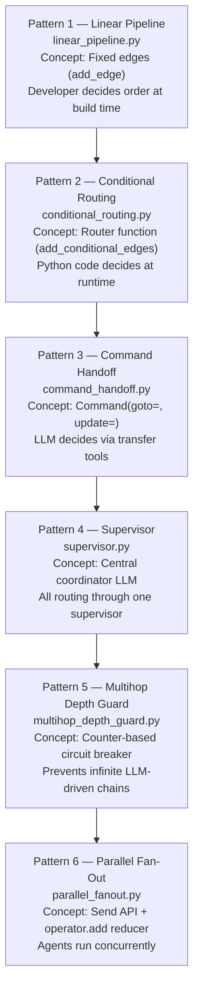
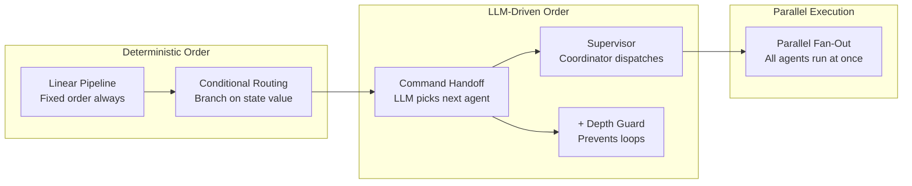

# Chapter 0 — Handoff Patterns: An Overview of All Six Patterns

> **Reading time:** ~20 minutes. Read this chapter before opening any of the six pattern chapters.

---

## 1. What Are Handoffs in an Agentic AI System?

Think of how a large hospital emergency department works. When a patient arrives, a triage nurse does the first assessment. The nurse does not treat the patient — they summarise the situation on a structured handoff form: "58-year-old male, chest pain, elevated troponin, currently stable. For cardiology review." The cardiologist reads *that form*, not the nurse's raw notes. The cardiologist then runs their own tests, writes their findings, and hands the case back — or onward — to the next specialist.

**Handoffs in a multi-agent AI system work exactly the same way.** One agent — the sender — completes a focused task, packages its findings into a structured context object, and passes control to another agent — the receiver. The receiver reads the structured context, not the sender's internal reasoning or raw tool call history. Each agent stays in its lane.

The problem these patterns solve is: **how do you organise multiple specialised LLM agents so that they collaborate effectively?** Specifically:

- Which agent runs next — and how is that decision made?
- How do you pass relevant context from one agent to the next without overwhelming the receiver with irrelevant detail?
- How do you prevent runaway chains where agents call each other indefinitely?
- How do you run agents in parallel when they don't depend on each other?

This module answers all four questions with six distinct patterns, ordered from simplest to most complex.

---

## 2. Why LangGraph for Handoffs?

You could wire agents together with plain Python function calls:

```python
# Plain Python approach — invisible, fragile, not traceable
def handle_case(patient):
    triage_result = triage_agent(patient)    # who comes next? buried in logic
    if triage_result["risk"] == "high":       # routing decision hidden in code
        pharma_result = pharma_agent(triage_result)  # context passed ad-hoc
    return report_agent(triage_result, pharma_result)  # no structure
```

This works for a demo. In a real system it breaks down:

1. **Invisible in traces.** When you look at a run in LangSmith, you see one Python call. You cannot see which agent ran, in what order, what they handed off, or how long each step took.
2. **Fragile to extend.** To add a new specialist (e.g., a radiology agent), you edit the function that wires everything together. One change can break the whole pipeline.
3. **Untestable routing.** The `if triage_result["risk"] == "high"` condition is buried inside a function that also calls the LLM. You cannot unit-test the routing logic without running the entire pipeline.
4. **No parallelism.** Running triage and pharmacology at the same time requires threading or async code — complex to get right and invisible in traces.

**LangGraph makes handoffs visible, testable, and extensible:**

```
[triage_node]        ← named node; visible in traces; reads/writes specific state fields
[route_after_triage] ← pure Python function; testable with a dict; zero LLM cost
[pharma_node]        ← named node; reads HandoffContext from state; independent of triage's internals
[report_node]        ← named node; reads only final AI outputs; separate from specialists
```

Each agent is a named node. The routing decision is in a separate function that you can unit-test by passing a dict. The `HandoffContext` struct enforces what the sender shares with the receiver. LangGraph traces show every node that ran, its latency, and its state updates.

> **TIP:** Think of LangGraph nodes as the specialists in a hospital. The graph is the hospital's workflow system that routes patients between specialists. The state dict is the patient's chart — every specialist reads and writes to the same chart, but each writes only their own section.

---

## 3. The Six Handoff Patterns — Learning Progression

The six patterns form a deliberate learning sequence. Each introduces one new concept:



Each arrow means: "You need to understand this pattern before the next one makes sense."

---

## 4. Pattern Comparison Table

| Pattern | Script | Routing Type | Who Decides Next Agent | When to Use |
|---------|--------|-------------|------------------------|-------------|
| **1 — Linear Pipeline** | `linear_pipeline.py` | Fixed edges only | You (developer) at build time | When agent order never varies; simplest possible wiring |
| **2 — Conditional Routing** | `conditional_routing.py` | Python router function | Your code, reading state at runtime | When routing is deterministic and testable; zero LLM cost |
| **3 — Command Handoff** | `command_handoff.py` | `Command(goto=, update=)` from node | The LLM, via transfer tool selection | When the LLM needs autonomy to choose the next specialist |
| **4 — Supervisor** | `supervisor.py` | Conditional edges from a coordinator | Supervisor LLM, centrally | When one coordinator should orchestrate multiple workers |
| **5 — Multihop Depth Guard** | `multihop_depth_guard.py` | Conditional edges + counter | Python guard function after each hop | When using LLM-driven routing that could loop indefinitely |
| **6 — Parallel Fan-Out** | `parallel_fanout.py` | `Send` API + reducer | Coordinator emits all branches | When agents are independent and can run concurrently |

---

## 5. How Handoff Patterns Compose

No single pattern is the right choice for every system. In practice, you combine them:



**When to use which combination:**

- **Linear + Conditional** — For bounded, structured workflows where the routing logic is deterministic. Clinical handoff with a fixed set of specialists, branching only on risk level.
- **Command Handoff + Depth Guard** — Always pair these. Command handoff gives the LLM routing autonomy; the depth guard prevents it from looping. Using command handoff without a depth guard in production is unsafe.
- **Supervisor alone** — For workflows where a central coordinator needs to see cumulative results before deciding which worker runs next. Good when workers are sequential (agent B needs agent A's findings).
- **Parallel Fan-Out** — For workflows where specialists are independent. Clinical triage and pharmacology review can happen simultaneously; neither needs the other's output to start.
- **Supervisor + Parallel Fan-Out** — The supervisor dispatches independently-runnable workers in parallel, then collects and synthesises results.

> **WARNING:** Patterns 3 and 4 (Command Handoff and Supervisor) involve LLM calls that drive routing decisions. An LLM can, in principle, keep selecting new workers indefinitely. Always pair them with a depth guard (Pattern 5) in production.

---

## 6. Key Vocabulary Introduced in This Module

| Term | Plain-English Meaning | First appears in |
|------|-----------------------|-----------------|
| `add_edge()` | Wires a fixed, unconditional edge from one node to the next | Chapter 1 |
| `HandoffContext` | A structured data object the sender builds and the receiver reads; prevents context bleed | Chapter 1 |
| `handoff_depth` | A counter that tracks how many agents have run; used for loop prevention | Chapter 1 |
| `add_conditional_edges()` | Wires a conditional edge from a source node through a router function | Chapter 2 |
| `Command(goto=, update=)` | A LangGraph object a node can return instead of a plain dict; drives routing atomically | Chapter 3 |
| Transfer tools | `@tool` functions that return `Command` objects — the LLM calls them to hand off control | Chapter 3 |
| `ToolNode` | LangGraph prebuilt node that executes tool calls returned by an LLM | Chapter 1 |
| Supervisor node | A coordinator LLM node that decides which worker runs next; workers always return to it | Chapter 4 |
| `HandoffLimitReached` | A project exception raised when the depth guard trips a hard limit | Chapter 5 |
| `Send(node, state)` | LangGraph API for creating a parallel execution branch targeting a named node | Chapter 6 |
| `operator.add` reducer | A Python function used as a state reducer to merge lists from parallel branches | Chapter 6 |

---

## 7. Reading Order Guide

Read the chapters in order. Each is self-contained, but the concepts build.

| Chapter | File | One-line description |
|---------|------|----------------------|
| **This file** | [`00_overview.md`](./00_overview.md) | What handoffs are, why LangGraph, all six patterns at a glance. |
| **Chapter 1** | [`01_linear_pipeline.md`](./01_linear_pipeline.md) | Build a fixed triage → pharmacology → report pipeline; learn `HandoffContext` and the manual ReAct loop. |
| **Chapter 2** | [`02_conditional_routing.md`](./02_conditional_routing.md) | Add branching — high-risk patients go to pharmacology, low-risk go straight to report; zero LLM cost for routing. |
| **Chapter 3** | [`03_command_handoff.md`](./03_command_handoff.md) | Let the LLM decide the next agent by calling a transfer tool that returns a `Command` object. |
| **Chapter 4** | [`04_supervisor.md`](./04_supervisor.md) | Add a central supervisor LLM that dispatches workers and decides when the workflow is complete. |
| **Chapter 5** | [`05_multihop_depth_guard.md`](./05_multihop_depth_guard.md) | Enforce a hop-count limit on multi-agent chains so LLM-driven routing cannot loop indefinitely. |
| **Chapter 6** | [`06_parallel_fanout.md`](./06_parallel_fanout.md) | Fan out to triage and pharmacology simultaneously using `Send`; merge results with the `operator.add` reducer. |

---

*Continue to [Chapter 1 — Linear Pipeline](./01_linear_pipeline.md).*
