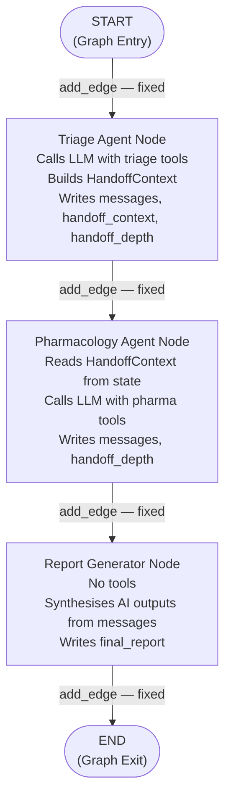
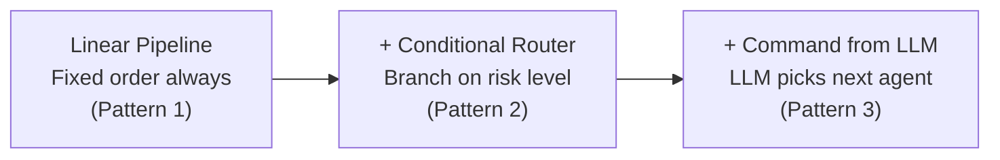

# Chapter 1 — Pattern 1: Linear Pipeline

> **Prerequisite:** Read [Chapter 0 — Overview](./00_overview.md) first to understand where this pattern fits in the learning sequence.

---

## 1. What Is This Pattern?

Think of a hospital laboratory result workflow. When a blood sample arrives, it goes to the haematology analyser first, then automatically to the chemistry analyser, then to the results printer. The sequence never changes — every sample follows the same path in the same order. Nobody decides at runtime whether to skip a step. The sequence was decided when the laboratory built its conveyor system.

**The linear pipeline in LangGraph works exactly the same way.** You wire three agent nodes together with fixed, unconditional edges at graph-build time. The triage agent always runs first. Pharmacology always runs second. Report generation always runs third. No LLM call, no Python function, no runtime decision determines the order — it is baked into the graph's structure.

The problem this pattern solves is: **how do you create a multi-agent pipeline where the execution order is fixed, visible in traces, and independently extensible?** A plain Python function call chain works but is invisible in traces and hard to extend without touching the whole function. Named graph nodes with `add_edge()` connections are visible, traceable, and each node can be modified or replaced without touching the others.

This is the **baseline pattern**. Every other handoff script in this directory adds routing complexity on top of what you learn here.

---

## 2. When Should You Use It?

**Use this pattern when:**

- Your agent execution order never varies — every input follows the same path through the same agents in the same sequence.
- You want the simplest possible multi-agent wiring as a starting point before adding routing complexity.
- You need a production pipeline where the sequence is predictable and auditable (e.g., all clinical cases must go through triage, then pharmacology, then report — no exceptions).
- You want each agent to be independently testable: you can unit-test `triage_node` by passing it a state dict without running the whole graph.

**Do NOT use this pattern when:**

- Some inputs should skip certain agents (e.g., low-risk patients don't need pharmacology) — use [Pattern 2 (Conditional Routing)](./02_conditional_routing.md) instead.
- The LLM should decide which agent runs next based on its reasoning — use [Pattern 3 (Command Handoff)](./03_command_handoff.md).
- Agents can run concurrently because they don't depend on each other's output — use [Pattern 6 (Parallel Fan-Out)](./06_parallel_fanout.md).

---

## 3. How It Works — Architecture Walkthrough

### ASCII Graph (from the script's docstring)

```
Stage 1.1       Stage 1.2           Stage 1.3         Stage 1.4
Define State    Triage Agent        Pharmacology      Report
                                    Agent             Generator

[START]
   |
   v
[triage]  ──add_edge()──>  [pharmacology]  ──add_edge()──>  [report]
   |                            |                              |
   | writes:                    | reads:                       | reads:
   |  - messages                |  - handoff_context           |  - messages
   |  - handoff_context         | writes:                      | writes:
   |  - handoff_depth           |  - messages                  |  - final_report
   |                            |  - handoff_depth             |
   v                            v                              v
                                                             [END]

Routing:  ALL edges are add_edge() — fixed at build time.
Who decides next agent: YOU (the developer).
LLM influence on routing: NONE.
```

### Step-by-Step Explanation

**Edge: START → triage**
`START` is LangGraph's built-in sentinel node representing the entry point of the graph. `add_edge(START, "triage")` means: when `graph.invoke()` is called, the first node to execute is `triage`. Nothing runs before it.

**Node: `triage`**
The triage agent reads the patient case from state, calls the LLM with triage-specific tools bound (`analyze_symptoms`, `assess_patient_risk`), runs a ReAct loop (explained in Section 5), then builds a `HandoffContext` struct with curated findings. It writes `messages`, `handoff_context`, `current_agent`, `handoff_history`, and `handoff_depth` to state.

**Edge: triage → pharmacology (fixed)**
`add_edge("triage", "pharmacology")` is a hardwired connection. After `triage_node` returns, LangGraph unconditionally moves execution to `pharmacology_node`. There is no router function and no runtime decision. This edge fires every time, for every input.

**Node: `pharmacology`**
The pharmacology agent reads `handoff_context` from state — which `triage_node` built — not the full message history. This is **context scoping**: the triage agent's internal reasoning, raw tool call arguments, and intermediate results stay in `messages` (accumulated via `add_messages`). The pharmacologist sees only the curated findings the triage agent intentionally packaged. The pharmacology agent runs its own tool loop (`check_drug_interactions`, `lookup_drug_info`, `calculate_dosage_adjustment`), then writes its findings to `messages` and increments `handoff_depth`.

**Edge: pharmacology → report (fixed)**
Another unconditional fixed edge. After pharmacology finishes, report always runs.

**Node: `report`**
The report node has no tools. It reads the `AIMessage` outputs from all previous agents out of `state["messages"]`, filters out tool messages and intermediate reasoning, then calls the LLM to synthesise a concise clinical summary. It writes `final_report` to state.

**Edge: report → END**
`END` is LangGraph's built-in sentinel representing the graph's exit point. When `report_node` returns, LangGraph stops execution and returns the final state to the caller.

### Mermaid Flowchart



---

## 4. State Schema Deep Dive

```python
class PipelineState(TypedDict):
    messages: Annotated[list, add_messages]  # Accumulated LLM messages (reducer)
    patient_case: dict                        # Set at invocation time
    handoff_context: dict                     # Written by: triage; Read by: pharmacology
    current_agent: str                        # Written by: triage and pharmacology
    handoff_history: list[str]                # Written by: each agent (appended)
    handoff_depth: int                        # Written by: each agent (incremented)
    final_report: str                         # Written by: report
```

**Field: `messages: Annotated[list, add_messages]`**
- **Who writes it:** `triage_node` and `pharmacology_node` each append their LLM response via `{"messages": [response]}`. The `add_messages` reducer accumulates these instead of replacing the list.
- **Who reads it:** `report_node` — reads all `AIMessage` objects to find agent text outputs for synthesis.
- **Why it exists as a separate field:** The full message history (including tool call arguments and raw results) is preserved for observability and for `report_node` to synthesise across all agents. It is distinct from `handoff_context` which is the curated summary.
- **`Annotated[list, add_messages]` explained:** This tells LangGraph to call `add_messages(existing, new)` when a node returns `{"messages": [response]}`. The new message is appended to the existing list rather than replacing it. Without this annotation, each node's message update would overwrite the previous agent's messages.

**Field: `patient_case: dict`**
- **Who writes it:** Set at invocation time in the initial state dict.
- **Who reads it:** `triage_node` (to build the clinical prompt), `pharmacology_node` (to extract medications and lab values).
- **Why it exists as a separate field:** The raw patient data is available to every agent without going through `handoff_context`. `handoff_context` carries the *curated* findings from one agent to the next; `patient_case` carries the *raw* source data.

**Field: `handoff_context: dict`**
- **Who writes it:** `triage_node` — builds a `HandoffContext` object and serialises it via `.model_dump()`.
- **Who reads it:** `pharmacology_node` — deserialises it via `HandoffContext(**raw_handoff)`.
- **Why it exists as a separate field:** This is the core handoff mechanism. The sender (triage) decides *what to share* with the receiver (pharmacology). By packaging only the curated findings, `triage_node` prevents the pharmacologist from being overwhelmed by raw tool call history and intermediate reasoning. The receiver reads a focused, actionable brief — not a transcript.
- **Structure (from `HandoffContext` in `core/models.py`):** Contains `from_agent`, `to_agent`, `reason`, `patient_case`, `task_description`, `relevant_findings`, and `handoff_depth`. Defined in the root module — see `core/models.py`.

**Field: `current_agent: str`**
- **Who writes it:** Each agent writes its own name (e.g., `"triage"`, `"pharmacology"`).
- **Who reads it:** Available for logging and monitoring; not read by another node in this script.
- **Why it exists as a separate field:** Provides a machine-readable record of which agent last ran, useful for debugging and audit trails without parsing `messages`.

**Field: `handoff_history: list[str]`**
- **Who writes it:** Each agent appends its own name: `state["handoff_history"] + ["triage"]`.
- **Who reads it:** The caller reads it after `graph.invoke()` returns to see the full execution path.
- **Why it exists as a separate field:** Provides an ordered audit trail of the handoff chain. In a linear pipeline this is always `["triage", "pharmacology"]`, but in later patterns (conditional routing, supervisor) the list varies per run.

> **NOTE:** `handoff_history` is updated by each node using `state["handoff_history"] + ["triage"]` — a list concatenation that produces a new list. This is the correct approach. Never write `state["handoff_history"].append("triage")` — that mutates the state object in-place, which bypasses LangGraph's state management.

**Field: `handoff_depth: int`**
- **Who writes it:** Each agent increments it by 1.
- **Who reads it:** The depth guard (Pattern 5) reads it to prevent infinite chains.
- **Why it exists as a separate field:** Tracking depth as a named integer field makes it readable by any future guard or monitor without parsing the history list.

**Field: `final_report: str`**
- **Who writes it:** `report_node`.
- **Who reads it:** The caller of `graph.invoke()`.
- **Why it exists as a separate field:** Provides a clean, single field for the caller to read the synthesised output, separate from the full `messages` history.

---

## 5. Node-by-Node Code Walkthrough

### `triage_node`

```python
def triage_node(state: PipelineState) -> dict:
    """Evaluate the patient and produce a triage assessment."""

    # Bind triage-specific tools to the LLM for this agent's scope only
    triage_llm = llm.bind_tools(triage_tools)   # triage_tools: [analyze_symptoms, assess_patient_risk]

    # Build a system prompt that scopes triage's role strictly
    system_msg = SystemMessage(content=(
        "You are a triage specialist. Evaluate the patient's "
        "presentation, identify urgent concerns, and flag issues "
        "that require specialist review. Do not prescribe or "
        "adjust medications."
    ))

    # Build the human prompt with key clinical data
    user_msg = HumanMessage(content=f"""...""")

    config = build_callback_config(trace_name="handoff_linear_triage")  # Observability
    messages = [system_msg, user_msg]                 # Local message list for this agent's session
    response = triage_llm.invoke(messages, config=config)  # First LLM call

    # Manual ReAct loop — run tool calls until LLM produces a text-only response
    while hasattr(response, "tool_calls") and response.tool_calls:
        # Execute all tool calls returned by the LLM in this iteration
        tool_node = ToolNode(triage_tools)                         # ToolNode executes tool calls
        tool_results = tool_node.invoke({"messages": [response]})  # Returns {"messages": [tool_msgs]}
        messages.extend([response] + tool_results["messages"])     # Append LLM turn + tool results
        response = triage_llm.invoke(messages, config=config)      # Next LLM call with tool context

    # Build the HandoffContext — sender decides what the receiver needs
    handoff = HandoffContext(
        from_agent="TriageAgent",
        to_agent="PharmacologyAgent",
        reason="...",            # Why the handoff is happening
        patient_case=patient,    # Full patient case for context
        task_description="...",  # Specific tasks for the pharmacologist
        relevant_findings=[...], # Curated list — only what pharmacology needs
        handoff_depth=state["handoff_depth"] + 1,  # Increment depth
    )

    return {
        "messages": [response],                               # Accumulated via add_messages
        "handoff_context": handoff.model_dump(),              # Serialised for state storage
        "current_agent": "triage",                            # Who just ran
        "handoff_history": state["handoff_history"] + ["triage"],  # Append — new list, not mutation
        "handoff_depth": state["handoff_depth"] + 1,          # Increment depth counter
    }
```

**Line-by-line explanation:**
- `llm.bind_tools(triage_tools)` — Creates a new LLM client that has triage-specific tools available. The pharmacology tools (`check_drug_interactions`, etc.) are NOT visible to this agent. This enforces tool scoping per agent.
- `ToolNode(triage_tools)` — A LangGraph prebuilt node that, when invoked with `{"messages": [response]}`, executes any tool calls in that response and returns tool result messages.
- `messages.extend([response] + tool_results["messages"])` — Appends the LLM response and the tool results to the *local* message list for this agent's session. This local list is used for the next LLM call, not written to graph state directly.
- `HandoffContext(...)` — Constructs the structured context object. The sender (triage) decides what to include; the receiver (pharmacology) reads it without seeing raw tool call history.
- `handoff.model_dump()` — Converts the Pydantic model to a plain dict for storage in graph state (LangGraph state must be serialisable).
- `return {"messages": [response], ...}` — Partial state update. Only the listed keys change. LangGraph merges this with the existing state.

**What breaks if you remove this node:** The graph has no `triage` node for `add_edge(START, "triage")` to connect to. LangGraph raises a compile-time `ValueError`. More importantly, `handoff_context` is never written to state, so `pharmacology_node` would read an empty dict.

> **TIP:** In production, extend `triage_node` to write `triage_severity: str` (e.g., `"critical"`, `"urgent"`, `"routine"`) to state in addition to `risk_level`. This enables monitoring dashboards that track the distribution of case severity without parsing the text of agent outputs.

---

### `pharmacology_node`

```python
def pharmacology_node(state: PipelineState) -> dict:
    """Review medications for interactions and dosing safety."""

    # Read the HandoffContext that triage_node built — not the full message history
    raw_handoff = state.get("handoff_context", {})              # Safe read with default
    handoff = HandoffContext(**raw_handoff) if raw_handoff else None  # Deserialise

    # Build the prompt from HandoffContext fields — scoped to what pharmacology needs
    handoff_reason = handoff.reason if handoff else "Direct review"
    handoff_task = handoff.task_description if handoff else "Review medications"
    handoff_findings = handoff.relevant_findings if handoff else []

    pharma_llm = llm.bind_tools(pharma_tools)  # Only pharma tools — no triage tools visible

    system_msg = SystemMessage(content="You are a clinical pharmacologist...")
    user_msg = HumanMessage(content=f"""
    HANDOFF REASON: {handoff_reason}
    YOUR TASK: {handoff_task}
    SCOPED FINDINGS FROM TRIAGE: {json.dumps(handoff_findings, indent=2)}
    ...""")

    # ReAct loop identical to triage but with pharmacology tools
    messages = [system_msg, user_msg]
    response = pharma_llm.invoke(messages, config=config)

    while hasattr(response, "tool_calls") and response.tool_calls:
        tool_node = ToolNode(pharma_tools)                       # Pharmacology-specific ToolNode
        tool_results = tool_node.invoke({"messages": [response]})
        messages.extend([response] + tool_results["messages"])
        response = pharma_llm.invoke(messages, config=config)

    return {
        "messages": [response],                                       # Appended via add_messages
        "current_agent": "pharmacology",
        "handoff_history": state["handoff_history"] + ["pharmacology"],  # Append — new list
        "handoff_depth": state["handoff_depth"] + 1,
    }
```

**Key design point: why does pharmacology_node NOT read `state["messages"]`?**
The `messages` list contains triage's internal reasoning: the system prompt, the human prompt, the tool call arguments, the raw tool result JSON, and the LLM's text. For a pharmacologist, most of this is noise. Reading `handoff_context` instead means the pharmacologist sees only: the reason for the handoff, the specific task description, and the 3–5 curated findings. This is **context scoping** — a core principle of the HandoffContext model.

**What breaks if you remove this node:** The graph compiles but triage's output is never followed by pharmacology. The report node synthesises only triage's output, missing drug interaction analysis.

> **TIP:** In production, `pharmacology_node` should also write a `pharmacology_summary: dict` field to state (separate from `messages`) containing structured data: drug interactions found, severity ratings, specific dose recommendations. This makes the pharmacology output available to downstream monitoring tools without text parsing.

---

### `report_node`

```python
def report_node(state: PipelineState) -> dict:
    """Synthesise specialist findings into a clinical summary."""

    # Extract only final AI text outputs — skip tool messages and intermediate reasoning
    agent_outputs = [
        msg.content                             # The text content of the message
        for msg in state["messages"]            # All accumulated messages across all agents
        if isinstance(msg, AIMessage)           # Only AI-generated messages
        and msg.content                         # Must have text content (not just tool calls)
        and not msg.tool_calls                  # Exclude messages that are only tool call requests
    ]

    # Join the last 3 agent outputs as the synthesis input
    synthesis_input = "\n--- Next specialist ---\n".join(agent_outputs[-3:])

    # Structured prompt for the synthesis
    prompt = f"""Synthesise these specialist assessments into a concise
clinical action summary.

SPECIALIST FINDINGS:
{synthesis_input}

FORMAT:
1. Key Findings (2-3 bullet points, most urgent first)
2. Immediate Actions Required (numbered, specific)
3. Follow-up Plan (monitoring, repeat labs, timeline)

Maximum 200 words. Be specific."""

    report_llm = get_llm()     # Fresh LLM instance — no tools bound
    response = report_llm.invoke(prompt, config=config)   # Single LLM call, no tool loop

    return {"final_report": response.content}   # Only writes final_report — nothing else
```

**Key design decisions in this node:**
- `isinstance(msg, AIMessage) and msg.content and not msg.tool_calls` — This three-part filter ensures only the final reasoning text of each agent is included. Tool call messages have `.tool_calls` set; tool result messages are `ToolMessage` instances, not `AIMessage`. This filter reliably extracts just the agent's conclusions.
- `agent_outputs[-3:]` — Takes the last three agent text outputs. In a three-agent pipeline, this is exactly triage's conclusion and pharmacology's recommendation.
- `get_llm()` — A fresh LLM instance with no tools bound. The report node is a synthesis task, not a tool-using task.

**What breaks if you remove this node:** The graph has no `report` node for `add_edge("pharmacology", "report")` to connect to. Compile-time `ValueError`. More importantly, there is no synthesised final report — the caller would have to parse the raw `messages` list themselves.

> **TIP:** In production, `report_node` should also write `report_generated_at: str` (ISO timestamp) and `report_word_count: int` to state. Add both to `PipelineState`. This enables SLA monitoring: "all reports generated within X seconds of case creation."

---

### Root Module: `HandoffContext`

`HandoffContext` is defined in `core/models.py`. This script imports it as:

```python
from core.models import PatientCase, HandoffContext
```

**Contract:**
- A Pydantic model with fields: `from_agent: str`, `to_agent: str`, `reason: str`, `patient_case: PatientCase`, `task_description: str`, `relevant_findings: list[str]`, `handoff_depth: int`.
- **Sender builds it.** The receiving node never constructs the HandoffContext it receives.
- **Stored in state as a dict** using `.model_dump()`. Deserialised by the receiver using `HandoffContext(**raw_handoff)`.
- **No side effects.** Pure data structure.

---

## 6. Routing — Fixed Edges Only

In this pattern, there are no conditional edges and no router functions. All routing is expressed as fixed `add_edge()` calls at graph-build time.

### `add_edge()` from First Principles

```python
workflow.add_edge(START, "triage")           # Graph entry → triage node
workflow.add_edge("triage", "pharmacology")  # After triage → always pharmacology
workflow.add_edge("pharmacology", "report")  # After pharmacology → always report
workflow.add_edge("report", END)             # After report → graph exits
```

`add_edge(source, target)` takes two arguments:
1. **Source node name** — the node that must complete before this edge fires.
2. **Target node name** — the node that runs unconditionally after the source.

There is no router function, no condition, no LLM call. The decision about who runs next was made when you wrote this line of code.

### "Decision Table" (trivial for a fixed pipeline)

| After Node | What Happens | Next Node | Condition |
|------------|-------------|-----------|-----------|
| START | Always | `triage` | Unconditional |
| `triage` | Always | `pharmacology` | Unconditional |
| `pharmacology` | Always | `report` | Unconditional |
| `report` | Always | END | Unconditional |

Every input takes the same path. No exceptions.

> **NOTE:** The simplicity of fixed edges is also the limitation. When you need to skip pharmacology for low-risk patients, you must add a conditional edge — which is exactly what [Pattern 2 (Conditional Routing)](./02_conditional_routing.md) does.

---

## 7. Worked Example — Trace the Pipeline Patient End-to-End

**Patient used in `main()`:**
```python
patient = PatientCase(
    patient_id="PT-2026-LP01",
    age=71, sex="F",
    chief_complaint="Dizziness and fatigue after recent medication change",
    current_medications=["Lisinopril 20mg daily", "Spironolactone 25mg daily",
                          "Metformin 1000mg BID", "Amlodipine 10mg daily"],
    lab_results={"eGFR": "42 mL/min", "K+": "5.4 mEq/L"},
    vitals={"BP": "105/65", "HR": "88"},
)
```

**Initial state passed to `graph.invoke()`:**
```python
{
    "messages": [],              # empty accumulator
    "patient_case": {...},       # serialised PatientCase
    "handoff_context": {},       # empty — not yet built
    "current_agent": "none",
    "handoff_history": [],
    "handoff_depth": 0,
    "final_report": "",
}
```

---

**Step 1 — `triage_node` executes:**

The LLM assesses the patient. Tool calls: `analyze_symptoms(symptoms=[...])` → risk indicators flagged; `assess_patient_risk(...)` → HIGH risk (K+ 5.4 + dual K+-raising agents). After the tool loop, the LLM produces a triage assessment text. `HandoffContext` is built with 4 curated findings.

State AFTER `triage_node`:
```python
{
    "messages": [AIMessage(content="Triage assessment: elevated hyperkalemia risk...")],
    "patient_case": {...},             # unchanged
    "handoff_context": {
        "from_agent": "TriageAgent",
        "to_agent": "PharmacologyAgent",
        "reason": "Patient on dual K+-raising agents with K+ 5.4...",
        "task_description": "1. Check drug-drug interactions...",
        "relevant_findings": [
            "Hyperkalemia risk: K+ 5.4 mEq/L with Lisinopril + Spironolactone",
            "Possible hypotension: BP 105/65 despite multiple antihypertensives",
            "Metformin safety concern: eGFR 42 mL/min",
            "Sulfa allergy on record — Spironolactone is NOT a sulfa drug",
        ],
        "handoff_depth": 1,
    },
    "current_agent": "triage",
    "handoff_history": ["triage"],    # triage appended itself
    "handoff_depth": 1,               # incremented from 0
    "final_report": "",               # unchanged
}
```

---

**Step 2 — Fixed edge fires: triage → pharmacology**

No decision is made. LangGraph reads the `add_edge("triage", "pharmacology")` connection and calls `pharmacology_node` with the updated state.

---

**Step 3 — `pharmacology_node` executes:**

The pharmacology agent reads `handoff_context` — not `messages`. It sees the 4 curated findings. Tool calls: `check_drug_interactions(medications=[...])` → critical interaction flagged (Lisinopril + Spironolactone → hyperkalemia); `calculate_dosage_adjustment(drug="Metformin", eGFR=42)` → dose reduction recommended. LLM produces pharmacology recommendation text.

State AFTER `pharmacology_node`:
```python
{
    "messages": [
        AIMessage(content="Triage assessment: elevated hyperkalemia risk..."),  # from triage
        AIMessage(content="Pharmacology review: critical interaction identified..."),  # added now
    ],
    "patient_case": {...},
    "handoff_context": {...},           # unchanged — triage wrote it, pharma only read it
    "current_agent": "pharmacology",
    "handoff_history": ["triage", "pharmacology"],
    "handoff_depth": 2,
    "final_report": "",
}
```

---

**Step 4 — Fixed edge fires: pharmacology → report**

No decision made. `report_node` is called.

---

**Step 5 — `report_node` executes:**

Filters `messages` for `AIMessage` objects with text content and no tool calls. Finds two: triage's assessment and pharmacology's recommendation. Joins them with `"--- Next specialist ---"`. LLM synthesises a concise clinical summary.

State AFTER `report_node`:
```python
{
    "messages": [...],          # unchanged — report doesn't add to messages
    "patient_case": {...},
    "handoff_context": {...},
    "current_agent": "pharmacology",  # unchanged — report doesn't write this
    "handoff_history": ["triage", "pharmacology"],
    "handoff_depth": 2,
    "final_report": "Key Findings:\n• Critical hyperkalemia risk...\nImmediate Actions:\n1. Reduce Spironolactone...",
}
```

---

**Step 6 — Fixed edge fires: report → END**

`graph.invoke()` returns the final state. The caller reads:
```python
result["final_report"]       # → the synthesised clinical summary
result["handoff_history"]    # → ["triage", "pharmacology"]
result["handoff_depth"]      # → 2
```

---

## 8. Key Concepts Introduced

- **`add_edge(source, target)`** — The LangGraph method for wiring an unconditional fixed edge between two nodes. Routing is decided at build time, never at runtime. First appears in `workflow.add_edge(START, "triage")`.

- **`START` and `END`** — LangGraph built-in sentinel nodes. `START` is the graph entry point (no logic executes there); `END` is the graph exit point that triggers `graph.invoke()` to return the final state. First appears in `workflow.add_edge(START, "triage")` and `workflow.add_edge("report", END)`.

- **`HandoffContext`** — A Pydantic model from `core/models.py` that the sender builds and the receiver reads. Enforces a structured, curated information transfer between agents, preventing context bleed. First appears in `triage_node` at `handoff = HandoffContext(...)`.

- **Context scoping** — The design principle that the receiver agent reads only the curated `HandoffContext`, not the sender's raw message history. This keeps each agent's prompt focused and prevents noise accumulation across hops. First demonstrated in `pharmacology_node`'s prompt construction.

- **`ToolNode`** — A LangGraph prebuilt node class (`from langgraph.prebuilt import ToolNode`) that wraps a list of tool functions and executes any tool calls in a message. Invoked manually in the ReAct loop. First appears in `tool_node = ToolNode(triage_tools)`.

- **Manual ReAct loop** — The `while hasattr(response, "tool_calls") and response.tool_calls:` pattern that keeps calling the LLM until it produces a text-only response with no tool calls. Each iteration feeds the tool results back into the prompt. First appears inside `triage_node`.

- **Partial state updates** — Nodes return dicts containing only the keys they change. LangGraph merges the partial update into the full state. Every node return statement in this script is a partial update. First appears at `return {"messages": [response], "handoff_context": ..., ...}`.

- **`handoff_depth` counter** — A plain integer in state that each agent increments by 1. Tracks how many agents have run. Used by Pattern 5 to enforce loop prevention. First appears in `PipelineState.handoff_depth`.

---

## 9. Common Mistakes and How to Avoid Them

### Mistake 1: Reading `state["messages"]` in the receiving agent instead of `handoff_context`

**What goes wrong:** In `pharmacology_node`, you iterate `state["messages"]` to find the triage assessment instead of reading `state["handoff_context"]`. The pharmacologist's prompt includes tool call JSON, raw tool result dicts, and the full triage reasoning chain — hundreds of tokens of noise.

**Why it goes wrong:** The `messages` accumulator contains *everything* the triage agent processed. The `HandoffContext` contains only what the triage agent *decided the pharmacologist needs*. Using `messages` bypasses the curation step and bloats the next agent's context.

**Fix:** Always read `state["handoff_context"]` in the receiving agent. The sender (triage) took responsibility for deciding what to include.

---

### Mistake 2: Mutating `handoff_history` in-place

**What goes wrong:** In `triage_node`, you write `state["handoff_history"].append("triage")` instead of `state["handoff_history"] + ["triage"]`.

**Why it goes wrong:** `state` is LangGraph's snapshot of state before the node ran. Mutating the list in-place may work in simple runs but fails in LangGraph's checkpointing mode — the checkpoint stores the pre-node snapshot and your mutation is silently lost when the snapshot is re-read.

**Fix:** Always produce a new list: `"handoff_history": state["handoff_history"] + ["triage"]`. This creates a new list object, which LangGraph correctly persists.

---

### Mistake 3: Returning the full state dict instead of a partial update

**What goes wrong:** You write `return dict(state)` from `report_node`, intending to "save all state changes." But you overwrite `handoff_history` with the same value — or worse, with a stale value from the pre-node snapshot.

**Why it goes wrong:** LangGraph merges the returned dict into the existing state. If you return the full state, you re-write every field, including ones another node should have written. Any reducer field (like `messages`) that you accidentally return with a wrong value will be incorrectly merged.

**Fix:** Return only the keys your node writes. `report_node` writes only `final_report`, so return only `{"final_report": response.content}`.

---

### Mistake 4: Using the same LLM binding (`triage_llm`) in both agents

**What goes wrong:** You accidentally use `triage_llm` (which has `analyze_symptoms` and `assess_patient_risk` bound) inside `pharmacology_node`. The pharmacology agent now has access to triage tools it should not use, and pharmacology tools are missing.

**Why it goes wrong:** `llm.bind_tools(tools)` returns a new LLM object with those specific tools bound. If you reuse the wrong binding, the LLM can call tools outside its intended scope — producing wrong tool calls that ToolNode cannot execute correctly.

**Fix:** Create a separate binding for each agent: `triage_llm = llm.bind_tools(triage_tools)` and `pharma_llm = llm.bind_tools(pharma_tools)`. Never share a bound LLM across agents.

---

### Mistake 5: Forgetting that `model_dump()` is required for Pydantic objects in state

**What goes wrong:** You write `return {"handoff_context": handoff}` — storing the `HandoffContext` Pydantic object directly in state.

**Why it goes wrong:** LangGraph's checkpoint mechanism serialises state with JSON. A Pydantic object is not directly JSON-serialisable. In simple runs without checkpointing, this may appear to work. With checkpointing enabled (e.g., `MemorySaver`), it raises a serialisation error that can be hard to diagnose.

**Fix:** Always call `.model_dump()` before storing Pydantic objects in state: `return {"handoff_context": handoff.model_dump()}`.

---

## 10. How This Pattern Connects to the Others

### Position in the Learning Sequence

Pattern 1 is the entry point for the handoff module. It establishes all the shared vocabulary — `HandoffContext`, `handoff_depth`, `handoff_history`, the ReAct tool loop, and partial state updates — that every subsequent pattern reuses or extends.

### What the Previous Pattern Does NOT Handle

The prerequisite to this module is tool binding from `scripts/tools/`. That module shows how a *single* agent uses tools in a ReAct loop. What it does not show is how to pass work and context from one agent to the next. Pattern 1 introduces that first: two agents in sequence with a structured handoff between them.

### What the Next Pattern Adds

[Pattern 2 (Conditional Routing)](./02_conditional_routing.md) adds the ability to skip pharmacology for low-risk patients. Instead of `add_edge("triage", "pharmacology")`, it uses `add_conditional_edges("triage", router_fn, {"high_risk": "pharmacology", "low_risk": "report"})`. The graph topology becomes dynamic: two possible paths through the same compiled graph. This introduces the first runtime routing decision.

### Combined Topology

The linear pipeline is the backbone. Every subsequent pattern sits on top:



---

## 11. Quick-Reference Summary

| Aspect | Detail |
|--------|--------|
| **Pattern name** | Linear Pipeline |
| **Script file** | `scripts/handoff/linear_pipeline.py` |
| **Graph nodes** | `triage`, `pharmacology`, `report` |
| **Router function** | None — all edges are fixed |
| **Routing type** | Fixed `add_edge()` only — unconditional |
| **State fields** | `messages`, `patient_case`, `handoff_context`, `current_agent`, `handoff_history`, `handoff_depth`, `final_report` |
| **Root modules** | `core/models.py` → `PatientCase`, `HandoffContext`; `tools/` → clinical tools; `observability/callbacks.py` → `build_callback_config()` |
| **New LangGraph concepts** | `add_edge()`, `START`, `END`, `ToolNode`, manual ReAct loop, partial state updates, `Annotated[list, add_messages]` |
| **Prerequisite** | [Chapter 0 — Overview](./00_overview.md) |
| **Next pattern** | [Chapter 2 — Conditional Routing](./02_conditional_routing.md) |

---

*Continue to [Chapter 2 — Conditional Routing](./02_conditional_routing.md).*
