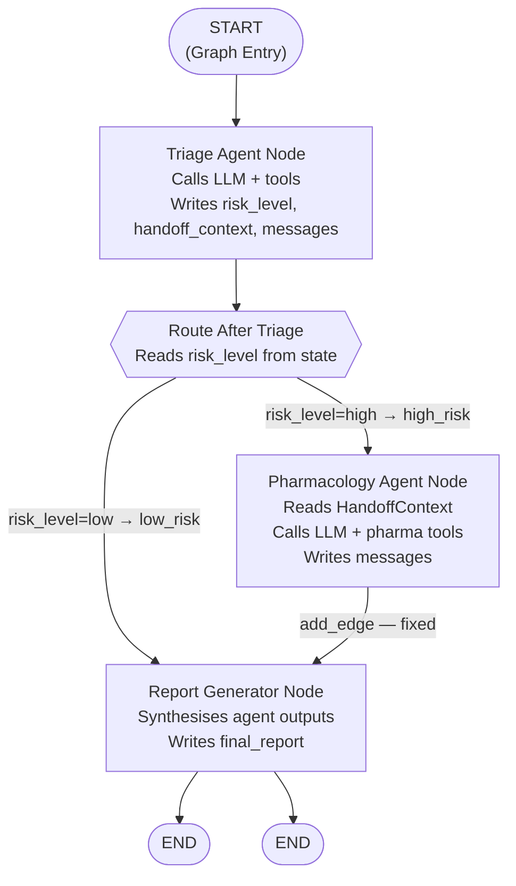
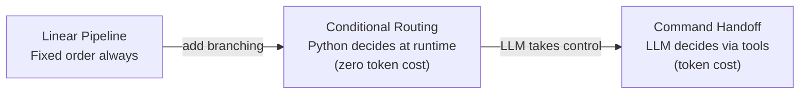

# Chapter 2 — Pattern 2: Conditional Routing

> **Prerequisite:** Read [Chapter 1 — Linear Pipeline](./01_linear_pipeline.md) first. This chapter adds branching to the pipeline — some patients follow a different path than others, and the routing decision is made by your Python code, not the LLM.

---

## 1. What Is This Pattern?

Think of an emergency department triage desk. Not every patient needs to see every specialist. When a patient arrives, the triage nurse makes a judgment: "This patient has dangerously high potassium and multiple interacting medications — they need pharmacology review." Another patient arrives: "This is a routine follow-up with normal labs — the doctor can see them directly." The nurse does not call a pharmacologist for every patient. That would waste the pharmacologist's time and delay care for patients who really need them.

**Conditional routing in LangGraph works exactly like that triage judgment.** After the triage agent runs, a Python router function inspects the state and decides which node runs next. High-risk patients go to pharmacology before the report. Low-risk patients skip pharmacology and go straight to the report. The decision is made in a few lines of pure Python — no LLM call, no extra tokens, zero cost.

The problem this pattern solves is: **how do you make routing decisions that are dynamic (depend on the data) but deterministic (produced by your code, not by an LLM's reasoning)?** The router function is a plain Python function you can unit-test by passing a dict. It is fast, cheap, and predictable.

---

## 2. When Should You Use It?

**Use this pattern when:**

- Routing depends on the outcome of the previous agent — but the routing logic itself is simple enough to express as a Python condition (e.g., `if risk_level == "high"`).
- You want routing at zero LLM token cost. A Python function that reads `state["risk_level"]` costs nothing to call compared to an LLM call that reasons about who should run next.
- The routing logic needs to be reliably unit-testable. You can test `route_after_triage({"risk_level": "high"}) == "high_risk"` without running any LLM.
- Different patients (or users, or documents) legitimately need different agent paths — some need a specialist, some do not.

**Do NOT use this pattern when:**

- The routing logic requires the LLM's reasoning to decide (e.g., "I've seen the patient's response, and based on its nuance I think cardiology, not pharmacology, is more appropriate") — use [Pattern 3 (Command Handoff)](./03_command_handoff.md) for that.
- The execution order is always the same for every input — use [Pattern 1 (Linear Pipeline)](./01_linear_pipeline.md) for simplicity.

---

## 3. How It Works — Architecture Walkthrough

### ASCII Graph (from the script's docstring)

```
[START]
   |
   v
[triage]
   |
   v
route_after_triage()        <-- Python function, no LLM call
   |
   +-- "high_risk" --> [pharmacology] --> [report] --> [END]
   |
   +-- "low_risk"  --> [report] --> [END]

Routing:  add_conditional_edges() with a router function.
Who decides: YOUR ROUTER FUNCTION (deterministic code).
LLM influence: NONE — the LLM only runs inside agent nodes.
Token cost for routing: ZERO.
```

### Step-by-Step Explanation

**Edge: START → triage**
Fixed, unconditional. The triage node always runs first.

**Node: `triage`**
Same as Pattern 1, but now writes one additional field: `risk_level`. The risk level is determined by a deterministic rule: `K+ >= 5.0 → "high"`, otherwise `"low"`. This is intentional — the routing logic must be deterministic and reproducible, not dependent on how the LLM phrased its assessment.

**Conditional edge router: `route_after_triage()`**
This Python function is called by LangGraph after `triage_node` completes. It reads `state["risk_level"]` and returns the string `"high_risk"` or `"low_risk"`. LangGraph maps those strings to node names using the mapping dict provided to `add_conditional_edges()`.

**Path 1 (high_risk): triage → pharmacology → report → END**
High-risk patients get pharmacology review. After pharmacology, a fixed `add_edge("pharmacology", "report")` always routes to report.

**Path 2 (low_risk): triage → report → END**
Low-risk patients skip pharmacology entirely and go directly to report. The `report` node handles both paths identically — it synthesises whatever agent outputs are in `messages`.

### Mermaid Flowchart



---

## 4. State Schema Deep Dive

```python
class ConditionalState(TypedDict):
    messages: Annotated[list, add_messages]  # Accumulates LLM messages
    patient_case: dict                        # Set at invocation time
    handoff_context: dict                     # Written by: triage; Read by: pharmacology
    current_agent: str                        # Written by: each agent
    handoff_history: list[str]                # Written by: each agent (appended)
    handoff_depth: int                        # Written by: each agent (incremented)
    risk_level: str                           # Written by: triage; Read by: route_after_triage
    final_report: str                         # Written by: report
```

The only new field compared to Pattern 1 is `risk_level`.

**Field: `risk_level: str`**
- **Who writes it:** `triage_node` — computes it deterministically from patient lab values: `k_val >= 5.0 → "high"`, otherwise `"low"`.
- **Who reads it:** `route_after_triage()` — the router function that returns `"high_risk"` or `"low_risk"` based on this value.
- **Why it exists as a separate field:** Keeping the routing signal in a dedicated state field separates the *assessment* (triage writes the level) from the *routing decision* (the router reads the level). You can unit-test the router by passing `{"risk_level": "high", ...}` without running the LLM. You can also monitor the distribution of risk levels without parsing agent text outputs.
- **Why deterministic, not LLM-derived:** The routing must be reproducible. If `risk_level` were extracted by asking the LLM "what is the risk level?", the same patient data could produce different answers on different runs. A rule-based computation (`K+ >= 5.0 → "high"`) always gives the same result for the same input.

> **NOTE:** In this script, `risk_level` is computed inside `triage_node` from raw lab values, *after* the LLM produces its assessment. An alternative approach (used in some production systems) is to have the LLM output a structured JSON with a `risk_level` field and parse that. Both work; the direct computation is simpler and more reliable.

---

## 5. Node-by-Node Code Walkthrough

### `route_after_triage` (router function)

```python
def route_after_triage(state: ConditionalState) -> Literal["high_risk", "low_risk"]:
    """Decide whether the patient needs pharmacology review."""
    risk = state.get("risk_level", "low")   # Read risk_level from state; default to "low" if absent
    return "high_risk" if risk == "high" else "low_risk"  # Return routing key — string only
```

**Line-by-line explanation:**
- `state.get("risk_level", "low")` — Uses `.get()` with a default of `"low"` so the function never crashes if `risk_level` was not written to state. Failing open to `"low_risk"` is safer than failing open to `"high_risk"` (which would trigger the more expensive pharmacology path).
- `return "high_risk" if risk == "high" else "low_risk"` — Returns a string key that LangGraph looks up in the mapping dict. The function itself does not know node names — it only knows routing vocabulary (`"high_risk"`, `"low_risk"`). The mapping dict translates those to node names.

**This function is NOT a node.** It does not appear in `workflow.add_node()`. It does not modify state. It is not called by any node. LangGraph calls it automatically after `triage_node` completes, as part of `add_conditional_edges()`.

**What makes this function valuable:** You can unit-test it in isolation:
```python
assert route_after_triage({"risk_level": "high"}) == "high_risk"
assert route_after_triage({"risk_level": "low"})  == "low_risk"
assert route_after_triage({})                      == "low_risk"  # default
```

No LLM mock needed. No graph execution needed. Just pass a dict and check the return value.

> **TIP:** In production, add a third routing outcome for `"critical"` (e.g., K+ > 6.5 → immediate escalation bypass pharmacology). Just add `"critical"` to the `Literal` return type, add a new case to the function, and add `"critical": "critical_escalation"` to the mapping dict. The routing logic changes in one function; no other code needs to change.

---

### `triage_node`

```python
def triage_node(state: ConditionalState) -> dict:
    """Evaluate the patient. Write risk_level to state."""
    patient_data = state["patient_case"]   # Read patient data from state

    # ... LLM call and ReAct loop (same as Pattern 1) ...

    # Determine risk level deterministically from lab values
    k_plus = patient_data.get("lab_results", {}).get("K+", "")  # Read K+ from labs
    try:
        k_val = float(k_plus.split()[0]) if k_plus else 0  # Parse "5.4 mEq/L" → 5.4
    except (ValueError, IndexError):
        k_val = 0       # Default to 0 if parsing fails — routes to low_risk safely

    risk = "high" if k_val >= 5.0 else "low"   # The routing signal

    # Build HandoffContext (only meaningful if high_risk path runs)
    handoff = HandoffContext(
        from_agent="TriageAgent",
        to_agent="PharmacologyAgent",
        reason=f"Risk level: {risk}. Pharmacology review needed.",
        patient_case=PatientCase(**patient_data),
        task_description="Check drug interactions and renal dosing.",
        relevant_findings=[
            f"K+ = {k_plus}",
            f"Medications: {', '.join(patient_data.get('current_medications', []))}",
        ],
        handoff_depth=state["handoff_depth"] + 1,
    )

    return {
        "messages": [response],                               # LLM response accumulated
        "handoff_context": handoff.model_dump(),              # Built regardless of risk level
        "current_agent": "triage",
        "handoff_history": state["handoff_history"] + ["triage"],
        "handoff_depth": state["handoff_depth"] + 1,
        "risk_level": risk,           # THE KEY ADDITION: written for the router to read
    }
```

**Key difference from Pattern 1:** The return dict now includes `"risk_level": risk`. Without this, `route_after_triage()` would read `state.get("risk_level", "low")` and always return `"low_risk"`. The routing signal must be written to state by the node that computes it.

**Why is `handoff_context` built even for low-risk patients?** The `HandoffContext` is built regardless of the risk level, because the node does not know which path the router will choose. In the low-risk path, `handoff_context` is written to state but never read by any subsequent node. This is fine — writing an unused field is harmless. It avoids adding conditional logic to the node itself.

> **WARNING:** Do not move the `risk_level` computation *into* `route_after_triage()`. The router function must be a pure reader of state — it must not compute or call external functions. If `risk_level` computation is in the router, it runs *between* nodes and its result is not written to state, so it cannot be logged, monitored, or audited. Always compute the routing signal in the node and write it to state; let the router only read it.

---

### `pharmacology_node` and `report_node`

Both are identical to Pattern 1. `pharmacology_node` reads `handoff_context` and runs its tool loop. `report_node` filters `messages` for AI text outputs and synthesises a report. The conditional routing only affects *which nodes run* — the nodes themselves are unchanged.

---

## 6. Conditional Routing Explained

### `add_conditional_edges()` Call

```python
workflow.add_conditional_edges(
    "triage",              # Source node — routing happens AFTER this node runs
    route_after_triage,    # Router function — called with current state, returns a string key
    {"high_risk": "pharmacology", "low_risk": "report"},  # Key → node name mapping
)
```

**Arguments explained:**
1. `"triage"` — After `triage_node` completes, LangGraph calls `route_after_triage(state)` instead of following a fixed edge.
2. `route_after_triage` — The router function. LangGraph passes it the full current state and uses its return value as a lookup key.
3. `{"high_risk": "pharmacology", "low_risk": "report"}` — The mapping dict. The keys are the possible return values of `route_after_triage()`. The values are the node names to route to.

**The mapping dict decouples router vocabulary from node names.** The router returns `"high_risk"` — not `"pharmacology"`. This means you can rename the `pharmacology` node to `medication_review` without touching the router function. Just update the mapping dict.

### Decision Table

| `risk_level` in state | `route_after_triage()` returns | Next Node | Path |
|----------------------|-------------------------------|-----------|------|
| `"high"` | `"high_risk"` | `pharmacology` | triage → pharmacology → report → END |
| `"low"` (or absent) | `"low_risk"` | `report` | triage → report → END |

### Token Cost Comparison

| Action | Token cost |
|--------|-----------|
| Running the LLM inside `triage_node` | ~500–2000 tokens |
| Calling `route_after_triage()` | **0 tokens** |
| Running the LLM inside `pharmacology_node` | ~500–2000 tokens |

For a low-risk patient, skipping pharmacology saves up to 2000 tokens per request. At scale (1,000 low-risk requests/day), this is significant.

---

## 7. Worked Example — Trace: Low-Risk Patient (`run_low_risk`)

**Test case from `main()`:**
```python
patient = PatientCase(
    patient_id="PT-CR-LOW",
    age=45, sex="M",
    chief_complaint="Routine follow-up, mild cough",
    current_medications=["Lisinopril 10mg daily"],
    lab_results={"K+": "4.0 mEq/L", "eGFR": "85 mL/min"},
    vitals={"BP": "128/80", "HR": "72"},
)
```

**Initial state:**
```python
{
    "messages": [],
    "patient_case": {...},
    "handoff_context": {},
    "current_agent": "none",
    "handoff_history": [],
    "handoff_depth": 0,
    "risk_level": "low",     # initial default
    "final_report": "",
}
```

---

**Step 1 — `triage_node` executes:**

LLM assesses the patient. Lab parsing: `"4.0 mEq/L"` → `k_val = 4.0` → `4.0 >= 5.0` is False → `risk = "low"`.

State AFTER `triage_node`:
```python
{
    "messages": [AIMessage(content="Triage: Routine follow-up. Normal potassium...")],
    "patient_case": {...},
    "handoff_context": {        # Built but will not be read in the low-risk path
        "from_agent": "TriageAgent",
        "to_agent": "PharmacologyAgent",
        "reason": "Risk level: low...",
        ...
    },
    "current_agent": "triage",
    "handoff_history": ["triage"],
    "handoff_depth": 1,
    "risk_level": "low",        # Key field written by triage_node
    "final_report": "",
}
```

---

**Step 2 — `route_after_triage()` is called:**

```python
risk = state.get("risk_level", "low")  # → "low"
return "low_risk"                       # Router returns this key
```

LangGraph looks up `"low_risk"` in the mapping dict: `{"high_risk": "pharmacology", "low_risk": "report"}` → routes to `report` node. **`pharmacology_node` is never called.**

---

**Step 3 — `report_node` executes:**

Filters `messages`: finds one `AIMessage` (triage's output). Synthesises from triage's output only.

State AFTER `report_node`:
```python
{
    "messages": [AIMessage(content="Triage: Routine follow-up...")],  # unchanged
    "patient_case": {...},
    "handoff_context": {...},    # still present but unused
    "current_agent": "triage",   # unchanged — report didn't write this
    "handoff_history": ["triage"],  # unchanged — report didn't write this
    "handoff_depth": 1,
    "risk_level": "low",
    "final_report": "Key Findings:\n• Normal potassium (4.0 mEq/L)...\nActions:\n1. Continue Lisinopril at current dose...",
}
```

---

**Step 4 — Graph reaches END:**

`graph.invoke()` returns. The caller reads:
```python
result["handoff_history"]   # → ["triage"]          — pharmacology never ran
result["risk_level"]        # → "low"               — confirms routing decision
result["final_report"]      # → clinical summary from triage only
```

The pharmacology node never ran. No pharmacology LLM call was made. Zero pharmacology tokens were spent.

**Contrast with the high-risk trace:** For `PT-CR-HIGH` (K+ = 5.4), `route_after_triage()` returns `"high_risk"`, pharmacology runs, and `handoff_history` becomes `["triage", "pharmacology"]`.

---

## 8. Key Concepts Introduced

- **`add_conditional_edges(source, router_fn, mapping_dict)`** — The LangGraph method for wiring a conditional edge from a source node. After the source node completes, LangGraph calls `router_fn(state)` and uses the returned string as a key in `mapping_dict` to find the next node. First appears in `workflow.add_conditional_edges("triage", route_after_triage, {...})`.

- **Router function** — A plain Python function with signature `(state: YourTypedDict) -> str`. It reads state, applies deterministic logic, and returns a string key. It is not a node, does not modify state, and costs zero tokens. First appears as `route_after_triage`.

- **Routing signal as state field** — The convention of writing the routing decision signal (here `risk_level`) as a named field in state, so the router can read it, and so it is available for monitoring and audit. First appears at `"risk_level": risk` in `triage_node`'s return dict.

- **Mapping dict decoupling** — The `{"high_risk": "pharmacology", "low_risk": "report"}` dict separates the router's vocabulary from the graph's node names. The router does not need to know node names; the mapping handles the translation. First appears in `add_conditional_edges(..., {"high_risk": "pharmacology", "low_risk": "report"})`.

- **Zero-cost routing** — Routing decisions made by Python functions (not LLM calls) have zero token cost. This is a fundamental design principle: put routing logic in Python when possible; use LLMs only when the routing decision genuinely requires reasoning. First demonstrated by `route_after_triage`.

---

## 9. Common Mistakes and How to Avoid Them

### Mistake 1: Computing `risk_level` inside the router function instead of the node

**What goes wrong:** You move the `K+ >= 5.0` check into `route_after_triage()` and remove `"risk_level"` from state. The routing works, but `risk_level` is never persisted — you cannot monitor the distribution of risk levels, and the routing logic is hidden.

**Why it goes wrong:** The router function is ephemeral — it runs between nodes and its computations are not captured in state. A computed routing signal in the router is invisible to observability tools, audit logs, and downstream nodes that might want to read it.

**Fix:** Always compute the routing signal in the node, write it to state, and have the router only read it.

---

### Mistake 2: Returning a key not in the mapping dict from the router

**What goes wrong:** `route_after_triage()` returns `"medium_risk"` for a K+ between 4.5 and 5.0. But the mapping dict only has `"high_risk"` and `"low_risk"`. LangGraph raises a `ValueError` at runtime.

**Why it goes wrong:** Every string the router can return must be a key in the mapping dict. If any possible return value is not in the mapping dict, the graph raises a runtime error.

**Fix:** Ensure the `Literal` type annotation for the router's return type matches the keys in the mapping dict exactly. Add `"medium_risk": "pharmacology"` (or a dedicated `"medium_review"` node) if you need a third path.

---

### Mistake 3: LangGraph state immutability — using `+=` on `handoff_history`

**What goes wrong:** In `triage_node`, you write `state["handoff_history"] += ["triage"]` thinking this is equivalent to returning a new list.

**Why it goes wrong:** `+=` on a list mutates the list in-place (it calls `list.__iadd__()`). This is identical to calling `.append()` — it modifies the existing object in LangGraph's state snapshot without producing a new value for LangGraph to merge. In checkpointing mode, this mutation is silently lost.

**Fix:** Always use `state["handoff_history"] + ["triage"]` (returns a new list) in the return dict.

---

### Mistake 4: Using the router function's logic inside the node to skip other nodes

**What goes wrong:** Inside `triage_node`, you add `if risk == "low": return {"...", "skip_pharma": True}` and then handle the `skip_pharma` flag in `pharmacology_node` with an early return.

**Why it goes wrong:** This moves routing logic into nodes, where it is invisible in traces and defeats the purpose of conditional routing. The graph still shows triage → pharmacology → report in every trace, even when pharmacology does nothing. Monitoring tools see pharmacology ran; it actually did nothing.

**Fix:** Use `add_conditional_edges()`. When low-risk, the router routes *directly* to report. Pharmacology never runs, never appears in traces, and never costs tokens.

---

### Mistake 5: Forgetting to add the fixed edge from pharmacology to report

**What goes wrong:** You add the conditional edge `triage → (high_risk: pharmacology, low_risk: report)` but forget `workflow.add_edge("pharmacology", "report")`. High-risk patients: triage → pharmacology → dead end. LangGraph raises `GraphInterrupt`.

**Why it goes wrong:** `add_conditional_edges()` only replaces the edge *from* the source node (`triage`). The edges *from* nodes on other paths (pharmacology → report) still need to be explicitly wired.

**Fix:** After all conditional edges, check that every non-terminal node has at least one outgoing edge (fixed or conditional).

---

## 10. How This Pattern Connects to the Others

### Position in the Learning Sequence

Pattern 2 is the second step. It takes the fixed pipeline from Pattern 1 and adds the first dynamic decision: `add_conditional_edges()`. After this chapter, you understand both fixed (`add_edge`) and conditional (`add_conditional_edges`) wiring, and the concept of a router function as a pure Python decision point.

### What the Previous Pattern Does NOT Handle

Pattern 1 (Linear Pipeline) is all-or-nothing: every patient goes through every agent. It cannot skip pharmacology for low-risk patients. Adding an `if/else` check inside a node to "pretend" to skip would hide the routing from traces and still incur the pharmacology node's startup cost. Pattern 2 solves this with true graph-level branching.

### What the Next Pattern Adds

[Pattern 3 (Command Handoff)](./03_command_handoff.md) replaces the Python router with an LLM-driven routing mechanism. Instead of your code reading `risk_level` and deciding, the LLM agent calls a *transfer tool* — a special `@tool` function that returns a `Command(goto=, update=)` object. This `Command` object itself drives routing. The trade-off: the LLM has full autonomy to choose which specialist to invoke (even ones you did not anticipate), but routing now costs tokens and is no longer deterministic.

### Combined Topology

Patterns 1 and 2 form the deterministic routing backbone. Pattern 3 adds LLM autonomy on top:



---

## 11. Quick-Reference Summary

| Aspect | Detail |
|--------|--------|
| **Pattern name** | Conditional Routing |
| **Script file** | `scripts/handoff/conditional_routing.py` |
| **Graph nodes** | `triage`, `pharmacology`, `report` |
| **Router function** | `route_after_triage()` — reads `risk_level`, returns `"high_risk"` or `"low_risk"` |
| **Routing type** | `add_conditional_edges()` — binary, Python-driven, zero token cost |
| **State fields** | `messages`, `patient_case`, `handoff_context`, `current_agent`, `handoff_history`, `handoff_depth`, `risk_level`, `final_report` |
| **New concepts** | `add_conditional_edges()`, router functions, routing signals as state fields, mapping dict decoupling |
| **Prerequisite** | [Chapter 1 — Linear Pipeline](./01_linear_pipeline.md) |
| **Next pattern** | [Chapter 3 — Command Handoff](./03_command_handoff.md) |

---

*Continue to [Chapter 3 — Command Handoff](./03_command_handoff.md).*
