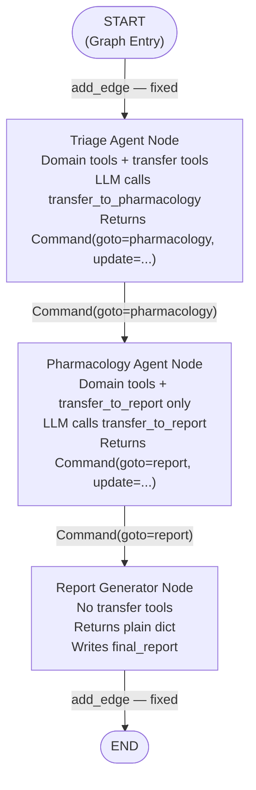
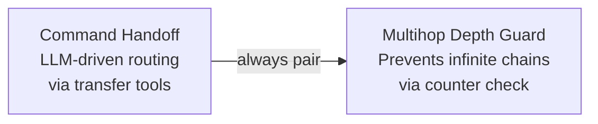

# Chapter 3 — Pattern 3: Command Handoff

> **Prerequisite:** Read [Chapter 2 — Conditional Routing](./02_conditional_routing.md) first. This chapter replaces your Python router function with something more powerful and more dangerous: the LLM itself decides who runs next, by calling a transfer tool that returns a routing Command.

---

## 1. What Is This Pattern?

Think of a junior consultant in a large hospital who has access to a hospital-wide intercom system. After examining a patient, they do not wait for a supervisor to tell them who to call next. They press the intercom button, announce "Connecting to Pharmacology — reason: elevated potassium with dual K+-raising agents," and the system routes the case to the pharmacology station. The pharmacologist picks up, reviews the case, then calls the report desk directly with their findings.

**Command handoff in LangGraph is that intercom system.** Each agent has access to special "transfer tools" — `@tool` functions — alongside their regular domain tools. After completing their assessment, the LLM agent calls a transfer tool (e.g., `transfer_to_pharmacology(reason="...", urgent_findings=[...])`). That tool returns a `Command` object — a LangGraph type that atomically specifies *where to go next* and *what to add to state*. LangGraph reads the `Command` and routes execution without needing a router function or `add_conditional_edges()`.

The problem this pattern solves is: **how do you give the LLM routing autonomy while keeping the graph structure intact?** In Pattern 2, your Python code determined routing based on `risk_level`. Here, the LLM determines routing based on its own reasoning about the case. It can choose *which* specialist to call, *why*, and *what* to tell them — all in one tool call.

---

## 2. When Should You Use It?

**Use this pattern when:**

- The routing decision requires the LLM's reasoning — not a simple Python condition. For example, "after examining this patient, I determine they need cardiology, not pharmacology, because of the elevated troponin."
- The set of possible next agents is not fully predictable at build time, and you want the LLM to choose from a menu of specialists.
- You want the handoff context (reason, findings) to be composed by the LLM in natural language rather than by a structured Python computation.
- You are building a highly flexible multi-specialist triage system where the routing logic evolves with clinical knowledge in the LLM's prompting.

**Do NOT use this pattern when:**

- Routing is deterministic and testable — use [Pattern 2 (Conditional Routing)](./02_conditional_routing.md) for zero-token-cost routing.
- You need a persistent coordinator that sees all accumulated results before deciding — use [Pattern 4 (Supervisor)](./04_supervisor.md).
- You use this pattern without a depth guard — LLM-driven chains can loop. **Always pair Command Handoff with [Pattern 5 (Depth Guard)](./05_multihop_depth_guard.md)** in production.

---

## 3. How It Works — Architecture Walkthrough

### ASCII Graph (from the script's docstring)

```
[START]
   |
   v
[triage]
   |
   | LLM calls transfer_to_pharmacology(reason=..., findings=[...])
   |   -> tool returns Command(goto="pharmacology", update={...})
   v
[pharmacology]
   |
   | LLM calls transfer_to_report(summary=...)
   |   -> tool returns Command(goto="report", update={...})
   v
[report]
   |
   v
 [END]

Routing:  Command objects returned by handoff tools.
Who decides: THE LLM (via tool selection).
Token cost: same as a regular tool call.
```

### Step-by-Step Explanation

**Edge: START → triage**
Fixed, unconditional. Triage always runs first.

**Node: `triage_node` — with transfer tools**
Triage has *two kinds* of tools bound:
1. Domain tools (`analyze_symptoms`, `assess_patient_risk`) — for clinical assessment.
2. Transfer tools (`transfer_to_pharmacology`, optionally `transfer_to_report`) — for handoff.

The LLM sees both tool sets. After using domain tools to assess the patient, it calls a transfer tool. Detecting a transfer tool call, the node *immediately returns the `Command` object* from that tool call. LangGraph reads the `Command(goto="pharmacology", update={...})` and routes execution to the pharmacology node, merging the `update` dict into state.

**`Command` object mechanics:**
A `Command` object (from `langgraph.types`) has two main fields:
- `goto: str` — the name of the next node to execute.
- `update: dict` — a partial state update to merge into state, identical to what a node normally returns.

When a node returns a `Command` instead of a plain dict, LangGraph uses `goto` for routing and `update` for state merging. This is why Command handoff nodes do NOT need `add_conditional_edges()` — the Command itself encodes the routing decision.

**Node: `pharmacology_node` — with transfer_to_report only**
Pharmacology gets domain tools plus only `transfer_to_report` (not `transfer_to_pharmacology` — it should not transfer to itself or back to triage). After its drug review, it calls `transfer_to_report(summary="...")` which returns `Command(goto="report", update={...})`.

**Node: `report_node` — plain dict return**
Report has no transfer tools. It is the terminal synthesis node. It returns a plain dict (not a `Command`), and it connects to `END` via a fixed `add_edge("report", END)`.

### Mermaid Flowchart



---

## 4. State Schema Deep Dive

```python
class CommandState(TypedDict):
    messages: Annotated[list, add_messages]  # Accumulated LLM messages
    patient_case: dict                        # Set at invocation time
    handoff_context: dict                     # Written by: transfer tools via Command(update=)
    current_agent: str                        # Written by: transfer tools via Command(update=)
    handoff_history: list[str]                # Written by: transfer tools via Command(update=)
    handoff_depth: int                        # Written by: transfer tools via Command(update=)
    max_handoff_depth: int                    # Set at invocation time — read by transfer tools
    final_report: str                         # Written by: report_node
```

**The key difference from Patterns 1 and 2:** Most state fields are now written by `Command(update=...)` from transfer tool calls, not by node `return` dicts. The node returns the `Command` object and LangGraph applies its `update` dict to state.

**Field: `max_handoff_depth: int`**
- **Who writes it:** Set at invocation time.
- **Who reads it:** `create_transfer_tools(current_depth, max_depth)` — the factory passes `max_depth` into the transfer tool closures, where it is checked before routing.
- **Why it exists as a separate field:** Putting the depth limit in state (instead of hardcoding it) makes the same compiled graph configurable. A research interface might pass `max_handoff_depth=2`; an emergency triage system might pass `max_handoff_depth=4`. Same graph, different safety limits.

**Field: `handoff_context: dict`**
- **Who writes it:** The `Command(update={"handoff_context": {...}})` from `transfer_to_pharmacology()`. The LLM composes the `reason` and `urgent_findings` fields.
- **Who reads it:** `pharmacology_node` — reads `handoff.get("urgent_findings", [])` and `handoff.get("reason", ...)`.
- **Key difference from earlier patterns:** In Patterns 1–2, triage built a `HandoffContext` Pydantic object. Here, the LLM composes the handoff context as arguments to the transfer tool, and the transfer tool writes a plain dict via `Command(update=)`. The structure is simpler but also less enforced by Pydantic validation.

---

## 5. Node-by-Node Code Walkthrough

### `create_transfer_tools(current_depth, max_depth)` — Tool Factory

```python
def create_transfer_tools(current_depth: int, max_depth: int):
    """Create handoff tools bound to the current depth."""

    @tool
    def transfer_to_pharmacology(
        reason: str,                  # Why the handoff is happening (LLM composes this)
        urgent_findings: list[str],   # 3-5 key findings for the pharmacologist (LLM composes this)
    ) -> Command:
        """Transfer this case to pharmacology. Call this when you identify:
        - Dangerous drug combinations
        - Renal dosing concerns (low eGFR)
        - Elevated potassium with potassium-raising agents"""

        if current_depth >= max_depth:
            # Depth guard inside the transfer tool: if at limit, route to report instead
            return Command(
                goto="report",          # Redirect to report — not to pharmacology
                update={
                    "handoff_context": {"blocked": True, "reason": f"Depth limit ({max_depth}) reached."},
                    "handoff_depth": current_depth + 1,
                    "handoff_history": ["depth_guard_redirect"],
                },
            )

        return Command(
            goto="pharmacology",           # Route to pharmacology node
            update={
                "handoff_context": {       # The context pharmacology will read
                    "from_agent": "triage",
                    "to_agent": "pharmacology",
                    "reason": reason,                  # LLM-composed reason
                    "urgent_findings": urgent_findings, # LLM-composed findings list
                },
                "current_agent": "triage",
                "handoff_depth": current_depth + 1,   # Increment depth
                "handoff_history": ["triage"],         # Record triage ran
            },
        )

    @tool
    def transfer_to_report(summary: str) -> Command:
        """Transfer to report when analysis is complete."""
        return Command(
            goto="report",                 # Route to report node
            update={
                "handoff_context": {
                    "from_agent": "pharmacology",
                    "summary": summary,    # LLM-composed summary for report
                },
                "current_agent": "pharmacology",
                "handoff_depth": current_depth + 1,
                "handoff_history": ["pharmacology"],
            },
        )

    return [transfer_to_pharmacology, transfer_to_report]
```

**Why is this a factory function (not just two `@tool` definitions)?**
The transfer tools need `current_depth` and `max_depth` to enforce the depth guard. These values come from `state["handoff_depth"]` and `state["max_handoff_depth"]` — runtime values that only exist when a node is executing. Python's `@tool` decorator creates the function object at class definition time, not at call time. The factory pattern (`create_transfer_tools(current_depth, max_depth)`) creates *fresh tool closures* each time a node runs, capturing the current depth values via closure.

**`Command(goto=, update=)`** — The LangGraph routing object (from `langgraph.types import Command`):
- `goto: str` — The name of the next node. This is what drives routing. LangGraph reads this field after the node returns and moves execution to that node.
- `update: dict` — A partial state update, merged into state exactly like a node's `return` dict. Whatever is in `update` is applied to the state before the `goto` node runs.

**What happens when the depth guard trips:** `current_depth >= max_depth` → the tool returns `Command(goto="report", ...)` instead of `Command(goto="pharmacology", ...)`. The LLM called `transfer_to_pharmacology` but the tool internally redirected to `report`. The LLM does not know this happened — it called the tool, got the Command back, the node returned it, and LangGraph executed it. This is a silent redirect enforced by the tool itself.

> **TIP:** In production, add alerting to the depth guard branch: call `send_alert(event="depth_guard_tripped", depth=current_depth, patient_id=...)` before returning the redirected Command. This produces a monitoring event every time the guard fires, so you can track how often LLM chains exceed their budget.

---

### `triage_node`

```python
def triage_node(state: CommandState) -> Command:
    """Triage agent with domain tools AND transfer tools."""

    # Create transfer tools with current depth from state
    transfer_tools = create_transfer_tools(
        state["handoff_depth"],      # Current depth — passed to tool closures
        state["max_handoff_depth"]   # Max allowed depth — passed to tool closures
    )
    all_tools = triage_domain_tools + transfer_tools    # Both tool sets visible to LLM
    triage_llm = llm.bind_tools(all_tools)              # LLM can call any of these tools

    # ... LLM call and ReAct loop ...

    # Process tool calls — domain tools and transfer tools are handled differently
    while hasattr(response, "tool_calls") and response.tool_calls:
        for tc in response.tool_calls:

            transfer_tool_names = [t.name for t in transfer_tools]  # "transfer_to_pharmacology", etc.
            if tc["name"] in transfer_tool_names:
                # Transfer tool called: execute it, get the Command, return immediately
                transfer_fn = next(t for t in transfer_tools if t.name == tc["name"])
                cmd = transfer_fn.invoke(tc["args"])   # Returns a Command object
                print(f"    | -> Command(goto={cmd.goto})")
                return cmd    # Return the Command — exits the node immediately

        # Regular domain tools: execute via ToolNode, continue the ReAct loop
        tool_node = ToolNode(triage_domain_tools)
        tool_results = tool_node.invoke({"messages": [response]})
        messages.extend([response] + tool_results["messages"])
        response = triage_llm.invoke(messages, config=config)

    # Fallback: if LLM never called a transfer tool, route to report directly
    return Command(
        goto="report",
        update={
            "messages": [response],
            "current_agent": "triage",
            "handoff_history": state["handoff_history"] + ["triage"],
            "handoff_depth": state["handoff_depth"] + 1,
        },
    )
```

**Key design: why does the node return `Command` instead of `dict`?**
When a transfer tool is called, the node must stop processing and let LangGraph route to the next node. Returning a `Command` from a node is LangGraph's mechanism for this: instead of merging a dict and continuing to the next edge in the graph, LangGraph reads `cmd.goto` and routes execution there, merging `cmd.update` into state.

**The `return cmd` immediately exits the node.** The `while` loop stops. The triage agent does not continue reasoning after a transfer call. This is analogous to the intercom example: the triage specialist presses the button and hands off. They do not continue working on the case.

**The fallback `Command(goto="report", ...)` handles the case where the LLM never calls a transfer tool.** This is fail-safe behaviour: if the LLM produces a final text response without calling any transfer tool, the case still reaches the report node with whatever the triage agent produced.

**What breaks if you remove this node:** The graph has no triage node. LangGraph raises a compile-time error. More importantly, no initial assessment is generated and no transfer tool is called — the pharmacology node is never reached.

---

### `pharmacology_node`

```python
def pharmacology_node(state: CommandState) -> Command:
    """Pharmacology agent with domain tools and transfer_to_report only."""

    handoff = state.get("handoff_context", {})   # Read what triage's Command wrote
    findings = handoff.get("urgent_findings", [])  # The LLM-composed findings
    reason = handoff.get("reason", "Direct review")

    # Create transfer tools — pharmacology only gets transfer_to_report
    transfer_tools = create_transfer_tools(state["handoff_depth"], state["max_handoff_depth"])
    report_tool = [t for t in transfer_tools if t.name == "transfer_to_report"]  # Only this one

    all_tools = pharma_domain_tools + report_tool  # Pharmacology tools + transfer_to_report
    pharma_llm = llm.bind_tools(all_tools)

    # ... LLM call and ReAct loop, same pattern as triage ...

    # When transfer_to_report is called:
    if tc["name"] == "transfer_to_report":
        cmd = report_tool[0].invoke(tc["args"])   # Execute transfer_to_report
        return cmd                                 # Returns Command(goto="report", ...)
```

**Why does pharmacology only get `transfer_to_report` and not `transfer_to_pharmacology`?**
Pharmacology should not be able to call itself recursively or re-route to triage. The tool set available to each agent defines the set of agents it can hand off to. This is an explicit design constraint enforced by which transfer tools are included in `bind_tools()`.

> **WARNING:** If you accidentally give pharmacology access to `transfer_to_pharmacology`, the LLM could theoretically call `transfer_to_pharmacology` from inside `pharmacology_node`, routing back to `pharmacology_node` and creating an infinite loop. The depth guard would eventually stop it, but not before wasting multiple LLM call rounds. Always curate the transfer tool set for each agent.

---

### `report_node`

```python
def report_node(state: CommandState) -> dict:
    """Synthesise findings into a clinical summary — plain dict return."""

    handoff = state.get("handoff_context", {})     # May contain a summary from pharmacology
    summary = handoff.get("summary", "No summary provided.")  # LLM-composed summary

    # Filter messages and synthesise (same as earlier patterns)
    # ...

    return {"final_report": response.content}   # Plain dict — not a Command
```

`report_node` returns a plain dict (not a `Command`) because it is the terminal node. It connects to `END` via `workflow.add_edge("report", END)`. There is nothing to route to after report.

---

## 6. Command Routing Explained

### How Nodes Return `Command` Instead of Dicts

In Patterns 1 and 2, all nodes return `dict`. In Pattern 3, triage and pharmacology nodes return `Command`. LangGraph handles both:

- **Node returns `dict`:** LangGraph merges it into state and follows the next edge in the graph topology (fixed or conditional).
- **Node returns `Command`:** LangGraph applies `cmd.update` to state and routes to `cmd.goto` — bypassing the graph's wired edges entirely.

This means there is no `add_conditional_edges("triage", ...)` in this script. The routing is embedded in the `Command` objects that transfer tools produce.

### Graph Wiring (what's in `build_command_pipeline`)

```python
workflow.add_edge(START, "triage")   # Fixed: always start at triage
# triage → (Command decides) — no add_edge or add_conditional_edges
# pharmacology → (Command decides) — no add_edge or add_conditional_edges
workflow.add_edge("report", END)     # Fixed: report always goes to END
```

### Decision Table

| Agent | Tool Called | `Command.goto` | What Updates in State | Next Node |
|-------|------------|----------------|----------------------|-----------|
| Triage | `transfer_to_pharmacology(reason, findings)` | `"pharmacology"` | `handoff_context`, `handoff_depth`, `handoff_history` | `pharmacology` |
| Triage | `transfer_to_pharmacology` (depth >= max) | `"report"` | `handoff_context` (blocked flag), `handoff_depth` | `report` |
| Triage | No transfer tool called (fallback) | `"report"` | `messages`, `handoff_depth`, `handoff_history` | `report` |
| Pharmacology | `transfer_to_report(summary)` | `"report"` | `handoff_context` (summary), `handoff_depth` | `report` |
| Pharmacology | No transfer tool called (fallback) | `"report"` | `messages`, `handoff_depth`, `handoff_history` | `report` |

---

## 7. Worked Example — Trace: Full Pipeline via Transfer Tools

**Patient from `main()`:**
```python
patient = PatientCase(
    patient_id="PT-CMD-001",
    age=71, sex="F",
    chief_complaint="Dizziness and fatigue after medication change",
    current_medications=["Lisinopril 20mg daily", "Spironolactone 25mg daily", ...],
    lab_results={"eGFR": "42 mL/min", "K+": "5.4 mEq/L"},
)
```

**Initial state:**
```python
{
    "messages": [],
    "patient_case": {...},
    "handoff_context": {},
    "current_agent": "none",
    "handoff_history": [],
    "handoff_depth": 0,
    "max_handoff_depth": 4,
    "final_report": "",
}
```

---

**Step 1 — `triage_node` executes:**

LLM receives triage tools + transfer tools. After running `analyze_symptoms` and `assess_patient_risk`, it produces a response. Then it calls:
```
transfer_to_pharmacology(
    reason="Patient on dual K+-raising agents with K+ 5.4 mEq/L and low eGFR...",
    urgent_findings=[
        "Critical: K+ 5.4 mEq/L with Lisinopril + Spironolactone — hyperkalemia risk",
        "Metformin contraindicated at eGFR 42 mL/min",
        "BP 105/65 — possible over-treatment of hypertension",
    ]
)
```

Transfer tool executes: `current_depth=0 < max_depth=4` → depth guard passes → returns:
```python
Command(
    goto="pharmacology",
    update={
        "handoff_context": {
            "from_agent": "triage",
            "to_agent": "pharmacology",
            "reason": "Patient on dual K+-raising agents...",
            "urgent_findings": ["Critical: K+ 5.4...", "Metformin...", "BP..."],
        },
        "current_agent": "triage",
        "handoff_depth": 1,
        "handoff_history": ["triage"],
    },
)
```

`triage_node` returns this `Command`. LangGraph applies `update` to state and routes to `"pharmacology"`.

State AFTER `triage_node` (merged from Command.update):
```python
{
    "messages": [],               # Note: triage's messages were NOT added in the Command path
    "patient_case": {...},
    "handoff_context": {
        "from_agent": "triage",
        "reason": "Patient on dual K+-raising agents...",
        "urgent_findings": [...],
    },
    "current_agent": "triage",
    "handoff_history": ["triage"],
    "handoff_depth": 1,
    "max_handoff_depth": 4,
    "final_report": "",
}
```

---

**Step 2 — `pharmacology_node` executes:**

Reads `handoff_context["urgent_findings"]`. Calls `check_drug_interactions` and `calculate_dosage_adjustment`. Then calls:
```
transfer_to_report(
    summary="Critical hyperkalaemia risk from Lisinopril+Spironolactone combination..."
)
```

Command returned: `Command(goto="report", update={"handoff_context": {"summary": "Critical..."}, "handoff_depth": 2, ...})`.

State AFTER `pharmacology_node` (merged):
```python
{
    "messages": [],
    "patient_case": {...},
    "handoff_context": {"from_agent": "pharmacology", "summary": "Critical hyperkalaemia..."},
    "current_agent": "pharmacology",
    "handoff_history": ["triage", "pharmacology"],  # accumulation from Command history
    "handoff_depth": 2,
    "max_handoff_depth": 4,
    "final_report": "",
}
```

---

**Step 3 — `report_node` executes:**

Reads `handoff_context["summary"]`. Synthesises final report. Returns plain dict.

State AFTER `report_node`:
```python
{
    ...
    "final_report": "Key Findings:\n• Critical: Lisinopril + Spironolactone...\nActions:\n1. Reduce Spironolactone dose...",
}
```

---

## 8. Key Concepts Introduced

- **`Command(goto=, update=)`** — A LangGraph object from `langgraph.types` that a node can return instead of a plain dict. `goto` specifies the next node (overrides graph wiring); `update` specifies state changes to apply (identical to a regular return dict). First appears in `transfer_to_pharmacology`'s `return Command(goto="pharmacology", ...)`.

- **Transfer tools** — `@tool` functions that return `Command` objects. The LLM calls them to initiate a handoff. They produce both the routing decision (`goto`) and the state update (`update`) atomically. First appears as `transfer_to_pharmacology` and `transfer_to_report`.

- **Tool factory pattern** — `create_transfer_tools(current_depth, max_depth)` creates tool closures that capture runtime values from state. This is needed because tools are Python objects created before the node runs, but they need access to runtime state values. First appears in `create_transfer_tools`.

- **Mixed tool sets per agent** — Each agent binds both domain tools and (a subset of) transfer tools. Domain tools return regular values; transfer tools return `Command` objects. The node detects which type of tool was called and handles each differently. First demonstrated in `triage_node`'s `if tc["name"] in transfer_tool_names:` check.

- **Depth guard inside a transfer tool** — The `if current_depth >= max_depth: return Command(goto="report", ...)` pattern inside `transfer_to_pharmacology` silently redirects to report instead of pharmacology when the depth limit is reached. This is the embryonic form of the full depth guard developed in [Pattern 5](./05_multihop_depth_guard.md). First appears in `transfer_to_pharmacology`.

---

## 9. Common Mistakes and How to Avoid Them

### Mistake 1: Deploying Command Handoff without any depth guard

**What goes wrong:** Triage calls `transfer_to_pharmacology`, pharmacology calls `transfer_to_cardiologist` (if you add that tool), cardiologist calls `transfer_to_triage` to ask a follow-up question. The chain loops indefinitely, spending tokens on every iteration.

**Why it goes wrong:** LLM-driven routing has no structural loop prevention. Unlike fixed edges (which are acyclic by construction) or Python routers (which you control), LLM tool calls can produce any routing sequence the LLM reasons into.

**Fix:** Always set `max_handoff_depth` in initial state and implement the depth guard check inside every transfer tool. See [Pattern 5 (Multihop Depth Guard)](./05_multihop_depth_guard.md) for the full treatment.

---

### Mistake 2: LangGraph state immutability — setting `handoff_history` in Command.update as a direct list

**What goes wrong:** In `transfer_to_pharmacology`, you write `"handoff_history": ["triage"]` in the `Command.update` dict. This *replaces* the entire `handoff_history` list with `["triage"]`. If triage runs twice (hypothetically), the history is lost.

**Why it goes wrong:** `Command.update` is merged into state like a regular return dict. For fields without a reducer annotation, the new value replaces the old one. `handoff_history` has no `add_messages`-style reducer, so `["triage"]` overwrites whatever was there before.

**Fix:** For accumulator-style fields, build the new value from the current state inside the node (before creating the Command), or store it in the node and pass the accumulated result to the Command. In this script, the simplicity of a single-hop chain means overwriting is acceptable; in a multi-hop chain it would lose history.

---

### Mistake 3: Continuing to process after a transfer tool call

**What goes wrong:** Inside the `while response.tool_calls:` loop, you detect a transfer tool call but continue the loop instead of returning the Command immediately. The LLM gets another turn and may call the transfer tool again or produce conflicting output.

**Why it goes wrong:** After calling a transfer tool, the handoff has been decided. Allowing the LLM more turns can produce a second `Command`, duplicate state writes, or a contradictory `goto`.

**Fix:** As soon as a transfer tool call is detected and the `Command` is obtained, `return cmd` immediately. This exits the node and hands control to LangGraph.

---

### Mistake 4: Giving all agents all transfer tools

**What goes wrong:** You bind `[transfer_to_pharmacology, transfer_to_report]` to both triage and pharmacology. Pharmacology can now call `transfer_to_pharmacology` — routing back to itself or to triage for a "follow-up," creating a loop.

**Why it goes wrong:** Transfer tools define which agents an agent can hand off to. If every agent can hand off to every other agent, the routing graph becomes fully connected and the depth guard is the only protection.

**Fix:** Curate the transfer tool set for each agent. Triage gets `[transfer_to_pharmacology]`. Pharmacology gets `[transfer_to_report]`. Make the routing topology explicit through tool availability.

---

### Mistake 5: Forgetting that `Command.update` does not use reducers

**What goes wrong:** You expect `Command(goto="pharma", update={"messages": [response]})` to accumulate `response` via the `add_messages` reducer (like a normal `return {"messages": [response]}` from a node).

**Why it goes wrong:** Reducers specified in `Annotated[list, add_messages]` are applied when a node returns a dict. When a node returns a `Command`, `Command.update` is applied to state — but **reducer behaviour for `Command.update` may differ from normal return dicts** depending on the LangGraph version. Always verify this behaviour in your version.

**Fix:** For safety, keep message-accumulating logic in normal node return dicts (not in `Command.update`). In this script, the messages field is notably absent from `Command.update` — the transfer tool writes only context and metadata, not the LLM's message content. This avoids the issue entirely.

---

## 10. How This Pattern Connects to the Others

### Position in the Learning Sequence

Pattern 3 is the third step and the first to give the LLM routing autonomy. It introduces `Command`, transfer tools, and the tool factory pattern. After this chapter, you understand the three routing mechanisms (fixed edge, Python router, LLM-driven Command) and their trade-offs.

### What the Previous Pattern Does NOT Handle

Pattern 2 (Conditional Routing) routes based on a Python condition. What it cannot do:
- Choose *which* specialist to call based on clinical reasoning (e.g., "this patient needs cardiology, not pharmacology").
- Compose the handoff reason and findings in natural language based on the full clinical picture.
- Route to a specialist that was not explicitly anticipated in the router's `if/else` logic.

Pattern 3 enables all three by letting the LLM decide.

### What the Next Pattern Adds

[Pattern 4 (Supervisor)](./04_supervisor.md) introduces a different model for LLM-driven routing: instead of peer-to-peer handoffs (triage hands to pharmacology, pharmacology hands to report), a central supervisor LLM coordinates all workers. Workers always return to the supervisor after completing their task. The supervisor decides who runs next after seeing cumulative results. This is better for workflows where the supervisor needs to see agent A's findings before deciding whether to run agent B.

### Combined Topology: Command Handoff + Depth Guard

The canonical pairing:



---

## 11. Quick-Reference Summary

| Aspect | Detail |
|--------|--------|
| **Pattern name** | Command Handoff |
| **Script file** | `scripts/handoff/command_handoff.py` |
| **Graph nodes** | `triage`, `pharmacology`, `report` |
| **Routing mechanism** | Nodes return `Command(goto=, update=)` from transfer tool calls |
| **Who decides routing** | The LLM — by selecting which transfer tool to call |
| **State fields** | `messages`, `patient_case`, `handoff_context`, `current_agent`, `handoff_history`, `handoff_depth`, `max_handoff_depth`, `final_report` |
| **New concepts** | `Command(goto=, update=)`, transfer tools, tool factory pattern, mixed tool sets, depth guard inside transfer tools |
| **Prerequisite** | [Chapter 2 — Conditional Routing](./02_conditional_routing.md) |
| **Next pattern** | [Chapter 4 — Supervisor](./04_supervisor.md) |

---

*Continue to [Chapter 4 — Supervisor](./04_supervisor.md).*
