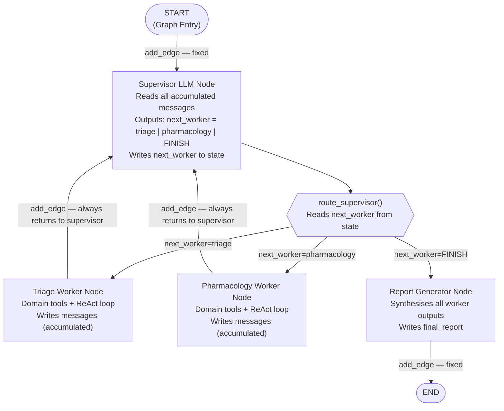
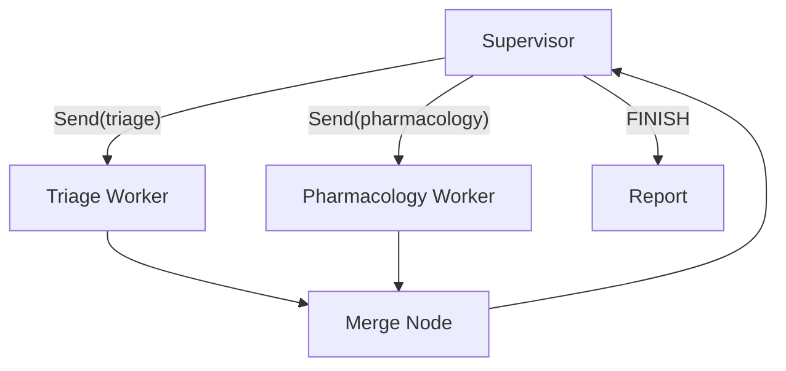

# Chapter 4 — Pattern 4: Supervisor

> **Prerequisite:** Read [Chapter 3 — Command Handoff](./03_command_handoff.md) first. This chapter introduces a central coordinator — a supervisor LLM — that dispatches workers and decides when the workflow is done, instead of having each agent decide its own successor.

---

## 1. What Is This Pattern?

Think of a hospital department head who coordinates a multi-specialist consultation. A patient arrives. The department head reads the case and says, "I want triage to assess first." After triage reports back, the department head reviews their findings and says, "Now pharmacology needs to review the medications." After pharmacology reports, the department head reviews again and decides, "I have enough information. Generate the report." The department head never performs any clinical work themselves — their only job is to read what each specialist has produced and decide who acts next, until the case is complete.

**The Supervisor pattern in LangGraph works exactly like that department head.** A central `supervisor_node` — an LLM — decides which worker runs next by outputting a structured decision (`next_worker`). Each worker node completes its task and then always returns to the supervisor. The supervisor sees the cumulative results of all workers before making the next decision. It decides when the workflow is complete by outputting `"FINISH"`.

The fundamental difference from Pattern 3 (Command Handoff) is the **coordination topology:**
- **Pattern 3 — Peer handoff:** Each agent decides its own successor directly.
- **Pattern 4 — Central coordinator:** Every agent returns to the supervisor after finishing. The supervisor always sees cumulative results before deciding who goes next.

The supervisor model is better when the next agent's assignment depends on *accumulated* results from all previous agents, not just the immediately preceding one.

---

## 2. When Should You Use It?

**Use this pattern when:**

- A central coordinator needs to see cumulative results from multiple workers before deciding the next step. For example, the supervisor may want to run triage first, then decide (based on triage findings) whether to run pharmacology, and *then* run a drug interaction check only if pharmacology flagged a concern.
- You need a single point of control for audit, monitoring, and intervention. All routing decisions happen in one node (the supervisor), not distributed across agents.
- Worker agents are sequential — each needs to see the previous agent's output to decide what question to ask or which tool to call.
- You want to control the maximum number of worker iterations via an `iteration` counter (the supervisor's equivalent of a depth guard).

**Do NOT use this pattern when:**

- Workers are completely independent and could run in parallel — use [Pattern 6 (Parallel Fan-Out)](./06_parallel_fanout.md) instead for efficiency.
- Routing is deterministic and expressible in Python — use [Pattern 2 (Conditional Routing)](./02_conditional_routing.md) for zero-token routing cost.
- The peer-to-peer handoff model (Pattern 3) is sufficient — the supervisor adds the overhead of an extra LLM call per iteration for the supervisor's routing decision.

---

## 3. How It Works — Architecture Walkthrough

### ASCII Graph (from the script's docstring)

```
[START]
   |
   v
[supervisor] <---------+
   |                    |
   v                    |
route_supervisor()      |
   |                    |
   +-- "triage"  --> [triage]  ----+
   |                               |
   +-- "pharma"  --> [pharmacology]--+  (all workers: add_edge(worker, "supervisor"))
   |
   +-- "FINISH"  --> [report] --> [END]

Routing:  Supervisor LLM outputs next_worker → conditional edge routes there.
          Workers use add_edge to return to supervisor.
Who decides: THE SUPERVISOR LLM — centrally, after every worker turn.
Key: Every worker always returns to supervisor (add_edge).
     Supervisor decides when to FINISH.
```

### Step-by-Step Explanation

**Edge: START → supervisor**
Fixed unconditional edge. The supervisor node runs first to decide which worker goes first.

**Node: `supervisor_node`**
A LangGraph node that makes a single LLM call (no tools). The LLM receives: the patient case, the task list, and all accumulated messages from previous workers (if any). Its output is a structured decision: which worker runs next, or `"FINISH"` if the workflow is complete. The supervisor writes `next_worker` to state.

**Conditional edge: `route_supervisor()`**
After `supervisor_node`, this Python router reads `state["next_worker"]` and returns a routing key. If `next_worker == "triage"` → routes to `"triage"`. If `next_worker == "pharmacology"` → routes to `"pharmacology"`. If `next_worker == "FINISH"` → routes to `"report"`. This is a standard `add_conditional_edges()` call.

**Worker nodes: `triage_node` and `pharmacology_node`**
Each worker runs its LLM + tool loop, writes to `messages` (accumulated), and returns to `supervisor` via a fixed `add_edge(worker, "supervisor")`. Workers do not decide what happens next — they just do their job and return to the coordinator.

**Node: `report_node`**
Final synthesis. Reached only when the supervisor outputs `"FINISH"`. Plain dict return, connects to `END` via `add_edge("report", END)`.

### Mermaid Flowchart



---

## 4. State Schema Deep Dive

```python
class SupervisorState(TypedDict):
    messages: Annotated[list, add_messages]  # Accumulated messages from ALL agents
    patient_case: dict                        # Set at invocation time
    next_worker: str                          # Written by: supervisor; Read by: route_supervisor
    completed_workers: list[str]              # Written by: each worker (appended)
    iteration: int                            # Written by: supervisor (incremented); loop guard
    final_report: str                         # Written by: report
```

**Field: `next_worker: str`**
- **Who writes it:** `supervisor_node` — the supervisor LLM's output is parsed to set this field. Possible values: `"triage"`, `"pharmacology"`, `"FINISH"`.
- **Who reads it:** `route_supervisor()` — the Python router that translates `next_worker` into the next node name.
- **Why it exists as a separate field:** Keeping the supervisor's decision as a named state field separates *decision* (supervisor writes `next_worker`) from *routing* (`route_supervisor` reads it and routes). Monitoring tools can track supervisor decisions without parsing `messages`.

**Field: `completed_workers: list[str]`**
- **Who writes it:** Each worker node appends its own name: `state["completed_workers"] + ["triage"]`.
- **Who reads it:** `supervisor_node` — the supervisor's prompt includes this list so it knows which workers have already run and can avoid re-running them unnecessarily.
- **Why it exists as a separate field:** Without this field, the supervisor would have to parse the `messages` list to infer which workers ran. An explicit `completed_workers` field provides a machine-readable audit trail the supervisor can use in its decision-making prompt.

**Field: `iteration: int`**
- **Who writes it:** `supervisor_node` increments it each time it runs.
- **Who reads it:** `supervisor_node` checks `iteration >= max_iterations` — if so, it outputs `"FINISH"` regardless of whether the optimal workflow is complete.
- **Why it exists as a separate field:** The iteration counter is the supervisor's loop guard. Without it, a supervisor LLM that keeps outputting `"triage"` or `"pharmacology"` could run indefinitely. The counter enforces a hard limit at the graph-state level, visible in observability tools.

> **NOTE:** `iteration` tracks supervisor turns, not worker runs. If the supervisor routes to triage three times (each time deciding it needs more information), `iteration` is 3. `len(completed_workers)` is also 3 but contains `["triage", "triage", "triage"]`. Both fields are useful for different purposes.

**Field: `messages: Annotated[list, add_messages]`**
- **Why the supervisor benefits from the full accumulated history:** Unlike Pattern 1–2 where `report_node` reads messages to synthesise, in the supervisor pattern `supervisor_node` reads the full `messages` history to make each routing decision. The supervisor sees every worker's output — tool calls, results, and final assessments — before deciding who runs next. This cumulative view is the key advantage over peer handoffs.

---

## 5. Node-by-Node Code Walkthrough

### `supervisor_node`

```python
def supervisor_node(state: SupervisorState) -> dict:
    """Central coordinator: reads all agent outputs and decides who runs next."""

    iteration = state.get("iteration", 0)       # Current loop count
    max_iterations = 3                           # Hard limit on coordinator turns
    completed = state.get("completed_workers", [])  # Which workers have already run

    # Iteration guard — force FINISH if we've reached the limit
    if iteration >= max_iterations:
        return {
            "next_worker": "FINISH",   # Force route to report
            "iteration": iteration + 1,
        }

    # Build the supervisor prompt with all available agent outputs
    agent_outputs = []                  # Collect agent summaries
    for msg in state.get("messages", []):              # All accumulated messages
        if isinstance(msg, AIMessage) and msg.content:   # AI text only
            agent_outputs.append(msg.content)            # Append each agent's text

    # Structured routing prompt
    supervisor_prompt = f"""You are the clinical case coordinator. Your job is ONLY to decide
which specialist runs next. You do NOT perform clinical work.

PATIENT: {json.dumps(state.get('patient_case', {}), indent=2)}

COMPLETED WORKERS: {completed}        <- What has already run
CURRENT ITERATION: {iteration}/{max_iterations}

SPECIALIST OUTPUTS SO FAR:
{chr(10).join(agent_outputs) if agent_outputs else "(none yet)"}

AVAILABLE SPECIALISTS:
- "triage": For initial clinical assessment (run first; only run once normally)
- "pharmacology": For drug interaction and dosing review (run when triage flagged medication issues)
- "FINISH": When enough information has been collected; triggers report generation

Respond with ONLY one word: triage | pharmacology | FINISH"""

    supervisor_llm = get_llm()                     # No tools — supervisor is reasoning-only
    response = supervisor_llm.invoke(supervisor_prompt, config=config)

    # Parse the LLM's decision
    decision = response.content.strip().lower()    # "triage", "pharmacology", or "finish"
    if "pharmacology" in decision:
        next_worker = "pharmacology"
    elif "finish" in decision:
        next_worker = "FINISH"
    else:
        next_worker = "triage"              # Default: start with triage if first turn

    return {
        "messages": [response],            # Supervisor's own reasoning is added to messages
        "next_worker": next_worker,        # The routing decision
        "iteration": iteration + 1,        # Increment supervisor turn counter
    }
```

**Line-by-line explanation:**
- `if iteration >= max_iterations: return {"next_worker": "FINISH"}` — Hard circuit breaker. The supervisor decides itself to stop if it has exceeded the allowed number of turns. This is the supervisor's version of the depth guard.
- `agent_outputs = [msg.content for msg in messages if isinstance(msg, AIMessage) and msg.content]` — The supervisor sees ALL accumulated AI text, from every worker. This is the key: the supervisor's decision is always informed by everything that has happened so far.
- `response = supervisor_llm.invoke(supervisor_prompt, ...)` — A single LLM call, no tools. The supervisor uses LLM reasoning to decide the next step.
- `"next_worker": next_worker` — Writes the routing signal to state for `route_supervisor()` to read.

**What breaks if you remove this node:** Without the supervisor, workers have no coordinator. They would need their own routing logic — effectively becoming Pattern 3 (peer handoffs). The centralised-coordination topology is gone.

> **TIP:** In production, use structured output (`llm.with_structured_output(SupervisorDecision)`) where `SupervisorDecision` is a Pydantic model with a `next_worker: Literal["triage", "pharmacology", "FINISH"]` field. This eliminates the fragile string parsing (`if "pharmacology" in decision`) with a Pydantic-validated response.

---

### `route_supervisor` (router function)

```python
def route_supervisor(state: SupervisorState) -> Literal["triage", "pharmacology", "report"]:
    """Pure Python router that maps next_worker to node names."""
    worker = state.get("next_worker", "triage")   # Read supervisor's decision
    if worker == "triage":
        return "triage"
    elif worker == "pharmacology":
        return "pharmacology"
    else:                                          # "FINISH" or any other value
        return "report"                            # Route to terminal node
```

This function is identical in structure to Pattern 2's router: pure Python, reads state, returns a string key. The difference is the routing signal (`next_worker`) was written by an LLM, not computed from a lab value.

> **NOTE:** The mapping dict in `add_conditional_edges("supervisor", route_supervisor, {"triage": "triage", "pharmacology": "pharmacology", "report": "report"})` uses identical keys and values because node names and routing vocabulary are the same. In general, you should keep them distinct (see Pattern 2's "mapping dict decoupling" principle), but for small graphs with short names, identity mapping is acceptable.

---

### Worker nodes: `triage_node` and `pharmacology_node`

Workers are simpler in this pattern than in Patterns 1–3. They have no transfer tools and no routing responsibility. They:
1. Read `patient_case` and any relevant prior messages from `state`.
2. Run their domain tool loop.
3. Return a partial state dict with `messages` and `completed_workers`.

```python
def triage_node(state: SupervisorState) -> dict:
    """Triage worker — does clinical assessment, returns to supervisor."""
    # ... domain tool loop ...
    return {
        "messages": [response],              # Accumulated via add_messages
        "completed_workers": state.get("completed_workers", []) + ["triage"],  # Append
    }

def pharmacology_node(state: SupervisorState) -> dict:
    """Pharmacology worker — reviews medications, returns to supervisor."""
    # ... domain tool loop ...
    return {
        "messages": [response],
        "completed_workers": state.get("completed_workers", []) + ["pharmacology"],
    }
```

**Workers DO NOT:**
- Write `next_worker` — that is the supervisor's job.
- Write `iteration` — that is the supervisor's job.
- Have transfer tools — they return plain dicts.
- Have conditional edges out — they return to supervisor via fixed `add_edge`.

Workers write only what they produce: their own output in `messages`, and their name in `completed_workers`.

> **TIP:** In production, give each worker a structured output field (e.g., `triage_findings: dict`) in addition to `messages`. This lets the supervisor read structured data from previous workers instead of parsing prose from `messages`, making the supervisor's routing prompt more reliable.

---

### Graph Wiring (what's in `build_supervisor_pipeline`)

```python
workflow.add_edge(START, "supervisor")                         # Entry: always start at supervisor

# Supervisor → conditional routing → worker or report
workflow.add_conditional_edges(
    "supervisor",
    route_supervisor,
    {"triage": "triage", "pharmacology": "pharmacology", "report": "report"},
)

# Workers ALWAYS return to supervisor — fixed edges
workflow.add_edge("triage", "supervisor")
workflow.add_edge("pharmacology", "supervisor")

# Report → END — fixed edge
workflow.add_edge("report", END)
```

The key structural pattern: `add_edge(worker, "supervisor")` for *every* worker. This creates a "hub and spoke" topology with the supervisor at the centre. Every worker is a spoke; the supervisor is the hub.

---

## 6. Conditional Routing Explained

### Decision Table for `route_supervisor()`

| `next_worker` in state | `route_supervisor()` returns | Next Node |
|------------------------|------------------------------|-----------|
| `"triage"` | `"triage"` | `triage_node` |
| `"pharmacology"` | `"pharmacology"` | `pharmacology_node` |
| `"FINISH"` | `"report"` | `report_node` |
| Any other value | `"report"` | `report_node` (safe fallback) |

### Supervisor Decision Progression (for a typical high-risk patient)

| Turn | `iteration` | Supervisor sees | Supervisor outputs | Route to |
|------|------------|-----------------|-------------------|----------|
| 1 | 0 | No worker output yet | `"triage"` | `triage_node` |
| 2 | 1 | Triage assessment (K+ 5.4, dual K+-raising meds) | `"pharmacology"` | `pharmacology_node` |
| 3 | 2 | Triage + pharmacology outputs | `"FINISH"` | `report_node` |

For a low-risk patient, the supervisor might output `"FINISH"` after triage alone (skipping pharmacology), then go to report.

---

## 7. Worked Example — Trace: Supervisor Coordinates Two Workers

**Patient from `main()`:**
```python
patient = PatientCase(
    patient_id="PT-SUP-001",
    age=71, sex="F",
    chief_complaint="Dizziness and fatigue after medication change",
    current_medications=["Lisinopril 20mg daily", "Spironolactone 25mg daily"],
    lab_results={"K+": "5.4 mEq/L", "eGFR": "42 mL/min"},
)
```

**Initial state:**
```python
{
    "messages": [],
    "patient_case": {...},
    "next_worker": "triage",    # initial default
    "completed_workers": [],
    "iteration": 0,
    "final_report": "",
}
```

---

**Step 1 — `supervisor_node` runs (iteration 0):**

Supervisor sees no agent outputs yet. Prompt: "No agents have run. Which specialist should start?" → LLM outputs `"triage"`.

State AFTER supervisor (iteration 0):
```python
{
    "messages": [AIMessage(content="triage")],   # supervisor's own output added
    "next_worker": "triage",
    "iteration": 1,
    ...
}
```

---

**Step 2 — `route_supervisor()` called:** Returns `"triage"`. `triage_node` runs.

---

**Step 3 — `triage_node` runs:**

Tool loop: `analyze_symptoms`, `assess_patient_risk`. LLM produces triage assessment.

State AFTER `triage_node`:
```python
{
    "messages": [
        AIMessage(content="triage"),                              # supervisor's
        AIMessage(content="Triage: K+ 5.4 mEq/L critical..."),  # triage's
    ],
    "completed_workers": ["triage"],    # triage recorded itself
    "next_worker": "triage",            # unchanged — supervisor will update this
    "iteration": 1,                     # unchanged — supervisor will update this
    ...
}
```

---

**Step 4 — Fixed edge: `triage → supervisor`. `supervisor_node` runs (iteration 1):**

Supervisor sees triage's output. Prompt includes "Completed workers: ['triage']. Specialist output: 'Triage: K+ 5.4 mEq/L critical...'"  → LLM outputs `"pharmacology"`.

State AFTER supervisor (iteration 1):
```python
{
    "messages": [..., AIMessage(content="pharmacology")],  # supervisor's 2nd output
    "next_worker": "pharmacology",
    "iteration": 2,
    ...
}
```

---

**Step 5 — `route_supervisor()` called:** Returns `"pharmacology"`. `pharmacology_node` runs.

---

**Step 6 — `pharmacology_node` runs:**

Tool loop: `check_drug_interactions`, `calculate_dosage_adjustment`. LLM produces pharmacology recommendation.

State AFTER `pharmacology_node`:
```python
{
    "messages": [
        AIMessage(content="triage"),
        AIMessage(content="Triage: K+ 5.4 mEq/L critical..."),
        AIMessage(content="pharmacology"),
        AIMessage(content="Pharmacology: Critical — reduce Spironolactone..."),
    ],
    "completed_workers": ["triage", "pharmacology"],
    "next_worker": "pharmacology",    # will be updated by supervisor next
    "iteration": 2,
    ...
}
```

---

**Step 7 — Fixed edge: `pharmacology → supervisor`. `supervisor_node` runs (iteration 2):**

Supervisor sees triage AND pharmacology outputs. Prompt includes "Completed workers: ['triage', 'pharmacology']." → LLM outputs `"FINISH"`.

State AFTER supervisor (iteration 2):
```python
{
    "messages": [..., AIMessage(content="FINISH")],
    "next_worker": "FINISH",
    "iteration": 3,
    ...
}
```

---

**Step 8 — `route_supervisor()` called:** Returns `"report"`. `report_node` runs.

---

**Step 9 — `report_node` runs:**

Synthesises from all AI text outputs in `messages`. Returns `{"final_report": "..."}`.

---

**Step 10 — Fixed edge: `report → END`.**

Final state: `result["completed_workers"] = ["triage", "pharmacology"]`. `result["iteration"] = 3`. `result["final_report"] = "Key Findings: ..."`.

---

## 8. Key Concepts Introduced

- **Supervisor node** — A dedicated LLM node whose only job is to read accumulated state and decide which worker runs next. It does not perform domain work. It outputs a routing signal (`next_worker`) and increments an iteration counter. First appears as `supervisor_node`.

- **Hub-and-spoke topology** — The graph structure where every worker returns to the supervisor via `add_edge(worker, "supervisor")`. The supervisor is the hub; workers are spokes. First demonstrated in `workflow.add_edge("triage", "supervisor")` and `workflow.add_edge("pharmacology", "supervisor")`.

- **Iteration counter as loop guard** — `iteration: int` in state, incremented by the supervisor each turn, checked against `max_iterations` before making a routing decision. The supervisor's equivalent of the depth guard. First appears in `supervisor_node`'s `if iteration >= max_iterations` check.

- **`completed_workers: list[str]`** — A machine-readable audit trail of which workers have run, written by each worker. Read by the supervisor's prompt to inform routing decisions. First appears in worker nodes' return dicts.

- **Routing via LLM reasoning over accumulated history** — The supervisor reads ALL accumulated messages (from every previous worker turn) before deciding who runs next. This is the key advantage over peer handoffs: the coordinator always has the full picture. First demonstrated in `supervisor_node`'s message-scanning loop.

---

## 9. Common Mistakes and How to Avoid Them

### Mistake 1: Not connecting workers back to the supervisor

**What goes wrong:** You add `triage_node` and `pharmacology_node` to the graph but forget to add `workflow.add_edge("triage", "supervisor")`. After triage runs, LangGraph has no outgoing edge from `triage` — it raises a `GraphInterrupt` or `ValueError` at compile time.

**Why it goes wrong:** In the supervisor pattern, workers have no conditional edges. Their only outgoing connection is the fixed return-to-supervisor edge. Without it, they are dead ends.

**Fix:** After adding all nodes, add `workflow.add_edge(worker_name, "supervisor")` for every worker before compiling.

---

### Mistake 2: LangGraph state immutability — supervisor writes `next_worker` over itself

**What goes wrong:** The supervisor's second run overwrites `next_worker` with the new decision. You assumed `next_worker` would accumulate. It does not — it overwrites. But this is correct behaviour: `next_worker` is a "current decision" field, not an accumulator. The confusion arises when developers compare it to `messages` (which accumulates via `add_messages`).

**Why it matters:** `completed_workers` needs a new-list pattern: `state["completed_workers"] + ["triage"]`. `next_worker` is correctly overwritten each supervisor turn. Knowing which fields accumulate and which overwrite is essential.

**Fix:** Fields that are "current state" (`next_worker`, `iteration`, `current_agent`) overwrite. Fields that are "audit trail" (`completed_workers`, `messages`) accumulate. Design your state schema accordingly.

---

### Mistake 3: Supervisor LLM using free-form text that cannot be parsed into `next_worker`

**What goes wrong:** The supervisor is instructed to "respond with your reasoning and then the specialist name." The LLM responds: "Based on the elevated K+, I believe pharmacology needs to review. Next specialist: pharmacology." Your string parsing `if "pharmacology" in decision` works here but fails when the LLM says "the pharmacology department" or "pharmacological review."

**Why it goes wrong:** Unstructured LLM output is fragile. The supervisor's text is parsed to extract `next_worker`. Any variation in phrasing breaks the parse.

**Fix:** Use structured output: `llm.with_structured_output(SupervisorDecision)` where `SupervisorDecision.next_worker: Literal["triage", "pharmacology", "FINISH"]`. The LLM outputs a JSON-formatted decision that Pydantic validates. No string parsing needed.

---

### Mistake 4: Supervisor calling domain tools (clinical tools)

**What goes wrong:** You give the supervisor access to clinical tools (`analyze_symptoms`, `check_drug_interactions`). The supervisor starts performing clinical work instead of coordinating, making routing decisions based on its own tool calls rather than the workers' outputs.

**Why it goes wrong:** The supervisor's value is that it coordinates without domain expertise. If it calls clinical tools, it becomes another specialist — not a coordinator. Worse, its tool calls compete with the workers' outputs in the `messages` list, confusing subsequent workers that read the history.

**Fix:** Bind NO tools to the supervisor LLM. The supervisor's prompt should only receive information from state; it should only output a routing decision.

---

### Mistake 5: No iteration limit — supervisor runs indefinitely

**What goes wrong:** You implement the supervisor without an `iteration` counter. The supervisor keeps outputting `"triage"` and `"pharmacology"` alternately because each time it runs, it sees the last agent's output and decides the other agent "would be useful." The graph runs until LangGraph's external timeout.

**Why it goes wrong:** An LLM does not have an inherent sense of "done." Without a hard stop, the coordination loop can run for many iterations before the supervisor decides to FINISH.

**Fix:** Add `iteration: int` to state, increment it in the supervisor, and check `if iteration >= max_iterations: return {"next_worker": "FINISH"}` before the LLM call.

---

## 10. How This Pattern Connects to the Others

### Position in the Learning Sequence

Pattern 4 is the fourth step. It introduces the hub-and-spoke topology: one coordinator, many workers, all workers return to the coordinator. It builds on Pattern 3 (the idea that an LLM drives routing) but changes the architecture from peer handoffs to centralised coordination.

### What the Previous Pattern Does NOT Handle

Pattern 3 (Command Handoff) uses peer-to-peer handoffs. Each agent decides its own successor. What this misses:
- **Accumulated-context routing.** After triage, the next agent is determined by triage alone (via its transfer tool call). The supervisor can see *both* triage and pharmacology outputs before deciding whether to run a third agent.
- **Central stop decision.** In Pattern 3, the last agent (pharmacology) must know to call `transfer_to_report`. If it forgets (or the LLM reasoning fails), the case hangs. In Pattern 4, the supervisor makes the FINISH decision centrally.

### What the Next Pattern Adds

[Pattern 5 (Multihop Depth Guard)](./05_multihop_depth_guard.md) introduces a structured counter-based safety mechanism that is separate from the supervisor's iteration guard. The depth guard pattern can be applied to any multi-hop chain (including supervisor workflows) to provide a second layer of loop prevention.

### Combining Supervisor with Parallel Fan-Out

The supervisor pattern and parallel fan-out can be combined: the supervisor dispatches multiple workers using the `Send` API (Pattern 6), allowing them to run in parallel, then collects their outputs and makes the next routing decision.



---

## 11. Quick-Reference Summary

| Aspect | Detail |
|--------|--------|
| **Pattern name** | Supervisor |
| **Script file** | `scripts/handoff/supervisor.py` |
| **Graph nodes** | `supervisor`, `triage`, `pharmacology`, `report` |
| **Router function** | `route_supervisor()` — reads `next_worker`, maps to node names |
| **Routing type** | `add_conditional_edges()` from supervisor; `add_edge()` from workers back to supervisor |
| **State fields** | `messages`, `patient_case`, `next_worker`, `completed_workers`, `iteration`, `final_report` |
| **New concepts** | Supervisor node, hub-and-spoke topology, iteration counter, cumulative context routing |
| **Prerequisite** | [Chapter 3 — Command Handoff](./03_command_handoff.md) |
| **Next pattern** | [Chapter 5 — Multihop Depth Guard](./05_multihop_depth_guard.md) |

---

*Continue to [Chapter 5 — Multihop Depth Guard](./05_multihop_depth_guard.md).*
