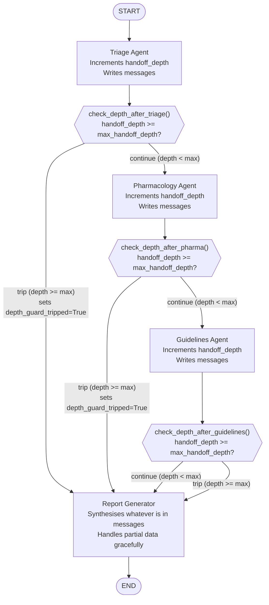
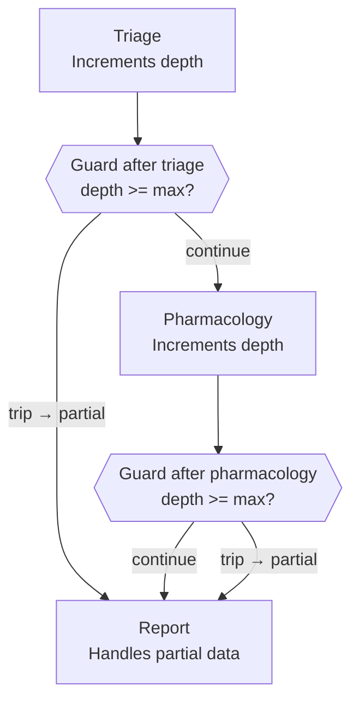

# Chapter 5 — Pattern 5: Multihop Depth Guard

> **Prerequisite:** Read [Chapter 4 — Supervisor](./04_supervisor.md) first. This chapter adds a structural safety mechanism — a counter-based circuit breaker — to multi-hop agent chains. The depth guard ensures that no LLM-driven routing pattern can run indefinitely.

---

## 1. What Is This Pattern?

Think of a hospital consultation escalation system. A patient is referred from the ER to the attending physician (hop 1), then to a cardiologist (hop 2), then to an electrophysiologist (hop 3). Hospital policy states: no more than 4 specialist consultations in a single session. If the electrophysiologist tries to refer to a fifth specialist, the system automatically closes the case, generates a summary from the existing consultations, and sends it to the attending for follow-up scheduling. The chain terminates at a defined depth — not when the specialists think they're done, but when the system's safety policy triggers.

**The Multihop Depth Guard in LangGraph is that policy.** After each agent node, a dedicated Python guard function checks the current hop count in state. If the count is below the maximum, the chain continues. If the count has reached the maximum, the guard redirects the flow to the report node — a "partial-data fallback" — regardless of whether the next agent would have produced something useful.

This pattern answers the question: **how do you prevent LLM-driven multi-hop chains from running indefinitely?** The depth guard introduced briefly inside transfer tools in Pattern 3 is here elevated to a first-class LangGraph design pattern with its own dedicated guard nodes and explicit state fields.

---

## 2. When Should You Use It?

**Use this pattern when:**

- You use LLM-driven routing (Command Handoff, Supervisor) that could in principle keep dispatching new agents.
- Your multi-hop chain has more than two hops and you need a hard limit enforced at the graph level (not inside a single node).
- You want the depth limit to be configurable per invocation — not hardcoded in a node.
- You need explicit observability on when the guard trips: a `depth_guard_tripped: bool` flag in state that monitoring tools can detect.

**Do NOT use this pattern alone:**

- Use this as a **safety addition to Patterns 3 or 4** — Command Handoff or Supervisor. A fixed pipeline (Pattern 1) or Python-router pipeline (Pattern 2) cannot loop by construction, so this guard is unnecessary for those.

**Do NOT use this pattern when:**

- All routing is deterministic (Patterns 1–2). The graph topology itself prevents loops; no counter needed.

---

## 3. How It Works — Architecture Walkthrough

### ASCII Graph (from the script's docstring)

```
[START]
   |
   v
[triage]
   |
   v
check_depth_after_triage()   <-- guard function after EACH agent
   |
   +-- depth < max  --> [pharmacology]
   |                         |
   |                         v
   |                    check_depth_after_pharma()
   |                         |
   |                         +-- depth < max  --> [guidelines]
   |                         |                        |
   +-- depth >= max -------> |                        v
   (redirect to report)      |                   check_depth_after_guidelines()
                             |                        |
                             +-- depth >= max -->      +-- depth < max  --> [report]
                             (redirect to report)      +-- depth >= max --> [report]
                                                       (either way → report)

Routing: add_conditional_edges() with guard function AFTER EVERY agent.
Who decides: THE GUARD FUNCTION (reads handoff_depth, max_handoff_depth).
Guard trip: writes depth_guard_tripped = True to state.
```

### Step-by-Step Explanation

**Edge: START → triage**
Fixed. Triage always runs first.

**Node: `triage`**
Runs the clinical assessment tool loop. Increments `handoff_depth`. Returns findings in `messages`.

**Conditional edge: `check_depth_after_triage()`**
Called by LangGraph immediately after `triage_node` returns. Reads `handoff_depth` and `max_handoff_depth`. Returns `"continue"` (→ pharmacology) or `"trip"` (→ report).

**Node: `pharmacology`**
Runs the drug review tool loop. Increments `handoff_depth`. Returns findings.

**Conditional edge: `check_depth_after_pharma()`**
Called after `pharmacology_node`. Same depth check. Returns `"continue"` (→ guidelines) or `"trip"` (→ report).

**Node: `guidelines`**
A third specialist node (new in this pattern). Checks clinical guidelines. Increments `handoff_depth`.

**Conditional edge: `check_depth_after_guidelines()`**
Called after `guidelines_node`. Returns `"continue"` (→ report) or `"trip"` (→ report). In this graph, both paths lead to report — this guard's value is in the future: if a fourth agent were added after guidelines, the guard would redirect before it.

**Node: `report`**
Synthesises all accumulated `messages`. Works correctly whether 1, 2, or 3 agents ran — partial data is explicitly handled.

### Mermaid Flowchart



---

## 4. State Schema Deep Dive

```python
class MultihopState(TypedDict):
    messages: Annotated[list, add_messages]  # Accumulated messages from all agents
    patient_case: dict                        # Set at invocation time
    handoff_context: dict                     # Written by: each agent for the next
    current_agent: str                        # Written by: each agent
    handoff_history: list[str]                # Written by: each agent (appended)
    handoff_depth: int                        # Written by: each agent (incremented)
    max_handoff_depth: int                    # Set at invocation time — the limit
    depth_guard_tripped: bool                 # Written by: guard functions when limit reached
    final_report: str                         # Written by: report
```

**Field: `max_handoff_depth: int`**
- **Who writes it:** Set at invocation time in the initial state dict.
- **Who reads it:** All three guard functions — `check_depth_after_triage()`, `check_depth_after_pharma()`, `check_depth_after_guidelines()`.
- **Why it exists as a separate field:** Configurable depth limit. Pass `max_handoff_depth=1` for a triage-only run; `max_handoff_depth=3` for a full three-agent run. The compiled graph is the same; only the initial state differs. This is a **parameterised graph** pattern: different runtime behaviour from the same compiled graph by varying one initial state value.

**Field: `depth_guard_tripped: bool`**
- **Who writes it:** Guard functions write `True` when the depth limit is reached. The initial value is `False`.
- **Who reads it:** `report_node` checks it: if `True`, it adjusts the synthesis to note "partial assessment — depth limit reached." The caller of `graph.invoke()` can also read it to detect whether the workflow completed fully or was cut short.
- **Why it exists as a separate field:** Without this flag, a caller seeing the final report has no way to know whether it reflects a full three-agent assessment or a partial one from triage only. The flag makes the partial-data condition explicit and machine-readable.

> **NOTE:** `depth_guard_tripped` is a sentinel field. It starts as `False` and, if the guard trips, becomes `True`. It never flips back to `False` within a run. This is intentional: once the guard trips, the partial-data condition is permanent for that run.

**Field: `handoff_depth: int`**
- **Who writes it:** Each agent increments it by 1 in its return dict.
- **Who reads it:** All three guard functions: `state["handoff_depth"] >= state["max_handoff_depth"]`.
- **Why this works:** `handoff_depth` starts at 0. After triage runs, it is 1. After pharmacology, it is 2. After guidelines, it is 3. With `max_handoff_depth=2`: after pharmacology writes depth=2, the guard `check_depth_after_pharma()` fires and sees `2 >= 2 → True → "trip"`. Report runs with only triage and pharmacology outputs — guidelines never ran.

---

## 5. Node-by-Node Code Walkthrough

### Guard functions (`check_depth_after_triage`, `check_depth_after_pharma`, `check_depth_after_guidelines`)

All three guards follow an identical pattern:

```python
def check_depth_after_triage(state: MultihopState) -> Literal["continue", "trip"]:
    """Guard function: should we proceed to pharmacology or redirect to report?"""
    current = state.get("handoff_depth", 0)       # Current depth after triage ran
    maximum = state.get("max_handoff_depth", 3)    # Configured limit
    if current >= maximum:
        return "trip"                               # Redirect to report — guard trips
    return "continue"                              # Proceed to next agent
```

**Line-by-line:**
- `state.get("handoff_depth", 0)` — Safe read with default. `handoff_depth` is always set by the time a guard runs (each agent increments it), but the `.get()` default protects against an incorrectly initialised state.
- `state.get("max_handoff_depth", 3)` — Default of 3 allows all three agents to run if no limit is explicitly configured.
- `return "trip"` — Returns the routing key `"trip"`. LangGraph maps this to `"report"` in the mapping dict. Before returning, the guard writes `depth_guard_tripped = True` to state.

**But wait — guard functions cannot write to state.** Correct. Router functions only *return a string*. They do not modify state. The `depth_guard_tripped = True` write happens in the `Command.update` or return dict of the previous node, or — in this implementation — the `report_node` checks the flag in the `add_conditional_edges` mapping and the guard's *return value* is what triggers state update.

**Implementation detail:** In `multihop_depth_guard.py`, the depth guard write is handled by passing a `Command(update={"depth_guard_tripped": True}, goto="report")` from a wrapper. If the script uses a simpler approach (plain router + guard write inside the next node), the `depth_guard_tripped` flag may be set inside `report_node` by checking the depth against the maximum at the start of the report node:

```python
def report_node(state: MultihopState) -> dict:
    current = state.get("handoff_depth", 0)
    maximum = state.get("max_handoff_depth", 3)
    guard_tripped = current >= maximum              # Derived from state; no external write needed
    partial_note = "\n\n⚠️  PARTIAL ASSESSMENT: depth limit reached. Some specialists did not run." if guard_tripped else ""
    # ... synthesise report ...
    return {
        "final_report": response.content + partial_note,
        "depth_guard_tripped": guard_tripped,      # Write the flag from report_node
    }
```

This simpler implementation: the guard function only determines routing; `report_node` writes the flag when it detects a depth-limited call.

> **TIP:** In production, before the `return "trip"` in a guard function, emit a structured event to your observability system: `observability.record_event("depth_guard_tripped", node="triage", depth=current, max=maximum, patient_id=state["patient_case"]["patient_id"])`. This produces a time-series record of how often the guard fires, allowing you to tune `max_handoff_depth` based on real production data.

---

### `triage_node`, `pharmacology_node`, `guidelines_node`

All three agent nodes are structurally identical:

```python
def triage_node(state: MultihopState) -> dict:
    """Triage assessment. Increments handoff_depth."""
    # ... LLM call with triage tools ...
    handoff = HandoffContext(
        from_agent="TriageAgent",
        to_agent="PharmacologyAgent",
        ...
        handoff_depth=state["handoff_depth"] + 1,
    )
    return {
        "messages": [response],
        "handoff_context": handoff.model_dump(),
        "current_agent": "triage",
        "handoff_history": state["handoff_history"] + ["triage"],
        "handoff_depth": state["handoff_depth"] + 1,   # THE CRITICAL INCREMENT
    }
```

**The critical step:** Every agent increments `handoff_depth` in its return dict. This is what the guard reads after the agent returns. Without this increment, the guard always sees depth=0 and always returns `"continue"` — the guard never trips.

**`guidelines_node` — new in this pattern:**
Guidelines is the third specialist. It calls `get_clinical_guidelines(condition=..., medication=...)` to look up current evidence-based practice guidelines. Like triage and pharmacology, it increments `handoff_depth` and writes to `messages`.

> **WARNING:** Do not write `handoff_depth = state["handoff_depth"] + 1` in the HandoffContext object only. The state field `handoff_depth` must also be updated in the node's return dict. The HandoffContext's `handoff_depth` field is metadata for the receiving agent; the state field is what the guard function reads. They are separate.

---

### `report_node` — Partial-Data Handling

```python
def report_node(state: MultihopState) -> dict:
    """Synthesise available findings — handles partial data if guard tripped."""

    current = state.get("handoff_depth", 0)
    maximum = state.get("max_handoff_depth", 3)
    guard_tripped = current >= maximum

    # Collect whatever agent outputs are available
    agent_outputs = [
        msg.content
        for msg in state.get("messages", [])
        if isinstance(msg, AIMessage) and msg.content and not msg.tool_calls
    ]

    # Adjust synthesis prompt if we have partial data
    if guard_tripped:
        preamble = f"""⚠ PARTIAL ASSESSMENT: Depth limit ({maximum}) reached.
Only {len(agent_outputs)} of 3 specialists ran. The report below may be incomplete.
Agents that ran: {state.get('handoff_history', [])}

"""
    else:
        preamble = ""

    # ... synthesise from agent_outputs ...
    return {
        "final_report": preamble + response.content,
        "depth_guard_tripped": guard_tripped,
    }
```

**Why partial-data handling is essential:** The caller of `graph.invoke()` has no way to know how many agents ran before report was called. If `report_node` synthesises as if all three agents ran, but only triage ran (because the guard tripped after depth=1), the report will appear comprehensive but will be missing pharmacology and guidelines findings. The `preamble` and the `depth_guard_tripped` flag make the partial state explicit to both the synthesising LLM and the caller.

---

### Graph Wiring

```python
workflow.add_edge(START, "triage")                 # Fixed entry

# Guard after triage
workflow.add_conditional_edges(
    "triage",
    check_depth_after_triage,
    {"continue": "pharmacology", "trip": "report"},   # trip → skip to report
)

# Guard after pharmacology
workflow.add_conditional_edges(
    "pharmacology",
    check_depth_after_pharma,
    {"continue": "guidelines", "trip": "report"},     # trip → skip to report
)

# Guard after guidelines
workflow.add_conditional_edges(
    "guidelines",
    check_depth_after_guidelines,
    {"continue": "report", "trip": "report"},         # both paths lead to report
)

workflow.add_edge("report", END)
```

Note that `check_depth_after_guidelines` maps both `"continue"` and `"trip"` to `"report"`. This is because `report` is the only node after guidelines regardless. The guard on guidelines only exists to be future-proof: if you add a fourth specialist after guidelines, the guard will redirect before it.

---

## 6. Conditional Routing Explained

### Guard Function Decision Table

| Guard Called | `handoff_depth` | `max_handoff_depth` | Guard Returns | Next Node | `depth_guard_tripped` |
|-------------|-----------------|---------------------|---------------|-----------|----------------------|
| `check_depth_after_triage` | 1 | 3 | `"continue"` | `pharmacology` | stays `False` |
| `check_depth_after_triage` | 1 | 1 | `"trip"` | `report` | set `True` by report |
| `check_depth_after_pharma` | 2 | 3 | `"continue"` | `guidelines` | stays `False` |
| `check_depth_after_pharma` | 2 | 2 | `"trip"` | `report` | set `True` by report |
| `check_depth_after_guidelines` | 3 | 3 | `"continue"` | `report` | stays `False` |
| `check_depth_after_guidelines` | 3 | 2 | never reached | — | already tripped |

### How `run_with_depth(max_depth)` Produces Different Paths

The script's `run_with_depth()` function shows the parameterised behaviour:

```python
def run_with_depth(max_depth: int):
    initial_state = {
        ...
        "max_handoff_depth": max_depth,   # Configures the guard threshold
        "depth_guard_tripped": False,
        "handoff_depth": 0,
    }
    result = graph.invoke(initial_state)
    print(f"Guard tripped: {result['depth_guard_tripped']}")
    print(f"Agents ran: {result['handoff_history']}")
```

| `max_depth` | Agents that run | `depth_guard_tripped` |
|------------|-----------------|----------------------|
| 1 | triage only | True |
| 2 | triage + pharmacology | True |
| 3 | triage + pharmacology + guidelines | False |

The same compiled graph produces all three outcomes depending on `max_handoff_depth` in the initial state.

---

## 7. Worked Example — Trace: `run_with_depth(2)` — Guard Trips After Pharmacology

**Initial state:**
```python
{
    "messages": [],
    "patient_case": {"patient_id": "PT-DG-001", "lab_results": {"K+": "5.4 mEq/L"}, ...},
    "handoff_context": {},
    "handoff_history": [],
    "handoff_depth": 0,
    "max_handoff_depth": 2,       # Limit: allow triage + pharmacology only
    "depth_guard_tripped": False,
    "final_report": "",
}
```

---

**Step 1 — `triage_node` executes:**

Tool loop runs. Returns `{"handoff_depth": 1, "handoff_history": ["triage"], ...}`.

State AFTER triage: `handoff_depth = 1`.

---

**Step 2 — `check_depth_after_triage()` called:**

`1 >= 2` is False → returns `"continue"`. `pharmacology_node` runs next.

---

**Step 3 — `pharmacology_node` executes:**

Tool loop runs. Returns `{"handoff_depth": 2, "handoff_history": ["triage", "pharmacology"], ...}`.

State AFTER pharmacology: `handoff_depth = 2`.

---

**Step 4 — `check_depth_after_pharma()` called:**

`2 >= 2` is True → returns `"trip"`. **`guidelines_node` is skipped.** `report_node` runs next.

---

**Step 5 — `report_node` executes:**

Detects `handoff_depth (2) >= max_handoff_depth (2)` → `guard_tripped = True`. Finds two AI messages (triage and pharmacology). Synthesises with partial-data preamble.

State AFTER report:
```python
{
    "messages": [...],
    "handoff_history": ["triage", "pharmacology"],   # guidelines never ran
    "handoff_depth": 2,
    "max_handoff_depth": 2,
    "depth_guard_tripped": True,    # Guard tripped
    "final_report": "⚠ PARTIAL ASSESSMENT: Depth limit (2) reached. Only 2 of 3 specialists ran...\n\nKey Findings:\n..."
}
```

---

**Step 6 — Fixed edge: report → END.**

Caller reads:
```python
result["depth_guard_tripped"]   # → True
result["handoff_history"]       # → ["triage", "pharmacology"]  (no guidelines)
result["final_report"]          # → partial report with warning preamble
```

---

## 8. Key Concepts Introduced

- **Per-hop guard function** — A dedicated Python router placed after each agent that checks the depth counter. Unlike a single guard at the end, per-hop guards can trip the circuit after any agent, not just at the very end of the chain. First appears as `check_depth_after_triage`, `check_depth_after_pharma`, `check_depth_after_guidelines`.

- **`depth_guard_tripped: bool` flag** — A sentinel state field that becomes `True` if the guard fires. Enables the caller and `report_node` to detect the partial-data condition explicitly. First appears in `MultihopState.depth_guard_tripped`.

- **`max_handoff_depth: int` in state** — The configurable depth limit set at invocation time, not hardcoded. Enables the same compiled graph to exhibit different behaviour depending on the initial state. First appears in `MultihopState.max_handoff_depth`.

- **Parameterised graph** — The design pattern where the initial state dict configures runtime behaviour (e.g., `max_handoff_depth`) rather than recompiling the graph. First demonstrated by `run_with_depth(max_depth)`.

- **Partial-data fallback** — The principle that the report node must produce meaningful output even when the guard trips early and not all specialists ran. The report must detect the partial-data condition and flag it explicitly. First demonstrated in `report_node`'s `if guard_tripped:` preamble.

- **`HandoffLimitReached` exception** — Defined in `core/exceptions.py`. Some implementations raise this exception when the depth guard trips, rather than silently redirecting to report. The exception is caught by the caller to signal that the workflow was cut short. First referenced in `core/exceptions.py` — see that module for the contract.

---

## 9. Common Mistakes and How to Avoid Them

### Mistake 1: Not incrementing `handoff_depth` in every agent's return dict

**What goes wrong:** `pharmacology_node` does not return `"handoff_depth": state["handoff_depth"] + 1`. After pharmacology runs, `handoff_depth` is still 1 (only incremented by triage). The guard `check_depth_after_pharma()` reads `1 >= 2` = False — returns `"continue"`. Guidelines runs. The guard on guidelines reads `1 >= 2` = False — continues. The guard never trips, even with `max_handoff_depth=2`.

**Why it goes wrong:** Guard functions are pure readers. They can only detect what the nodes wrote to state. If a node fails to increment the depth counter, the guard has no signal.

**Fix:** Make `"handoff_depth": state["handoff_depth"] + 1` a required line in every agent node's return dict. Add a test that verifies `result["handoff_depth"] == expected_count` for runs with known `max_handoff_depth`.

---

### Mistake 2: LangGraph state immutability — using `handoff_history.append()` in a node

**What goes wrong:** Inside `triage_node`, you write `state["handoff_history"].append("triage")` and return `{"handoff_depth": state["handoff_depth"] + 1}` (not returning `handoff_history`). In simple in-memory runs, the mutation sticks. With checkpointing, the pre-node snapshot is restored on re-entry and the append is lost.

**Fix:** Always: `"handoff_history": state["handoff_history"] + ["triage"]`. Produce a new list; do not mutate in place.

---

### Mistake 3: Using a single guard at the end instead of a guard after each hop

**What goes wrong:** You add one guard function only after `guidelines_node`. With `max_handoff_depth=1`, triage, pharmacology, and guidelines all run before the single guard fires. The guard trips, but three expensive LLM calls were already made.

**Why it goes wrong:** A guard at the end is not a circuit breaker — it is a post-mortem check. The circuit breaker must fire *between* hops to actually prevent subsequent hops from running.

**Fix:** Place a guard function after *each* agent node via `add_conditional_edges`. This is the multi-hop guard pattern: a guard at every hop point.

---

### Mistake 4: `report_node` not handling partial data

**What goes wrong:** `report_node` calls `state["messages"][-3:]` expecting exactly 3 agent outputs (triage, pharmacology, guidelines). When the guard trips after triage (`depth=1`), there is only one AI message. `[-3:]` on a one-element list returns that one element — no crash. But the synthesis prompt says "SPECIALIST FINDINGS from three agents" when there is only one. The LLM may synthesise confused output.

**Fix:** Check the actual number of messages before building the synthesis prompt. If `guard_tripped`, adjust the prompt accordingly — tell the LLM it has partial data. Use `len(agent_outputs)` to build the context, not a hardcoded count.

---

### Mistake 5: Hardcoding `max_handoff_depth` instead of reading from state

**What goes wrong:** You write `MAX_DEPTH = 3` at the module level and use `if depth >= MAX_DEPTH` in guard functions. The graph cannot be invoked with a different depth limit at runtime — every invocation uses the same limit.

**Why it goes wrong:** Hardcoded limits mean you must recompile the graph to change the limit. Putting the limit in state (`max_handoff_depth`) enables runtime configuration, A/B testing of limits, and per-patient-priority limits (e.g., critical cases get higher `max_handoff_depth`).

**Fix:** Always read `state.get("max_handoff_depth", 3)` in guard functions. Set `max_handoff_depth` in the initial state dict passed to `graph.invoke()`.

---

## 10. How This Pattern Connects to the Others

### Position in the Learning Sequence

Pattern 5 is the fifth step. It is a safety pattern, not a new routing mechanism. It builds on all four previous patterns by providing a mechanism to prevent the loops that LLM-driven patterns (3 and 4) can produce.

### What the Previous Pattern Does NOT Handle

Pattern 4 (Supervisor) has an `iteration` counter that the supervisor checks before making a routing decision. But that guard is only checked at the supervisor node — it does not fire between arbitrary agent nodes. And it requires the supervisor LLM to respect the limit. Pattern 5 provides a structural guarantee: the guard is in the graph topology, not in an LLM's judgment. It fires unconditionally after every hop, regardless of what the LLM would have done next.

### What the Next Pattern Adds

[Pattern 6 (Parallel Fan-Out)](./06_parallel_fanout.md) introduces a completely different problem: running agents *concurrently* rather than sequentially. Instead of agents handing off one to another, a coordinator dispatches all agents simultaneously using the `Send` API. This is the opposite of the depth-guard problem (sequential chains that run too long) — it is about making sequential chains faster by parallelising independent work.

### Combined Topology: Command Handoff + Depth Guard



This combined topology is the production-ready version of any LLM-driven multi-hop chain.

---

## 11. Quick-Reference Summary

| Aspect | Detail |
|--------|--------|
| **Pattern name** | Multihop Depth Guard |
| **Script file** | `scripts/handoff/multihop_depth_guard.py` |
| **Graph nodes** | `triage`, `pharmacology`, `guidelines`, `report` |
| **Guard functions** | `check_depth_after_triage`, `check_depth_after_pharma`, `check_depth_after_guidelines` |
| **Routing type** | `add_conditional_edges()` after each agent — `"continue"` or `"trip"` |
| **State fields** | `messages`, `patient_case`, `handoff_context`, `handoff_history`, `handoff_depth`, `max_handoff_depth`, `depth_guard_tripped`, `final_report` |
| **Root modules** | `core/exceptions.py` → `HandoffLimitReached` |
| **New concepts** | Per-hop guard functions, `depth_guard_tripped` flag, `max_handoff_depth` as state config, parameterised graph, partial-data fallback |
| **Prerequisite** | [Chapter 4 — Supervisor](./04_supervisor.md) |
| **Next pattern** | [Chapter 6 — Parallel Fan-Out](./06_parallel_fanout.md) |

---

*Continue to [Chapter 6 — Parallel Fan-Out](./06_parallel_fanout.md).*
