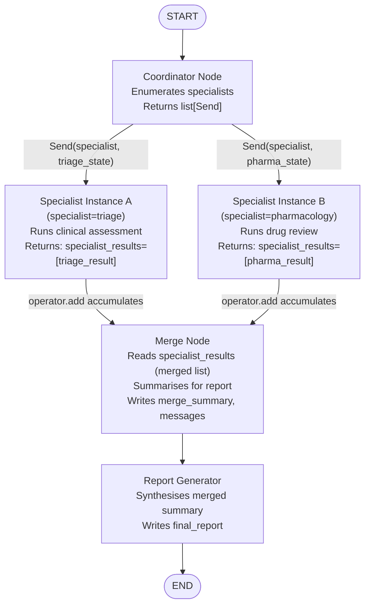
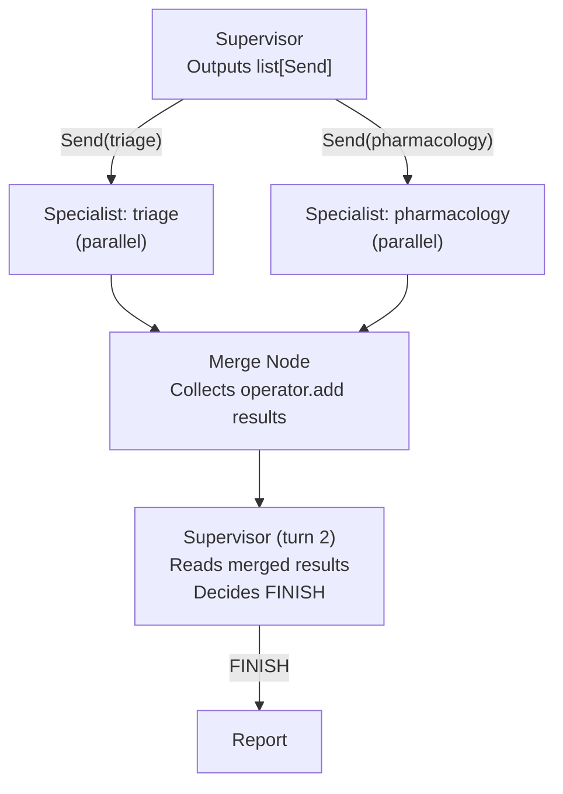

# Chapter 6 — Pattern 6: Parallel Fan-Out

> **Prerequisite:** Read [Chapter 5 — Multihop Depth Guard](./05_multihop_depth_guard.md) first. This final chapter introduces the most structurally distinct LangGraph pattern: running multiple agent instances simultaneously and merging their results.

---

## 1. What Is This Pattern?

Think of how a hospital's rapid response team handles a code blue. The attending physician does not assess the airway, then the heart, then the medication history one at a time — that would be fatally slow. Instead, the team fans out: one nurse checks vitals, one prepares medications, one handles the airway, and one takes history from the family — all simultaneously. The attending waits while the whole team works in parallel, then collects all reports and synthesises a unified action plan.

**Parallel Fan-Out in LangGraph is that rapid-response fanning out.** A coordinator node emits multiple `Send` objects — one per specialist agent — in a single step. LangGraph launches all specialist instances simultaneously. Each runs independently, with its own isolated local state. When all finish, their results are merged via a `operator.add` reducer into a single list in the shared state. A merge node then synthesises across all parallel results.

The key insight of this pattern: **triage's clinical assessment and pharmacology's drug review are completely independent.** Triage does not need pharmacology's output to start. Pharmacology does not need triage's output to start. Why run them sequentially when they can run in parallel?

---

## 2. When Should You Use It?

**Use this pattern when:**

- Two or more agents are independent — neither needs the other's output to do its job. Running them sequentially wastes wall-clock time.
- You want to reduce end-to-end latency for multi-agent pipelines. In a sequential pipeline with N specialists, latency is sum(specialist_times). In a parallel fan-out, latency is max(specialist_times) + coordinator overhead.
- You have a fixed set of specialists that should always all run (e.g., always run both triage AND pharmacology, not one-or-the-other).
- The coordinator can enumerate the required specialist instances from state before any specialist runs (i.e., you know the full set at coordinator time).

**Do NOT use this pattern when:**

- Specialists are sequential — agent B needs agent A's output to start its work. Use [Pattern 1 (Linear Pipeline)](./01_linear_pipeline.md) for sequential dependency.
- The set of specialists is dynamic and determined by LLM reasoning — use [Pattern 4 (Supervisor)](./04_supervisor.md) for dynamic dispatch.
- You only ever run one specialist — no fan-out needed; the overhead is unnecessary.

---

## 3. How It Works — Architecture Walkthrough

### ASCII Graph (from the script's docstring)

```
[START]
   |
   v
[coordinator]  -- conditional edge returning list[Send] -->
   |
   +-- Send("specialist", {specialist: "triage", ...})  -----> [specialist] (instance A)
   |                                                                |
   +-- Send("specialist", {specialist: "pharmacology", ...}) ----> [specialist] (instance B)
   |
   (both instances run in PARALLEL — no dependency between them)
   |
   +-- instance A result ----+
   +-- instance B result ----+--> specialist_results (merged via operator.add)
                              |
                              v
                           [merge_node]
                              |
                              v
                           [report]
                              |
                              v
                            [END]

Routing: conditional edge returns list[Send] — both branches are launched at once.
Who decides: THE COORDINATOR — determines which specialists to fan out to.
Key: specialist_results uses Annotated[list[dict], operator.add] — accumulates from parallel branches.
```

### Step-by-Step Explanation

**Edge: START → coordinator**
Fixed. The coordinator always runs first.

**Node: `coordinator`**
The coordinator's job is to decide which specialists to fan out to and what data each specialist gets. It returns a `list[Send]` — two `Send` objects, one for triage and one for pharmacology. LangGraph launches both concurrently.

**`Send(node_name, state_for_that_instance)` explained:**
`Send` (from `langgraph.types`) creates a parallel execution branch targeting a named node. The second argument is the *local state* for that specific node invocation. Crucially, each `Send` can give its specialist a different state — you can send different `task_description` values to triage vs. pharmacology, for example.

**Node: `specialist` (multiple instances, run concurrently)**
There is only ONE `specialist_node` function in the code. But LangGraph instantiates it multiple times — once per `Send` — running each instance with its own local state. The instances do not share state with each other. Each runs independently.

**State merging via `operator.add` reducer:**
When a `specialist_node` instance returns `{"specialist_results": [result_dict]}`, LangGraph uses the `operator.add` reducer on `specialist_results` to *accumulate* the results from all parallel instances. The first instance's return appends its dict to the list. The second instance's return appends its dict to the same list. After all instances finish, `specialist_results` contains all results.

**Node: `merge_node`**
After all parallel instances complete and their results are merged, `merge_node` runs. It reads `specialist_results` — the merged list — and prepares a structured summary for the report node. It writes to `messages` and `merge_summary`.

**Node: `report`**
Final synthesis. Reads `merge_summary` or `messages`. Writes `final_report`.

### Mermaid Flowchart



---

## 4. State Schema Deep Dive

```python
class SpecialistInput(TypedDict):
    """The local state passed to each parallel specialist instance via Send."""
    patient_case: dict              # The case this specialist should work on
    specialist: str                 # "triage" or "pharmacology" — which role this instance plays
    task_description: str           # Specific instructions for this specialist
    relevant_context: list[str]     # Any context from prior steps


class FanoutState(TypedDict):
    """The shared graph state."""
    messages: Annotated[list, add_messages]         # Accumulated from merge_node
    patient_case: dict                               # Set at invocation time
    specialist_results: Annotated[list[dict], operator.add]  # Merged from parallel branches
    merge_summary: str                               # Written by: merge_node
    final_report: str                                # Written by: report
```

### Two State Types: `SpecialistInput` and `FanoutState`

This is a key structural difference from all previous patterns: **the specialist node has its own, smaller state type** (`SpecialistInput`), not the full `FanoutState`.

- **`SpecialistInput`** — The local state for one specialist instance. Contains only what that specialist needs. Constructed by the coordinator and passed via `Send(node_name, SpecialistInput_dict)`.
- **`FanoutState`** — The shared state for all nodes except specialist instances. Contains the accumulated results and the final outputs.

The two types have different fields. `SpecialistInput` has `specialist` and `task_description`; `FanoutState` does not. `FanoutState` has `specialist_results` and `merge_summary`; `SpecialistInput` does not.

> **NOTE:** The `specialist_node` function signature is `def specialist_node(state: SpecialistInput) -> dict`. When `specialist_node` returns a dict, LangGraph merges it into `FanoutState` (the shared state), not into `SpecialistInput`. The `SpecialistInput` is the *input* to the node; the return dict updates the *shared* state. This asymmetry is specific to parallel fan-out — understand it clearly before using this pattern.

### Field: `specialist_results: Annotated[list[dict], operator.add]`

This field is the core of the parallel merge mechanism.

- **`operator.add`** — Python's built-in list concatenation function (`list1 + list2`). When used as a LangGraph state reducer annotation, it tells LangGraph: "when merging a new value into `specialist_results`, concatenate the lists rather than replacing."
- **How it works across parallel branches:**
  - Specialist A returns `{"specialist_results": [{"role": "triage", "output": "..."}]}`.
  - Specialist B returns `{"specialist_results": [{"role": "pharmacology", "output": "..."}]}`.
  - LangGraph applies `operator.add`: `[] + [triage_result] + [pharma_result]` = `[triage_result, pharma_result]`.
  - `merge_node` reads `state["specialist_results"]` and sees both results.
- **Why `operator.add` and not `add_messages`?** The results are plain dicts, not LangChain message objects. `add_messages` is specifically for `BaseMessage` subclasses (HumanMessage, AIMessage, etc.) and uses deduplication by message ID. `operator.add` is the simpler choice for arbitrary dict accumulation.

> **WARNING:** The order of results in `specialist_results` is not guaranteed. Parallel execution means whichever specialist finishes first appends first. Do NOT write `result = specialist_results[0]` assuming it is always triage. Always filter by `result["role"] == "triage"` or iterate over all results.

---

## 5. Node-by-Node Code Walkthrough

### `coordinator_node`

```python
from langgraph.types import Send

def coordinator_node(state: FanoutState) -> list[Send]:
    """Fan out to all required specialists simultaneously."""

    patient = state["patient_case"]   # Read the case to work on

    # Define what each specialist needs to do
    specialist_configs = [
        {
            "specialist": "triage",                          # Which role this instance plays
            "task_description": (                             # Specific prompt for triage
                "Perform clinical triage assessment. Identify urgent concerns, "
                "assess patient risk level, and note which medications and labs "
                "require specialist attention."
            ),
            "relevant_context": [],                          # No prior context — running first
        },
        {
            "specialist": "pharmacology",                    # Which role this instance plays
            "task_description": (                             # Specific prompt for pharmacology
                "Review current medications for drug interactions, assess "
                "renal dosing (using eGFR), and flag any contraindications."
            ),
            "relevant_context": [],                          # Independent — does not need triage
        },
    ]

    # Return a list of Send objects — one per specialist to launch
    return [
        Send(
            "specialist",    # The node name to invoke — same node, different state
            {                # The SpecialistInput dict for this instance
                "patient_case": patient,
                "specialist": config["specialist"],
                "task_description": config["task_description"],
                "relevant_context": config["relevant_context"],
            },
        )
        for config in specialist_configs  # One Send per specialist
    ]
```

**Line-by-line explanation:**
- `return [Send("specialist", {...}), Send("specialist", {...})]` — The coordinator returns a *list* of `Send` objects, not a regular dict. Returning a list of `Send` from a conditional edge is how LangGraph initiates parallel execution. Each `Send` creates a parallel branch.
- `Send("specialist", {...})` — The first argument is the node name (the same `specialist_node` for all instances). The second argument is the local state for that instance (a `SpecialistInput`-shaped dict).
- Both `Send` objects are returned in one list — LangGraph processes them concurrently.

**The conditional edge that calls `coordinator_node`:**
```python
workflow.add_conditional_edges(
    "coordinator",
    coordinator_node,      # This function returns list[Send] — not a string key
    # No mapping dict needed when returning Send objects
)
```

This is a special use of `add_conditional_edges`: when the router function returns a list of `Send` objects (instead of a string key), LangGraph launches all of them in parallel. There is no mapping dict.

**What breaks if you remove this node:** No fan-out occurs. The specialist node is never called and `specialist_results` is never populated.

> **TIP:** In production, build `specialist_configs` dynamically from patient data: only add the pharmacology specialist if the patient is on any medications; only add the guidelines specialist if the triage specialist identified a specific condition code. This creates a dynamic fan-out: different patients get different sets of parallel specialists, all within the same compiled graph.

---

### `specialist_node`

```python
def specialist_node(state: SpecialistInput) -> dict:
    """One specialist instance — triage or pharmacology, running in parallel."""

    role = state["specialist"]            # "triage" or "pharmacology"
    task = state["task_description"]      # Specific instructions for this role
    patient = state["patient_case"]       # The case to work on

    # Select tools based on the specialist role
    if role == "triage":
        tools = triage_tools              # analyze_symptoms, assess_patient_risk
    elif role == "pharmacology":
        tools = pharma_tools              # check_drug_interactions, calculate_dosage_adjustment
    else:
        tools = []                         # Unknown role — no tools

    specialist_llm = llm.bind_tools(tools)   # Bind role-appropriate tools

    system_msg = SystemMessage(content=(
        f"You are a specialist in {role}. {task}\n"
        f"Work independently. Do not assume any other specialist is running."
    ))
    user_msg = HumanMessage(content=f"Patient case: {json.dumps(patient, indent=2)}")

    messages = [system_msg, user_msg]
    response = specialist_llm.invoke(messages, config=config)

    # ReAct loop — same pattern as all previous nodes
    while hasattr(response, "tool_calls") and response.tool_calls:
        tool_node = ToolNode(tools)
        tool_results = tool_node.invoke({"messages": [response]})
        messages.extend([response] + tool_results["messages"])
        response = specialist_llm.invoke(messages, config=config)

    # Return result as a dict in a list — for operator.add accumulation
    return {
        "specialist_results": [    # A LIST containing one dict — operator.add concatenates lists
            {
                "role": role,               # Which specialist this was
                "output": response.content, # The specialist's text output
                "patient_id": patient.get("patient_id"),
            }
        ]
    }
```

**Key line: `"specialist_results": [{...}]`**
The node returns a *list* containing one dict. This is the correct form for `operator.add` accumulation. When specialist A returns `[{triage_result}]` and specialist B returns `[{pharma_result}]`, LangGraph concatenates: `[] + [{triage_result}] + [{pharma_result}] = [{triage_result}, {pharma_result}]`. If the node returned a plain dict (not a list), `operator.add` would concatenate dicts (which raises a TypeError).

**Why the `role` field in the result dict is essential:**
After merging, `merge_node` reads `state["specialist_results"]` as `[{role: "triage", output: "..."}, {role: "pharmacology", output: "..."}]` in an unknown order. The `role` field lets the merge node identify which output came from which specialist, regardless of order.

**What breaks if you return a plain dict instead of a list:** `operator.add` would try to concatenate a dict with a list, raising `TypeError`. Always return `{"specialist_results": [result_dict]}` — the outer list is required.

> **TIP:** In production, add `"tool_calls_made": len([msg for msg in messages if hasattr(msg, "tool_calls") and msg.tool_calls])` to the result dict. This gives you per-specialist tool call counts in the merged results, enabling cost attribution per specialist role.

---

### `merge_node`

```python
def merge_node(state: FanoutState) -> dict:
    """Collect all parallel specialist results and prepare a unified brief for report."""

    results = state.get("specialist_results", [])   # The merged list from all parallel branches

    # Find each specialist's output by role
    triage_output = next(
        (r["output"] for r in results if r.get("role") == "triage"), "No triage output."
    )
    pharma_output = next(
        (r["output"] for r in results if r.get("role") == "pharmacology"), "No pharmacology output."
    )

    # Build a unified summary
    summary = f"""PARALLEL SPECIALIST ASSESSMENT SUMMARY
=====================================
TRIAGE FINDINGS:
{triage_output}

PHARMACOLOGY FINDINGS:
{pharma_output}
"""

    merge_msg = AIMessage(content=summary)

    return {
        "messages": [merge_msg],                  # Add merge summary to message history
        "merge_summary": summary,                  # Also store as a dedicated field
    }
```

**Why not just pass raw `specialist_results` directly to `report_node`?**
Two reasons:
1. **Formatting.** Raw result dicts contain `role`, `output`, and `patient_id` keys. The report LLM needs a narrative prompt, not a JSON dump.
2. **Extensibility.** `merge_node` can perform quality checks (e.g., "did both specialists produce output?"), compute agreement scores between specialists, or enrich the summary with structured metadata before report generation.

**What breaks if you remove this node:** `report_node` would have to read `specialist_results` directly and format the output itself. This merges two responsibilities into one node. In a production system, that makes the report node harder to test and extend.

---

### Graph Wiring

```python
workflow.add_edge(START, "coordinator")           # Fixed: always start at coordinator

workflow.add_conditional_edges(
    "coordinator",
    coordinator_node,                              # Returns list[Send] — triggers parallel execution
    # No mapping dict — Send-based routing does not use one
)

# After all parallel specialist instances finish and results are merged, merge_node runs
workflow.add_edge("specialist", "merge_node")     # Fixed: specialist → merge (for each instance)
workflow.add_edge("merge_node", "report")         # Fixed: merge → report
workflow.add_edge("report", END)                  # Fixed: report → END
```

> **NOTE:** `workflow.add_edge("specialist", "merge_node")` is a single `add_edge` call that applies to *all* specialist instances. LangGraph knows that `merge_node` receives from all instances of the `specialist` node and waits for all to complete before running.

---

## 6. Send API and Parallel Routing Explained

### How `Send` Creates Parallel Branches

`Send(node_name, local_state)` is a LangGraph directive: "launch an execution branch targeting `node_name`, starting with `local_state` as that branch's input state."

Returning a `list[Send]` from a conditional edge function tells LangGraph to launch ALL branches concurrently:

```python
# These two Send objects launch two specialist_node invocations simultaneously
return [
    Send("specialist", {"specialist": "triage", "patient_case": {...}, ...}),
    Send("specialist", {"specialist": "pharmacology", "patient_case": {...}, ...}),
]
```

The number of parallel branches is determined by the length of the returned list. Return 3 `Send` objects → 3 parallel branches. The compiled graph is the same; the number of parallel instances is dynamic.

### The `operator.add` Reducer — How Results Are Merged

```python
import operator

class FanoutState(TypedDict):
    specialist_results: Annotated[list[dict], operator.add]  # operator.add is the reducer
```

When parallel branches return to the merge point (`merge_node`), LangGraph calls the reducer to combine their `specialist_results` updates:

```python
operator.add([], [{"role": "triage", "output": "..."}])            # → [triage_result]
operator.add([{"role": "triage", "output": "..."}], [{"role": "pharmacology", "output": "..."}])
# → [triage_result, pharma_result]
```

`operator.add` is Python's `list.__add__` — plain list concatenation. The order of accumulation depends on which branch finishes first.

### Comparison to `add_messages` reducer

| Reducer | Used for | Behaviour |
|---------|---------|-----------|
| `add_messages` | LangChain message objects | Appends and deduplicates by message ID |
| `operator.add` | Any list | Plain concatenation, no deduplication |

Use `add_messages` for `messages: Annotated[list, add_messages]`. Use `operator.add` for `specialist_results: Annotated[list[dict], operator.add]`.

### Why There Is No "Classic" Decision Table

Patterns 1–5 all have a router function that returns a single string key → one next node. Pattern 6 is different: the coordinator returns a `list[Send]` — both branches are launched simultaneously. There is no decision between "triage" or "pharmacology" — it is "triage AND pharmacology". The routing table is:

| Coordinator returns | LangGraph action | Next nodes |
|--------------------|-----------------|------------|
| `[Send("specialist", triage_state), Send("specialist", pharma_state)]` | Launch both concurrently | `specialist` (×2, in parallel) |

After all specialist instances finish, execution continues to `merge_node` (via `add_edge("specialist", "merge_node")`).

---

## 7. Worked Example — Trace: Full Parallel Fan-Out

**Patient from `main()`:**
```python
patient = PatientCase(
    patient_id="PT-FO-001",
    age=71, sex="F",
    chief_complaint="Dizziness and fatigue after medication change",
    current_medications=["Lisinopril 20mg daily", "Spironolactone 25mg daily"],
    lab_results={"K+": "5.4 mEq/L", "eGFR": "42 mL/min"},
)
```

**Initial state:**
```python
{
    "messages": [],
    "patient_case": {...},
    "specialist_results": [],   # empty accumulator
    "merge_summary": "",
    "final_report": "",
}
```

---

**Step 1 — `coordinator_node` executes:**

Builds `specialist_configs` for triage and pharmacology. Returns:
```python
[
    Send("specialist", {"specialist": "triage", "patient_case": {...}, "task_description": "..."}),
    Send("specialist", {"specialist": "pharmacology", "patient_case": {...}, "task_description": "..."}),
]
```

LangGraph launches two concurrent `specialist_node` invocations.

---

**Step 2 — Parallel execution (both instances run simultaneously):**

**Instance A (triage):**
- `specialist_llm = llm.bind_tools(triage_tools)`
- Calls `analyze_symptoms`, `assess_patient_risk`.
- LLM produces triage assessment.
- Returns: `{"specialist_results": [{"role": "triage", "output": "Triage: Critical hyperkalemia risk..."}]}`

**Instance B (pharmacology):**
- `specialist_llm = llm.bind_tools(pharma_tools)`
- Calls `check_drug_interactions`, `calculate_dosage_adjustment`.
- LLM produces pharmacology recommendation.
- Returns: `{"specialist_results": [{"role": "pharmacology", "output": "Pharmacology: Stop Spironolactone..."}]}`

(Both run concurrently. Whichever finishes first, its result is merged via `operator.add`. Then the second finishes and its result is also merged.)

---

**State AFTER both specialist instances (merged via `operator.add`):**
```python
{
    "messages": [],        # specialists don't write to messages
    "patient_case": {...},
    "specialist_results": [
        {"role": "triage", "output": "Triage: Critical hyperkalemia risk..."},
        {"role": "pharmacology", "output": "Pharmacology: Stop Spironolactone..."},
    ],    # order depends on which finished first — not guaranteed
    "merge_summary": "",
    "final_report": "",
}
```

---

**Step 3 — `merge_node` executes:**

Reads `specialist_results`. Finds triage output by `role == "triage"`. Finds pharmacology output by `role == "pharmacology"`. Constructs unified summary string. Returns:
```python
{
    "messages": [AIMessage(content="PARALLEL SPECIALIST ASSESSMENT SUMMARY\n...\nTRIAGE: Critical hyperkalemia...\nPHARMACOLOGY: Stop Spironolactone...")],
    "merge_summary": "PARALLEL SPECIALIST ASSESSMENT SUMMARY\n...",
}
```

---

**Step 4 — `report_node` executes:**

Reads `merge_summary` (or filters `messages` for the merge AIMessage). Synthesises final report. Returns `{"final_report": "Key Findings:\n..."}`.

---

**Step 5 — Fixed edge: report → END.**

Final state:
```python
{
    "specialist_results": [{role: "triage", ...}, {role: "pharmacology", ...}],
    "merge_summary": "...",
    "final_report": "Key Findings:\n• Critical hyperkalemia risk...",
}
```

---

## 8. Key Concepts Introduced

- **`Send(node_name, local_state)`** — A LangGraph directive from `langgraph.types` that creates a parallel execution branch targeting a named node with its own isolated local state. First appears in `coordinator_node`'s `return [Send("specialist", {...}), ...]`.

- **`list[Send]` returned from a conditional edge** — When a conditional edge function returns a list of `Send` objects (instead of a string key), LangGraph launches all branches concurrently. The mapping dict is not used. First demonstrated in `add_conditional_edges("coordinator", coordinator_node)`.

- **`operator.add` reducer** — Python's built-in list concatenation used as a LangGraph state reducer. `Annotated[list[dict], operator.add]` tells LangGraph to concatenate incoming lists rather than replace the field. First appears in `FanoutState.specialist_results: Annotated[list[dict], operator.add]`.

- **Two-state-type pattern** — Using a small `SpecialistInput` TypedDict as the input state for parallel instances, separate from the full `FanoutState`. Specialist instances read `SpecialistInput`; their return dicts update `FanoutState`. First demonstrated with `SpecialistInput` and `FanoutState`.

- **Single node function, multiple instances** — One `specialist_node` function handles all specialist roles by reading `state["specialist"]` to determine its role. LangGraph instantiates it multiple times via `Send`, each with a different local state. First demonstrated in `specialist_node`'s `role = state["specialist"]` branch.

- **`merge_node` as result aggregator** — A dedicated node that reads the merged `specialist_results` list and produces a unified summary. Separates result-formatting from result-synthesis. First demonstrated in `merge_node`.

- **Order independence** — The `specialist_results` list is accumulated in completion order, not dispatch order. Downstream nodes must never assume a fixed order in the list. First noted in the `merge_node` code: `next(r for r in results if r.get("role") == "triage")`.

---

## 9. Common Mistakes and How to Avoid Them

### Mistake 1: Returning a plain dict instead of `list[dict]` from `specialist_node`

**What goes wrong:** `specialist_node` returns `{"specialist_results": {"role": "triage", ...}}` — a plain dict, not a list. `operator.add` expects a list; it cannot concatenate a dict with a list. LangGraph raises `TypeError` when the second specialist returns and the reducer tries to merge.

**Why it goes wrong:** `operator.add` is `list + list`. Returning a dict instead of a list breaks the type contract for the reducer.

**Fix:** Always return `{"specialist_results": [{"role": role, "output": output, ...}]}`. The outer list is mandatory.

---

### Mistake 2: Assuming a fixed order in `specialist_results`

**What goes wrong:** In `merge_node`, you write `triage_result = state["specialist_results"][0]`. When pharmacology finishes first (e.g., it has fewer tool calls), pharmacology is at index 0 and triage is at index 1. Your code reads pharmacology's output as triage's.

**Why it goes wrong:** Parallel execution completion order is non-deterministic. Neither the language nor LangGraph guarantees that the first `Send` finishes first.

**Fix:** Always filter by the `role` field: `next(r for r in results if r.get("role") == "triage")`. Never index by position.

---

### Mistake 3: LangGraph state immutability — writing to `specialist_results` with a plain assignment instead of a list

**What goes wrong:** `specialist_node` returns `{"specialist_results": result_dict}` (not wrapped in a list). The `operator.add` reducer tries `existing_list + result_dict` — `TypeError`.

**Why it goes wrong:** Same as Mistake 1 but from a different angle: `operator.add([], {})` is not valid Python.

**Fix:** Ensure `specialist_results` value is always a `list`. If appending a single item: `[result_dict]`. If appending multiple: `[result_dict_1, result_dict_2]`.

---

### Mistake 4: Specialist nodes writing to `messages` instead of `specialist_results`

**What goes wrong:** Each specialist returns `{"messages": [AIMessage(content=output)]}` instead of `{"specialist_results": [{"role": role, "output": output}]}`. The `add_messages` reducer accumulates both specialist messages into the shared `messages` list. `merge_node` then tries to read `specialist_results` which is empty.

**Why it goes wrong:** The two-state-type pattern requires that specialists write to `specialist_results`, not `messages`. `messages` is for the shared coordinator/merge/report message flow. `specialist_results` is the dedicated accumulator for parallel branch outputs.

**Fix:** Specialists write to `specialist_results` only. `merge_node` writes to `messages` (with the unified summary). This keeps the message chain clean.

---

### Mistake 5: Forgetting that `coordinator_node` returns `list[Send]`, not `dict`

**What goes wrong:** You write `coordinator_node` to return `{"messages": [some_message]}` and call `Send` objects somewhere else. LangGraph treats the return dict as a regular state update — no parallel branches are launched.

**Why it goes wrong:** The parallel fan-out only triggers when a conditional edge function returns a `list[Send]`. A `dict` return from the function that `add_conditional_edges` uses as a router is not valid — LangGraph expects a string or `list[Send]` from the router function.

**Fix:** The function passed to `add_conditional_edges` as the router must return either a string key (for single-path routing) or a `list[Send]` (for parallel fan-out). It must never return a dict.

---

## 10. How This Pattern Connects to the Others

### Position in the Learning Sequence

Pattern 6 is the final and most structurally distinct pattern. It introduces parallelism — a concept absent from all previous patterns. All previous patterns are sequential: one node runs, then the next, then the next. Pattern 6 breaks that sequentiality: multiple specialist instances run simultaneously.

### What the Previous Patterns Do NOT Handle

Pattern 4 (Supervisor) dispatches workers *sequentially* — one at a time, each returning to the supervisor. Pattern 5 (Depth Guard) ensures sequential chains don't loop. Neither of them can run triage and pharmacology at the same time. Pattern 6 addresses this directly.

### What Makes This Pattern Different From All Others

| Dimension | Patterns 1–5 | Pattern 6 |
|-----------|-------------|-----------|
| Execution model | Sequential — one node at a time | Parallel — multiple nodes at once |
| State type | Single shared TypedDict for all nodes | Two TypedDicts: one for parallel instances (`SpecialistInput`), one for the graph (`FanoutState`) |
| Routing return type | String key or `Command` | `list[Send]` |
| Reducer | `add_messages` (for messages) | `operator.add` (for parallel results) |

### Combining Supervisor + Parallel Fan-Out

The supervisor from Pattern 4 can use `Send` to dispatch workers in parallel instead of one at a time. The supervisor's conditional edge function returns `list[Send]` instead of a string key. Workers return merged results via `operator.add`; the supervisor then reads the merged results to make the FINISH decision.



---

## 11. Quick-Reference Summary

| Aspect | Detail |
|--------|--------|
| **Pattern name** | Parallel Fan-Out |
| **Script file** | `scripts/handoff/parallel_fanout.py` |
| **Graph nodes** | `coordinator`, `specialist` (multiple instances), `merge_node`, `report` |
| **Routing mechanism** | Conditional edge returning `list[Send]` — launches all branches concurrently |
| **Who decides routing** | Coordinator — enumerates all required specialists and builds `Send` list |
| **Merge mechanism** | `Annotated[list[dict], operator.add]` reducer accumulates results from all parallel instances |
| **State fields** | `FanoutState`: `messages`, `patient_case`, `specialist_results`, `merge_summary`, `final_report`; `SpecialistInput`: `patient_case`, `specialist`, `task_description`, `relevant_context` |
| **New concepts** | `Send(node_name, state)`, `list[Send]` return from conditional edge, `operator.add` reducer, two-state-type pattern, order-independent result merging |
| **Prerequisite** | [Chapter 5 — Multihop Depth Guard](./05_multihop_depth_guard.md) |
| **Next steps** | Combine supervisor (Pattern 4) + parallel fan-out (Pattern 6); Add depth guard (Pattern 5) to LLM-driven fan-out |

---

*You have completed all six handoff pattern chapters. Return to [Chapter 0 — Overview](./00_overview.md) for the composition guide, or proceed to `scripts/guardrails/` (Area 3) to learn how to add safety guardrails to the pipelines you built here.*
