# Token Budget Enterprise Guide

## Overview

Token budget is a **cost guardrail** that tracks cumulative token usage across all agents in a multi-agent workflow. It prevents runaway costs by enforcing limits at two levels:

1. **Per-workflow ceiling**: Maximum tokens for the entire workflow run
2. **Per-agent ceiling**: Maximum tokens for any single LLM call

When budget is exceeded, the affected agent call returns a failed result with `TokenBudgetExceeded` error, allowing the workflow to proceed with partial results rather than wasting tokens on a guaranteed-to-fail synthesis.

---

## WHERE: DESTINATION Nodes

Token budget enforcement is active in **4 nodes** within the supervisor orchestration pattern:

| Node | File | Method Called |
|------|------|---------------|
| `pulmonology_worker_node` | `agents.py:157` | `invoke_specialist(..., token_manager=state["token_manager"])` |
| `cardiology_worker_node` | `agents.py:177` | `invoke_specialist(..., token_manager=state["token_manager"])` |
| `nephrology_worker_node` | `agents.py:197` | `invoke_specialist(..., token_manager=state["token_manager"])` |
| `report_synthesis_node` | `agents.py:217` | `invoke_synthesizer(..., token_manager=state["token_manager"])` |

**NOT enforced**: `supervisor_decide_node` (routing logic uses direct `llm.invoke()` with no budget check — routing is cheap and failure would break the workflow).

---

## HOW: Integration Pattern

The enterprise integration follows a **check → invoke → record** pattern at each destination node:

### 1. Create TokenManager (per-workflow)

```python
# In runner.py — ONE TokenManager per graph.invoke() call
token_manager = TokenManager(TokenBudgetConfig(
    max_tokens_per_workflow=8_000,  # Workflow ceiling
    max_tokens_per_agent=3_000,      # Per-call ceiling
))

initial_state = {
    ...
    "token_manager": token_manager,
}
```

### 2. Pass via State to Worker Nodes

```python
# In agents.py — each worker extracts from state
def pulmonology_worker_node(state: SupervisorState) -> dict:
    token_manager = state.get("token_manager")
    
    result = _orchestrator.invoke_specialist(
        "pulmonology",
        patient,
        context=upstream_context,
        token_manager=token_manager,  # Pass to base orchestrator
    )
```

### 3. Check Budget BEFORE LLM Call

```python
# In orchestrator.py → invoke_specialist()
if token_manager:
    estimated_tokens = _TOKEN_COUNTER.count(prompt)
    try:
        token_manager.check_budget(specialty, estimated_tokens)
    except TokenBudgetExceeded as e:
        # Return failed result immediately (don't call LLM)
        return OrchestrationResult(
            was_successful=False,
            error_message=f"TokenBudgetExceeded: {e.message}",
        )
```

### 4. Record Usage AFTER LLM Call

```python
# In orchestrator.py → invoke_specialist()
response = _ORCHESTRATION_CALLER.call(llm.invoke, prompt, ...)

if token_manager and hasattr(response, 'usage_metadata'):
    usage = response.usage_metadata
    token_manager.record_usage(
        specialty,
        tokens_in=usage.get("input_tokens", estimated_tokens),
        tokens_out=usage.get("output_tokens", 0),
    )
```

### 5. Display Usage Summary

```python
# In runner.py — after workflow completes
summary = result["token_manager"].get_workflow_summary()
print(f"Total tokens: {summary['total_tokens']:,}")
print(f"Utilization:  {summary['utilization_pct']:.1f}%")

for agent_summary in result["token_manager"].get_all_agents_summary():
    print(f"{agent_summary['agent']:20} {agent_summary['total_tokens']:>6,} tokens")
```

---

## WHY: Cost Shield Rationale

### Problem: Multi-Agent Cost Multiplication

A single-agent workflow might use 500 tokens. The supervisor orchestration pattern invokes:

- 3 specialists (pulmonology, cardiology, nephrology) = **3 × ~500 tokens = 1,500 tokens**
- 1 synthesis (aggregates all specialist outputs) = **~700 tokens** (longest prompt)
- **Total per workflow: ~2,200 tokens minimum**

Without budget enforcement, a malformed prompt or infinite loop could consume 50,000+ tokens in seconds.

### Solution: Per-Workflow Budget Isolation

**Enterprise pattern**: Each `graph.invoke()` gets a **fresh TokenManager instance**. This ensures:

1. **One workflow's cost doesn't affect another**: If Workflow A exceeds budget and fails, Workflow B (with its own budget) runs normally.
2. **Predictable cost ceiling**: 8,000 token budget = **$0.01–0.03 per workflow** (depending on GPT-4o vs GPT-4-turbo pricing).
3. **Fail-fast behavior**: Budget exceeded on specialist 2? Don't waste tokens calling specialist 3 and synthesis.

### Cost Examples

| Scenario | Tokens Used | Cost (GPT-4o @ $0.0025/1K input) | Status |
|----------|-------------|----------------------------------|--------|
| Normal workflow | 2,200 | $0.0055 | ✅ Success |
| Verbose specialists | 4,500 | $0.0113 | ✅ Success (under budget) |
| Synthesis exceeds budget | 8,500 | $0.0213 | ⚠️ Synthesis fails, partial results returned |
| Infinite loop caught | 8,000 | $0.0200 | ⚠️ Budget ceiling hit, workflow stops |

---

## What Happens When Budget is Exceeded?

### At Specialist Node

If `pulmonology_worker_node` exceeds budget:

1. `token_manager.check_budget()` raises `TokenBudgetExceeded`
2. `invoke_specialist()` catches it, returns `OrchestrationResult(was_successful=False)`
3. Specialist output is **empty string**, marked as failed
4. Workflow continues: supervisor routes to next specialist
5. Synthesis proceeds with **partial results** (only cardiology + nephrology)

### At Synthesis Node

If `report_synthesis_node` exceeds budget:

1. `token_manager.check_budget()` raises `TokenBudgetExceeded`
2. `invoke_synthesizer()` re-raises as `RuntimeError`
3. Workflow returns with **partial specialist outputs**, no synthesized report
4. User sees individual specialist assessments but no integrated report

---

## Enterprise Rationale: Why Per-Workflow, Not Global?

| Approach | Pros | Cons | Enterprise Fit |
|----------|------|------|----------------|
| **Global budget** (shared across all workflows) | Simple to implement | One expensive workflow blocks all others; unfair resource distribution | ❌ Not production-ready |
| **Per-workflow budget** (one TokenManager per `graph.invoke()`) | Isolation; predictable cost; fair queuing | Requires state injection | ✅ **Enterprise standard** |

The per-workflow pattern used here mimics **Kubernetes resource quotas**: each pod (workflow) gets its own CPU/memory limits, preventing noisy neighbor problems.

---

## Cost Observability

After each workflow completes, the runner displays:

```
======================================================================
  TOKEN USAGE (Cost Shield)
======================================================================
    Total tokens: 2,350
    Budget limit: 8,000
    Utilization:  29.4%
    Remaining:    5,650

    Per-agent breakdown:
      pulmonology          600 tokens (1 calls)
      cardiology           550 tokens (1 calls)
      nephrology           500 tokens (1 calls)
      synthesis            700 tokens (1 calls)
```

This enables:

1. **Cost tracking per workflow**: Charge back to the requesting team/user
2. **Budget tuning**: If utilization consistently <50%, lower the budget; if >90%, increase it
3. **Anomaly detection**: Sudden spike to 7,000 tokens indicates a problem

---

## Diagram: Token Budget Workflow

```mermaid
flowchart TD
    Start[Workflow Start] --> CreateBudget[Create TokenManager<br/>8,000 tokens]
    CreateBudget --> State[Inject into State]
    State --> Supervisor[Supervisor routes to Pulm]
    
    Supervisor --> PulmCheck{Pulm: check_budget<br/>0 of 8,000?}
    PulmCheck -->|✅ OK| PulmInvoke[Pulm: LLM invoke<br/>600 tokens]
    PulmInvoke --> PulmRecord[Pulm: record_usage<br/>600 used]
    PulmCheck -->|❌ Exceeded| PulmFail[Return failed result]
    
    PulmRecord --> Supervisor2[Supervisor routes to Cardio]
    Supervisor2 --> CardioCheck{Cardio: check_budget<br/>600 of 8,000?}
    CardioCheck -->|✅ OK| CardioInvoke[Cardio: LLM invoke<br/>550 tokens]
    CardioInvoke --> CardioRecord[Cardio: record_usage<br/>1,150 used]
    CardioCheck -->|❌ Exceeded| CardioFail[Return failed result]
    
    CardioRecord --> Supervisor3[Supervisor routes to Nephro]
    Supervisor3 --> NephroCheck{Nephro: check_budget<br/>1,150 of 8,000?}
    NephroCheck -->|✅ OK| NephroInvoke[Nephro: LLM invoke<br/>500 tokens]
    NephroInvoke --> NephroRecord[Nephro: record_usage<br/>1,650 used]
    NephroCheck -->|❌ Exceeded| NephroFail[Return failed result]
    
    NephroRecord --> Supervisor4[Supervisor: FINISH]
    Supervisor4 --> SynthCheck{Synthesis: check_budget<br/>1,650 of 8,000?}
    SynthCheck -->|✅ OK| SynthInvoke[Synthesis: LLM invoke<br/>700 tokens]
    SynthInvoke --> SynthRecord[Synthesis: record_usage<br/>2,350 used]
    SynthCheck -->|❌ Exceeded| SynthFail[Raise RuntimeError]
    
    SynthRecord --> Report[Display Usage<br/>2,350 tokens / 29% util]
    PulmFail --> Supervisor2
    CardioFail --> Supervisor3
    NephroFail --> Supervisor4
    SynthFail --> Report
```



---

## Key Takeaways

1. **WHERE**: Token checks occur at 4 DESTINATION nodes (3 specialists + synthesis)
2. **HOW**: Create TokenManager per workflow → pass via state → check before call → record after call
3. **WHY**: Multi-agent workflows multiply costs; token budget is the shield that prevents runaway expenses
4. **ENTERPRISE PATTERN**: Per-workflow isolation (one workflow's cost doesn't affect another)
5. **OBSERVABILITY**: Token usage summary at end shows cost breakdown by agent
6. **GRACEFUL DEGRADATION**: Budget exceeded returns partial results (doesn't crash workflow)

---

## Next Steps

To enable token budget in other orchestration patterns (peer_to_peer, dynamic_router, hybrid):

1. Add `token_manager: object | None` and `token_usage_summary: dict | None` to the state TypedDict
2. Update worker/synthesis nodes to pass `token_manager=state.get("token_manager")` to invoke methods
3. Create `TokenManager` in `runner.py` and inject into `initial_state`
4. Display usage summary after `graph.invoke()`

**No changes needed to `orchestrator.py`** — the optional `token_manager` param is already implemented.
