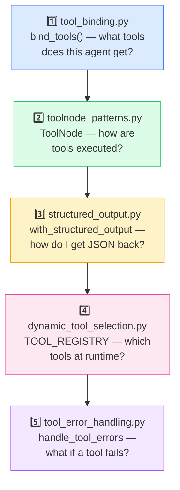
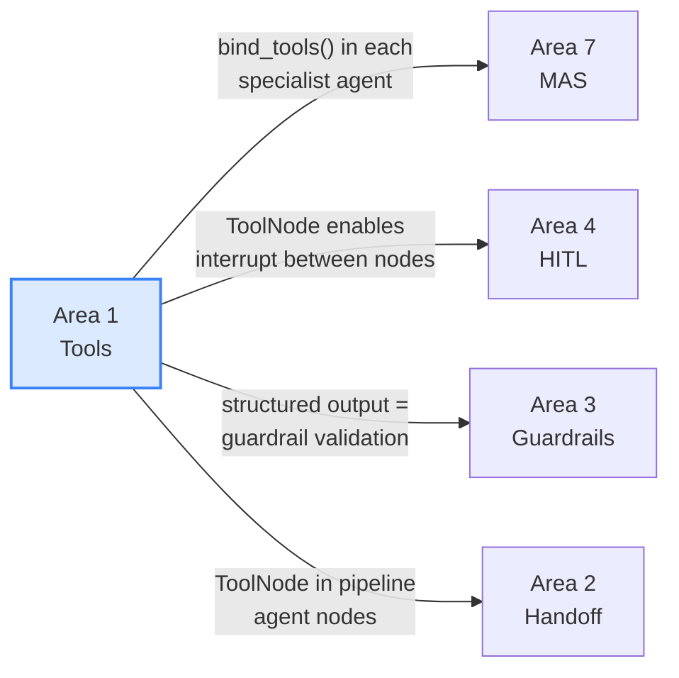
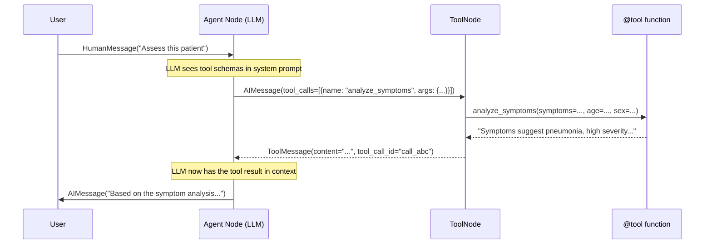

# Tools in LangGraph — Overview

> **This is Area 1 of 9.** Everything you build in this course depends on understanding tools first. Read this chapter before opening any script.

---

## 1. What Are Tools in an Agentic AI System?

A **tool** is a callable function that an LLM can choose to invoke when it needs information or capabilities beyond its training data. Think of it like a surgeon's instrument tray: the surgeon doesn't use every instrument for every procedure — they select the right tool for the right job at the right moment in the operation.

Without tools, an LLM can only reason over its training data. With tools, it becomes an **agent** — a system that can:
- Query real databases and APIs
- Run calculations with guaranteed precision
- Read and write files or memory
- Call external services
- Invoke other specialized agents

In a clinical context, this means an LLM can look up actual drug interaction data, calculate renal-adjusted dosages using real patient vitals, and retrieve specific clinical guidelines — rather than guessing from training data that may be outdated.

```
Without tools                    With tools
┌────────────────┐               ┌────────────────┐
│   LLM reasons  │               │   LLM reasons  │
│   from memory  │    vs.        │   +            │
│   (may be      │               │   ToolNode     │──→ Real databases
│    stale/wrong)│               │   (live data)  │──→ Precise calculators
└────────────────┘               └────────────────┘──→ External services
```

---

## 2. Why LangGraph for Tools?

You *could* call tools as ordinary Python functions — just call them directly. LangGraph adds several critical capabilities on top of plain function calls:

| Capability | Plain Python | LangGraph `@tool` + `ToolNode` |
|-----------|-------------|-------------------------------|
| Schema injection | Manual | Automatic JSON schema in system prompt |
| LLM decides when to call | You code the logic | LLM decides from schema descriptions |
| Streaming visibility | Black box | Every tool call/result appears as a `ToolMessage` |
| Error capture | `try/except` everywhere | `handle_tool_errors=True` on one node |
| Observability | Manual logging | `@observe_tool` decorator, Langfuse traces |
| Human interruption | Not possible | `interrupt()` between agent→tools nodes |

The `@tool` decorator does three things:
1. Wraps your function so it can be called by name via a `ToolMessage`
2. Extracts the docstring and argument types to build a JSON schema (the "tool card" shown to the LLM)
3. Makes it composable with `llm.bind_tools([...])` and `ToolNode`

```python
from langchain_core.tools import tool

@tool
def lookup_drug_info(drug_name: str) -> str:
    """Look up pharmacological information for a given drug.
    
    Args:
        drug_name: The name of the drug to look up (generic or brand name).
    """
    # Implementation in tools/pharmacology_tools.py
    ...
```

The docstring becomes the tool description the LLM reads. Write it like API documentation — it is API documentation.

---

## 3. The 5-Pattern Learning Progression

The five scripts in this area build on each other in a specific order. Don't skip ahead.



**Why this order?**

1. Before you can execute tools in a graph (Script 2), you need to understand how tools are bound to an LLM (Script 1).
2. Before you can get structured output (Script 3), you need to understand the message loop that `ToolNode` creates (Script 2) — because one way to get structured output uses a special tool call.
3. Before you can select tools dynamically (Script 4), you need to understand `bind_tools()` (Script 1) and know it can be called with a dynamic list.
4. Error handling (Script 5) combines `ToolNode` (Script 2) and retry logic — you need both foundations first.

---

## 4. Pattern Comparison Table

| Script | Core Concept | LangGraph Mechanism | When to Use |
|--------|-------------|---------------------|-------------|
| `tool_binding.py` | Scope tools per-agent | `llm.bind_tools([...])` returns new immutable LLM | Every agent definition — this is always step one |
| `toolnode_patterns.py` | Execute tools in a graph | `ToolNode` node or `ToolNode.invoke()` inside a node | Any graph where an LLM needs to call tools |
| `structured_output.py` | Get validated Pydantic output | `llm.with_structured_output(Model)` or submit tool | When you need typed, validated output from an LLM |
| `dynamic_tool_selection.py` | Pick tools at runtime | Pure-Python selector node + runtime `bind_tools()` | Multi-specialty systems; patient-context routing |
| `tool_error_handling.py` | Recover from tool failures | `ToolNode(handle_tool_errors=True)` or `try/except` | Production systems; unreliable external APIs |

---

## 5. How the 6 Clinical Tools Map to Patterns

The root `tools/` package provides 6 `@tool` functions used across all scripts:

```
tools/
├── triage_tools.py
│   ├── analyze_symptoms(symptoms, patient_age, patient_sex) → clinical summary
│   └── assess_patient_risk(age, conditions, medications, vitals) → risk level
├── pharmacology_tools.py
│   ├── check_drug_interactions(medications: list) → interaction report
│   ├── lookup_drug_info(drug_name) → pharmacology data
│   └── calculate_dosage_adjustment(drug_name, current_dose, egfr, weight_kg) → adjusted dose
└── guidelines_tools.py
    └── lookup_clinical_guideline(condition, topic) → guideline text
```

These 6 tools are grouped into three **context groups** (introduced in `tool_binding.py`):

```python
TRIAGE_TOOLS     = [analyze_symptoms, assess_patient_risk]
PHARMA_TOOLS     = [check_drug_interactions, lookup_drug_info, calculate_dosage_adjustment]
GUIDELINE_TOOLS  = [lookup_clinical_guideline]
ALL_TOOLS        = TRIAGE_TOOLS + PHARMA_TOOLS + GUIDELINE_TOOLS
```

Each subsequent script uses subsets of `ALL_TOOLS` to demonstrate its pattern. By Script 4 (`dynamic_tool_selection.py`), the system selects which group to use based on patient-case keywords.

---

## 6. How Tool Patterns Compose with Later Areas

Tool patterns are not just useful in isolation — they underpin every higher-level area:



Specifically:
- **Area 2 (Handoff):** The `linear_pipeline` pattern uses `ToolNode` (from Script 2, Pattern 1) inside each agent stage so agents can call clinical tools before handing off to the next agent.
- **Area 3 (Guardrails):** The `output_validation` guardrail uses `with_structured_output()` (Script 3, Pattern 1) to get a `GuardrailDecision` Pydantic model back from the LLM — enabling schema-enforced safety checks.
- **Area 4 (HITL):** The `tool_call_confirmation` HITL pattern depends on `ToolNode` being a *separate named graph node* (Script 2, Pattern 1) — because LangGraph can only `interrupt()` between nodes, not inside a node function.
- **Area 7 (MAS):** Every specialist agent (TriageAgent, DiagnosticAgent, PharmacistAgent) is built using `BaseAgent.bind_tools()`, which is exactly the immutable-binding pattern from Script 1.

---

## 7. Key Vocabulary

| Term | Definition |
|------|-----------|
| `@tool` | LangChain decorator that wraps a function as an LLM-callable tool with auto-generated JSON schema |
| `bind_tools(tools)` | Method on an LLM that returns a **new, immutable LLM object** pre-loaded with tool schemas — the original LLM is unchanged |
| `ToolNode` | LangGraph node that receives `AIMessage` with `tool_calls`, dispatches each call, and appends `ToolMessage` results to state |
| `add_messages` | LangGraph reducer that **appends** new messages to an existing list (rather than overwriting) — required for the ReAct loop to work |
| `ToolMessage` | A LangChain message type carrying the string result of a tool call, identified by `tool_call_id` |
| `tool_calls` | A list on `AIMessage` — each entry has `id`, `name`, and `args`; if non-empty, `ToolNode` executes them |
| `with_structured_output(Model)` | Wraps an LLM to guarantee it returns a validated Pydantic or JSON Schema object — bypasses `ToolNode` entirely |
| `handle_tool_errors=True` | Parameter on `ToolNode` that catches exceptions from tool functions and returns them as `ToolMessage(content="Error: ...")` rather than crashing |
| `TOOL_REGISTRY` | A Python dict mapping category names to lists of tool functions — used for dynamic selection |
| `ToolDemoState` | The state `TypedDict` used in Script 2 — `messages: Annotated[list, add_messages]`, `agent_response: str` |
| `DynamicToolState` | The state `TypedDict` used in Script 4 — adds `selected_tool_names` and `matched_categories` to enable runtime tool routing |

---

## 8. Reading Order

Read in this order for maximum comprehension:

1. **This file** (`00_overview.md`) — you are here
2. [`01_tool_binding.md`](01_tool_binding.md) — `bind_tools()` immutability and context scoping
3. [`02_toolnode_patterns.md`](02_toolnode_patterns.md) — ToolNode as graph node vs internal invocation
4. [`03_structured_output.md`](03_structured_output.md) — `with_structured_output()` and response-format tool
5. [`04_dynamic_tool_selection.md`](04_dynamic_tool_selection.md) — runtime tool selection via `TOOL_REGISTRY`
6. [`05_tool_error_handling.md`](05_tool_error_handling.md) — `handle_tool_errors` and manual retry
7. Then move on to [`../../handoff/docs/00_overview.md`](../../handoff/docs/00_overview.md) — Area 2

> **TIP:** After reading each doc chapter, open the corresponding script and trace through the code. The scripts are designed to be run directly (`python -m scripts.tools.<name>`), and the printed output maps closely to the worked examples in each chapter.

---

## Quick Mental Model: What Happens When an Agent Uses a Tool

Understanding this sequence will make every pattern in this area immediately clear:



This 6-step sequence is the foundation of **every** tool pattern. Scripts 1–5 each teach you a different aspect of controlling or customising this loop.
