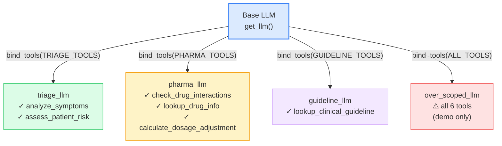
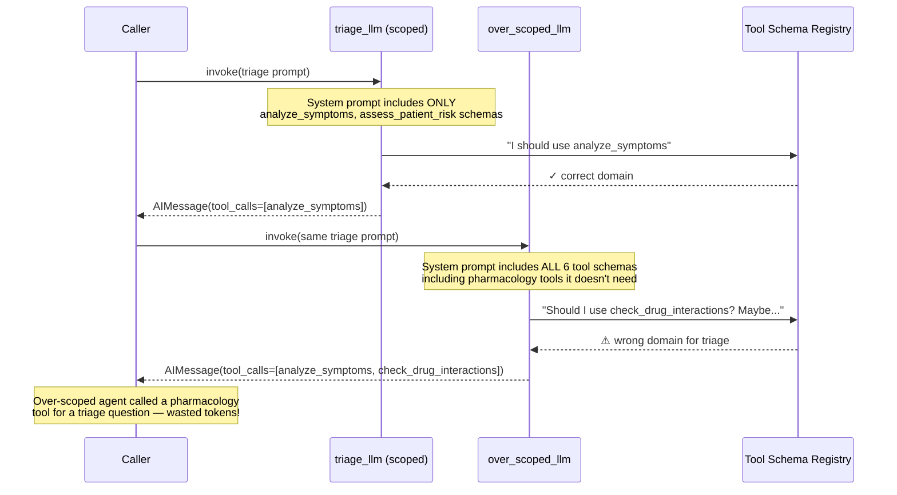

# Pattern 1 — Tool Binding and Context Scoping

> **Script:** `scripts/tools/tool_binding.py`
> **Difficulty:** Beginner
> **LangGraph surface area:** `llm.bind_tools()` (no `StateGraph` used — this is pure LLM configuration)

---

## 1. Plain-English Explanation

Imagine a hospital with three kinds of specialists: triage nurses, pharmacists, and guideline consultants. When you call a triage nurse, you don't give them a pharmacology reference manual — they have their own tools. When you call a pharmacist, you don't hand them triage assessment forms.

**Context scoping** is exactly this: each agent receives **only the tools relevant to its role**. An agent with 2 relevant tools makes better decisions than an agent with 6 tools, 4 of which are irrelevant to the current task.

The mechanism in LangGraph/LangChain is `llm.bind_tools(tools)`. This method:
1. Takes a list of `@tool`-decorated functions
2. Extracts their JSON schemas (name + description + parameters)
3. Returns a **new LLM object** that injects those schemas into every system prompt
4. **Leaves the original LLM completely unchanged**

The result is that the LLM "sees" a curated menu of actions it can take — and the shorter the menu, the fewer mistakes it makes.

```
Without context scoping           With context scoping
┌───────────────────────┐         ┌─────────────────┐
│   over-scoped LLM     │         │  triage_llm     │  (2 tools)
│   sees all 6 tools    │   vs.   ├─────────────────┤
│   may call wrong ones │         │  pharma_llm     │  (3 tools)
└───────────────────────┘         ├─────────────────┤
                                  │  guideline_llm  │  (1 tool)
                                  └─────────────────┘
```

---

## 2. When to Use This Pattern

| Use context scoping when... | Avoid / use caution when... |
|----------------------------|----------------------------|
| You have 2+ agents with distinct specialties | You truly need one generalist with all tools |
| Tool count per specialty exceeds 2-3 | Tool sets are identical for all agents |
| Accuracy on tool selection matters | Building a simple single-agent prototype |
| You want to enforce domain separation | Tool selection must be determined at runtime (see Script 4) |
| You want to minimise input token costs | — |

> **TIP:** In production, start with scoped agents. If you need flexibility, add `dynamic_tool_selection.py` (Script 4) on top — but the default should always be the smallest meaningful tool set.

---

## 3. Architecture Walkthrough

This pattern does **not** use a `StateGraph`. It is pure LLM configuration — you prepare different LLM variants, then invoke them directly.

### ASCII Architecture

```
[Base LLM]  ──── bind_tools([analyze_symptoms, assess_patient_risk]) ────>  [triage_llm]
                                                                                sees 2 tools

[Base LLM]  ──── bind_tools([check_interactions, lookup_drug,              [pharma_llm]
                              calc_dosage])                   ────>             sees 3 tools

[Base LLM]  ──── bind_tools([lookup_guideline]) ─────────────────────>    [guideline_llm]
                                                                                sees 1 tool

[Base LLM]  ──── bind_tools(ALL_TOOLS) ──────────────────────────────>    [over_scoped_llm]
                                                                                sees 6 tools
                                                                                ⚠ risk of wrong calls
```

### Mermaid Architecture Diagram



### Sequence Diagram — Scoped vs Over-Scoped



---

## 4. State Schema Deep Dive

This pattern uses **no `StateGraph` and no `TypedDict`**. Tool binding is about LLM configuration, not graph state. The "state" is just the Python variables holding the LLM objects.

```python
# No TypedDict — just variables
llm         = get_llm()               # base, no tools
triage_llm  = llm.bind_tools(TRIAGE_TOOLS)   # new object
pharma_llm  = llm.bind_tools(PHARMA_TOOLS)   # new object
```

However, understanding the **tool schema** that gets injected into each bound LLM is critical. Here is what `analyze_symptoms`'s schema looks like:

```json
{
  "type": "function",
  "function": {
    "name": "analyze_symptoms",
    "description": "Analyze patient symptoms and provide a clinical assessment...",
    "parameters": {
      "type": "object",
      "properties": {
        "symptoms": {
          "type": "string",
          "description": "Comma-separated list of patient symptoms"
        },
        "patient_age": {
          "type": "integer",
          "description": "Patient age in years"
        },
        "patient_sex": {
          "type": "string",
          "description": "Patient biological sex (M/F)"
        }
      },
      "required": ["symptoms", "patient_age", "patient_sex"]
    }
  }
}
```

This JSON is **automatically generated** from the `@tool` decorator by reading the Python function's type annotations and docstring. You don't write it manually — the schema *is* your function signature and docstring.

**Tool schema quality matters.** A poor docstring produces a poor schema, which produces poor tool selection by the LLM. Treat the docstring of every `@tool` function as its API contract.

---

## 5. Node-by-Node Code Walkthrough

`tool_binding.py` has no nodes — it runs standalone. Here are its three stages:

### Stage 6.2 — `demonstrate_binding()`

```python
llm = get_llm()
triage_llm = llm.bind_tools(TRIAGE_TOOLS)
pharma_llm = llm.bind_tools(PHARMA_TOOLS)

print(f"llm is triage_llm? {llm is triage_llm}")       # → False
print(f"llm is pharma_llm? {llm is pharma_llm}")       # → False
print(f"triage_llm is pharma_llm? {triage_llm is pharma_llm}")  # → False
```

**What this proves:** `bind_tools()` does **not** mutate the original `llm` object. It creates and returns a new LLM instance with the tool schemas embedded. The `is` check (Python identity comparison) confirms they are different objects in memory.

**Why immutability matters:** You can safely reuse `llm` across multiple `.bind_tools()` calls — there is no risk of one agent's tools leaking into another agent's configuration. This is the "factory pattern" for LLMs.

### Stage 6.3 — `show_tool_schemas()`

```python
for tool in TRIAGE_TOOLS:
    schema = tool.args_schema.model_json_schema()
    print(f"  {tool.name}:")
    print(f"    desc: {tool.description[:80]}...")
    params = list(schema.get("properties", {}).keys())
    print(f"    params: {params}")
```

**What this shows:** `tool.args_schema` is the Pydantic model automatically generated by `@tool` from the function signature. `.model_json_schema()` returns the full JSON Schema dict. This is precisely what gets injected into the LLM's system prompt.

The comparison at the end makes the cost clear:
```
Triage agent sees   2 tool schemas
Pharma agent sees   3 tool schemas  
Over-scoped agent sees 6 tool schemas  ← 3× token overhead for tools it doesn't need
```

### Stage 6.4 — `run_comparison()`

```python
# Run same triage prompt through both agents
scoped_llm = llm.bind_tools(TRIAGE_TOOLS)
response = scoped_llm.invoke([system, HumanMessage(content=triage_prompt)], config=config)

over_llm = llm.bind_tools(ALL_TOOLS)
response = over_llm.invoke([system, HumanMessage(content=triage_prompt)], config=config)
```

This is the key experiment: **identical input, different tool sets, observe which tools the LLM calls**.

The comparison logic:
```python
triage_names = {t.name for t in TRIAGE_TOOLS}
scoped_correct = all(c in triage_names for c in scoped_calls)
over_correct = all(c in triage_names for c in over_calls)
```

A call is "correct" if it's within the triage domain. The over-scoped agent often calls `check_drug_interactions` on a triage question — not because it was asked to, but because the tool schema was present and the LLM "thought it might help."

---

## 6. Production Tips

### 1. Define tool groups as module-level constants

```python
# tools_config.py
TRIAGE_TOOLS     = [analyze_symptoms, assess_patient_risk]
PHARMA_TOOLS     = [check_drug_interactions, lookup_drug_info, calculate_dosage_adjustment]
GUIDELINE_TOOLS  = [lookup_clinical_guideline]
```

Keep these in one place. If you add a tool, update the group definition — all agents that use that group automatically see the new tool.

### 2. Never mutate `ALL_TOOLS` at runtime

```python
# ❌ Bad — mutates the shared list
ALL_TOOLS.append(new_tool)
llm.bind_tools(ALL_TOOLS)  # now all agents that import ALL_TOOLS see this new tool

# ✅ Good — create a new list
extended_tools = ALL_TOOLS + [new_tool]
specialist_llm = llm.bind_tools(extended_tools)
```

### 3. Cache bound LLMs if they are expensive to create

```python
@lru_cache(maxsize=None)
def get_triage_llm():
    return get_llm().bind_tools(TRIAGE_TOOLS)
```

`get_llm()` may call an API to initialise the client. Caching the bound LLM avoids repeated initialisation in graph nodes that run many times.

### 4. Write tool docstrings like API documentation

```python
@tool
def analyze_symptoms(symptoms: str, patient_age: int, patient_sex: str) -> str:
    """Analyze patient symptoms and provide a clinical assessment.
    
    Use this tool ONLY for symptom assessment and urgency triage.
    Do NOT use this tool for drug interactions or dosage calculations.
    
    Args:
        symptoms: Comma-separated list of patient symptoms.
        patient_age: Patient age in years (0-120).
        patient_sex: Patient biological sex. One of: "M", "F".
    
    Returns:
        Clinical assessment string with urgency level and recommended actions.
    """
```

The sentence "Do NOT use this tool for..." explicitly steers the LLM away from misuse. This is more reliable than hoping the LLM infers scope from context.

---

## 7. Conditional Routing Explanation

There is **no conditional routing** in `tool_binding.py` — it runs three standalone functions in sequence. This is intentional: tool binding is configuration, not execution flow.

The routing concepts from `toolnode_patterns.py` (Script 2) become relevant once you execute tools inside a `StateGraph`. At that point, the bound LLM from Script 1 becomes the "agent node" input.

The relationship:
```
tool_binding.py          ──creates──>  triage_llm (the configured tool)
toolnode_patterns.py     ──uses──>     triage_llm  (in a graph node)
```

---

## 8. Worked Example — Complete Trace

**Patient case used in `run_comparison()`:**
```
Patient ID : PT-TB-001
Age/Sex    : 58M
Complaint  : Persistent cough and dyspnea for 3 weeks
Symptoms   : cough, dyspnea, wheezing, fatigue
History    : COPD Stage II, Former smoker (30 pack-years)
Medications: Tiotropium 18mcg inhaler daily
Labs       : FEV1 58% predicted, SpO2 93%
Vitals     : BP 138/85, HR 92, SpO2 93%
```

**Expected trace for scoped agent (`TRIAGE_TOOLS`):**
```
[Stage 6.4] RUN 1: SCOPED AGENT (2 triage tools)
  Called: analyze_symptoms
  Called: assess_patient_risk

COMPARISON:
  Scoped agent tools called   : ['analyze_symptoms', 'assess_patient_risk']
  Scoped stayed in domain?    : True
```

**Expected trace for over-scoped agent (`ALL_TOOLS`):**
```
[Stage 6.4] RUN 2: OVER-SCOPED AGENT (all tools)
  Called: analyze_symptoms
  Called: assess_patient_risk
  Called: check_drug_interactions   ← pharmacology tool on a triage question

  Over-scoped called wrong tools: ['check_drug_interactions']
  -> This is why context scoping matters.
```

The over-scoped agent sees `check_drug_interactions` in its tool menu and, given the presence of medications in the patient record, decides it "should" check drug interactions — even though the task was triage, not pharmacology review.

---

## 9. Key Concepts Summary

| Concept | What it means | Why it matters |
|---------|--------------|----------------|
| `bind_tools(tools)` | Returns a new LLM with `tools` injected into every system prompt | The mechanism for giving agents their tool menu |
| Immutability | The original LLM is unchanged after `bind_tools()` | Safe reuse of base LLM across multiple agent definitions |
| Tool schema | JSON Schema auto-generated from `@tool` docstring and type annotations | The "tool card" the LLM reads when deciding which tool to call |
| Context scoping | Giving each agent only its relevant tools | Improves accuracy, reduces token costs, enforces domain separation |
| Over-scoping | Binding all tools to every agent | Leads to wrong tool calls, wasted tokens, confused agents |
| `TRIAGE_TOOLS` | `[analyze_symptoms, assess_patient_risk]` | The triage domain action space |
| `PHARMA_TOOLS` | `[check_drug_interactions, lookup_drug_info, calculate_dosage_adjustment]` | The pharmacology domain action space |
| `GUIDELINE_TOOLS` | `[lookup_clinical_guideline]` | The guidelines domain action space |

---

## 10. Common Mistakes

### Mistake 1: Mutating a tool list after binding

```python
# ❌ Wrong
tools_list = [analyze_symptoms]
llm_a = base_llm.bind_tools(tools_list)
tools_list.append(check_drug_interactions)  # Does NOT affect llm_a — already bound
llm_b = base_llm.bind_tools(tools_list)    # llm_b gets both tools

# ✅ Right — create new lists explicitly
triage_tools = [analyze_symptoms]
pharma_tools = [check_drug_interactions]
```

### Mistake 2: Re-binding an already-bound LLM

```python
# ❌ Wrong — double-binding, unpredictable schema injection
triage_llm = base_llm.bind_tools(TRIAGE_TOOLS)
both_llm = triage_llm.bind_tools(PHARMA_TOOLS)  # Which tools does this have?

# ✅ Right — always bind from the base LLM
both_llm = base_llm.bind_tools(TRIAGE_TOOLS + PHARMA_TOOLS)
```

### Mistake 3: Poor tool docstrings

```python
# ❌ Useless docstring
@tool
def analyze_symptoms(symptoms: str, age: int, sex: str) -> str:
    """Analyzes symptoms."""  # LLM has no idea when to call this

# ✅ Actionable docstring
@tool
def analyze_symptoms(symptoms: str, patient_age: int, patient_sex: str) -> str:
    """Analyze patient symptoms and provide a clinical assessment with urgency level.
    
    Use this when you need to evaluate a patient's presenting symptoms to determine
    triage priority and initial assessment. Do NOT use for drug interactions.
    
    Args:
        symptoms: Comma-separated list of symptoms (e.g., "fever, cough, dyspnea").
        patient_age: Patient age in years.
        patient_sex: Patient biological sex. One of: "M", "F".
    """
```

### Mistake 4: Using `tool_binding` when you need dynamic selection

```python
# ❌ Rigid — you must know the patient type at definition time
renal_llm = base_llm.bind_tools(RENAL_TOOLS)

# ✅ For runtime selection, use dynamic_tool_selection.py (Script 4)
# The TOOL_REGISTRY pattern reads patient keywords at runtime
```

---

## 11. Pattern Connections

| This pattern... | Connects to... | How |
|----------------|---------------|-----|
| `bind_tools()` immutability | **Script 2** (`toolnode_patterns.py`) | The bound LLM from Script 1 becomes the agent node in Script 2's `StateGraph` |
| Context scoping groups (`TRIAGE_TOOLS`, etc.) | **Script 4** (`dynamic_tool_selection.py`) | Script 4's `TOOL_REGISTRY` maps category names to the same group constants defined here |
| `bind_tools()` returning a new LLM | **Area 7** (MAS architectures) | `BaseAgent.bind_tools()` in `agents/base_agent.py` uses exactly this pattern — each specialist agent binds its own tool set |
| Tool schema quality | **All tool-using patterns** | The JSON schema from the docstring is what the LLM uses for all tool calls — bad docstrings hurt accuracy everywhere |

**Next:** [`02_toolnode_patterns.md`](02_toolnode_patterns.md) — Now that you understand how tools are bound to an LLM, learn the two ways to **execute** those tool calls inside a LangGraph graph.
