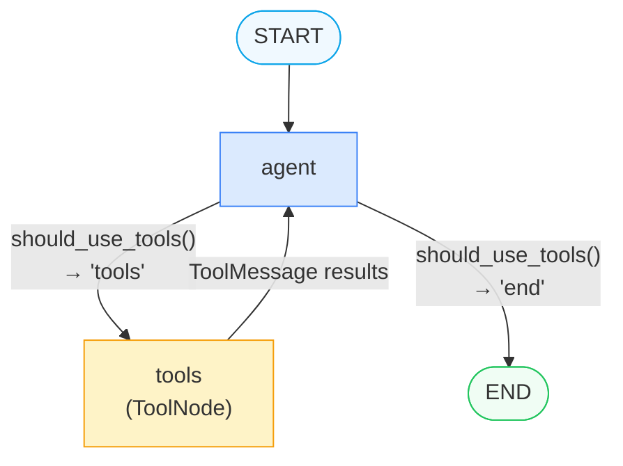
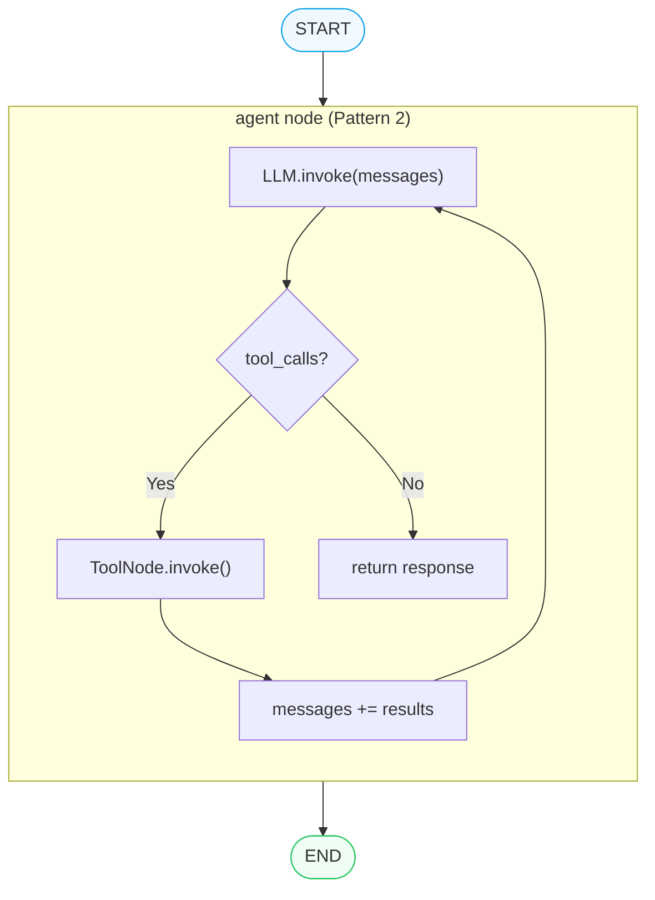
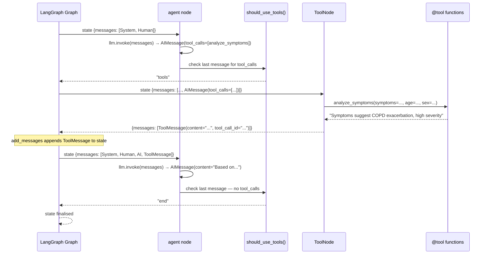

# Pattern 2 — ToolNode: Graph Node vs Manual Invocation

> **Script:** `scripts/tools/toolnode_patterns.py`
> **Difficulty:** Beginner–Intermediate
> **LangGraph surface area:** `StateGraph`, `ToolNode`, `add_messages`, `add_conditional_edges`, `START`, `END`

---

## 1. Plain-English Explanation

In Pattern 1 (Script 1), you learned how to **configure** a tool-bound LLM. Now you need to learn how to **execute** the tool calls that LLM produces. When an LLM decides to call a tool, it doesn't call it directly — it emits an `AIMessage` containing structured `tool_calls` data. Something else must read those calls, dispatch them to the actual Python functions, collect the results, and feed them back to the LLM.

That "something else" is `ToolNode`.

`ToolNode` is a LangGraph pre-built node that:
1. Reads the last `AIMessage` in state for `tool_calls`
2. Executes each called tool function with the provided arguments
3. Wraps each result in a `ToolMessage`
4. Returns them to be appended to the `messages` list

There are **two ways** to use `ToolNode`:

**Pattern 1 (Graph Node):** Register `ToolNode` as a named node in your `StateGraph`. The agent and tools nodes form an explicit loop in the graph topology — visible in graph diagrams, debuggable via streaming, and addressable for Human-in-the-Loop interruption.

**Pattern 2 (Manual Invocation):** Call `ToolNode.invoke()` directly inside your agent's node function. The loop exists in Python code, not in the graph topology — simpler graph, but tool execution is encapsulated and invisible from the outside.

Both produce the same final output. The choice is about **visibility and control**.

```
Pattern 1 — Explicit topology       Pattern 2 — Encapsulated
┌───────────────────────┐           ┌───────────────────────┐
│ START → agent → tools │           │ START → agent → END   │
│          ↑      ↓     │   vs.     │        (internal loop)│
│          └──────┘     │           └───────────────────────┘
│ agent → END (no calls)│
└───────────────────────┘
  Nodes: 2                             Nodes: 1
  Tool calls stream externally         Tool calls hidden inside node
```

---

## 2. When to Use Each Pattern

### Pattern 1 (ToolNode as Graph Node) — Use when:

| Scenario | Why Pattern 1 |
|---------|--------------|
| You need Human-in-the-Loop confirmation of tool calls | `interrupt()` requires separate nodes — you can only interrupt *between* nodes, not inside a function |
| You want streaming visibility of tool execution steps | Each node step appears in stream output — callers see `agent → tools → agent` |
| You're debugging tool call issues | Tool calls are a distinct step with their own trace entry |
| You want middleware between agent and tools | Add a pre-processing or validation node between `agent` and `tools` |
| Building production systems with observability | Separate nodes produce separate Langfuse traces |

### Pattern 2 (Manual Invocation) — Use when:

| Scenario | Why Pattern 2 |
|---------|--------------|
| Simple single-agent with self-contained tool loop | Less boilerplate, simpler graph |
| You need custom retry logic between tool calls | Full Python control over the loop |
| You need to filter or transform tool results before feeding back | Can inspect and modify `tool_results["messages"]` before appending |
| The caller doesn't need to see individual tool steps | Cleaner interface for the calling system |

> **TIP:** In production systems that will be extended over time, prefer Pattern 1. Adding HITL confirmation later requires Pattern 1 — and retrofitting is harder than starting with the right topology.

---

## 3. Architecture Walkthrough

### Pattern 1 — Graph Node Architecture

```
            START
              │
              ▼
        ┌─────────┐
        │  agent  │ ◄─────────────────┐
        └─────────┘                   │
              │                       │
      has_tool_calls?                 │
         ┌───┴───┐                    │
         │ tools │     "tools"        │ ToolMessages
         │  node │ ──────────────────►│
         └───────┘                    │
         "end"                        
              │
              ▼
            END
```

The `should_use_tools` router function implements the branch:
- If `state["messages"][-1]` has `.tool_calls` → route to `"tools"`
- Otherwise → route to `END`

This creates an **implicit cycle** in the graph: `agent → tools → agent → tools → ... → END`. Each iteration through the cycle is one tool-execution round-trip.

### Pattern 2 — Internal Loop Architecture

```
START
  │
  ▼
┌─────────────────────────────────────────┐
│               agent node                │
│                                         │
│  response = llm.invoke(messages)        │
│                                         │
│  while response.tool_calls:             │
│      results = ToolNode.invoke(...)     │
│      messages += [response] + results   │
│      response = llm.invoke(messages)    │
│                                         │
│  return final response                  │
└─────────────────────────────────────────┘
  │
  ▼
END
```

The Python `while` loop replaces the graph cycle. The topology is a straight line; the complexity lives inside the node function.

### Mermaid Diagram — Pattern 1



### Mermaid Diagram — Pattern 2



### Sequence Diagram — Pattern 1



---

## 4. State Schema Deep Dive

Both patterns share the same `ToolDemoState`:

```python
class ToolDemoState(TypedDict):
    messages: Annotated[list, add_messages]
    agent_response: str
```

### `messages: Annotated[list, add_messages]`

This is the most important state field in LangGraph. Let's unpack it:

- `Annotated[list, add_messages]` — the type annotation tells LangGraph to use `add_messages` as the **reducer** for this field.
- A **reducer** is a function that merges an existing state value with an update. Instead of *replacing* the messages list, `add_messages` *appends* new messages.
- Without `add_messages`, every node return would overwrite `messages` with only the new message — losing all history.

**What `add_messages` does:**
```python
# State before agent node runs:
state["messages"] = [SystemMessage, HumanMessage]

# Agent node returns:
{"messages": [AIMessage(tool_calls=[...])]}

# State after add_messages reducer:
state["messages"] = [SystemMessage, HumanMessage, AIMessage(tool_calls=[...])]
#                                                  ^-- appended, not replaced

# ToolNode returns:
{"messages": [ToolMessage(content="...")]}

# State after add_messages reducer:
state["messages"] = [SystemMessage, HumanMessage, AIMessage, ToolMessage]
#                                                              ^-- appended again
```

This accumulation is what makes the ReAct loop work: each LLM invocation gets **all prior context** — including previous tool calls and their results — automatically.

### `agent_response: str`

A plain string field with no reducer — it is simply overwritten each time. The agent node sets this to `response.content` (the final text response). It provides a clean "output" field that callers can read without parsing the full `messages` list.

### Message Types in the Loop

| Message Type | Who creates it | What it contains |
|-------------|---------------|-----------------|
| `SystemMessage` | Caller (initial state) | Agent instructions |
| `HumanMessage` | Caller (initial state) | User request / patient data |
| `AIMessage` with `tool_calls` | Agent node (LLM) | Intent to call tools; each entry has `id`, `name`, `args` |
| `ToolMessage` | ToolNode | Tool execution result; `tool_call_id` matches the `AIMessage` entry |
| `AIMessage` without `tool_calls` | Agent node (LLM) | Final text response after processing tool results |

---

## 5. Node-by-Node Code Walkthrough

### Pattern 1 — `agent_node`

```python
def agent_node(state: ToolDemoState) -> dict:
    config = build_callback_config(trace_name="toolnode_p1_agent")
    response = agent_llm.invoke(state["messages"], config=config)
    # ↑ passes the FULL messages list every time — includes all prior tool results

    if hasattr(response, "tool_calls") and response.tool_calls:
        print(f"[P1 Agent] Tool calls: {[tc['name'] for tc in response.tool_calls]}")
    else:
        print(f"[P1 Agent] Final response: {len(response.content)} chars")

    return {"messages": [response], "agent_response": response.content or ""}
    # ↑ returns the new AIMessage; add_messages will APPEND it to state["messages"]
```

**Key:** `agent_node` is called **multiple times** — once for the initial call (producing `tool_calls`), and once more after the ToolNode runs (producing the final response). The `state["messages"]` keeps growing on each call.

### Pattern 1 — `should_use_tools` router

```python
def should_use_tools(state: ToolDemoState) -> Literal["tools", "end"]:
    last_msg = state["messages"][-1]
    # ↑ always check the LAST message — could be AIMessage or ToolMessage
    if hasattr(last_msg, "tool_calls") and last_msg.tool_calls:
        return "tools"
    return "end"
```

**Key:** `state["messages"][-1]` is the last-appended message. After `agent_node` returns, it's the new `AIMessage`. If that AIMessage has `tool_calls`, we route to the `tools` node. Otherwise we route to `END`.

### Pattern 1 — Graph Assembly

```python
workflow = StateGraph(ToolDemoState)

workflow.add_node("agent", agent_node)
workflow.add_node("tools", ToolNode(TOOLS))
# ↑ ToolNode is instantiated with the same TOOLS list as agent_llm was bound with

workflow.add_edge(START, "agent")
workflow.add_conditional_edges(
    "agent",          # from this node
    should_use_tools, # use this function to decide
    {"tools": "tools", "end": END},  # map return value → next node
)
workflow.add_edge("tools", "agent")  # ← the cycle: tools results go back to agent
```

**Key insight:** `add_conditional_edges` maps the *string return values* of `should_use_tools` to *node names* in the dict. When `should_use_tools` returns `"tools"`, the graph goes to the `"tools"` node. When it returns `"end"`, the graph goes to `END`.

### Pattern 2 — `agent_node` with internal loop

```python
def agent_node(state: ToolDemoState) -> dict:
    config = build_callback_config(trace_name="toolnode_p2_agent")
    messages = list(state["messages"])   # ← local copy to extend during the loop
    response = agent_llm.invoke(messages, config=config)

    # Internal tool loop
    while hasattr(response, "tool_calls") and response.tool_calls:
        print(f"[P2 Agent] Tool calls: {[tc['name'] for tc in response.tool_calls]}")

        tool_node = ToolNode(TOOLS)
        tool_results = tool_node.invoke({"messages": [response]})
        # ↑ ToolNode.invoke() takes a dict with "messages" containing the AIMessage
        # ↑ It returns {"messages": [ToolMessage1, ToolMessage2, ...]}

        messages.extend([response] + tool_results["messages"])
        # ↑ Append: the AIMessage (with tool_calls) AND the ToolMessages
        
        response = agent_llm.invoke(messages, config=config)
        # ↑ Re-invoke with all tool results in context

    return {"messages": [response], "agent_response": response.content}
```

**Key differences from Pattern 1:**
1. `messages` is a local list that grows inside this function — it doesn't come from `state` on each iteration
2. `ToolNode` is instantiated fresh inside the loop (could be cached for efficiency)
3. The loop exits naturally when `response.tool_calls` is empty
4. Only the final response is returned to state — intermediate messages are NOT in `state["messages"]`

> **WARNING:** In Pattern 2, tool call history is NOT stored in `state["messages"]`. If other nodes need to see the tool call trace, Pattern 2 is the wrong choice. The `messages` list in state will only contain `[SystemMessage, HumanMessage, ..., final AIMessage]` — no ToolMessages.

---

## 6. Production Tips

### 1. Add a `max_iterations` guard to Pattern 1

```python
class ToolDemoState(TypedDict):
    messages: Annotated[list, add_messages]
    agent_response: str
    iteration_count: int  # ← add this

def agent_node(state: ToolDemoState) -> dict:
    count = state.get("iteration_count", 0) + 1
    if count > 10:
        return {
            "messages": [AIMessage(content="Max iterations reached.")],
            "agent_response": "Max iterations reached.",
            "iteration_count": count,
        }
    # ... normal logic
    return {..., "iteration_count": count}
```

Without a guard, a misbehaving LLM could loop indefinitely — calling tools, getting results, then calling more tools without converging.

### 2. Ensure `ToolNode` and `bind_tools` use the same tool list

```python
TOOLS = [analyze_symptoms, assess_patient_risk]

# These MUST use the same TOOLS list:
agent_llm = base_llm.bind_tools(TOOLS)    # ← LLM knows these schemas
tool_node = ToolNode(TOOLS)               # ← ToolNode can dispatch these

# ❌ Mismatch — LLM calls a tool that ToolNode doesn't know about
agent_llm = base_llm.bind_tools([analyze_symptoms, assess_patient_risk])
tool_node = ToolNode([analyze_symptoms])  # ← missing assess_patient_risk!
```

If the LLM calls a tool that isn't in the `ToolNode`'s tool list, `ToolNode` will raise a `KeyError`.

### 3. Streaming Pattern 1 for real-time tool visibility

```python
for chunk in graph.stream(initial_state, stream_mode="values"):
    last_msg = chunk["messages"][-1]
    if isinstance(last_msg, AIMessage) and last_msg.tool_calls:
        print(f"→ Calling tools: {[tc['name'] for tc in last_msg.tool_calls]}")
    elif hasattr(last_msg, "name"):  # ToolMessage
        print(f"← Tool result ({last_msg.name}): {last_msg.content[:50]}...")
    elif isinstance(last_msg, AIMessage) and last_msg.content:
        print(f"✓ Final: {last_msg.content[:80]}...")
```

This gives callers real-time visibility into tool execution — something Pattern 2 cannot provide.

### 4. The `ToolNode` must be constructed inside the function that calls `compile()`

```python
# ✅ Tool node created at graph construction time
def build_graph():
    tool_node = ToolNode(TOOLS)
    workflow.add_node("tools", tool_node)
    return workflow.compile()

# ❌ Don't create ToolNode inside node functions that run repeatedly
# (Pattern 2 in the script does this for demonstration — cache it in production)
```

---

## 7. Conditional Routing Explanation

### Pattern 1 Router Logic

```
should_use_tools(state) → "tools" OR "end"
```

| Condition | Returns | Next node |
|-----------|---------|-----------|
| `state["messages"][-1]` is `AIMessage` with `.tool_calls` non-empty | `"tools"` | `ToolNode` |
| `state["messages"][-1]` is `AIMessage` with empty/missing `.tool_calls` | `"end"` | `END` |

The `add_conditional_edges` call maps these string returns to actual graph destinations:
```python
workflow.add_conditional_edges(
    "agent",
    should_use_tools,
    {"tools": "tools", "end": END}
)
```

**Why does the router check `state["messages"][-1]` instead of the `agent_response` field?** Because `messages` is the canonical source of truth — `agent_response` only holds the text content and has no information about pending tool calls.

### Pattern 2 Routing

Pattern 2 has **no conditional edges** — the graph topology is purely sequential (`START → agent → END`). All routing logic lives inside the Python `while` loop.

---

## 8. Worked Example — Message List Growth

**Patient:** 58-year-old male, COPD, persistent cough + dyspnea (same patient from `tool_binding.py`).

**Pattern 1 — Message list at each step:**

```
Step 1: Agent node first call
  state["messages"] = [
    0: SystemMessage  "Evaluate the patient using your tools."
    1: HumanMessage   "Patient: 58y M\nComplaint: Persistent cough..."
  ]
  → LLM produces: AIMessage(tool_calls=[analyze_symptoms, assess_patient_risk])

Step 2: After add_messages reducer
  state["messages"] = [
    0: SystemMessage
    1: HumanMessage
    2: AIMessage(tool_calls=[{name: "analyze_symptoms", ...}, {name: "assess_patient_risk", ...}])
  ]
  → Router: "tools" (has tool_calls)

Step 3: ToolNode executes both tools
  Returns: {messages: [
    ToolMessage(content="Symptoms suggest COPD exacerbation...", tool_call_id="call_001"),
    ToolMessage(content="Risk assessment: HIGH RISK...", tool_call_id="call_002")
  ]}

Step 4: After add_messages reducer
  state["messages"] = [
    0: SystemMessage
    1: HumanMessage
    2: AIMessage(tool_calls=[...])
    3: ToolMessage(content="Symptoms suggest COPD exacerbation...")
    4: ToolMessage(content="Risk assessment: HIGH RISK...")
  ]

Step 5: Agent node second call — receives full context
  → LLM sees messages 0-4, synthesises tool results
  → Produces: AIMessage(content="Based on the analysis, this patient presents with...", tool_calls=[])

Step 6: Router: "end" (no tool_calls)
  Final state["messages"] = [
    0: SystemMessage
    1: HumanMessage
    2: AIMessage(tool_calls)
    3: ToolMessage (analyze_symptoms result)
    4: ToolMessage (assess_patient_risk result)
    5: AIMessage(content="Final response...")  ← agent_response
  ]
  Total messages: 6
  Tool results: 2 (msgs 3 and 4)
  AI messages: 2 (msgs 2 and 5)
```

**Pattern 2 — What state contains after the node:**

```
Final state["messages"] = [
  0: SystemMessage
  1: HumanMessage
  2: AIMessage(content="Final response...")  ← only the final response is returned
]
  Total messages: 3
  Tool results: 0 (they existed locally in the node but were never returned)
  AI messages: 1
```

The difference is significant: Pattern 2 hides all intermediate reasoning from the caller.

---

## 9. Key Concepts Summary

| Concept | What it means | Why it matters |
|---------|--------------|----------------|
| `ToolNode` | Pre-built LangGraph node that dispatches tool calls from `AIMessage` | Eliminates boilerplate tool dispatch code |
| `add_messages` | Reducer that appends new messages instead of replacing them | Required for the ReAct loop — without it, history is lost |
| `should_use_tools` | Router function that returns `"tools"` or `"end"` | Controls the agent-tools cycle in Pattern 1 |
| `add_conditional_edges` | Maps router return values to next nodes | The mechanism for conditional branching in LangGraph |
| `ToolNode.invoke()` | Call ToolNode directly as a Python function | Enables Pattern 2's internal loop |
| `tool_calls` on `AIMessage` | List of `{id, name, args}` dicts | The LLM's intent to call tools — ToolNode reads this |
| `ToolMessage` | Message type holding a tool's string result | The "return value" of a tool, identified by `tool_call_id` |
| ReAct loop | Agent-Think-Act-Observe cycle | The pattern where the LLM acts, observes tool results, and reasons again |

---

## 10. Common Mistakes

### Mistake 1: Forgetting `add_messages` on the messages field

```python
# ❌ Wrong — messages will be REPLACED on every node return
class BadState(TypedDict):
    messages: list    # No reducer!

# ✅ Correct — messages are APPENDED
class GoodState(TypedDict):
    messages: Annotated[list, add_messages]
```

Without `add_messages`, each node's return overwrites the previous messages. The LLM on its second call would only see its own output from the first call — not the original user request or tool results.

### Mistake 2: Mismatched tools between `bind_tools` and `ToolNode`

```python
# ❌ Wrong — ToolNode doesn't know about lookup_clinical_guideline
agent_llm = base_llm.bind_tools(TRIAGE_TOOLS + GUIDELINE_TOOLS)
tool_node = ToolNode(TRIAGE_TOOLS)  # ← missing GUIDELINE_TOOLS

# ✅ Right — same list for both
TOOLS = TRIAGE_TOOLS + GUIDELINE_TOOLS
agent_llm = base_llm.bind_tools(TOOLS)
tool_node = ToolNode(TOOLS)
```

### Mistake 3: Using Pattern 2 when you need HITL

```python
# ❌ Wrong — HITL needs Pattern 1 (separate "tools" node to interrupt before)
def agent_node_p2(state):
    # Internal loop — no way to interrupt between agent and tool execution
    while response.tool_calls:
        results = ToolNode.invoke(...)
        # HITL cannot intercept here

# ✅ Right for HITL — Pattern 1, interrupt between "agent" and "tools"
workflow.add_edge("agent", "hitl_review")     # add an interrupt node
workflow.add_edge("hitl_review", "tools")
```

### Mistake 4: Checking the wrong message for tool calls in the router

```python
# ❌ Wrong — checking first message instead of last
def bad_router(state):
    first_msg = state["messages"][0]  # SystemMessage — never has tool_calls!
    if hasattr(first_msg, "tool_calls") and first_msg.tool_calls:
        return "tools"
    return "end"  # Always returns "end" — loop never triggers

# ✅ Right — always check the LAST message
def should_use_tools(state):
    last_msg = state["messages"][-1]  # ← the most recently added message
    if hasattr(last_msg, "tool_calls") and last_msg.tool_calls:
        return "tools"
    return "end"
```

---

## 11. Pattern Connections

| This pattern... | Connects to... | How |
|----------------|---------------|-----|
| Pattern 1 (ToolNode as graph node) | **Area 4 (HITL)** | The `tool_call_confirmation` HITL pattern adds an `interrupt()` between the `agent` and `tools` nodes from Pattern 1. You must use Pattern 1 to do HITL on tool calls. |
| `add_messages` reducer | **All multi-step patterns** | Every area that uses a message-accumulating state relies on `add_messages`. Understanding it here makes all later patterns immediately comprehensible. |
| `should_use_tools` router | **Area 3 (Guardrails)** | The `output_validation` guardrail uses the same router pattern — a function that inspects state and returns a string that maps to the next node. |
| Pattern 2 (encapsulated loop) | **Area 7 (MAS)** | Several MAS worker nodes in `sequential_pipeline` and `hierarchical_delegation` use Pattern 2 internally — the worker does its tool loop, then hands off a clean result. |
| `ToolNode(TOOLS)` construction | **Script 5** (`tool_error_handling.py`) | Script 5 uses `ToolNode(TOOLS, handle_tool_errors=True)` — the same construction, but with error handling enabled. |

**Next:** [`03_structured_output.md`](03_structured_output.md) — Learn how to get **validated Pydantic objects** back from an LLM instead of free text, using `with_structured_output()` and a response-format tool pattern.
