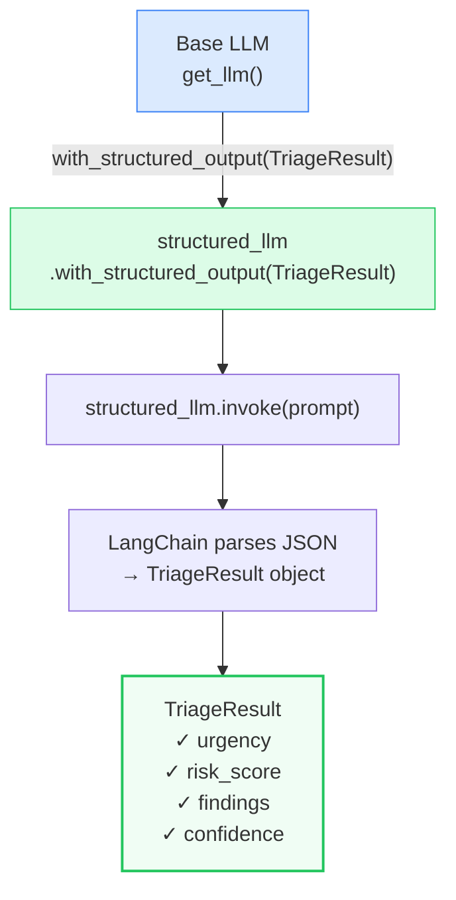
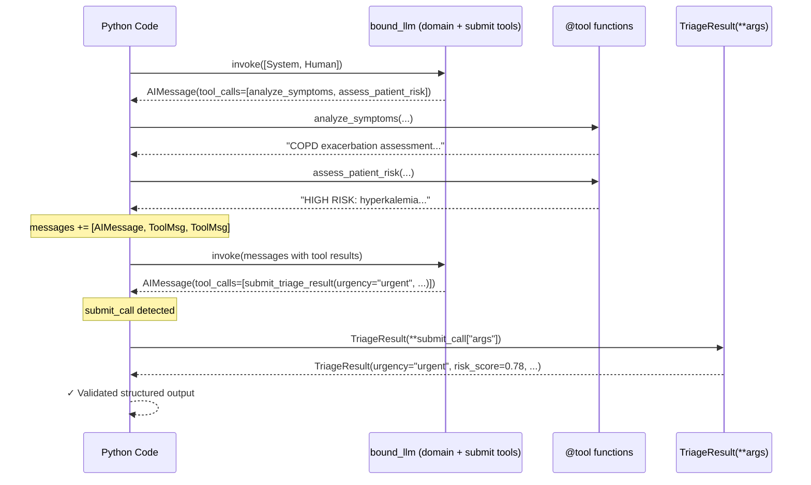

# Pattern 3 — Structured Output

> **Script:** `scripts/tools/structured_output.py`
> **Difficulty:** Intermediate
> **LangGraph surface area:** `llm.with_structured_output()`, `@tool` as a response-format schema

---

## 1. Plain-English Explanation

By default, an LLM returns free text — a string like `"The patient appears to be at high risk based on..."`. Free text is great for human reading but terrible for downstream code that needs to:
- Compare urgency levels (`if result.urgency == "emergent":`)
- Validate ranges (`assert 0.0 <= result.risk_score <= 1.0`)
- Route the patient to the right care pathway based on specific field values
- Store assessment data in a structured database

**Structured output** solves this by forcing the LLM to return a **Pydantic-validated object** — a Python object with typed, validated fields — rather than free text.

There are two ways to achieve this:

**Pattern 1 — `with_structured_output(Model)`:** Wrap the LLM with your Pydantic model as the target type. LangChain tells the underlying model API to use JSON mode or function-calling to guarantee schema compliance. You call `.invoke()` and get back a `TriageResult` object directly.

**Pattern 2 — Response-format tool:** Define a `@tool` called `submit_triage_result` whose *arguments* are the fields you want. The LLM calls this tool to "submit" its answer. You extract the answer from the `tool_calls[i]["args"]` dict and validate it with Pydantic manually.

Think of Pattern 1 as ordering from a fixed menu and getting a plate — you always get exactly what the menu says. Pattern 2 is like the chef calling out the dish specifications for the kitchen — more steps, but the chef can also use other kitchen tools (domain tools) before calling out the final order.

```
Pattern 1 — with_structured_output()     Pattern 2 — Response-format tool
┌────────────────────────────────┐        ┌────────────────────────────────┐
│ structured_llm.invoke(prompt)  │        │ 1. LLM calls domain tools      │
│          ↓                     │        │ 2. LLM calls submit_triage()   │
│   TriageResult(urgency=...,    │  vs.   │ 3. Extract args from tool_call │
│    risk_score=..., ...)        │        │ 4. TriageResult(**args)        │
│ ← automatic Pydantic parsing  │        │ ← manual Pydantic construction │
└────────────────────────────────┘        └────────────────────────────────┘
  No tool calls, single LLM call           Tool calls allowed before submit
  Cleanest when output is the only goal    Needed when domain tools come first
```

---

## 2. When to Use Each Pattern

### Pattern 1 — `with_structured_output()` — Use when:

| Scenario | Why Pattern 1 |
|---------|--------------|
| The LLM's only job is to produce a structured result | Cleanest, fewest moving parts |
| No domain tool calls needed before output | Single LLM call, no loop required |
| You want Pydantic validation handled automatically | LangChain parses and validates for you |
| Building guardrails or classifiers | Pattern 1 is the mechanism for `GuardrailDecision`, `ConfidenceScore`, etc. |

### Pattern 2 — Response-format tool — Use when:

| Scenario | Why Pattern 2 |
|---------|--------------|
| LLM must call domain tools first, then submit structured output | Pattern 1 disables tool calls; Pattern 2 allows both |
| You want the LLM to gather evidence before committing to a structured answer | The submit tool acts as a "commit" step after research |
| The structured output depends on tool results that the LLM needs to see | Tool results become part of the LLM's context before it submits |

> **NOTE:** `with_structured_output()` and `bind_tools()` are **mutually exclusive** on the same LLM call. A `structured_llm` cannot also call domain tools. If you need both domain tools AND structured output, use Pattern 2.

---

## 3. Architecture Walkthrough

### Pattern 1 — Single LLM call, no graph

```
[LLM base]
    │
    └── .with_structured_output(TriageResult)
                │
                ▼
    [structured_llm]
    │
    └── .invoke([SystemMessage, HumanMessage])
                │
                ▼
    TriageResult(
        urgency="urgent",
        risk_score=0.78,
        primary_concern="Hyperkalemia risk",
        findings=["K+ 5.4", "Dual K-raising agents"],
        recommended_actions=["ECG stat", "Hold Spironolactone"],
        confidence=0.85
    )  ← Pydantic validated object — no further parsing needed
```

Like `bind_tools()`, `with_structured_output()` returns a **new LLM-like object** — it doesn't modify the base LLM. The returned object is a `RunnableSequence` that internally uses either the model's JSON mode or function-calling to enforce the schema, then runs the output through Pydantic.

### Pattern 2 — Domain tools + submit tool

```
[LLM bound to (domain_tools + submit_triage_result)]
    │
    └── .invoke([System, Human])
                │
                ▼
    AIMessage(tool_calls=[
        {name: "analyze_symptoms", args: {...}},      ← domain tool call
        {name: "assess_patient_risk", args: {...}},   ← domain tool call
    ])
    │
    [Manually execute domain tools]
    │
    └── messages += [AIMessage, ToolMessage, ToolMessage]
    │
    └── bound_llm.invoke(messages)  ← re-invoke with tool results
                │
                ▼
    AIMessage(tool_calls=[
        {name: "submit_triage_result", args: {     ← structured output tool
            "urgency": "urgent",
            "risk_score": 0.78,
            ...
        }}
    ])
    │
    [Extract args, construct TriageResult]
    └── TriageResult(**submit_call["args"])
```

### Mermaid Diagram — Pattern 1



### Mermaid Diagram — Pattern 2



---

## 4. State Schema Deep Dive

The central data structure in this script is `TriageResult` — the output schema.

```python
from typing import Literal
from pydantic import BaseModel, Field

class TriageResult(BaseModel):
    urgency: Literal["emergent", "urgent", "semi-urgent", "non-urgent"] = Field(
        description="Triage urgency level"
    )
    risk_score: float = Field(
        ge=0.0, le=1.0,
        description="Risk score from 0.0 (lowest) to 1.0 (highest)"
    )
    primary_concern: str = Field(
        description="Single most important clinical finding"
    )
    findings: list[str] = Field(
        description="List of 2-5 key clinical findings"
    )
    recommended_actions: list[str] = Field(
        description="List of 2-4 recommended next steps"
    )
    confidence: float = Field(
        ge=0.0, le=1.0,
        description="Agent's confidence in this assessment"
    )
```

### Field-by-field explanation

| Field | Type | Constraints | Purpose |
|-------|------|-------------|---------|
| `urgency` | `Literal[...]` | Must be one of 4 exact strings | Downstream routing — `if result.urgency == "emergent": call_911()` |
| `risk_score` | `float` | `ge=0.0, le=1.0` | Comparable, sortable risk value; `ge`/`le` enforce the range |
| `primary_concern` | `str` | None | The single most actionable finding — human-readable |
| `findings` | `list[str]` | None | Evidence list — auditable clinical reasoning |
| `recommended_actions` | `list[str]` | None | Downstream action list |
| `confidence` | `float` | `ge=0.0, le=1.0` | Self-reported confidence — drives escalation logic |

### Why `Literal` for `urgency`?

`Literal["emergent", "urgent", "semi-urgent", "non-urgent"]` does three things simultaneously:
1. **Python type hint** — your IDE will catch `if result.urgency == "critical":` as a type error
2. **Pydantic validation** — any value not in the Literal list raises `ValidationError` at construction time
3. **LLM guidance** — LangChain converts this to a JSON Schema `enum` field, telling the LLM exactly which strings are valid

### Why `Field(ge=0.0, le=1.0)`?

`ge` (greater-than-or-equal) and `le` (less-than-or-equal) are Pydantic validators that enforce numeric ranges. Without them, a buggy LLM could produce `risk_score=1.5` and your code would silently accept it.

---

## 5. Node-by-Node Code Walkthrough

### Stage 8.2 — Pattern 1: `run_pattern_1()`

```python
llm = get_llm()
structured_llm = llm.with_structured_output(TriageResult)
# ↑ structured_llm is a new object — not an LLM, but a RunnableSequence
# that wraps the LLM and pipes output through TriageResult(**parsed_json)

result = structured_llm.invoke(
    [
        SystemMessage(content="You are a clinical triage specialist."),
        HumanMessage(content=TRIAGE_PROMPT),
    ],
    config=config,
)
# ↑ result is a TriageResult object — already validated
# No need to call json.loads() or TriageResult(**data) manually
```

Under the hood, LangChain uses one of these strategies (depending on the model):
- **OpenAI:** uses `response_format={"type": "json_object"}` + function-calling to enforce the schema
- **Gemini:** uses the model's `response_schema` parameter
- **LM Studio:** uses `response_format` if supported

You don't need to know which strategy — `with_structured_output()` handles it transparently.

### Stage 8.3 — Pattern 2: `run_pattern_2()`

**The submit tool definition:**
```python
@tool
def submit_triage_result(
    urgency: str,
    risk_score: float,
    primary_concern: str,
    findings: list[str],
    recommended_actions: list[str],
    confidence: float,
) -> str:
    """Submit the final triage assessment. Call this AFTER completing
    your analysis with domain tools.
    
    Args:
        urgency: One of: emergent, urgent, semi-urgent, non-urgent
        risk_score: 0.0 (lowest risk) to 1.0 (highest risk)
        ...
    """
    return "Triage result submitted."
```

**Key observations:**
1. The function body returns a simple string — it doesn't validate or store anything. The real work is done by the *caller* extracting the args.
2. The docstring includes the valid urgency values — the LLM reads this when deciding what to pass.
3. The return value ("Triage result submitted.") is a `ToolMessage` that would be added back to the conversation — but Pattern 2's loop detects this call and exits before that happens.

**The detection logic:**
```python
for tc in response.tool_calls:
    if tc["name"] == "submit_triage_result":
        submit_call = tc          # ← found the structured output call
    else:
        domain_calls.append(tc)   # ← domain tool calls to execute

if submit_call:
    # Extract the structured data
    result = TriageResult(**submit_call["args"])
    # ↑ Manual Pydantic construction — validates the LLM's args against the schema
    return result
```

**Why check for the submit call in a loop?** The LLM might call domain tools AND the submit tool in the same `AIMessage`. The code separates them: domain calls are executed first (building context), then the submit call extracts the final structured output.

### Stage 8.4 — `demonstrate_validation()`

```python
# Test 1: Valid — all constraints satisfied
TriageResult(urgency="urgent", risk_score=0.75, ...)  # → OK

# Test 2: Invalid Literal — "critical" is not in the Literal type
TriageResult(urgency="critical", risk_score=0.9, ...)
# → ValidationError: 1 validation error for TriageResult
#   urgency: Input should be 'emergent', 'urgent', 'semi-urgent' or 'non-urgent'

# Test 3: Out-of-range float — risk_score > 1.0
TriageResult(urgency="urgent", risk_score=1.5, ...)
# → ValidationError: 1 validation error for TriageResult
#   risk_score: Input should be less than or equal to 1
```

These three tests demonstrate that Pydantic validation is **a gateway** — invalid data cannot pass through. This is the mechanism that makes agent outputs reliable enough for production code to depend on.

---

## 6. Production Tips

### 1. Keep your Pydantic model self-documenting

Every `Field(description=...)` is passed to the LLM as guidance. The more specific the description, the better the LLM's output:

```python
# ❌ Vague — LLM doesn't know what range to use
risk_score: float = Field(description="Risk score")

# ✅ Specific — LLM knows the range and the units
risk_score: float = Field(
    ge=0.0, le=1.0,
    description="Composite risk score from 0.0 (minimal risk, stable patient) "
                "to 1.0 (immediate life-threatening emergency). "
                "Use 0.8+ for ICU-level urgency."
)
```

### 2. Use `model_json_schema()` to inspect what the LLM receives

```python
import json
print(json.dumps(TriageResult.model_json_schema(), indent=2))
```

This shows you exactly what JSON Schema the LLM must conform to — the same schema is injected into the system prompt by `with_structured_output()`.

### 3. Catch `ValidationError` and log the raw LLM output

```python
try:
    result = structured_llm.invoke(messages)
except Exception as e:
    # LangChain raises this if the LLM returns invalid JSON
    # or if Pydantic validation fails
    logger.error(f"Structured output failed: {e}")
    # Consider falling back to free text and parsing manually
```

### 4. Use `with_structured_output(include_raw=True)` for debugging

```python
structured_llm = llm.with_structured_output(TriageResult, include_raw=True)
result = structured_llm.invoke(messages)
# result["raw"] is the AIMessage before parsing
# result["parsed"] is the TriageResult (or None if parsing failed)
# result["parsing_error"] is the error if parsing failed
```

This is invaluable when you're debugging why validation is failing.

### 5. In Pattern 2, always include `"call submit_triage_result last"` in the system prompt

```python
SystemMessage(content=(
    "You are a clinical triage specialist. "
    "FIRST use domain tools (analyze_symptoms, assess_patient_risk) to gather evidence. "
    "THEN call submit_triage_result to submit your structured findings. "
    "Do NOT call submit_triage_result until you have used the domain tools."
))
```

Without explicit ordering instructions, the LLM may call `submit_triage_result` immediately without using domain tools first.

---

## 7. Conditional Routing Explanation

### Pattern 1 — No routing

`with_structured_output()` makes a single LLM call. There's no graph, no routing, no loop. It's a direct function call that returns a validated object.

### Pattern 2 — Tool-call detection loop

```
response = bound_llm.invoke(messages)

WHILE response has tool_calls:
    IF "submit_triage_result" in tool_calls:
        → extract args → TriageResult(**args) → DONE
    ELSE:
        → execute domain tools
        → append tool results to messages
        → response = bound_llm.invoke(messages)  ← next iteration
```

| State | What happens |
|-------|-------------|
| First call — domain tools only | Execute domain tools, append results, re-invoke |
| Second call — both domain tools AND submit | Execute domain tools, then detect submit, extract and validate |
| Any call — submit only | Detect submit, extract and validate, exit |
| Any call — no tool calls | `"LLM did not call submit_triage_result."` — unexpected; add a fallback |

---

## 8. Worked Example — Validation Traces

**Patient case used in this script:**
```
Patient ID : PT-SO-001
Age/Sex    : 71F
Complaint  : Dizziness and fatigue with elevated K+
Symptoms   : dizziness, fatigue, ankle edema
History    : Hypertension, CKD Stage 3a
Medications: Lisinopril 20mg, Spironolactone 25mg  ← both raise potassium
Labs       : K+ = 5.4 mEq/L (above normal), eGFR = 42 mL/min (CKD)
Vitals     : BP = 105/65 (hypotensive!), HR = 88
```

**Pattern 1 expected output:**
```
[STAGE 8.2] Pattern 1: with_structured_output()
Type             : TriageResult
Urgency          : urgent
Risk score       : 0.82
Primary concern  : Hyperkalemia with concurrent hypotension on K+-raising agents
Findings (4):
  - K+ 5.4 mEq/L - elevated potassium, risk of cardiac arrhythmia
  - On dual potassium-raising agents (Lisinopril + Spironolactone)
  - Hypotension BP 105/65 - may indicate overmedication
  - CKD Stage 3a reduces K+ excretion capacity
Actions (3):
  - Obtain ECG immediately to assess cardiac conduction
  - Hold Spironolactone pending potassium normalisation
  - Cardiology review within 2 hours
Confidence       : 88%
```

**Validation demo traces:**
```
[STAGE 8.4] Pydantic validation

Test 1: Valid data
  -> OK: urgent, risk=0.75

Test 2: Invalid urgency value
  -> FAIL (expected): Input should be 'emergent', 'urgent', 'semi-urgent' or 'non-urgent'

Test 3: Risk score > 1.0
  -> FAIL (expected): Input should be less than or equal to 1
```

---

## 9. Key Concepts Summary

| Concept | What it means | Why it matters |
|---------|--------------|----------------|
| `with_structured_output(Model)` | Returns a new LLM-like object that produces Pydantic-validated instances | The cleanest way to get typed, structured LLM output |
| Response-format tool | A `@tool` whose *arguments* define the output schema | Enables structured output when domain tools must also be called |
| `TriageResult` | Pydantic model defining the output contract | The schema: type constraints, value ranges, field descriptions |
| `Literal[...]` | Restricts a string field to specific allowed values | Prevents free-text urgency values that can't be routed programmatically |
| `Field(ge=, le=)` | Pydantic `Field` with numeric range constraints | Catches out-of-range values before they pollute downstream logic |
| `ValidationError` | Pydantic exception raised when constraints are violated | The validation "gate" — invalid data cannot pass |
| `include_raw=True` | `with_structured_output` mode that also returns the raw LLM response | Essential for debugging parsing failures |
| `submit_call["args"]` | Dict of the tool's arguments extracted from `AIMessage.tool_calls` | The raw structured data from the LLM in Pattern 2 |

---

## 10. Common Mistakes

### Mistake 1: Using `with_structured_output` AND `bind_tools` on the same LLM

```python
# ❌ Wrong — can't do both simultaneously
structured_llm = base_llm.with_structured_output(TriageResult)
tool_llm = structured_llm.bind_tools(domain_tools)  # Error or unexpected behavior

# ✅ Right — use Pattern 2 if you need both
bound_llm = base_llm.bind_tools(domain_tools + [submit_triage_result])
```

### Mistake 2: Not catching `ValidationError` in Pattern 2

```python
# ❌ Wrong — crashes if LLM returns invalid args
result = TriageResult(**submit_call["args"])

# ✅ Right — validate and handle gracefully
try:
    result = TriageResult(**submit_call["args"])
except ValidationError as e:
    logger.error(f"Structured output validation failed: {e}")
    # Retry, fallback, or escalate
```

### Mistake 3: Missing `Literal` constraints on enumerable fields

```python
# ❌ Wrong — any string passes validation
class BadResult(BaseModel):
    urgency: str  # LLM could return "critical", "moderate", "severe"...

# ✅ Right — only allowed values pass
class GoodResult(BaseModel):
    urgency: Literal["emergent", "urgent", "semi-urgent", "non-urgent"]
```

### Mistake 4: Vague `Field(description=...)` that doesn't guide the LLM

```python
# ❌ Vague — LLM may produce inaccurate values
confidence: float = Field(description="confidence")

# ✅ Actionable — LLM knows exactly what 0.0, 0.5, and 1.0 mean
confidence: float = Field(
    ge=0.0, le=1.0,
    description=(
        "Confidence in this assessment. Use 0.9+ only when all relevant "
        "data is present and findings are unambiguous. Use 0.5-0.7 when "
        "key lab values are missing. Use < 0.5 when the patient presentation "
        "is atypical or conflicting."
    )
)
```

### Mistake 5: Infinite loop in Pattern 2 if `submit_triage_result` is never called

```python
# ❌ Wrong — infinite loop if LLM never calls the submit tool
while hasattr(response, "tool_calls") and response.tool_calls:
    # ... process tools ...
    response = bound_llm.invoke(messages)

# ✅ Right — add a max iterations guard
MAX_ITERATIONS = 5
iterations = 0
while hasattr(response, "tool_calls") and response.tool_calls:
    iterations += 1
    if iterations > MAX_ITERATIONS:
        logger.error("LLM never called submit_triage_result")
        return None
    # ... process tools ...
```

---

## 11. Pattern Connections

| This pattern... | Connects to... | How |
|----------------|---------------|-----|
| `with_structured_output(Model)` | **Area 3 (Guardrails)** | The `output_validation` guardrail node uses `with_structured_output(GuardrailDecision)` to get a typed pass/fail decision. This is the same mechanism. |
| `TriageResult` schema design | **Area 7 (MAS)** | The `TriageAgent` returns a `TriageResult` from its `process_with_context()` method — the same Pydantic model, the same validation logic. |
| Pattern 2 domain-tools-then-submit | **Area 2 (Handoff)** | The `conditional_handoff` pattern uses a similar structure: the agent runs tools, then produces a structured `HandoffContext` to pass to the next agent. |
| `ValidationError` handling | **Area 3 (Guardrails)** | The guardrails `confidence_gate` uses validation failure as the trigger to reject an agent's output and re-prompt. |

**Next:** [`04_dynamic_tool_selection.md`](04_dynamic_tool_selection.md) — Learn how to select which tools an agent gets **at runtime** based on patient-case keywords, using a `TOOL_REGISTRY` and a pure-Python selector node.
