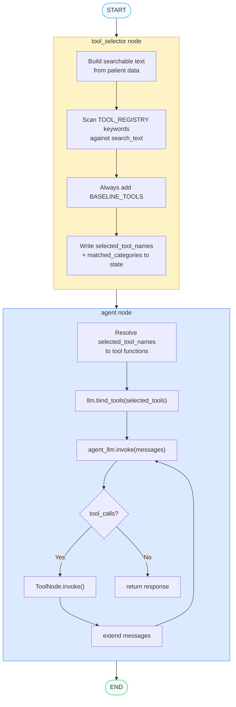
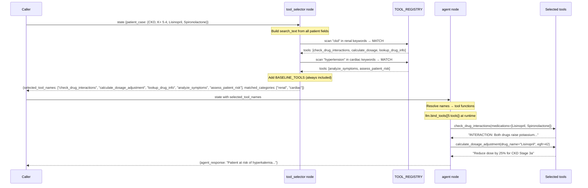

# Pattern 4 — Dynamic Tool Selection

> **Script:** `scripts/tools/dynamic_tool_selection.py`
> **Difficulty:** Intermediate
> **LangGraph surface area:** `StateGraph`, pure-Python selector node, runtime `bind_tools()`

---

## 1. Plain-English Explanation

In Pattern 1 (Script 1), you learned **static** tool binding — each agent gets its tools when the graph is *built*, and those tools are fixed forever. This works perfectly when you have dedicated specialist agents (triage agent always gets triage tools, pharmacist always gets pharma tools).

But what if you have a **single generalist agent** that needs to handle different patient types? A renal patient needs drug interaction and dosage adjustment tools. A respiratory patient needs symptom analysis tools. A patient with complex polypharmacy needs both. You don't know which set is appropriate until the patient's data arrives at runtime.

**Dynamic tool selection** solves this: instead of binding tools at graph build time, a dedicated **selector node** inspects the patient data first, writes the selected tool names to state, and then the agent node reads those names and calls `bind_tools()` with only the relevant tools.

Think of it like a hospital triage room that routes patients to different equipment carts before they see the doctor. The doctor still uses the same skills — but the cart that arrives has the right instruments for the patient's condition.

```
Static binding (Script 1)          Dynamic binding (Script 4)
┌──────────────────────┐           ┌──────────────────────────────────┐
│ Graph build time:     │           │ Graph build time:                 │
│   triage_agent gets  │           │   agent gets NO tools yet         │
│   TRIAGE_TOOLS fixed │           │                                   │
│                      │   vs.     │ Runtime (patient arrives):        │
│ Runtime:             │           │  tool_selector reads patient data │
│   same tools always  │           │  → selects tool subset            │
└──────────────────────┘           │  agent binds THOSE tools          │
                                   └──────────────────────────────────┘
```

---

## 2. When to Use This Pattern

| Use dynamic selection when... | Use static binding when... |
|------------------------------|---------------------------|
| One agent handles multiple patient types with different tool needs | Agent has a fixed specialty (always triage, always pharmacist) |
| Tool relevance depends on patient conditions, symptoms, or labs | Tool set is known at design time |
| You want to minimise tool schemas injected into the prompt | You prefer simplicity over flexibility |
| Different inputs require fundamentally different capabilities | There are only 2-3 specialists with clear domain boundaries |
| Building a triage-style routing system in one node | Building a multi-agent handoff system (use Area 2 for that) |

> **NOTE:** Dynamic tool selection is *not* a replacement for multi-agent architectures. If the work genuinely requires two specialists sequentially (e.g., triage then pharmacist), use Area 2 (Handoff) patterns. Dynamic tool selection is for when one agent needs different instruments depending on input.

---

## 3. Architecture Walkthrough

### ASCII Diagram

```
[START]
   │
   ▼
[tool_selector]  ← Pure Python, no LLM call
   │               Scans patient data for keywords
   │               Writes: selected_tool_names, matched_categories
   │
   ▼
[agent]          ← Reads selected_tool_names from state
   │               Calls llm.bind_tools(selected_tools) at runtime
   │               Runs tool loop (Pattern 2 — internal invocation)
   │
   ▼
[END]
```

The graph topology is a **fixed linear chain** — no conditional edges. The dynamic behaviour is entirely in the *node logic*, not the graph structure. `tool_selector` always runs before `agent`; the graph never branches.

### Mermaid Flowchart



### Sequence Diagram — Renal Patient



---

## 4. State Schema Deep Dive

```python
class DynamicToolState(TypedDict):
    messages: Annotated[list, add_messages]
    patient_case: dict
    selected_tool_names: list[str]
    matched_categories: list[str]
    agent_response: str
```

### Field-by-field explanation

| Field | Type | Who writes it | Who reads it |
|-------|------|--------------|--------------|
| `messages` | `Annotated[list, add_messages]` | Caller (initial), agent node | Agent node (all prior messages) |
| `patient_case` | `dict` | Caller (initial state) | `tool_selector` node (keyword scanning) |
| `selected_tool_names` | `list[str]` | `tool_selector` node | `agent` node |
| `matched_categories` | `list[str]` | `tool_selector` node | Caller (audit log / downstream routing) |
| `agent_response` | `str` | `agent` node | Caller |

### Why `selected_tool_names` is `list[str]` not `list[BaseTool]`

Tool functions (LangChain `StructuredTool` objects) are **not hashable** — you can't put them in a `set` or store them in a JSON-serialisable state. String names are hashable, serialisable, and unambiguous. The `agent` node resolves names back to functions using an `all_available` dict.

### Why `patient_case: dict` instead of `PatientCase`

LangGraph state must be serialisable (for checkpointing). Pydantic objects are not directly serialisable. The script calls `patient.model_dump()` to convert the `PatientCase` to a plain dict before storing in state.

### The `TOOL_REGISTRY` structure

```python
TOOL_REGISTRY = {
    "renal": {
        "description": "Renal dosing and drug interaction tools",
        "keywords": ["ckd", "renal", "egfr", "creatinine", "kidney"],
        "tools": [check_drug_interactions, calculate_dosage_adjustment, lookup_drug_info],
    },
    "cardiac": {
        "description": "Cardiac assessment tools",
        "keywords": ["heart", "cardiac", "hypertension", "edema", "bnp", "chf"],
        "tools": [analyze_symptoms, assess_patient_risk],
    },
    "respiratory": {
        "description": "Respiratory assessment tools",
        "keywords": ["copd", "asthma", "dyspnea", "cough", "fev1", "spo2"],
        "tools": [analyze_symptoms, assess_patient_risk],
    },
    "guideline": {
        "description": "Clinical guideline lookup",
        "keywords": ["guideline", "protocol", "standard"],
        "tools": [lookup_clinical_guideline],
    },
    "polypharmacy": {
        "description": "Multi-drug interaction tools",
        "keywords": ["polypharmacy", "multiple medications"],
        "tools": [check_drug_interactions, lookup_drug_info, calculate_dosage_adjustment],
    },
}
```

Each entry has:
- `description` — human-readable for logging and documentation
- `keywords` — lowercase strings to search for in patient data
- `tools` — tool functions to add when any keyword matches

A patient can match **multiple categories** — their selected tools are the **union** of all matched categories' tools, plus `BASELINE_TOOLS`.

---

## 5. Node-by-Node Code Walkthrough

### `tool_selector_node` — Pure Python, no LLM

```python
def tool_selector_node(state: DynamicToolState) -> dict:
    patient = state["patient_case"]

    # Step 1: Build a single lowercase string from all patient fields
    search_text = " ".join([
        patient.get("chief_complaint", ""),
        " ".join(patient.get("symptoms", [])),
        " ".join(patient.get("medical_history", [])),
        " ".join(patient.get("current_medications", [])),
        json.dumps(patient.get("lab_results", {})),
    ]).lower()
    # ↑ "dizziness with elevated k+ dizziness fatigue edema ckd stage 3a
    #    hypertension lisinopril 20mg spironolactone 25mg {"k+": "5.4 meq/l", ...}"
```

**Why concatenate all fields?** The keyword may appear in any part of the patient record. `"ckd"` might appear in `medical_history`, but `"egfr"` might appear in `lab_results` (as a key in the JSON dict). Concatenating everything means one `in` check covers all fields.

```python
    # Step 2: Scan registry
    matched_categories = []
    selected_tool_names: set[str] = set()  # ← set prevents duplicates

    for category, config in TOOL_REGISTRY.items():
        for keyword in config["keywords"]:
            if keyword in search_text:
                matched_categories.append(category)
                for tool in config["tools"]:
                    selected_tool_names.add(tool.name)  # ← string name, not tool object
                break  # ← only match each category once even if multiple keywords hit
```

**The `break` after first match:** Once a category is matched by any keyword, there's no point checking the remaining keywords for that category — it's already included. This prevents a category from being added to `matched_categories` multiple times.

```python
    # Step 3: Always add baseline tools
    for tool in BASELINE_TOOLS:
        selected_tool_names.add(tool.name)
```

`BASELINE_TOOLS = [analyze_symptoms, assess_patient_risk]` are always included because they're useful for any patient assessment. This ensures the agent is never left without any tools, even for unusual patient presentations that don't match any registry keyword.

### `agent_node` — Runtime binding

```python
def agent_node(state: DynamicToolState) -> dict:
    # Step 1: Resolve string names back to tool functions
    all_available = {t.name: t for t in
                     BASELINE_TOOLS + [check_drug_interactions, lookup_drug_info,
                                       calculate_dosage_adjustment, lookup_clinical_guideline]}

    selected_names = state.get("selected_tool_names", [])
    tools = [all_available[name] for name in selected_names if name in all_available]
    # ↑ If a name isn't in all_available, it's silently skipped — add error handling in production

    # Step 2: Bind at runtime — THIS is the key difference from static binding
    agent_llm = llm.bind_tools(tools)
    # ↑ bind_tools() called here, inside the node function, not at graph construction time
```

**Why is this powerful?** The same `llm` base object is used for every invocation, but each invocation gets a freshly bound set of tools based on *that patient's* data. Two patients processed concurrently get different tool schemas in their respective LLM calls — without any shared state or coordination.

```python
    # Step 3: Run the tool loop (Pattern 2 — encapsulated)
    response = agent_llm.invoke(messages, config=config)
    while hasattr(response, "tool_calls") and response.tool_calls:
        tool_node = ToolNode(tools)
        tool_results = tool_node.invoke({"messages": [response]})
        messages.extend([response] + tool_results["messages"])
        response = agent_llm.invoke(messages, config=config)
```

The tool loop is Pattern 2 (internal) from Script 2 — `ToolNode.invoke()` called manually. The `ToolNode` must also be constructed with the same `tools` list that was bound to `agent_llm`, to ensure consistency.

---

## 6. Production Tips

### 1. Normalise patient data before keyword matching

```python
# ❌ May miss: "Chronic Kidney Disease" → no match for "ckd"
search_text = patient.get("medical_history", "")

# ✅ Normalise: lowercase, expand common abbreviations
import re
search_text = patient.get("medical_history", "").lower()
search_text = re.sub(r"chronic kidney disease", "ckd", search_text)
search_text = re.sub(r"congestive heart failure", "chf", search_text)
```

Or use `thefuzz` / `rapidfuzz` for fuzzy keyword matching if patient data is free-text.

### 2. Add an audit log of tool selections

```python
def tool_selector_node(state):
    # ...selection logic...
    logger.info(f"Patient {patient.get('patient_id')}: "
                f"matched {matched_categories}, "
                f"selected {list(selected_tool_names)}")
    return {...}
```

In healthcare systems, you need to know *why* certain tools were selected for a patient. The `matched_categories` field in state serves as this audit trail.

### 3. Cap the maximum tool count

```python
MAX_TOOLS = 4

# After building the selected tools list:
if len(tools) > MAX_TOOLS:
    # Prioritise: baseline first, then registry order
    tools = BASELINE_TOOLS[:2] + tools[:MAX_TOOLS - 2]
    logger.warning(f"Tool count capped at {MAX_TOOLS} for token efficiency")
```

More tools = more tokens in the system prompt = higher latency and cost. Cap the maximum to keep LLM calls efficient.

### 4. Separate the selector from the registry

```python
# tools_registry.py — the data
TOOL_REGISTRY = { ... }
BASELINE_TOOLS = [ ... ]

# tool_selector.py — the logic
from tools_registry import TOOL_REGISTRY, BASELINE_TOOLS

def select_tools_for_patient(patient: dict) -> tuple[list[str], list[str]]:
    """Returns (selected_tool_names, matched_categories)."""
    ...
```

A standalone function is testable without a LangGraph runtime. Unit test your selection logic extensively — it's pure Python and has no external dependencies.

### 5. Consider LLM-based selection for complex cases

```python
# For complex cases, let a lightweight LLM classify the patient
# and select tool categories, rather than using keyword matching
classification_llm = get_llm().with_structured_output(ToolSelection)
result = classification_llm.invoke([HumanMessage(content=patient_summary)])
selected_categories = result.categories
```

Keyword matching is fast and deterministic but misses semantic context. An LLM classifier catches "patient had a myocardial event" → cardiac, even without the word "cardiac" in the record.

---

## 7. Conditional Routing Explanation

There are **no conditional edges** in this pattern. The graph topology is a fixed linear sequence:

```
START → tool_selector → agent → END
```

All routing decisions are made **inside** `tool_selector_node` and expressed as **state updates**, not as graph branches. The graph always follows the same path — only the data in `selected_tool_names` changes.

| Value | Set by | Read by | Effect |
|-------|--------|---------|--------|
| `selected_tool_names` | `tool_selector` | `agent` | Determines which tools `agent_llm` has access to |
| `matched_categories` | `tool_selector` | Caller | Audit log of which registry categories matched |

This is an important design principle: **dynamic behaviour through state vs. dynamic behaviour through graph topology.** Both are valid in LangGraph — this pattern uses state; Script 2 Pattern 1 uses graph topology (`add_conditional_edges`).

---

## 8. Worked Example — Two Patients, Different Tool Selections

### Test 1: Renal patient (CKD + hyperkalemia)

```
Patient: PT-DTS-RENAL, 71F
Chief complaint: Dizziness with elevated K+
Symptoms: dizziness, fatigue, edema
History: CKD Stage 3a, Hypertension
Meds: Lisinopril 20mg, Spironolactone 25mg
Labs: K+ = 5.4 mEq/L, eGFR = 42 mL/min
```

**Selector trace:**
```
[STAGE 9.2] TOOL SELECTOR
  Matched 'ckd'        -> category: renal
  Matched 'hypertension' -> category: cardiac
  (+ BASELINE_TOOLS always included)

Matched categories : ['renal', 'cardiac']
Selected tools (5):
  - check_drug_interactions
  - calculate_dosage_adjustment
  - lookup_drug_info
  - analyze_symptoms
  - assess_patient_risk
```

**Agent uses:**
- `check_drug_interactions(["Lisinopril", "Spironolactone"])` → detects potassium-raising interaction
- `calculate_dosage_adjustment("Lisinopril", egfr=42)` → suggests dose reduction for CKD
- `analyze_symptoms(...)` → COPD? No — renal/cardiac presentation

---

### Test 2: Respiratory patient (COPD)

```
Patient: PT-DTS-RESP, 58M
Chief complaint: Worsening COPD exacerbation
Symptoms: dyspnea, cough, wheezing
History: COPD Stage II
Meds: Tiotropium 18mcg
Labs: FEV1 = 45% predicted, SpO2 = 90%
```

**Selector trace:**
```
[STAGE 9.2] TOOL SELECTOR
  Matched 'copd'    -> category: respiratory
  Matched 'dyspnea' -> already matched respiratory (break)
  (+ BASELINE_TOOLS always included)

Matched categories : ['respiratory']
Selected tools (2):
  - analyze_symptoms
  - assess_patient_risk
```

**Agent uses:**
- `analyze_symptoms(symptoms="dyspnea, cough, wheezing", age=58, sex="M")` → COPD exacerbation assessment
- `assess_patient_risk(age=58, conditions=["COPD Stage II"], ...)` → moderate-to-high risk

**Drug interaction tools NOT selected** — the agent has no ability to call `check_drug_interactions` for this patient, reducing token overhead and the risk of spurious pharmacology tool calls on a respiratory case.

---

### Comparison Summary

| | Renal Patient | Respiratory Patient |
|--|--------------|---------------------|
| Categories matched | renal, cardiac | respiratory |
| Tools selected | 5 tools | 2 tools (baseline only) |
| Tool schemas in prompt | 5 schemas | 2 schemas |
| Approximate extra tokens | ~800 tokens | ~300 tokens |
| Risk of wrong tool call | Low | Low (fewer choices) |

---

## 9. Key Concepts Summary

| Concept | What it means | Why it matters |
|---------|--------------|----------------|
| `TOOL_REGISTRY` | Dict mapping category names → `{keywords, tools, description}` | The data structure that maps patient conditions to tool capabilities |
| Keyword matching | `if keyword in search_text` | The selection mechanism — fast, deterministic, auditable |
| `BASELINE_TOOLS` | Tools always included regardless of patient data | Ensures minimum capability even for unusual presentations |
| `selected_tool_names: list[str]` | String tool names stored in state | Bridge between selector and agent; avoids storing non-serialisable objects |
| `tool_selector_node` | Pure Python node (no LLM) that writes to state | Separation of concerns — selection logic independent of LLM |
| Runtime `bind_tools()` | `llm.bind_tools(tools)` called inside `agent_node` | The mechanism that makes tool selection truly dynamic |
| `matched_categories` | List of categories that fired during selection | Audit trail — reviewable post-hoc |
| Static vs dynamic | Static: tools fixed at graph build time. Dynamic: tools set per invocation. | The core distinction — choose based on whether tool needs vary by input |

---

## 10. Common Mistakes

### Mistake 1: Storing tool objects in state

```python
# ❌ Wrong — StructuredTool is not hashable or JSON-serialisable
class BadState(TypedDict):
    selected_tools: list  # list of tool OBJECTS

# ✅ Right — store names, resolve to objects inside node functions
class GoodState(TypedDict):
    selected_tool_names: list[str]  # store NAMES only
```

### Mistake 2: Case-sensitive keyword matching

```python
# ❌ Wrong — "CKD Stage 3a" in medical history won't match "ckd"
if keyword in search_text:  # without .lower()

# ✅ Right — always lowercase the search text
search_text = " ".join([...]).lower()
if keyword in search_text:  # keyword is also lowercase in TOOL_REGISTRY
```

### Mistake 3: Not including BASELINE_TOOLS in the `all_available` resolution dict

```python
# ❌ Wrong — if "analyze_symptoms" is in selected_tool_names but not in all_available,
# it's silently skipped and the agent has no tools
all_available = {t.name: t for t in [check_drug_interactions, ...]}

# ✅ Right — include BASELINE_TOOLS in the resolution dict
all_available = {t.name: t for t in
                 BASELINE_TOOLS + [check_drug_interactions, lookup_drug_info, ...]}
```

### Mistake 4: Building `ToolNode` with a different tool list than `bind_tools`

```python
# ❌ Wrong — agent_llm knows about tool X, but tool_node can't dispatch it
agent_llm = llm.bind_tools(selected_tools + [extra_tool])
tool_node = ToolNode(selected_tools)  # ← extra_tool missing from ToolNode

# ✅ Right — same list for both
tools = selected_tools + [extra_tool]
agent_llm = llm.bind_tools(tools)
tool_node = ToolNode(tools)
```

### Mistake 5: Using dynamic selection when static multi-agent would be clearer

```python
# ❌ Over-engineering — if you always need triage + pharmacist sequentially,
# use Area 2 (Handoff) not dynamic tool selection
def agent_node(state):
    if is_renal_patient:
        tools = RENAL_TOOLS
    elif is_respiratory_patient:
        tools = RESPIRATORY_TOOLS
    # This is effectively routing logic, not tool selection

# ✅ Right — use a two-agent pipeline with explicit handoff
# (See scripts/handoff/ for this pattern)
```

---

## 11. Pattern Connections

| This pattern... | Connects to... | How |
|----------------|---------------|-----|
| `TOOL_REGISTRY` keyword matching | **Area 2 (Handoff)** `conditional_handoff` | The handoff pattern uses the same patient-data inspection to decide *which agent* receives the case. Here we use it to decide *which tools* the current agent gets. |
| Runtime `bind_tools()` inside a node | **Area 7 (MAS)** `supervisor_orchestration` | The supervisor in MAS architectures creates specialist agents on demand — each `BaseAgent.bind_tools()` call is dynamic, driven by the supervisor's routing decision. |
| `tool_selector_node` (pure Python node) | **All patterns** | This demonstrates that not all graph nodes need to call an LLM. Pure-Python nodes are faster, cheaper, and deterministic. They're useful for preprocessing, routing decisions, and data transformation. |
| `matched_categories` audit field | **Area 3 (Guardrails)** | The guardrails layer can check `matched_categories` to verify the agent used appropriate tools — a form of process-level auditing. |
| `DynamicToolState.patient_case: dict` | **All tool scripts** | The pattern of serialising a domain object (`PatientCase → dict`) before storing in state is required by LangGraph's serialisation requirements. Apply this to all complex objects. |

**Next:** [`05_tool_error_handling.md`](05_tool_error_handling.md) — Learn how to gracefully recover from tool failures using `ToolNode(handle_tool_errors=True)` and manual `try/except` retry patterns.
