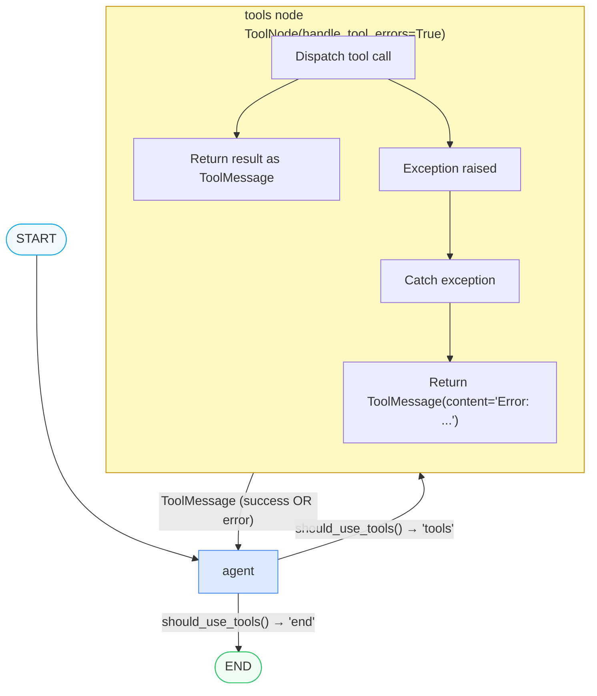
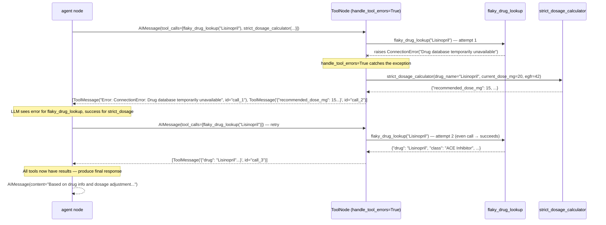

# Pattern 5 — Tool Error Handling

> **Script:** `scripts/tools/tool_error_handling.py`
> **Difficulty:** Intermediate
> **LangGraph surface area:** `ToolNode(handle_tool_errors=True)`, manual `try/except`, `error_count` state field

---

## 1. Plain-English Explanation

In a production system, tools fail. Network timeouts, invalid input arguments, API rate limits, database unavailability — all of these are real failure modes for functions that call external services. If your graph doesn't handle these failures, a single broken tool call will crash the entire agent run.

**Tool error handling** is the pattern for turning tool failures from crashes into recoverable situations. The key insight is: **a tool failure is information**. If the LLM receives the error message back as a `ToolMessage`, it can:
- Retry with different arguments (e.g., reformat the dosage as a float instead of a string)
- Try a different tool that achieves the same goal
- Produce a best-effort response acknowledging the tool wasn't available

There are two approaches in this script:

**Pattern 1 — `handle_tool_errors=True`:** A single parameter on `ToolNode`. When enabled, any exception raised by a tool function is caught automatically, and a `ToolMessage` containing the error text is returned instead. The LLM sees the error as a normal tool result and can respond. No custom code required.

**Pattern 2 — Manual `try/except`:** The agent node contains explicit `try/except` blocks around each tool call, an `error_count` counter in state, and forced fallback logic when the counter exceeds a threshold. This gives full control: custom error messages, per-tool retry logic, selective fallback, and hard limits on retries.

```
Pattern 1 — Automatic (ToolNode)      Pattern 2 — Manual (try/except)
┌────────────────────────────────┐    ┌────────────────────────────────┐
│ ToolNode(handle_tool_errors=   │    │ for each tool_call:            │
│   True)                        │    │   try:                         │
│                                │    │     result = tool.invoke(args) │
│ Tool raises ValueError         │    │   except Exception as e:       │
│     ↓                          │    │     error_count += 1           │
│ ToolNode catches it            │    │     feed error back to LLM     │
│     ↓                          │    │                                │
│ Returns ToolMessage(           │    │ if error_count >= max_retries: │
│   content="Error: ...")        │    │   inject fallback prompt       │
│     ↓                          │    │   force LLM to respond         │
│ LLM sees error, can retry      │    │   without tools                │
└────────────────────────────────┘    └────────────────────────────────┘
  Simpler, less control               More code, full control
```

---

## 2. When to Use Each Pattern

### Pattern 1 (`handle_tool_errors=True`) — Use when:

| Scenario | Why Pattern 1 |
|---------|--------------|
| You trust the LLM to self-correct after seeing error text | The error message is sufficient for the LLM to retry with corrected args |
| Tools fail transiently (network blips, timeouts) | LLM will naturally retry on the next iteration |
| You want minimal boilerplate | One parameter on `ToolNode` vs. dozens of lines of try/except |
| You're using Pattern 1 topology (ToolNode as graph node) | Error capture is built into the same node |
| The tool's error messages are already informative | LangChain passes `str(exception)` to the LLM — if that's clear, Pattern 1 is enough |

### Pattern 2 (Manual `try/except`) — Use when:

| Scenario | Why Pattern 2 |
|---------|--------------|
| You need a hard retry limit | `error_count >= max_retries` triggers a forced fallback |
| Different tools require different fallback behaviours | You can write per-tool error handling logic |
| You need to log errors to an external system | `except Exception as e: logger.error(...)` gives you the hook |
| You're using Pattern 2 topology (internal loop) | ToolNode isn't a separate node, so `handle_tool_errors` doesn't apply directly |
| The LLM keeps retrying indefinitely when tools fail | The retry counter prevents infinite loops |

> **TIP:** In production, use Pattern 1 as the baseline and add Pattern 2 elements when you discover specific failure modes that need custom handling. Start simple.

---

## 3. Architecture Walkthrough

### Pattern 1 — ReAct graph with error-capturing ToolNode

```
[START]
   │
   ▼
[agent] ─── has_tool_calls? ──> [tools (handle_tool_errors=True)]
   ↑                                │
   │      ◄── ToolMessage("Error: ConnectionError...")  │ (on failure)
   │      ◄── ToolMessage("result data...")             │ (on success)
   │                                │
   └────────────────────────────────┘
   │
   └── no tool_calls ──> [END]
```

This is identical to Script 2 Pattern 1 topology — the only change is `ToolNode(tools, handle_tool_errors=True)`.

### Pattern 2 — Encapsulated loop with retry counter

```
[START]
   │
   ▼
┌─────────────────────────────────────────────────────┐
│  agent node                                          │
│                                                      │
│  messages = list(state["messages"])                  │
│  response = agent_llm.invoke(messages)               │
│  retries = state["error_count"]                      │
│                                                      │
│  while response has tool_calls:                      │
│      for each tc in tool_calls:                      │
│          try:                                        │
│              result = tool.invoke(tc["args"])        │
│              → ToolMessage(result)                   │
│          except Exception as e:                      │
│              retries += 1                            │
│              → ToolMessage("Error: ...")             │
│                                                      │
│      if had_error AND retries >= max_retries:        │
│          inject: "Please respond without tools"      │
│                                                      │
│      response = agent_llm.invoke(messages)           │
│                                                      │
│  return {agent_response, error_count: retries}       │
└─────────────────────────────────────────────────────┘
   │
   ▼
[END]
```

### Mermaid Flowchart — Pattern 1



### Mermaid Sequence Diagram — Pattern 1 (flaky tool retry)



---

## 4. State Schema Deep Dive

```python
class ErrorDemoState(TypedDict):
    messages: Annotated[list, add_messages]
    agent_response: str
    error_count: int
```

This is the same as `ToolDemoState` from Script 2, with one addition: `error_count`.

### `error_count: int`

| Property | Value |
|---------|-------|
| Type | Plain `int` — no reducer, replaced on each return |
| Initial value | `0` (set in initial state) |
| Who writes it | `agent_node` in Pattern 2 |
| Who reads it | `agent_node` (to check if `>= max_retries`) and the caller (for audit) |

**Why store `error_count` in state instead of a local variable?** If you're using Pattern 1 (ToolNode as graph node), the agent node is a separate function called multiple times — local variables don't persist between calls. For Pattern 2 (internal loop in one function), a local variable works fine. But storing in state makes the error count visible to the caller, enables resumption after checkpointing, and allows other nodes to read the count for downstream decisions (e.g., guardrail: "if error_count > 2, escalate to human").

### The `flaky_drug_lookup` and `strict_dosage_calculator` tools

These are locally-defined `@tool` functions that simulate realistic failure modes:

**`flaky_drug_lookup` — intermittent network failure:**
```python
call_counter = {"flaky_lookup": 0}

@tool
def flaky_drug_lookup(drug_name: str) -> str:
    """Look up drug information. Fails on odd calls, succeeds on even calls."""
    call_counter["flaky_lookup"] += 1
    count = call_counter["flaky_lookup"]

    if count % 2 == 1:  # Odd calls fail: 1st, 3rd, 5th...
        raise ConnectionError(
            f"Drug database temporarily unavailable (attempt {count}). Please retry."
        )
    
    # Even calls succeed: 2nd, 4th, 6th...
    return json.dumps({"drug": drug_name, "class": "ACE Inhibitor", ...})
```

This simulates an API that times out on first attempt but succeeds on retry — a very common real-world pattern. The LLM's natural retry behavior (calling the same tool again after seeing the error) aligns perfectly with this failure mode.

**`strict_dosage_calculator` — strict input validation:**
```python
@tool
def strict_dosage_calculator(drug_name: str, current_dose_mg: float, egfr: float) -> str:
    """Requires EXACT numeric inputs — no units, no text."""
    if not isinstance(current_dose_mg, (int, float)) or current_dose_mg <= 0:
        raise ValueError(f"current_dose_mg must be a positive number, got: {current_dose_mg}")
    if not isinstance(egfr, (int, float)) or egfr <= 0:
        raise ValueError(f"egfr must be a positive number, got: {egfr}")
    # ...
```

This simulates a tool with strict input requirements. If the LLM passes `"20mg"` instead of `20.0`, it fails with a clear `ValueError`. The error message tells the LLM exactly how to fix the input — enabling self-correction.

---

## 5. Node-by-Node Code Walkthrough

### Pattern 1 — `ToolNode(tools, handle_tool_errors=True)`

```python
tool_node = ToolNode(
    tools,
    handle_tool_errors=True,  # ← THIS is the only change from Script 2
)
```

**What `handle_tool_errors=True` does internally:**
LangGraph wraps each tool invocation in a `try/except`. If any exception is raised, it creates a `ToolMessage` with:
```python
ToolMessage(
    content=f"Error: {type(exception).__name__}: {str(exception)}",
    tool_call_id=tc["id"],
    name=tc["name"],
)
```

This `ToolMessage` is added to the messages list and fed back to the `agent` node. The LLM receives a message that looks like any other tool result — it just happens to contain an error message rather than data.

**What the agent node sees when a tool fails:**
```
AIMessage(tool_calls=[{name: "flaky_drug_lookup", args: {"drug_name": "Lisinopril"}, id: "call_1"}])
  → ToolMessage(content="Error: ConnectionError: Drug database temporarily unavailable (attempt 1). Please retry.", tool_call_id="call_1")
```

The LLM reads this and typically responds with another tool call using the same arguments — because the error message literally says "Please retry."

### Pattern 1 — Agent node (same as Script 2 Pattern 1)

```python
def agent_node(state: ErrorDemoState) -> dict:
    config = build_callback_config(trace_name="tool_error_p1")
    response = agent_llm.invoke(state["messages"], config=config)
    # ↑ state["messages"] grows with each call — includes all prior errors
    
    return {"messages": [response]}  # ← no error_count update in Pattern 1
    # error_count stays at 0 in Pattern 1 — the LLM self-corrects via retries
```

Pattern 1 doesn't track `error_count` because the loop terminates naturally — either the LLM eventually calls all tools successfully, or it stops calling tools after too many failures.

### Pattern 2 — `agent_node` with manual error handling

```python
def agent_node(state: ErrorDemoState) -> dict:
    messages = list(state["messages"])
    response = agent_llm.invoke(messages, config=config)
    retries = state.get("error_count", 0)  # ← read current retry count from state

    while hasattr(response, "tool_calls") and response.tool_calls:
        tool_results = []
        had_error = False

        for tc in response.tool_calls:
            tool_fn = next((t for t in tools if t.name == tc["name"]), None)
            
            if tool_fn is None:
                # Tool not found — probably a hallucinated tool name
                tool_results.append(ToolMessage(
                    content=f"Error: Tool '{tc['name']}' not found.",
                    tool_call_id=tc["id"],
                ))
                had_error = True
                continue

            try:
                result = tool_fn.invoke(tc["args"])
                tool_results.append(ToolMessage(content=str(result), tool_call_id=tc["id"]))
            
            except Exception as e:
                error_msg = f"{type(e).__name__}: {e}"
                tool_results.append(ToolMessage(
                    content=f"Tool error: {error_msg}. You may retry with different arguments.",
                    tool_call_id=tc["id"],
                ))
                had_error = True
                retries += 1  # ← increment ONLY on actual exceptions

        messages.extend([response] + tool_results)

        # Forced fallback — inject a message telling the LLM to give up on tools
        if had_error and retries >= max_retries:
            messages.append(HumanMessage(content=(
                "Tool calls have failed repeatedly. Please provide "
                "your best assessment based on available information."
            )))
            # After this message, the LLM will (hopefully) produce a final response
            # without calling more tools

        response = agent_llm.invoke(messages, config=config)

    return {
        "messages": [response],
        "agent_response": response.content,
        "error_count": retries,  # ← write final error count to state
    }
```

**Three key elements:**
1. **`retries` counter:** Incremented only on `except` — not on "tool not found" unless desired
2. **`had_error` flag:** Tracks whether any errors occurred in the current tool batch — only triggers the fallback if errors actually happened
3. **Forced fallback injection:** A `HumanMessage` telling the LLM to respond without tools. This is necessary because after the LLM sees tool errors, it might just call tools again. The injected message overrides that behavior.

---

## 6. Production Tips

### 1. Always use `handle_tool_errors=True` on production ToolNodes

```python
# ❌ No error handling — any tool exception crashes the graph
tool_node = ToolNode(tools)

# ✅ Safe — all tool exceptions become ToolMessages
tool_node = ToolNode(tools, handle_tool_errors=True)
```

This is a one-character change with significant resilience benefits. There's almost no reason NOT to use it in production.

### 2. Make tool error messages actionable

```python
# ❌ Cryptic error — LLM can't self-correct
raise ValueError("Bad input")

# ✅ Actionable error — LLM knows exactly how to fix it
raise ValueError(
    f"current_dose_mg must be a positive float (e.g. 20.0), got: {current_dose_mg!r}. "
    "Do NOT include units. Pass only the numeric value."
)
```

The LLM reads the entire error string. If the error explains how to fix the input, the LLM often corrects it on the first retry.

### 3. Add `handle_tool_errors` to your production checklist

Create a graph review checklist item:
- [ ] Every `ToolNode` has `handle_tool_errors=True`
- [ ] `error_count` or equivalent retry counter is in state
- [ ] Max retries constant is defined and documented
- [ ] Forced fallback message is tested with a permanently-failing tool

### 4. Log errors to observability before feeding to LLM

```python
except Exception as e:
    # Log first — observability is critical for diagnosing flaky tools
    logger.warning(
        f"Tool {tc['name']} failed",
        extra={"tool": tc["name"], "error": str(e), "args": tc["args"]},
    )
    # Then feed to LLM as usual
    tool_results.append(ToolMessage(
        content=f"Tool error: {type(e).__name__}: {e}",
        tool_call_id=tc["id"],
    ))
```

Langfuse will capture the span for the LLM calls, but won't automatically log tool exceptions. Log them explicitly before they become ToolMessages.

### 5. Consider per-tool fallback functions

```python
TOOL_FALLBACKS = {
    "flaky_drug_lookup": lookup_drug_info,     # fallback to the stable tool
    "strict_dosage_calculator": calculate_dosage_adjustment,  # fallback to lenient version
}

except Exception as e:
    retries += 1
    fallback = TOOL_FALLBACKS.get(tc["name"])
    if fallback and retries < 2:
        try:
            fallback_result = fallback.invoke(tc["args"])
            tool_results.append(ToolMessage(content=str(fallback_result), tool_call_id=tc["id"]))
            continue
        except Exception:
            pass  # fallback also failed — feed original error
    tool_results.append(ToolMessage(content=f"Tool error: {e}", tool_call_id=tc["id"]))
```

---

## 7. Conditional Routing Explanation

### Pattern 1 Router

Same `should_use_tools` router as Script 2 Pattern 1:

```
should_use_tools(state) → "tools" OR "end"
```

| State condition | Returns | What happens |
|----------------|---------|-------------|
| Last message has `.tool_calls` | `"tools"` | ToolNode executes all tool calls (some may fail → error ToolMessages) |
| Last message has no `.tool_calls` | `"end"` | Graph terminates |

The LLM may continue the loop after receiving error ToolMessages — it sees the error and decides whether to retry (calling the tool again) or give up (producing a final response). `handle_tool_errors=True` does NOT force the LLM to stop retrying — it just ensures exceptions don't crash the graph.

### Pattern 2 Routing

No conditional edges. The loop is controlled by:

| Condition | Action |
|---------|--------|
| `response.tool_calls` is non-empty AND `retries < max_retries` | Continue loop, execute tools |
| `had_error AND retries >= max_retries` | Inject fallback HumanMessage, then continue loop once more |
| `response.tool_calls` is empty | Exit loop, return final response |

The injected fallback `HumanMessage` is the mechanism that breaks the retry loop: it tells the LLM to produce a final text response rather than calling tools again.

---

## 8. Worked Example — Flaky Tool Retry Trace

**Patient:** PT-ERR-001, 71F, CKD + hyperkalemia, on Lisinopril.

**Prompt asks the LLM to:**
1. Look up Lisinopril drug info (`flaky_drug_lookup`)
2. Calculate dosage adjustment (`strict_dosage_calculator`)
3. Analyze symptoms (`analyze_symptoms`)

### Pattern 1 trace:

```
PATTERN 1: ToolNode with handle_tool_errors=True
─────────────────────────────────────────────────

[P1 Agent] Tool calls: ['flaky_drug_lookup', 'strict_dosage_calculator', 'analyze_symptoms']

ToolNode dispatches:
  flaky_drug_lookup("Lisinopril") → FAIL attempt 1
    ConnectionError: Drug database temporarily unavailable (attempt 1). Please retry.
    → ToolMessage("Error: ConnectionError: Drug database temporarily unavailable...")
  
  strict_dosage_calculator("Lisinopril", 20, 42) → SUCCESS
    → ToolMessage('{"recommended_dose_mg": 15, "adjustment_factor": 0.75, ...}')
  
  analyze_symptoms("dizziness,fatigue", 71, "F") → SUCCESS
    → ToolMessage("Symptoms suggest renal/cardiac involvement...")

[P1 Agent] Tool calls: ['flaky_drug_lookup']   ← LLM retries the failed tool

ToolNode dispatches:
  flaky_drug_lookup("Lisinopril") → SUCCESS attempt 2 (even call)
    → ToolMessage('{"drug": "Lisinopril", "class": "ACE Inhibitor", ...}')

[P1 Agent] Final response (312 chars)

Tool call attempts: flaky=2, strict=1
```

**Observation:** The LLM automatically retried `flaky_drug_lookup` after seeing the error. It did NOT retry `strict_dosage_calculator` and `analyze_symptoms` (they succeeded). This is the self-correction behavior that `handle_tool_errors=True` enables.

### Pattern 2 trace:

```
PATTERN 2: Manual try/except with retry counter
─────────────────────────────────────────────────

[P2 Agent] Calling: flaky_drug_lookup
  [P2 Agent] ERROR: ConnectionError: Drug database temporarily unavailable (attempt 1)
  → ToolMessage("Tool error: ConnectionError: ... You may retry with different arguments.")
  retries = 1

[P2 Agent] Calling: strict_dosage_calculator
  [P2 Agent] Success: strict_dosage_calculator
  → ToolMessage('{"recommended_dose_mg": 15, ...}')

[P2 Agent] Calling: analyze_symptoms
  [P2 Agent] Success: analyze_symptoms
  → ToolMessage("Symptoms suggest ...")

(retries=1, max_retries=3, had_error=True — continue loop)

[P2 Agent] Calling: flaky_drug_lookup    ← LLM retries
  [P2 Agent] Success: flaky_drug_lookup   ← attempt 2, succeeds
  → ToolMessage('{"drug": "Lisinopril", ...}')

[P2 Agent] Final response (298 chars)

Tool call attempts: flaky=2, strict=1
Total errors caught: 1
```

**Observation:** Pattern 2 also successfully recovered from the flaky tool, but provides additional information: `error_count=1` in the final state, which can be used for downstream monitoring.

---

## 9. Key Concepts Summary

| Concept | What it means | Why it matters |
|---------|--------------|----------------|
| `handle_tool_errors=True` | `ToolNode` parameter that catches all tool exceptions and returns them as `ToolMessage` | Prevents graph crashes; enables LLM self-correction |
| `ToolMessage(content="Error: ...")` | The error representation fed back to the LLM | The LLM reads this exactly like a successful tool result — its content steers retry behavior |
| `error_count: int` | State field tracking cumulative tool failures | Enables hard retry limits and post-run auditing |
| `max_retries` | Constant defining the retry threshold | The circuit breaker — prevents infinite error loops |
| Forced fallback message | `HumanMessage("Tool calls have failed. Please respond without tools.")` | The mechanism to break the retry loop when all retries are exhausted |
| `flaky_drug_lookup` | Demo tool that fails on odd calls | Simulates intermittent network failures — retry-recoverable |
| `strict_dosage_calculator` | Demo tool with strict input validation | Simulates strict API requirements — LLM must correct its argument format |
| `had_error` flag | Boolean tracking if any error occurred in the current tool batch | Controls whether the fallback message is injected |

---

## 10. Common Mistakes

### Mistake 1: No error handling on production ToolNodes

```python
# ❌ Wrong — any tool exception crashes the graph run
tool_node = ToolNode(tools)

# ✅ Right — exceptions become ToolMessages, graph continues
tool_node = ToolNode(tools, handle_tool_errors=True)
```

### Mistake 2: No retry limit in Pattern 2

```python
# ❌ Wrong — could loop indefinitely if the LLM keeps calling a broken tool
while hasattr(response, "tool_calls") and response.tool_calls:
    # ...no retries check...
    response = agent_llm.invoke(messages)

# ✅ Right — limit retries and force fallback
if had_error and retries >= max_retries:
    messages.append(HumanMessage("Please respond without tools."))
```

### Mistake 3: Injecting the fallback message BEFORE executing tool results

```python
# ❌ Wrong — the LLM hasn't seen the tool errors yet when the fallback fires
messages.extend([response])  # missing tool_results!
if had_error and retries >= max_retries:
    messages.append(HumanMessage("Please respond without tools."))

# ✅ Right — extend messages first (tool results), THEN inject fallback
messages.extend([response] + tool_results)
if had_error and retries >= max_retries:
    messages.append(HumanMessage("Please respond without tools."))
```

### Mistake 4: Using Pattern 1 `handle_tool_errors` without a max iterations guard

```python
# ❌ Pattern 1 still needs an iteration guard
# The LLM may keep retrying even with handle_tool_errors if the tool always fails
# → Add error_count to state and check it in the agent or router

def should_use_tools(state: ErrorDemoState) -> Literal["tools", "end"]:
    last_msg = state["messages"][-1]
    error_count = state.get("error_count", 0)
    
    # ✅ Stop retrying if error count is too high
    if error_count >= 5:
        return "end"
    
    if hasattr(last_msg, "tool_calls") and last_msg.tool_calls:
        return "tools"
    return "end"
```

### Mistake 5: Unhelpful error messages in tool exceptions

```python
# ❌ Useless error — LLM can't self-correct from this
raise Exception("Invalid input")

# ✅ Actionable error — LLM can change its argument format
raise ValueError(
    f"Parameter 'egfr' must be a number between 1 and 150. "
    f"Received: {egfr!r}. "
    f"Do NOT include units. Example: pass 42, not '42 mL/min'."
)
```

---

## 11. Pattern Connections

| This pattern... | Connects to... | How |
|----------------|---------------|-----|
| `handle_tool_errors=True` | **Area 3 (Guardrails)** | The guardrails `tool_call_validation` pattern uses `handle_tool_errors` as its first line of defence — tool schema violations become ToolMessages rather than exceptions. |
| `error_count` in state | **Area 4 (HITL)** | The HITL `escalation_chain` pattern reads an `escalation_reason` field that is populated when `error_count` exceeds a threshold — tool failure is one of the escalation triggers. |
| Forced fallback `HumanMessage` | **Area 7 (MAS)** | The MAS `reflection_self_critique` pattern's circuit breaker uses the same technique: when `max_iterations` is exceeded, a message is injected telling the generator to produce a final answer regardless of critique severity. |
| Pattern 1 topology (ToolNode as graph node) | **Script 2** (`toolnode_patterns.py`) | Pattern 1 in this script is Script 2 Pattern 1 with `handle_tool_errors=True` added — this is the canonical production-ready ReAct graph topology. |
| `strict_dosage_calculator` strict validation | **Area 3 (Guardrails)** | The guardrails `input_validation` pattern applies the same principle at the agent level: strict schema validation of inputs prevents downstream errors. |

---

## Summary of the Tool Pattern Series

You have now completed all 5 tool patterns in Area 1. Here's how they fit together:

```
Pattern 1: bind_tools()           → Configure which tools an agent can use
                │
                ▼
Pattern 2: ToolNode patterns      → Execute those tools in a graph
                │
                ▼
Pattern 3: Structured output      → Get validated Pydantic objects back
                │
                ▼
Pattern 4: Dynamic selection      → Choose tools at runtime per patient
                │
                ▼
Pattern 5: Error handling         → Recover gracefully when tools fail
```

**Combined recipe for a production-ready clinical agent:**
```python
# 1. Define scoped tool groups (Script 1)
TOOLS = BASELINE_TOOLS + selected_domain_tools

# 2. Build graph with ToolNode as graph node (Script 2, Pattern 1)
tool_node = ToolNode(TOOLS, handle_tool_errors=True)  # + Script 5

# 3. Agent produces validated structured output (Script 3)
agent_llm = base_llm.bind_tools(TOOLS)  # or bind_tools(TOOLS + [submit_result])

# 4. Selector picks tools at runtime (Script 4)
# tool_selector_node → agent_node (agent does runtime bind_tools)

# 5. State tracks errors (Script 5)
class ProductionState(TypedDict):
    messages: Annotated[list, add_messages]
    patient_case: dict
    selected_tool_names: list[str]
    error_count: int
    agent_response: str
```

**Next area:** [`../../handoff/docs/00_overview.md`](../../handoff/docs/00_overview.md) — Area 2: how agents pass work to each other with conditional routing and handoff patterns.
