# Chapter 1: Introduction to Agentic AI

## Table of Contents

1. [What is Agentic AI?](#what-is-agentic-ai)
2. [Agentic vs. Non-Agentic Systems](#agentic-vs-non-agentic-systems)
3. [When to Use Agents](#when-to-use-agents)
4. [The Agent Execution Loop](#the-agent-execution-loop)
5. [The God Agent Anti-Pattern](#the-god-agent-anti-pattern)
6. [Industry Context and Adoption](#industry-context-and-adoption)
7. [Core Principles for Success](#core-principles-for-success)

---

## What is Agentic AI?

**Agentic AI** refers to AI systems that possess **autonomy**, **reasoning capabilities**, and the ability to **take actions** through tools to accomplish goals. Unlike traditional AI applications that follow predefined logic or simply generate text, agentic systems can:

- **Perceive** their environment and context
- **Reason** about problems using LLM intelligence
- **Plan** multi-step approaches to achieve goals
- **Act** by executing tools and functions
- **Adapt** their strategy based on outcomes

### The Defining Characteristics

An agentic AI system has three essential properties:

1. **Goal-Oriented Behavior**: The agent works toward accomplishing a specific objective, not just responding to prompts.

2. **Dynamic Decision-Making**: The agent uses an LLM to make decisions at runtime rather than following hardcoded logic. It can choose different paths based on context.

3. **Tool Use**: The agent can interact with external systems through tools—APIs, databases, functions—to gather information and take actions.

### What an Agent Is NOT

To clarify the concept, let's distinguish what doesn't qualify as agentic:

| Not Agentic | Agentic |
|-------------|---------|
| **Simple LLM call** - "Summarize this document" | **Document analysis agent** - Reads doc, identifies sections needing clarification, searches external sources for context, generates comprehensive summary |
| **Chatbot with canned responses** - Follows decision tree | **Support agent** - Understands intent, queries knowledge base, checks user history, provides personalized solution |
| **Static RAG system** - Always retrieves and summarizes | **Research agent** - Determines what information is needed, searches multiple sources, synthesizes findings, identifies gaps |

The key difference: **agentic systems reason about what to do**, while non-agentic systems execute predefined logic.

---

## Agentic vs. Non-Agentic Systems

Understanding when AI needs to be "agentic" is crucial for architecture decisions. Not every problem requires agent-level autonomy.

### Non-Agentic AI Systems

**Best for:**
- Well-defined, single-step tasks
- Predictable, structured workflows
- Tasks where latency and cost are critical
- Problems with clear inputs and outputs

**Examples:**
- **Text summarization**: Input document → summarize → output summary
- **Classification**: Input text → classify into categories → output label
- **Translation**: Input text in language A → translate → output in language B
- **Simple Q&A**: Input question + document corpus → retrieve + generate answer

**Architecture pattern**: Direct model call or retrieval-augmented generation (RAG)


### Agentic AI Systems

**Best for:**
- Open-ended problems requiring reasoning
- Multi-step workflows with branching logic
- Tasks requiring real-time external data
- Problems where approach varies by context

**Examples:**
- **Customer support**: Diagnose issue → check multiple systems → propose solution → execute fix if authorized
- **Research assistant**: Understand topic → search sources → evaluate relevance → synthesize findings → identify gaps
- **Data analyst**: Interpret question → query databases → analyze results → generate visualizations → provide insights

**Architecture pattern**: Agent with tools, memory, and reasoning loop


### Decision Framework: When to Go Agentic

Use this framework from Anthropic to decide if your problem needs an agent:

| Question | Non-Agentic → | ← Agentic |
|----------|---------------|-----------|
| **Task complexity** | Single-step, predictable | Multi-step, requires planning |
| **Decision points** | None or predefined | Dynamic, context-dependent |
| **External data needs** | None or static | Real-time, multiple sources |
| **Acceptable latency** | <1 second | Seconds to minutes acceptable |
| **Cost sensitivity** | Very cost-sensitive | Quality over cost |

**Golden rule from Anthropic**: Start with the simplest solution. Often, optimizing a single LLM call with good retrieval and in-context examples is sufficient. Only add agentic complexity when the business value justifies the increased latency and cost.

---

## When to Use Agents

Agents excel at solving **open-ended problems** that require autonomous decision-making and complex multi-step workflow management. Based on Google Cloud and industry best practices, use agents when:

### Strong Use Cases for Agents

**1. Goal-Focused Task Automation**
- **Problem**: Need to accomplish a task that may require different steps each time
- **Example**: Process customer refund (steps vary based on order status, payment method, customer tier)
- **Why agent**: Agent can assess context and dynamically choose appropriate tools

**2. Real-Time Problem Solving with External Data**
- **Problem**: Must gather information from multiple sources to answer a question
- **Example**: Research assistant that searches papers, APIs, databases to answer technical questions
- **Why agent**: Agent determines what information is needed and where to find it

**3. Multi-Step Workflows with Conditional Logic**
- **Problem**: Task involves sequence of steps with branching based on outcomes
- **Example**: Diagnostic troubleshooting (if issue A, try fix B; if that fails, escalate to C)
- **Why agent**: Agent navigates decision tree based on real outcomes, not predictions

**4. Knowledge-Intensive Automation**
- **Problem**: Task requires understanding context and applying domain knowledge
- **Example**: Code review that checks security patterns, performance issues, style consistency
- **Why agent**: Agent applies learned patterns and reasons about code quality

### When NOT to Use Agents

**Stick with simpler approaches when:**

- **Task is deterministic**: Same input always produces same process (use workflow/script)
- **Single LLM call suffices**: Summarization, translation, classification (use direct model call)
- **Latency is critical**: Sub-second responses required (use cached or rule-based system)
- **Cost is primary concern**: Operating at massive scale with tight margins (optimize non-agentic first)

**Example of over-engineering with agents:**

❌ **Bad**: Building an agentic system to classify customer feedback into categories
- This is a single-step classification task
- No tools or external data needed
- Can be solved with simple LLM call + fine-tuning

✅ **Good**: Building an agentic system to handle customer support tickets
- Multi-step: Understand issue → check account → search knowledge base → propose solution
- Needs tools: CRM API, knowledge base search, ticketing system
- Conditional logic: Different paths based on issue type and customer history

---

## The Agent Execution Loop

Every agent, regardless of framework or implementation, follows a core execution loop. Understanding this loop is fundamental because your architecture decisions shape how this loop executes.

### The Four-Stage Cycle

```mermaid
flowchart LR
    subgraph AgentLoop[Agent Execution Loop]
        Receive[📥 Receive Input]
        Think[🧠 Think and Reason]
        Decide[🎯 Decide Action]
        Act[⚡ Act and Observe]
    end
    
    Receive --> Think
    Think --> Decide
    Decide --> Act
    Act -.->|Loop if task incomplete| Think
    Act --> Output[📤 Output Result]
```



### Stage 1: Receive Input

The agent receives structured input containing everything it needs to begin reasoning:

**Input components:**
- **Primary message**: User request or task description
- **Context**: Relevant history, user information, session data
- **Available tools**: List of functions the agent can call
- **Instructions**: System prompt defining agent behavior and constraints
- **State** (if applicable): Current workflow position

**Example input package:**
```json
{
  "message": "Check if order #12345 has shipped",
  "user_context": {
    "user_id": "U789",
    "tier": "premium"
  },
  "available_tools": [
    "lookup_order",
    "check_shipping_status",
    "get_tracking_number"
  ],
  "instructions": "You are a helpful order tracking assistant..."
}
```

### Stage 2: Think and Reason

The agent's LLM processes the input and reasons about the situation:

**Reasoning process:**
- **Understand intent**: What is the user really asking for?
- **Assess context**: What relevant information do I already have?
- **Identify gaps**: What information do I need to gather?
- **Consider approaches**: What are possible ways to accomplish this?

**Example reasoning** (what happens internally):
```
User wants shipping status for order #12345.
I don't have order information yet.
I need to first look up the order to see if it exists.
Then check shipping status.
If shipped, get tracking number.
```

### Stage 3: Decide Action

Based on reasoning, the agent decides what to do next:

**Decision options:**
- **Call a tool**: Need more information or need to execute an action
- **Provide response**: Have sufficient information to answer
- **Request clarification**: Input is ambiguous or incomplete
- **Error/escalate**: Cannot complete task with available tools

**Example decision:**
```
Decision: Call tool 'lookup_order'
Parameters: { "order_id": "12345" }
Reason: Need order details before checking shipping
```

### Stage 4: Act and Observe

The agent executes its decision and observes the outcome:

**If calling a tool:**
```
Action: lookup_order(order_id="12345")
Result: {
  "order_id": "12345",
  "status": "shipped",
  "ship_date": "2026-02-10",
  "carrier": "FedEx"
}
Observation: Order exists and has shipped. Now can get tracking.
```

**Loop continues** if task isn't complete:
- Agent receives tool result as new input
- Reasons about next step based on result
- Decides to call another tool or provide final answer

**Final output:**
```
"Your order #12345 shipped on February 10th via FedEx. 
Tracking number: 1Z999AA10123456784"
```

### Practical Example: Full Execution Trace

Let's trace the complete loop for a real request:

**Request:** "Find and summarize recent AI agent research papers"

```
CYCLE 1:
├─ Receive: "Find and summarize recent AI agent research papers"
├─ Think: Need to search for papers. Don't have papers yet.
├─ Decide: Call 'search_papers' tool
└─ Act: search_papers(query="AI agents", date_filter="recent")
    Result: [List of 5 paper titles and abstracts]

CYCLE 2:
├─ Receive: [Tool result with 5 papers]
├─ Think: Have papers. Need to read full content to summarize properly.
├─ Decide: Call 'fetch_paper_content' for each paper
└─ Act: fetch_paper_content(paper_id=1), fetch_paper_content(paper_id=2)...
    Result: [Full text of 5 papers]

CYCLE 3:
├─ Receive: [Full paper content]
├─ Think: Now have everything. Can synthesize summary.
├─ Decide: Provide final response
└─ Act: Generate comprehensive summary
    Output: "Here are the key findings from recent AI agent research: ..."
```

This loop structure is **universal**—whether you're using LangGraph, AutoGen, or custom code, your agent follows this cycle.

---

## The God Agent Anti-Pattern

When developers first build with LLMs, there's a natural instinct to create one powerful agent that can handle everything. This pattern—the "God Agent"—fails catastrophically in production.

### The God Agent Approach

**What it looks like:**
- Single agent with 30-50+ tools
- Massive system prompt (10,000+ tokens) covering all scenarios
- One agent responsible for billing, support, sales, diagnostics, etc.
- All business logic embedded in prompt instructions

**Why it seems appealing:**
- "The LLM is smart, it can figure it out"
- Simpler architecture (just one agent)
- Faster initial development
- Fewer components to coordinate

### Why It Fails: Three Fundamental Reasons

#### 1. Hallucination Density Increases with Complexity

When you give an agent 50 tools and 20 pages of instructions, the LLM's attention is stretched across an enormous decision space.

**Research finding**: Hallucination rates increase exponentially with:
- Number of available tools
- Length of system prompts
- Complexity of instructions

**Real-world example**: A customer support agent with access to billing, technical, sales, and account tools consistently confused refund processing with subscription upgrades because both involved "payment changes." The agent had too many similar-sounding tools and couldn't reliably distinguish between them.

#### 2. Context Window Exhaustion

Every tool definition consumes tokens from the context window.

**Token economics:**
- Well-defined tool: 200-300 tokens (name, description, parameters, examples)
- 50 tools = 10,000-15,000 tokens before any user request
- Remaining tokens must cover:
  - Conversation history
  - Domain knowledge
  - Multi-step reasoning chains
  - User context

**Result**: The agent becomes "token-poor" for actual reasoning, leading to shallow, context-free responses.

#### 3. Untestability and Unpredictable Behavior

How do you unit test an agent that can do "everything"?

**Testing challenges:**
- Hundreds of potential execution paths
- Cannot write comprehensive test cases
- Cannot debug specific failure modes
- Cannot ensure consistent behavior
- Cannot update without introducing regressions

**Production reality**: The God Agent becomes a black box. When it fails (and it will), you can't trace why or fix it reliably.

### Production Statistics

According to 2026 industry data:

- **95% of AI pilot projects** fail to scale beyond proof-of-concept (Gartner)
- **40% of agentic AI projects** will be canceled by 2027 due to architectural mistakes made in the first 90 days
- Organizations that correctly architect systems (whether single-agent or multi-agent) report **171% average ROI**

### The Right Approach: Focused Agents

**Instead of:**
```
God Agent
├─ 50 tools
├─ 10,000 token system prompt
└─ Handles everything
```

**Build:**
```
Focused Agent(s)
├─ 5-10 tools maximum per agent
├─ 1,000-2,000 token system prompt per agent
├─ Clear domain responsibility
└─ Testable, debuggable, maintainable
```

**For single-agent systems**: This means carefully scoping your agent's responsibilities and tools to a manageable domain. If your agent needs 30+ tools, you likely need to either:
1. Split functionality into multiple separate single-agent systems
2. Reconsider if some capabilities should be handled by workflows instead of agents

**Key principle**: An agent's capability is defined by its tools. Limit tools to limit complexity.

---

## Industry Context and Adoption

### Market Landscape (2026)

The agentic AI market reached **$7.55 billion in 2025** and is projected to grow to **$199 billion by 2034**. This explosive growth is driven by enterprises recognizing that properly architected agentic systems deliver significant value.

### Why Agentic AI is Winning

The shift toward agentic architectures reflects several enterprise realities:

**1. Automation of Knowledge Work**
- Agents can handle complex, context-dependent tasks that previously required human judgment
- 24/7 operation without fatigue or inconsistency
- Scales to handle volumes impossible for human teams

**2. Real-Time Adaptability**
- Traditional systems need reprogramming for new scenarios
- Agents adapt to new situations using reasoning
- Faster response to changing business requirements

**3. Cost-Effective Intelligence**
- Running agents is cheaper than equivalent human labor for routine tasks
- Agents handle the 80% of standard cases, humans handle the 20% of edge cases
- Economic efficiency improves as model costs decrease

**4. Improved Customer Experience**
- Instant response times
- Consistent quality across all interactions
- Personalization at scale based on context and history

### Enterprise Adoption Patterns

**Current state** (as of 2026):
- **67% of large enterprises** run autonomous agentic systems in production
- **Top use cases**: Customer support, data analysis, research assistance, code generation
- **Average cost reduction**: 60-80% for tasks automated by agents
- **Average latency**: 5-15 seconds per agent interaction (depending on tool calls)

**Maturity stages:**

1. **Exploration** (months 1-3): Proof-of-concept projects, testing frameworks
2. **Pilot** (months 4-6): Limited production deployment, single use case
3. **Scale** (months 7-12): Multiple use cases, integrated with enterprise systems
4. **Optimization** (12+ months): Fine-tuned models, advanced patterns, cost optimization

**Critical success factors:**
- Clear scope: Well-defined agent responsibilities
- Tool governance: Controlled access to tools and data
- Safety mechanisms: Guardrails at input, tool, and output boundaries
- Observability: Comprehensive logging and monitoring
- Human oversight: HITL for high-stakes decisions

---

## Core Principles for Success

Based on Google Cloud, Anthropic, and industry best practices, follow these principles when building agentic systems:

### 1. Start Simple, Add Complexity Intentionally

**Principle**: Begin with the simplest solution that could work. Only add agentic capabilities when simpler approaches fail.

**Decision hierarchy:**
1. Can a static workflow or script solve this? → Use that
2. Can a single LLM call with good prompting solve this? → Use that
3. Can an LLM call + retrieval (RAG) solve this? → Use that
4. Need dynamic decision-making and tool use? → Now consider an agent

**Example**: Don't build an agent to generate SQL queries if you can solve it with few-shot prompting and schema context.

### 2. Capability = Tools

**Principle**: An agent's abilities are completely defined by its tool access.

**Implications:**
- Agent without database tools cannot query databases (this is a feature, not a bug)
- Security is enforced through tool access control
- Testing focuses on validating tool calls
- Debugging examines which tools were called and why

**Best practice**: Give agents the minimum set of tools needed for their domain. More tools = more complexity = more failure modes.

### 3. Memory ≠ State

**Principle**: Memory stores knowledge; state tracks workflow progress. These are distinct concepts requiring different architectures.

**Memory answers**: "What do we know?" (facts, history, preferences)
**State answers**: "Where are we in the process?" (step, status, pending actions)

**Example:**
- Memory: "User prefers detailed explanations" (stored long-term)
- State: "Currently waiting for approval on step 3" (temporary workflow tracking)

### 4. Guardrails First, Not Afterthought

**Principle**: Safety mechanisms must be designed into the architecture from day one, not added later.

**Three guardrail boundaries:**
1. **Input**: Validate and sanitize all user input before agent processing
2. **Tool**: Check permissions and parameters before every tool execution
3. **Output**: Filter and validate agent output before returning to user

**Production requirement**: Every production agent system must have all three guardrail types.

### 5. Externalize Everything

**Principle**: Tools, prompts, state, and memory should be external to agent logic, not embedded in code.

**Externalizations:**
- **Tools**: Defined in registries, not hardcoded in agent
- **Prompts**: Stored in prompt management systems for A/B testing and updates
- **State**: Persisted to databases, not kept in memory
- **Memory**: Stored in vector databases and caches, not in agent context

**Benefits:**
- Update prompts without redeploying code
- Add/remove tools dynamically
- Recover from failures using persisted state
- Scale horizontally without state loss

### 6. Optimize for Observability

**Principle**: You cannot improve what you cannot measure. Build instrumentation from day one.

**Essential observability:**
- Log every tool call with parameters and results
- Track reasoning chains (why agent made each decision)
- Measure latency at each stage (reasoning, tool execution, etc.)
- Monitor token usage and costs per request
- Alert on error rates and anomalies

**Production reality**: The difference between a prototype and production system is observability.

### 7. Design for Failure

**Principle**: Agents will make mistakes. Design your system to handle failures gracefully.

**Failure patterns to handle:**
- Tool calls fail (API timeout, invalid parameters)
- Agent hallucinates (fabricates data, calls wrong tool)
- Context limits exceeded (conversation too long)
- Cost limits reached (too many tool calls)

**Mitigation strategies:**
- Retry logic with exponential backoff
- Fallback to human escalation
- Circuit breakers to prevent cascade failures
- Budget limits per request (max tokens, max tool calls)

---

## Next Steps

Now that you understand what agentic AI is, when to use it, and core principles for success, the following chapters dive deep into the foundational building blocks:

- **[Chapter 2: Tool Lifecycle](02-Tool-Lifecycle.md)** - How agents interact with the world through tools
- **[Chapter 3: Memory Lifecycle](03-Memory-Lifecycle.md)** - How agents remember and retrieve information
- **[Chapter 4: State Management Lifecycle](04-State-Management-Lifecycle.md)** - How agents track workflow progress
- **[Chapter 5: Guardrails and Safety](05-Guardrails-and-Safety.md)** - How to build safe, controlled agents
- **[Chapter 6: Design Patterns](06-Design-Patterns.md)** - Proven patterns for effective agents
- **[Chapter 7: Production Considerations](07-Production-Considerations.md)** - Taking agents to production

**Ready to continue?** Proceed to [Chapter 2: Tool Lifecycle](02-Tool-Lifecycle.md) to understand how agents take action.
