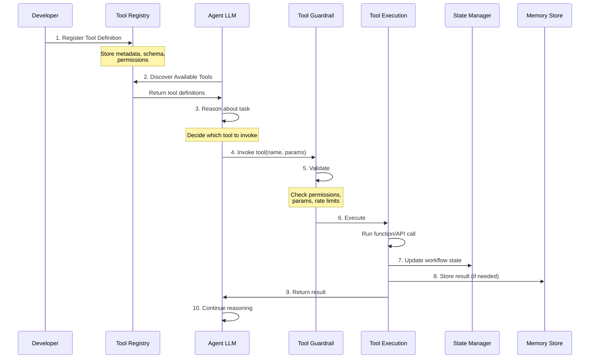
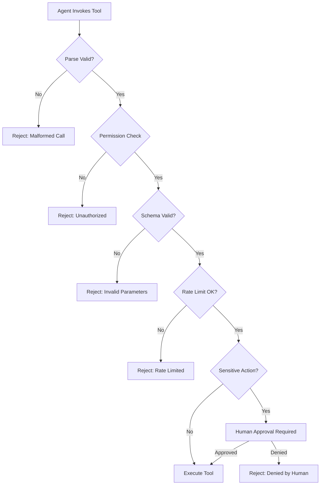
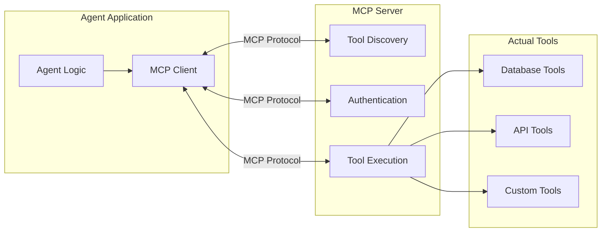

# Chapter 2: Tool Lifecycle

## Table of Contents

1. [What are Tools?](#what-are-tools)
2. [The Complete Tool Lifecycle](#the-complete-tool-lifecycle)
3. [Tool Registration and Discovery](#tool-registration-and-discovery)
4. [Tool Invocation](#tool-invocation)
5. [Tool Validation and Guardrails](#tool-validation-and-guardrails)
6. [Tool Execution](#tool-execution)
7. [Tool Patterns and Best Practices](#tool-patterns-and-best-practices)
8. [Model Context Protocol (MCP)](#model-context-protocol-mcp)
9. [Tool Governance at Scale](#tool-governance-at-scale)

---

## What are Tools?

**Tools** are the interface between an agent's reasoning and the real world. When an agent decides it needs to do something—look up information, send an email, process a payment—it does so by calling a tool.

### The Fundamental Principle

> **An agent's capability is defined by its tools.**

Without tools, an agent can only generate text. With tools, an agent can actually accomplish tasks. An agent without access to payment tools cannot process payments, regardless of what its instructions say. This limitation is a *feature*, not a bug—it creates clear security boundaries.

### Types of Tools

**1. Data Retrieval Tools**
- Query databases (SQL, NoSQL, vector stores)
- Search APIs (web search, internal knowledge bases)
- Fetch documents or files

**Examples**: `search_database()`, `query_customer_records()`, `search_documentation()`

**2. Action/Transaction Tools**
- Modify data (create, update, delete)
- Trigger workflows
- Send communications (email, SMS, notifications)

**Examples**: `process_refund()`, `create_ticket()`, `send_email()`

**3. Computation Tools**
- Mathematical calculations
- Data transformations
- Code execution

**Examples**: `calculate_tax()`, `convert_currency()`, `run_code_sandbox()`

**4. Integration Tools**
- Third-party API calls
- External service interactions
- System integrations

**Examples**: `check_inventory_api()`, `get_weather_data()`, `stripe_create_payment()`

### Tool Definition Structure

A tool definition tells the agent what the tool does, what parameters it needs, and what it returns:

```json
{
  "name": "lookup_order",
  "description": "Retrieves complete order details including status, items, and payment information for a given order ID",
  "parameters": {
    "type": "object",
    "properties": {
      "order_id": {
        "type": "string",
        "description": "The unique order identifier (e.g., 'ORD-12345')"
      }
    },
    "required": ["order_id"]
  },
  "returns": {
    "type": "object",
    "description": "Order object with status, items array, total, and customer info"
  }
}
```

**Critical insight**: The agent's LLM uses these descriptions to decide *when* and *how* to call the tool. Clear, detailed descriptions are essential for correct tool usage.

---

## The Complete Tool Lifecycle

Every tool goes through a lifecycle from registration to execution. Understanding this lifecycle is crucial for building reliable agentic systems.



### Lifecycle Stages

| Stage | Description | Key Actions |
|-------|-------------|-------------|
| **1. Registration** | Tool is defined and registered in the system | Define schema, permissions, constraints |
| **2. Discovery** | Agent becomes aware of available tools | Load tool definitions into agent context |
| **3. Invocation** | Agent decides to call a tool | LLM generates function call with parameters |
| **4. Validation** | System checks if call is allowed and valid | Permission check, parameter validation, rate limiting |
| **5. Execution** | Tool function runs | API call, database query, computation, etc. |
| **6. State Update** | System records the action | Log to workflow state and audit trail |
| **7. Memory Storage** | Result stored if needed for future reference | Save to short-term or long-term memory |
| **8. Result Return** | Output sent back to agent | Structured response with data or error |
| **9. Continuation** | Agent reasons about result and next action | Loop continues or task completes |

---

## Tool Registration and Discovery

### Registration: Defining Tools

Tools must be registered before agents can use them. Registration involves defining:

**1. Identity**
- **Name**: Unique identifier (`lookup_order`, not `lookup_order_v2`)
- **Version**: For tracking changes over time
- **Owner**: Team or service responsible

**2. Capability Description**
- **Description**: Natural language explanation of what the tool does
- **Use cases**: When to use this tool vs. alternatives
- **Limitations**: What the tool *doesn't* do

**3. Interface Contract**
- **Parameters**: Input schema with types, descriptions, constraints
- **Returns**: Output schema with expected structure
- **Errors**: Possible error codes and meanings

**4. Operational Constraints**
- **Permissions**: Which agents/roles can access
- **Rate limits**: Max calls per minute/hour
- **Cost**: Token/compute cost per invocation
- **Timeout**: Max execution time

**Example registration (conceptual):**

```python
# Conceptual example - framework-agnostic
tool_registry.register(
    name="lookup_order",
    description="Retrieves order details by order ID. Use when user asks about order status, shipping, or items.",
    parameters={
        "order_id": {
            "type": "string",
            "pattern": "^ORD-[0-9]+$",
            "description": "Order ID in format ORD-##### (e.g., ORD-12345)"
        }
    },
    returns=OrderSchema,  # Defined schema
    permissions=["billing_agent", "support_agent"],
    rate_limit="100/minute",
    timeout_seconds=5,
    idempotent=True  # Safe to call multiple times
)
```

### Discovery: Loading Tools into Agent Context

When an agent initializes, it needs to know which tools are available:

**Discovery methods:**

**1. Static Discovery (Compile-time)**
- Tools are hardcoded in agent configuration
- Fast, predictable, no runtime overhead
- Best for: Stable tool sets, single-agent systems

**2. Dynamic Discovery (Runtime)**
- Agent queries registry for available tools
- Flexible, allows adding tools without redeployment
- Best for: Evolving tool sets, multi-agent systems

**3. Context-Aware Discovery**
- Tools filtered based on agent role, user permissions, task type
- Reduces context size by only loading relevant tools
- Best for: Complex systems with many tools

**Discovery optimization:**

The LLM context window is precious. If you have 50 tools but only 5 are relevant to the current task, loading all 50 wastes 10,000+ tokens.

**Strategy**: Use **lazy loading** or **context-aware filtering**
```
User request: "Check order status"
    ↓
Classify intent: "order_inquiry"
    ↓
Load only order-related tools:
├─ lookup_order
├─ check_shipping_status
└─ get_tracking_number
(Skip irrelevant tools: process_refund, cancel_subscription, etc.)
```

---

## Tool Invocation

### How Agents Invoke Tools

When the agent's LLM decides a tool is needed, it generates a **function call** in a structured format:

**Function calling** (supported by modern LLMs like GPT-4, Claude, Gemini):

```json
{
  "function": "lookup_order",
  "arguments": {
    "order_id": "ORD-12345"
  }
}
```

The LLM generates this structure based on:
- Tool descriptions in context
- Current conversation and task
- Reasoning about what information is needed

### Decision Process

**What happens in the agent's "mind" when deciding to invoke a tool:**

```
Internal reasoning (implicit):
1. User asked: "Where is my order #12345?"
2. I need order status to answer this
3. I have a tool 'lookup_order' that can retrieve order details
4. Required parameter: order_id = "12345" (extracted from user message)
5. Decision: Call lookup_order(order_id="12345")
```

**Expressed as function call:**
```json
{
  "thought": "I need to look up order details to answer the user's question",
  "function": "lookup_order",
  "arguments": {"order_id": "ORD-12345"}
}
```

### Common Invocation Patterns

**1. Single Tool Call**
- Agent needs one piece of information
- Makes call, gets result, responds

**2. Sequential Tool Calls**
- Agent needs multiple pieces of information in order
- Call tool A → use result to inform tool B → respond

**Example:**
```
Step 1: lookup_order(order_id="12345") → Get order details
Step 2: check_shipping_status(tracking_id=<from step 1>) → Get shipping info
Step 3: Synthesize response with both pieces of information
```

**3. Parallel Tool Calls** (if supported)
- Agent needs multiple independent pieces of information
- Call multiple tools simultaneously
- Combine results

**Example:**
```
Parallel:
├─ lookup_order(order_id="12345")
├─ get_user_preferences(user_id="U789")
└─ check_promotion_eligibility(user_id="U789")

Wait for all → Synthesize response
```

---

## Tool Validation and Guardrails

Before a tool executes, the system must validate that the call is safe, authorized, and well-formed.

### The Validation Pipeline



### Validation Checks

**1. Parse Validation**
- Is the function call properly formatted?
- Does the tool name exist?
- Are arguments provided as expected type (object, not string)?

**Example failure:**
```json
// Agent tried to call non-existent tool
{"function": "lookup_orderz", "arguments": {...}}
// Typo: "orderz" instead of "order"
→ Reject: Tool 'lookup_orderz' not found
```

**2. Permission Check**
- Does this agent have access to this tool?
- Is the tool available in the current context?

**Example failure:**
```
Support Agent tries to call process_refund()
→ Reject: Support Agent does not have permission for financial tools
```

**3. Schema Validation**
- Are all required parameters provided?
- Do parameter values match expected types?
- Do values meet constraints (regex, min/max, enum)?

**Example failure:**
```json
// Missing required parameter
{"function": "lookup_order", "arguments": {}}
→ Reject: Required parameter 'order_id' missing

// Wrong type
{"function": "lookup_order", "arguments": {"order_id": 12345}}
→ Reject: 'order_id' must be string, got number
```

**4. Rate Limiting**
- Has this agent exceeded tool call limits?
- Is the system under load?

**Example failure:**
```
Agent has called tools 150 times in past minute
Rate limit: 100 calls/minute
→ Reject: Rate limit exceeded, retry in 30 seconds
```

**5. Sensitive Action Detection**
- Does this tool perform irreversible actions?
- Does it involve high-value transactions?
- Does it modify critical data?

**Examples requiring human approval:**
- Refunds > $500
- Account deletions
- Sending external communications
- Modifying production data

### Implementing Guardrails

**Tool-level guardrails** (defined at registration):

```python
# Conceptual example
tool_definition = {
    "name": "process_refund",
    "guardrails": {
        "requires_approval_if": {
            "amount": {"greater_than": 500}  # Dollar threshold
        },
        "rate_limit": "10/hour",  # Max 10 refunds per hour per agent
        "idempotent_key_required": True,  # Prevent duplicate processing
        "audit_log": True  # Log every invocation
    }
}
```

**Runtime guardrail check:**

```python
# Conceptual validation logic
def validate_tool_call(agent, tool_name, arguments):
    tool = registry.get_tool(tool_name)
    
    # Permission check
    if agent.role not in tool.allowed_roles:
        return ValidationError("Permission denied")
    
    # Schema validation
    if not validate_schema(arguments, tool.parameter_schema):
        return ValidationError("Invalid parameters")
    
    # Rate limit check
    if rate_limiter.is_exceeded(agent.id, tool_name):
        return ValidationError("Rate limit exceeded")
    
    # Sensitive action check
    if tool.guardrails.requires_approval_if:
        if meets_condition(arguments, tool.guardrails.requires_approval_if):
            return RequiresHumanApproval(tool_name, arguments)
    
    return ValidationSuccess()
```

---

## Tool Execution

### Execution Phase

Once validation passes, the tool executes. This involves:

**1. Preparation**
- Establish connections (database, API)
- Set up authentication/credentials
- Initialize logging context

**2. Execution**
- Run the actual function/API call
- Handle timeouts
- Catch exceptions

**3. Result Packaging**
- Structure the response
- Include metadata (execution time, status)
- Format errors consistently

**4. Post-Execution**
- Update state and audit logs
- Store result in memory if needed
- Clean up resources

### Execution Patterns

**Synchronous Execution** (most common):
```
Agent → Call tool → Wait → Receive result → Continue
Total time: Tool execution + network latency
```

**Asynchronous Execution** (for long-running tools):
```
Agent → Initiate tool → Receive job_id → Poll or callback → Continue
Use for: Large data processing, external API delays, batch operations
```

### Result Structure

**Standard result envelope:**

```json
{
  "status": "success",  // or "error"
  "data": {
    // Tool-specific result data
    "order_id": "ORD-12345",
    "status": "shipped",
    "items": [...]
  },
  "metadata": {
    "execution_time_ms": 245,
    "timestamp": "2026-02-15T10:30:00Z",
    "tool_version": "1.2.0"
  }
}
```

**Error result envelope:**

```json
{
  "status": "error",
  "error": {
    "code": "ORDER_NOT_FOUND",
    "message": "Order ORD-12345 does not exist",
    "recoverable": false,
    "suggested_action": "Verify order ID with user"
  },
  "metadata": {
    "execution_time_ms": 120,
    "timestamp": "2026-02-15T10:30:00Z"
  }
}
```

**Why structured responses matter:**

Agents need to reason about results. Consistent structure allows:
- Error handling ("If status is error, ask user for clarification")
- Retry logic ("If recoverable error, retry with exponential backoff")
- Result validation ("Check if data.status field exists before using")

---

## Tool Patterns and Best Practices

### Pattern 1: Idempotency

**Principle**: Calling the same tool multiple times with the same parameters produces the same result without side effects.

**Why it matters**: Agents may retry tool calls due to errors or LLM hallucinations. Non-idempotent tools can cause duplicate transactions.

**Bad example** (not idempotent):
```python
def process_refund(order_id, amount):
    # No check if refund already processed
    charge_card(-amount)  # ❌ Calling twice refunds twice!
    return {"status": "refunded"}
```

**Good example** (idempotent):
```python
def process_refund(order_id, amount, idempotency_key):
    # Check if this refund was already processed
    if refund_exists(idempotency_key):
        return get_existing_refund(idempotency_key)  # ✓ Return existing
    
    # Process new refund
    refund = charge_card(-amount)
    store_refund(idempotency_key, refund)
    return {"status": "refunded", "refund_id": refund.id}
```

### Pattern 2: Atomicity

**Principle**: Tool either fully succeeds or fully fails—no partial states.

**Why it matters**: Partial failures leave systems in inconsistent states that are hard to recover from.

**Bad example** (not atomic):
```python
def transfer_funds(from_account, to_account, amount):
    deduct_balance(from_account, amount)  # ✓ Succeeds
    # Network error occurs here ❌
    add_balance(to_account, amount)  # ❌ Never executes
    # Result: Money deducted but not added = lost funds
```

**Good example** (atomic with transaction):
```python
def transfer_funds(from_account, to_account, amount):
    with database.transaction():  # All-or-nothing
        deduct_balance(from_account, amount)
        add_balance(to_account, amount)
    # If any step fails, entire transaction rolls back
```

### Pattern 3: Least Privilege

**Principle**: Each agent gets only the minimum tools needed for its domain.

**Why it matters**: Security, reduced complexity, better testing.

**Bad example** (too many tools):
```python
support_agent_tools = [
    "lookup_order",           # ✓ Needed
    "search_knowledge_base",  # ✓ Needed
    "create_ticket",          # ✓ Needed
    "process_refund",         # ❌ Financial operation - should require billing agent
    "delete_user_account",    # ❌ Dangerous - should require admin + HITL
    "modify_pricing",         # ❌ Business critical - wrong agent
]
```

**Good example** (focused tools):
```python
support_agent_tools = [
    "lookup_order",           # Read-only order info
    "search_knowledge_base",  # Read-only knowledge
    "create_ticket",          # Create ticket (safe)
    "escalate_to_billing",    # Handoff tool for financial issues
]
```

### Pattern 4: Clear Tool Descriptions

**Principle**: Tool descriptions must be detailed enough for LLM to use correctly.

**Bad example** (vague):
```json
{
  "name": "update_status",
  "description": "Updates status",  // ❌ What status? When to use?
  "parameters": {
    "id": "string",     // ❌ ID of what?
    "value": "string"   // ❌ What values are valid?
  }
}
```

**Good example** (detailed):
```json
{
  "name": "update_order_shipping_status",
  "description": "Updates the shipping status of an order. Use this when a customer inquires about shipping and you need to update the status based on carrier information. Do NOT use for order cancellations or payment status.",
  "parameters": {
    "order_id": {
      "type": "string",
      "description": "The order ID in format ORD-##### (e.g., ORD-12345)",
      "pattern": "^ORD-[0-9]+$"
    },
    "status": {
      "type": "string",
      "enum": ["pending", "shipped", "in_transit", "delivered"],
      "description": "New shipping status. 'pending' = not yet shipped, 'shipped' = departed warehouse, 'in_transit' = with carrier, 'delivered' = received by customer"
    }
  }
}
```

### Pattern 5: Timeout and Retry

**Principle**: All tools must have timeouts; some should support retries.

**Implementation:**

```python
# Conceptual retry logic
def call_tool_with_retry(tool_name, arguments, max_retries=3):
    for attempt in range(max_retries):
        try:
            result = execute_tool(tool_name, arguments, timeout=5)
            return result
        except TimeoutError:
            if attempt < max_retries - 1:
                wait = 2 ** attempt  # Exponential backoff: 1s, 2s, 4s
                time.sleep(wait)
                continue
            else:
                return error_result("Tool timeout after 3 retries")
        except NonRetryableError as e:
            return error_result(f"Permanent failure: {e}")
```

---

## Model Context Protocol (MCP)

**MCP** (Model Context Protocol) is an emerging open standard for agent-tool communication, similar to how HTTP standardized web communication.

### Why MCP Matters

**Problem without MCP:**
- Every framework has custom tool definition format
- Tools built for Framework A don't work in Framework B
- No standard for tool discovery, authentication, monitoring

**Solution with MCP:**
- Standardized protocol for exposing tools
- Any MCP-compatible agent can use any MCP server
- Tools become portable across frameworks

### MCP Architecture



### MCP Benefits for Enterprise

**1. Interoperability**
- Build tools once, use in any framework
- Switch agent frameworks without rebuilding tools

**2. Governance**
- Centralized tool registry
- Consistent authentication and authorization
- Standardized monitoring and logging

**3. Modularity**
- Teams can own and deploy their MCP servers independently
- Add/remove tools without changing agent code

**4. Security**
- MCP servers act as security boundary
- Fine-grained access control
- Audit trail of all tool calls

### MCP vs. Other Patterns

| Pattern | Best For | Trade-offs |
|---------|----------|-----------|
| **Direct function calls** | Simple, single-agent systems | Fast, no protocol overhead, but not portable |
| **MCP** | Multi-framework, team-owned tools | Standardized, portable, but adds protocol layer |
| **API Management Platform** | Enterprise scale, governance-heavy | Comprehensive controls, but complex setup |

---

## Tool Governance at Scale

As your agentic system grows, tool governance becomes critical.

### Tool Registry as Source of Truth

**Central registry maintains:**
- All registered tools and their versions
- Ownership (which team maintains each tool)
- Dependencies (which agents use which tools)
- Usage metrics (call volume, error rates, latency)
- Cost attribution (track spend per tool)

### Version Management

**Challenge**: How to update tools without breaking existing agents?

**Solution**: Semantic versioning + deprecation policy

```
tool_name: "lookup_order"
versions:
  - v1.0.0 (deprecated, sunset 2026-06-01)
  - v1.1.0 (stable, current default)
  - v2.0.0-beta (testing, breaking changes)
```

**Migration strategy:**
1. Release v2.0.0-beta for testing
2. Migrate agents incrementally to v2.0
3. Mark v1.0 as deprecated with sunset date
4. After sunset, v1.0 returns deprecation error

### Cost Tracking

**Track costs per tool call:**

```python
tool_metrics = {
    "tool_name": "search_database",
    "total_calls": 15000,
    "total_cost_usd": 45.00,  # Based on database query cost
    "avg_latency_ms": 120,
    "error_rate": 0.02  # 2%
}
```

**Use for:**
- Budgeting: Set per-agent or per-user cost limits
- Optimization: Identify expensive tools to optimize
- Alerting: Notify when costs spike unexpectedly

### Access Control Matrix

Define which agents can access which tools:

| Tool | Public | Support Agent | Billing Agent | Admin |
|------|--------|---------------|---------------|-------|
| `lookup_order` | ✓ | ✓ | ✓ | ✓ |
| `search_knowledge_base` | ✓ | ✓ | ✗ | ✓ |
| `process_refund` | ✗ | ✗ | ✓ | ✓ |
| `delete_user_account` | ✗ | ✗ | ✗ | ✓ + HITL |

**Implementation**: Check permissions before every tool execution.

---

## Key Takeaways

**Tool Lifecycle Summary:**
```
Register → Discover → Invoke → Validate → Execute → Return → Monitor
```

**Critical Principles:**

1. **Capability = Tools**: Agent abilities are completely defined by tool access
2. **Idempotency**: Tools should be safe to call multiple times
3. **Atomicity**: Tools should fully succeed or fully fail—no partial states
4. **Least Privilege**: Give agents minimum tools needed
5. **Clear Descriptions**: LLM needs detailed tool descriptions to use correctly
6. **Validation First**: Check permissions, schema, rate limits before execution
7. **Structured Results**: Consistent response format for agent reasoning
8. **Governance at Scale**: Use registries, versioning, and cost tracking

**Next Chapter**: [Chapter 3: Memory Lifecycle](03-Memory-Lifecycle.md) - Learn how agents remember and retrieve information across interactions.
