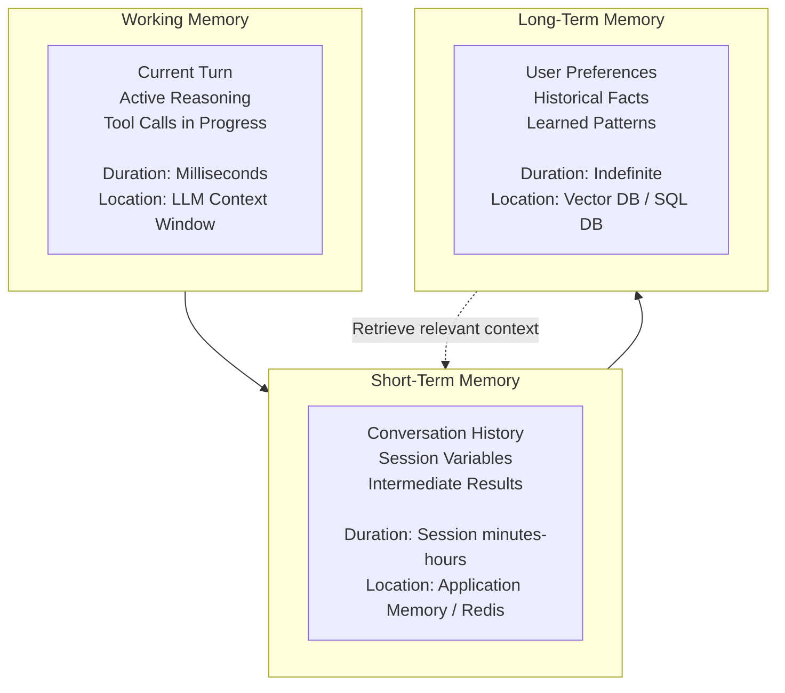
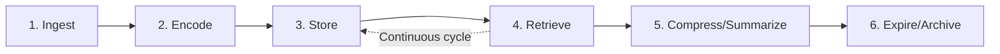
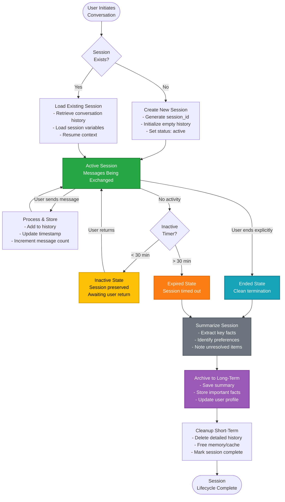

# Chapter 3: Memory Lifecycle

## Table of Contents

1. [What is Memory in Agentic Systems?](#what-is-memory-in-agentic-systems)
2. [The Three-Tier Memory Hierarchy](#the-three-tier-memory-hierarchy)
3. [The Complete Memory Lifecycle](#the-complete-memory-lifecycle)
4. [Working Memory: The Context Window](#working-memory-the-context-window)
5. [Short-Term Memory: Session Context](#short-term-memory-session-context)
6. [Long-Term Memory: Persistent Knowledge](#long-term-memory-persistent-knowledge)
7. [Memory Storage Options](#memory-storage-options)
8. [Memory Scoping and Access Control](#memory-scoping-and-access-control)
9. [Memory Patterns and Best Practices](#memory-patterns-and-best-practices)

---

## What is Memory in Agentic Systems?

**Memory** gives agents the ability to retain information across interactions. Without memory, every conversation would start from zero—the agent would have no knowledge of past interactions, user preferences, or accumulated facts.

### Memory vs. State (A Critical Distinction)

Before diving deep, it's crucial to understand that **memory** and **state** are different concepts:

| Aspect | Memory | State |
|--------|--------|-------|
| **Question Answered** | "What do we know?" | "Where are we in the process?" |
| **Content** | Facts, history, preferences, knowledge | Step, status, pending actions |
| **Changes When** | New information is learned | Workflow progresses |
| **Example** | "User prefers detailed explanations" | "Currently awaiting approval at step 3" |
| **Duration** | Can persist indefinitely | Temporary, cleared when workflow completes |

**Memory** = Knowledge base
**State** = Workflow tracker

This chapter focuses on **memory**. State management is covered in [Chapter 4](04-State-Management-Lifecycle.md).

### Why Memory Matters

**Without memory:**
- Agent can't remember what user said 5 messages ago
- Every interaction feels disconnected and impersonal
- Agent repeats questions already answered
- No learning or personalization over time

**With memory:**
- Agent maintains conversation context
- Personalized responses based on user history
- Avoids redundant questions
- Builds on previous interactions

**Production impact**: Systems with proper memory architecture show 40-60% improvement in user satisfaction scores compared to memoryless systems.

---

## The Three-Tier Memory Hierarchy

Agent memory operates at three distinct tiers, each with different characteristics, duration, and storage requirements.



### Tier Comparison

| Tier | Speed | Capacity | Persistence | Cost | Use Case |
|------|-------|----------|-------------|------|----------|
| **Working** | Fastest | Very Limited (~200K tokens) | None | Token cost per request | Current turn reasoning |
| **Short-Term** | Fast | Limited (100s of messages) | Session lifetime | Memory/cache cost | Conversation continuity |
| **Long-Term** | Moderate | Unlimited | Permanent | Storage + retrieval cost | User history, learned facts |

**Design principle**: Use the fastest tier that meets your needs. Don't store everything in long-term memory if it's only needed for the current session.

---

## The Complete Memory Lifecycle

Memory moves through distinct stages from creation to eventual expiration or archival.



### Lifecycle Stages

**1. Ingest**
- Agent receives information (user message, tool result, observation)
- Extract relevant facts, entities, preferences
- Tag with metadata (timestamp, user_id, session_id, importance)

**2. Encode**
- Convert information into storable format
- For vector memory: Generate embeddings
- For structured memory: Normalize to schema
- Apply any encryption/security measures

**3. Store**
- Persist to appropriate tier (working, short-term, or long-term)
- Index for efficient retrieval
- Apply retention policies

**4. Retrieve**
- Query memory when agent needs information
- Use semantic search (vector similarity) or structured queries (SQL)
- Rank results by relevance and recency

**5. Compress/Summarize**
- When memory approaches capacity, compress older information
- Summarize long conversation histories
- Extract key facts and discard details

**6. Expire/Archive**
- Remove memory after retention period expires
- Archive important historical data to cold storage
- Comply with data deletion policies (GDPR, etc.)

---

## Working Memory: The Context Window

### What is Working Memory?

**Working memory** is what the agent is actively thinking about *right now*—the current turn of conversation, any tool calls in progress, the immediate reasoning chain.

**Physical location**: The LLM's context window (the input tokens sent to the model)

### Characteristics

**Capacity**: Limited by model's context window
- GPT-4: 128K tokens (~96,000 words)
- Claude 3: 200K tokens (~150,000 words)
- Gemini 1.5 Pro: 1M tokens (~750,000 words)

**Duration**: Single turn (milliseconds to seconds)

**Speed**: Fastest—direct access by LLM

**Cost**: Token cost per API call

### What Goes in Working Memory?

**Essential components:**

1. **System Prompt** (agent instructions, role definition)
2. **Tool Definitions** (available functions and their descriptions)
3. **Recent Conversation** (last N messages from short-term memory)
4. **Current User Message** (the prompt being processed)
5. **Relevant Long-Term Context** (retrieved facts, user preferences)

**Token budget example** (GPT-4 with 128K context):

```
System Prompt:              2,000 tokens
Tool Definitions (10 tools): 3,000 tokens
Recent History (20 msgs):   15,000 tokens
Retrieved Context:          5,000 tokens
User Message:               500 tokens
------------------------------------------
Total Used:                 25,500 tokens
Remaining for Response:     102,500 tokens
```

### Working Memory Management

**Challenge**: Context window fills up during long conversations.

**Solution**: Dynamically manage what's in working memory.

**Strategies:**

**1. Sliding Window**
- Keep only last N messages in context
- Oldest messages drop out as new ones arrive

```python
# Conceptual
if len(conversation_history) > MAX_MESSAGES:
    # Keep system prompt + last N messages
    working_memory = [
        system_prompt,
        *conversation_history[-MAX_MESSAGES:]
    ]
```

**2. Importance-Based Selection**
- Tag messages by importance
- Keep high-importance messages even if older

```python
# Conceptual
high_importance = [msg for msg in history if msg.importance > 0.8]
recent = history[-10:]
working_memory = merge_and_dedupe(high_importance, recent)
```

**3. Summarization**
- Summarize old conversation into compact form
- Replace detailed history with summary

```python
# Conceptual
if token_count > threshold:
    summary = summarize(conversation_history[:-10])  # Summarize old
    working_memory = [system_prompt, summary, *recent_history]
```

### Best Practices

✅ **DO:**
- Monitor token usage continuously
- Load only relevant tools for current task
- Retrieve targeted long-term context, not everything
- Compress or summarize when approaching limits

❌ **DON'T:**
- Load all 50 tools when agent needs 5
- Include entire conversation history every turn
- Retrieve all user history (only what's relevant)
- Ignore token budgets until you hit limit

---

## Short-Term Memory: Session Context

### What is Short-Term Memory?

**Short-term memory** persists throughout a conversation session. It includes the conversation history, session-specific variables, and intermediate results from multi-step tasks.

**Physical location**: Application memory, in-memory cache (Redis), or session database

**Duration**: Current session (minutes to hours)

### Characteristics

**Capacity**: Moderate (100s to 1000s of messages)

**Duration**: Session lifetime (typically cleared when conversation ends)

**Speed**: Fast (in-memory or cached)

**Cost**: Memory/cache storage cost

### What Goes in Short-Term Memory?

**1. Conversation History**
- All messages in current session
- User inputs and agent responses
- Timestamps and metadata

```json
{
  "session_id": "sess_xyz789",
  "messages": [
    {
      "role": "user",
      "content": "What's the status of order 12345?",
      "timestamp": "2026-02-15T10:30:00Z"
    },
    {
      "role": "agent",
      "content": "Your order 12345 shipped yesterday...",
      "timestamp": "2026-02-15T10:30:05Z",
      "tool_calls": ["lookup_order"]
    }
  ]
}
```

**2. Session Variables**
- Extracted entities (user_id, order_ids mentioned)
- Conversation context (topic, sentiment)
- Temporary preferences (verbose mode, language)

```json
{
  "session_variables": {
    "user_id": "U789",
    "orders_discussed": ["12345", "12346"],
    "current_topic": "order_tracking",
    "user_preference_detail_level": "concise"
  }
}
```

**3. Intermediate Results**
- Tool call results that may be referenced later
- Partial computations
- Cached lookups (avoid re-querying same data)

```json
{
  "cached_results": {
    "order_12345": {
      "status": "shipped",
      "cached_at": "2026-02-15T10:30:05Z",
      "ttl_seconds": 300
    }
  }
}
```

### Short-Term Memory Storage Options

**Option 1: In-Memory (Application)**

**Use case**: Development, single-instance deployments, low-volume

```python
# Conceptual
class InMemorySessionStore:
    def __init__(self):
        self.sessions = {}  # session_id -> session_data
    
    def save_message(self, session_id, message):
        if session_id not in self.sessions:
            self.sessions[session_id] = []
        self.sessions[session_id].append(message)
```

**Pros**: Simple, fast, no external dependencies
**Cons**: Lost on restart, doesn't scale horizontally

**Option 2: Redis Cache**

**Use case**: Production, multiple instances, need scalability

**Pros**: Fast, distributed, persistent across app restarts
**Cons**: Requires Redis infrastructure, costs

**Option 3: Database (SQL/NoSQL)**

**Use case**: Need durability, querying, or long session retention

**Pros**: Durable, queryable, supports complex operations
**Cons**: Slower than memory/cache

### Session Lifecycle

Short-term memory is organized around **sessions** - discrete periods of interaction between a user and the agent. Understanding the session lifecycle is crucial for managing memory effectively.



**Lifecycle Stages Explained:**

**1. Session Creation (Entry)**
- **Trigger**: User sends first message
- **Actions**:
  - Generate unique `session_id` (e.g., `sess_abc123`)
  - Initialize empty conversation history array
  - Set creation timestamp
  - Mark status as `active`
- **Storage**: Create entry in session store (Redis/memory)

**2. Active State (Primary)**
- **Duration**: While conversation is ongoing
- **Actions**:
  - Each message (user + agent) appended to history
  - Last activity timestamp updated continuously
  - Session variables updated (extracted entities, context)
- **Monitoring**: Check if `last_activity > 30 minutes ago`

**3. Inactive State (Waiting)**
- **Trigger**: No messages for 5-30 minutes (configurable)
- **Purpose**: Preserve session for returning users
- **Actions**:
  - Session marked as `inactive` but NOT deleted
  - History remains in memory/cache
  - Background timer continues
- **Return Path**: User sends new message → Reload session → Resume as `active`

**4. Expired State (Timeout)**
- **Trigger**: No activity for > 30 minutes (configurable timeout)
- **Purpose**: Automatic cleanup of abandoned conversations
- **Actions**:
  - Session marked as `expired`
  - Triggers archival process

**5. Ended State (Explicit Termination)**
- **Trigger**: User explicitly ends conversation (clicks "End Chat", logs out, etc.)
- **Purpose**: Clean, intentional termination
- **Actions**:
  - Session marked as `ended`
  - Triggers archival process immediately

**6. Summarization Phase**
- **Purpose**: Extract valuable information before deletion
- **Process**:
  ```python
  summary = {
      "session_id": "sess_abc123",
      "user_id": "U789",
      "start_time": "2026-02-15T10:00:00Z",
      "end_time": "2026-02-15T10:45:00Z",
      "duration_minutes": 45,
      "message_count": 24,
      "key_topics": ["order_inquiry", "refund_request"],
      "extracted_facts": [
          "User inquired about order ORD-12345",
          "Refund of $249.99 processed successfully"
      ],
      "user_preferences_learned": [
          "Prefers detailed explanations"
      ],
      "sentiment": "satisfied",
      "resolved": true
  }
  ```

**7. Archival Phase**
- **Purpose**: Move summary to long-term memory
- **Actions**:
  - Save summary to persistent database
  - Update user profile with learned preferences
  - Store important facts in vector database (for semantic retrieval)
  - Record session statistics

**8. Cleanup Phase (Final)**
- **Purpose**: Free up short-term memory resources
- **Actions**:
  - Delete detailed message history from cache/memory
  - Remove session from active session store
  - Mark session as `archived` in database
  - Free allocated resources

**Timing Examples:**

| Scenario | Typical Timing |
|----------|---------------|
| Active session duration | 5-60 minutes |
| Inactive timeout threshold | 30 minutes |
| Expired timeout threshold | 24 hours |
| Summarization time | 1-2 seconds |
| Total lifecycle (active conversation) | Seconds to hours |
| Total lifecycle (with inactivity) | Up to 24 hours |

**Memory Implications:**

```
Session in Active State:
├─ Full conversation history: ~50-500 KB (depending on length)
├─ Session variables: ~1-10 KB
├─ Cached tool results: ~10-100 KB
└─ Total per session: ~60-610 KB

After Archival:
├─ Summary stored: ~1-5 KB
├─ Detailed history: DELETED (99% reduction)
└─ Memory freed for new sessions
```

**Best Practices:**

✅ **Set appropriate timeouts** based on use case:
- Customer support chat: 30 min inactive, 4 hours expired
- Interactive tutorial: 10 min inactive, 24 hours expired
- Long-form consultation: 60 min inactive, 7 days expired

✅ **Always summarize before deletion** - Don't lose valuable insights

✅ **Monitor session counts** - Alert if active sessions exceed capacity

✅ **Implement graceful resumption** - When user returns after timeout, show context: "Welcome back! We were discussing your order refund..."

✅ **Log session lifecycle events** for debugging and analytics

**Typical session flow:**

1. **Session Start**: User sends first message → Create session_id
2. **Active**: Messages exchanged, stored in short-term memory
3. **Inactive**: User stops responding → Session marked inactive
4. **Timeout**: After N minutes inactive → Session expires
5. **Archive**: Compress session summary to long-term memory
6. **Cleanup**: Delete detailed short-term memory to save resources

---

## Long-Term Memory: Persistent Knowledge

### What is Long-Term Memory?

**Long-term memory** persists indefinitely and survives across sessions. This is where you store user preferences, historical facts, and patterns learned over time.

**Physical location**: Database (SQL/NoSQL) and/or vector database

**Duration**: Indefinite (with retention policies)

### Characteristics

**Capacity**: Unlimited (practically)

**Duration**: Permanent (until retention policy expires or user requests deletion)

**Speed**: Moderate (requires database query)

**Cost**: Storage cost + retrieval cost

### What Goes in Long-Term Memory?

**1. User Preferences**
- Communication style preferences
- Domain preferences
- Feature preferences

```json
{
  "user_id": "U789",
  "preferences": {
    "communication_style": "detailed",
    "preferred_language": "en",
    "timezone": "America/New_York",
    "notification_preference": "email"
  }
}
```

**2. Historical Facts**
- Past interactions summaries
- Important events
- Learned patterns

```json
{
  "user_id": "U789",
  "historical_facts": [
    "Customer since 2024-01-15",
    "Has contacted support 8 times in past year",
    "Primary issue category: billing questions",
    "Average satisfaction score: 4.2/5"
  ]
}
```

**3. Knowledge Base**
- Domain knowledge accessible to agent
- FAQ content
- Company policies, product docs

```json
{
  "knowledge_id": "kb_refund_policy",
  "content": "Refunds are available within 30 days...",
  "embedding": [0.123, 0.456, ...],  // Vector for semantic search
  "metadata": {
    "category": "policy",
    "last_updated": "2026-01-01"
  }
}
```

### Long-Term Memory Storage Patterns

**Pattern 1: Structured Storage (SQL/NoSQL)**

**Best for**: Queryable facts with known schema

```sql
-- User preferences table
CREATE TABLE user_preferences (
    user_id VARCHAR PRIMARY KEY,
    communication_style VARCHAR,
    timezone VARCHAR,
    created_at TIMESTAMP,
    updated_at TIMESTAMP
);

-- Historical interactions table
CREATE TABLE interaction_summaries (
    id UUID PRIMARY KEY,
    user_id VARCHAR,
    session_summary TEXT,
    sentiment VARCHAR,
    resolved BOOLEAN,
    created_at TIMESTAMP
);
```

**Retrieval**: Standard SQL queries

```sql
SELECT * FROM user_preferences WHERE user_id = 'U789';
```

**Pattern 2: Vector Storage (Semantic Search)**

**Best for**: Unstructured text that needs semantic similarity search

**How it works:**

1. **Ingestion**: Text is converted to vector embedding (array of numbers)
2. **Storage**: Vectors stored in specialized vector database
3. **Retrieval**: Query is converted to vector → find nearest neighbors

```python
# Conceptual
# Ingestion
document = "Our refund policy allows returns within 30 days..."
embedding = embedding_model.encode(document)  # [0.123, 0.456, ...]
vector_db.store(id="doc_refund_policy", vector=embedding, metadata={...})

# Retrieval
query = "How long do I have to return an item?"
query_embedding = embedding_model.encode(query)
results = vector_db.search(query_embedding, top_k=5)
# Returns most semantically similar documents
```

**Pattern 3: Hybrid Storage (Structured + Vector)**

**Best for**: Complex systems needing both queryable facts and semantic search

```python
# Conceptual hybrid approach
# Store structured data in SQL
user_data = sql_db.query("SELECT * FROM users WHERE id = 'U789'")

# Store unstructured knowledge in vector DB
relevant_docs = vector_db.search(query_embedding, filter={"user_id": "U789"})

# Combine for complete context
context = merge(user_data, relevant_docs)
```

### Long-Term Memory Retrieval Strategies

**Challenge**: Can't load all long-term memory into working memory (would exceed context window).

**Solution**: Retrieve only relevant information.

**Strategy 1: Keyword/Metadata Filtering**

```python
# User asks about billing
# Filter to billing-related memories
memories = long_term_db.query(
    user_id="U789",
    category="billing",
    limit=10
)
```

**Strategy 2: Semantic Search**

```python
# User asks: "What were my recent issues?"
# Convert to embedding and find similar past interactions
query_embedding = embed("recent issues user had")
memories = vector_db.search(
    query_embedding,
    filter={"user_id": "U789"},
    top_k=5
)
```

**Strategy 3: Temporal Relevance**

```python
# Prioritize recent memories
memories = long_term_db.query(
    user_id="U789",
    order_by="timestamp DESC",
    limit=10
)
```

**Strategy 4: Importance Weighting**

```python
# Retrieve memories tagged as important
memories = long_term_db.query(
    user_id="U789",
    importance_threshold=0.7,  # Only important memories
    limit=10
)
```

---

## Memory Storage Options

### Storage Technology Comparison

| Technology | Use Case | Pros | Cons |
|------------|----------|------|------|
| **In-Memory (Python dict)** | Dev/testing | Simplest, fastest | Lost on restart, doesn't scale |
| **Redis** | Short-term memory, cache | Fast, distributed, persistent | Requires infrastructure, memory limits |
| **PostgreSQL** | Structured long-term memory | ACID, queryable, reliable | Slower than cache, not for vectors |
| **Vector DBs (Pinecone, Weaviate, Chroma)** | Semantic search on unstructured text | Semantic retrieval, scalable | Specialized, can't replace SQL |
| **Firestore/DynamoDB** | Document-based long-term | Scalable, flexible schema | NoSQL trade-offs (limited joins) |

### Choosing Storage for Each Tier

**Working Memory**: Always in LLM context (no separate storage)

**Short-Term Memory**:
- **Development**: In-memory
- **Production**: Redis or session database

**Long-Term Memory**:
- **Structured data** (preferences, facts): PostgreSQL, Firestore
- **Unstructured text** (knowledge base, past conversations): Vector database
- **Hybrid**: Both SQL + Vector

### Implementation Example: Three-Tier Setup

```python
# Conceptual architecture
class AgentMemory:
    def __init__(self):
        # Short-term: Redis for session data
        self.session_store = RedisSessionStore()
        
        # Long-term: PostgreSQL for structured data
        self.user_db = PostgreSQLDatabase()
        
        # Long-term: Vector DB for semantic search
        self.knowledge_base = VectorDatabase()
    
    def get_context_for_turn(self, session_id, user_message):
        # 1. Load short-term memory (recent conversation)
        session = self.session_store.get(session_id)
        recent_messages = session.messages[-10:]  # Last 10 messages
        
        # 2. Load relevant long-term structured data
        user_preferences = self.user_db.get_user_preferences(session.user_id)
        
        # 3. Retrieve relevant long-term unstructured knowledge
        query_embedding = embed(user_message)
        relevant_docs = self.knowledge_base.search(query_embedding, top_k=3)
        
        # 4. Combine into working memory (LLM context)
        return {
            "recent_conversation": recent_messages,
            "user_preferences": user_preferences,
            "relevant_knowledge": relevant_docs
        }
```

---

## Memory Scoping and Access Control

### Why Memory Scoping Matters

**Problem**: If every agent sees all memory, you get:
- Context bloat (wasted tokens)
- Privacy violations (support agent sees billing details)
- Security risks (agent accesses data it shouldn't)

**Solution**: Scope memory access based on agent role and task.

### Memory Access Patterns

**Pattern 1: Role-Based Scoping**

```python
# Each agent sees only relevant memory
class SupportAgent:
    memory_scope = {
        "short_term": ["conversation_history"],
        "long_term": ["user_support_history", "knowledge_base"],
        "excluded": ["billing_history", "payment_methods"]
    }

class BillingAgent:
    memory_scope = {
        "short_term": ["conversation_history"],
        "long_term": ["user_billing_history", "payment_methods"],
        "excluded": ["support_tickets", "technical_diagnostics"]
    }
```

**Pattern 2: Task-Based Filtering**

```python
# Load only memory relevant to current task
if task_type == "order_inquiry":
    memories = [
        load_order_history(user_id),
        load_shipping_preferences(user_id)
    ]
    # Skip billing, support, etc.
```

**Pattern 3: Minimum Necessary Principle**

Load the minimum memory needed to complete the task:

```python
# Bad: Load everything
all_user_data = db.get_everything(user_id)  # ❌ Wasteful

# Good: Load only what's needed
order_data = db.get_order(order_id)  # ✓ Targeted
```

### Privacy and Compliance

**GDPR/Privacy requirements:**

1. **Right to access**: User can request all stored memories
2. **Right to deletion**: User can request memory deletion
3. **Data minimization**: Store only what's necessary
4. **Retention policies**: Delete memories after expiration period

**Implementation:**

```python
# Conceptual compliance features
class MemoryManager:
    def export_user_data(self, user_id):
        # GDPR: Export all data for user
        return {
            "short_term_sessions": self.session_store.get_all(user_id),
            "long_term_preferences": self.user_db.get(user_id),
            "interaction_history": self.history_db.get(user_id)
        }
    
    def delete_user_data(self, user_id):
        # GDPR: Delete all user data
        self.session_store.delete_all(user_id)
        self.user_db.delete(user_id)
        self.vector_db.delete(filter={"user_id": user_id})
    
    def apply_retention_policy(self):
        # Auto-delete data older than retention period
        cutoff = now() - timedelta(days=RETENTION_DAYS)
        self.history_db.delete_older_than(cutoff)
```

---

## Memory Patterns and Best Practices

### Pattern 1: Lazy Loading

**Don't load all memory upfront—load on demand.**

```python
# Bad: Eager loading
all_memories = load_entire_user_history(user_id)  # ❌ Slow, wasteful

# Good: Lazy loading
if agent_needs_billing_info:
    billing_memories = load_billing_history(user_id)  # ✓ On-demand
```

### Pattern 2: Memory Compression

**Compress old memories to save space and tokens.**

```python
# After 50 messages, summarize old conversation
if len(session.messages) > 50:
    old_messages = session.messages[:-20]  # All but last 20
    summary = llm.summarize(old_messages)
    session.messages = [summary] + session.messages[-20:]
```

### Pattern 3: Forgetting/Expiration

**Not all memory needs to persist forever.**

```python
# Cache tool results temporarily (5 minutes)
cache.set(key="order_12345", value=order_data, ttl=300)

# Delete inactive sessions after 24 hours
for session in inactive_sessions:
    if session.last_activity < now() - timedelta(hours=24):
        archive_summary(session)
        delete_session(session.id)
```

### Pattern 4: Memory Tagging

**Tag memories with metadata for better retrieval.**

```python
memory = {
    "content": "User prefers detailed technical explanations",
    "tags": ["preference", "communication_style"],
    "importance": 0.9,  # High importance
    "created_at": "2026-02-15T10:30:00Z",
    "user_id": "U789"
}
```

### Pattern 5: Artifact Storage

**Store important outputs as retrievable artifacts.**

```python
# Save agent-generated reports as retrievable artifacts
artifact = {
    "type": "analysis_report",
    "content": "Quarterly sales analysis: ...",
    "embedding": embed(content),
    "metadata": {
        "created_at": "2026-02-15",
        "user_id": "U789",
        "referenced_data": ["sales_q1_2026"]
    }
}
vector_db.store(artifact)

# Later, retrieve: "Show me the quarterly analysis you did last month"
```

---

## Key Takeaways

**Memory Lifecycle Summary:**
```
Ingest → Encode → Store → Retrieve → Compress → Expire/Archive
```

**Three-Tier Hierarchy:**
- **Working Memory**: Current turn (LLM context window)
- **Short-Term Memory**: Session (Redis/cache)
- **Long-Term Memory**: Persistent (SQL/vector DB)

**Critical Principles:**

1. **Memory ≠ State**: Memory is knowledge; state is workflow position
2. **Use Appropriate Tier**: Don't store session data in long-term memory
3. **Scope Access**: Agents see only relevant memories
4. **Lazy Load**: Retrieve only what's needed when it's needed
5. **Compress Old Data**: Summarize to save tokens and space
6. **Apply Retention**: Delete expired memories per policy
7. **Tag for Retrieval**: Metadata improves findability
8. **Hybrid Storage**: Use SQL for structured + vectors for semantic search

**Next Chapter**: [Chapter 4: State Management Lifecycle](04-State-Management-Lifecycle.md) - Learn how agents track workflow progress and enable checkpoint/resume capabilities.
