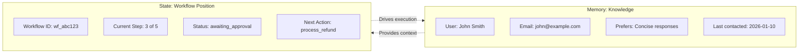
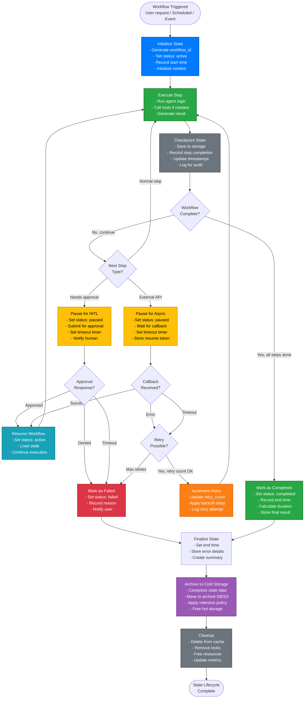
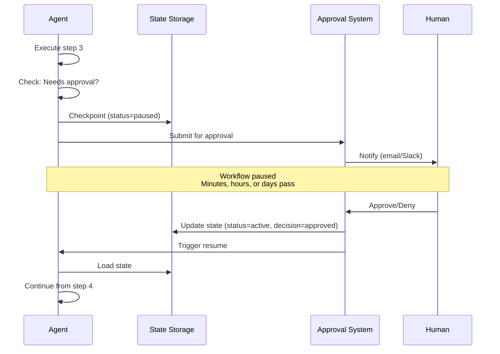

# Chapter 4: State Management Lifecycle

## Table of Contents

1. [What is State Management?](#what-is-state-management)
2. [State vs. Memory: The Critical Distinction](#state-vs-memory-the-critical-distinction)
3. [The Complete State Lifecycle](#the-complete-state-lifecycle)
4. [Types of State](#types-of-state)
5. [State Storage Options](#state-storage-options)
6. [Checkpoint and Resume Patterns](#checkpoint-and-resume-patterns)
7. [State at Scale](#state-at-scale)
8. [State Management Best Practices](#state-management-best-practices)

---

## What is State Management?

**State management** tracks *where you are* in a multi-step process. While memory answers "what do we know?", state answers "where are we in the workflow?"

### Why State Management Matters

**Without state management:**
- Agent can't resume after interruption (e.g., system restart, human approval pause)
- Can't track progress through multi-step workflows
- Can't handle failures gracefully (no way to retry from failed step)
- Can't provide status updates ("What's the status of my request?")
- Can't audit what happened (no record of workflow execution)

**With state management:**
- Workflows survive system restarts
- Agent resumes exactly where it left off
- Failed steps can be retried without repeating successful ones
- Users can check progress
- Complete audit trail of workflow execution

**Production requirement**: Any agentic system that performs multi-step workflows *must* have state management for production reliability.

---

## State vs. Memory: The Critical Distinction

This distinction is fundamental—confusing state and memory leads to architectural problems.

### The Core Difference

| Aspect | Memory | State |
|--------|--------|-------|
| **Question Answered** | "What do we know?" | "Where are we in the process?" |
| **Content** | Facts, history, preferences, knowledge | Step, status, pending actions, workflow position |
| **Changes When** | New information is learned | Workflow progresses to next step |
| **Lifecycle** | Can persist indefinitely | Temporary, cleared when workflow completes |
| **Example** | "User prefers detailed explanations" | "Currently at step 3, awaiting approval" |
| **Usage** | Agent reads to understand context | Agent reads to know what to do next |

### Visualization



**Memory** = "Who is this user and what do they care about?"
**State** = "What are we currently doing for this user?"

### Practical Example

**Scenario**: User requests refund for order #12345

**Memory stores:**
```json
{
  "user_id": "U789",
  "name": "John Smith",
  "tier": "premium",
  "order_12345": {
    "amount": 249.99,
    "product": "Laptop Stand",
    "purchase_date": "2026-01-15"
  },
  "past_refunds": 2,
  "communication_preference": "concise"
}
```

**State stores:**
```json
{
  "workflow_id": "wf_refund_789",
  "workflow_type": "refund_request",
  "status": "in_progress",
  "current_step": "awaiting_approval",
  "steps_completed": [
    "validate_order",
    "check_eligibility",
    "calculate_amount"
  ],
  "pending_action": {
    "type": "process_refund",
    "amount": 249.99,
    "requires_approval": true
  }
}
```

**Memory** tells us about John and his order.
**State** tells us we're waiting for approval to process the refund.

---

## The Complete State Lifecycle

State moves through distinct stages from initialization to completion. Understanding this lifecycle is essential for building reliable, resumable workflows.



### Lifecycle Stages Explained in Detail

**1. Initialize (Entry Point)**

**Trigger**: Workflow creation event
- User submits request
- Scheduled task fires
- System event occurs

**Actions Performed**:
```python
state = {
    "workflow_id": generate_uuid(),  # e.g., "wf_abc123"
    "workflow_type": "customer_refund",
    "status": "active",
    "created_at": current_timestamp(),
    "updated_at": current_timestamp(),
    "current_step": 1,
    "total_steps": 5,
    "steps_completed": [],
    "context": {
        "user_id": "U789",
        "order_id": "ORD-12345",
        "amount": 249.99
    },
    "operational": {
        "retry_count": 0,
        "max_retries": 3
    }
}
```

**Storage**: Saved to hot storage (Redis/PostgreSQL)

---

**2. Execute Step**

**Purpose**: Run the actual workflow logic

**Process**:
- Agent processes current step
- Calls tools if needed
- Generates output/result
- Prepares for next step

**Example Execution**:
```python
# Step 1: Validate order
result = agent.execute_step(
    step_name="validate_order",
    context=state.context
)
# Result: {"valid": true, "order_found": true}
```

**Duration**: Varies (seconds to minutes per step)

---

**3. Checkpoint State**

**Purpose**: Persist progress for recovery and audit

**Critical Action**: After EVERY step completion, save state

**What Gets Saved**:
```python
state.steps_completed.append({
    "step_number": 1,
    "step_name": "validate_order",
    "started_at": "2026-02-15T10:30:00Z",
    "completed_at": "2026-02-15T10:30:05Z",
    "duration_ms": 5000,
    "result": {"valid": true, "order_found": true},
    "tool_calls": ["lookup_order"]
})
state.updated_at = current_timestamp()
save_to_storage(state)
```

**Why Critical**: If system crashes, workflow can resume from last checkpoint

---

**4. Completion Check**

**Decision Point**: Are all steps done?

**Check Logic**:
```python
if state.current_step > state.total_steps:
    return "complete"
else:
    return "continue"
```

**Outcomes**:
- **Continue** → Determine next step type
- **Complete** → Move to success state

---

**5. Next Step Type Decision**

**Three Possible Paths**:

**Path A: Normal Step**
- Regular execution step
- No external dependencies
- → Go to Execute

**Path B: Human-in-the-Loop (HITL)**
- High-stakes action requiring approval
- Examples: Large refund, account deletion
- → Pause for approval

**Path C: Async External Dependency**
- Waiting for external API callback
- Examples: Payment processing, background job
- → Pause for callback

---

**6A. Pause for HITL (Human Approval)**

**Trigger**: Action requires human judgment

**Actions**:
```python
state.status = "paused"
state.pending_action = {
    "type": "human_approval",
    "action": "process_refund",
    "amount": 249.99,
    "reason": "exceeds_auto_approval_threshold",
    "submitted_at": current_timestamp(),
    "timeout_at": current_timestamp() + 24_hours,
    "approver_notified": true
}
save_to_storage(state)

# Notify approver via Slack/Email
notify_approver(
    workflow_id=state.workflow_id,
    action_details=state.pending_action
)
```

**Wait Period**: Minutes to days (until human responds or timeout)

**Possible Outcomes**:
- ✅ **Approved** → Resume workflow
- ❌ **Denied** → Fail workflow with reason
- ⏱️ **Timeout** → Auto-fail after deadline

---

**6B. Pause for Async Operation**

**Trigger**: Waiting for external system callback

**Actions**:
```python
state.status = "paused"
state.pending_action = {
    "type": "async_callback",
    "operation": "payment_processing",
    "callback_token": "cb_xyz789",
    "timeout_at": current_timestamp() + 5_minutes
}
save_to_storage(state)
```

**Wait Period**: Seconds to minutes

**Possible Outcomes**:
- ✅ **Callback Success** → Resume workflow
- ❌ **Callback Error** → Check if retry possible
- ⏱️ **Timeout** → Check if retry possible

---

**7. Error Handling & Retry Logic**

**When Errors Occur**:
- Tool call fails (API timeout, invalid response)
- External dependency fails
- Validation fails

**Retry Decision**:
```python
if state.operational.retry_count < state.operational.max_retries:
    # Can retry
    state.operational.retry_count += 1
    wait_time = 2 ** state.operational.retry_count  # Exponential backoff
    schedule_retry(workflow_id, wait_time)
else:
    # Max retries exhausted - fail workflow
    state.status = "failed"
    state.failure_reason = "max_retries_exhausted"
```

**Retry Strategy**: Exponential backoff (1s, 2s, 4s, 8s...)

---

**8. Resume Workflow**

**Trigger**: External dependency resolved (approval granted, callback received)

**Process**:
```python
# Load state from storage
state = load_state(workflow_id)

# Verify state is resumable
assert state.status == "paused"

# Update status and continue
state.status = "active"
state.pending_action = None
save_to_storage(state)

# Continue execution from next step
continue_workflow(state)
```

**Key Insight**: Workflow picks up exactly where it left off

---

**9. Mark as Completed**

**Trigger**: All steps successfully executed

**Actions**:
```python
state.status = "completed"
state.completed_at = current_timestamp()
state.duration_ms = state.completed_at - state.created_at
state.final_result = {
    "success": true,
    "output": "Refund of $249.99 processed successfully",
    "steps_executed": len(state.steps_completed)
}
save_to_storage(state)
```

**Metrics Recorded**:
- Total duration
- Steps executed
- Tools called
- Cost incurred

---

**10. Mark as Failed**

**Trigger**: Unrecoverable error or max retries exhausted

**Actions**:
```python
state.status = "failed"
state.completed_at = current_timestamp()
state.duration_ms = state.completed_at - state.created_at
state.failure_reason = "payment_api_timeout_after_retries"
state.error_details = {
    "last_error": "Connection timeout",
    "retry_count": 3,
    "failed_step": "process_payment"
}
save_to_storage(state)

# Notify user of failure
notify_user(state.context.user_id, "workflow_failed", state.failure_reason)
```

---

**11. Finalize State**

**Purpose**: Prepare state for archival

**Actions**:
- Calculate final metrics (duration, cost, etc.)
- Generate summary for analytics
- Compress state data if large
- Tag with retention metadata

```python
state.summary = {
    "workflow_type": state.workflow_type,
    "status": state.status,
    "duration_seconds": state.duration_ms / 1000,
    "steps_completed": len(state.steps_completed),
    "tools_called": count_unique_tools(state.steps_completed),
    "cost_usd": calculate_cost(state)
}
```

---

**12. Archive to Cold Storage**

**Purpose**: Move completed workflows to cheaper storage

**Process**:
```python
# Move to archive storage
archive_storage.save(
    key=f"archive/{state.workflow_id}",
    data=compress(state),
    metadata={
        "workflow_type": state.workflow_type,
        "completed_at": state.completed_at,
        "retention_until": state.completed_at + 7_years
    }
)

# Update index for queries
archive_index.add(
    workflow_id=state.workflow_id,
    status=state.status,
    user_id=state.context.user_id,
    completed_at=state.completed_at
)
```

**Storage Options**:
- **S3/Cloud Storage**: Long-term, cheap ($0.02/GB/month)
- **Compressed format**: 80-90% size reduction
- **Retention policy**: Typically 7 years for compliance

---

**13. Cleanup**

**Purpose**: Free resources from hot storage

**Actions**:
```python
# Delete from hot storage
redis.delete(f"workflow:{state.workflow_id}")
postgres.delete_from_active_workflows(state.workflow_id)

# Release any locks
release_locks(state.workflow_id)

# Update metrics
metrics.increment("workflows.completed", tags={"status": state.status})
metrics.histogram("workflow.duration_ms", state.duration_ms)
```

---

### State Lifecycle Timing Examples

| Workflow Type | Typical Duration | Steps | Pause Events |
|--------------|------------------|-------|--------------|
| Simple query | 5-30 seconds | 2-3 | None |
| Standard transaction | 1-5 minutes | 5-8 | 0-1 (approval) |
| Complex workflow | 5-60 minutes | 10-20 | 1-3 (approvals, APIs) |
| Long-running process | Hours to days | 20+ | Multiple (approvals, batches) |

### State Storage Hierarchy

```
Hot Storage (Active workflows):
├─ Redis: In-progress workflows (< 1 hour old)
│  └─ Ultra-fast access, expensive
├─ PostgreSQL: Recent workflows (< 30 days)
│  └─ Fast queries, moderate cost
└─ Expected size: 1-100 KB per workflow

Cold Storage (Completed workflows):
├─ Archive DB: Completed workflows (30 days - 1 year)
│  └─ Queryable, slower, cheaper
├─ S3/Cloud Storage: Historical (> 1 year)
│  └─ Compressed, cheapest, rare access
└─ Expected size: 200-500 bytes per workflow (compressed)
```

### Best Practices for State Lifecycle

✅ **Checkpoint After Every Step** - Don't wait until completion

✅ **Set Reasonable Timeouts** - HITL: 24 hours, Async: 5 minutes

✅ **Implement Exponential Backoff** - Prevent retry storms

✅ **Store Enough Context** - State should be self-contained for resume

✅ **Monitor State Transitions** - Alert on stuck workflows

✅ **Archive Promptly** - Move to cold storage within 30 days

✅ **Test Resume Logic** - Ensure workflows can resume from any pause point

✅ **Log State Changes** - Complete audit trail for debugging

### State Object Structure

**Complete state object:**

```json
{
  "workflow_id": "wf_abc123",
  "workflow_type": "customer_refund",
  "user_id": "U789",
  "created_at": "2026-02-15T10:30:00Z",
  "updated_at": "2026-02-15T10:35:00Z",
  
  "status": "awaiting_approval",
  "current_step": "approval_gate",
  "total_steps": 5,
  
  "steps_completed": [
    {
      "step_number": 1,
      "step_name": "validate_request",
      "agent": "triage_agent",
      "started_at": "2026-02-15T10:30:00Z",
      "completed_at": "2026-02-15T10:30:05Z",
      "duration_ms": 5000,
      "result": {"valid": true, "order_found": true},
      "tool_calls": ["lookup_order"]
    },
    {
      "step_number": 2,
      "step_name": "check_eligibility",
      "agent": "billing_agent",
      "started_at": "2026-02-15T10:30:05Z",
      "completed_at": "2026-02-15T10:30:12Z",
      "duration_ms": 7000,
      "result": {"eligible": true, "reason": "within_30_days"},
      "tool_calls": ["check_refund_policy"]
    },
    {
      "step_number": 3,
      "step_name": "calculate_amount",
      "agent": "billing_agent",
      "started_at": "2026-02-15T10:30:12Z",
      "completed_at": "2026-02-15T10:30:15Z",
      "duration_ms": 3000,
      "result": {"refund_amount": 249.99, "processing_fee": 0},
      "tool_calls": ["calculate_refund"]
    }
  ],
  
  "pending_action": {
    "step_number": 4,
    "step_name": "approval_gate",
    "type": "human_approval",
    "reason": "refund_exceeds_threshold",
    "amount": 249.99,
    "threshold": 100.00,
    "approver_role": "billing_supervisor",
    "submitted_at": "2026-02-15T10:30:15Z",
    "timeout_at": "2026-02-15T11:30:15Z"
  },
  
  "context": {
    "order_id": "ORD-12345",
    "user_id": "U789",
    "refund_amount": 249.99,
    "reason": "product_defective"
  },
  
  "metadata": {
    "initiator": "user",
    "channel": "web_chat",
    "priority": "normal",
    "tags": ["refund", "high_value"]
  }
}
```

**Key components:**

- **Identity**: workflow_id, type, timestamps
- **Progress**: status, current_step, steps_completed
- **History**: Complete audit trail of each step
- **Pending**: What's currently waiting (approval, etc.)
- **Context**: Data needed for workflow execution
- **Metadata**: Classification and operational info

---

## Types of State

State can be categorized into two types based on purpose:

### Workflow State

**Purpose**: Tracks logical progress through the workflow

**Contains:**
- Current step in the process
- Steps completed vs. steps remaining
- Workflow status (active, paused, completed, failed)
- Business context (order_id, user_id, amounts)

**Example:**
```json
{
  "current_step": "process_refund",
  "steps_completed": ["validate", "check_eligibility", "calculate"],
  "steps_remaining": ["process_refund", "send_confirmation"],
  "status": "active"
}
```

**Used by**: Agent to determine what to do next

### Operational State

**Purpose**: Tracks technical/operational concerns

**Contains:**
- Retry counts and error tracking
- Idempotency keys for duplicate prevention
- Rate limiting counters
- Resource locks and semaphores

**Example:**
```json
{
  "retry_count": 2,
  "max_retries": 3,
  "last_error": "API timeout",
  "idempotency_key": "idem_xyz789",
  "rate_limit_tokens_remaining": 45,
  "locks_held": ["order_12345_refund"]
}
```

**Used by**: System infrastructure for reliability and safety

### Why Separate Them?

**Best practice**: Store both types, but separate logically:

```python
# Conceptual state structure
state = {
    "workflow": {
        # Business logic state
        "current_step": "...",
        "context": {...}
    },
    "operational": {
        # Technical state
        "retry_count": 2,
        "idempotency_key": "..."
    }
}
```

**Benefits:**
- Clearer debugging (business vs. technical issues)
- Different retention policies (operational state can be deleted sooner)
- Different access controls (operational state may be restricted)

---

## State Storage Options

### Storage Technology Comparison

| Storage | Use Case | Pros | Cons |
|---------|----------|------|------|
| **In-Memory (Python dict)** | Development, testing | Simple, fast | Lost on restart, doesn't scale |
| **Redis** | Production, high throughput | Fast, distributed, persistent | Limited querying, memory limits |
| **PostgreSQL** | Production, need queries/durability | ACID, queryable, reliable | Slower than Redis |
| **MongoDB/DynamoDB** | Document-based state | Flexible schema, scalable | NoSQL trade-offs |
| **Workflow Engine (Temporal, Cadence)** | Complex workflows | Built-in orchestration, retries | Additional infrastructure |

### Decision Framework

**Choose based on requirements:**

**In-Memory**: Only for development/prototyping
```python
# Conceptual
workflows = {}  # workflow_id -> state

def save_state(workflow_id, state):
    workflows[workflow_id] = state
```

**Redis**: Production, need speed and distribution
```python
# Conceptual
def save_state(workflow_id, state):
    redis.set(f"workflow:{workflow_id}", json.dumps(state))
    redis.expire(f"workflow:{workflow_id}", 86400)  # 24h TTL
```

**PostgreSQL**: Production, need durability and complex queries
```sql
CREATE TABLE workflow_state (
    workflow_id VARCHAR PRIMARY KEY,
    workflow_type VARCHAR,
    status VARCHAR,
    current_step VARCHAR,
    state_data JSONB,  -- Full state object
    created_at TIMESTAMP,
    updated_at TIMESTAMP,
    INDEX idx_status (status),
    INDEX idx_created (created_at)
);
```

**Workflow Engine**: Complex, long-running workflows with many steps
- Use Temporal, AWS Step Functions, or similar
- Built-in retries, timeouts, and orchestration
- More infrastructure but less custom code

### Hybrid Approach

**Production pattern**: Use Redis for hot state + PostgreSQL for durability

```python
# Conceptual hybrid state management
class StateManager:
    def __init__(self):
        self.cache = Redis()  # Fast reads
        self.db = PostgreSQL()  # Durable storage
    
    def save_state(self, workflow_id, state):
        # Write to both
        self.cache.set(workflow_id, state)
        self.db.upsert(workflow_id, state)
    
    def get_state(self, workflow_id):
        # Try cache first
        state = self.cache.get(workflow_id)
        if state:
            return state
        
        # Fallback to database
        state = self.db.get(workflow_id)
        if state:
            self.cache.set(workflow_id, state)  # Warm cache
        return state
```

**Benefits:**
- Fast reads from Redis
- Durable writes to PostgreSQL
- Survives Redis failure (reload from DB)

---

## Checkpoint and Resume Patterns

Checkpoint and resume capabilities are essential for production reliability.

### Why Checkpoint?

**Problem**: Workflows can fail mid-execution due to:
- System crashes or restarts
- Network failures
- Human approval delays (hours or days)
- Rate limiting (need to pause and retry later)

**Solution**: Checkpoint state after each step so workflow can resume.

### Checkpoint Strategy

**After every step:**

```python
# Conceptual
def execute_workflow(workflow_id):
    state = load_state(workflow_id)
    
    while state.status != "completed":
        # Execute next step
        step = get_next_step(state)
        result = execute_step(step)
        
        # UPDATE STATE
        state.steps_completed.append({
            "step": step.name,
            "result": result,
            "timestamp": now()
        })
        state.current_step = get_next_step_name(state)
        
        # CHECKPOINT: Persist to durable storage
        save_state(workflow_id, state)
        
        # Continue or pause
        if requires_external_action(state):
            state.status = "paused"
            save_state(workflow_id, state)
            return  # Exit, will resume later
```

**Key insight**: Checkpoint *after* each step succeeds, not before. This ensures state accurately reflects what's been completed.

### Resume Pattern

**When to resume:**
- System restarts (load all in-progress workflows)
- External event arrives (approval decision, API callback)
- Scheduled check (poll for paused workflows)

**Resume logic:**

```python
# Conceptual
def resume_workflow(workflow_id):
    # Load persisted state
    state = load_state(workflow_id)
    
    # Verify state is resumable
    if state.status not in ["paused", "active"]:
        raise InvalidStateError("Cannot resume completed/failed workflow")
    
    # Check if still within timeout
    if state.timeout_at and now() > state.timeout_at:
        state.status = "failed"
        state.failure_reason = "timeout"
        save_state(workflow_id, state)
        return
    
    # Resume execution
    state.status = "active"
    execute_workflow(workflow_id)
```

### Human-in-the-Loop (HITL) Pattern

**Challenge**: Workflow pauses for human approval—could be seconds or days.

**Solution**: Checkpoint with pending action, notify human, resume when decision arrives.



**Implementation:**

```python
# Conceptual HITL checkpoint
def execute_step_with_approval(step, state):
    result = execute_step(step)
    
    if requires_approval(result):
        # Checkpoint before approval
        state.status = "paused"
        state.pending_action = {
            "type": "approval",
            "amount": result.amount,
            "submitted_at": now(),
            "timeout_at": now() + timedelta(hours=24)
        }
        save_state(state.workflow_id, state)
        
        # Submit to approval system
        approval_system.submit(
            workflow_id=state.workflow_id,
            action=result,
            callback_url="/workflows/{workflow_id}/resume"
        )
        
        return "paused"
    
    return result
```

### Idempotency with State

**Problem**: Resume might be triggered multiple times (duplicate messages, retries).

**Solution**: Use state to ensure idempotent execution.

```python
# Conceptual idempotent resume
def resume_workflow(workflow_id, idempotency_key):
    state = load_state(workflow_id)
    
    # Check if already processed this resume request
    if state.last_idempotency_key == idempotency_key:
        return "already_processed"
    
    # Process resume
    state.last_idempotency_key = idempotency_key
    save_state(workflow_id, state)
    
    execute_workflow(workflow_id)
```

---

## State at Scale

### Challenges at Scale

**1. High Volume**
- Thousands of concurrent workflows
- Fast state reads/writes required
- Storage grows quickly

**2. Distributed Systems**
- Multiple agent instances need shared state
- Race conditions on state updates
- Consistency challenges

**3. Long-Running Workflows**
- Workflows that take days or weeks
- State accumulates (large objects)
- Need efficient queries to find paused workflows

### Scaling Patterns

**Pattern 1: Partition by Workflow ID**

Distribute state across multiple storage instances:

```python
# Conceptual partitioning
def get_shard(workflow_id):
    return hash(workflow_id) % NUM_SHARDS

def save_state(workflow_id, state):
    shard = get_shard(workflow_id)
    storage[shard].save(workflow_id, state)
```

**Pattern 2: Optimistic Locking**

Prevent concurrent updates from conflicting:

```sql
-- State table with version
CREATE TABLE workflow_state (
    workflow_id VARCHAR PRIMARY KEY,
    version INT NOT NULL,
    state_data JSONB,
    updated_at TIMESTAMP
);

-- Update with version check
UPDATE workflow_state
SET 
    state_data = $1,
    version = version + 1,
    updated_at = NOW()
WHERE 
    workflow_id = $2
    AND version = $3;  -- Only update if version matches
```

```python
# Conceptual optimistic lock
def update_state(workflow_id, state_updates):
    current_state = load_state(workflow_id)
    current_version = current_state.version
    
    # Apply updates
    new_state = merge(current_state, state_updates)
    new_state.version = current_version + 1
    
    # Save with version check
    rows_affected = db.update(
        workflow_id, 
        new_state, 
        expected_version=current_version
    )
    
    if rows_affected == 0:
        raise ConcurrentModificationError("State was modified by another process")
```

**Pattern 3: State Compression**

Compress old steps to save storage:

```python
# Conceptual state compression
def compress_state(state):
    if len(state.steps_completed) > 50:
        # Summarize old steps
        old_steps = state.steps_completed[:-20]
        summary = {
            "type": "compressed_steps",
            "count": len(old_steps),
            "first_step": old_steps[0],
            "last_step": old_steps[-1],
            "total_duration_ms": sum(s.duration_ms for s in old_steps)
        }
        
        # Replace detailed steps with summary
        state.steps_completed = [summary] + state.steps_completed[-20:]
    
    return state
```

**Pattern 4: State Archival**

Move completed state to cold storage:

```python
# Conceptual archival
def archive_completed_workflows():
    # Find completed workflows older than 30 days
    old_completed = db.query(
        status="completed",
        completed_before=now() - timedelta(days=30)
    )
    
    for workflow in old_completed:
        # Move to archive storage (S3, etc.)
        archive_storage.store(workflow.id, workflow.state)
        
        # Delete from hot storage
        db.delete(workflow.id)
```

---

## State Management Best Practices

### Practice 1: Checkpoint After Every Step

Don't wait until workflow completes—checkpoint after each step.

```python
# Bad: No checkpointing
def workflow():
    step1()
    step2()
    step3()
    save_state("completed")  # ❌ Lost progress if crashes

# Good: Checkpoint after each step
def workflow():
    step1()
    checkpoint()  # ✓ Progress saved
    step2()
    checkpoint()  # ✓ Progress saved
    step3()
    checkpoint()  # ✓ Progress saved
```

### Practice 2: Include Timestamps

Track when each step started and completed:

```python
step_record = {
    "step_name": "validate_order",
    "started_at": "2026-02-15T10:30:00Z",  # ✓ When started
    "completed_at": "2026-02-15T10:30:05Z",  # ✓ When finished
    "duration_ms": 5000,  # ✓ How long it took
    "result": {...}
}
```

**Why**: Debug performance issues, set timeouts, audit execution.

### Practice 3: Store Both Success and Failure

Record failures in state, don't just log them:

```python
if tool_call_failed:
    state.steps_completed.append({
        "step": "call_api",
        "status": "failed",  # ✓ Explicitly mark failure
        "error": "API timeout after 30s",
        "retry_count": 2,
        "will_retry": True
    })
    checkpoint(state)
```

**Why**: Resume logic needs to know what failed and whether to retry.

### Practice 4: Set Timeouts

Don't let paused workflows linger forever:

```python
state.pending_action = {
    "type": "approval",
    "submitted_at": now(),
    "timeout_at": now() + timedelta(hours=24),  # ✓ Explicit timeout
}

# Later, check for timed out workflows
expired = db.query(
    status="paused",
    timeout_at_before=now()
)
for workflow in expired:
    mark_as_failed(workflow, reason="timeout")
```

### Practice 5: Separate State from Memory

Don't mix workflow state with long-term memory:

```python
# Bad: Mixing state and memory
state = {
    "current_step": "approval",  # State
    "user_preferences": {...},  # Memory ❌ Wrong place
    "order_details": {...}  # Memory ❌ Wrong place
}

# Good: State references memory
state = {
    "current_step": "approval",  # State ✓
    "user_id": "U789",  # Reference to memory ✓
    "order_id": "12345"  # Reference to memory ✓
}
# Retrieve memory separately as needed
user = memory.get_user(state.user_id)
```

### Practice 6: Version Your State Schema

State structure may evolve—version it:

```python
state = {
    "schema_version": "2.1",  # ✓ Explicit version
    "workflow_id": "...",
    ...
}

def load_state(workflow_id):
    state = storage.get(workflow_id)
    
    # Migrate old versions
    if state.schema_version == "1.0":
        state = migrate_v1_to_v2(state)
    
    return state
```

---

## Key Takeaways

**State Lifecycle Summary:**
```
Initialize → Update (per step) → Checkpoint → Pause (if needed) → Resume → Complete → Archive
```

**State vs. Memory:**
- **State** = Workflow position (where are we?)
- **Memory** = Knowledge (what do we know?)

**Critical Principles:**

1. **Checkpoint After Every Step**: Ensure workflow can resume from any point
2. **Externalize State**: Never store state in agent memory (use Redis/DB)
3. **Include Timestamps**: Track when steps started, completed, duration
4. **Set Timeouts**: Don't let paused workflows linger indefinitely
5. **Workflow + Operational State**: Separate business logic from technical concerns
6. **Idempotency Keys**: Ensure resume is idempotent
7. **Version Schema**: State structure evolves—plan for migration
8. **Archive Completed**: Move old state to cold storage

**Next Chapter**: [Chapter 5: Guardrails and Safety](05-Guardrails-and-Safety.md) - Learn how to build safe, controlled agents with comprehensive safety mechanisms.
