# Chapter 6: Design Patterns

## Table of Contents

1. [Introduction to Agentic Design Patterns](#introduction-to-agentic-design-patterns)
2. [The ReAct Pattern](#the-react-pattern)
3. [Workflows vs. Agents](#workflows-vs-agents)
4. [Single-Agent Architectural Patterns](#single-agent-architectural-patterns)
5. [Decision Framework: Choosing Complexity](#decision-framework-choosing-complexity)
6. [Context Management Patterns](#context-management-patterns)
7. [When to Add Complexity](#when-to-add-complexity)

---

## Introduction to Agentic Design Patterns

**Design patterns** are proven, reusable solutions to common problems in agentic system design. Rather than reinventing approaches, you can apply battle-tested patterns that have worked in production.

### Why Patterns Matter

**Benefits of using established patterns:**
- **Faster development**: Don't reinvent the wheel
- **Fewer mistakes**: Avoid known pitfalls
- **Better communication**: Team speaks common language
- **Proven reliability**: Patterns are battle-tested in production

**Industry insight**: According to 2026 data, teams that apply established patterns ship 2-3x faster and have 40% fewer production incidents compared to teams building custom approaches.

### Pattern Categories

This chapter covers patterns for **single-agent systems only**:

1. **ReAct**: Reasoning and acting loop
2. **Workflows vs. Agents**: Choosing the right abstraction
3. **Single-Agent Architectures**: Structural patterns
4. **Decision Framework**: When to add complexity
5. **Context Management**: Managing agent context effectively

---

## The ReAct Pattern

**ReAct** (Reason and Act) is a foundational pattern where the agent explicitly reasons about what to do before taking each action.

### The Core Concept

Traditional approach (implicit):
```
User input → LLM generates response → Done
```

ReAct approach (explicit):
```
User input → THINK (reason) → DECIDE (choose action) → ACT (execute) → OBSERVE (result) → Loop if needed
```

### ReAct Loop Visualization

```mermaid
flowchart LR
    Input[User Input] --> Think[🤔 Think]
    Think --> Decide[🎯 Decide]
    Decide --> Act[⚡ Act]
    Act --> Observe[👁️ Observe]
    Observe --> |Task incomplete| Think
    Observe --> |Task complete| Output[📤 Output]
```



### The Four Stages

**1. Think (Reason)**

Agent explicitly reasons about the situation:

```
Thought: "User wants to know order status for order #12345.
I don't currently have order information.
I need to look up the order using the lookup_order tool
to get status, shipping info, and tracking."
```

**2. Decide (Choose Action)**

Agent decides what action to take:

```
Decision: Call tool 'lookup_order'
Parameters: {"order_id": "12345"}
```

**3. Act (Execute)**

Agent executes the chosen action:

```
Action: lookup_order(order_id="12345")
```

**4. Observe (Result)**

Agent observes the outcome:

```
Observation: Received order data:
{
  "status": "shipped",
  "ship_date": "2026-02-10",
  "carrier": "FedEx",
  "tracking": "1Z999AA10123456784"
}
```

**Loop Decision**: Is task complete?
- **Yes** → Formulate final response
- **No** → Return to Think stage with new information

### Complete ReAct Example

**User request**: "Find and summarize recent AI safety research papers"

```
CYCLE 1:
├─ Think: "Need to search for papers on AI safety that are recent"
├─ Decide: Call search_papers tool
├─ Act: search_papers(query="AI safety", date_filter="2026")
└─ Observe: Found 5 papers [list of titles and abstracts]

CYCLE 2:
├─ Think: "Have paper titles and abstracts, but need full content to summarize properly"
├─ Decide: Call fetch_paper_content for each paper
├─ Act: fetch_paper_content(paper_id=1), fetch_paper_content(paper_id=2), ...
└─ Observe: Received full text of 5 papers

CYCLE 3:
├─ Think: "Now have all paper content, can synthesize comprehensive summary"
├─ Decide: Formulate final response
├─ Act: Generate summary combining key findings
└─ Output: "Here are key findings from recent AI safety research: ..."
```

### ReAct Implementation

**Prompt structure for ReAct:**

```python
# Conceptual ReAct prompt template
system_prompt = """
You are a helpful assistant that solves problems step by step.

For each step, follow this format:

Thought: [Explain your reasoning about what to do next]
Action: [Specify the tool to call and parameters]
Observation: [I will provide the result of the action]

Continue this loop until you have enough information to answer.

Then provide your final answer:
Final Answer: [Your complete response to the user]

Available tools:
{tool_definitions}
"""

# Agent executes ReAct loop
while not task_complete:
    # Think stage
    thought = agent.reason(current_context)
    
    # Decide and Act
    action = agent.choose_action(thought)
    observation = execute_action(action)
    
    # Update context with observation
    current_context.add_observation(observation)
    
    # Check if task complete
    task_complete = agent.is_task_complete(current_context)
```

### Benefits of ReAct

**1. Transparency**

You can see the agent's reasoning process:

```
Thought: "User is asking about price, but I don't know which product. 
I should ask for clarification rather than guessing."
Action: request_clarification("Which product are you asking about?")
```

This makes debugging much easier than opaque "black box" behavior.

**2. Self-Correction**

Agent can detect errors and retry:

```
Thought: "I called lookup_order but got 'not found' error. 
Maybe the order ID format is wrong. Let me search by customer name instead."
Action: search_orders_by_customer(name="John Smith")
```

**3. Multi-Step Planning**

Agent can plan ahead and gather needed information:

```
Thought: "To process this refund, I need to:
1. First verify the order exists
2. Check if it's eligible for refund (within 30 days)
3. Calculate refund amount
4. Process the refund
Let me start with step 1."
```

### ReAct Best Practices

✅ **DO:**
- Explicitly prompt for "Thought" before actions
- Include observations in context for next cycle
- Set max iterations to prevent infinite loops
- Log thought process for debugging

❌ **DON'T:**
- Skip reasoning step (defeats purpose of ReAct)
- Allow unlimited loops (set max like 10 iterations)
- Ignore errors in observations
- Forget to include previous observations in context

---

## Workflows vs. Agents

**Key decision**: Should you build a workflow or an agent?

This decision framework from Anthropic helps choose the right abstraction.

### Definitions

**Workflow**: Predefined code paths where LLMs and tools are orchestrated through predetermined logic.

```python
# Workflow: Deterministic path
def process_support_ticket(ticket):
    # Step 1: Always classify
    category = classify_ticket(ticket)
    
    # Step 2: Route based on category
    if category == "billing":
        return handle_billing(ticket)
    elif category == "technical":
        return handle_technical(ticket)
    else:
        return escalate_to_human(ticket)
```

**Agent**: System where LLM dynamically directs its own processes and tool usage.

```python
# Agent: Dynamic decision-making
def process_support_ticket(ticket):
    context = {"ticket": ticket}
    
    # Agent decides what to do each step
    while not resolved:
        action = agent.decide_next_action(context)
        result = execute(action)
        context.update(result)
        
        if agent.is_resolved(context):
            return context["resolution"]
```

### Comparison

| Aspect | Workflow | Agent |
|--------|----------|-------|
| **Path** | Predefined, deterministic | Dynamic, LLM-decided |
| **Flexibility** | Low (fixed logic) | High (adapts to situation) |
| **Predictability** | High (same input → same path) | Lower (LLM non-deterministic) |
| **Latency** | Lower (no LLM decision overhead) | Higher (LLM decides each step) |
| **Cost** | Lower (fewer LLM calls) | Higher (LLM calls for decisions) |
| **Debugging** | Easier (trace code path) | Harder (trace LLM reasoning) |
| **Best for** | Well-defined, repeatable processes | Open-ended, varying problems |

### Decision Matrix


### When to Use Workflows

**Use workflow when:**
- Task has clear, predefined steps
- Steps are always executed in same order
- Decision points are simple (if/else logic)
- Latency and cost are critical
- Need maximum predictability

**Examples:**
- Data ETL pipeline: Extract → Transform → Load
- Document processing: Parse → Validate → Store
- Simple classification: Classify → Route

### When to Use Agents

**Use agent when:**
- Task is open-ended or varies by context
- Steps depend on outcomes of previous steps
- Requires reasoning and planning
- Multiple valid approaches exist
- Quality more important than speed/cost

**Examples:**
- Research assistant (unknown number of searches needed)
- Complex troubleshooting (diagnosis depends on observations)
- Creative tasks (writing, design, strategy)

### Hybrid Approach

**Best of both worlds**: Use workflow for structure, LLM for decision points.

```python
# Hybrid: Workflow structure with agent decisions
def process_refund_request(request):
    # Step 1: Workflow (always execute)
    order = lookup_order(request.order_id)
    
    # Step 2: Agent decision (dynamic)
    eligibility = agent.assess_refund_eligibility(order, request)
    
    # Step 3: Workflow (based on decision)
    if eligibility.approved:
        return process_refund(order, eligibility.amount)
    else:
        return deny_refund(eligibility.reason)
```

---

## Single-Agent Architectural Patterns

### Pattern 1: Simple Request-Response

**When to use**: Single-step tasks with no state

**Structure:**
```
User request → Agent processes → Single response
```

**Example**: Text summarization, translation, classification

**Implementation:**
```python
def simple_agent(user_input):
    response = llm.generate(
        prompt=user_input,
        system="You are a helpful assistant"
    )
    return response
```

### Pattern 2: Tool-Augmented Agent

**When to use**: Tasks requiring external data or actions

**Structure:**
```
User request → Agent reasons → Calls tools → Agent synthesizes → Response
```

**Example**: Order lookup, weather queries, calculations

**Implementation:**
```python
def tool_agent(user_input):
    context = {"input": user_input}
    
    # Agent decides if tools needed
    while True:
        action = agent.next_action(context)
        
        if action.type == "tool_call":
            result = execute_tool(action.tool, action.params)
            context["observations"].append(result)
        elif action.type == "respond":
            return action.response
```

### Pattern 3: Stateful Conversational Agent

**When to use**: Multi-turn conversations requiring context

**Structure:**
```
Session start → Load history → Process turn → Update history → Repeat
```

**Example**: Customer support chat, tutoring assistant

**Implementation:**
```python
def conversational_agent(session_id, user_message):
    # Load conversation history
    history = session_store.get(session_id)
    
    # Add new message
    history.append({"role": "user", "content": user_message})
    
    # Generate response with full context
    response = llm.generate(
        messages=history,
        system="You are a customer support agent"
    )
    
    # Update history
    history.append({"role": "assistant", "content": response})
    session_store.save(session_id, history)
    
    return response
```

### Pattern 4: Multi-Step Workflow Agent

**When to use**: Complex tasks requiring multiple steps

**Structure:**
```
Request → Initialize workflow → Execute steps → Checkpoint each → Complete
```

**Example**: Research analysis, document generation, data processing

**Implementation:**
```python
def workflow_agent(workflow_id, request):
    state = initialize_workflow(workflow_id, request)
    
    steps = [
        "gather_requirements",
        "research_topic",
        "analyze_findings",
        "generate_report"
    ]
    
    for step in steps:
        result = agent.execute_step(step, state)
        state.add_result(step, result)
        checkpoint(workflow_id, state)  # Save progress
    
    return state.final_output
```

---

## Decision Framework: Choosing Complexity

Anthropic's principle: **Start simple, add complexity only when justified by business value.**

### The Complexity Ladder


### Decision Process

**Start at Level 1, move up only if needed:**

**Level 1: Direct LLM Call**
```python
response = llm.generate("Summarize this text: {text}")
```

**Try this first for**: Summarization, translation, simple Q&A

**Level 2: Optimized Prompting**
```python
response = llm.generate(
    system="You are an expert summarizer. Provide concise 3-bullet summaries.",
    user="Summarize: {text}",
    examples=few_shot_examples
)
```

**Move to this if**: Level 1 quality isn't sufficient

**Level 3: RAG (Retrieval-Augmented Generation)**
```python
relevant_docs = vector_db.search(query)
response = llm.generate(
    f"Context: {relevant_docs}\n\nQuestion: {query}"
)
```

**Move to this if**: Need external knowledge not in model training

**Level 4: Agent with Tools**
```python
# Agent can call tools dynamically
response = agent.run(
    query=query,
    tools=[search_db, calculate, send_email]
)
```

**Move to this if**: Need to take actions or fetch real-time data

**Level 5: Stateful Agent**
```python
# Agent with conversation memory
response = stateful_agent.run(
    session_id=session_id,
    message=message
)
```

**Move to this if**: Multi-turn conversation requires context

**Level 6: Multi-Step Workflow**
```python
# Agent with checkpointed workflow
workflow = WorkflowAgent()
workflow.execute_steps([step1, step2, step3])
```

**Move to this if**: Complex task requires planning and resumability

### Cost vs. Complexity

| Level | Latency | Cost | Complexity | Reliability |
|-------|---------|------|------------|-------------|
| 1. Direct LLM | Low | Low | Very Low | Medium |
| 2. + Prompting | Low | Low | Low | Medium-High |
| 3. + RAG | Medium | Medium | Medium | High |
| 4. + Tools | Medium-High | Medium-High | Medium-High | Medium |
| 5. + State | High | High | High | Medium |
| 6. + Workflow | Very High | Very High | Very High | High |

### Golden Rule

> **Don't over-engineer.** Use the simplest solution that meets requirements.

**Bad example** (over-engineering):
```
Task: "Classify customer feedback as positive/negative"
Solution: ❌ Built multi-step agentic workflow with tools and state management
Problem: Simple classification task doesn't need agent complexity
Right solution: ✓ Direct LLM call with few-shot examples
```

**Good example** (appropriate complexity):
```
Task: "Research competitor products and generate comparison report"
Solution: ✓ Multi-step workflow agent that:
  - Searches web for competitor info
  - Analyzes product features
  - Compares pricing
  - Generates formatted report
Justification: Complex, multi-step task with multiple data sources
```

---

## Context Management Patterns

### Pattern 1: Sliding Window

**Keep only recent N messages in context**

```python
MAX_MESSAGES = 20

def get_context(session_id):
    full_history = session_store.get(session_id)
    
    if len(full_history) > MAX_MESSAGES:
        # Keep system prompt + recent messages
        return [full_history[0]] + full_history[-MAX_MESSAGES:]
    
    return full_history
```

**Use when**: Long conversations exceed context window

### Pattern 2: Importance Scoring

**Prioritize important messages**

```python
def get_context_with_importance(session_id):
    full_history = session_store.get(session_id)
    
    # Score each message by importance
    scored = [(msg, importance_score(msg)) for msg in full_history]
    
    # Keep high-importance + recent
    important = [msg for msg, score in scored if score > 0.8]
    recent = full_history[-10:]
    
    return merge_dedupe(important, recent)
```

**Use when**: Some messages are critical to keep (user preferences, key facts)

### Pattern 3: Summarization

**Compress old conversation into summary**

```python
def get_context_with_summary(session_id):
    full_history = session_store.get(session_id)
    
    if len(full_history) > 30:
        # Summarize old messages
        old_messages = full_history[:-15]
        summary = llm.summarize(old_messages)
        recent = full_history[-15:]
        
        return [{"role": "system", "content": f"Previous conversation summary: {summary}"}] + recent
    
    return full_history
```

**Use when**: Need to preserve information from long conversations

---

## When to Add Complexity

### Green Flags (Add Complexity)

✅ **Add agent complexity when:**
- Task genuinely requires dynamic decision-making
- Simpler approaches have been tried and failed
- Business value justifies increased cost/latency
- Team has capacity to maintain complex system

### Red Flags (Don't Add Complexity)

🚫 **Don't add complexity when:**
- Simple prompt engineering could solve the problem
- Task is deterministic with clear steps (use workflow)
- Team lacks expertise to maintain complex agents
- Latency/cost constraints are tight

### The 80/20 Rule

**80% of value comes from 20% of features**

**Apply to agents:**
- Start with simple agent that handles 80% of cases
- Add complexity incrementally for remaining 20%
- Don't build for edge cases first

---

## Key Takeaways

**Design Pattern Hierarchy:**
```
Simple → ReAct → Workflows → Agents → Stateful → Multi-Step
(Start here and move right only if needed)
```

**Critical Principles:**

1. **Start Simple**: Begin with direct LLM call, add complexity only when justified
2. **ReAct for Transparency**: Explicit reasoning makes debugging easier
3. **Workflows vs. Agents**: Workflows for predictability, agents for flexibility
4. **Match Complexity to Value**: Don't over-engineer
5. **Context Management**: Use sliding window, importance scoring, or summarization
6. **Hybrid Approaches**: Combine workflows and agents for best of both
7. **80/20 Rule**: Handle common cases simply, add complexity for edge cases

**Next Chapter**: [Chapter 7: Production Considerations](07-Production-Considerations.md) - Learn how to deploy, scale, monitor, and maintain agentic systems in production.
